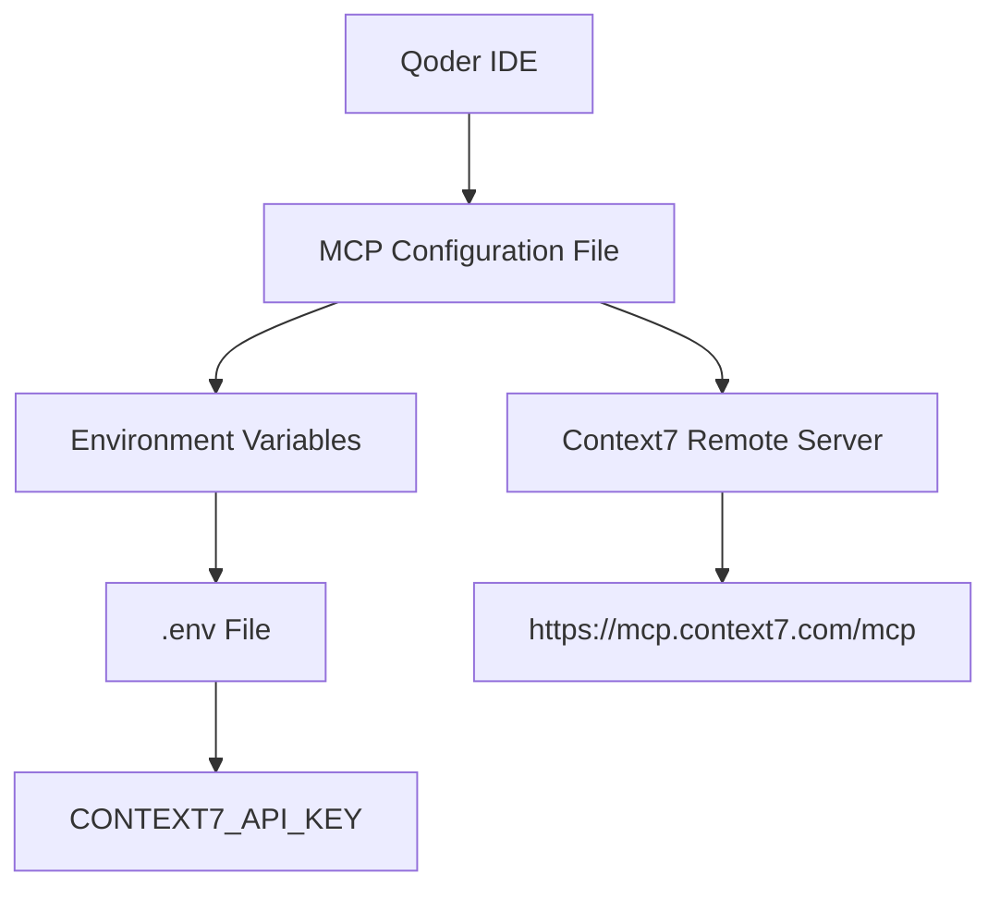
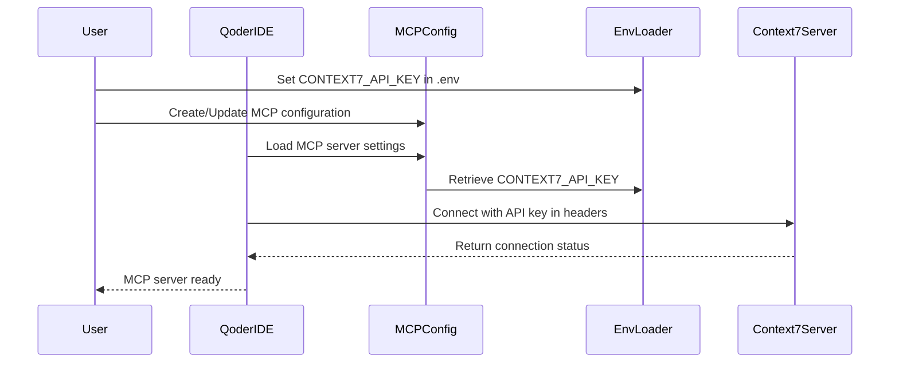
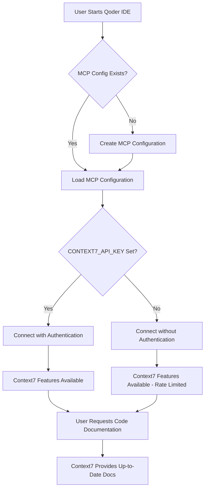

# Configure Context7 MCP Server in Qoder IDE

## Objective

Integrate Context7 MCP (Model Context Protocol) server into Qoder IDE to provide developers with up-to-date, version-specific documentation and code examples during AI-assisted development workflows. This integration will enable the LLMHub project users to access current library documentation without relying on potentially outdated LLM training data.

## Background

Context7 is an MCP server that fetches up-to-date, version-specific documentation and code examples from source repositories. When integrated with AI development environments, it eliminates common issues such as:

- Outdated code examples based on old training data
- Hallucinated APIs that no longer exist
- Generic answers for deprecated package versions

The Context7 MCP server operates in two modes:
- **Remote Server**: Connects to hosted service at `https://mcp.context7.com/mcp`
- **Local Server**: Runs locally via npx command

For this integration, the remote server approach is selected for simplicity and reduced local dependency management.

## Scope

### In Scope

- Add Context7 MCP server configuration capability to Qoder IDE
- Implement environment-based API key management for Context7
- Update environment variable documentation with Context7 configuration
- Provide configuration template for Qoder IDE MCP integration

### Out of Scope

- Local server installation and management
- Custom Context7 API backend modifications
- Integration with LLMHub CLI runtime (separate feature consideration)
- Automatic rule creation for auto-invoking Context7

## Requirements

### Functional Requirements

1. **MCP Configuration Structure**
   - Define MCP server configuration schema compatible with Qoder IDE
   - Support remote HTTP-based MCP server connection
   - Enable header-based authentication using API key

2. **Environment Variable Management**
   - Add `CONTEXT7_API_KEY` environment variable to project configuration
   - Document optional nature of API key (basic usage vs. enhanced features)
   - Follow existing environment variable patterns in the project

3. **Configuration File**
   - Create or document Qoder-specific MCP configuration file location
   - Provide clear JSON configuration structure
   - Ensure configuration follows Qoder IDE conventions

4. **Documentation**
   - Update `.env.example` with Context7 API key placeholder
   - Document configuration steps in appropriate project documentation
   - Provide guidance on obtaining Context7 API key

### Non-Functional Requirements

1. **Security**
   - Store API key in environment variable, never in version control
   - Ensure `.env` file remains in `.gitignore`
   - Use secure HTTPS connection to remote MCP server

2. **Usability**
   - Configuration should require minimal steps
   - Clear error messaging when API key is missing or invalid
   - Compatible with existing LLMHub environment setup

3. **Maintainability**
   - Configuration structure should align with Qoder IDE standards
   - Easy to update MCP server URL if service endpoint changes
   - Version compatibility considerations documented

## System Design

### Configuration Architecture

The Context7 MCP integration follows a layered configuration approach:



### Configuration Flow



### Configuration Components

#### MCP Configuration File Structure

The Qoder IDE MCP configuration will follow this structure:

| Field | Type | Description | Required |
|-------|------|-------------|----------|
| mcpServers | Object | Container for all MCP server definitions | Yes |
| mcpServers.context7 | Object | Context7-specific configuration | Yes |
| mcpServers.context7.url | String | Remote MCP server endpoint URL | Yes |
| mcpServers.context7.headers | Object | HTTP headers for authentication | No |
| mcpServers.context7.headers.CONTEXT7_API_KEY | String | API key for enhanced access | No |

#### Environment Variable Schema

| Variable Name | Purpose | Default Value | Required |
|---------------|---------|---------------|----------|
| CONTEXT7_API_KEY | Authentication token for Context7 MCP service | (none) | No |

**Value Source**: User obtains key from https://context7.com/dashboard after account creation

**Behavior Without Key**: Service operates with rate-limited, public-only repository access

### File Modifications

#### .env.example Enhancement

The environment example file will be extended to include Context7 configuration:

**Addition Location**: After existing LLM provider API keys section

**New Content Structure**:
- Section header for MCP Server Configuration
- Context7 API key variable with placeholder
- Comment explaining optional nature and benefits of API key
- Link to Context7 dashboard for key generation

#### Qoder IDE MCP Configuration

**Configuration File Location**: Based on Qoder IDE standards (to be determined - likely `.qoder/mcp.json` or similar)

**Configuration Content**:
- JSON structure defining Context7 as remote MCP server
- URL pointing to `https://mcp.context7.com/mcp`
- Header configuration referencing `CONTEXT7_API_KEY` environment variable
- Server enabled by default

### Integration Points

#### Environment Variable Loading

**Requirement**: Qoder IDE must support environment variable substitution in MCP configuration headers

**Mechanism**: Standard environment variable expansion (e.g., `${CONTEXT7_API_KEY}` or direct reference)

**Fallback Behavior**: If variable not set, header should be omitted or sent empty (Context7 supports keyless operation)

#### Connection Validation

**Validation Trigger**: When Qoder IDE initializes MCP servers

**Success Criteria**:
- Successful HTTP connection to remote endpoint
- Valid response from Context7 MCP server
- Authentication accepted (if API key provided)

**Error Handling**:
- Connection failure: Log warning, disable Context7 features
- Invalid API key: Notify user, fall back to unauthenticated access
- Network timeout: Retry with exponential backoff

### Usage Workflow



## Configuration Steps

### Step 1: Environment Variable Setup

**Action**: Add Context7 API key to environment configuration

**Process**:
1. Copy `.env.example` to `.env` if not already present
2. Locate the MCP Server Configuration section
3. Uncomment and set `CONTEXT7_API_KEY` variable
4. Save the file

**Optional**: Users may skip this step to use Context7 without authentication (limited features)

### Step 2: MCP Server Configuration

**Action**: Create or update Qoder IDE MCP configuration file

**Process**:
1. Identify Qoder IDE MCP configuration file location
2. Add Context7 server definition with remote URL
3. Configure header to pass API key from environment
4. Save and validate JSON structure

**Configuration Template**: Provided in documentation with placeholders

### Step 3: Verification

**Action**: Confirm Context7 MCP server is operational

**Process**:
1. Restart Qoder IDE to load new configuration
2. Check MCP server status in Qoder IDE interface
3. Test Context7 by requesting documentation in a prompt
4. Verify up-to-date documentation is retrieved

**Success Indicator**: Context7 successfully retrieves current library documentation when invoked

## Configuration Reference

### Remote MCP Server Configuration Template

```
Configuration Type: Remote HTTP MCP Server
Protocol: HTTPS
Authentication Method: Header-based with API key
Fallback: Unauthenticated access supported

Structure:
- Server Name: context7
- Connection URL: https://mcp.context7.com/mcp
- Authentication Header: CONTEXT7_API_KEY
- Header Value Source: Environment variable
```

### API Key Management

**Obtaining API Key**:
1. Visit https://context7.com/dashboard
2. Create account or sign in
3. Navigate to API key section
4. Generate new API key
5. Copy key to `.env` file

**API Key Benefits**:
- Higher rate limits for documentation requests
- Access to private repository documentation
- Priority support and features

**Without API Key**:
- Basic functionality maintained
- Rate limiting applies
- Public repositories only

## Security Considerations

### API Key Protection

**Storage**: API keys must only be stored in `.env` file, never committed to version control

**Access Control**: Ensure `.env` file has appropriate file system permissions (read-only for user)

**Transmission**: API key transmitted over HTTPS only, included in request headers

### Connection Security

**Protocol**: HTTPS required for all Context7 MCP communications

**Certificate Validation**: Qoder IDE should validate SSL/TLS certificates

**Timeout Configuration**: Implement reasonable timeout values to prevent hanging connections

## Error Handling

### Common Issues and Responses

| Issue | Detection | Response | User Notification |
|-------|-----------|----------|-------------------|
| Missing MCP Configuration | IDE startup | Create default configuration or prompt user | Inform user MCP setup needed |
| Invalid API Key | First Context7 request | Fall back to unauthenticated access | Warn about limited features |
| Network Connectivity Failure | Connection attempt | Retry with backoff, then disable | Alert user Context7 unavailable |
| Service Unavailable | HTTP 5xx response | Temporary disable, retry later | Notify temporary outage |
| Rate Limit Exceeded | HTTP 429 response | Queue requests or notify user | Suggest API key or wait time |

### Graceful Degradation

**Principle**: Context7 unavailability should not prevent Qoder IDE from functioning

**Strategy**:
- Context7 features marked as optional enhancement
- LLM continues operating with training data if Context7 fails
- Clear indication when Context7 is offline vs. online

## Testing Considerations

### Configuration Validation

**Test Case 1: Valid Configuration with API Key**
- Verify MCP configuration loads successfully
- Confirm API key read from environment
- Validate successful connection to Context7 server

**Test Case 2: Valid Configuration without API Key**
- Verify MCP configuration loads successfully
- Confirm connection works without authentication
- Validate basic features available

**Test Case 3: Invalid API Key**
- Verify system detects invalid key
- Confirm graceful fallback to unauthenticated mode
- Validate appropriate user notification

### Functional Validation

**Test Case 4: Documentation Retrieval**
- Request documentation for a known library
- Verify Context7 returns up-to-date information
- Confirm information integrated into LLM context

**Test Case 5: Error Recovery**
- Simulate network failure during Context7 request
- Verify system handles error gracefully
- Confirm LLM continues functioning

## Documentation Updates Required

### .env.example File

**Section to Add**:
- Header: MCP Server Configuration
- Context7 API key variable definition
- Comment explaining optional nature
- Link to Context7 dashboard

### README or Setup Guide

**Content to Add**:
- Brief explanation of Context7 MCP integration
- Link to Context7 documentation
- Instructions for obtaining API key
- Configuration steps summary

### User Documentation

**Topics to Cover**:
- What is Context7 and why it's beneficial
- How to enable Context7 in Qoder IDE
- When to use Context7 vs. standard LLM responses
- Troubleshooting common Context7 issues

## Dependencies

### External Services

- **Context7 MCP Server**: `https://mcp.context7.com/mcp`
- **Context7 Dashboard**: `https://context7.com/dashboard`

### Qoder IDE Requirements

- MCP protocol support
- HTTP/HTTPS client capability
- Environment variable loading
- JSON configuration parsing

### Project Dependencies

- Existing `.env` file structure
- `.gitignore` configuration (already includes .env)
- Documentation infrastructure

## Future Enhancements

### Potential Improvements

1. **Auto-Invocation Rules**
   - Add configuration for automatic Context7 invocation
   - Define triggers for when Context7 should be queried
   - Integrate with Qoder IDE rule system

2. **Caching Layer**
   - Cache frequently requested documentation locally
   - Reduce API calls and improve response time
   - Implement TTL-based cache invalidation

3. **Local Server Option**
   - Document local Context7 MCP server setup
   - Provide configuration for npx-based local installation
   - Support offline development scenarios

4. **Usage Analytics**
   - Track Context7 usage patterns
   - Identify most frequently requested documentation
   - Optimize integration based on usage data

5. **Multi-MCP Support**
   - Design configuration to support multiple MCP servers
   - Enable Context7 alongside other MCP providers
   - Implement MCP server priority and fallback logic

## Success Criteria

The Context7 MCP integration will be considered successful when:

1. **Configuration Completeness**: MCP configuration file structure is defined and documented
2. **Environment Integration**: CONTEXT7_API_KEY is added to `.env.example` with clear documentation
3. **Functional Connectivity**: Qoder IDE can successfully connect to Context7 remote server
4. **Authentication Working**: API key authentication functions correctly when key is provided
5. **Fallback Functional**: System operates gracefully without API key (rate-limited mode)
6. **Documentation Complete**: All setup steps are clearly documented for users
7. **Error Handling**: Common failure scenarios handled gracefully without disrupting IDE

## Risk Assessment

| Risk | Likelihood | Impact | Mitigation |
|------|-----------|---------|------------|
| Qoder IDE MCP format incompatibility | Medium | High | Research Qoder MCP spec early; validate with test config |
| Context7 service unavailability | Low | Medium | Implement graceful degradation; document offline behavior |
| API key security breach | Low | Medium | Enforce .env.example pattern; security documentation |
| User confusion in setup | Medium | Low | Provide clear step-by-step documentation; examples |
| Environment variable not loading | Low | High | Validate environment loading mechanism; error messages |

## Confidence Assessment

**Confidence Level**: High

**Confidence Basis**:
- Context7 MCP server provides well-documented integration patterns for multiple IDEs
- Remote server configuration is simpler and more reliable than local installation
- Project already has established environment variable management patterns
- MCP protocol is standardized across IDE implementations
- Clear examples exist from similar IDE integrations (Cursor, Windsurf, VSCode)

**Key Assumptions**:
- Qoder IDE supports standard MCP protocol and remote HTTP connections
- Environment variable substitution in configuration is supported by Qoder
- Qoder IDE configuration follows similar patterns to other modern AI IDEs

**Minor Unknowns**:
- Exact Qoder IDE MCP configuration file location (needs verification)
- Specific Qoder IDE environment variable substitution syntax (may need adjustment)
- Qoder-specific error handling preferences (can adopt standard patterns)
   - Support offline development scenarios

4. **Usage Analytics**
   - Track Context7 usage patterns
   - Identify most frequently requested documentation
   - Optimize integration based on usage data

5. **Multi-MCP Support**
   - Design configuration to support multiple MCP servers
   - Enable Context7 alongside other MCP providers
   - Implement MCP server priority and fallback logic

## Success Criteria

The Context7 MCP integration will be considered successful when:

1. **Configuration Completeness**: MCP configuration file structure is defined and documented
2. **Environment Integration**: CONTEXT7_API_KEY is added to `.env.example` with clear documentation
3. **Functional Connectivity**: Qoder IDE can successfully connect to Context7 remote server
4. **Authentication Working**: API key authentication functions correctly when key is provided
5. **Fallback Functional**: System operates gracefully without API key (rate-limited mode)
6. **Documentation Complete**: All setup steps are clearly documented for users
7. **Error Handling**: Common failure scenarios handled gracefully without disrupting IDE

## Risk Assessment

| Risk | Likelihood | Impact | Mitigation |
|------|-----------|---------|------------|
| Qoder IDE MCP format incompatibility | Medium | High | Research Qoder MCP spec early; validate with test config |
| Context7 service unavailability | Low | Medium | Implement graceful degradation; document offline behavior |
| API key security breach | Low | Medium | Enforce .env.example pattern; security documentation |
| User confusion in setup | Medium | Low | Provide clear step-by-step documentation; examples |
| Environment variable not loading | Low | High | Validate environment loading mechanism; error messages |

## Confidence Assessment

**Confidence Level**: High

**Confidence Basis**:
- Context7 MCP server provides well-documented integration patterns for multiple IDEs
- Remote server configuration is simpler and more reliable than local installation
- Project already has established environment variable management patterns
- MCP protocol is standardized across IDE implementations
- Clear examples exist from similar IDE integrations (Cursor, Windsurf, VSCode)

**Key Assumptions**:
- Qoder IDE supports standard MCP protocol and remote HTTP connections
- Environment variable substitution in configuration is supported by Qoder
- Qoder IDE configuration follows similar patterns to other modern AI IDEs

**Minor Unknowns**:
- Exact Qoder IDE MCP configuration file location (needs verification)
- Specific Qoder IDE environment variable substitution syntax (may need adjustment)
- Qoder-specific error handling preferences (can adopt standard patterns)
   - Provide configuration for npx-based local installation
