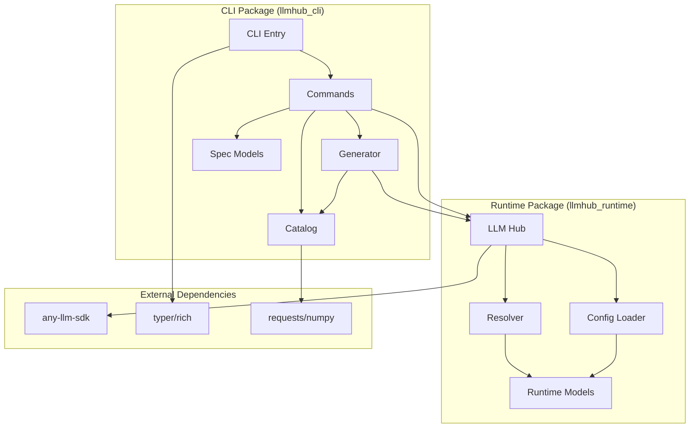

# Repository Structure Reorganization Design

## Context and Current State

### Current Package Names
- **PyPI Package 1**: `rethink-llmhub-runtime` (production runtime library)
- **PyPI Package 2**: `rethink-llmhub` (development CLI and tooling)

### Current Directory Structure
```
llm-hub/
├── packages/
│   ├── llmhub_runtime/        # Runtime library (lightweight)
│   │   ├── src/llmhub_runtime/
│   │   ├── tests/
│   │   ├── pyproject.toml
│   │   └── README.md
│   └── llmhub/                # CLI and development tools (heavy)
│       ├── src/llmhub/
│       │   ├── catalog/       # Model catalog system
│       │   ├── commands/      # CLI commands
│       │   ├── generator/     # Spec → Runtime generator (SP1-SP10)
│       │   ├── tools/         # Development utilities
│       │   ├── PLANS/         # Planning documents
│       │   └── core modules
│       ├── tests/
│       ├── pyproject.toml
│       └── README.md
```

### Identified Issues

1. **Blurred Separation of Concerns**
   - Generator logic exists in `llmhub` but is tightly coupled to runtime
   - Catalog system unclear ownership (is it dev-only or runtime-accessible?)
   - Some core modules have unclear package ownership

2. **Naming Inconsistencies**
   - PyPI name `rethink-llmhub` vs directory name `llmhub`
   - Runtime imports use `llmhub_runtime` but CLI uses `llmhub`
   - Package naming doesn't clearly signal "production" vs "development"

3. **Dependency Confusion**
   - `llmhub` depends on `llmhub-runtime` (correct)
   - But runtime might need catalog access (unclear)
   - Generator requires runtime hub instance (circular concern)

4. **Documentation Fragmentation**
   - Root README tries to cover both packages
   - Individual package READMEs overlap
   - Unclear which README is authoritative for what audience

5. **Testing and Release Independence**
   - Both packages released together currently
   - Individual package release process exists but unclear
   - Test reports mixed between packages

## Design Goals

### 1. Clear Production vs Development Separation
- **Production Package** (`llmhub-runtime`): Lightweight, stable, minimal dependencies
- **Development Package** (`rethink-llmhub`): Full-featured, CLI-based, development tools

### 2. Logical Module Organization
- Each module has a single clear owner (runtime or CLI)
- Dependencies flow in one direction only (CLI → Runtime, never reverse)
- Shared concerns extracted to appropriate layer

### 3. Independent Documentation Strategy
- Each package has standalone, audience-specific documentation
- Root README serves as project overview and navigation
- No overlapping or duplicate content

### 4. Scalable Release Process
- Packages can be released independently
- Version synchronization optional but configurable
- Clear release criteria for each package

## Proposed Repository Structure

### Directory Layout
```
llm-hub/
├── packages/
│   ├── runtime/                      # Production runtime library
│   │   ├── src/llmhub_runtime/
│   │   │   ├── __init__.py
│   │   │   ├── hub.py              # Core execution hub
│   │   │   ├── resolver.py         # Role resolution
│   │   │   ├── config_loader.py    # Config parsing
│   │   │   ├── models.py           # Data models
│   │   │   └── errors.py           # Runtime errors
│   │   ├── tests/
│   │   │   ├── fixtures/
│   │   │   └── test_*.py
│   │   ├── docs/
│   │   │   ├── README.md           # Runtime usage guide
│   │   │   ├── API.md              # API reference
│   │   │   └── examples/
│   │   ├── pyproject.toml
│   │   └── CHANGELOG.md
│   │
│   └── cli/                          # Development CLI and tools
│       ├── src/llmhub_cli/
│       │   ├── __init__.py
│       │   ├── cli.py              # Main CLI entry
│       │   ├── context.py          # Project context
│       │   ├── spec_models.py      # Spec schemas
│       │   ├── runtime_io.py       # Runtime config I/O
│       │   ├── env_manager.py      # Environment management
│       │   ├── ux.py               # CLI UX utilities
│       │   │
│       │   ├── commands/           # CLI command implementations
│       │   │   ├── __init__.py
│       │   │   ├── setup.py
│       │   │   ├── spec.py
│       │   │   ├── runtime.py
│       │   │   ├── env.py
│       │   │   ├── catalog.py
│       │   │   └── test.py
│       │   │
│       │   ├── catalog/            # Catalog system
│       │   │   ├── __init__.py
│       │   │   ├── schema.py
│       │   │   ├── builder.py
│       │   │   ├── cache.py
│       │   │   ├── mapper.py
│       │   │   ├── sources/
│       │   │   │   ├── anyllm.py
│       │   │   │   ├── modelsdev.py
│       │   │   │   └── arena.py
│       │   │   └── data/
│       │   │       └── overrides.json
│       │   │
│       │   ├── generator/          # Spec → Runtime generator
│       │   │   ├── __init__.py
│       │   │   ├── orchestrator.py # Main generation orchestrator
│       │   │   ├── spec/
│       │   │   │   ├── parser.py   # SP1: Spec parsing
│       │   │   │   └── models.py
│       │   │   ├── needs/
│       │   │   │   ├── interpreter.py  # SP2: LLM interpretation
│       │   │   │   ├── schema.py       # SP3: Needs schema
│       │   │   │   └── models.py
│       │   │   ├── selection/
│       │   │   │   ├── filter.py       # SP5: Filtering
│       │   │   │   ├── weights.py      # SP6: Weight calculation
│       │   │   │   ├── scorer.py       # SP7: Scoring
│       │   │   │   ├── relaxer.py      # SP8: Relaxation
│       │   │   │   └── selector.py     # SP9: Selection orchestration
│       │   │   ├── catalog_view/       # SP4: Catalog loading
│       │   │   │   └── loader.py
│       │   │   ├── emitter/            # SP10: Config emission
│       │   │   │   ├── builder.py
│       │   │   │   └── models.py
│       │   │   └── docs/
│       │   │       └── PIPELINE.md
│       │   │
│       │   └── tools/              # Development utilities
│       │       ├── __init__.py
│       │       └── test_reporter.py
│       │
│       ├── tests/
│       │   ├── unit/
│       │   │   ├── test_cli/
│       │   │   ├── test_catalog/
│       │   │   └── test_generator/
│       │   ├── integration/
│       │   └── e2e/
│       │
│       ├── docs/
│       │   ├── README.md           # CLI usage guide
│       │   ├── COMMANDS.md         # Command reference
│       │   ├── GENERATOR.md        # Generator documentation
│       │   ├── CATALOG.md          # Catalog system docs
│       │   └── examples/
│       │
│       ├── pyproject.toml
│       └── CHANGELOG.md
│
├── docs/                             # Project-level documentation
│   ├── README.md                     # Project overview
│   ├── ARCHITECTURE.md               # System architecture
│   ├── GETTING_STARTED.md           # Quick start guide
│   ├── WORKFLOWS.md                 # Common workflows
│   └── CONTRIBUTING.md              # Contribution guide
│
├── scripts/                          # Build and release scripts
│   ├── release.py
│   └── sync_versions.py
│
├── reports/                          # Test execution reports
│   └── test-execution/
│
├── .github/
│   └── workflows/
│       ├── test-runtime.yml
│       ├── test-cli.yml
│       ├── release-runtime.yml
│       └── release-cli.yml
│
├── Makefile
├── pytest.ini
├── .gitignore
└── README.md                         # Root project README
```

### Key Structural Changes

#### 1. Package Directory Renaming
| Current | Proposed | Rationale |
|---------|----------|-----------|
| `packages/llmhub_runtime/` | `packages/runtime/` | Clearer, shorter, emphasizes purpose |
| `packages/llmhub/` | `packages/cli/` | Aligns with PyPI name concept (dev tools) |

#### 2. Source Code Namespace Alignment
| Package | PyPI Name | Import Namespace | Directory |
|---------|-----------|------------------|-----------|
| Runtime | `rethink-llmhub-runtime` | `llmhub_runtime` | `packages/runtime/src/llmhub_runtime/` |
| CLI | `rethink-llmhub` | `llmhub_cli` | `packages/cli/src/llmhub_cli/` |

**Issue**: Current CLI uses `llmhub` namespace but PyPI is `rethink-llmhub`

**Resolution Options**:

**Option A** (Recommended): Rename CLI namespace to `llmhub_cli`
- Import statements: `from llmhub_cli import ...`
- Binary name stays: `llmhub` (via console_scripts)
- Clear distinction from runtime

**Option B**: Keep `llmhub` namespace but clarify via documentation
- Import statements: `from llmhub import ...` (CLI)
- Runtime: `from llmhub_runtime import ...`
- Risk: confusion between packages

**Option C**: Unify under `llmhub` parent namespace
- Runtime: `from llmhub.runtime import ...`
- CLI: `from llmhub.cli import ...`
- Requires namespace package setup

**Decision**: Option A provides clearest separation

#### 3. Generator Module Reorganization

**Current Structure** (Flat SP1-SP10):
```
generator/
├── sp1_spec_schema/
├── sp2_needs_interpreter/
├── sp3_needs_schema/
├── sp4_catalog_view/
├── sp5_filter_candidates/
├── sp6_weights/
├── sp7_scoring_engine/
├── sp8_relaxation_engine/
├── sp9_selector_orchestrator/
└── sp10_machine_config_emitter/
```

**Proposed Structure** (Functional Grouping):
```
generator/
├── __init__.py
├── orchestrator.py              # Main pipeline coordinator
├── spec/                        # SP1: Input parsing
│   ├── parser.py
│   └── models.py
├── needs/                       # SP2-SP3: Needs interpretation
│   ├── interpreter.py
│   ├── schema.py
│   └── models.py
├── catalog_view/                # SP4: Catalog integration
│   └── loader.py
├── selection/                   # SP5-SP9: Model selection engine
│   ├── filter.py
│   ├── weights.py
│   ├── scorer.py
│   ├── relaxer.py
│   └── selector.py
├── emitter/                     # SP10: Output generation
│   ├── builder.py
│   └── models.py
└── docs/
    └── PIPELINE.md
```

**Benefits**:
- Logical grouping by function rather than sequential numbering
- Easier to understand high-level flow
- Clearer module responsibilities
- Better discoverability

#### 4. Catalog System Refinement

**Current Issues**:
- Catalog exists in CLI package
- Runtime might need catalog metadata
- Unclear if catalog is dev-only or runtime feature

**Proposed Architecture**:

**Catalog stays in CLI package** because:
- Heavy dependencies (requests, numpy)
- External API calls (models.dev, arena)
- Caching and file I/O
- Development/configuration-time concern

**Runtime accesses catalog results via**:
- Generated `llmhub.yaml` contains pre-selected models
- No direct catalog access needed at runtime
- Runtime remains lightweight

**Catalog Module Structure**:
```
cli/src/llmhub_cli/catalog/
├── __init__.py
├── schema.py               # CanonicalModel definition
├── builder.py             # Catalog builder
├── cache.py              # Caching logic
├── mapper.py            # ID mapping
├── sources/            # Data source integrations
│   ├── __init__.py
│   ├── anyllm.py
│   ├── modelsdev.py
│   └── arena.py
└── data/
    └── overrides.json
```

## Module Ownership Matrix

| Module | Owner Package | Access From Other | Rationale |
|--------|---------------|-------------------|-----------|
| Runtime Hub | Runtime | CLI (import) | Core execution engine |
| Config Loader | Runtime | CLI (import) | Runtime reads config |
| Resolver | Runtime | CLI (import) | Role resolution |
| Models (Runtime) | Runtime | CLI (import) | Shared data structures |
| CLI Commands | CLI | - | Development interface |
| Catalog System | CLI | - | Dev-time model discovery |
| Generator Pipeline | CLI | - | Config generation |
| Spec Models | CLI | - | Spec parsing and validation |
| Context Resolution | CLI | - | Project file discovery |
| Environment Manager | CLI | - | .env management |
| UX Utilities | CLI | - | Terminal formatting |

## Dependency Flow



**Principles**:
- CLI depends on Runtime (allowed)
- Runtime never depends on CLI (strict)
- External dependencies isolated to appropriate package
- No circular dependencies

## Documentation Strategy

### Root-Level Documentation

**Purpose**: Project overview and navigation hub

**Structure**:
```
docs/
├── README.md                  # What is LLM Hub? (both packages)
├── ARCHITECTURE.md            # System design and concepts
├── GETTING_STARTED.md        # Quick start for both audiences
├── WORKFLOWS.md              # Common usage patterns
└── CONTRIBUTING.md           # Development guidelines
```

**Content Guidelines**:
- Audience: Developers evaluating or contributing to the project
- Covers both packages at conceptual level
- Links to package-specific docs for details
- Explains separation of concerns

### Runtime Package Documentation

**Purpose**: Guide for production users integrating the runtime

**Structure**:
```
packages/runtime/docs/
├── README.md                  # Runtime overview and installation
├── API.md                    # Complete API reference
├── CONFIGURATION.md          # llmhub.yaml format
├── HOOKS.md                  # Observability hooks
└── examples/
    ├── basic_usage.py
    ├── with_hooks.py
    └── multi_environment.py
```

**Content Guidelines**:
- Audience: Application developers using the runtime library
- Focus: Integration, API usage, configuration format
- Assumes generated config exists (doesn't cover CLI)
- Production-focused examples

### CLI Package Documentation

**Purpose**: Guide for developers using CLI tools

**Structure**:
```
packages/cli/docs/
├── README.md                  # CLI overview and installation
├── COMMANDS.md               # Complete command reference
├── SPEC_FORMAT.md           # llmhub.spec.yaml format
├── GENERATOR.md             # How generation works
├── CATALOG.md               # Catalog system details
└── examples/
    ├── simple_project/
    ├── multi_environment/
    └── custom_generator/
```

**Content Guidelines**:
- Audience: Developers configuring LLM applications
- Focus: CLI usage, spec writing, workflow
- Development and configuration focused
- End-to-end examples with CLI commands

### Root README.md

**Proposed Structure**:
```markdown
# LLM Hub

Config-driven LLM management with production runtime and development tools

## What is LLM Hub?

Brief overview of the problem and solution

## Packages

### rethink-llmhub-runtime (Production)
- Lightweight runtime library
- Link to runtime docs
- Installation: `pip install rethink-llmhub-runtime`

### rethink-llmhub (Development)
- CLI and configuration tools
- Link to CLI docs
- Installation: `pip install rethink-llmhub`

## Quick Start

### For Production Users (Runtime Only)
Brief example of using runtime with existing config

### For Development (Full Suite)
Brief example of CLI workflow

## Documentation

- [Architecture](docs/ARCHITECTURE.md)
- [Getting Started](docs/GETTING_STARTED.md)
- [Runtime Docs](packages/runtime/docs/README.md)
- [CLI Docs](packages/cli/docs/README.md)

## Contributing

Link to contributing guide
```

## Migration Path

### Phase 1: Structural Preparation

#### Step 1.1: Create New Directory Structure
- Create `packages/runtime/` and `packages/cli/`
- Create documentation directories
- Set up new test structures

#### Step 1.2: Update Python Namespace
- Rename `llmhub` imports to `llmhub_cli`
- Update all import statements
- Update pyproject.toml namespace declarations
- Keep console_scripts as `llmhub = "llmhub_cli.cli:app"`

#### Step 1.3: Move Runtime Files
**Move without modification**:
```
llmhub_runtime/* → packages/runtime/src/llmhub_runtime/*
```

No code changes needed (namespace already correct)

#### Step 1.4: Move and Reorganize CLI Files

**Core CLI Modules**:
```
llmhub/cli.py → cli/src/llmhub_cli/cli.py
llmhub/context.py → cli/src/llmhub_cli/context.py
llmhub/spec_models.py → cli/src/llmhub_cli/spec_models.py
llmhub/runtime_io.py → cli/src/llmhub_cli/runtime_io.py
llmhub/env_manager.py → cli/src/llmhub_cli/env_manager.py
llmhub/ux.py → cli/src/llmhub_cli/ux.py
```

**Commands**:
```
llmhub/commands/* → cli/src/llmhub_cli/commands/*
(Rename files: *_cmd.py → *.py)
```

**Catalog** (no structural change):
```
llmhub/catalog/* → cli/src/llmhub_cli/catalog/*
(Split sources into sources/ subdirectory)
```

**Generator** (reorganize):
```
llmhub/generator/sp1_spec_schema/* → cli/src/llmhub_cli/generator/spec/
llmhub/generator/sp2_needs_interpreter/* → cli/src/llmhub_cli/generator/needs/interpreter.py
llmhub/generator/sp3_needs_schema/* → cli/src/llmhub_cli/generator/needs/schema.py
llmhub/generator/sp4_catalog_view/* → cli/src/llmhub_cli/generator/catalog_view/
llmhub/generator/sp5_filter_candidates/* → cli/src/llmhub_cli/generator/selection/filter.py
llmhub/generator/sp6_weights/* → cli/src/llmhub_cli/generator/selection/weights.py
llmhub/generator/sp7_scoring_engine/* → cli/src/llmhub_cli/generator/selection/scorer.py
llmhub/generator/sp8_relaxation_engine/* → cli/src/llmhub_cli/generator/selection/relaxer.py
llmhub/generator/sp9_selector_orchestrator/* → cli/src/llmhub_cli/generator/selection/selector.py
llmhub/generator/sp10_machine_config_emitter/* → cli/src/llmhub_cli/generator/emitter/
```

**Tools**:
```
llmhub/tools/* → cli/src/llmhub_cli/tools/*
```

#### Step 1.5: Update Import Statements

**In CLI package files**, replace:
```python
# Old
from llmhub.catalog import builder
from llmhub.commands import setup_cmd
from llmhub.generator.sp1_spec_schema import parser

# New
from llmhub_cli.catalog import builder
from llmhub_cli.commands import setup
from llmhub_cli.generator.spec import parser
```

**Runtime imports stay the same** (already using `llmhub_runtime`)

#### Step 1.6: Update Tests

**Runtime tests**:
```
packages/llmhub_runtime/tests/* → packages/runtime/tests/*
```
Update imports to use `llmhub_runtime`

**CLI tests**:
```
packages/llmhub/tests/* → packages/cli/tests/
Organize into unit/, integration/, e2e/
```
Update imports to use `llmhub_cli`

### Phase 2: Configuration Updates

#### Step 2.1: Update pyproject.toml Files

**Runtime** (`packages/runtime/pyproject.toml`):
```toml
[project]
name = "rethink-llmhub-runtime"
# ... existing config ...

[tool.setuptools]
package-dir = {"" = "src"}
packages = ["llmhub_runtime"]
```

**CLI** (`packages/cli/pyproject.toml`):
```toml
[project]
name = "rethink-llmhub"
dependencies = [
    "rethink-llmhub-runtime>=1.0.3",
    # ... other deps ...
]

[project.scripts]
llmhub = "llmhub_cli.cli:app"

[tool.setuptools]
package-dir = {"" = "src"}
packages = [
    "llmhub_cli",
    "llmhub_cli.commands",
    "llmhub_cli.catalog",
    "llmhub_cli.catalog.sources",
    "llmhub_cli.generator",
    "llmhub_cli.generator.spec",
    "llmhub_cli.generator.needs",
    "llmhub_cli.generator.selection",
    "llmhub_cli.generator.catalog_view",
    "llmhub_cli.generator.emitter",
    "llmhub_cli.tools",
]
```

#### Step 2.2: Update pytest Configuration

**Root** `pytest.ini`:
```ini
[pytest]
testpaths = 
    packages/runtime/tests
    packages/cli/tests
python_files = test_*.py
python_classes = Test*
python_functions = test_*
```

**Package-specific** pytest configs if needed

#### Step 2.3: Update CI/CD Workflows

**Create separate workflows**:
- `.github/workflows/test-runtime.yml` - Test runtime only
- `.github/workflows/test-cli.yml` - Test CLI only
- `.github/workflows/release-runtime.yml` - Release runtime
- `.github/workflows/release-cli.yml` - Release CLI

**Test triggers**:
- Runtime: Changes in `packages/runtime/**`
- CLI: Changes in `packages/cli/**`

#### Step 2.4: Update Release Scripts

**Modify** `scripts/release.py`:
- Support `--package runtime` or `--package cli`
- Update paths to `packages/runtime/` and `packages/cli/`
- Default behavior: prompt which package to release
- Support releasing both with version sync option

### Phase 3: Documentation Migration

#### Step 3.1: Create Package Documentation

**Runtime**:
- Move relevant sections from current README
- Create API reference from docstrings
- Add production-focused examples

**CLI**:
- Move CLI sections from current README
- Create command reference
- Add workflow examples
- Document generator pipeline

#### Step 3.2: Create Root Documentation

- Create `docs/ARCHITECTURE.md` explaining package separation
- Create `docs/GETTING_STARTED.md` for both audiences
- Update root `README.md` to navigation hub

#### Step 3.3: Archive Old Docs

- Move current READMEs to `docs/archive/`
- Add migration notes explaining changes

### Phase 4: Validation and Testing

#### Step 4.1: Automated Validation

**Verification Script**:
```python
# scripts/validate_migration.py
def validate_imports():
    """Ensure no invalid import paths"""
    
def validate_namespaces():
    """Ensure no llmhub imports in CLI (should be llmhub_cli)"""
    
def validate_dependencies():
    """Ensure CLI depends on runtime, not vice versa"""
    
def validate_tests():
    """Ensure all tests pass with new structure"""
```

#### Step 4.2: Manual Testing Checklist

- Install runtime package independently
- Install CLI package with runtime dependency
- Run all CLI commands
- Run full test suite
- Generate sample project
- Test runtime with generated config
- Verify documentation links
- Test release process (dry-run)

#### Step 4.3: Backward Compatibility Testing

**Breaking Changes**:
- Import path changes: `llmhub.*` → `llmhub_cli.*`
- Package structure changes
- File locations

**Mitigation**:
- Provide migration guide
- Consider deprecation warnings for one release cycle
- Update all examples and documentation

### Phase 5: Rollout

#### Step 5.1: Release Preparation

- Update CHANGELOG for both packages
- Tag version as "restructure release"
- Create migration guide document
- Update all external references

#### Step 5.2: Release Execution

**Option A: Synchronized Release**
- Release both packages with same version bump
- Clear in release notes this is restructure release
- Both packages updated together

**Option B: Staged Release**
- Release runtime first (no breaking changes)
- Release CLI second (depends on new runtime)
- Users upgrade in sequence

**Recommendation**: Option A for clarity

#### Step 5.3: Post-Release

- Monitor for issues
- Update installation instructions
- Communicate changes to users
- Archive old package structure in git history

## File Renaming Summary

### Files to Rename

| Current Path | New Path | Type |
|-------------|----------|------|
| `packages/llmhub_runtime/` | `packages/runtime/` | Directory |
| `packages/llmhub/` | `packages/cli/` | Directory |
| `*/commands/*_cmd.py` | `*/commands/*.py` | Files (drop `_cmd` suffix) |
| Generator SP directories | Functional grouping | Reorganization |

### Import Statement Changes

**All CLI code files**:
```python
# Pattern replacement
s/from llmhub\./from llmhub_cli./g
s/import llmhub\./import llmhub_cli./g
```

**Generator imports**:
```python
# Old
from llmhub.generator.sp1_spec_schema.parser import SpecParser
from llmhub.generator.sp5_filter_candidates.filter import filter_models

# New  
from llmhub_cli.generator.spec.parser import SpecParser
from llmhub_cli.generator.selection.filter import filter_models
```

**Test imports**:
```python
# Old
from llmhub.catalog.builder import build_catalog
from llmhub.commands.catalog_cmd import catalog_show

# New
from llmhub_cli.catalog.builder import build_catalog
from llmhub_cli.commands.catalog import catalog_show
```

## Risk Assessment and Mitigation

### High-Risk Changes

#### 1. Import Path Changes
**Risk**: Breaking all existing code using the CLI

**Mitigation**:
- Comprehensive find-replace with verification
- Automated import validation script
- Full test suite execution before release
- Clear migration guide for users

#### 2. Generator Reorganization
**Risk**: Breaking existing generator logic

**Mitigation**:
- Maintain all module functionality
- Only change file locations and imports
- Extensive testing of generation pipeline
- Keep SP numbering in function/class names if helpful

#### 3. Dependency Resolution
**Risk**: Circular dependencies or broken imports

**Mitigation**:
- Validate dependency graph before migration
- Ensure CLI → Runtime flow maintained
- No runtime imports from CLI
- Test installation in clean environment

### Medium-Risk Changes

#### 1. Documentation Restructure
**Risk**: Broken links, confused users

**Mitigation**:
- Update all documentation links
- Provide navigation from old to new docs
- Keep old docs in archive with redirect notes
- Test all documentation links

#### 2. Test Organization
**Risk**: Lost test coverage, broken test discovery

**Mitigation**:
- Verify pytest discovery in new structure
- Ensure all tests accounted for in migration
- Run coverage reports before and after
- Update CI/CD test paths

#### 3. Release Process Changes
**Risk**: Unable to release packages independently

**Mitigation**:
- Test release script with dry-run
- Validate package builds before actual release
- Maintain version sync option
- Clear release documentation

### Low-Risk Changes

#### 1. Directory Renaming
**Risk**: Confusion about package location

**Mitigation**:
- Update all documentation and README files
- Clear naming convention
- Consistent with package purpose

#### 2. File Renaming
**Risk**: Lost git history

**Mitigation**:
- Use `git mv` for renames
- Document file movements
- Maintain commit messages explaining moves

## Success Criteria

### Structural Goals

- Runtime package contains only execution-related code
- CLI package contains all development tools
- No circular dependencies between packages
- Clear, logical directory structure
- Consistent naming throughout

### Functional Goals

- All existing functionality preserved
- All tests pass with new structure
- CLI commands work identically
- Runtime API unchanged
- Generator pipeline produces same output

### Documentation Goals

- Each package has standalone documentation
- Clear audience separation (production vs development)
- No overlapping or duplicate content
- Easy navigation between related docs
- Migration guide for existing users

### Release Goals

- Packages can be released independently
- Version management flexible (sync or independent)
- Release process documented and automated
- PyPI packages updated correctly

## Open Questions and Decisions Needed

### 1. Namespace Decision
**Question**: Use `llmhub_cli` or keep `llmhub` for CLI package?

**Recommendation**: Use `llmhub_cli` for clarity

**Trade-offs**:
- Pro: Clear distinction, no confusion
- Con: Longer import statements, breaking change

**Decision Required**: Confirm with team

### 2. Generator Reorganization Depth
**Question**: How aggressively should we reorganize generator internals?

**Options**:
- **Conservative**: Only rename directories, keep SP structure
- **Moderate** (Recommended): Functional grouping as proposed
- **Aggressive**: Flatten further, merge related SPs

**Decision Required**: Review with generator maintainers

### 3. Release Timing
**Question**: When to perform migration?

**Options**:
- **Next minor version**: v1.1.0 (breaking import changes)
- **Next major version**: v2.0.0 (major restructure)
- **Immediate**: v1.0.4 (rapid improvement)

**Recommendation**: Next minor version with clear communication

**Decision Required**: Product/release timeline

### 4. Backward Compatibility
**Question**: Should we provide temporary backward compatibility?

**Options**:
- **No compatibility**: Clean break, migration guide only
- **Deprecation warnings**: One release with warnings, then remove
- **Aliasing**: Permanent aliases for old imports (not recommended)

**Recommendation**: Clean break with comprehensive migration guide

**Decision Required**: User impact tolerance

### 5. Documentation Hosting
**Question**: Where should documentation ultimately live?

**Options**:
- **GitHub README files** (current)
- **GitHub Pages** (static site)
- **Read the Docs** (versioned docs)
- **Custom docs site**

**Recommendation**: Start with improved README structure, migrate to Read the Docs later

**Decision Required**: Documentation strategy
