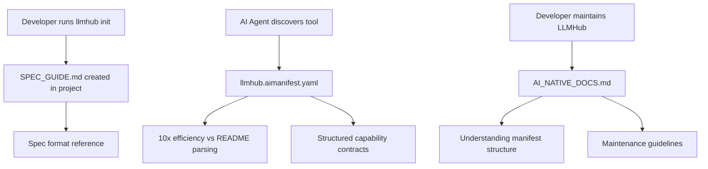

# Design: Update AI Manifest and Documentation Strategy

## Context

LLM Hub currently has two forms of AI-native documentation:
1. **`llmhub.aimanifest.yaml`** - Machine-first structured capability documentation (1,124 lines)
2. **`AI_NATIVE_DOCS.md`** - Human-readable summary of the AI-native documentation implementation (382 lines)

Additionally, the `llmhub init` command generates a `SPEC_GUIDE.md` file to help developers understand the spec format. This design addresses:
- Updating both documentation files with latest project changes
- Clarifying the purpose and relationship between these files
- Determining which document should be auto-generated during `llmhub init`

## Current State Analysis

### Existing Documentation Files

| File | Purpose | Audience | Location | Auto-Generated |
|------|---------|----------|----------|----------------|
| `llmhub.aimanifest.yaml` | Structured capability manifest for AI agents | AI agents (primary), Developers (reference) | Repository root | No |
| `AI_NATIVE_DOCS.md` | Implementation summary and guide | Developers, Maintainers | Repository root | No |
| `SPEC_GUIDE.md` | Quick reference for spec file format | Developers, AI agents | Project root (user's project) | Yes (via `llmhub init`) |

### Document Relationships



## Analysis: Document Purposes and Necessity

### llmhub.aimanifest.yaml
**Purpose**: Machine-first, queryable capability documentation
- **Primary audience**: AI agents integrating LLM Hub
- **Secondary audience**: Developers seeking structured reference
- **Value proposition**: 10x token efficiency for task-specific queries
- **Maintenance frequency**: With every capability/schema change
- **Verdict**: **Essential** - Core infrastructure for AI-native tooling

### AI_NATIVE_DOCS.md
**Purpose**: Human-readable explanation of AI-native approach
- **Audience**: Developers, maintainers, contributors
- **Content**: Implementation rationale, maintenance guidelines, validation instructions
- **Value**: Onboarding context, design decisions, success metrics
- **Maintenance frequency**: Quarterly or with major manifest updates
- **Verdict**: **Essential** - Bridges human understanding with AI-native approach

### SPEC_GUIDE.md
**Purpose**: Quick reference for spec file syntax and conventions
- **Audience**: Developers using LLM Hub in their projects
- **Content**: Minimal guide to `llmhub.spec.yaml` structure
- **Generated**: Automatically during `llmhub init`
- **Maintenance**: Template stored in code, generated on demand
- **Verdict**: **Essential** - Improves onboarding experience

**Conclusion**: All three documents serve distinct purposes and should be maintained.

## Design Decisions

### Decision 1: Document Separation Strategy

**Chosen Approach**: Maintain all three documents with clear separation of concerns

| Concern | Document | Rationale |
|---------|----------|-----------|
| AI agent capability discovery | `llmhub.aimanifest.yaml` | Structured, queryable format optimized for token efficiency |
| Human understanding of AI-native approach | `AI_NATIVE_DOCS.md` | Context, rationale, maintenance workflows |
| User onboarding to spec format | `SPEC_GUIDE.md` | Project-specific quick reference |

### Decision 2: Auto-Generation During Init

**Chosen Approach**: Generate `SPEC_GUIDE.md` only (current behavior is correct)

**Rationale**:
- `SPEC_GUIDE.md` is user-facing and project-specific
- `llmhub.aimanifest.yaml` is tool-level documentation (belongs in LLM Hub repository)
- `AI_NATIVE_DOCS.md` is maintainer-focused (belongs in LLM Hub repository)

**Implementation**: No changes needed - current implementation already generates `SPEC_GUIDE.md` via `llmhub init`

### Decision 3: Version Synchronization

**Current gap**: Manifest version (1.0.3) must stay synchronized with package versions

**Strategy**:
- Validation script already checks version sync
- Update manifest version field when packages are released
- CI/CD integration prevents drift

## Updates Required

### Update 1: Synchronize llmhub.aimanifest.yaml

**Sections requiring updates**:

#### Section 1: Tool Identity
- Verify package versions match current releases
- Update documentation URLs if changed
- Confirm runtime requirements are current

#### Section 2: Capabilities Graph
**New/Updated capabilities to document**:

| Capability ID | Status | Update Required |
|---------------|--------|-----------------|
| `cli.init.project` | Existing | Add `SPEC_GUIDE.md` to created_files output |
| `cli.setup.project` | Missing | Document interactive setup command |
| `catalog.show` | Missing | Document catalog display command |
| `catalog.refresh` | Missing | Document catalog rebuild command |

**Capability additions**:

```yaml
- capability_id: cli.setup.project
  intent: Interactive project setup with guided configuration
  output_contract:
    - name: created_files
      type: array[string]
      description: Paths to created configuration files
      typical_value: ["llmhub.spec.yaml", ".env.example", "SPEC_GUIDE.md"]
  cost_model:
    latency: <2s (user interaction + file I/O)

- capability_id: catalog.show
  intent: Display model catalog with filtering options
  input_contract:
    - name: provider
      type: string
      required: false
      description: Filter catalog by provider
    - name: details
      type: boolean
      required: false
      description: Show detailed model information
  output_contract:
    - name: display
      type: formatted_table
      description: Rich table display of catalog entries

- capability_id: catalog.refresh
  intent: Force rebuild of model catalog bypassing cache
  output_contract:
    - name: catalog
      type: Catalog
      description: Freshly built catalog
  cost_model:
    latency: 5-15s (network calls to data sources)
```

#### Section 3: Configuration Schema
**Updates**:
- Verify all SpecConfig fields are documented
- Add any new configuration entities introduced
- Confirm validation rules are accurate

#### Section 4: Interaction Patterns
**New pattern to add**:

```yaml
- pattern_id: project_initialization
  intent: Bootstrap new LLM Hub project with configuration files
  state_transitions:
    - step: 1
      action: User runs "llmhub init" or "llmhub setup"
    - step: 2
      action: Create llmhub.spec.yaml with defaults
    - step: 3
      action: Generate .env.example with provider keys
    - step: 4
      action: Create SPEC_GUIDE.md reference document
    - step: 5
      action: Display next steps to user
  exit_conditions:
    - outcome: success
      returns: Configuration files created
```

#### Section 5: Dependency Graph
**Verify**:
- Runtime dependencies are current versions
- Environment dependencies include all supported providers
- External services list is complete

#### Section 7: Performance Characteristics
**Add**:
- CLI command latencies (init, setup, catalog operations)
- SPEC_GUIDE.md generation overhead (<10ms)

### Update 2: Enhance AI_NATIVE_DOCS.md

**Sections requiring updates**:

#### Files Created Section
Update to reflect current state:
```markdown
llmhub.aimanifest.yaml              # Main manifest (1,124 lines)
.aimanifest/README.md               # Usage documentation (if exists)
scripts/validate_manifest.py        # Validation script
examples/agent_manifest_usage.py    # Usage example
AI_NATIVE_DOCS.md                   # This summary
```

#### Maintenance Workflow Section
**Add guidance**:
- When to update each document
- Relationship between SPEC_GUIDE.md template and generation
- How to keep manifest synchronized with code

**New subsection: Document Responsibilities**

| When This Changes | Update These Documents |
|-------------------|------------------------|
| New CLI command added | `llmhub.aimanifest.yaml` (capabilities) |
| Configuration schema changes | `llmhub.aimanifest.yaml` (schema), SPEC_GUIDE template in code |
| Package version bump | `llmhub.aimanifest.yaml` (version field) |
| AI-native approach evolves | `AI_NATIVE_DOCS.md` (rationale, metrics) |
| Init workflow changes | SPEC_GUIDE template in `setup.py` |

#### Distribution Strategy Section
**Add**:
- Clarify that `SPEC_GUIDE.md` is project-scoped (generated per user project)
- Distinguish between tool-level docs (manifest) and project-level docs (spec guide)

### Update 3: SPEC_GUIDE.md Template Enhancement

**Location**: `packages/cli/src/llmhub_cli/commands/setup.py` (lines 160-209)

**Enhancement opportunities**:

| Section | Current State | Enhancement |
|---------|---------------|-------------|
| Header | Basic title | Add version, link to full docs |
| Provider examples | OpenAI only | Show multi-provider pattern |
| Role examples | Single role | Show multiple role types (chat, embedding) |
| Footer | Next steps | Add troubleshooting, link to manifest for AI agents |

**Proposed structure enhancements**:

```markdown
# LLMHub Spec Guide

> Generated by LLMHub v{version}  
> For AI Agents: Full capability documentation at llmhub.aimanifest.yaml

[Current content sections...]

## For AI Agents
If you're an AI agent helping with this project:
- Structured documentation: See llmhub.aimanifest.yaml in LLMHub repository
- Capability contracts: All CLI/Runtime operations documented
- Schema reference: Complete SpecConfig and RuntimeConfig schemas

## Troubleshooting
- Spec validation errors: Run `llmhub spec validate`
- Environment issues: Run `llmhub doctor`
- Full documentation: https://github.com/rethink-paradigms/llm-hub
```

## Implementation Workflow

### Phase 1: Update llmhub.aimanifest.yaml

**Tasks**:
1. Update tool_identity section with current version
2. Add missing capabilities (cli.setup.project, catalog.show, catalog.refresh)
3. Update cli.init.project to include SPEC_GUIDE.md in output
4. Add project_initialization interaction pattern
5. Verify all dependency versions
6. Add CLI command performance characteristics

**Validation**: Run `python scripts/validate_manifest.py`

### Phase 2: Update AI_NATIVE_DOCS.md

**Tasks**:
1. Update "Files Created" section
2. Add "Document Responsibilities" table to maintenance workflow
3. Clarify distribution strategy for project-scoped vs tool-scoped docs
4. Update metrics if new measurements available
5. Add guidance on SPEC_GUIDE.md template maintenance

### Phase 3: Enhance SPEC_GUIDE.md Template

**Tasks**:
1. Modify template in `setup.py` to include version header
2. Add AI agent section with manifest reference
3. Add troubleshooting section with common commands
4. Consider multi-provider example in providers section
5. Add footer with links to full documentation

**Validation**: 
- Run `llmhub init` in test directory
- Verify SPEC_GUIDE.md generated correctly
- Confirm content is clear and concise (maintain friendly tone per user preference)

### Phase 4: Synchronize Documentation

**Tasks**:
1. Update README.md references if needed
2. Ensure consistent version numbers across all files
3. Update any cross-references between documents
4. Run validation suite

## Validation Criteria

### Correctness
- [ ] Manifest passes all validation checks
- [ ] Version numbers synchronized across package and manifest
- [ ] All capabilities documented with complete contracts
- [ ] SPEC_GUIDE.md generation produces valid markdown

### Completeness
- [ ] All CLI commands documented in manifest
- [ ] All configuration entities covered
- [ ] Document responsibilities clearly defined
- [ ] No missing interaction patterns

### Usability
- [ ] AI_NATIVE_DOCS.md provides clear maintenance guidance
- [ ] SPEC_GUIDE.md remains concise and friendly (per user preference)
- [ ] Manifest queryable by AI agents without ambiguity
- [ ] Human developers can navigate documentation strategy

### Maintainability
- [ ] Clear triggers for when each document needs updates
- [ ] Validation automation catches drift
- [ ] Template changes don't break generation
- [ ] CI/CD can enforce synchronization

## Success Metrics

| Metric | Target | Measurement |
|--------|--------|-------------|
| Manifest validation | 100% pass | `validate_manifest.py` |
| Version synchronization | Always current | Automated check in CI |
| AI agent efficiency | 10x vs README | Token count comparison |
| Developer onboarding time | <5 minutes to first role test | User testing |
| Documentation drift incidents | Zero per quarter | Issue tracking |

## Future Enhancements

### Version 2 Considerations
1. **Auto-generate manifest sections from code**: Use introspection to extract capability contracts
2. **SPEC_GUIDE.md variants**: Different templates for different project types (API, CLI tool, agent)
3. **Interactive guide**: Web-based spec builder that generates both spec and guide
4. **Manifest versioning**: Support multiple schema versions for backward compatibility
5. **Localization**: Generate SPEC_GUIDE.md in multiple languages

### Integration Opportunities
1. **IDE plugins**: Autocomplete for spec files using manifest schema
2. **AI agent tools**: Direct manifest query API for agent frameworks
3. **Documentation pipeline**: Auto-update manifest from docstrings
4. **Testing harness**: Generate test cases from capability contracts
  state_transitions:
    - step: 1
      action: User runs "llmhub init" or "llmhub setup"
    - step: 2
      action: Create llmhub.spec.yaml with defaults
    - step: 3
      action: Generate .env.example with provider keys
    - step: 4
      action: Create SPEC_GUIDE.md reference document
    - step: 5
      action: Display next steps to user
  exit_conditions:
    - outcome: success
      returns: Configuration files created
```

#### Section 5: Dependency Graph
**Verify**:
- Runtime dependencies are current versions
- Environment dependencies include all supported providers
- External services list is complete

#### Section 7: Performance Characteristics
**Add**:
- CLI command latencies (init, setup, catalog operations)
- SPEC_GUIDE.md generation overhead (<10ms)

### Update 2: Enhance AI_NATIVE_DOCS.md

**Sections requiring updates**:

#### Files Created Section
Update to reflect current state:
```markdown
llmhub.aimanifest.yaml              # Main manifest (1,124 lines)
.aimanifest/README.md               # Usage documentation (if exists)
scripts/validate_manifest.py        # Validation script
examples/agent_manifest_usage.py    # Usage example
AI_NATIVE_DOCS.md                   # This summary
```

#### Maintenance Workflow Section
**Add guidance**:
- When to update each document
- Relationship between SPEC_GUIDE.md template and generation
- How to keep manifest synchronized with code

**New subsection: Document Responsibilities**

| When This Changes | Update These Documents |
|-------------------|------------------------|
| New CLI command added | `llmhub.aimanifest.yaml` (capabilities) |
| Configuration schema changes | `llmhub.aimanifest.yaml` (schema), SPEC_GUIDE template in code |
| Package version bump | `llmhub.aimanifest.yaml` (version field) |
| AI-native approach evolves | `AI_NATIVE_DOCS.md` (rationale, metrics) |
| Init workflow changes | SPEC_GUIDE template in `setup.py` |

#### Distribution Strategy Section
**Add**:
- Clarify that `SPEC_GUIDE.md` is project-scoped (generated per user project)
- Distinguish between tool-level docs (manifest) and project-level docs (spec guide)

### Update 3: SPEC_GUIDE.md Template Enhancement

**Location**: `packages/cli/src/llmhub_cli/commands/setup.py` (lines 160-209)

**Enhancement opportunities**:

| Section | Current State | Enhancement |
|---------|---------------|-------------|
| Header | Basic title | Add version, link to full docs |
| Provider examples | OpenAI only | Show multi-provider pattern |
| Role examples | Single role | Show multiple role types (chat, embedding) |
| Footer | Next steps | Add troubleshooting, link to manifest for AI agents |

**Proposed structure enhancements**:

```markdown
# LLMHub Spec Guide

> Generated by LLMHub v{version}  
> For AI Agents: Full capability documentation at llmhub.aimanifest.yaml

[Current content sections...]

## For AI Agents
If you're an AI agent helping with this project:
- Structured documentation: See llmhub.aimanifest.yaml in LLMHub repository
- Capability contracts: All CLI/Runtime operations documented
- Schema reference: Complete SpecConfig and RuntimeConfig schemas

## Troubleshooting
- Spec validation errors: Run `llmhub spec validate`
- Environment issues: Run `llmhub doctor`
- Full documentation: https://github.com/rethink-paradigms/llm-hub
```

## Implementation Workflow

### Phase 1: Update llmhub.aimanifest.yaml

**Tasks**:
1. Update tool_identity section with current version
2. Add missing capabilities (cli.setup.project, catalog.show, catalog.refresh)
3. Update cli.init.project to include SPEC_GUIDE.md in output
4. Add project_initialization interaction pattern
5. Verify all dependency versions
6. Add CLI command performance characteristics

**Validation**: Run `python scripts/validate_manifest.py`

### Phase 2: Update AI_NATIVE_DOCS.md

**Tasks**:
1. Update "Files Created" section
2. Add "Document Responsibilities" table to maintenance workflow
3. Clarify distribution strategy for project-scoped vs tool-scoped docs
4. Update metrics if new measurements available
5. Add guidance on SPEC_GUIDE.md template maintenance

### Phase 3: Enhance SPEC_GUIDE.md Template

**Tasks**:
1. Modify template in `setup.py` to include version header
2. Add AI agent section with manifest reference
3. Add troubleshooting section with common commands
4. Consider multi-provider example in providers section
5. Add footer with links to full documentation

**Validation**: 
- Run `llmhub init` in test directory
- Verify SPEC_GUIDE.md generated correctly
- Confirm content is clear and concise (maintain friendly tone per user preference)

### Phase 4: Synchronize Documentation

**Tasks**:
1. Update README.md references if needed
2. Ensure consistent version numbers across all files
3. Update any cross-references between documents
4. Run validation suite

## Validation Criteria

### Correctness
- [ ] Manifest passes all validation checks
- [ ] Version numbers synchronized across package and manifest
- [ ] All capabilities documented with complete contracts
- [ ] SPEC_GUIDE.md generation produces valid markdown

### Completeness
- [ ] All CLI commands documented in manifest
- [ ] All configuration entities covered
- [ ] Document responsibilities clearly defined
- [ ] No missing interaction patterns

### Usability
- [ ] AI_NATIVE_DOCS.md provides clear maintenance guidance
- [ ] SPEC_GUIDE.md remains concise and friendly (per user preference)
- [ ] Manifest queryable by AI agents without ambiguity
- [ ] Human developers can navigate documentation strategy

### Maintainability
- [ ] Clear triggers for when each document needs updates
- [ ] Validation automation catches drift
- [ ] Template changes don't break generation
- [ ] CI/CD can enforce synchronization

## Success Metrics

| Metric | Target | Measurement |
|--------|--------|-------------|
| Manifest validation | 100% pass | `validate_manifest.py` |
| Version synchronization | Always current | Automated check in CI |
| AI agent efficiency | 10x vs README | Token count comparison |
| Developer onboarding time | <5 minutes to first role test | User testing |
| Documentation drift incidents | Zero per quarter | Issue tracking |

## Future Enhancements

### Version 2 Considerations
1. **Auto-generate manifest sections from code**: Use introspection to extract capability contracts
2. **SPEC_GUIDE.md variants**: Different templates for different project types (API, CLI tool, agent)
3. **Interactive guide**: Web-based spec builder that generates both spec and guide
4. **Manifest versioning**: Support multiple schema versions for backward compatibility
5. **Localization**: Generate SPEC_GUIDE.md in multiple languages

### Integration Opportunities
1. **IDE plugins**: Autocomplete for spec files using manifest schema
2. **AI agent tools**: Direct manifest query API for agent frameworks
3. **Documentation pipeline**: Auto-update manifest from docstrings
4. **Testing harness**: Generate test cases from capability contracts
