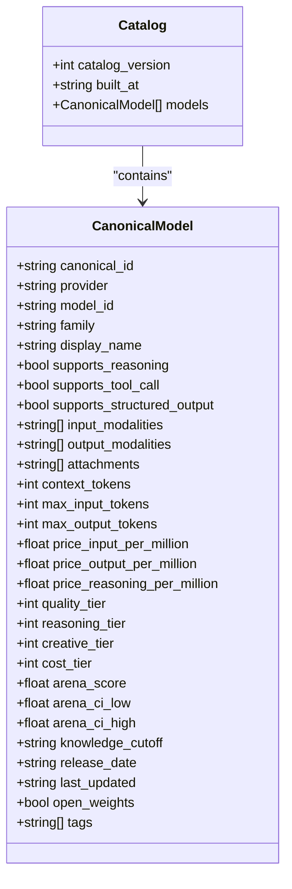
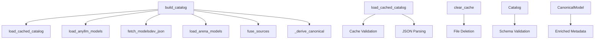
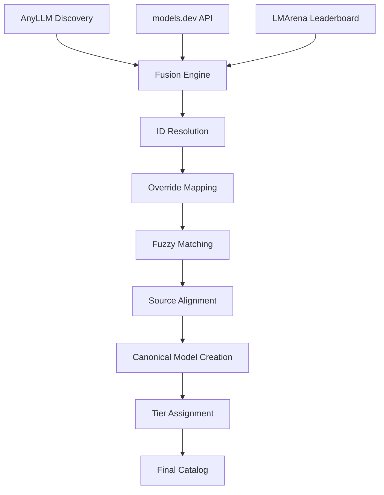
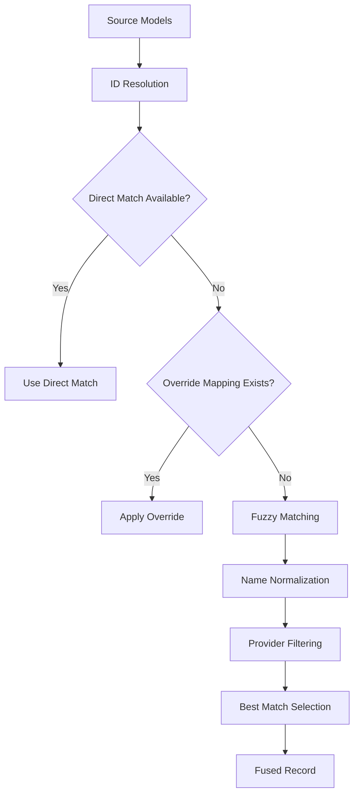
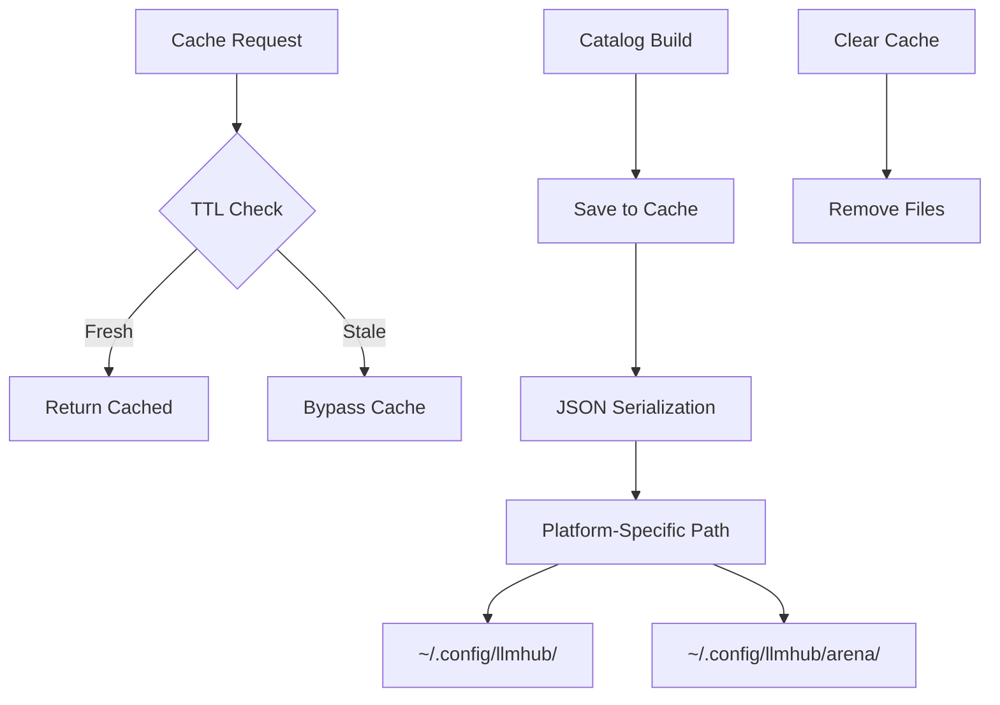
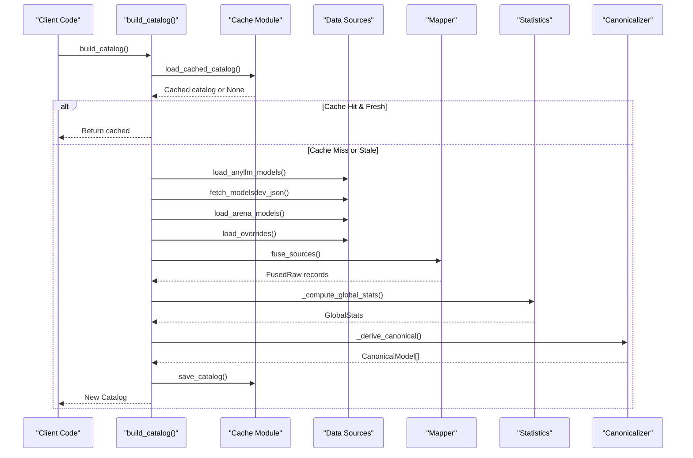

# Catalog System API

<cite>
**Referenced Files in This Document**
- [__init__.py](file://packages/llmhub/src/llmhub/catalog/__init__.py)
- [schema.py](file://packages/llmhub/src/llmhub/catalog/schema.py)
- [builder.py](file://packages/llmhub/src/llmhub/catalog/builder.py)
- [cache.py](file://packages/llmhub/src/llmhub/catalog/cache.py)
- [anyllm_source.py](file://packages/llmhub/src/llmhub/catalog/anyllm_source.py)
- [modelsdev_source.py](file://packages/llmhub/src/llmhub/catalog/modelsdev_source.py)
- [arena_source.py](file://packages/llmhub/src/llmhub/catalog/arena_source.py)
- [mapper.py](file://packages/llmhub/src/llmhub/catalog/mapper.py)
- [catalog_cmd.py](file://packages/llmhub/src/llmhub/commands/catalog_cmd.py)
- [overrides.json](file://packages/llmhub/src/llmhub/catalog/data/overrides.json)
</cite>

## Table of Contents
1. [Introduction](#introduction)
2. [Core Classes and Schema](#core-classes-and-schema)
3. [Public API Functions](#public-api-functions)
4. [Data Sources and Fusion](#data-sources-and-fusion)
5. [Cache Management](#cache-management)
6. [Build Pipeline](#build-pipeline)
7. [Command Line Interface](#command-line-interface)
8. [Performance Considerations](#performance-considerations)
9. [Usage Examples](#usage-examples)
10. [Troubleshooting](#troubleshooting)

## Introduction

The Catalog System is a comprehensive LLM model management solution that aggregates, enriches, and caches metadata from multiple sources to provide a unified view of available Large Language Models. The system combines data from AnyLLM (provider discovery), models.dev (pricing and capabilities), and LMArena (quality scores) to create a rich, searchable catalog with intelligent tier assignments.

The system is designed for high performance with intelligent caching, automatic data refresh, and flexible querying capabilities. It serves as the foundation for model selection, recommendation, and management across the LLM Hub ecosystem.

## Core Classes and Schema

### CanonicalModel Class

The `CanonicalModel` class serves as the unified representation of LLM models across the system, containing enriched metadata from multiple sources.



**Diagram sources**
- [schema.py](file://packages/llmhub/src/llmhub/catalog/schema.py#L68-L122)

#### Key Attributes

| Attribute | Type | Description | Source |
|-----------|------|-------------|---------|
| `canonical_id` | string | Unique identifier (provider/model_id) | Generated |
| `provider` | string | Model provider name | AnyLLM |
| `model_id` | string | Original model identifier | AnyLLM |
| `family` | string | Model family/group name | Models.dev |
| `display_name` | string | Human-readable model name | Models.dev |
| `supports_reasoning` | bool | Supports chain-of-thought reasoning | Models.dev |
| `supports_tool_call` | bool | Supports function/tool calling | Models.dev |
| `supports_structured_output` | bool | Supports structured JSON output | Models.dev |
| `input_modalities` | list[string] | Supported input types (text, image, audio) | Models.dev |
| `output_modalities` | list[string] | Supported output types | Models.dev |
| `price_input_per_million` | float | Input token pricing (per million) | Models.dev |
| `price_output_per_million` | float | Output token pricing (per million) | Models.dev |
| `quality_tier` | int | Quality ranking (1=best, 5=worst) | Arena + fallback logic |
| `cost_tier` | int | Cost ranking (1=cheapest, 5=most expensive) | Price quantiles |
| `arena_score` | float | LMArena Elo rating | LMArena |
| `tags` | list[string] | Model capabilities and features | Derived |

**Section sources**
- [schema.py](file://packages/llmhub/src/llmhub/catalog/schema.py#L68-L115)

### Supporting Schema Classes

The system defines several intermediate schema classes for data ingestion and fusion:

#### AnyLLMModel
Represents models discovered through AnyLLM provider detection.

#### ModelsDevModel
Contains comprehensive metadata from models.dev including pricing, capabilities, and technical limits.

#### ArenaModel
Stores quality scores and confidence intervals from LMArena leaderboard data.

#### FusedRaw
Intermediate representation combining data from all sources before canonicalization.

**Section sources**
- [schema.py](file://packages/llmhub/src/llmhub/catalog/schema.py#L12-L66)

## Public API Functions

### Core API Functions

The catalog system exposes five primary public functions through its main interface:



**Diagram sources**
- [builder.py](file://packages/llmhub/src/llmhub/catalog/builder.py#L302-L388)
- [cache.py](file://packages/llmhub/src/llmhub/catalog/cache.py#L37-L111)

#### build_catalog()

Main entry point for catalog construction with comprehensive source integration.

**Signature:**
```python
def build_catalog(ttl_hours: int = 24, force_refresh: bool = False) -> Catalog
```

**Parameters:**
- `ttl_hours` (int): Cache time-to-live in hours (default: 24)
- `force_refresh` (bool): Bypass cache and rebuild from sources

**Returns:** `Catalog` instance with all available models

**Behavior:**
1. Loads environment configuration (.env files)
2. Attempts to load cached catalog (if not force_refresh)
3. Fetches data from all sources
4. Fuses and normalizes data
5. Computes global statistics
6. Derives canonical models with tiers
7. Saves to cache
8. Returns Catalog

**Section sources**
- [builder.py](file://packages/llmhub/src/llmhub/catalog/builder.py#L302-L388)

#### load_cached_catalog()

Retrieves cached catalog respecting TTL policies.

**Signature:**
```python
def load_cached_catalog(ttl_hours: int = 24) -> Optional[Catalog]
```

**Parameters:**
- `ttl_hours` (int): Maximum cache age in hours

**Returns:** `Catalog` if cache is fresh, `None` otherwise

**Section sources**
- [cache.py](file://packages/llmhub/src/llmhub/catalog/cache.py#L37-L66)

#### clear_cache()

Invalidates the catalog cache and removes cached files.

**Signature:**
```python
def clear_cache() -> bool
```

**Returns:** `True` if cache was cleared, `False` if no cache existed

**Section sources**
- [cache.py](file://packages/llmhub/src/llmhub/catalog/cache.py#L94-L111)

**Section sources**
- [__init__.py](file://packages/llmhub/src/llmhub/catalog/__init__.py#L6-L16)

## Data Sources and Fusion

### Source Integration Architecture

The catalog system integrates data from three primary sources through a sophisticated fusion mechanism:



**Diagram sources**
- [builder.py](file://packages/llmhub/src/llmhub/catalog/builder.py#L337-L367)
- [mapper.py](file://packages/llmhub/src/llmhub/catalog/mapper.py#L32-L114)

### AnyLLM Source

Discovers callable models through provider detection and API key validation.

**Features:**
- Automatic provider detection (OpenAI, Anthropic, Google, etc.)
- API key validation and filtering
- Dynamic model discovery based on credentials
- Graceful handling of missing or invalid credentials

**Implementation Details:**
- Supports 10+ major providers
- Handles provider-specific model naming
- Returns empty list if any-llm unavailable

**Section sources**
- [anyllm_source.py](file://packages/llmhub/src/llmhub/catalog/anyllm_source.py#L11-L49)

### Models.dev Source

Provides comprehensive metadata including pricing, capabilities, and technical specifications.

**Data Coverage:**
- Pricing per million tokens (input, output, reasoning)
- Context length and token limits
- Capability flags (reasoning, tools, structured output)
- Input/output modalities (text, image, audio)
- Release dates and knowledge cutoffs
- Open weights status

**Integration Process:**
1. HTTP GET from models.dev/api.json
2. JSON parsing and normalization
3. Provider-model flattening
4. Capability extraction and pricing normalization

**Section sources**
- [modelsdev_source.py](file://packages/llmhub/src/llmhub/catalog/modelsdev_source.py#L11-L142)

### LMArena Source

Delivers quality scores and confidence intervals for model comparison.

**Data Structure:**
- Elo-style ratings (higher = better)
- Confidence intervals (q025, q975)
- Multiple category scores
- 24-hour TTL with automatic refresh

**Refresh Mechanism:**
- Vendored update script execution
- Subprocess timeout protection (5 minutes)
- Stale data fallback
- Error logging and graceful degradation

**Section sources**
- [arena_source.py](file://packages/llmhub/src/llmhub/catalog/arena_source.py#L165-L227)

### Fusion Logic

The fusion engine resolves ID conflicts and merges data from multiple sources using a hierarchical matching strategy:



**Diagram sources**
- [mapper.py](file://packages/llmhub/src/llmhub/catalog/mapper.py#L50-L114)

**Matching Priority:**
1. **Direct Match**: Exact ID correspondence
2. **Override Mapping**: Static ID mappings from overrides.json
3. **Fuzzy Match**: Normalized name matching with provider filtering

**Section sources**
- [mapper.py](file://packages/llmhub/src/llmhub/catalog/mapper.py#L32-L114)

## Cache Management

### Cache Architecture

The cache system provides intelligent persistence with TTL-based invalidation and cross-platform compatibility.



**Diagram sources**
- [cache.py](file://packages/llmhub/src/llmhub/catalog/cache.py#L37-L111)

### Platform-Specific Paths

The cache system adapts to different operating systems:

| Platform | Cache Directory |
|----------|----------------|
| macOS | `~/.config/llmhub/` |
| Windows | `%APPDATA%/llmhub/` |
| Linux | `~/.config/llmhub/` |

### Cache Operations

#### Loading Cached Catalog
- Validates file existence and modification time
- Performs JSON parsing with error handling
- Returns None for stale or corrupted cache
- Supports graceful degradation

#### Saving Catalog
- Serializes to JSON with pretty formatting
- Atomic write operations
- Non-fatal error handling with warnings
- Cross-platform compatibility

#### Cache Invalidation
- Complete cache removal with cleanup
- Returns success/failure status
- Handles missing cache gracefully

**Section sources**
- [cache.py](file://packages/llmhub/src/llmhub/catalog/cache.py#L15-L111)

## Build Pipeline

### Pipeline Architecture

The catalog build process follows a structured pipeline with clear separation of concerns:



**Diagram sources**
- [builder.py](file://packages/llmhub/src/llmhub/catalog/builder.py#L302-L388)

### Tier Derivation System

The system computes intelligent tiers based on statistical analysis of model characteristics:

#### Cost Tiers (1-5 scale)
- **Tier 1**: Bottom 20% of prices (cheapest)
- **Tier 2**: 20-40% percentile
- **Tier 3**: 40-60% percentile (default)
- **Tier 4**: 60-80% percentile
- **Tier 5**: Top 20% of prices (most expensive)

#### Quality Tiers (1-5 scale)
- **Tier 1**: Above 80th percentile arena score
- **Tier 2**: 60-80th percentile
- **Tier 3**: 40-60th percentile (default)
- **Tier 4**: 20-40th percentile
- **Tier 5**: Below 20th percentile

#### Provider-Based Fallbacks
For providers without arena data, predefined tier assignments:
- OpenAI: Tier 2
- Anthropic: Tier 1
- Google: Tier 2
- Others: Tier 3

**Section sources**
- [builder.py](file://packages/llmhub/src/llmhub/catalog/builder.py#L70-L299)

## Command Line Interface

### CLI Commands

The catalog system provides two primary CLI commands for interactive usage:

#### catalog show
Displays the current catalog with filtering and formatting options.

**Usage:**
```bash
llmhub catalog show [--provider PROVIDER] [--details]
```

**Options:**
- `--provider`: Filter models by provider
- `--details`: Show additional information (arena scores, tags)

**Output Format:**
- Summary statistics
- Provider-wise tables
- Tier legends
- Rich formatting with color coding

#### catalog refresh
Force rebuilds the catalog from all sources.

**Usage:**
```bash
llmhub catalog refresh [--ttl TTL_HOURS]
```

**Options:**
- `--ttl`: Set cache TTL in hours (default: 24)

**Output:**
- Progress indicators
- Model counts by provider
- Success/failure reporting

**Section sources**
- [catalog_cmd.py](file://packages/llmhub/src/llmhub/commands/catalog_cmd.py#L16-L127)

## Performance Considerations

### Cache TTL Implications

The cache system balances performance with freshness through configurable TTL settings:

| TTL Setting | Performance Impact | Data Freshness | Use Case |
|-------------|-------------------|----------------|----------|
| 1 hour | Fastest access | Very recent | Development/testing |
| 6 hours | Very fast | Recent | Frequent usage |
| 24 hours | Fast | Daily updates | Production |
| 72 hours | Moderate | Weekly updates | Long-term storage |

### Network Call Optimization

The system minimizes network overhead through strategic caching:

- **AnyLLM**: Local provider detection (no network calls)
- **models.dev**: HTTP request with 10-second timeout
- **LMArena**: Vendor script execution with 5-minute timeout
- **Fallback**: Stale data preservation during failures

### Memory Usage Patterns

- **Cached Catalog**: JSON serialization overhead (~10-50MB depending on model count)
- **Runtime Catalog**: Pydantic model instantiation (minimal overhead)
- **Source Data**: Temporary dictionaries during fusion (peak memory usage)

### Performance Monitoring

Key metrics to monitor for optimal performance:
- Cache hit ratio
- Network request success rates
- Build completion times
- Memory allocation patterns

## Usage Examples

### Basic Catalog Initialization

```python
from llmhub.catalog import build_catalog, load_cached_catalog

# Attempt to load from cache (24-hour TTL)
catalog = build_catalog()

# Force refresh from sources
catalog = build_catalog(force_refresh=True)

# Custom TTL setting
catalog = build_catalog(ttl_hours=6)
```

### Manual Catalog Building

```python
from llmhub.catalog import build_catalog

# Full rebuild with verbose output
print("Building catalog from scratch...")
catalog = build_catalog(ttl_hours=24, force_refresh=True)

print(f"Catalog built: {len(catalog.models)} models")
print(f"Built at: {catalog.built_at}")
```

### Cache Management

```python
from llmhub.catalog import clear_cache, load_cached_catalog

# Clear cache completely
if clear_cache():
    print("Cache cleared successfully")
else:
    print("No cache to clear")

# Check cache status
cached_catalog = load_cached_catalog(ttl_hours=24)
if cached_catalog:
    print(f"Using cached catalog ({len(cached_catalog.models)} models)")
else:
    print("No valid cache available")
```

### Querying Model Information

```python
from llmhub.catalog import build_catalog

# Load catalog
catalog = build_catalog()

# Find high-quality, cost-effective models
filtered_models = [
    model for model in catalog.models
    if model.quality_tier <= 3 and model.cost_tier <= 3
]

# Sort by quality then cost
sorted_models = sorted(
    filtered_models,
    key=lambda m: (m.quality_tier, m.cost_tier)
)

# Display top recommendations
for model in sorted_models[:5]:
    print(f"{model.provider}/{model.model_id}: "
          f"Q{model.quality_tier}/C{model.cost_tier} "
          f"(${model.price_input_per_million:.2f}/M)")
```

### Provider-Specific Queries

```python
from llmhub.catalog import build_catalog

# Load only OpenAI models
catalog = build_catalog()
openai_models = [
    model for model in catalog.models 
    if model.provider.lower() == "openai"
]

# Find models with specific capabilities
reasoning_models = [
    model for model in catalog.models
    if model.supports_reasoning and model.reasoning_tier <= 2
]
```

## Troubleshooting

### Common Issues and Solutions

#### No Models Found Warning
**Symptom:** "Warning: No models found from any-llm. Catalog will be empty."

**Causes:**
- Missing API keys in environment
- Invalid/expired API keys
- No providers configured

**Solutions:**
1. Verify `.env` file contains valid API keys:
   ```bash
   OPENAI_API_KEY=sk-proj-...
   ANTHROPIC_API_KEY=sk-ant-...
   ```
2. Check provider availability manually
3. Ensure any-llm package is installed

#### Cache Corruption
**Symptom:** JSON decode errors or invalid cache data

**Solutions:**
```python
from llmhub.catalog import clear_cache, build_catalog

# Clear problematic cache
clear_cache()

# Rebuild catalog
catalog = build_catalog()
```

#### Network Timeout Issues
**Symptom:** Slow builds or timeout errors

**Solutions:**
1. Increase timeout values in source modules
2. Check internet connectivity
3. Use shorter TTL for faster retries
4. Enable offline mode with stale cache

#### Arena Data Refresh Failures
**Symptom:** Missing quality scores despite successful arena data fetching

**Solutions:**
1. Check arena cache directory permissions
2. Verify Python subprocess execution
3. Review vendor script logs
4. Use fallback provider-based tiers

### Debugging Tools

#### Verbose Build Mode
Enable detailed logging during catalog construction:
```python
import logging
logging.basicConfig(level=logging.INFO)

catalog = build_catalog()  # Shows progress messages
```

#### Cache Inspection
Manually inspect cache contents:
```python
from llmhub.catalog.cache import _get_cache_path
import json

cache_path = _get_cache_path()
if cache_path.exists():
    with open(cache_path, 'r') as f:
        data = json.load(f)
    print(f"Cache contains {len(data['models'])} models")
```

#### Source Data Validation
Verify individual source data integrity:
```python
from llmhub.catalog.anyllm_source import load_anyllm_models
from llmhub.catalog.modelsdev_source import fetch_modelsdev_json
from llmhub.catalog.arena_source import load_arena_models

# Check each source independently
anyllm_data = load_anyllm_models()
modelsdev_data = fetch_modelsdev_json()
arena_data = load_arena_models()

print(f"AnyLLM: {len(anyllm_data)} models")
print(f"Models.dev: {len(modelsdev_data)} entries")
print(f"Arena: {len(arena_data)} scores")
```