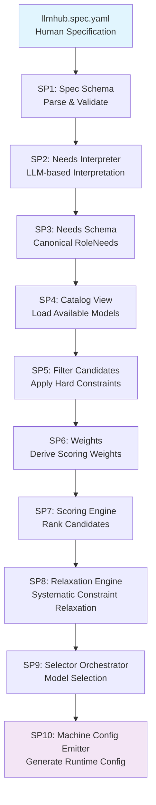
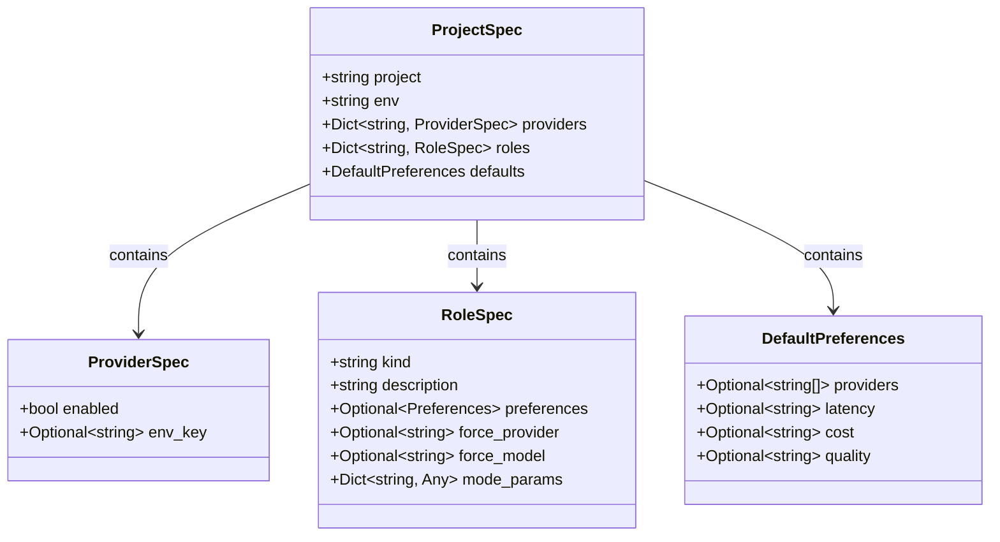
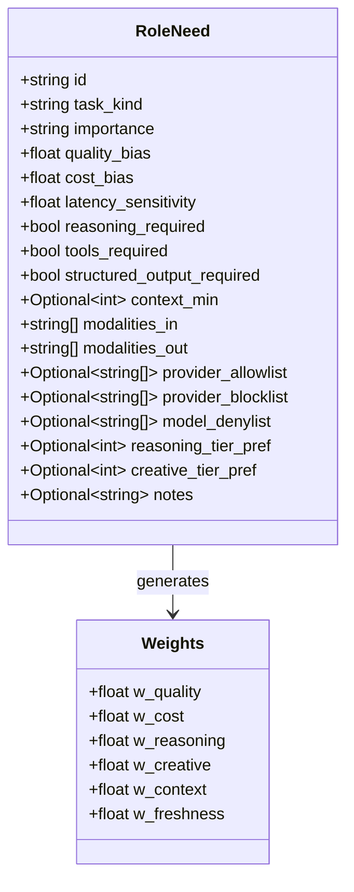
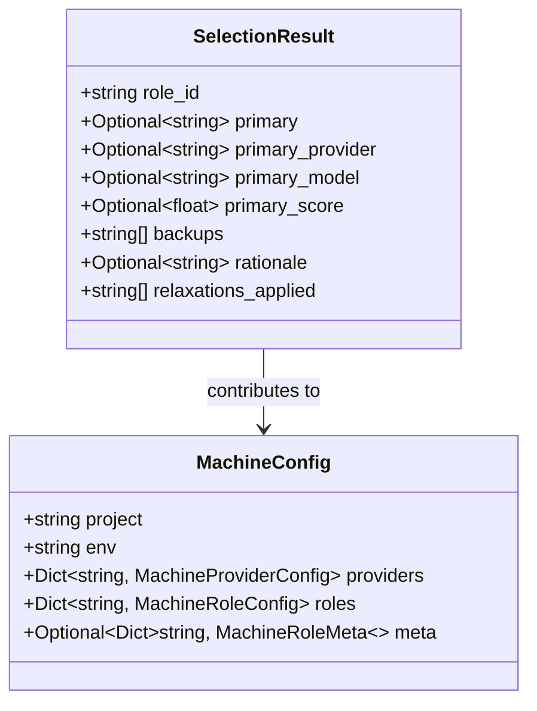
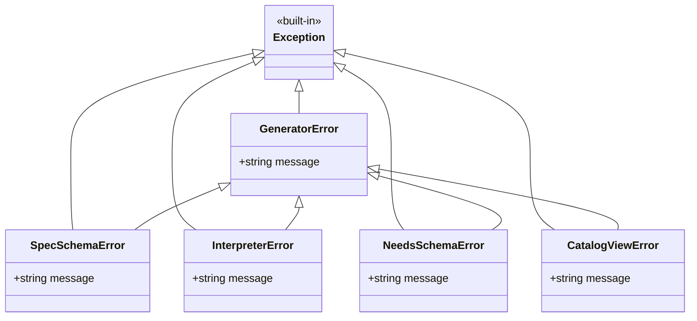
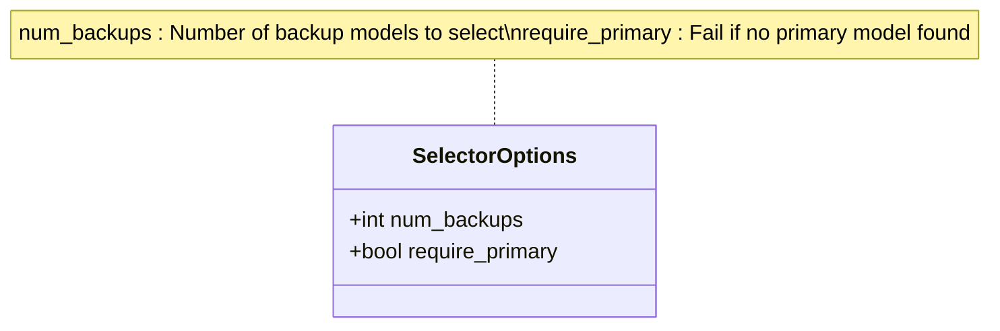

# Generator API

<cite>
**Referenced Files in This Document**
- [packages/llmhub/src/llmhub/generator/__init__.py](file://packages/llmhub/src/llmhub/generator/__init__.py)
- [packages/llmhub/src/llmhub/generator/spec.md](file://packages/llmhub/src/llmhub/generator/spec.md)
- [packages/llmhub/src/llmhub/generator/sp1_spec_schema/models.py](file://packages/llmhub/src/llmhub/generator/sp1_spec_schema/models.py)
- [packages/llmhub/src/llmhub/generator/sp1_spec_schema/parser.py](file://packages/llmhub/src/llmhub/generator/sp1_spec_schema/parser.py)
- [packages/llmhub/src/llmhub/generator/sp2_needs_interpreter/interpreter.py](file://packages/llmhub/src/llmhub/generator/sp2_needs_interpreter/interpreter.py)
- [packages/llmhub/src/llmhub/generator/sp3_needs_schema/models.py](file://packages/llmhub/src/llmhub/generator/sp3_needs_schema/models.py)
- [packages/llmhub/src/llmhub/generator/sp3_needs_schema/parser.py](file://packages/llmhub/src/llmhub/generator/sp3_needs_schema/parser.py)
- [packages/llmhub/src/llmhub/generator/sp4_catalog_view/loader.py](file://packages/llmhub/src/llmhub/generator/sp4_catalog_view/loader.py)
- [packages/llmhub/src/llmhub/generator/sp9_selector_orchestrator/models.py](file://packages/llmhub/src/llmhub/generator/sp9_selector_orchestrator/models.py)
- [packages/llmhub/src/llmhub/generator/sp10_machine_config_emitter/models.py](file://packages/llmhub/src/llmhub/generator/sp10_machine_config_emitter/models.py)
- [packages/llmhub/src/llmhub/generator/sp10_machine_config_emitter/builder.py](file://packages/llmhub/src/llmhub/generator/sp10_machine_config_emitter/builder.py)
- [packages/llmhub/src/llmhub/generator/sp6_weights/models.py](file://packages/llmhub/src/llmhub/generator/sp6_weights/models.py)
- [packages/llmhub/tests/generator/test_generate_e2e.py](file://packages/llmhub/tests/generator/test_generate_e2e.py)
</cite>

## Table of Contents
1. [Introduction](#introduction)
2. [Architecture Overview](#architecture-overview)
3. [Main Entrypoint](#main-entrypoint-generate_machine_config)
4. [Core Data Models](#core-data-models)
5. [Utility Functions](#utility-functions)
6. [Exception Hierarchy](#exception-hierarchy)
7. [Integration with LLMHub](#integration-with-llmhub)
8. [SelectorOptions Configuration](#selectoroptions-configuration)
9. [Usage Examples](#usage-examples)
10. [Testing Support](#testing-support)

## Introduction

The Generator API is the core module that transforms human-readable specifications into runtime configurations for the LLM Hub system. It serves as the bridge between user-written specifications and machine-executable configurations, orchestrating a sophisticated pipeline of subproblems to produce optimal model selections for different roles.

The generator follows a modular, subproblem-based architecture where each stage handles specific aspects of the transformation process. This design ensures reliability, testability, and maintainability while providing a clean public interface for end-users.

## Architecture Overview

The Generator module is organized into 10 distinct subproblems (SP1-SP10), each with well-defined responsibilities and interfaces:



**Diagram sources**
- [packages/llmhub/src/llmhub/generator/spec.md](file://packages/llmhub/src/llmhub/generator/spec.md#L41-L56)

**Section sources**
- [packages/llmhub/src/llmhub/generator/spec.md](file://packages/llmhub/src/llmhub/generator/spec.md#L1-L93)

## Main Entrypoint: `generate_machine_config()`

The `generate_machine_config()` function serves as the primary interface for the generator module, orchestrating the entire transformation pipeline from human specification to runtime configuration.

### Function Signature

```python
def generate_machine_config(
    spec_path: str,
    hub: LLMHub,
    output_path: Optional[str] = None,
    catalog_override: Optional[List[CanonicalModel]] = None,
    catalog_ttl_hours: int = 24,
    force_catalog_refresh: bool = False,
    selector_options: Optional[SelectorOptions] = None
) -> MachineConfig
```

### Parameter Details

| Parameter | Type | Default | Description |
|-----------|------|---------|-------------|
| `spec_path` | `str` | - | Path to the `llmhub.spec.yaml` file containing the human specification |
| `hub` | `LLMHub` | - | LLMHub instance configured with generator role for needs interpretation |
| `output_path` | `Optional[str]` | `None` | Optional path to write the generated `llmhub.yaml` file |
| `catalog_override` | `Optional[List[CanonicalModel]]` | `None` | Testing support: override catalog with custom models |
| `catalog_ttl_hours` | `int` | `24` | Catalog cache duration in hours (default: 24 hours) |
| `force_catalog_refresh` | `bool` | `False` | Force rebuild of catalog cache |
| `selector_options` | `Optional[SelectorOptions]` | `None` | Customization options for model selection behavior |

### Return Value

Returns a `MachineConfig` object containing the complete runtime configuration ready for consumption by the LLM Hub Runtime.

### Processing Pipeline

The function executes the following steps internally:

1. **Step 1: Load and Parse Spec** (SP1) - Validates and parses the human specification
2. **Step 2: Interpret Needs** (SP2) - Uses LLM to convert spec into canonical role needs
3. **Step 3: Load Catalog** (SP4) - Retrieves available models from the catalog
4. **Step 4: Select Models** (SP9) - Applies selection logic for each role
5. **Step 5: Build Machine Config** (SP10) - Assembles final configuration
6. **Step 6: Write Output** (Optional) - Writes configuration to file if output_path provided

**Section sources**
- [packages/llmhub/src/llmhub/generator/__init__.py](file://packages/llmhub/src/llmhub/generator/__init__.py#L51-L116)

## Core Data Models

### ProjectSpec

The `ProjectSpec` model represents the complete project specification loaded from the `llmhub.spec.yaml` file.



**Diagram sources**
- [packages/llmhub/src/llmhub/generator/sp1_spec_schema/models.py](file://packages/llmhub/src/llmhub/generator/sp1_spec_schema/models.py#L51-L65)

### RoleNeed

The `RoleNeed` model captures the canonical representation of a role's requirements after LLM interpretation.



**Diagram sources**
- [packages/llmhub/src/llmhub/generator/sp3_needs_schema/models.py](file://packages/llmhub/src/llmhub/generator/sp3_needs_schema/models.py#L9-L129)
- [packages/llmhub/src/llmhub/generator/sp6_weights/models.py](file://packages/llmhub/src/llmhub/generator/sp6_weights/models.py#L5-L19)

### SelectionResult

The `SelectionResult` model represents the outcome of model selection for a specific role.



**Diagram sources**
- [packages/llmhub/src/llmhub/generator/sp9_selector_orchestrator/models.py](file://packages/llmhub/src/llmhub/generator/sp9_selector_orchestrator/models.py#L11-L22)
- [packages/llmhub/src/llmhub/generator/sp10_machine_config_emitter/models.py](file://packages/llmhub/src/llmhub/generator/sp10_machine_config_emitter/models.py#L25-L35)

### MachineConfig

The `MachineConfig` model represents the final runtime configuration produced by the generator.

**Section sources**
- [packages/llmhub/src/llmhub/generator/sp1_spec_schema/models.py](file://packages/llmhub/src/llmhub/generator/sp1_spec_schema/models.py#L1-L65)
- [packages/llmhub/src/llmhub/generator/sp3_needs_schema/models.py](file://packages/llmhub/src/llmhub/generator/sp3_needs_schema/models.py#L9-L129)
- [packages/llmhub/src/llmhub/generator/sp9_selector_orchestrator/models.py](file://packages/llmhub/src/llmhub/generator/sp9_selector_orchestrator/models.py#L11-L22)
- [packages/llmhub/src/llmhub/generator/sp10_machine_config_emitter/models.py](file://packages/llmhub/src/llmhub/generator/sp10_machine_config_emitter/models.py#L25-L35)

## Utility Functions

### Loading and Parsing Functions

#### `load_project_spec(path: str) -> ProjectSpec`

Loads and validates a project specification from a YAML file.

**Parameters:**
- `path`: Path to the `llmhub.spec.yaml` file

**Returns:**
- `ProjectSpec`: Validated project specification

**Raises:**
- `SpecSchemaError`: If file not found, invalid YAML, or validation fails

#### `parse_project_spec(raw: Dict[str, Any]) -> ProjectSpec`

Parses raw YAML dictionary into a validated `ProjectSpec` object.

**Parameters:**
- `raw`: Dictionary loaded from YAML file

**Returns:**
- `ProjectSpec`: Validated project specification

**Raises:**
- `SpecSchemaError`: If validation fails

### Needs Interpretation Functions

#### `interpret_needs(spec: ProjectSpec, hub: LLMHub, model_role: str = "llm.generator") -> List[RoleNeed]`

Uses LLM to interpret the human specification into canonical role needs.

**Parameters:**
- `spec`: Project specification to interpret
- `hub`: LLMHub instance for making LLM calls
- `model_role`: Role name in hub config (default: "llm.generator")

**Returns:**
- `List[RoleNeed]`: List of interpreted role requirements

**Raises:**
- `InterpreterError`: If LLM call or parsing fails

### Catalog Management Functions

#### `load_catalog_view(ttl_hours: int = 24, force_refresh: bool = False, catalog_override: Optional[List[CanonicalModel]] = None) -> List[CanonicalModel]`

Loads the catalog of available models with caching support.

**Parameters:**
- `ttl_hours`: Cache TTL in hours (default: 24)
- `force_refresh`: Force rebuild of catalog cache
- `catalog_override`: Testing support: override catalog with custom models

**Returns:**
- `List[CanonicalModel]`: List of available models

**Raises:**
- `CatalogViewError`: If catalog loading fails

### Selection Functions

#### `select_for_role(need: RoleNeed, models: List[CanonicalModel], options: SelectorOptions) -> SelectionResult`

Selects appropriate models for a specific role based on needs and constraints.

**Parameters:**
- `need`: Role requirement specification
- `models`: Available models from catalog
- `options`: Selection behavior options

**Returns:**
- `SelectionResult`: Selection outcome for the role

**Section sources**
- [packages/llmhub/src/llmhub/generator/sp1_spec_schema/parser.py](file://packages/llmhub/src/llmhub/generator/sp1_spec_schema/parser.py#L31-L64)
- [packages/llmhub/src/llmhub/generator/sp2_needs_interpreter/interpreter.py](file://packages/llmhub/src/llmhub/generator/sp2_needs_interpreter/interpreter.py#L15-L92)
- [packages/llmhub/src/llmhub/generator/sp4_catalog_view/loader.py](file://packages/llmhub/src/llmhub/generator/sp4_catalog_view/loader.py#L12-L42)

## Exception Hierarchy

The generator module defines a structured exception hierarchy to handle different failure modes:



**Diagram sources**
- [packages/llmhub/src/llmhub/generator/__init__.py](file://packages/llmhub/src/llmhub/generator/__init__.py#L47-L50)

### Exception Details

| Exception | Purpose | When Raised |
|-----------|---------|-------------|
| `GeneratorError` | Base exception for generator failures | Wraps subproblem errors |
| `SpecSchemaError` | Specification parsing/validation failures | Invalid YAML or schema violations |
| `InterpreterError` | LLM interpretation failures | LLM call errors or invalid JSON |
| `NeedsSchemaError` | RoleNeed parsing/validation failures | Invalid role need structure |
| `CatalogViewError` | Catalog loading failures | Catalog access or parsing errors |

**Section sources**
- [packages/llmhub/src/llmhub/generator/__init__.py](file://packages/llmhub/src/llmhub/generator/__init__.py#L47-L50)

## Integration with LLMHub

The generator integrates seamlessly with the LLM Hub Runtime through the `LLMHub` instance, which provides:

### LLM Capabilities

- **Structured Output**: Supports JSON response format for reliable parsing
- **Role-Based Access**: Uses configured roles for different LLM tasks
- **Parameter Control**: Temperature and other parameters for consistent interpretation

### Configuration Requirements

The LLMHub instance must be configured with:
- A role named `"llm.generator"` for needs interpretation
- Appropriate API keys and provider configurations
- Sufficient quota for LLM calls during interpretation

**Section sources**
- [packages/llmhub/src/llmhub/generator/sp2_needs_interpreter/interpreter.py](file://packages/llmhub/src/llmhub/generator/sp2_needs_interpreter/interpreter.py#L15-L92)

## SelectorOptions Configuration

The `SelectorOptions` class controls model selection behavior through configurable parameters:

### Configuration Parameters



**Diagram sources**
- [packages/llmhub/src/llmhub/generator/sp9_selector_orchestrator/models.py](file://packages/llmhub/src/llmhub/generator/sp9_selector_orchestrator/models.py#L6-L9)

### Default Behavior

- `num_backups`: 2 (two backup models selected)
- `require_primary`: True (fails if no suitable primary model found)

### Customization Examples

```python
# Minimal configuration
options = SelectorOptions()

# Conservative selection (fewer backups, strict requirements)
options = SelectorOptions(num_backups=1, require_primary=True)

# Flexible selection (more backups, relaxed requirements)
options = SelectorOptions(num_backups=3, require_primary=False)
```

**Section sources**
- [packages/llmhub/src/llmhub/generator/sp9_selector_orchestrator/models.py](file://packages/llmhub/src/llmhub/generator/sp9_selector_orchestrator/models.py#L6-L9)

## Usage Examples

### Basic Usage

```python
from llmhub.generator import generate_machine_config
from llmhub_runtime import LLMHub

# Initialize LLMHub with configuration
hub = LLMHub(config_path="llmhub.yaml")

# Generate machine config
machine_config = generate_machine_config(
    spec_path="llmhub.spec.yaml",
    hub=hub,
    output_path="llmhub.yaml"
)
```

### Advanced Usage with Custom Options

```python
from llmhub.generator import generate_machine_config, SelectorOptions
from llmhub_runtime import LLMHub

# Configure custom selection behavior
selector_options = SelectorOptions(
    num_backups=3,
    require_primary=False
)

# Generate with custom options
machine_config = generate_machine_config(
    spec_path="llmhub.spec.yaml",
    hub=hub,
    output_path="llmhub.yaml",
    catalog_ttl_hours=12,
    force_catalog_refresh=True,
    selector_options=selector_options
)
```

### Testing with Catalog Override

```python
from llmhub.generator import generate_machine_config
from llmhub.catalog.schema import CanonicalModel
from llmhub_runtime import LLMHub

# Create mock catalog for testing
mock_catalog = [
    CanonicalModel(
        canonical_id="test/openai-gpt-4",
        provider="openai",
        model_id="gpt-4",
        quality_tier=1,
        reasoning_tier=1,
        cost_tier=4,
        context_tokens=128000
    )
]

# Generate with test catalog
machine_config = generate_machine_config(
    spec_path="llmhub.spec.yaml",
    hub=hub,
    catalog_override=mock_catalog
)
```

**Section sources**
- [packages/llmhub/tests/generator/test_generate_e2e.py](file://packages/llmhub/tests/generator/test_generate_e2e.py#L16-L106)

## Testing Support

The generator provides comprehensive testing capabilities through several mechanisms:

### Catalog Override

The `catalog_override` parameter enables testing with controlled model sets:

```python
# Test with specific models
mock_catalog = [
    CanonicalModel(canonical_id="test/model1", ...),
    CanonicalModel(canonical_id="test/model2", ...)
]
result = generate_machine_config(
    spec_path="test.yaml",
    hub=hub,
    catalog_override=mock_catalog
)
```

### Error Testing

The exception hierarchy allows for comprehensive error testing:

```python
import pytest
from llmhub.generator import GeneratorError

# Test error propagation
with pytest.raises(GeneratorError):
    generate_machine_config(
        spec_path="/invalid/path",
        hub=hub
    )
```

### End-to-End Testing

The generator includes end-to-end tests that validate the complete pipeline:

```python
def test_complete_pipeline():
    """Test complete generation pipeline with mocks."""
    # Setup mocks for all subproblems
    # Execute generate_machine_config
    # Assert on resulting MachineConfig
```

**Section sources**
- [packages/llmhub/tests/generator/test_generate_e2e.py](file://packages/llmhub/tests/generator/test_generate_e2e.py#L16-L150)