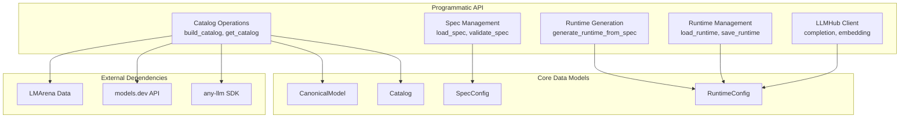
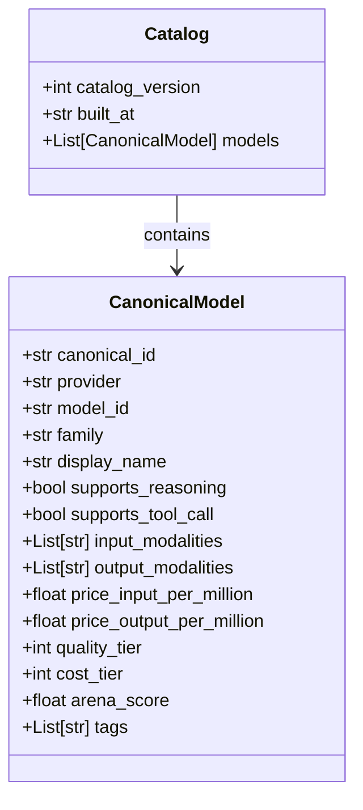
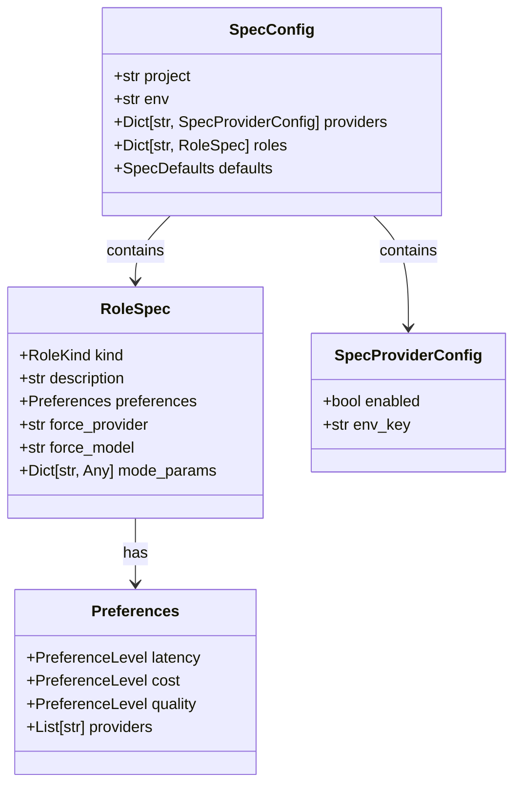
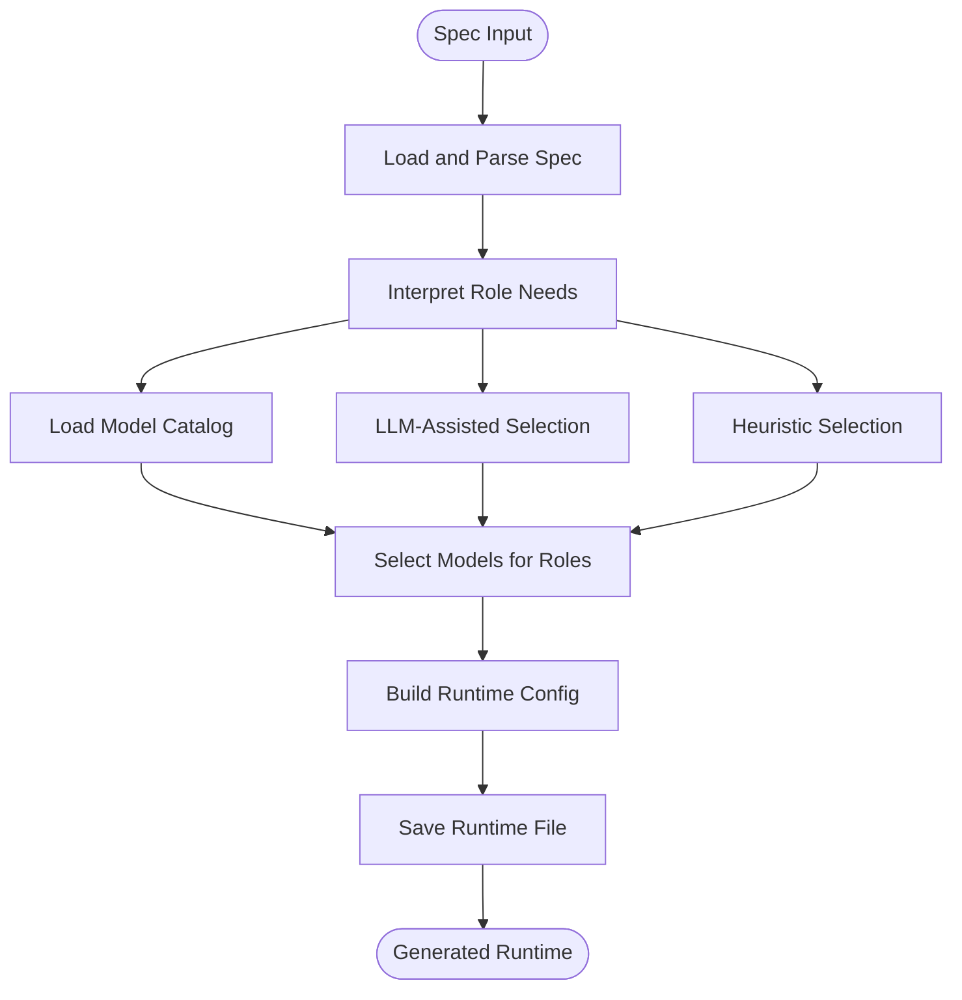
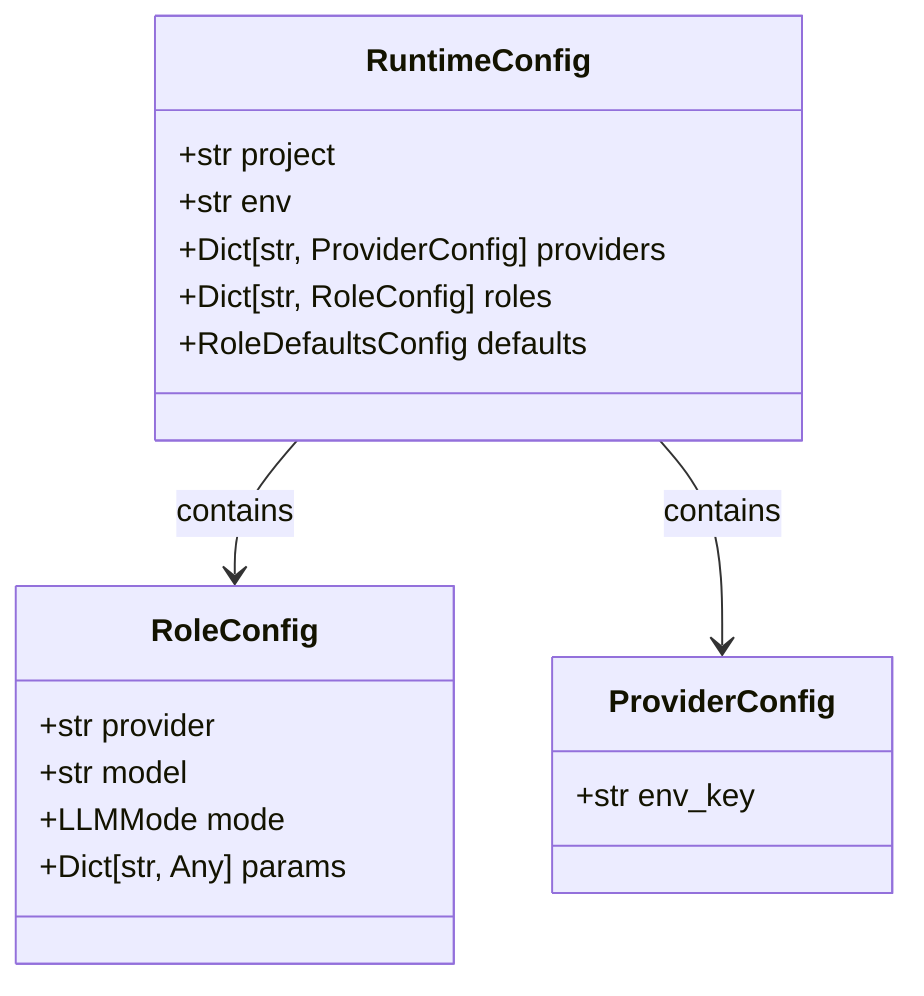

# Programmatic API

<cite>
**Referenced Files in This Document**
- [README.md](file://README.md)
- [examples/catalog_programmatic_access.py](file://examples/catalog_programmatic_access.py)
- [examples/runtime_generation_programmatic.py](file://examples/runtime_generation_programmatic.py)
- [packages/cli/src/llmhub_cli/__init__.py](file://packages/cli/src/llmhub_cli/__init__.py)
- [packages/cli/src/llmhub_cli/catalog/builder.py](file://packages/cli/src/llmhub_cli/catalog/builder.py)
- [packages/cli/src/llmhub_cli/catalog/schema.py](file://packages/cli/src/llmhub_cli/catalog/schema.py)
- [packages/cli/src/llmhub_cli/generator/__init__.py](file://packages/cli/src/llmhub_cli/generator/__init__.py)
- [packages/cli/src/llmhub_cli/generator_hook.py](file://packages/cli/src/llmhub_cli/generator_hook.py)
- [packages/cli/src/llmhub_cli/spec_models.py](file://packages/cli/src/llmhub_cli/spec_models.py)
- [packages/cli/src/llmhub_cli/runtime/__init__.py](file://packages/cli/src/llmhub_cli/runtime/__init__.py)
- [packages/runtime/src/llmhub_runtime/hub.py](file://packages/runtime/src/llmhub_runtime/hub.py)
- [packages/runtime/src/llmhub_runtime/models.py](file://packages/runtime/src/llmhub_runtime/models.py)
- [packages/cli/src/llmhub_cli/cli.py](file://packages/cli/src/llmhub_cli/cli.py)
</cite>

## Table of Contents
1. [Introduction](#introduction)
2. [API Overview](#api-overview)
3. [Catalog Programmatic Access](#catalog-programmatic-access)
4. [Spec Management](#spec-management)
5. [Runtime Generation](#runtime-generation)
6. [Runtime Configuration Management](#runtime-configuration-management)
7. [LLMHub Runtime Client](#llmhub-runtime-client)
8. [Error Handling](#error-handling)
9. [Integration Examples](#integration-examples)
10. [Best Practices](#best-practices)

## Introduction

The LLM Hub programmatic API provides comprehensive programmatic access to all core LLM Hub functionality through a clean, well-documented interface. This API enables developers to integrate LLM Hub capabilities into their applications, automate configuration management, and build custom tools for LLM model selection and orchestration.

The programmatic API is designed around four main domains:
- **Catalog Operations**: Query and filter available models with rich metadata
- **Spec Management**: Load, validate, and manipulate LLM specifications
- **Runtime Generation**: Convert specifications into executable configurations
- **Runtime Management**: Load and save runtime configurations

## API Overview

The LLM Hub programmatic API is organized into several key modules, each providing focused functionality:



**Diagram sources**
- [packages/cli/src/llmhub_cli/__init__.py](file://packages/cli/src/llmhub_cli/__init__.py#L1-L67)
- [packages/cli/src/llmhub_cli/catalog/schema.py](file://packages/cli/src/llmhub_cli/catalog/schema.py#L68-L122)
- [packages/runtime/src/llmhub_runtime/models.py](file://packages/runtime/src/llmhub_runtime/models.py#L28-L41)

**Section sources**
- [packages/cli/src/llmhub_cli/__init__.py](file://packages/cli/src/llmhub_cli/__init__.py#L1-L67)

## Catalog Programmatic Access

The catalog system provides comprehensive programmatic access to the model database, enabling sophisticated model discovery and filtering capabilities.

### Core Catalog Functions

#### Building the Catalog

The `build_catalog()` function constructs the complete model catalog from multiple data sources:

```python
from llmhub_cli import build_catalog

# Build full catalog with default cache settings
catalog = build_catalog()

# Force rebuild without cache
catalog = build_catalog(force_refresh=True)

# Custom cache TTL
catalog = build_catalog(ttl_hours=12)
```

#### Filtering and Querying

The `get_catalog()` function provides filtered access to catalog data:

```python
from llmhub_cli import get_catalog

# Get all OpenAI models
openai_catalog = get_catalog(provider="openai")

# Get models with specific capabilities
reasoning_catalog = get_catalog(tags=["reasoning"])

# Combined filters
vision_models = get_catalog(provider="openai", tags=["vision"])
```

### Catalog Data Models

The catalog system uses several key data models:



**Diagram sources**
- [packages/cli/src/llmhub_cli/catalog/schema.py](file://packages/cli/src/llmhub_cli/catalog/schema.py#L68-L122)

### Advanced Catalog Operations

#### Programmatic Catalog Exploration

The catalog API supports sophisticated filtering and analysis:

```python
# Find cost-effective high-quality models
cheap_quality = [
    model for model in catalog.models
    if model.cost_tier <= 2 and model.quality_tier <= 3
]

# Sort by performance metrics
sorted_models = sorted(
    catalog.models,
    key=lambda m: (m.quality_tier, m.cost_tier)
)

# Provider comparison
provider_stats = {}
for model in catalog.models:
    if model.provider not in provider_stats:
        provider_stats[model.provider] = []
    provider_stats[model.provider].append(model)
```

**Section sources**
- [packages/cli/src/llmhub_cli/catalog/builder.py](file://packages/cli/src/llmhub_cli/catalog/builder.py#L302-L388)
- [packages/cli/src/llmhub_cli/catalog/schema.py](file://packages/cli/src/llmhub_cli/catalog/schema.py#L68-L122)

## Spec Management

The spec management API provides tools for loading, validating, and manipulating LLM specifications.

### Loading and Validation

#### Spec Loading

```python
from llmhub_cli import load_spec
from llmhub_cli.spec import validate_spec

# Load spec from file
spec = load_spec("llmhub.spec.yaml")

# Validate spec
validation_result = validate_spec("llmhub.spec.yaml")
if validation_result.valid:
    print("Spec is valid")
else:
    for error in validation_result.errors:
        print(f"Error: {error}")
```

#### Programmatic Spec Creation

```python
from llmhub_cli.spec_models import (
    SpecConfig, 
    SpecProviderConfig, 
    RoleSpec, 
    PreferencesSpec, 
    RoleKind
)

# Create spec programmatically
spec = SpecConfig(
    project="my-application",
    env="dev",
    providers={
        "openai": SpecProviderConfig(
            enabled=True,
            env_key="OPENAI_API_KEY"
        )
    },
    roles={
        "llm.chat": RoleSpec(
            kind=RoleKind.chat,
            description="General chat interface",
            preferences=PreferencesSpec(
                cost="low",
                quality="medium",
                latency="low",
                providers=["openai"]
            ),
            mode_params={}
        )
    }
)
```

### Spec Data Models



**Diagram sources**
- [packages/cli/src/llmhub_cli/spec_models.py](file://packages/cli/src/llmhub_cli/spec_models.py#L59-L131)

**Section sources**
- [packages/cli/src/llmhub_cli/spec_models.py](file://packages/cli/src/llmhub_cli/spec_models.py#L68-L131)

## Runtime Generation

The runtime generation API converts LLM specifications into executable configurations through sophisticated model selection logic.

### Basic Runtime Generation

```python
from llmhub_cli import generate_runtime_from_spec
from llmhub_cli.generator import GeneratorOptions

# Generate runtime with default options
spec = load_spec("llmhub.spec.yaml")
result = generate_runtime_from_spec(spec)

# Save generated runtime
save_runtime("llmhub.yaml", result.runtime)
```

### Advanced Generation Options

```python
# Generate with explanations
options = GeneratorOptions(explain=True)
result = generate_runtime_from_spec(spec, options)

# Generate without LLM assistance (heuristic mode)
options = GeneratorOptions(no_llm=True)
result = generate_runtime_from_spec(spec, options)

# Multi-environment generation
environments = ["dev", "staging", "prod"]
for env in environments:
    spec.env = env
    result = generate_runtime_from_spec(spec)
    save_runtime(f"llmhub.{env}.yaml", result.runtime)
```

### Generation Pipeline

The runtime generation follows a sophisticated pipeline:



**Diagram sources**
- [packages/cli/src/llmhub_cli/generator/__init__.py](file://packages/cli/src/llmhub_cli/generator/__init__.py#L50-L116)

### Generation Results

The generation process returns a comprehensive result:

```python
class GenerationResult:
    runtime: RuntimeConfig  # Generated configuration
    explanations: dict[str, str]  # Selection rationale (if explain=True)
```

**Section sources**
- [packages/cli/src/llmhub_cli/generator/__init__.py](file://packages/cli/src/llmhub_cli/generator/__init__.py#L126-L215)
- [packages/cli/src/llmhub_cli/generator_hook.py](file://packages/cli/src/llmhub_cli/generator_hook.py#L132-L204)

## Runtime Configuration Management

The runtime management API provides tools for loading, saving, and manipulating runtime configurations.

### Loading and Saving Runtime Configurations

```python
from llmhub_cli import load_runtime, save_runtime

# Load existing runtime
runtime = load_runtime("llmhub.yaml")

# Modify runtime
runtime.roles["llm.custom"].model = "gpt-4o"

# Save modified runtime
save_runtime("llmhub.modified.yaml", runtime)
```

### Runtime Data Models



**Diagram sources**
- [packages/runtime/src/llmhub_runtime/models.py](file://packages/runtime/src/llmhub_runtime/models.py#L28-L41)

### Environment-Specific Configurations

```python
# Generate environment-specific configs
configs = {
    "development": load_runtime("llmhub.dev.yaml"),
    "staging": load_runtime("llmhub.staging.yaml"),
    "production": load_runtime("llmhub.prod.yaml")
}

# Use appropriate config based on environment
import os
env = os.getenv("ENVIRONMENT", "development")
runtime = configs[env]
```

**Section sources**
- [packages/cli/src/llmhub_cli/runtime/__init__.py](file://packages/cli/src/llmhub_cli/runtime/__init__.py#L67-L114)

## LLMHub Runtime Client

The LLMHub runtime client provides programmatic access to LLM calls through the resolved configuration.

### Basic Usage

```python
from llmhub_runtime import LLMHub

# Initialize with runtime configuration
hub = LLMHub(config_path="llmhub.yaml")

# Perform chat completion
response = hub.completion(
    role="llm.inference",
    messages=[
        {"role": "user", "content": "Explain quantum computing"}
    ],
    params_override={"temperature": 0.7}
)

print(response)
```

### Embedding Generation

```python
# Generate embeddings
embeddings = hub.embedding(
    role="llm.embedding",
    input=["Hello world", "Goodbye world"]
)
```

### Hooks and Observability

```python
def log_before(ctx):
    print(f"Calling {ctx['provider']}:{ctx['model']} for role {ctx['role']}")

def log_after(result):
    print(f"Call {'succeeded' if result['success'] else 'failed'}")

hub = LLMHub(
    config_path="llmhub.yaml",
    on_before_call=log_before,
    on_after_call=log_after
)
```

### Advanced Configuration

```python
# Strict environment validation
hub = LLMHub(config_path="llmhub.yaml", strict_env=True)

# Programmatic parameter overrides
response = hub.completion(
    role="llm.inference",
    messages=[{"role": "user", "content": "Write a poem"}],
    params_override={
        "temperature": 1.0,
        "max_tokens": 100,
        "seed": 42
    }
)
```

**Section sources**
- [packages/runtime/src/llmhub_runtime/hub.py](file://packages/runtime/src/llmhub_runtime/hub.py#L17-L189)

## Error Handling

The LLM Hub API provides comprehensive error handling across all modules.

### Common Error Types

```python
from llmhub_cli.spec import SpecError
from llmhub_cli.runtime import RuntimeError
from llmhub_cli.catalog import CatalogError
from llmhub_runtime.errors import EnvVarMissingError

try:
    spec = load_spec("invalid-spec.yaml")
except SpecError as e:
    print(f"Spec loading failed: {e}")

try:
    hub = LLMHub(config_path="missing-config.yaml")
except RuntimeError as e:
    print(f"Runtime loading failed: {e}")

try:
    catalog = build_catalog()
except CatalogError as e:
    print(f"Catalog building failed: {e}")

try:
    hub = LLMHub(config_path="llmhub.yaml", strict_env=True)
except EnvVarMissingError as e:
    print(f"Missing environment variable: {e}")
```

### Validation and Testing

```python
from llmhub_cli.spec import validate_spec

# Validate spec before generation
validation_result = validate_spec("llmhub.spec.yaml")
if not validation_result.valid:
    for error in validation_result.errors:
        print(f"Validation error: {error}")
    for warning in validation_result.warnings:
        print(f"Validation warning: {warning}")
```

## Integration Examples

### Automated Model Selection Tool

```python
from llmhub_cli import build_catalog, get_catalog, load_spec, generate_runtime_from_spec
from llmhub_cli.generator import GeneratorOptions

def create_optimized_config(project_name: str, requirements: dict):
    """Create optimized runtime configuration based on requirements."""
    
    # Build catalog
    catalog = build_catalog()
    
    # Filter models based on requirements
    filtered_models = []
    for model in catalog.models:
        if meets_requirements(model, requirements):
            filtered_models.append(model)
    
    # Create spec programmatically
    spec = create_spec_from_requirements(project_name, requirements, filtered_models)
    
    # Generate runtime
    options = GeneratorOptions(explain=True)
    result = generate_runtime_from_spec(spec, options)
    
    return result

def meets_requirements(model, requirements):
    """Check if model meets specified requirements."""
    if requirements.get('cost') == 'low':
        return model.cost_tier <= 2
    if requirements.get('quality') == 'high':
        return model.quality_tier <= 2
    return True
```

### Multi-Provider Configuration Generator

```python
from llmhub_cli import load_spec, generate_runtime_from_spec, save_runtime
from llmhub_cli.generator import GeneratorOptions

def generate_multi_provider_configs(spec_path: str, providers: list):
    """Generate runtime configurations for multiple providers."""
    
    spec = load_spec(spec_path)
    
    for provider in providers:
        # Create provider-specific spec
        provider_spec = spec.copy()
        provider_spec.providers = {
            p: config for p, config in spec.providers.items()
            if p in providers
        }
        
        # Generate runtime
        options = GeneratorOptions(no_llm=True)
        result = generate_runtime_from_spec(provider_spec, options)
        
        # Save provider-specific config
        save_runtime(f"llmhub.{provider}.yaml", result.runtime)
```

### Model Comparison Dashboard

```python
from llmhub_cli import build_catalog
from typing import Dict, Any

def compare_models(model_names: list) -> Dict[str, Any]:
    """Compare models across different dimensions."""
    
    catalog = build_catalog()
    models = {m.model_id: m for m in catalog.models}
    
    comparison = {}
    for name in model_names:
        if name in models:
            model = models[name]
            comparison[name] = {
                'provider': model.provider,
                'cost_tier': model.cost_tier,
                'quality_tier': model.quality_tier,
                'reasoning_tier': model.reasoning_tier,
                'capabilities': model.tags,
                'price_input': model.price_input_per_million,
                'price_output': model.price_output_per_million
            }
    
    return comparison
```

**Section sources**
- [examples/catalog_programmatic_access.py](file://examples/catalog_programmatic_access.py#L1-L205)
- [examples/runtime_generation_programmatic.py](file://examples/runtime_generation_programmatic.py#L1-L303)

## Best Practices

### 1. Error Handling and Validation

Always validate inputs and handle potential errors:

```python
from llmhub_cli.spec import validate_spec
from llmhub_cli import load_spec, generate_runtime_from_spec

def safe_generate_runtime(spec_path: str):
    """Safely generate runtime with comprehensive error handling."""
    
    # Validate spec
    validation_result = validate_spec(spec_path)
    if not validation_result.valid:
        raise ValueError(f"Invalid spec: {validation_result.errors}")
    
    try:
        spec = load_spec(spec_path)
        result = generate_runtime_from_spec(spec)
        return result
    except Exception as e:
        raise RuntimeError(f"Failed to generate runtime: {e}")
```

### 2. Caching and Performance

Optimize catalog access with appropriate caching:

```python
from llmhub_cli import build_catalog
from functools import lru_cache

@lru_cache(maxsize=1)
def get_cached_catalog():
    """Cache catalog for repeated access."""
    return build_catalog(ttl_hours=24)

def find_best_model(requirements: dict):
    """Find best model efficiently using cached catalog."""
    catalog = get_cached_catalog()
    
    # Efficient filtering
    candidates = [
        model for model in catalog.models
        if meets_criteria(model, requirements)
    ]
    
    return min(candidates, key=lambda m: (m.quality_tier, m.cost_tier))
```

### 3. Environment Management

Use environment-specific configurations:

```python
import os
from llmhub_cli import load_runtime

def get_runtime_for_environment():
    """Load runtime configuration based on environment."""
    
    env = os.getenv("ENVIRONMENT", "development")
    config_files = {
        "development": "llmhub.dev.yaml",
        "staging": "llmhub.staging.yaml", 
        "production": "llmhub.prod.yaml"
    }
    
    config_file = config_files.get(env, "llmhub.dev.yaml")
    return load_runtime(config_file)
```

### 4. Resource Management

Properly manage resources and cleanup:

```python
from llmhub_runtime import LLMHub
from contextlib import contextmanager

@contextmanager
def managed_llmhub(config_path: str):
    """Context manager for LLMHub resource management."""
    hub = LLMHub(config_path=config_path)
    try:
        yield hub
    finally:
        # Cleanup resources if needed
        pass

# Usage
with managed_llmhub("llmhub.yaml") as hub:
    response = hub.completion(
        role="llm.inference",
        messages=[{"role": "user", "content": "Hello"}]
    )
```

### 5. Configuration Versioning

Implement configuration versioning for reproducibility:

```python
from llmhub_cli import load_runtime, save_runtime
import json

def backup_runtime(runtime_path: str, backup_path: str):
    """Backup runtime configuration with metadata."""
    runtime = load_runtime(runtime_path)
    
    backup_data = {
        "original_path": runtime_path,
        "backup_timestamp": datetime.now().isoformat(),
        "runtime_config": runtime.model_dump()
    }
    
    with open(backup_path, 'w') as f:
        json.dump(backup_data, f, indent=2)

def restore_runtime(backup_path: str, target_path: str):
    """Restore runtime from backup."""
    with open(backup_path, 'r') as f:
        backup_data = json.load(f)
    
    runtime = load_runtime(target_path)
    runtime.update(backup_data["runtime_config"])
    save_runtime(target_path, runtime)
```