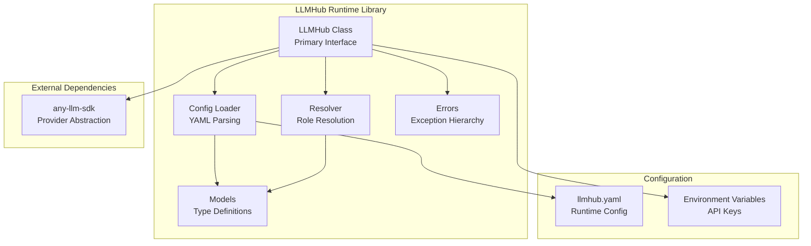
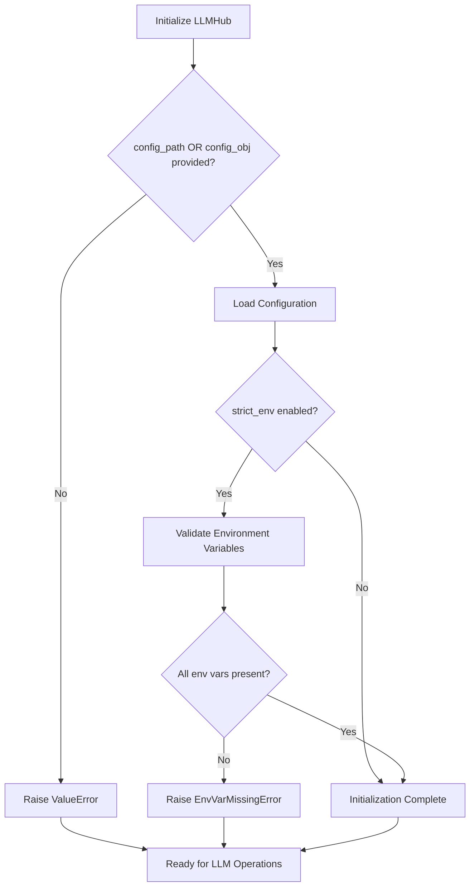
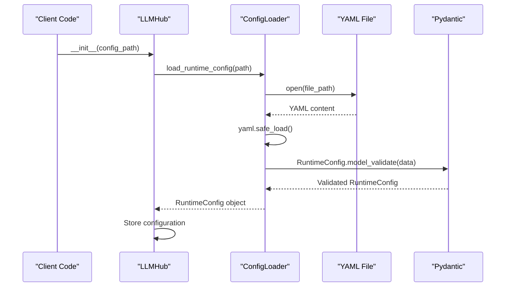
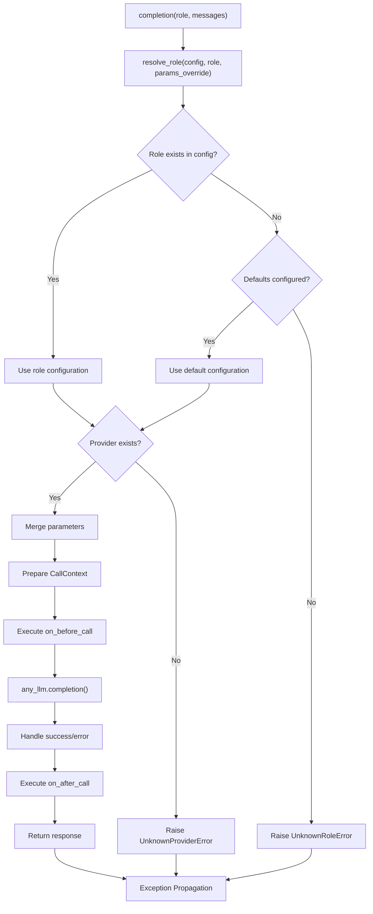
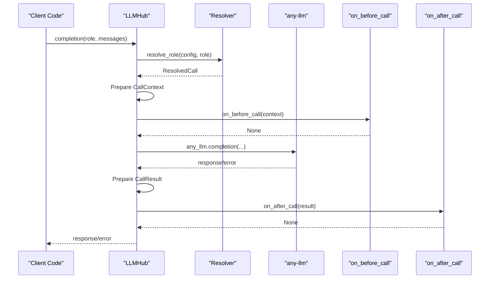
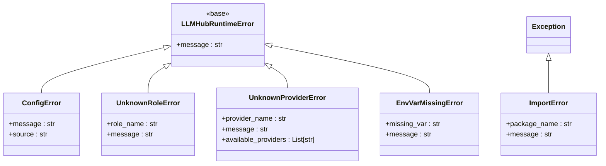
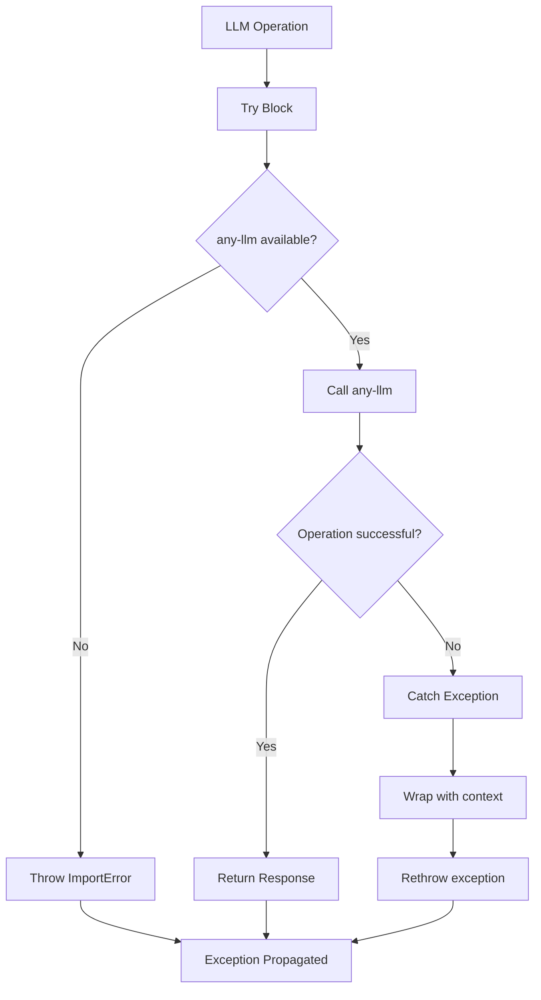

# Runtime Library API

<cite>
**Referenced Files in This Document**
- [hub.py](file://packages/llmhub_runtime/src/llmhub_runtime/hub.py)
- [models.py](file://packages/llmhub_runtime/src/llmhub_runtime/models.py)
- [config_loader.py](file://packages/llmhub_runtime/src/llmhub_runtime/config_loader.py)
- [resolver.py](file://packages/llmhub_runtime/src/llmhub_runtime/resolver.py)
- [errors.py](file://packages/llmhub_runtime/src/llmhub_runtime/errors.py)
- [test_hub_basic.py](file://packages/llmhub_runtime/tests/test_hub_basic.py)
- [llmhub.yaml](file://packages/llmhub_runtime/tests/fixtures/llmhub.yaml)
- [__init__.py](file://packages/llmhub_runtime/src/llmhub_runtime/__init__.py)
</cite>

## Table of Contents
1. [Introduction](#introduction)
2. [Core Architecture](#core-architecture)
3. [LLMHub Class](#llmhub-class)
4. [Configuration Management](#configuration-management)
5. [Method APIs](#method-apis)
6. [Hook System](#hook-system)
7. [Error Handling](#error-handling)
8. [Type Definitions](#type-definitions)
9. [Usage Examples](#usage-examples)
10. [Integration Patterns](#integration-patterns)
11. [Versioning and Compatibility](#versioning-and-compatibility)

## Introduction

The LLMHub runtime library provides a unified interface for interacting with various Large Language Model (LLM) providers through a configuration-driven approach. The library abstracts provider-specific implementations behind a consistent API, enabling seamless switching between different LLM services while maintaining configuration portability.

The runtime library centers around the `LLMHub` class, which serves as the primary entry point for LLM operations. It supports both chat completions and embedding generation through role-based configuration resolution, with built-in observability hooks and comprehensive error handling.

## Core Architecture

The LLMHub runtime follows a modular architecture with clear separation of concerns:



**Diagram sources**
- [hub.py](file://packages/llmhub_runtime/src/llmhub_runtime/hub.py#L1-L189)
- [config_loader.py](file://packages/llmhub_runtime/src/llmhub_runtime/config_loader.py#L1-L43)
- [resolver.py](file://packages/llmhub_runtime/src/llmhub_runtime/resolver.py#L1-L44)

**Section sources**
- [hub.py](file://packages/llmhub_runtime/src/llmhub_runtime/hub.py#L1-L189)
- [models.py](file://packages/llmhub_runtime/src/llmhub_runtime/models.py#L1-L41)

## LLMHub Class

The `LLMHub` class is the central component of the runtime library, providing a unified interface for LLM operations. It manages configuration loading, role resolution, and provider communication through a clean abstraction layer.

### Constructor (__init__)

The constructor accepts several parameters for flexible initialization:

```python
def __init__(
    self,
    config_path: Optional[str] = None,
    config_obj: Optional[RuntimeConfig] = None,
    strict_env: bool = False,
    on_before_call: Optional[Callable[[CallContext], None]] = None,
    on_after_call: Optional[Callable[[CallResult], None]] = None,
)
```

#### Parameter Details

| Parameter | Type | Default | Description |
|-----------|------|---------|-------------|
| `config_path` | `Optional[str]` | `None` | Path to the `llmhub.yaml` configuration file |
| `config_obj` | `Optional[RuntimeConfig]` | `None` | Pre-loaded `RuntimeConfig` object |
| `strict_env` | `bool` | `False` | Enable environment variable validation |
| `on_before_call` | `Optional[Callable[[CallContext], None]]` | `None` | Hook executed before LLM calls |
| `on_after_call` | `Optional[Callable[[CallResult], None]]` | `None` | Hook executed after LLM calls |

#### Validation Rules

The constructor enforces mutual exclusivity between configuration sources:
- Exactly one of `config_path` or `config_obj` must be provided
- Both cannot be `None`
- Both cannot be provided simultaneously

#### Environment Validation

When `strict_env=True`, the constructor validates that all required environment variables are present:



**Diagram sources**
- [hub.py](file://packages/llmhub_runtime/src/llmhub_runtime/hub.py#L18-L54)

**Section sources**
- [hub.py](file://packages/llmhub_runtime/src/llmhub_runtime/hub.py#L18-L54)

## Configuration Management

The runtime library uses a hierarchical configuration system that supports both file-based and programmatic configuration loading.

### Configuration Loading Process



**Diagram sources**
- [hub.py](file://packages/llmhub_runtime/src/llmhub_runtime/hub.py#L43-L46)
- [config_loader.py](file://packages/llmhub_runtime/src/llmhub_runtime/config_loader.py#L6-L25)

### Configuration Structure

The runtime configuration defines providers, roles, and defaults:

| Component | Purpose | Required |
|-----------|---------|----------|
| `project` | Project identifier | Yes |
| `env` | Environment identifier | Yes |
| `providers` | Provider configurations | Yes |
| `roles` | Named role definitions | No |
| `defaults` | Default role fallback | No |

**Section sources**
- [config_loader.py](file://packages/llmhub_runtime/src/llmhub_runtime/config_loader.py#L6-L43)
- [models.py](file://packages/llmhub_runtime/src/llmhub_runtime/models.py#L28-L34)

## Method APIs

The LLMHub class provides two primary methods for LLM operations: `completion()` for chat interactions and `embedding()` for vector generation.

### Completion Method

The `completion()` method handles chat-style LLM interactions:

```python
def completion(
    self,
    role: str,
    messages: List[Dict[str, Any]],
    params_override: Optional[Dict[str, Any]] = None,
) -> Any
```

#### Parameters

| Parameter | Type | Description |
|-----------|------|-------------|
| `role` | `str` | Logical role name to resolve |
| `messages` | `List[Dict[str, Any]]` | Chat message history |
| `params_override` | `Optional[Dict[str, Any]]` | Override default parameters |

#### Return Value
Returns the raw response from the underlying `any-llm` SDK.

#### Message Format
Messages follow the standard OpenAI chat format:
```python
[
    {"role": "system", "content": "You are a helpful assistant"},
    {"role": "user", "content": "Hello, world!"},
    {"role": "assistant", "content": "Hello! How can I help you?"}
]
```

#### Role Resolution Process



**Diagram sources**
- [hub.py](file://packages/llmhub_runtime/src/llmhub_runtime/hub.py#L61-L115)
- [resolver.py](file://packages/llmhub_runtime/src/llmhub_runtime/resolver.py#L5-L44)

**Section sources**
- [hub.py](file://packages/llmhub_runtime/src/llmhub_runtime/hub.py#L61-L115)

### Embedding Method

The `embedding()` method generates vector embeddings for text inputs:

```python
def embedding(
    self,
    role: str,
    input: Union[str, List[str]],
    params_override: Optional[Dict[str, Any]] = None,
) -> Any
```

#### Parameters

| Parameter | Type | Description |
|-----------|------|-------------|
| `role` | `str` | Logical role name to resolve |
| `input` | `Union[str, List[str]]` | Text or list of texts to embed |
| `params_override` | `Optional[Dict[str, Any]]` | Override default parameters |

#### Return Value
Returns the raw embedding response from the underlying `any-llm` SDK.

#### Key Differences from Completion
- Uses `any_llm.embedding()` instead of `any_llm.completion()`
- Accepts both single strings and lists of strings
- Passes input as `inputs` parameter (not `messages`)

**Section sources**
- [hub.py](file://packages/llmhub_runtime/src/llmhub_runtime/hub.py#L127-L189)

## Hook System

The LLMHub class provides a sophisticated hook system for observability and monitoring capabilities. Hooks are executed around each LLM call, providing access to call context and results.

### Hook Types and Signatures

```python
# Before-call hook receives CallContext
CallContext = Dict[str, Any]
on_before_call: Optional[Callable[[CallContext], None]]

# After-call hook receives CallResult  
CallResult = Dict[str, Any]
on_after_call: Optional[Callable[[CallResult], None]]
```

### CallContext Structure

The `CallContext` dictionary contains all relevant information before the LLM call:

| Key | Type | Description |
|-----|------|-------------|
| `role` | `str` | Resolved role name |
| `provider` | `str` | Provider identifier |
| `model` | `str` | Model name |
| `mode` | `LLMMode` | Operation mode (chat/embedding/etc.) |
| `params` | `Dict[str, Any]` | Final parameters |
| `messages` | `List[Dict[str, Any]]` | Chat messages (completion only) |
| `input` | `Union[str, List[str]]` | Input text (embedding only) |

### CallResult Structure

The `CallResult` dictionary captures the outcome of the LLM call:

| Key | Type | Description |
|-----|------|-------------|
| `role` | `str` | Resolved role name |
| `provider` | `str` | Provider identifier |
| `model` | `str` | Model name |
| `mode` | `LLMMode` | Operation mode |
| `success` | `bool` | Whether call succeeded |
| `error` | `Optional[Exception]` | Exception if failed |
| `response` | `Any` | LLM response or None |
| `duration_ms` | `Optional[float]` | Execution time (not implemented) |

### Hook Execution Flow



**Diagram sources**
- [hub.py](file://packages/llmhub_runtime/src/llmhub_runtime/hub.py#L80-L125)

**Section sources**
- [hub.py](file://packages/llmhub_runtime/src/llmhub_runtime/hub.py#L13-L16)

## Error Handling

The LLMHub runtime library implements a comprehensive error handling system with specific exceptions for different failure scenarios.

### Exception Hierarchy



**Diagram sources**
- [errors.py](file://packages/llmhub_runtime/src/llmhub_runtime/errors.py#L1-L20)

### Error Scenarios and Handling

| Error Type | Trigger Condition | Recovery Strategy |
|------------|-------------------|-------------------|
| `ValueError` | Invalid constructor arguments | Fix parameter validation |
| `ConfigError` | Invalid YAML or validation failure | Correct configuration file |
| `UnknownRoleError` | Role not found and no defaults | Define role or configure defaults |
| `UnknownProviderError` | Provider not defined | Add provider to configuration |
| `EnvVarMissingError` | Missing environment variable | Set required environment variable |
| `ImportError` | `any-llm-sdk` not installed | Install required package |

### Exception Propagation

The runtime library propagates exceptions from underlying SDKs while providing context:



**Diagram sources**
- [hub.py](file://packages/llmhub_runtime/src/llmhub_runtime/hub.py#L98-L112)

**Section sources**
- [errors.py](file://packages/llmhub_runtime/src/llmhub_runtime/errors.py#L1-L20)
- [hub.py](file://packages/llmhub_runtime/src/llmhub_runtime/hub.py#L98-L112)

## Type Definitions

The LLMHub runtime library defines several key types for type safety and documentation.

### Core Model Types

| Type | Purpose | Fields |
|------|---------|--------|
| `RuntimeConfig` | Root configuration | `project`, `env`, `providers`, `roles`, `defaults` |
| `ProviderConfig` | Provider settings | `env_key` (optional) |
| `RoleConfig` | Role definition | `provider`, `model`, `mode`, `params` |
| `ResolvedCall` | Resolved operation | `role`, `provider`, `model`, `mode`, `params` |

### Mode Enumeration

The `LLMMode` enumeration defines supported operation types:

| Mode | Value | Usage |
|------|-------|-------|
| `chat` | `"chat"` | Text conversation |
| `embedding` | `"embedding"` | Vector generation |
| `image` | `"image"` | Image generation |
| `audio` | `"audio"` | Audio processing |
| `tool` | `"tool"` | Tool invocation |
| `other` | `"other"` | Other operations |

### Type Aliases

The library defines type aliases for common patterns:

```python
# Hook context/result dictionaries
CallContext = Dict[str, Any]
CallResult = Dict[str, Any]

# Flexible input types
InputType = Union[str, List[str]]
```

**Section sources**
- [models.py](file://packages/llmhub_runtime/src/llmhub_runtime/models.py#L1-L41)

## Usage Examples

### Basic Instantiation

#### From Configuration File
```python
from llmhub_runtime import LLMHub

# Load from YAML file
hub = LLMHub(config_path="./llmhub.yaml")

# With environment validation
hub = LLMHub(config_path="./llmhub.yaml", strict_env=True)
```

#### From Pre-loaded Configuration
```python
from llmhub_runtime import LLMHub, RuntimeConfig

# Create configuration programmatically
config = RuntimeConfig(
    project="my-project",
    env="production",
    providers={
        "openai": ProviderConfig(env_key="OPENAI_API_KEY")
    },
    roles={
        "inference": RoleConfig(
            provider="openai",
            model="gpt-4",
            mode="chat",
            params={"temperature": 0.7}
        )
    }
)

hub = LLMHub(config_obj=config)
```

### Chat Completion Example

```python
# Basic chat completion
messages = [
    {"role": "system", "content": "You are a helpful assistant."},
    {"role": "user", "content": "Explain quantum computing."}
]

response = hub.completion(
    role="inference",
    messages=messages,
    params_override={"max_tokens": 500}
)
```

### Embedding Generation Example

```python
# Single text embedding
text = "The quick brown fox jumps over the lazy dog."
embedding = hub.embedding(
    role="embedding",
    input=text
)

# Batch embedding
texts = ["First text", "Second text", "Third text"]
embeddings = hub.embedding(
    role="embedding",
    input=texts
)
```

### Hook Integration Example

```python
import logging
from datetime import datetime

def before_hook(context):
    """Log call details before execution"""
    logging.info(f"Calling {context['provider']}::{context['model']}")
    logging.info(f"Role: {context['role']}, Mode: {context['mode']}")
    logging.info(f"Parameters: {context['params']}")

def after_hook(result):
    """Log call results after execution"""
    duration = datetime.now() - result.get('start_time', datetime.now())
    logging.info(f"Call completed in {duration.total_seconds():.2f}s")
    logging.info(f"Success: {result['success']}")
    
    if not result['success']:
        logging.error(f"Error: {result['error']}")

# Attach hooks
hub = LLMHub(
    config_path="./llmhub.yaml",
    on_before_call=before_hook,
    on_after_call=after_hook
)
```

### Error Handling Pattern

```python
from llmhub_runtime.errors import (
    UnknownRoleError, 
    UnknownProviderError, 
    EnvVarMissingError,
    ConfigError
)

try:
    hub = LLMHub(config_path="./llmhub.yaml")
    
    try:
        response = hub.completion(
            role="nonexistent-role",
            messages=[{"role": "user", "content": "Hello"}]
        )
    except UnknownRoleError as e:
        print(f"Role not found: {e}")
        # Handle missing role
        
    except UnknownProviderError as e:
        print(f"Provider not configured: {e}")
        # Handle provider configuration
        
except EnvVarMissingError as e:
    print(f"Missing environment variable: {e}")
    # Handle missing API keys
    
except ConfigError as e:
    print(f"Configuration error: {e}")
    # Handle YAML parsing/validation
    
except Exception as e:
    print(f"Unexpected error: {e}")
    # Handle other exceptions
```

**Section sources**
- [test_hub_basic.py](file://packages/llmhub_runtime/tests/test_hub_basic.py#L16-L79)
- [llmhub.yaml](file://packages/llmhub_runtime/tests/fixtures/llmhub.yaml#L1-L51)

## Integration Patterns

### Observability Integration

The hook system enables comprehensive observability integration:

```python
import structlog
from typing import Dict, Any

class ObservabilityHooks:
    def __init__(self, logger):
        self.logger = logger
    
    def before_call(self, context: Dict[str, Any]):
        self.logger.info("llm_call_start", **context)
    
    def after_call(self, result: Dict[str, Any]):
        log_data = {
            "success": result["success"],
            "provider": result["provider"],
            "model": result["model"],
            "role": result["role"]
        }
        
        if not result["success"]:
            log_data["error"] = str(result["error"])
        
        self.logger.info("llm_call_end", **log_data)

# Usage with structured logging
logger = structlog.get_logger()
hooks = ObservabilityHooks(logger)

hub = LLMHub(
    config_path="./llmhub.yaml",
    on_before_call=hooks.before_call,
    on_after_call=hooks.after_call
)
```

### Monitoring Integration

```python
from prometheus_client import Counter, Histogram

class MetricsHooks:
    def __init__(self):
        self.success_counter = Counter(
            'llm_calls_total', 
            'Total LLM calls', 
            ['provider', 'model', 'role']
        )
        self.duration_histogram = Histogram(
            'llm_call_duration_seconds',
            'LLM call duration',
            ['provider', 'model', 'role']
        )
    
    def before_call(self, context):
        # Record start time
        context['start_time'] = time.time()
    
    def after_call(self, result):
        labels = {
            'provider': result['provider'],
            'model': result['model'],
            'role': result['role']
        }
        
        self.success_counter.labels(**labels).inc()
        
        if result['success'] and 'start_time' in result:
            duration = time.time() - result['start_time']
            self.duration_histogram.labels(**labels).observe(duration)

# Usage with Prometheus metrics
metrics = MetricsHooks()

hub = LLMHub(
    config_path="./llmhub.yaml",
    on_before_call=metrics.before_call,
    on_after_call=metrics.after_call
)
```

### Caching Integration

```python
from functools import lru_cache
from typing import Tuple

class CachingHooks:
    def __init__(self, cache_ttl=300):  # 5 minutes
        self.cache = {}
        self.cache_ttl = cache_ttl
    
    def before_call(self, context):
        # Create cache key from call parameters
        cache_key = self._create_cache_key(context)
        context['cache_key'] = cache_key
    
    def after_call(self, result):
        cache_key = result.get('cache_key')
        if cache_key and result['success']:
            self.cache[cache_key] = {
                'response': result['response'],
                'timestamp': time.time()
            }
    
    def _create_cache_key(self, context):
        # Create deterministic cache key
        params_str = json.dumps(context['params'], sort_keys=True)
        return f"{context['provider']}:{context['model']}:{context['role']}:{params_str}"

# Usage with caching
caching = CachingHooks()

hub = LLMHub(
    config_path="./llmhub.yaml",
    on_before_call=caching.before_call,
    on_after_call=caching.after_call
)
```

## Versioning and Compatibility

### Stability Guarantees

The LLMHub runtime library maintains backward compatibility for the public API surface:

#### Public Interface Stability
- `LLMHub` class constructor signature remains stable
- `completion()` and `embedding()` method signatures remain stable
- Hook function signatures remain stable
- Exception hierarchy remains stable

#### Configuration Compatibility
- YAML configuration schema evolves with deprecation warnings
- New configuration fields are additive
- Deprecated fields are maintained for at least one major version

#### Provider Compatibility
- `any-llm-sdk` version compatibility is managed through dependency constraints
- Breaking changes in provider SDKs are handled through adapter layers

### Version Migration

When upgrading the runtime library:

1. **Check API Changes**: Verify constructor parameters haven't changed
2. **Test Configuration**: Validate YAML configuration against new schema
3. **Verify Hooks**: Ensure hook functions match expected signatures
4. **Update Dependencies**: Check `any-llm-sdk` compatibility

### Backward Compatibility Matrix

| Component | v1.0 | v1.1 | v1.2 | Future |
|-----------|------|------|------|--------|
| LLMHub Constructor | ✅ Stable | ✅ Stable | ✅ Stable | ⚠️ May change |
| completion() Method | ✅ Stable | ✅ Stable | ✅ Stable | ⚠️ May change |
| embedding() Method | ✅ Stable | ✅ Stable | ✅ Stable | ⚠️ May change |
| Hook Signatures | ✅ Stable | ✅ Stable | ✅ Stable | ⚠️ May change |
| Configuration Schema | ⚠️ May change | ⚠️ May change | ⚠️ May change | ⚠️ May change |

**Section sources**
- [hub.py](file://packages/llmhub_runtime/src/llmhub_runtime/hub.py#L18-L54)
- [models.py](file://packages/llmhub_runtime/src/llmhub_runtime/models.py#L28-L41)