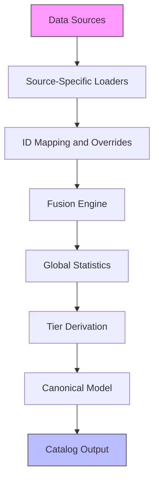
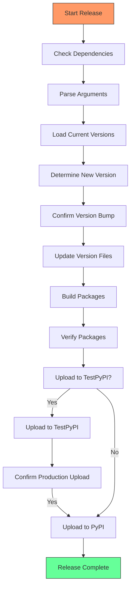

# Advanced Topics

<cite>
**Referenced Files in This Document**   
- [generator_hook.py](file://packages/llmhub/src/llmhub/generator_hook.py)
- [env_manager.py](file://packages/llmhub/src/llmhub/env_manager.py)
- [release.py](file://scripts/release.py)
- [builder.py](file://packages/llmhub/src/llmhub/catalog/builder.py)
- [cache.py](file://packages/llmhub/src/llmhub/catalog/cache.py)
- [schema.py](file://packages/llmhub/src/llmhub/catalog/schema.py)
- [mapper.py](file://packages/llmhub/src/llmhub/catalog/mapper.py)
- [spec_models.py](file://packages/llmhub/src/llmhub/spec_models.py)
- [config_loader.py](file://packages/llmhub_runtime/src/llmhub_runtime/config_loader.py)
</cite>

## Table of Contents
1. [Customization and Extension](#customization-and-extension)
2. [Catalog Extensibility](#catalog-extensibility)
3. [Performance Optimization](#performance-optimization)
4. [Security Considerations](#security-considerations)
5. [Release Process](#release-process)
6. [Development and Contribution](#development-and-contribution)

## Customization and Extension

The LLM Hub framework provides extensibility through the `generator_hook.py` module, which serves as the primary extension point for customizing the generator pipeline. This module implements the `generate_runtime` function that transforms a `SpecConfig` into a `RuntimeConfig`, allowing developers to inject custom logic for model selection, provider configuration, and role assignment.

The generator pipeline follows a structured approach where the `generate_runtime` function processes the specification and applies business logic to determine appropriate models based on role kinds, preferences, and constraints. The `_select_model_stub` function demonstrates the extensibility pattern, where developers can replace the simple heuristic-based selection with more sophisticated algorithms that consider additional factors such as real-time pricing, latency measurements, or custom quality metrics.

Customization options include implementing alternative model selection strategies, integrating with external recommendation systems, or adding validation rules that ensure compliance with organizational policies. The hook system allows for both augmentation of existing behavior and complete replacement of the generation logic while maintaining compatibility with the runtime configuration schema.

**Section sources**
- [generator_hook.py](file://packages/llmhub/src/llmhub/generator_hook.py#L1-L204)
- [spec_models.py](file://packages/llmhub/src/llmhub/spec_models.py#L1-L131)

## Catalog Extensibility

The catalog system supports extensibility through multiple mechanisms that allow for the integration of new data sources and the customization of model metadata. The architecture is designed around a fusion pipeline that combines data from various sources into a unified catalog representation.

The `builder.py` module coordinates the catalog construction process by orchestrating the loading of data from different sources, including any-LLM providers, models.dev metadata, and LMArena quality scores. Each source is handled by dedicated modules (`anyllm_source.py`, `modelsdev_source.py`, `arena_source.py`) that can be extended to support additional data providers.

The mapping and fusion process, implemented in `mapper.py`, resolves identifier discrepancies between sources using a combination of direct matching, override mappings, and fuzzy matching based on normalized model names. The `overrides.json` file in the catalog data directory provides a mechanism for manual corrections and mappings that cannot be resolved algorithmically.

New data sources can be integrated by implementing source-specific loader functions that conform to the expected interface and registering them in the build pipeline. The schema defined in `schema.py` establishes the contract for data models, ensuring consistency across sources while allowing for source-specific extensions.



**Diagram sources **
- [builder.py](file://packages/llmhub/src/llmhub/catalog/builder.py#L1-L388)
- [mapper.py](file://packages/llmhub/src/llmhub/catalog/mapper.py#L1-L114)
- [schema.py](file://packages/llmhub/src/llmhub/catalog/schema.py#L1-L122)

**Section sources**
- [builder.py](file://packages/llmhub/src/llmhub/catalog/builder.py#L1-L388)
- [mapper.py](file://packages/llmhub/src/llmhub/catalog/mapper.py#L1-L114)
- [data/overrides.json](file://packages/llmhub/src/llmhub/catalog/data/overrides.json#L1-L32)

## Performance Optimization

The LLM Hub implements several performance optimization techniques to ensure efficient operation, particularly in scenarios involving frequent catalog access and configuration loading. The most significant optimization is the disk-based caching system for the catalog, which reduces the overhead of rebuilding the catalog from source data on each access.

The `cache.py` module provides a TTL-based caching mechanism that stores the serialized catalog in the user's configuration directory, with the location determined by the operating system's conventions. The cache validity is controlled by a configurable TTL parameter (default 24 hours), after which the catalog is considered stale and will be rebuilt on the next access.

Catalog building performance is optimized through parallel data source loading and efficient data fusion algorithms. The builder implements early termination conditions and error tolerance to prevent single source failures from blocking the entire catalog generation process. The fusion algorithm uses dictionary lookups and pre-computed mappings to minimize the computational complexity of aligning records across sources.

Configuration loading is optimized through the use of validated data models and efficient YAML parsing. The `config_loader.py` in the runtime package implements a two-step process that separates file I/O from schema validation, allowing for better error handling and performance monitoring.

```mermaid
flowchart LR
A["Catalog Request"] --> B{"Cache Exists?"}
B --> |Yes| C{"Fresh (TTL)?}
B --> |No| D["Build from Sources"]
C --> |Yes| E["Return Cached"]
C --> |No| D
D --> F["Load Source Data"]
F --> G["Fuse Records"]
G --> H["Compute Statistics"]
H --> I["Save to Cache"]
I --> J["Return Catalog"]
style E fill:#cfc,stroke:#333
style J fill:#cfc,stroke:#333
```

**Diagram sources **
- [cache.py](file://packages/llmhub/src/llmhub/catalog/cache.py#L1-L111)
- [builder.py](file://packages/llmhub/src/llmhub/catalog/builder.py#L1-L388)

**Section sources**
- [cache.py](file://packages/llmhub/src/llmhub/catalog/cache.py#L1-L111)
- [builder.py](file://packages/llmhub/src/llmhub/catalog/builder.py#L1-L388)
- [config_loader.py](file://packages/llmhub_runtime/src/llmhub_runtime/config_loader.py#L1-L43)

## Security Considerations

The LLM Hub framework incorporates several security features to protect sensitive information and ensure secure operation in various deployment environments. The most critical security aspect is API key management, which follows the principle of least privilege and separation of concerns.

The `env_manager.py` module provides utilities for managing environment variables that contain API credentials. The `check_env` function validates that required environment variables are present before attempting to use providers, preventing accidental exposure of missing credentials in error messages. The `generate_env_example` function creates template files that guide users in setting up their environment without including actual secret values.

Environment isolation is achieved through the use of separate configuration files for different deployment environments (development, staging, production). The framework encourages the use of environment-specific configuration that can be managed through version control without exposing secrets.

Secure defaults are implemented throughout the system, including the automatic loading of `.env` files from secure locations (project root, home directory) and the validation of configuration inputs. The catalog builder implements secure handling of external data sources, with error handling that prevents malformed data from compromising system integrity.

The release process incorporates security checks through dependency verification and signed package distribution. The framework follows security best practices in its dependencies and regularly updates third-party components to address known vulnerabilities.

**Section sources**
- [env_manager.py](file://packages/llmhub/src/llmhub/env_manager.py#L1-L72)
- [builder.py](file://packages/llmhub/src/llmhub/catalog/builder.py#L1-L388)

## Release Process

The release process for LLM Hub is automated through the `scripts/release.py` script, which handles versioning, package building, verification, and deployment to PyPI. The release workflow follows semantic versioning and supports both individual package releases and coordinated releases of multiple packages.

The release script implements a four-step process: version bumping, package building, integrity verification, and PyPI upload. Version bumps can be applied to patch, minor, or major levels, with the option to specify an exact version. The script automatically updates version numbers in `pyproject.toml` files and adjusts dependency specifications accordingly.

Package building uses the standard `build` backend to create distribution archives, with automatic cleanup of previous build artifacts. The verification step employs `twine check` to validate package metadata and file contents before upload, preventing common packaging errors.

Authentication with PyPI is handled securely through environment variables or interactive input, with support for both the production PyPI registry and TestPyPI for pre-release testing. The script recommends a two-stage release process where packages are first published to TestPyPI for validation before being released to the production index.

The release process includes safeguards such as user confirmation prompts before critical operations and comprehensive error handling that provides clear feedback on failures. Post-release instructions guide maintainers through the necessary Git operations to tag the release and update the repository.



**Diagram sources **
- [release.py](file://scripts/release.py#L1-L522)

**Section sources**
- [release.py](file://scripts/release.py#L1-L522)

## Development and Contribution

The LLM Hub project welcomes contributions and provides a structured development environment to support contributor onboarding. The development workflow is designed to ensure code quality, maintainability, and backward compatibility.

Contributors should set up their development environment by installing the package in editable mode with development dependencies. This allows for immediate testing of changes and access to the full suite of development tools. The project uses standard Python packaging conventions with `pyproject.toml` for dependency management.

Coding standards follow PEP 8 guidelines with type hints for all public interfaces. The project employs automated testing with pytest, and contributors are expected to maintain high test coverage for new features and bug fixes. Test files are colocated with the modules they test, following the established pattern in the codebase.

The contribution process includes creating feature branches, writing comprehensive tests, and submitting pull requests for review. The project maintains a clear separation between the core package and the runtime package, with well-defined interfaces that minimize coupling.

Documentation updates are required for all user-facing changes, ensuring that the documentation remains accurate and comprehensive. The project uses a combination of inline docstrings, module-level documentation, and external guides to provide multiple levels of detail for different user needs.

**Section sources**
- [env_manager.py](file://packages/llmhub/src/llmhub/env_manager.py#L1-L72)
- [test_env_manager.py](file://packages/llmhub/tests/test_env_manager.py#L1-L139)
- [release.py](file://scripts/release.py#L1-L522)