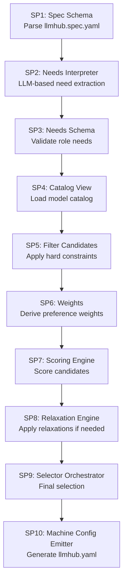
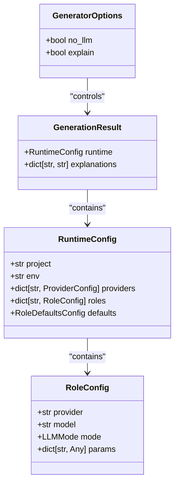
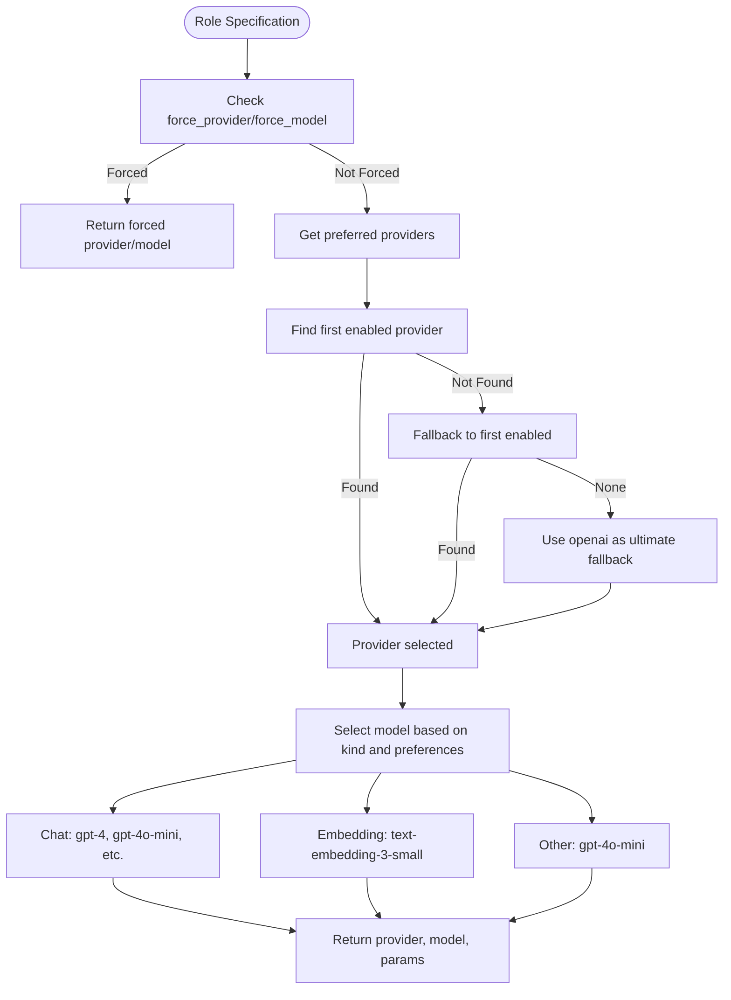
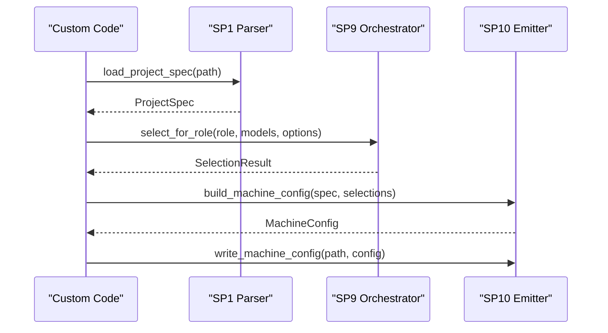
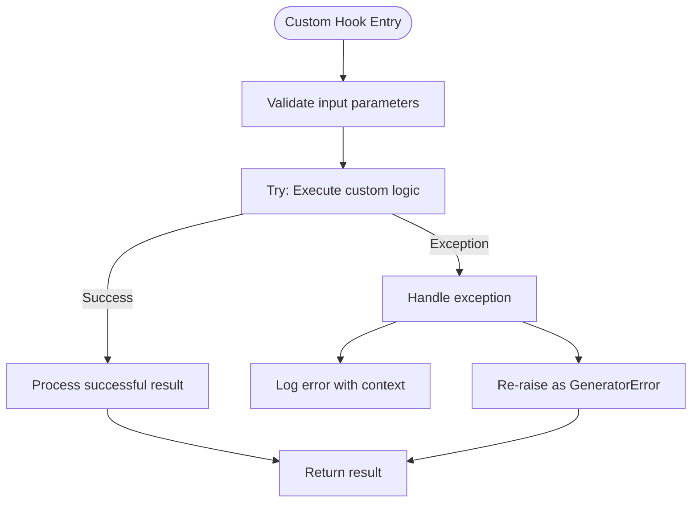

# Customizing the Generator

<cite>
**Referenced Files in This Document**   
- [generator_hook.py](file://packages/llmhub/src/llmhub/generator_hook.py)
- [spec_models.py](file://packages/llmhub/src/llmhub/spec_models.py)
- [orchestrator.py](file://packages/llmhub/src/llmhub/generator/sp9_selector_orchestrator/orchestrator.py)
- [models.py](file://packages/llmhub/src/llmhub/generator/sp9_selector_orchestrator/models.py)
- [builder.py](file://packages/llmhub/src/llmhub/generator/sp10_machine_config_emitter/builder.py)
- [context.py](file://packages/llmhub/src/llmhub/context.py)
- [cli.py](file://packages/llmhub/src/llmhub/cli.py)
</cite>

## Table of Contents
1. [Introduction](#introduction)
2. [Generator Pipeline Overview](#generator-pipeline-overview)
3. [GeneratorOptions and GenerationResult Models](#generatoroptions-and-generationresult-models)
4. [Customizing Model Selection Logic](#customizing-model-selection-logic)
5. [Implementing Custom Hooks](#implementing-custom-hooks)
6. [Integration with Orchestrator and Parser Components](#integration-with-orchestrator-and-parser-components)
7. [Common Issues and Best Practices](#common-issues-and-best-practices)
8. [Conclusion](#conclusion)

## Introduction

The LLM Hub generator pipeline provides a flexible framework for converting human-readable specifications into machine-executable configurations. This document details how developers can customize the generation process through hooks, model extensions, and integration with core components. The system follows a 10-step pipeline (SP1-SP10) that transforms high-level project specs into runtime-ready machine configurations.

**Section sources**
- [generator_hook.py](file://packages/llmhub/src/llmhub/generator_hook.py#L1-L204)
- [spec_models.py](file://packages/llmhub/src/llmhub/spec_models.py#L1-L131)

## Generator Pipeline Overview

The generator follows a structured 10-step process to transform specifications into executable configurations:



**Diagram sources**
- [__init__.py](file://packages/llmhub/src/llmhub/generator/__init__.py#L52-L117)
- [orchestrator.py](file://packages/llmhub/src/llmhub/generator/sp9_selector_orchestrator/orchestrator.py#L16-L109)

The pipeline begins with specification parsing (SP1) and progresses through increasingly sophisticated selection stages, culminating in machine configuration emission (SP10). Each stage can be customized through hooks or direct extension of core logic.

**Section sources**
- [__init__.py](file://packages/llmhub/src/llmhub/generator/__init__.py#L52-L117)
- [orchestrator.py](file://packages/llmhub/src/llmhub/generator/sp9_selector_orchestrator/orchestrator.py#L16-L109)

## GeneratorOptions and GenerationResult Models

The `GeneratorOptions` and `GenerationResult` models provide the interface for controlling and receiving generation outcomes. These Pydantic models define the contract between the generator and its consumers.



**Diagram sources**
- [generator_hook.py](file://packages/llmhub/src/llmhub/generator_hook.py#L13-L23)
- [generator_hook.py](file://packages/llmhub/src/llmhub/generator_hook.py#L132-L204)

`GeneratorOptions` allows control over generation behavior:
- `no_llm`: Skip LLM-based processing when set to True
- `explain`: Generate explanatory text for selection decisions

`GenerationResult` encapsulates the output:
- `runtime`: The generated `RuntimeConfig` object
- `explanations`: Dictionary mapping role names to explanation strings when `explain=True`

These models enable predictable interfaces for both programmatic and CLI-based interactions with the generator.

**Section sources**
- [generator_hook.py](file://packages/llmhub/src/llmhub/generator_hook.py#L13-L23)
- [generator_hook.py](file://packages/llmhub/src/llmhub/generator_hook.py#L132-L204)

## Customizing Model Selection Logic

The model selection process can be customized by extending the `_select_model_stub` function in `generator_hook.py`. This function implements the core logic for mapping role specifications to concrete provider-model combinations.



**Diagram sources**
- [generator_hook.py](file://packages/llmhub/src/llmhub/generator_hook.py#L38-L130)

The selection logic follows a priority hierarchy:
1. Forced provider/model from role specification
2. Preferred providers from role preferences or defaults
3. First enabled provider in the specification
4. OpenAI as ultimate fallback

Model selection varies by `RoleKind`:
- **Chat**: Selected based on quality/cost preferences
- **Embedding**: Uses `text-embedding-3-small` with provider fallback
- **Other**: Defaults to `gpt-4o-mini`

Developers can extend this logic by modifying the conditional branches or adding new role kinds.

**Section sources**
- [generator_hook.py](file://packages/llmhub/src/llmhub/generator_hook.py#L38-L130)
- [spec_models.py](file://packages/llmhub/src/llmhub/spec_models.py#L20-L28)

## Implementing Custom Hooks

Custom hooks can be implemented by extending the functions in `generator_hook.py`. These hooks allow injection of custom logic at various stages of the generation process.

The primary extension points include:
- `_select_model_stub`: Core model selection logic
- `generate_runtime`: Main generation function
- `_map_kind_to_mode`: Role kind to runtime mode mapping

To implement a custom hook, create a new module that imports and extends these functions:

```python
# custom_generator.py
from llmhub.generator_hook import generate_runtime, GeneratorOptions, GenerationResult
from llmhub.spec_models import SpecConfig, RoleKind

def custom_select_model(spec: SpecConfig, role_name: str) -> tuple[str, str, dict]:
    # Custom selection logic here
    pass

def custom_generate_runtime(spec: SpecConfig, options: GeneratorOptions = None) -> GenerationResult:
    # Wrap original function with custom pre/post processing
    result = generate_runtime(spec, options)
    # Add custom post-processing
    return result
```

Hooks can be used for:
- Preprocessing specifications before generation
- Modifying selection logic based on external data sources
- Post-processing configurations for specific deployment environments
- Integrating with monitoring or analytics systems

**Section sources**
- [generator_hook.py](file://packages/llmhub/src/llmhub/generator_hook.py#L38-L130)
- [generator_hook.py](file://packages/llmhub/src/llmhub/generator_hook.py#L132-L204)

## Integration with Orchestrator and Parser Components

The generator pipeline components can be integrated programmatically through their public APIs. The orchestrator (`sp9_selector_orchestrator`) and parser (`sp1_spec_schema`) components provide well-defined interfaces for customization.



**Diagram sources**
- [parser.py](file://packages/llmhub/src/llmhub/generator/sp1_spec_schema/parser.py#L32-L66)
- [orchestrator.py](file://packages/llmhub/src/llmhub/generator/sp9_selector_orchestrator/orchestrator.py#L16-L109)
- [builder.py](file://packages/llmhub/src/llmhub/generator/sp10_machine_config_emitter/builder.py#L19-L113)

Key integration points:
- **Parser**: Use `load_project_spec()` and `parse_project_spec()` to work with specification files
- **Orchestrator**: Use `select_for_role()` with `SelectorOptions` to control selection behavior
- **Emitter**: Use `build_machine_config()` and `write_machine_config()` to generate output

The `SelectorOptions` model allows control over selection behavior:
- `num_backups`: Number of backup models to include
- `require_primary`: Whether to fail if no primary model is found

**Section sources**
- [parser.py](file://packages/llmhub/src/llmhub/generator/sp1_spec_schema/parser.py#L32-L66)
- [orchestrator.py](file://packages/llmhub/src/llmhub/generator/sp9_selector_orchestrator/orchestrator.py#L16-L109)
- [models.py](file://packages/llmhub/src/llmhub/generator/sp9_selector_orchestrator/models.py#L6-L22)
- [builder.py](file://packages/llmhub/src/llmhub/generator/sp10_machine_config_emitter/builder.py#L19-L113)

## Common Issues and Best Practices

When customizing the generator pipeline, several common issues may arise. Understanding these and following best practices ensures reliable and maintainable extensions.

### Hook Ordering and Dependencies

When implementing multiple hooks, ensure proper ordering:
- Preprocessing hooks should execute before selection logic
- Post-processing hooks should execute after configuration generation
- Avoid circular dependencies between hook functions

### Error Handling in Custom Code

Implement robust error handling in custom hooks:



**Diagram sources**
- [generator_hook.py](file://packages/llmhub/src/llmhub/generator_hook.py#L132-L204)
- [__init__.py](file://packages/llmhub/src/llmhub/generator/__init__.py#L47-L50)

Best practices:
- Wrap custom logic in try-except blocks
- Preserve original exception context with `raise ... from e`
- Use descriptive error messages
- Fail fast when preconditions are not met

### Performance Implications

Custom logic can impact generation performance:
- Minimize I/O operations in critical paths
- Cache expensive computations when possible
- Avoid redundant processing of the same data
- Profile custom hooks to identify bottlenecks

The context resolution system (`context.py`) provides utilities for efficient path resolution and project context management, which should be leveraged in custom implementations.

**Section sources**
- [generator_hook.py](file://packages/llmhub/src/llmhub/generator_hook.py#L132-L204)
- [__init__.py](file://packages/llmhub/src/llmhub/generator/__init__.py#L47-L50)
- [context.py](file://packages/llmhub/src/llmhub/context.py#L49-L90)

## Conclusion

The LLM Hub generator pipeline offers extensive customization capabilities through well-defined extension points. By leveraging the `generator_hook.py` interface, developers can inject custom logic at various stages of the generation process, from specification preprocessing to final configuration emission. The `GeneratorOptions` and `GenerationResult` models provide a clean contract for controlling and receiving generation outcomes.

Integration with core components like the orchestrator and parser enables sophisticated customizations that leverage the full power of the 10-step pipeline. When implementing customizations, attention to hook ordering, error handling, and performance considerations ensures robust and maintainable solutions.

The modular architecture supports both simple extensions and complex custom workflows, making it adaptable to a wide range of use cases while maintaining the integrity of the core generation process.