# Extending the Catalog System

<cite>
**Referenced Files in This Document**
- [__init__.py](file://packages/llmhub/src/llmhub/catalog/__init__.py)
- [schema.py](file://packages/llmhub/src/llmhub/catalog/schema.py)
- [builder.py](file://packages/llmhub/src/llmhub/catalog/builder.py)
- [anyllm_source.py](file://packages/llmhub/src/llmhub/catalog/anyllm_source.py)
- [arena_source.py](file://packages/llmhub/src/llmhub/catalog/arena_source.py)
- [modelsdev_source.py](file://packages/llmhub/src/llmhub/catalog/modelsdev_source.py)
- [mapper.py](file://packages/llmhub/src/llmhub/catalog/mapper.py)
- [cache.py](file://packages/llmhub/src/llmhub/catalog/cache.py)
- [overrides.json](file://packages/llmhub/src/llmhub/catalog/data/overrides.json)
- [catalog_cmd.py](file://packages/llmhub/src/llmhub/commands/catalog_cmd.py)
- [plan-catalog.md](file://packages/llmhub/src/llmhub/PLANS/plan-catalog.md)
</cite>

## Table of Contents
1. [Introduction](#introduction)
2. [System Architecture Overview](#system-architecture-overview)
3. [Core Data Models](#core-data-models)
4. [Source Implementation Patterns](#source-implementation-patterns)
5. [Creating New Data Sources](#creating-new-data-sources)
6. [Catalog Builder Pipeline](#catalog-builder-pipeline)
7. [Error Handling and Resilience](#error-handling-and-resilience)
8. [Testing Strategies](#testing-strategies)
9. [Performance Considerations](#performance-considerations)
10. [Best Practices](#best-practices)

## Introduction

The LLM Hub catalog system provides a comprehensive framework for building and maintaining a unified catalog of Large Language Models (LLMs) from multiple data sources. The system aggregates model metadata from various APIs and external services, normalizes the data into a canonical format, and provides intelligent ranking and filtering capabilities.

The catalog system serves as the foundation for the LLM Hub's model discovery and selection functionality, enabling users to make informed decisions about which models to use for their specific requirements. It handles the complexity of dealing with multiple APIs, inconsistent data formats, and varying availability of model information across different providers.

## System Architecture Overview

The catalog system follows a modular architecture with clear separation of concerns:

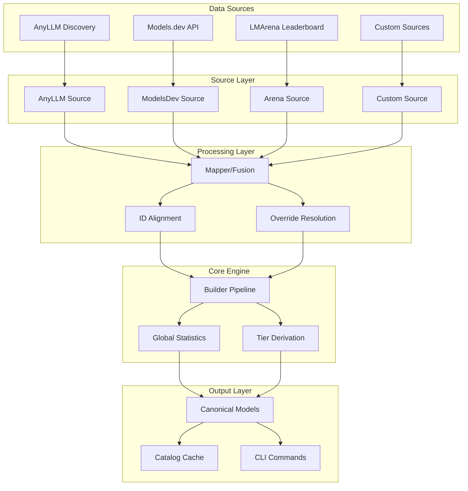

**Diagram sources**
- [builder.py](file://packages/llmhub/src/llmhub/catalog/builder.py#L302-L388)
- [mapper.py](file://packages/llmhub/src/llmhub/catalog/mapper.py#L32-L114)

**Section sources**
- [builder.py](file://packages/llmhub/src/llmhub/catalog/builder.py#L302-L388)
- [__init__.py](file://packages/llmhub/src/llmhub/catalog/__init__.py#L1-L17)

## Core Data Models

The catalog system defines several key data models that represent different stages of the data processing pipeline:

### Schema Definition

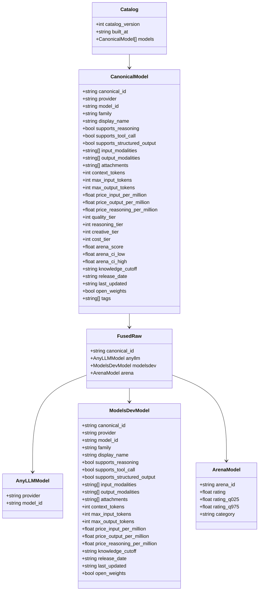

**Diagram sources**
- [schema.py](file://packages/llmhub/src/llmhub/catalog/schema.py#L12-L122)

### Data Flow Architecture

The system processes data through multiple stages, transforming raw source data into enriched canonical models:

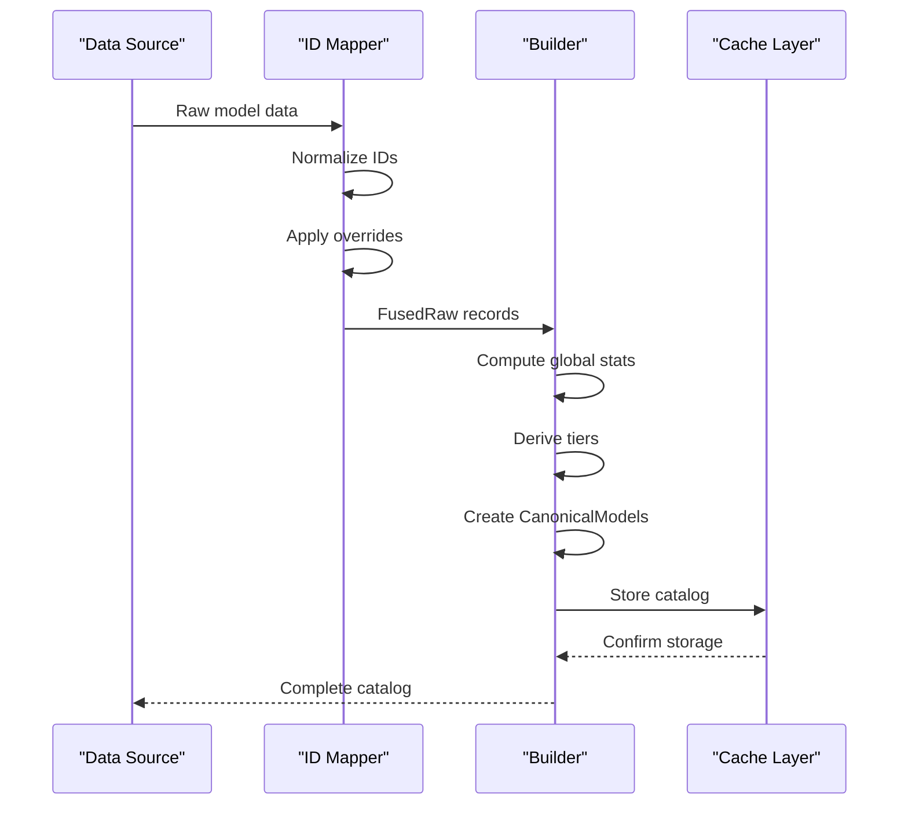

**Diagram sources**
- [mapper.py](file://packages/llmhub/src/llmhub/catalog/mapper.py#L32-L114)
- [builder.py](file://packages/llmhub/src/llmhub/catalog/builder.py#L302-L388)

**Section sources**
- [schema.py](file://packages/llmhub/src/llmhub/catalog/schema.py#L1-L122)

## Source Implementation Patterns

The catalog system demonstrates excellent separation of concerns through its source implementation patterns. Each source module follows a consistent interface pattern while handling the unique requirements of different APIs.

### AnyLLM Source Pattern

The AnyLLM source implements a discovery pattern that introspects the local environment to determine available models:

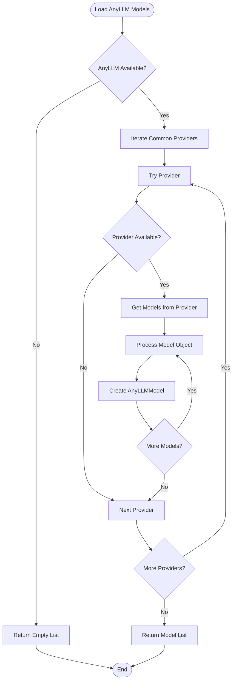

**Diagram sources**
- [anyllm_source.py](file://packages/llmhub/src/llmhub/catalog/anyllm_source.py#L11-L49)

### Models.dev Source Pattern

The Models.dev source implements a standardized fetching and normalization pattern:

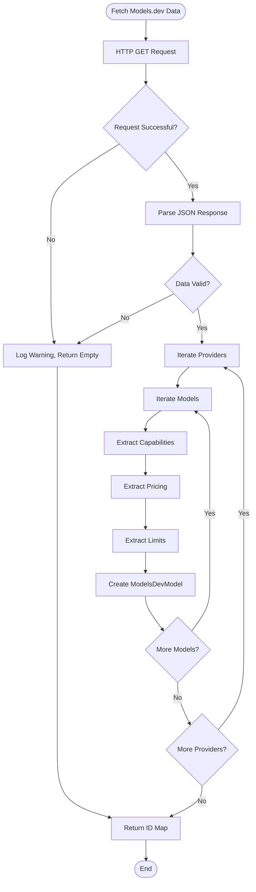

**Diagram sources**
- [modelsdev_source.py](file://packages/llmhub/src/llmhub/catalog/modelsdev_source.py#L11-L142)

### Arena Source Pattern

The Arena source implements a sophisticated caching and fallback mechanism:

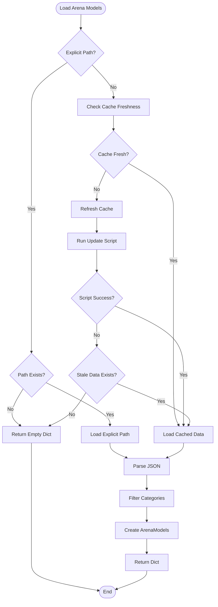

**Diagram sources**
- [arena_source.py](file://packages/llmhub/src/llmhub/catalog/arena_source.py#L165-L227)

**Section sources**
- [anyllm_source.py](file://packages/llmhub/src/llmhub/catalog/anyllm_source.py#L1-L49)
- [modelsdev_source.py](file://packages/llmhub/src/llmhub/catalog/modelsdev_source.py#L1-L142)
- [arena_source.py](file://packages/llmhub/src/llmhub/catalog/arena_source.py#L1-L227)

## Creating New Data Sources

To extend the catalog system with a new data source, you need to implement two core methods and follow established patterns for error handling and data normalization.

### Step 1: Define the Source Model

Create a Pydantic model that represents the raw data from your new source:

```python
# Example: Custom source model definition
class CustomSourceModel(BaseModel):
    """Model metadata from custom API source."""
    provider: str
    model_id: str
    # Additional fields specific to your source
    capabilities: dict
    pricing: dict
    limits: dict
    metadata: dict
```

### Step 2: Implement the Fetch Method

Create a function that retrieves data from your API:

```python
# Example: Custom fetch implementation
def fetch_custom_source_data() -> dict:
    """
    HTTP GET custom API endpoint and return parsed data.
    
    Returns:
        Parsed JSON response as dict.
        
    Raises:
        requests.RequestException: If the request fails.
    """
    url = "https://api.custom-source.com/models"
    
    try:
        response = requests.get(url, timeout=10)
        response.raise_for_status()
        return response.json()
    except requests.RequestException as e:
        print(f"Warning: Failed to fetch custom source data: {e}")
        return {}
```

### Step 3: Implement the Normalize Method

Create a function that transforms raw data into the standardized format:

```python
# Example: Custom normalize implementation
def normalize_custom_source(data: dict) -> dict[str, CustomSourceModel]:
    """
    Normalize custom source data into standardized format.
    
    Args:
        data: Raw JSON from custom API
        
    Returns:
        Dict mapping canonical_id to CustomSourceModel
    """
    normalized: dict[str, CustomSourceModel] = {}
    
    if not data:
        return normalized
    
    # Process data according to your source's structure
    for provider_name, provider_data in data.get("providers", {}).items():
        for model_data in provider_data.get("models", []):
            model_id = model_data.get("id", "")
            if not model_id:
                continue
            
            canonical_id = f"{provider_name}/{model_id}"
            
            # Extract and transform data fields
            normalized[canonical_id] = CustomSourceModel(
                provider=provider_name,
                model_id=model_id,
                # Transform fields appropriately
                capabilities=transform_capabilities(model_data.get("capabilities", {})),
                pricing=transform_pricing(model_data.get("pricing", {})),
                limits=transform_limits(model_data.get("limits", {})),
                metadata=transform_metadata(model_data.get("metadata", {}))
            )
    
    return normalized
```

### Step 4: Integrate with the Builder Pipeline

Add your source to the builder pipeline:

```python
# In builder.py - modify build_catalog function
def build_catalog(
    ttl_hours: int = 24,
    force_refresh: bool = False
) -> Catalog:
    # ... existing code ...
    
    # Load your custom source
    print("Fetching custom source data...")
    custom_data = fetch_custom_source_data()
    custom_map = normalize_custom_source(custom_data)
    
    # Load overrides
    overrides = load_overrides()
    
    # Fuse sources
    print("Fusing data sources...")
    fused_raw = fuse_sources(anyllm_models, modelsdev_map, arena_map, custom_map, overrides)
    
    # ... rest of the pipeline ...
```

### Step 5: Update the Fusion Logic

Modify the mapper to handle your new source:

```python
# In mapper.py - update fuse_sources function
def fuse_sources(
    anyllm_models: list[AnyLLMModel],
    modelsdev_map: dict[str, ModelsDevModel],
    arena_map: dict[str, ArenaModel],
    custom_map: dict[str, CustomSourceModel],
    overrides: dict
) -> list[FusedRaw]:
    """
    Fuse data from all sources including custom source.
    
    Args:
        anyllm_models: List of models from any-llm
        modelsdev_map: Dict of models.dev data
        arena_map: Dict of arena data
        custom_map: Dict of custom source data
        overrides: Override mappings
        
    Returns:
        List of FusedRaw records combining all sources
    """
    fused_records: list[FusedRaw] = []
    
    for anyllm_model in anyllm_models:
        canonical_id = f"{anyllm_model.provider}/{anyllm_model.model_id}"
        
        # Get data from all sources
        modelsdev_model = find_modelsdev_match(canonical_id, modelsdev_map, overrides)
        arena_model = find_arena_match(canonical_id, arena_map, overrides)
        custom_model = find_custom_match(canonical_id, custom_map, overrides)
        
        # Create fused record
        fused_records.append(FusedRaw(
            canonical_id=canonical_id,
            anyllm=anyllm_model,
            modelsdev=modelsdev_model,
            arena=arena_model,
            custom=custom_model  # Add your custom field
        ))
    
    return fused_records
```

### Step 6: Handle Rate Limiting and Authentication

Implement proper error handling and retry logic:

```python
# Example: Enhanced fetch with rate limiting
def fetch_custom_source_data() -> dict:
    """Fetch data with rate limiting and retry logic."""
    url = "https://api.custom-source.com/models"
    headers = {
        "Authorization": f"Bearer {os.getenv('CUSTOM_API_KEY')}",
        "User-Agent": "llmhub-catalog/1.0"
    }
    
    for attempt in range(MAX_RETRIES):
        try:
            response = requests.get(
                url, 
                headers=headers, 
                timeout=REQUEST_TIMEOUT,
                # Implement rate limiting
                params={"rate_limit": "true"}
            )
            
            # Handle rate limiting
            if response.status_code == 429:
                wait_time = calculate_backoff(attempt)
                time.sleep(wait_time)
                continue
                
            response.raise_for_status()
            return response.json()
            
        except requests.RequestException as e:
            if attempt == MAX_RETRIES - 1:
                print(f"Failed to fetch custom source data after {MAX_RETRIES} attempts: {e}")
                return {}
            time.sleep(calculate_backoff(attempt))
    
    return {}
```

**Section sources**
- [builder.py](file://packages/llmhub/src/llmhub/catalog/builder.py#L302-L388)
- [mapper.py](file://packages/llmhub/src/llmhub/catalog/mapper.py#L32-L114)

## Catalog Builder Pipeline

The catalog builder implements a sophisticated pipeline that coordinates data collection, processing, and output generation. Understanding this pipeline is crucial for extending the system effectively.

### Pipeline Architecture

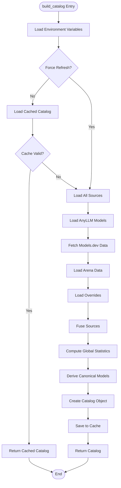

**Diagram sources**
- [builder.py](file://packages/llmhub/src/llmhub/catalog/builder.py#L302-L388)

### Global Statistics Computation

The builder computes global statistics that enable intelligent tier derivation:

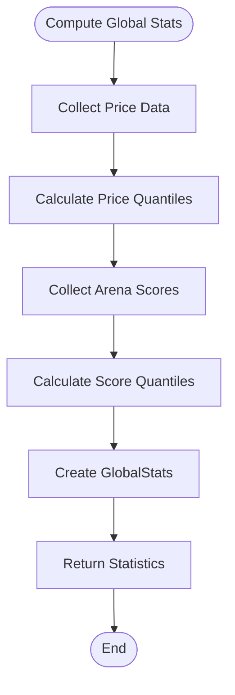

**Diagram sources**
- [builder.py](file://packages/llmhub/src/llmhub/catalog/builder.py#L70-L111)

### Tier Derivation Logic

The system implements sophisticated tier derivation based on statistical analysis:

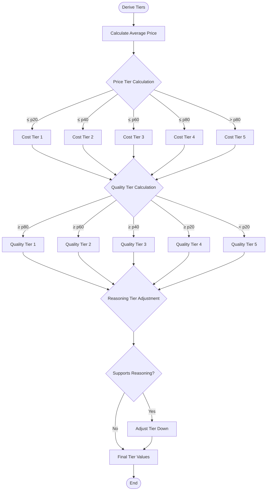

**Diagram sources**
- [builder.py](file://packages/llmhub/src/llmhub/catalog/builder.py#L114-L156)

**Section sources**
- [builder.py](file://packages/llmhub/src/llmhub/catalog/builder.py#L70-L388)

## Error Handling and Resilience

The catalog system implements comprehensive error handling and resilience patterns to ensure reliable operation even when individual sources fail.

### Graceful Degradation Strategy

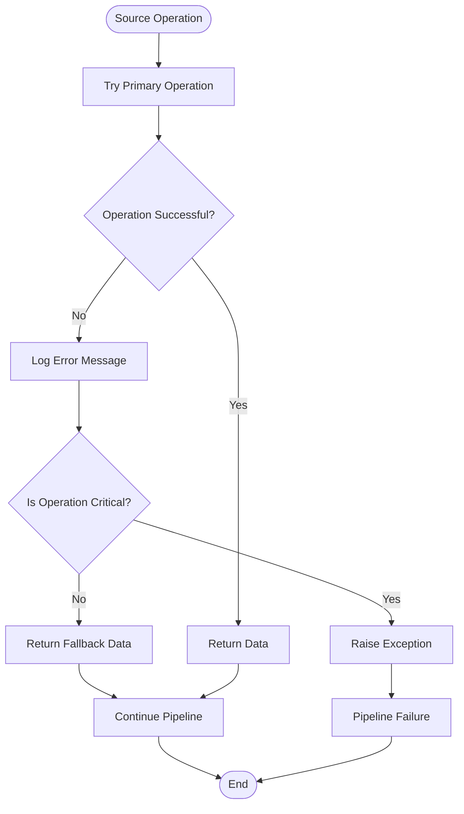

### Error Recovery Patterns

The system implements several error recovery patterns:

1. **Source-Level Fallbacks**: Individual sources can fail independently
2. **Partial Data Processing**: Models with missing data are still included
3. **Cache-Based Recovery**: Stale cache data is used when sources are unavailable
4. **Graceful Degradation**: Missing capabilities are handled with sensible defaults

### Rate Limiting Implementation

```python
# Example rate limiting pattern
class RateLimitHandler:
    def __init__(self, max_requests_per_minute: int = 60):
        self.max_requests = max_requests_per_minute
        self.request_times = deque()
    
    def wait_if_needed(self):
        now = time.time()
        
        # Remove requests older than 1 minute
        while self.request_times and now - self.request_times[0] > 60:
            self.request_times.popleft()
        
        if len(self.request_times) >= self.max_requests:
            sleep_time = 60 - (now - self.request_times[0])
            if sleep_time > 0:
                time.sleep(sleep_time)
        
        self.request_times.append(now)
    
    def make_request(self, func, *args, **kwargs):
        self.wait_if_needed()
        return func(*args, **kwargs)
```

**Section sources**
- [arena_source.py](file://packages/llmhub/src/llmhub/catalog/arena_source.py#L60-L119)
- [modelsdev_source.py](file://packages/llmhub/src/llmhub/catalog/modelsdev_source.py#L11-L31)

## Testing Strategies

Effective testing of catalog sources requires multiple approaches to ensure reliability and correctness.

### Unit Testing Patterns

```python
# Example test structure for a new source
import unittest
from unittest.mock import patch, MagicMock
from catalog.sources.custom_source import (
    fetch_custom_source_data,
    normalize_custom_source,
    CustomSourceModel
)

class TestCustomSource(unittest.TestCase):
    
    @patch('requests.get')
    def test_fetch_success(self, mock_get):
        # Mock successful API response
        mock_response = MagicMock()
        mock_response.json.return_value = {
            "providers": {
                "openai": {
                    "models": [
                        {
                            "id": "gpt-4",
                            "capabilities": {"reasoning": True},
                            "pricing": {"input": 0.03, "output": 0.06}
                        }
                    ]
                }
            }
        }
        mock_get.return_value = mock_response
        
        data = fetch_custom_source_data()
        self.assertIn("providers", data)
    
    @patch('requests.get')
    def test_fetch_failure(self, mock_get):
        # Mock API failure
        mock_get.side_effect = requests.RequestException("Network error")
        
        data = fetch_custom_source_data()
        self.assertEqual(data, {})
    
    def test_normalize_data(self):
        # Test data normalization
        raw_data = {
            "providers": {
                "openai": {
                    "models": [
                        {
                            "id": "gpt-4",
                            "capabilities": {"reasoning": True},
                            "pricing": {"input": 0.03, "output": 0.06}
                        }
                    ]
                }
            }
        }
        
        normalized = normalize_custom_source(raw_data)
        self.assertIn("openai/gpt-4", normalized)
        model = normalized["openai/gpt-4"]
        self.assertTrue(model.supports_reasoning)
        self.assertEqual(model.price_input_per_million, 0.03)
```

### Integration Testing

```python
# Integration test for complete pipeline
class TestCatalogIntegration(unittest.TestCase):
    
    def setUp(self):
        # Reset cache and environment
        cache.clear_cache()
        os.environ.pop('CUSTOM_API_KEY', None)
    
    def test_full_pipeline_with_mocked_sources(self):
        # Mock all external sources
        with patch('catalog.sources.custom_source.fetch_custom_source_data') as mock_custom:
            mock_custom.return_value = {
                "providers": {
                    "openai": {
                        "models": [
                            {
                                "id": "gpt-4",
                                "capabilities": {"reasoning": True},
                                "pricing": {"input": 0.03, "output": 0.06}
                            }
                        ]
                    }
                }
            }
            
            # Mock other sources similarly
            
            # Test the full pipeline
            catalog = build_catalog(ttl_hours=0, force_refresh=True)
            
            # Assertions
            self.assertIsInstance(catalog, Catalog)
            self.assertGreater(len(catalog.models), 0)
            self.assertTrue(any(m.provider == "openai" for m in catalog.models))
```

### Performance Testing

```python
# Performance test for large datasets
class TestSourcePerformance(unittest.TestCase):
    
    def test_large_dataset_processing(self):
        # Generate large mock dataset
        large_data = {"providers": {}}
        for i in range(1000):
            provider = f"provider-{i}"
            large_data["providers"][provider] = {
                "models": [
                    {
                        "id": f"model-{j}",
                        "capabilities": {"reasoning": j % 10 == 0},
                        "pricing": {"input": 0.01, "output": 0.02}
                    }
                    for j in range(10)
                ]
            }
        
        # Measure processing time
        start_time = time.time()
        normalized = normalize_custom_source(large_data)
        end_time = time.time()
        
        # Assert reasonable performance
        self.assertLess(end_time - start_time, 5.0)  # Should process in under 5 seconds
        self.assertEqual(len(normalized), 10000)  # 1000 providers × 10 models each
```

## Performance Considerations

The catalog system is designed to handle performance efficiently while maintaining data freshness and reliability.

### Cache Management

The system implements intelligent caching with configurable TTL:

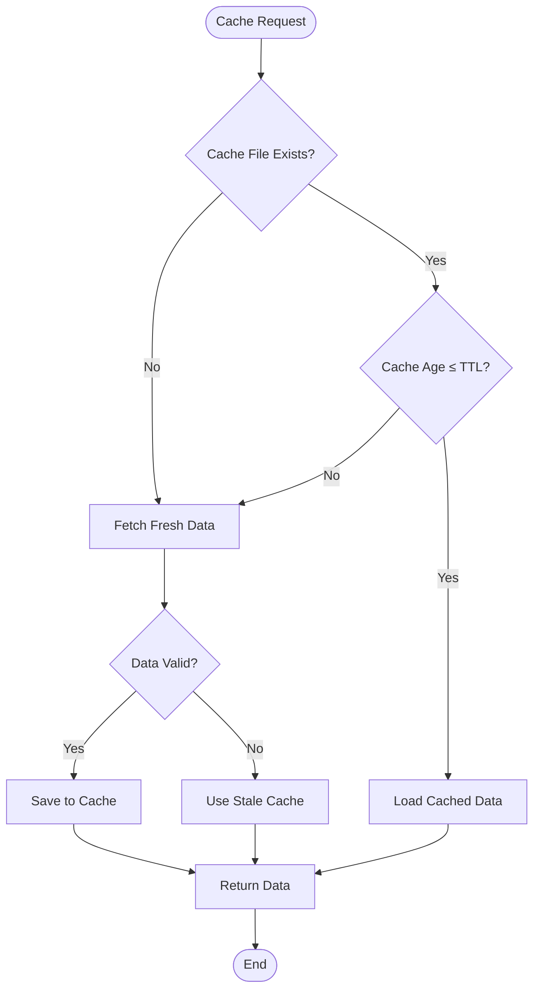

**Diagram sources**
- [cache.py](file://packages/llmhub/src/llmhub/catalog/cache.py#L37-L69)

### Batch Processing Optimization

For large datasets, the system implements batch processing:

```python
# Example batch processing pattern
def process_large_dataset_in_batches(data, batch_size=100):
    """Process large datasets in manageable batches."""
    results = []
    total_items = len(data)
    
    for i in range(0, total_items, batch_size):
        batch = data[i:i + batch_size]
        processed_batch = process_batch(batch)
        results.extend(processed_batch)
        
        # Report progress
        if i % (batch_size * 10) == 0:
            print(f"Processed {min(i + batch_size, total_items)}/{total_items} items")
    
    return results
```

### Memory Management

The system implements memory-efficient processing patterns:

```python
# Memory-efficient streaming approach
def stream_process_sources(source_generators):
    """Stream process multiple sources to minimize memory usage."""
    for source_generator in source_generators:
        try:
            for item in source_generator():
                yield item
        except Exception as e:
            print(f"Warning: Source failed, continuing with others: {e}")
            continue
```

### Concurrent Processing

For independent operations, the system supports concurrent execution:

```python
# Example concurrent processing
async def fetch_all_sources_concurrently():
    """Fetch all data sources concurrently."""
    tasks = [
        asyncio.create_task(fetch_anyllm_models()),
        asyncio.create_task(fetch_modelsdev_data()),
        asyncio.create_task(fetch_arena_data())
    ]
    
    results = await asyncio.gather(*tasks, return_exceptions=True)
    
    # Handle results
    anyllm_models, modelsdev_data, arena_data = results
    if isinstance(anyllm_models, Exception):
        print(f"AnyLLM fetch failed: {anyllm_models}")
        anyllm_models = []
    
    return anyllm_models, modelsdev_data, arena_data
```

**Section sources**
- [cache.py](file://packages/llmhub/src/llmhub/catalog/cache.py#L37-L111)
- [builder.py](file://packages/llmhub/src/llmhub/catalog/builder.py#L302-L388)

## Best Practices

### Data Normalization Guidelines

When implementing new sources, follow these normalization principles:

1. **Consistent ID Scheme**: Use `provider/model_id` format for canonical IDs
2. **Null Safety**: Handle missing fields gracefully with appropriate defaults
3. **Type Consistency**: Ensure consistent data types across all sources
4. **Schema Validation**: Use Pydantic models for automatic validation

### Error Handling Standards

Implement these error handling patterns:

1. **Logging**: Log warnings but don't fail completely
2. **Graceful Degradation**: Provide sensible defaults when data is missing
3. **Retry Logic**: Implement exponential backoff for transient failures
4. **Timeout Handling**: Set reasonable timeouts for all external calls

### Testing Best Practices

1. **Mock External Dependencies**: Use mocks for external APIs in unit tests
2. **Test Edge Cases**: Test with empty data, malformed data, and network failures
3. **Performance Tests**: Include performance tests for large datasets
4. **Integration Tests**: Test the complete pipeline with mocked sources

### Documentation Standards

1. **Clear Comments**: Document complex logic and assumptions
2. **Type Hints**: Use comprehensive type hints
3. **Example Usage**: Include usage examples in docstrings
4. **Error Conditions**: Document expected error conditions and handling

### Security Considerations

1. **API Key Management**: Store credentials securely using environment variables
2. **Rate Limiting**: Implement proper rate limiting to avoid API abuse
3. **Input Validation**: Validate all external input data
4. **Secure Defaults**: Use secure defaults for all configurations

**Section sources**
- [plan-catalog.md](file://packages/llmhub/src/llmhub/PLANS/plan-catalog.md#L430-L491)