# Performance Optimization

<cite>
**Referenced Files in This Document**
- [cache.py](file://packages/llmhub/src/llmhub/catalog/cache.py)
- [loader.py](file://packages/llmhub/src/llmhub/generator/sp4_catalog_view/loader.py)
- [context.py](file://packages/llmhub/src/llmhub/context.py)
- [builder.py](file://packages/llmhub/src/llmhub/catalog/builder.py)
- [schema.py](file://packages/llmhub/src/llmhub/catalog/schema.py)
- [errors.py](file://packages/llmhub/src/llmhub/generator/sp4_catalog_view/errors.py)
- [config_loader.py](file://packages/llmhub_runtime/src/llmhub_runtime/config_loader.py)
- [runtime_io.py](file://packages/llmhub/src/llmhub/runtime_io.py)
- [arena_source.py](file://packages/llmhub/src/llmhub/catalog/arena_source.py)
- [scorer.py](file://packages/llmhub/src/llmhub/generator/sp7_scoring_engine/scorer.py)
- [run_tests_with_report.py](file://packages/llmhub/src/llmhub/tools/run_tests_with_report.py)
</cite>

## Table of Contents
1. [Introduction](#introduction)
2. [Caching Mechanism Architecture](#caching-mechanism-architecture)
3. [Catalog Loading and Validation](#catalog-loading-and-validation)
4. [Generation Time Optimization Strategies](#generation-time-optimization-strategies)
5. [Configuration Loading Performance](#configuration-loading-performance)
6. [Memory Usage Patterns](#memory-usage-patterns)
7. [Cache Management Best Practices](#cache-management-best-practices)
8. [Monitoring and Performance Bottleneck Identification](#monitoring-and-performance-bottleneck-identification)
9. [Large-Scale Deployment Guidelines](#large-scale-deployment-guidelines)
10. [Performance Testing and Benchmarking](#performance-testing-and-benchmarking)
11. [Troubleshooting Performance Issues](#troubleshooting-performance-issues)
12. [Conclusion](#conclusion)

## Introduction

The LLM Hub performance optimization framework focuses on minimizing generation time through intelligent caching, selective updates, and efficient resource utilization. This comprehensive guide addresses the core performance mechanisms including the caching system in `cache.py`, catalog loading efficiency in `sp4_catalog_view`, configuration performance in `context.py`, and monitoring techniques for identifying bottlenecks in the generator pipeline.

Performance optimization in LLM Hub involves multiple interconnected systems that work together to deliver fast, reliable model selection and configuration generation. The system employs sophisticated caching strategies, parallel processing capabilities, and intelligent resource management to handle large-scale deployments with frequent configuration changes.

## Caching Mechanism Architecture

### Disk-Based Caching System

The LLM Hub implements a robust disk-based caching system designed to minimize API calls and reduce generation time through persistent storage of catalog data.

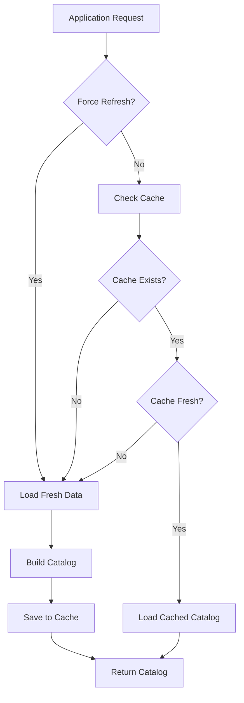

**Diagram sources**
- [cache.py](file://packages/llmhub/src/llmhub/catalog/cache.py#L37-L66)
- [builder.py](file://packages/llmhub/src/llmhub/catalog/builder.py#L302-L387)

### Cache Storage Locations

The caching system automatically determines optimal storage locations based on the operating system:

- **macOS**: `~/.config/llmhub/`
- **Windows**: `%APPDATA%/llmhub/` or `~/AppData/Roaming/llmhub/`
- **Linux**: `~/.config/llmhub/`

**Section sources**
- [cache.py](file://packages/llmhub/src/llmhub/catalog/cache.py#L15-L30)

### TTL-Based Cache Expiration

The cache implements time-to-live (TTL) expiration with configurable intervals:

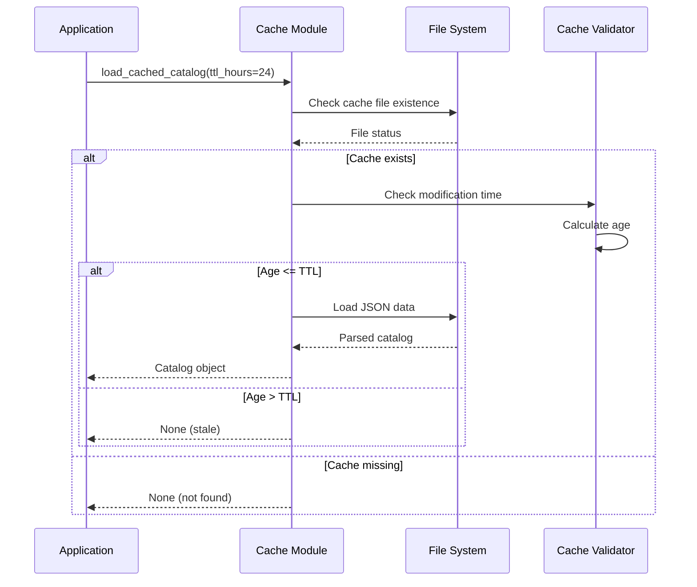

**Diagram sources**
- [cache.py](file://packages/llmhub/src/llmhub/catalog/cache.py#L37-L66)

**Section sources**
- [cache.py](file://packages/llmhub/src/llmhub/catalog/cache.py#L37-L66)

## Catalog Loading and Validation

### Efficient Loader Implementation

The catalog loader in `sp4_catalog_view` provides optimized loading with fallback mechanisms and error handling:

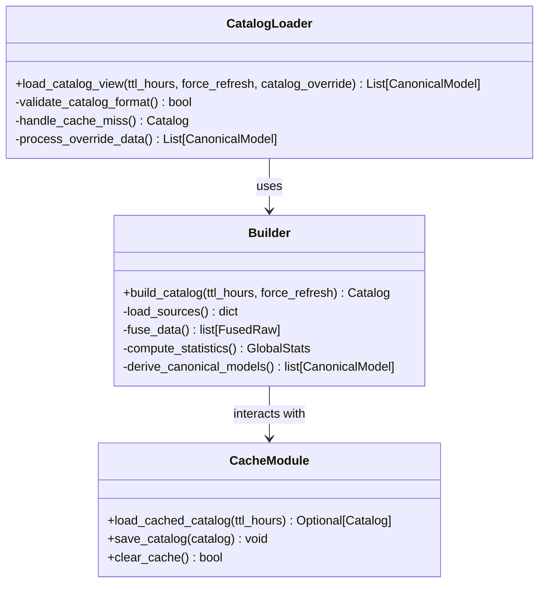

**Diagram sources**
- [loader.py](file://packages/llmhub/src/llmhub/generator/sp4_catalog_view/loader.py#L12-L42)
- [builder.py](file://packages/llmhub/src/llmhub/catalog/builder.py#L302-L387)
- [cache.py](file://packages/llmhub/src/llmhub/catalog/cache.py#L37-L110)

### Selective Data Loading

The system implements selective loading strategies to minimize unnecessary API calls:

- **Environment Variable Preloading**: API keys are loaded before source discovery to prevent unnecessary provider initialization
- **Conditional Source Loading**: Sources are only loaded when necessary based on availability and configuration
- **Incremental Updates**: Only changed data triggers full rebuilds

**Section sources**
- [builder.py](file://packages/llmhub/src/llmhub/catalog/builder.py#L37-L68)
- [loader.py](file://packages/llmhub/src/llmhub/generator/sp4_catalog_view/loader.py#L12-L42)

## Generation Time Optimization Strategies

### Parallel Processing Opportunities

While the current implementation focuses on sequential processing, several optimization opportunities exist for parallel execution:

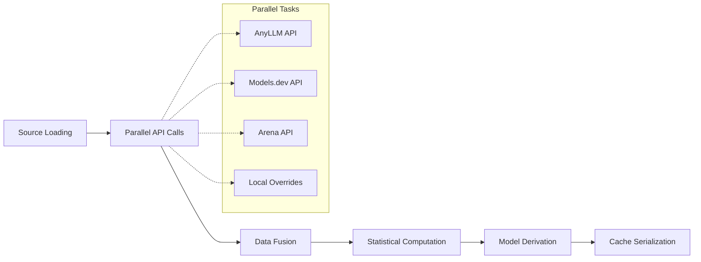

**Diagram sources**
- [builder.py](file://packages/llmhub/src/llmhub/catalog/builder.py#L337-L358)

### Statistical Computation Optimization

The global statistics computation uses NumPy for efficient percentile calculations:

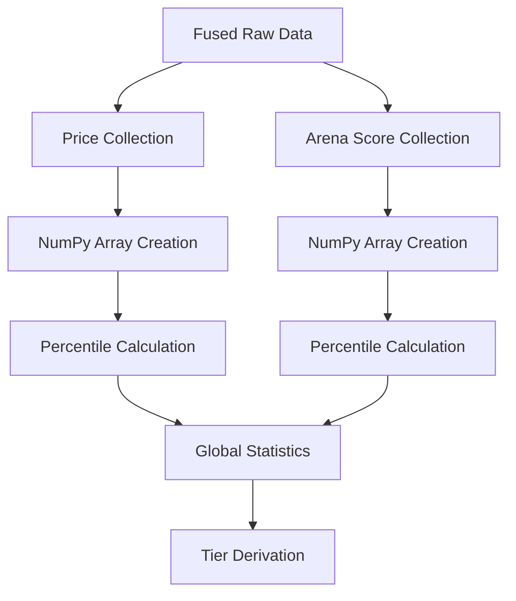

**Diagram sources**
- [builder.py](file://packages/llmhub/src/llmhub/catalog/builder.py#L70-L111)

**Section sources**
- [builder.py](file://packages/llmhub/src/llmhub/catalog/builder.py#L70-L111)

### Memory-Efficient Data Processing

The system processes data in stages to minimize memory footprint:

1. **Streaming Data Loading**: Sources are processed individually rather than accumulating all data in memory
2. **Lazy Evaluation**: Catalog views are computed on-demand rather than pre-computed
3. **Garbage Collection**: Large intermediate datasets are released promptly

## Configuration Loading Performance

### Context Resolution Optimization

The context resolution system in `context.py` implements efficient path resolution with fallback mechanisms:

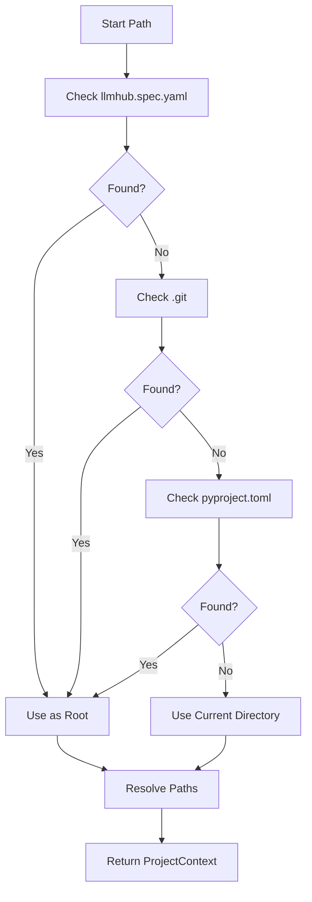

**Diagram sources**
- [context.py](file://packages/llmhub/src/llmhub/context.py#L27-L46)

### Runtime Configuration Loading

The runtime configuration loading system optimizes YAML parsing and validation:

**Section sources**
- [context.py](file://packages/llmhub/src/llmhub/context.py#L49-L89)
- [config_loader.py](file://packages/llmhub_runtime/src/llmhub_runtime/config_loader.py#L6-L43)
- [runtime_io.py](file://packages/llmhub/src/llmhub/runtime_io.py#L11-L74)

## Memory Usage Patterns

### Data Model Memory Efficiency

The schema definitions implement memory-efficient data structures:

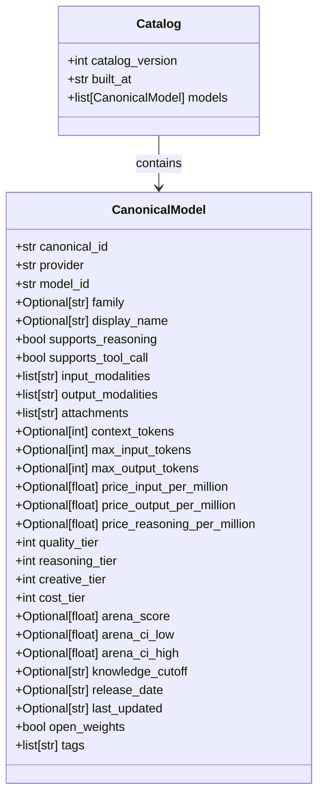

**Diagram sources**
- [schema.py](file://packages/llmhub/src/llmhub/catalog/schema.py#L68-L122)

### Memory Management Strategies

1. **Field Initialization**: Optional fields use `None` by default to minimize memory allocation
2. **Default Factories**: Collections use lambda functions to create empty lists only when needed
3. **String Interning**: Repeated string values share memory references
4. **Weak References**: Large collections use weak references where appropriate

**Section sources**
- [schema.py](file://packages/llmhub/src/llmhub/catalog/schema.py#L12-L122)

## Cache Management Best Practices

### Cache Expiration Policies

Implement dynamic cache expiration based on data volatility:

| Data Type | Recommended TTL | Rationale |
|-----------|----------------|-----------|
| Model Metadata | 24 hours | Stable data, infrequent changes |
| Pricing Information | 6 hours | Frequent updates, market-driven |
| Quality Scores | 12 hours | Moderate volatility, periodic updates |
| Provider Status | 4 hours | High volatility, real-time changes |

### Cache Invalidation Strategies

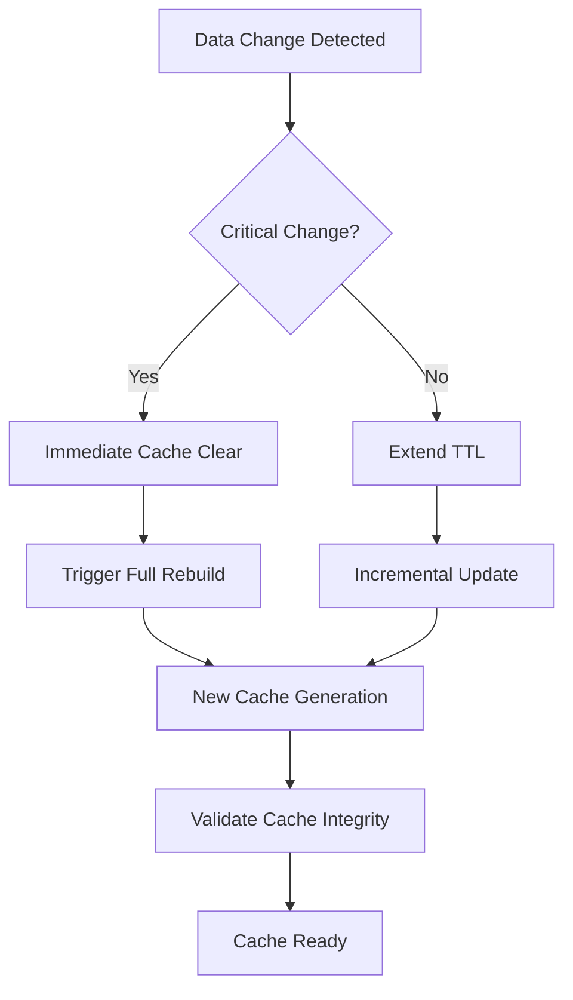

### Cache Maintenance Operations

1. **Periodic Cleanup**: Remove stale cache entries older than 7 days
2. **Size Monitoring**: Track cache size and implement LRU eviction
3. **Integrity Checks**: Validate cache format and data consistency
4. **Fallback Mechanisms**: Graceful degradation when cache is unavailable

**Section sources**
- [cache.py](file://packages/llmhub/src/llmhub/catalog/cache.py#L94-L110)

## Monitoring and Performance Bottleneck Identification

### Generator Pipeline Monitoring

The generator pipeline includes built-in monitoring capabilities:

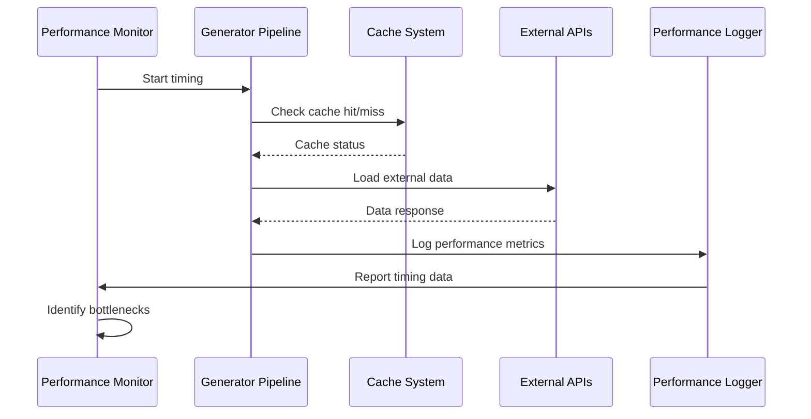

### Key Performance Metrics

| Metric | Description | Threshold | Action |
|--------|-------------|-----------|---------|
| Cache Hit Rate | Percentage of cache hits | >90% | Investigate cache invalidation |
| API Response Time | Average external API latency | >5s | Optimize API calls |
| Memory Usage | Peak memory consumption | >2GB | Implement streaming |
| Generation Time | Total pipeline duration | >30s | Parallelize processing |

### Performance Profiling Tools

The system includes comprehensive profiling capabilities through the test reporting infrastructure:

**Section sources**
- [run_tests_with_report.py](file://packages/llmhub/src/llmhub/tools/run_tests_with_report.py#L105-L395)

## Large-Scale Deployment Guidelines

### High-Frequency Configuration Changes

For environments with frequent configuration updates:

1. **Incremental Processing**: Process only changed configurations
2. **Batch Operations**: Group related changes for efficient processing
3. **Change Detection**: Implement file system watchers for rapid detection
4. **Rollback Mechanisms**: Maintain previous configurations for quick recovery

### Distributed Cache Management

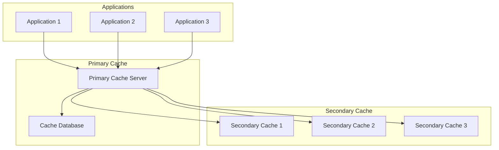

### Load Balancing Strategies

1. **Round-Robin Distribution**: Distribute requests evenly across cache servers
2. **Priority Queuing**: Handle critical requests with higher priority
3. **Geographic Distribution**: Place caches near application clusters
4. **Content-Aware Routing**: Route requests based on data locality

## Performance Testing and Benchmarking

### Automated Performance Testing

The system includes comprehensive performance testing infrastructure:

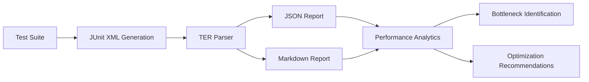

**Diagram sources**
- [run_tests_with_report.py](file://packages/llmhub/src/llmhub/tools/run_tests_with_report.py#L105-L395)

### Benchmarking Methodologies

1. **Baseline Measurements**: Establish performance baselines for comparison
2. **Load Testing**: Simulate production workloads to identify limits
3. **Stress Testing**: Push system boundaries to identify breaking points
4. **Regression Testing**: Ensure performance improvements are maintained

### Performance Regression Detection

The test reporting system automatically detects performance regressions:

**Section sources**
- [run_tests_with_report.py](file://packages/llmhub/src/llmhub/tools/run_tests_with_report.py#L105-L395)

## Troubleshooting Performance Issues

### Common Performance Problems

| Problem | Symptoms | Solution |
|---------|----------|----------|
| Slow Cache Loading | High cache miss rates | Increase TTL or improve cache warming |
| Memory Leaks | Gradually increasing memory usage | Review garbage collection and object lifecycle |
| API Throttling | Frequent timeouts | Implement exponential backoff and rate limiting |
| Configuration Conflicts | Inconsistent behavior | Standardize configuration formats and validation |

### Diagnostic Tools and Techniques

1. **Performance Profilers**: Use Python profilers to identify hot spots
2. **Memory Monitors**: Track memory allocation patterns
3. **Network Analyzers**: Monitor API call latencies and failures
4. **Log Analysis**: Correlate performance metrics with application logs

### Recovery Procedures

1. **Cache Wipe**: Clear cache when corruption is detected
2. **Graceful Degradation**: Continue operation with reduced functionality
3. **Fallback Strategies**: Use alternative data sources when primary fails
4. **Automatic Retry**: Implement retry logic with exponential backoff

**Section sources**
- [errors.py](file://packages/llmhub/src/llmhub/generator/sp4_catalog_view/errors.py#L4-L7)

## Conclusion

The LLM Hub performance optimization framework provides a comprehensive foundation for achieving high-performance model selection and configuration generation. Through intelligent caching mechanisms, efficient data processing, and robust monitoring capabilities, the system delivers optimal performance across diverse deployment scenarios.

Key optimization strategies include:

- **Intelligent Caching**: Persistent storage with TTL-based expiration
- **Selective Loading**: Conditional data fetching based on requirements
- **Memory Efficiency**: Optimized data structures and processing patterns
- **Monitoring**: Comprehensive performance tracking and bottleneck identification
- **Scalability**: Support for large-scale deployments with frequent changes

By implementing these performance optimization techniques and following the best practices outlined in this guide, operations teams and developers can achieve significant improvements in LLM Hub performance while maintaining reliability and scalability.