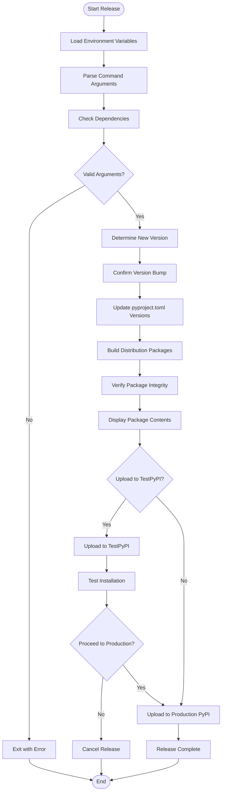
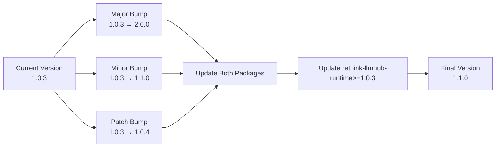
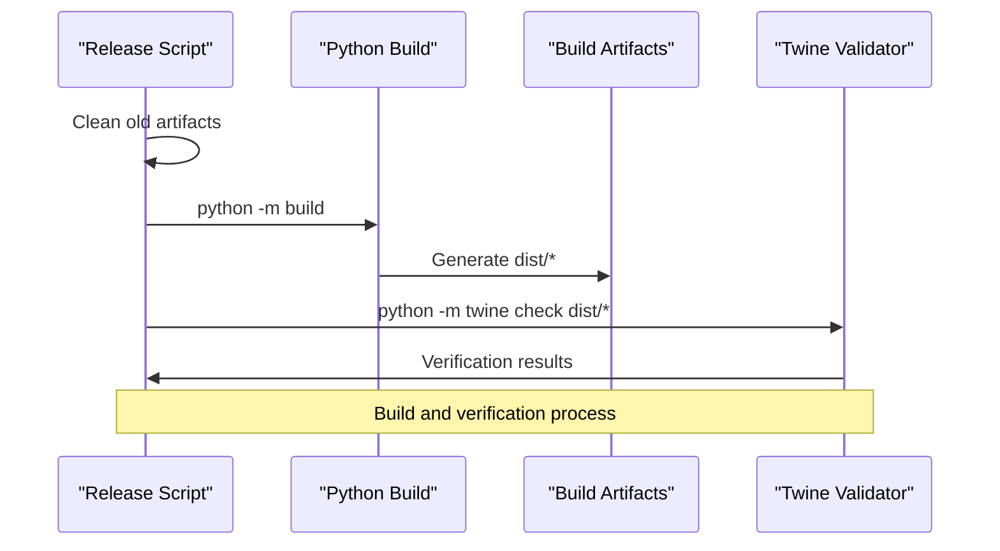
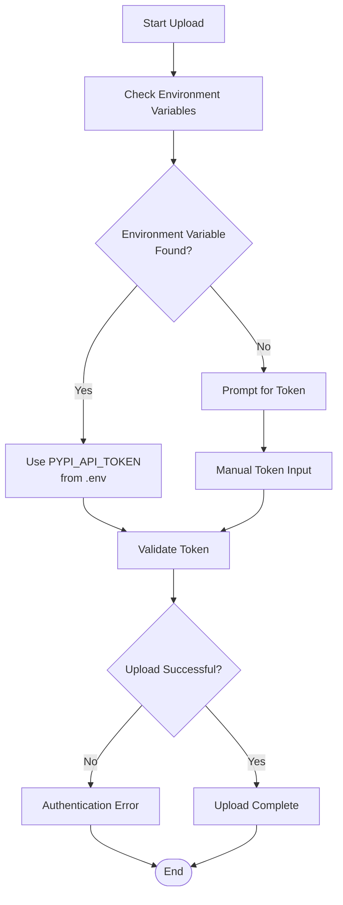

# Release Management

<cite>
**Referenced Files in This Document**
- [scripts/release.py](file://scripts/release.py)
- [packages/cli/pyproject.toml](file://packages/cli/pyproject.toml)
- [packages/runtime/pyproject.toml](file://packages/runtime/pyproject.toml)
- [README.md](file://README.md)
- [packages/cli/README.md](file://packages/cli/README.md)
- [packages/runtime/README.md](file://packages/runtime/README.md)
- [packages/cli/CHANGELOG.md](file://packages/cli/CHANGELOG.md)
- [packages/runtime/CHANGELOG.md](file://packages/runtime/CHANGELOG.md)
</cite>

## Update Summary
**Changes Made**
- Updated all package names from `llmhub` and `llmhub-runtime` to `rethink-llmhub` and `rethink-llmhub-runtime` throughout the documentation
- Updated version numbers to reflect the major 2.0.0 release
- Updated installation commands and package references in all examples
- Modified the release workflow diagram to reflect new package names
- Updated version management section with new package naming convention
- Updated PyPI upload process with correct package names
- Added migration guidance for the rebranding

## Table of Contents
1. [Introduction](#introduction)
2. [Release Process Overview](#release-process-overview)
3. [Prerequisites and Setup](#prerequisites-and-setup)
4. [Version Management](#version-management)
5. [Release Workflow](#release-workflow)
6. [Package Building and Verification](#package-building-and-verification)
7. [PyPI Upload Process](#pypi-upload-process)
8. [Environment Configuration](#environment-configuration)
9. [Common Release Issues](#common-release-issues)
10. [Best Practices](#best-practices)
11. [Troubleshooting Guide](#troubleshooting-guide)

## Introduction

The LLM Hub project uses an automated release management system built around the `scripts/release.py` script, which handles the complete PyPI release process for both the `rethink-llmhub` and `rethink-llmhub-runtime` packages. This system implements semantic versioning, automates package building, performs integrity checks, and manages the upload process with proper authentication.

The release process is designed to handle both individual package releases and coordinated releases where both packages share the same version number, ensuring dependency consistency between the CLI tool and its runtime library. This documentation reflects the rebranding from llmhub to rethink-llmhub and the major version 2.0.0 release.

**Section sources**
- [scripts/release.py](file://scripts/release.py#L1-L522)
- [README.md](file://README.md#L104-L108)

## Release Process Overview

The release management system follows a comprehensive workflow that ensures quality and consistency across both packages:



**Diagram sources**
- [scripts/release.py](file://scripts/release.py#L335-L522)

## Prerequisites and Setup

### Required Dependencies

The release script requires several Python packages to function properly:

| Package | Purpose | Installation |
|---------|---------|--------------|
| `build` | Package building backend | `pip install build` |
| `twine` | Package verification and upload | `pip install twine` |
| `python-dotenv` | Environment variable loading | Included in script |

### Environment Configuration

Create a `.env` file in the repository root with your PyPI credentials:

```bash
# Production PyPI API token
PYPI_API_TOKEN=pypi-your-production-token-here

# TestPyPI API token (optional but recommended)
PYPI_TEST_API_TOKEN=pypi-your-test-token-here
```

**Section sources**
- [scripts/release.py](file://scripts/release.py#L276-L294)
- [README.md](file://README.md#L600-L605)

## Version Management

### Semantic Versioning Workflow

The release script implements semantic versioning according to the MAJOR.MINOR.PATCH scheme:



**Diagram sources**
- [scripts/release.py](file://scripts/release.py#L94-L105)

### Version Bumping Strategies

The script supports three version bumping strategies:

| Strategy | Command | Example | Use Case |
|----------|---------|---------|----------|
| Patch | `python scripts/release.py patch` | 1.0.3 → 1.0.4 | Bug fixes, minor improvements |
| Minor | `python scripts/release.py minor` | 1.0.3 → 1.1.0 | New features, backward-compatible changes |
| Major | `python scripts/release.py major` | 1.0.3 → 2.0.0 | Breaking changes, major updates |
| Specific | `python scripts/release.py --version 1.2.0` | Custom version | Special releases, hotfixes |

### Coordinated Version Updates

When releasing both packages, the script ensures they share the same version number and updates the dependency constraint in the `rethink-llmhub` package:

**Before Release:**
- `rethink-llmhub-runtime/pyproject.toml`: `version = "1.0.3"`
- `rethink-llmhub/pyproject.toml`: `dependencies = ["rethink-llmhub-runtime>=1.0.3"]`

**After Release:**
- `rethink-llmhub-runtime/pyproject.toml`: `version = "1.0.4"`
- `rethink-llmhub/pyproject.toml`: `dependencies = ["rethink-llmhub-runtime>=1.0.4"]`

**Section sources**
- [scripts/release.py](file://scripts/release.py#L117-L136)
- [packages/cli/pyproject.toml](file://packages/cli/pyproject.toml#L27-L35)
- [packages/runtime/pyproject.toml](file://packages/runtime/pyproject.toml#L27-L31)

## Release Workflow

### Step-by-Step Process

The release workflow consists of seven main phases:

#### Phase 1: Environment Setup
- Load environment variables from `.env` file
- Parse command-line arguments
- Validate prerequisites and dependencies

#### Phase 2: Version Determination
- Extract current versions from both `pyproject.toml` files
- Calculate new version based on bump type or explicit version
- Update version numbers in both package configurations

#### Phase 3: Package Building
- Clean previous build artifacts
- Build distribution packages using Python's `build` module
- Generate wheel and source distributions

#### Phase 4: Package Verification
- Verify package integrity using Twine
- Check for common packaging issues
- Validate metadata completeness

#### Phase 5: Upload Preparation
- Display package contents for review
- Prompt for TestPyPI upload (recommended)
- Prepare production upload confirmation

#### Phase 6: PyPI Upload
- Upload to TestPyPI for validation (if selected)
- Upload to production PyPI with authentication
- Provide installation commands for verification

#### Phase 7: Completion
- Display success message
- Provide git commands for tagging and pushing
- Offer post-release cleanup suggestions

**Section sources**
- [scripts/release.py](file://scripts/release.py#L335-L522)

## Package Building and Verification

### Build Process

The script uses Python's modern packaging tools for building distribution packages:



**Diagram sources**
- [scripts/release.py](file://scripts/release.py#L153-L188)

### Build Artifacts

The build process generates the following distribution files:

| File Type | Purpose | Location |
|-----------|---------|----------|
| Wheel (.whl) | Binary distribution | `packages/*/dist/*.whl` |
| Source tarball (.tar.gz) | Source distribution | `packages/*/dist/*.tar.gz` |
| Metadata files | Package information | Generated during build |

### Package Verification

Twine performs comprehensive package validation:

- **Metadata validation**: Ensures all required fields are present
- **File inclusion**: Verifies all necessary files are included
- **Dependency checking**: Validates dependency specifications
- **Security scanning**: Checks for potential security issues

**Section sources**
- [scripts/release.py](file://scripts/release.py#L153-L188)

## PyPI Upload Process

### Authentication Methods

The script supports multiple authentication approaches:



**Diagram sources**
- [scripts/release.py](file://scripts/release.py#L197-L220)

### Upload Process

#### TestPyPI First (Recommended)

1. **Upload to TestPyPI**: `https://test.pypi.org/legacy/`
2. **Installation Testing**: Verify package installation with `pip install --index-url https://test.pypi.org/simple/`
3. **Validation**: Test functionality with the installed package
4. **Production Confirmation**: Proceed to production upload if successful

#### Production PyPI Upload

1. **Upload to Production**: `https://upload.pypi.org/legacy/`
2. **Verification**: Confirm successful upload
3. **URL Display**: Show package URLs for reference

### API Token Security

The script implements secure token handling:
- Tokens are never logged or exposed in command output
- Manual input hides token characters from terminal
- Environment variables provide persistent storage

**Section sources**
- [scripts/release.py](file://scripts/release.py#L223-L274)

## Environment Configuration

### PyPI Token Management

#### Creating API Tokens

1. **Production PyPI**: Visit [pypi.org/manage/account/token/](https://pypi.org/manage/account/token/)
2. **TestPyPI**: Visit [test.pypi.org/manage/account/token/](https://test.pypi.org/manage/account/token/)
3. **Token Format**: `pypi-your-token-string-here`
4. **Permissions**: Full access to package management

#### Environment File Setup

Create `.env` file in repository root:

```bash
# Required for production uploads
PYPI_API_TOKEN=pypi-your-production-token

# Optional but recommended for testing
PYPI_TEST_API_TOKEN=pypi-your-test-token
```

### Alternative Authentication

If `.env` file is unavailable, the script will prompt for token input:
- Hidden input prevents token exposure
- Clear error messaging for invalid tokens
- Graceful failure handling

**Section sources**
- [scripts/release.py](file://scripts/release.py#L197-L220)
- [README.md](file://README.md#L600-L605)

## Common Release Issues

### Authentication Failures

**Problem**: PyPI upload fails with authentication errors
**Causes**:
- Invalid API token format
- Expired or revoked token
- Missing environment variable

**Solutions**:
1. Verify token format starts with `pypi-`
2. Regenerate token from PyPI account settings
3. Check `.env` file permissions and content
4. Use manual token input if environment variable fails

### Package Verification Errors

**Problem**: Twine verification fails during package check
**Common Issues**:
- Missing required metadata fields
- Incorrect file permissions
- Incomplete package structure

**Solutions**:
1. Review `pyproject.toml` for required fields
2. Ensure all source files are tracked in version control
3. Check file permissions and ownership
4. Clean build artifacts before retrying

### Version Conflicts

**Problem**: Dependency version mismatch between packages
**Cause**: Manual edits to version numbers or dependencies

**Solutions**:
1. Use the release script consistently for version updates
2. Verify dependency constraints in `pyproject.toml`
3. Check for conflicting manual edits
4. Revert to script-generated versions if needed

### Network and Connectivity Issues

**Problem**: Upload timeouts or connection failures
**Solutions**:
1. Check internet connectivity
2. Verify PyPI service status
3. Retry upload with stable connection
4. Use TestPyPI for initial validation

**Section sources**
- [scripts/release.py](file://scripts/release.py#L189-L274)

## Best Practices

### Release Planning

1. **Version Planning**: Plan version increments based on changes
   - Patch: Bug fixes, minor improvements
   - Minor: New features, backward-compatible changes
   - Major: Breaking changes, significant updates

2. **Dependency Coordination**: Coordinate releases between related packages
   - Update both `rethink-llmhub` and `rethink-llmhub-runtime` versions
   - Ensure dependency constraints remain valid

3. **Testing Strategy**: Implement comprehensive testing
   - Test on TestPyPI first
   - Verify installation and basic functionality
   - Test with different Python versions

### Release Execution

1. **Environment Setup**: Ensure proper environment configuration
   - Verify `.env` file exists with correct tokens
   - Test authentication before proceeding
   - Document token usage and rotation

2. **Build Verification**: Validate build artifacts
   - Check package contents before upload
   - Verify metadata completeness
   - Test package installation locally

3. **Upload Strategy**: Follow recommended upload process
   - Upload to TestPyPI first
   - Test installation and functionality
   - Proceed to production only after validation

### Post-Release Activities

1. **Git Operations**: Tag and push release commits
   ```bash
   git add packages/*/pyproject.toml
   git commit -m "Release version 1.0.4"
   git tag v1.0.4
   git push && git push --tags
   ```

2. **Documentation Updates**: Update release notes and documentation
   - Document breaking changes
   - Update installation instructions
   - Add migration guides if needed

3. **Monitoring**: Monitor package downloads and issues
   - Check PyPI download statistics
   - Monitor GitHub issues for problems
   - Respond to user feedback promptly

**Section sources**
- [scripts/release.py](file://scripts/release.py#L504-L508)

## Troubleshooting Guide

### Script Execution Issues

**Problem**: Script fails to execute or exits unexpectedly
**Diagnostic Steps**:
1. Check Python version (must be 3.10+)
2. Verify script permissions (`chmod +x scripts/release.py`)
3. Test dependency installation
4. Review error messages in terminal output

**Problem**: Argument parsing errors
**Solutions**:
- Use `python scripts/release.py --help` for usage information
- Verify argument order and spelling
- Check for required arguments

### Build and Packaging Issues

**Problem**: Build artifacts not found or corrupted
**Solutions**:
1. Clean build directory: `rm -rf packages/*/build packages/*/dist`
2. Verify Python build tools installation
3. Check disk space availability
4. Review build logs for specific errors

**Problem**: Missing files in distribution
**Causes**:
- Files excluded by `.gitignore`
- Missing entries in `pyproject.toml`
- Incorrect file permissions

**Solutions**:
1. Verify file inclusion in version control
2. Check `pyproject.toml` for package declarations
3. Review file permissions and ownership
4. Use `python -m build --no-isolation` for debugging

### Upload and Distribution Issues

**Problem**: Package upload fails silently
**Diagnostic Approach**:
1. Enable verbose output if available
2. Check network connectivity
3. Verify PyPI service status
4. Test with smaller packages first

**Problem**: Package not found after upload
**Investigation Steps**:
1. Check package name spelling
2. Verify upload completion
3. Test installation from PyPI
4. Review PyPI dashboard for uploaded packages

### Environment and Configuration Issues

**Problem**: Environment variables not loaded
**Solutions**:
1. Verify `.env` file location and format
2. Check file permissions (should not be readable by others)
3. Test environment loading manually
4. Use manual token input as fallback

**Problem**: Permission denied errors
**Solutions**:
1. Check file permissions on `.env` file
2. Verify Python script execution permissions
3. Test with elevated privileges if necessary
4. Review system security policies

**Section sources**
- [scripts/release.py](file://scripts/release.py#L510-L522)