# Security Considerations

<cite>
**Referenced Files in This Document**   
- [env_manager.py](file://packages/llmhub/src/llmhub/env_manager.py)
- [spec_models.py](file://packages/llmhub/src/llmhub/spec_models.py)
- [context.py](file://packages/llmhub/src/llmhub/context.py)
- [env_cmd.py](file://packages/llmhub/src/llmhub/commands/env_cmd.py)
- [setup_cmd.py](file://packages/llmhub/src/llmhub/commands/setup_cmd.py)
- [runtime_io.py](file://packages/llmhub/src/llmhub/runtime_io.py)
- [hub.py](file://packages/llmhub_runtime/src/llmhub_runtime/hub.py)
- [pyproject.toml](file://packages/llmhub/pyproject.toml)
- [release.py](file://scripts/release.py)
</cite>

## Table of Contents
1. [Introduction](#introduction)
2. [API Key Management](#api-key-management)
3. [Secure Defaults and Configuration](#secure-defaults-and-configuration)
4. [Environment Isolation](#environment-isolation)
5. [Credential Handling in Configuration Files](#credential-handling-in-configuration-files)
6. [Model Selection Security](#model-selection-security)
7. [LLM Call Auditing and Monitoring](#llm-call-auditing-and-monitoring)
8. [Release Process and Dependency Security](#release-process-and-dependency-security)
9. [Conclusion](#conclusion)

## Introduction
LLM Hub provides a comprehensive framework for managing LLM specifications and runtime configurations across different environments. This security documentation outlines the key security practices and mechanisms implemented in the system to protect sensitive credentials, prevent configuration leaks, and ensure secure operation in production environments. The document focuses on API key management, secure defaults, environment isolation, credential handling, model selection security, auditing capabilities, and release process security to provide a complete security overview for both security teams and developers.

## API Key Management

LLM Hub implements a robust API key management system through its `env_manager.py` module, which provides automated validation and management of environment variables. The system uses the `check_env` function to validate required environment variables against the specification configuration, ensuring that all necessary API keys are present before runtime execution.

The `check_env` function examines the `SpecConfig` object's providers configuration and verifies that each enabled provider's specified environment variable exists in the current environment. This validation only applies to providers that are explicitly enabled, preventing unnecessary checks for disabled services. The function supports optional loading of `.env` files through the `load_dotenv_path` parameter, allowing for flexible environment configuration during development and testing.


**Diagram sources**
- [env_manager.py](file://packages/llmhub/src/llmhub/env_manager.py#L46-L71)
- [spec_models.py](file://packages/llmhub/src/llmhub/spec_models.py#L59-L65)

**Section sources**
- [env_manager.py](file://packages/llmhub/src/llmhub/env_manager.py#L46-L71)
- [test_env_manager.py](file://packages/llmhub/tests/test_env_manager.py#L53-L138)

## Secure Defaults and Configuration

The `spec_models.py` module implements secure defaults through Pydantic models that enforce type safety and validation for all configuration elements. The `SpecProviderConfig` class provides a secure foundation for provider configuration with default values that prioritize security. The `enabled` field defaults to `True` but can be explicitly set to `False` to disable providers without removing their configuration, while the `env_key` field is optional and must be explicitly defined, preventing accidental exposure of credentials through configuration files.

Role definitions are secured through the `RoleKind` enum, which restricts roles to predefined categories (chat, embedding, image, audio, tool, other), preventing arbitrary role creation that could lead to security vulnerabilities. The `Preferences` model enforces structured preferences for latency, cost, and quality using the `PreferenceLevel` enum, ensuring consistent and predictable model selection behavior.


**Diagram sources**
- [spec_models.py](file://packages/llmhub/src/llmhub/spec_models.py#L30-L65)
- [test_spec_models.py](file://packages/llmhub/tests/test_spec_models.py#L10-L128)

**Section sources**
- [spec_models.py](file://packages/llmhub/src/llmhub/spec_models.py#L30-L65)
- [test_spec_models.py](file://packages/llmhub/tests/test_spec_models.py#L10-L128)

## Environment Isolation

LLM Hub enforces environment isolation through multiple mechanisms that prevent credential leakage between development, staging, and production environments. The system uses environment-specific configuration files and validation to ensure that credentials are properly scoped to their intended environments.

The `context.py` module resolves project context by searching for environment markers (llmhub.spec.yaml, .git directory, or pyproject.toml) and establishing the project root. This ensures that environment variables are loaded from the correct project directory, preventing cross-project contamination. The resolved context includes separate paths for specification, runtime, and environment example files, maintaining clear separation between configuration components.

Environment isolation is further reinforced by the `env_check` command, which can optionally load environment variables from a specified `.env` file. This allows developers to maintain separate environment files for different deployment stages while ensuring that the correct credentials are used for each environment. The system does not automatically load environment variables from unspecified locations, requiring explicit configuration for environment file loading.


**Diagram sources**
- [context.py](file://packages/llmhub/src/llmhub/context.py#L27-L90)
- [env_cmd.py](file://packages/llmhub/src/llmhub/commands/env_cmd.py#L44-L80)

**Section sources**
- [context.py](file://packages/llmhub/src/llmhub/context.py#L27-L90)
- [env_cmd.py](file://packages/llmhub/src/llmhub/commands/env_cmd.py#L44-L80)

## Credential Handling in Configuration Files

LLM Hub implements secure credential handling through the use of `.env.example` files and strict separation between configuration specifications and actual credentials. The system generates `.env.example` files from the specification configuration using the `generate_env_example` function, which creates a template with empty values for all required environment variables.

The `generate_env_example` function iterates through the providers defined in the `SpecConfig` and creates commented entries for each provider's API key, using the `env_key` field to determine the environment variable name. This approach ensures that the example file contains all necessary variable names without exposing any actual credential values. The generated file serves as a template that developers can copy to create their actual `.env` file, filling in the required values from secure credential storage.

```mermaid
sequenceDiagram
participant Developer
participant CLI as "LLM Hub CLI"
participant EnvManager as "env_manager.py"
participant FileSystem as "File System"
Developer->>CLI : Run 'llmhub env sync'
CLI->>EnvManager : Call generate_env_example()
EnvManager->>FileSystem : Read llmhub.spec.yaml
FileSystem-->>EnvManager : Return SpecConfig
EnvManager->>EnvManager : Process providers
loop For each provider
EnvManager->>EnvManager : Add comment and empty env_key
end
EnvManager->>FileSystem : Write .env.example
FileSystem-->>CLI : Confirm file creation
CLI-->>Developer : "✓ Environment example synced"
Developer->>FileSystem : Copy .env.example to .env
Developer->>FileSystem : Add actual credentials to .env
Developer->>CLI : Run 'llmhub env check'
CLI->>EnvManager : Call check_env()
EnvManager->>FileSystem : Load .env file
FileSystem-->>EnvManager : Environment variables
EnvManager->>EnvManager : Validate against SpecConfig
EnvManager-->>CLI : Return validation results
CLI-->>Developer : Display validation status
```



**Diagram sources**
- [env_manager.py](file://packages/llmhub/src/llmhub/env_manager.py#L15-L43)
- [env_cmd.py](file://packages/llmhub/src/llmhub/commands/env_cmd.py#L12-L38)

**Section sources**
- [env_manager.py](file://packages/llmhub/src/llmhub/env_manager.py#L15-L43)
- [env_cmd.py](file://packages/llmhub/src/llmhub/commands/env_cmd.py#L12-L38)

## Model Selection Security

The model selection process in LLM Hub is designed with security considerations to prevent injection attacks and ensure controlled model selection. The system uses a multi-stage selection process that begins with the `sp2_needs_interpreter` module, which converts high-level project specifications into structured role needs through LLM interpretation.

The model selection logic is implemented in the `sp9_selector_orchestrator` module, which coordinates the selection process through a series of subproblems: filtering candidates, deriving weights, scoring candidates, and applying relaxation when necessary. This structured approach ensures that model selection follows predefined rules and constraints rather than allowing arbitrary model selection based on potentially malicious input.

The system mitigates injection risks by validating all specification files through Pydantic models before processing, ensuring that only properly structured data is used in the selection process. The `sp2_needs_interpreter` module explicitly states that validation beyond schema is not a goal, indicating that the system trusts the LLM output but relies on subsequent validation steps to ensure security.

```mermaid
flowchart TD
A[Project Specification] --> B["sp1_spec_schema: Parse and validate spec"]
B --> C["sp2_needs_interpreter: Convert to RoleNeeds via LLM"]
C --> D["sp3_needs_schema: Validate role needs"]
D --> E["sp4_catalog_view: Load model catalog"]
E --> F{"Candidates filtered?"}
F --> |Yes| G["sp6_weights: Derive weights from role"]
F --> |No| H["sp8_relaxation_engine: Apply relaxation"]
G --> I["sp7_scoring_engine: Score candidates"]
H --> I
I --> J["sp9_selector_orchestrator: Select primary and backups"]
J --> K["sp10_machine_config_emitter: Build machine config"]
K --> L[Runtime Configuration]
style C stroke:#f66,stroke-width:2px
style D stroke:#66f,stroke-width:2px
style J stroke:#6f6,stroke-width:2px
note right of C
Potential injection point
Mitigated by schema validation
end
note right of D
Schema validation ensures
structured, expected input
end
note right of J
Final selection with
controlled logic
end
```

**Diagram sources**
- [generator.py](file://packages/llmhub/src/llmhub/generator/__init__.py#L87-L112)
- [sp9_selector_orchestrator.py](file://packages/llmhub/src/llmhub/generator/sp9_selector_orchestrator/orchestrator.py#L16-L62)

**Section sources**
- [generator.py](file://packages/llmhub/src/llmhub/generator/__init__.py#L87-L112)
- [sp2_needs_interpreter/spec.md](file://packages/llmhub/src/llmhub/generator/sp2_needs_interpreter/spec.md#L38-L42)

## LLM Call Auditing and Monitoring

LLM Hub provides comprehensive auditing capabilities through its runtime monitoring system, which captures detailed information about all LLM calls for security analysis and troubleshooting. The `hub.py` module in the `llmhub_runtime` package implements call hooks that allow for pre-call and post-call monitoring of all LLM interactions.

The system uses `on_before_call` and `on_after_call` hooks to capture the complete context of each LLM call, including the role, provider, model, parameters, and messages. This information is passed to registered callback functions, enabling real-time monitoring and logging of all LLM interactions. The post-call hook captures the success status, any errors, and the response, providing a complete audit trail for each call.


**Diagram sources**
- [hub.py](file://packages/llmhub_runtime/src/llmhub_runtime/hub.py#L75-L188)
- [runtime_io.py](file://packages/llmhub/src/llmhub/runtime_io.py#L11-L74)

**Section sources**
- [hub.py](file://packages/llmhub_runtime/src/llmhub_runtime/hub.py#L75-L188)

## Release Process and Dependency Security

The release process for LLM Hub is secured through a dedicated `release.py` script that manages versioning and publishing of packages to PyPI. The script implements security best practices by loading environment variables from a `.env` file when present, which can contain the PyPI token needed for package publication.

The release script validates the presence of required dependencies before proceeding with the release process, ensuring that all necessary tools are available and reducing the risk of incomplete or corrupted releases. The script supports releasing individual packages or both packages together, providing flexibility while maintaining control over the release process.

Dependency security is managed through the `pyproject.toml` file, which specifies exact version requirements for all dependencies. This approach prevents automatic updates to potentially vulnerable versions and ensures reproducible builds. The specified dependencies include security-focused packages like `python-dotenv` for secure environment variable management and `pydantic` for data validation.

```mermaid
flowchart TD
A[Start Release] --> B{Check .env file}
B --> |Exists| C[Load environment variables]
B --> |Not exists| D[Proceed without env vars]
C --> E[Parse release arguments]
D --> E
E --> F[Check dependencies]
F --> G{Valid dependencies?}
G --> |No| H[Exit with error]
G --> |Yes| I[Determine packages to release]
I --> J[Update version numbers]
J --> K[Build packages]
K --> L[Publish to PyPI]
L --> M[Generate release notes]
M --> N[Complete release]
style C stroke:#6f6,stroke-width:2px
style F stroke:#66f,stroke-width:2px
style L stroke:#f66,stroke-width:2px
note right of C
Secure credential loading
from .env file
end
note right of F
Dependency validation
prevents compromised tools
end
note right of L
PyPI publication with
secure authentication
end
```

**Diagram sources**
- [release.py](file://scripts/release.py#L335-L369)
- [pyproject.toml](file://packages/llmhub/pyproject.toml#L27-L36)

**Section sources**
- [release.py](file://scripts/release.py#L335-L369)
- [pyproject.toml](file://packages/llmhub/pyproject.toml#L27-L36)

## Conclusion
LLM Hub implements a comprehensive security framework that addresses key risks in LLM configuration and management. The system provides robust API key management through automated validation, secure defaults in configuration models, and strict environment isolation to prevent credential leakage. Credential handling is secured through the use of example files and explicit environment variable loading, while model selection logic incorporates validation to prevent injection attacks. The auditing capabilities enable monitoring of all LLM calls, and the release process follows security best practices for dependency management and package publication. These security measures collectively ensure that LLM Hub can be safely deployed and operated in production environments, providing developers and security teams with confidence in the system's security posture.