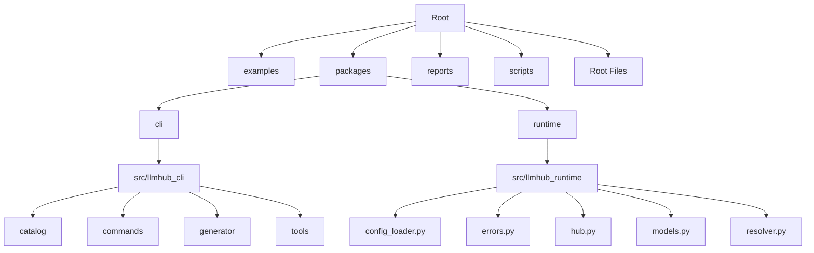
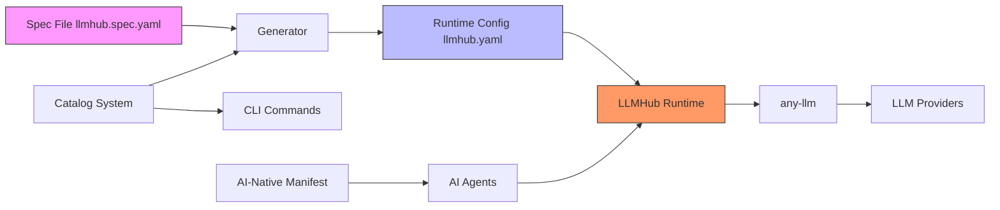
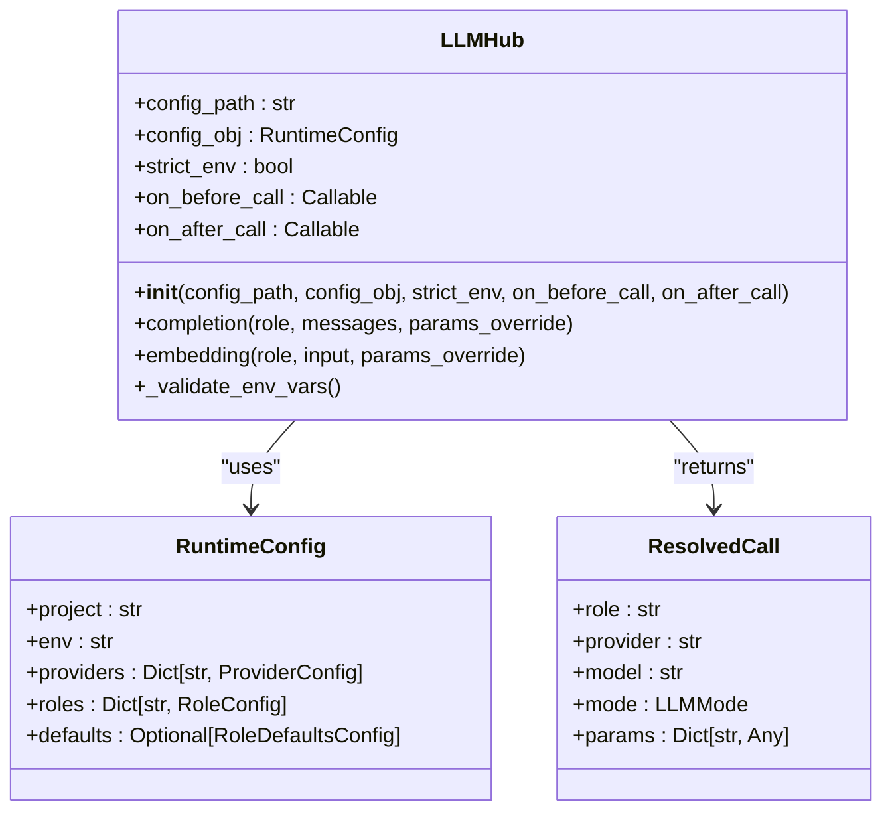
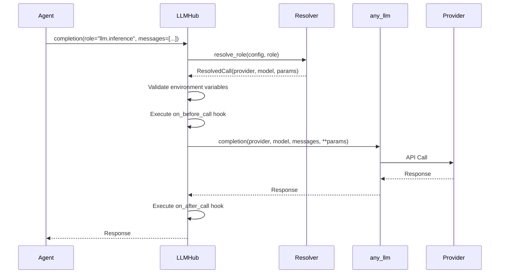
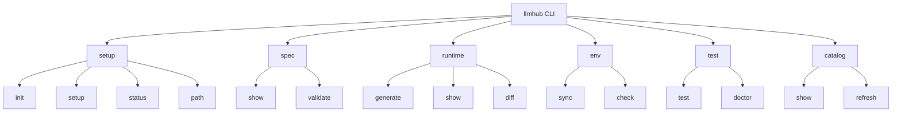
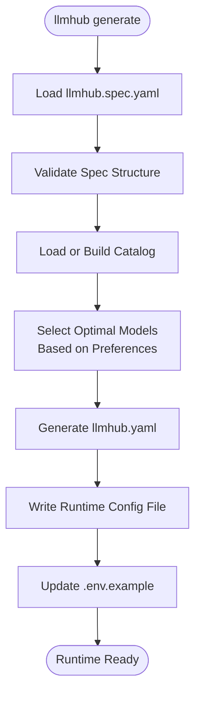
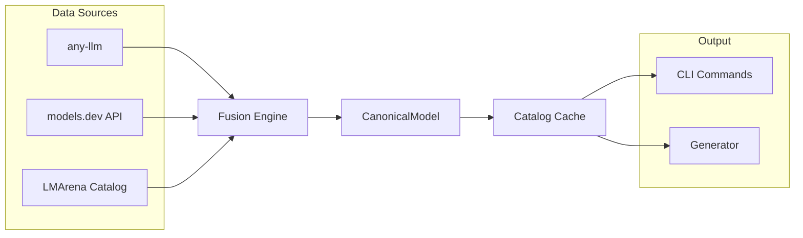
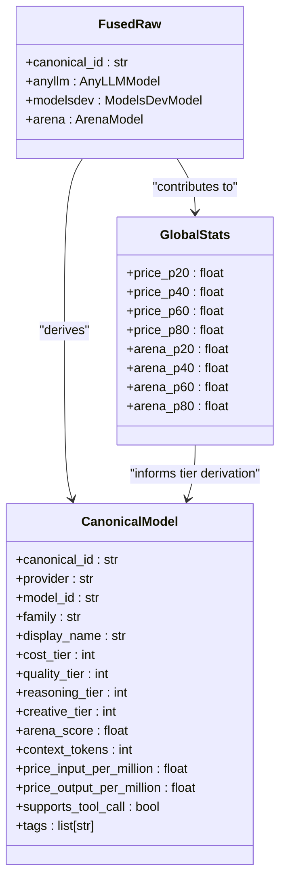
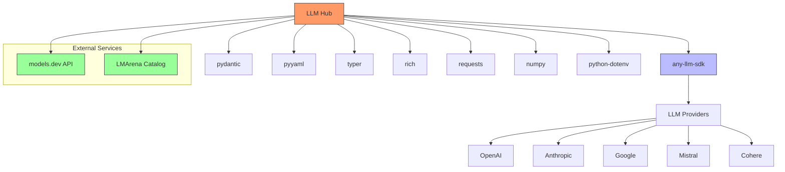

# Ai Native Documentation

<cite>
**Referenced Files in This Document**   
- [README.md](file://README.md)
- [AI_NATIVE_DOCS.md](file://AI_NATIVE_DOCS.md)
- [llmhub.aimanifest.yaml](file://llmhub.aimanifest.yaml)
- [packages/cli/pyproject.toml](file://packages/cli/pyproject.toml)
- [packages/runtime/pyproject.toml](file://packages/runtime/pyproject.toml)
- [packages/runtime/src/llmhub_runtime/hub.py](file://packages/runtime/src/llmhub_runtime/hub.py)
- [packages/runtime/src/llmhub_runtime/models.py](file://packages/runtime/src/llmhub_runtime/models.py)
- [packages/cli/src/llmhub_cli/cli.py](file://packages/cli/src/llmhub_cli/cli.py)
- [packages/cli/src/llmhub_cli/catalog/builder.py](file://packages/cli/src/llmhub_cli/catalog/builder.py)
- [packages/cli/src/llmhub_cli/generator/spec/parser.py](file://packages/cli/src/llmhub_cli/generator/spec/parser.py)
- [packages/cli/src/llmhub_cli/generator/emitter/models.py](file://packages/cli/src/llmhub_cli/generator/emitter/models.py)
- [packages/cli/src/llmhub_cli/commands/setup.py](file://packages/cli/src/llmhub_cli/commands/setup.py)
- [packages/cli/src/llmhub_cli/commands/runtime.py](file://packages/cli/src/llmhub_cli/commands/runtime.py)
- [examples/agent_manifest_usage.py](file://examples/agent_manifest_usage.py)
</cite>

## Table of Contents
1. [Introduction](#introduction)
2. [Project Structure](#project-structure)
3. [Core Components](#core-components)
4. [Architecture Overview](#architecture-overview)
5. [Detailed Component Analysis](#detailed-component-analysis)
6. [Dependency Analysis](#dependency-analysis)
7. [Performance Considerations](#performance-considerations)
8. [Troubleshooting Guide](#troubleshooting-guide)
9. [Conclusion](#conclusion)

## Introduction

LLM Hub is a production-grade system for managing large language models (LLMs) through declarative configuration rather than hardcoded provider/model names. It provides a unified runtime that resolves logical "roles" to actual LLM providers and models, plus a sophisticated catalog system that enriches models with cost, quality, and capability metadata. The system enables AI agents to understand and integrate tools efficiently through AI-native documentation.

The core objective of LLM Hub is to decouple business logic from model implementation by allowing applications to reference logical roles ("preprocess", "inference", "embedding") instead of vendor-specific model strings. This approach enables config-driven model selection, intelligent model selection based on preferences, and standardized LLM access through a consistent interface backed by any-llm.

**Section sources**
- [README.md](file://README.md#L1-L645)

## Project Structure

The LLM Hub repository follows a modular structure with clear separation between runtime and CLI components. The project is organized into several key directories:

- **examples/**: Contains usage examples including agent manifest usage
- **packages/**: Contains the core packages
  - **cli/**: Command-line interface with source code, commands, and generator components
  - **runtime/**: Lightweight runtime library for LLM resolution
- **reports/test-execution/**: Test execution reports
- **scripts/**: Utility scripts for release management and validation
- Root-level configuration and documentation files

The CLI package provides commands for project initialization, spec management, runtime generation, catalog management, and testing. The runtime package offers a lightweight Python library that loads configuration, resolves logical role names to concrete provider:model pairs, and delegates LLM calls to any-llm.

**Diagram sources**
- [README.md](file://README.md#L1-L645)

## Core Components

LLM Hub consists of several core components that work together to provide a comprehensive LLM management system. The architecture is built around three main pillars: the runtime, the CLI, and the catalog system.

The **runtime** is a lightweight Python library that loads machine configuration from llmhub.yaml, resolves logical role names to concrete provider:model pairs, and delegates actual LLM calls to any-llm. It supports hooks for logging, observability, and cost tracking, and provides capabilities for chat completions, embeddings, environment-based configuration, parameter overrides, and strict environment variable validation.

The **CLI** provides a comprehensive set of commands for project initialization (llmhub init, llmhub setup), spec management, runtime generation (llmhub generate), catalog management (llmhub catalog show, llmhub catalog refresh), and testing/validation (llmhub test, llmhub doctor).

The **catalog** is a local model database that discovers callable models via any-llm, enriches them with metadata from models.dev and LMArena arena-catalog, derives normalized tiers for cost, quality, reasoning, and creativity, and caches the catalog to disk with TTL for fast access.

**Section sources**
- [README.md](file://README.md#L1-L645)
- [AI_NATIVE_DOCS.md](file://AI_NATIVE_DOCS.md#L1-L382)

## Architecture Overview

LLM Hub follows a modular architecture with clear separation of concerns between configuration, runtime execution, and model management. The system operates through a workflow that begins with high-level specification and ends with runtime execution.

**Diagram sources**
- [README.md](file://README.md#L1-L645)
- [AI_NATIVE_DOCS.md](file://AI_NATIVE_DOCS.md#L1-L382)

## Detailed Component Analysis

### Runtime Component Analysis

The runtime component is the core execution engine of LLM Hub, responsible for resolving logical roles to concrete LLM providers and models. It provides a clean interface for LLM interactions while abstracting away provider-specific details.

#### Runtime Hub Class

**Diagram sources**
- [packages/runtime/src/llmhub_runtime/hub.py](file://packages/runtime/src/llmhub_runtime/hub.py#L1-L189)
- [packages/runtime/src/llmhub_runtime/models.py](file://packages/runtime/src/llmhub_runtime/models.py#L1-L41)

#### Runtime Execution Flow

**Diagram sources**
- [packages/runtime/src/llmhub_runtime/hub.py](file://packages/runtime/src/llmhub_runtime/hub.py#L1-L189)

### CLI Component Analysis

The CLI component provides a comprehensive interface for managing LLM configurations and operations. It serves as the primary tool for developers to interact with the LLM Hub system.

#### CLI Command Structure

**Diagram sources**
- [packages/cli/src/llmhub_cli/cli.py](file://packages/cli/src/llmhub_cli/cli.py#L1-L67)

#### Configuration Generation Flow

**Diagram sources**
- [packages/cli/src/llmhub_cli/commands/runtime.py](file://packages/cli/src/llmhub_cli/commands/runtime.py#L1-L156)
- [packages/cli/src/llmhub_cli/generator/spec/parser.py](file://packages/cli/src/llmhub_cli/generator/spec/parser.py#L1-L66)

### Catalog System Analysis

The catalog system is the intelligence layer of LLM Hub, combining multiple data sources to build a comprehensive model database.

#### Catalog Data Fusion Process

**Diagram sources**
- [packages/cli/src/llmhub_cli/catalog/builder.py](file://packages/cli/src/llmhub_cli/catalog/builder.py#L1-L388)

#### Catalog Model Derivation

**Diagram sources**
- [packages/cli/src/llmhub_cli/catalog/builder.py](file://packages/cli/src/llmhub_cli/catalog/builder.py#L1-L388)

## Dependency Analysis

LLM Hub has a well-defined dependency structure that separates runtime dependencies from development and CLI dependencies.

**Diagram sources**
- [packages/cli/pyproject.toml](file://packages/cli/pyproject.toml#L1-L68)
- [packages/runtime/pyproject.toml](file://packages/runtime/pyproject.toml#L1-L42)
- [README.md](file://README.md#L1-L645)

## Performance Considerations

LLM Hub is designed with performance in mind, particularly in terms of configuration resolution and catalog operations. The system employs caching strategies to minimize redundant operations and optimize access patterns.

The catalog system implements a time-to-live (TTL) cache with a default of 24 hours, stored at platform-specific config directories. This caching mechanism ensures that catalog builds are fast when using cached data (<100ms) while still allowing for periodic refreshes from external sources. Full catalog rebuilds take 5-15 seconds as they require network access to models.dev API, LMArena GitHub catalog, and any-llm for provider discovery.

Role resolution in the runtime is extremely fast (<100ms) as it involves only local configuration lookup without network calls. The actual LLM call latency depends on the resolved provider and model, with typical completion calls taking 500ms-5s and embedding calls taking 100ms-1s.

Configuration generation (llmhub generate) has a latency of 2-10 seconds, depending on whether a catalog build is required and whether LLM-assisted generation is used. The process involves spec loading, catalog access, selection logic, and optional LLM calls for assisted generation.

**Section sources**
- [README.md](file://README.md#L1-L645)
- [AI_NATIVE_DOCS.md](file://AI_NATIVE_DOCS.md#L1-L382)

## Troubleshooting Guide

LLM Hub provides several built-in commands and mechanisms for troubleshooting and diagnostics. The system includes comprehensive error handling and validation to help identify and resolve common issues.

The `llmhub doctor` command (also accessible as `llmhub test`) performs a comprehensive health check of the environment setup, validating configuration files, checking for required environment variables, and testing provider availability. This command helps identify issues such as missing API keys, invalid configuration files, or network connectivity problems with external services.

Common issues and their solutions include:

- **Missing environment variables**: Ensure all required API keys are set as environment variables or in a .env file. The system requires provider-specific keys like OPENAI_API_KEY, ANTHROPIC_API_KEY, etc.
- **Catalog build failures**: Verify network connectivity to external services (models.dev API, LMArena catalog) and ensure API keys are valid for provider discovery.
- **Role resolution failures**: Check that roles defined in the spec file exist and that the corresponding providers are enabled and properly configured.
- **Configuration validation errors**: Validate YAML syntax and ensure all required fields are present in both spec and runtime configuration files.

The system also provides dry-run options for the generate command (`llmhub generate --dry-run`) to preview changes without writing files, and explanation options (`llmhub generate --explain`) to show reasoning for model selections.

**Section sources**
- [README.md](file://README.md#L1-L645)
- [packages/cli/src/llmhub_cli/commands/setup.py](file://packages/cli/src/llmhub_cli/commands/setup.py#L1-L215)
- [packages/cli/src/llmhub_cli/commands/runtime.py](file://packages/cli/src/llmhub_cli/commands/runtime.py#L1-L156)

## Conclusion

LLM Hub provides a comprehensive solution for managing large language models through declarative configuration, offering significant advantages over hardcoded provider/model references. The system's architecture effectively decouples business logic from model implementation, enabling config-driven model selection and standardized LLM access.

The AI-native documentation approach, exemplified by the llmhub.aimanifest.yaml file, represents a significant advancement in tool integration efficiency for AI agents. By providing structured, queryable capability metadata, the system enables approximately 10x more efficient tool understanding compared to parsing traditional narrative documentation.

Key strengths of the system include its modular architecture, comprehensive catalog system that enriches models with metadata from multiple sources, and well-designed CLI interface that simplifies common operations. The runtime library provides a clean, consistent interface for LLM interactions with support for hooks, parameter overrides, and strict environment validation.

Future enhancements could include expanding the generator capabilities for LLM-assisted model selection, developing a web UI for interactive catalog browsing and configuration editing, and creating a SaaS offering for hosted catalog and model recommendation services.

**Section sources**
- [README.md](file://README.md#L1-L645)
- [AI_NATIVE_DOCS.md](file://AI_NATIVE_DOCS.md#L1-L382)
- [llmhub.aimanifest.yaml](file://llmhub.aimanifest.yaml#L1-L1124)