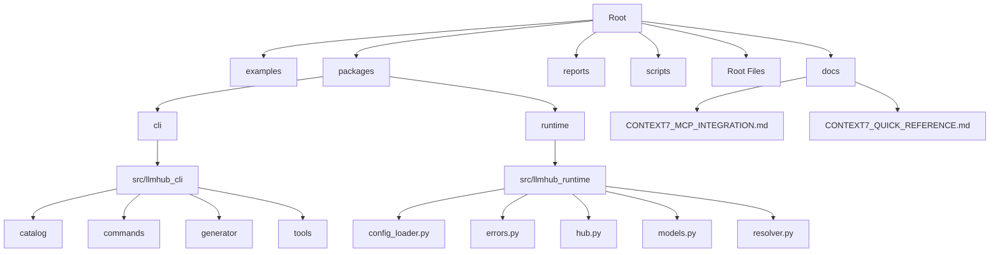
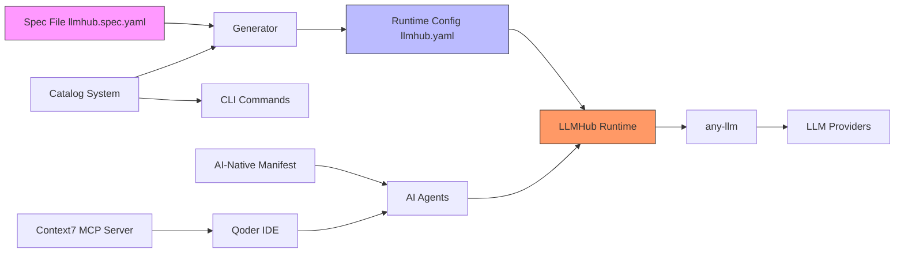
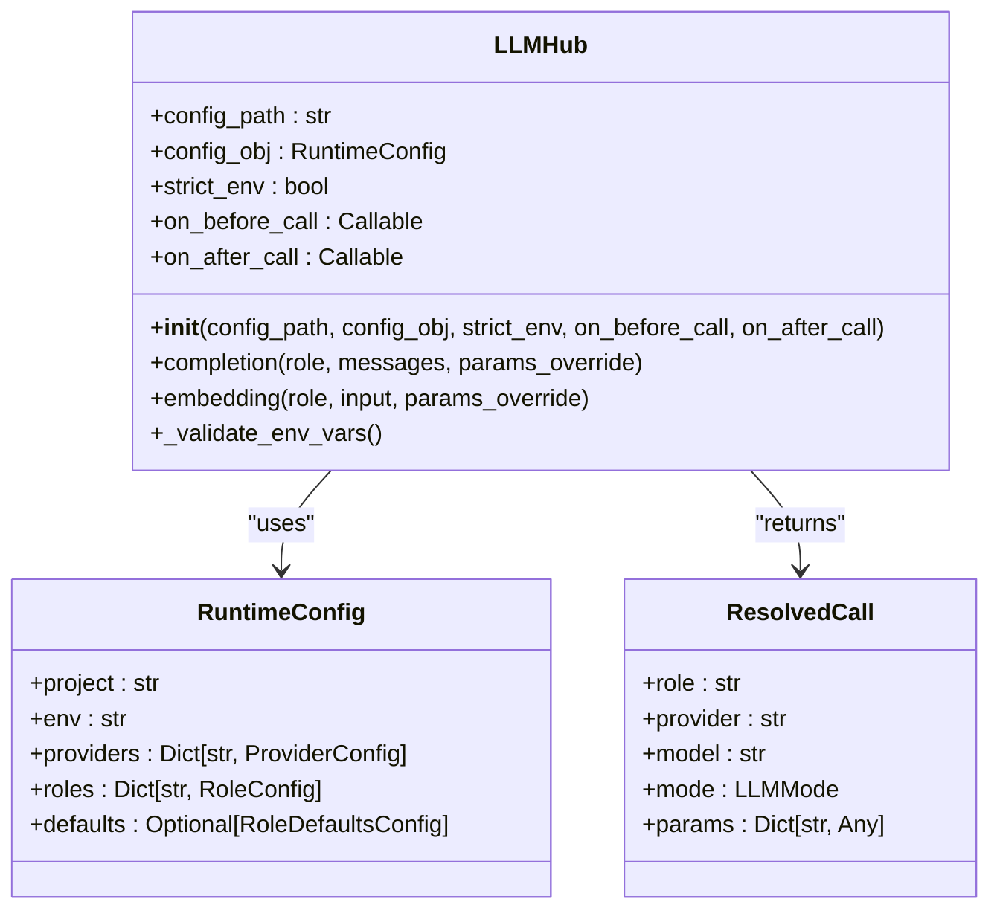
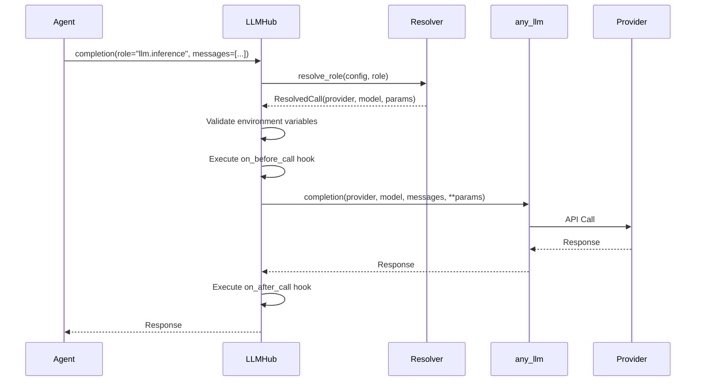
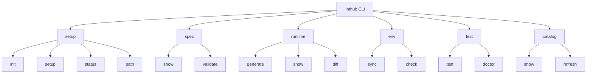
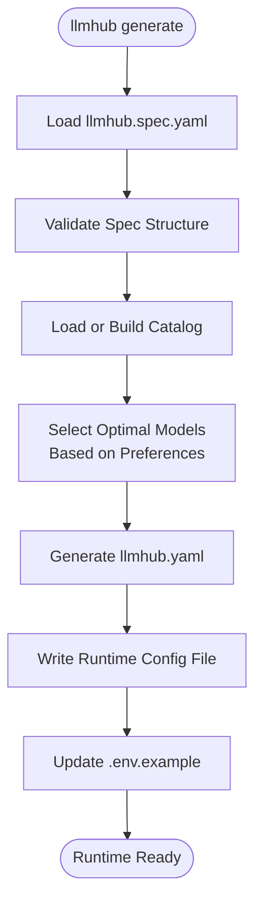
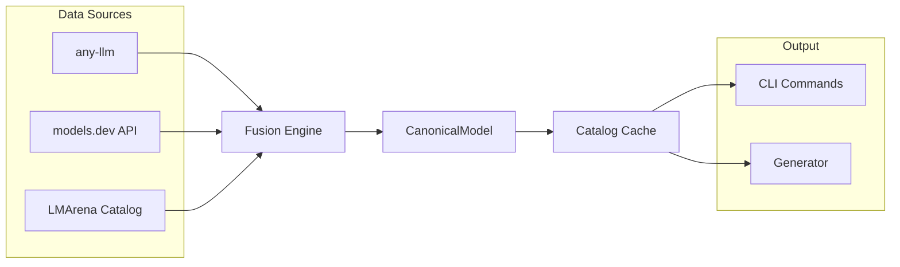
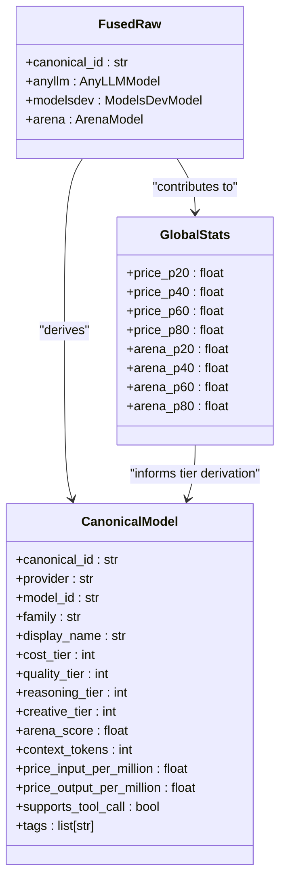
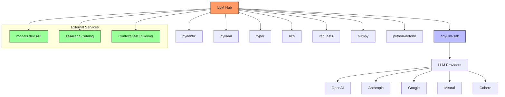

# Ai Native Documentation

<cite>
**Referenced Files in This Document**   
- [README.md](file://README.md)
- [AI_NATIVE_DOCS.md](file://AI_NATIVE_DOCS.md)
- [llmhub.aimanifest.yaml](file://llmhub.aimanifest.yaml)
- [packages/cli/pyproject.toml](file://packages/cli/pyproject.toml)
- [packages/runtime/pyproject.toml](file://packages/runtime/pyproject.toml)
- [packages/runtime/src/llmhub_runtime/hub.py](file://packages/runtime/src/llmhub_runtime/hub.py)
- [packages/runtime/src/llmhub_runtime/models.py](file://packages/runtime/src/llmhub_runtime/models.py)
- [packages/cli/src/llmhub_cli/cli.py](file://packages/cli/src/llmhub_cli/cli.py)
- [packages/cli/src/llmhub_cli/catalog/builder.py](file://packages/cli/src/llmhub_cli/catalog/builder.py)
- [packages/cli/src/llmhub_cli/generator/spec/parser.py](file://packages/cli/src/llmhub_cli/generator/spec/parser.py)
- [packages/cli/src/llmhub_cli/generator/emitter/models.py](file://packages/cli/src/llmhub_cli/generator/emitter/models.py)
- [packages/cli/src/llmhub_cli/commands/setup.py](file://packages/cli/src/llmhub_cli/commands/setup.py)
- [packages/cli/src/llmhub_cli/commands/runtime.py](file://packages/cli/src/llmhub_cli/commands/runtime.py)
- [examples/agent_manifest_usage.py](file://examples/agent_manifest_usage.py)
- [docs/CONTEXT7_MCP_INTEGRATION.md](file://docs/CONTEXT7_MCP_INTEGRATION.md)
- [docs/CONTEXT7_QUICK_REFERENCE.md](file://docs/CONTEXT7_QUICK_REFERENCE.md)
</cite>

## Update Summary
**Changes Made**   
- Added new section on Context7 MCP Server Integration for AI-assisted development
- Updated Introduction to include Context7 capabilities
- Added Context7-related files to referenced files list
- Enhanced Troubleshooting Guide with Context7-specific issues
- Updated Performance Considerations to include Context7 integration

## Table of Contents
1. [Introduction](#introduction)
2. [Project Structure](#project-structure)
3. [Core Components](#core-components)
4. [Architecture Overview](#architecture-overview)
5. [Detailed Component Analysis](#detailed-component-analysis)
6. [Dependency Analysis](#dependency-analysis)
7. [Performance Considerations](#performance-considerations)
8. [Troubleshooting Guide](#troubleshooting-guide)
9. [Conclusion](#conclusion)
10. [Context7 MCP Server Integration](#context7-mcp-server-integration)

## Introduction

LLM Hub is a production-grade system for managing large language models (LLMs) through declarative configuration rather than hardcoded provider/model names. It provides a unified runtime that resolves logical "roles" to actual LLM providers and models, plus a sophisticated catalog system that enriches models with cost, quality, and capability metadata. The system enables AI agents to understand and integrate tools efficiently through AI-native documentation.

The core objective of LLM Hub is to decouple business logic from model implementation by allowing applications to reference logical roles ("preprocess", "inference", "embedding") instead of vendor-specific model strings. This approach enables config-driven model selection, intelligent model selection based on preferences, and standardized LLM access through a consistent interface backed by any-llm.

With the integration of Context7 MCP server, LLM Hub now provides AI-assisted development capabilities that deliver up-to-date, version-specific documentation and code examples directly within the development workflow. This eliminates common issues like outdated code examples, hallucinated APIs, and generic answers for deprecated package versions.

**Section sources**
- [README.md](file://README.md#L1-L645)

## Project Structure

The LLM Hub repository follows a modular structure with clear separation between runtime and CLI components. The project is organized into several key directories:

- **examples/**: Contains usage examples including agent manifest usage
- **packages/**: Contains the core packages
  - **cli/**: Command-line interface with source code, commands, and generator components
  - **runtime/**: Lightweight runtime library for LLM resolution
- **reports/test-execution/**: Test execution reports
- **scripts/**: Utility scripts for release management and validation
- **docs/**: Documentation files including Context7 integration guides
- Root-level configuration and documentation files

The CLI package provides commands for project initialization, spec management, runtime generation, catalog management, and testing. The runtime package offers a lightweight Python library that loads configuration, resolves logical role names to concrete provider:model pairs, and delegates LLM calls to any-llm.



**Diagram sources**
- [README.md](file://README.md#L1-L645)

## Core Components

LLM Hub consists of several core components that work together to provide a comprehensive LLM management system. The architecture is built around three main pillars: the runtime, the CLI, and the catalog system.

The **runtime** is a lightweight Python library that loads machine configuration from llmhub.yaml, resolves logical role names to concrete provider:model pairs, and delegates actual LLM calls to any-llm. It supports hooks for logging, observability, and cost tracking, and provides capabilities for chat completions, embeddings, environment-based configuration, parameter overrides, and strict environment variable validation.

The **CLI** provides a comprehensive set of commands for project initialization (llmhub init, llmhub setup), spec management, runtime generation (llmhub generate), catalog management (llmhub catalog show, llmhub catalog refresh), and testing/validation (llmhub test, llmhub doctor).

The **catalog** is a local model database that discovers callable models via any-llm, enriches them with metadata from models.dev and LMArena arena-catalog, derives normalized tiers for cost, quality, reasoning, and creativity, and caches the catalog to disk with TTL for fast access.

**Section sources**
- [README.md](file://README.md#L1-L645)
- [AI_NATIVE_DOCS.md](file://AI_NATIVE_DOCS.md#L1-L382)

## Architecture Overview

LLM Hub follows a modular architecture with clear separation of concerns between configuration, runtime execution, and model management. The system operates through a workflow that begins with high-level specification and ends with runtime execution.



**Diagram sources**
- [README.md](file://README.md#L1-L645)
- [AI_NATIVE_DOCS.md](file://AI_NATIVE_DOCS.md#L1-L382)

## Detailed Component Analysis

### Runtime Component Analysis

The runtime component is the core execution engine of LLM Hub, responsible for resolving logical roles to concrete LLM providers and models. It provides a clean interface for LLM interactions while abstracting away provider-specific details.

#### Runtime Hub Class


**Diagram sources**
- [packages/runtime/src/llmhub_runtime/hub.py](file://packages/runtime/src/llmhub_runtime/hub.py#L1-L189)
- [packages/runtime/src/llmhub_runtime/models.py](file://packages/runtime/src/llmhub_runtime/models.py#L1-L41)

#### Runtime Execution Flow


**Diagram sources**
- [packages/runtime/src/llmhub_runtime/hub.py](file://packages/runtime/src/llmhub_runtime/hub.py#L1-L189)

### CLI Component Analysis

The CLI component provides a comprehensive interface for managing LLM configurations and operations. It serves as the primary tool for developers to interact with the LLM Hub system.

#### CLI Command Structure


**Diagram sources**
- [packages/cli/src/llmhub_cli/cli.py](file://packages/cli/src/llmhub_cli/cli.py#L1-L67)

#### Configuration Generation Flow


**Diagram sources**
- [packages/cli/src/llmhub_cli/commands/runtime.py](file://packages/cli/src/llmhub_cli/commands/runtime.py#L1-L156)
- [packages/cli/src/llmhub_cli/generator/spec/parser.py](file://packages/cli/src/llmhub_cli/generator/spec/parser.py#L1-L66)

### Catalog System Analysis

The catalog system is the intelligence layer of LLM Hub, combining multiple data sources to build a comprehensive model database.

#### Catalog Data Fusion Process


**Diagram sources**
- [packages/cli/src/llmhub_cli/catalog/builder.py](file://packages/cli/src/llmhub_cli/catalog/builder.py#L1-L388)

#### Catalog Model Derivation


**Diagram sources**
- [packages/cli/src/llmhub_cli/catalog/builder.py](file://packages/cli/src/llmhub_cli/catalog/builder.py#L1-L388)

## Dependency Analysis

LLM Hub has a well-defined dependency structure that separates runtime dependencies from development and CLI dependencies.



**Diagram sources**
- [packages/cli/pyproject.toml](file://packages/cli/pyproject.toml#L1-L68)
- [packages/runtime/pyproject.toml](file://packages/runtime/pyproject.toml#L1-L42)
- [README.md](file://README.md#L1-L645)

## Performance Considerations

LLM Hub is designed with performance in mind, particularly in terms of configuration resolution and catalog operations. The system employs caching strategies to minimize redundant operations and optimize access patterns.

The catalog system implements a time-to-live (TTL) cache with a default of 24 hours, stored at platform-specific config directories. This caching mechanism ensures that catalog builds are fast when using cached data (<100ms) while still allowing for periodic refreshes from external sources. Full catalog rebuilds take 5-15 seconds as they require network access to models.dev API, LMArena GitHub catalog, and any-llm for provider discovery.

Role resolution in the runtime is extremely fast (<100ms) as it involves only local configuration lookup without network calls. The actual LLM call latency depends on the resolved provider and model, with typical completion calls taking 500ms-5s and embedding calls taking 100ms-1s.

Configuration generation (llmhub generate) has a latency of 2-10 seconds, depending on whether a catalog build is required and whether LLM-assisted generation is used. The process involves spec loading, catalog access, selection logic, and optional LLM calls for assisted generation.

The integration with Context7 MCP server adds network latency for documentation retrieval, but provides significant benefits in development efficiency by delivering up-to-date, version-specific documentation and code examples directly within the AI-assisted development workflow.

**Section sources**
- [README.md](file://README.md#L1-L645)
- [AI_NATIVE_DOCS.md](file://AI_NATIVE_DOCS.md#L1-L382)

## Troubleshooting Guide

LLM Hub provides several built-in commands and mechanisms for troubleshooting and diagnostics. The system includes comprehensive error handling and validation to help identify and resolve common issues.

The `llmhub doctor` command (also accessible as `llmhub test`) performs a comprehensive health check of the environment setup, validating configuration files, checking for required environment variables, and testing provider availability. This command helps identify issues such as missing API keys, invalid configuration files, or network connectivity problems with external services.

Common issues and their solutions include:

- **Missing environment variables**: Ensure all required API keys are set as environment variables or in a .env file. The system requires provider-specific keys like OPENAI_API_KEY, ANTHROPIC_API_KEY, etc.
- **Catalog build failures**: Verify network connectivity to external services (models.dev API, LMArena catalog) and ensure API keys are valid for provider discovery.
- **Role resolution failures**: Check that roles defined in the spec file exist and that the corresponding providers are enabled and properly configured.
- **Configuration validation errors**: Validate YAML syntax and ensure all required fields are present in both spec and runtime configuration files.

The system also provides dry-run options for the generate command (`llmhub generate --dry-run`) to preview changes without writing files, and explanation options (`llmhub generate --explain`) to show reasoning for model selections.

### Context7-Specific Troubleshooting

When using the Context7 MCP server integration, additional issues may arise:

- **Context7 Not Responding**: Check internet connection, verify `.qoder/mcp.json` file exists and is valid JSON, restart Qoder IDE, and check Qoder IDE MCP server status.
- **Invalid API Key Error**: Verify `CONTEXT7_API_KEY` is set in `.env`, check for extra spaces or quotes in the API key, regenerate API key from Context7 Dashboard, and ensure `.env` file is in the workspace root directory.
- **Rate Limit Exceeded**: Get an API key for higher limits, wait for rate limit to reset (typically hourly), or reduce frequency of Context7 requests.
- **MCP Server Connection Failed**: Check internet connectivity, verify firewall/proxy settings, test access to `https://mcp.context7.com/mcp`, and check Qoder IDE logs for detailed error messages.
- **Environment Variable Not Loaded**: Ensure `.env` file is in workspace root, verify variable name is exactly `CONTEXT7_API_KEY`, restart Qoder IDE after modifying `.env`, and check that `.env` file has no syntax errors.

**Section sources**
- [README.md](file://README.md#L1-L645)
- [packages/cli/src/llmhub_cli/commands/setup.py](file://packages/cli/src/llmhub_cli/commands/setup.py#L1-L215)
- [packages/cli/src/llmhub_cli/commands/runtime.py](file://packages/cli/src/llmhub_cli/commands/runtime.py#L1-L156)
- [docs/CONTEXT7_MCP_INTEGRATION.md](file://docs/CONTEXT7_MCP_INTEGRATION.md#L1-L384)

## Conclusion

LLM Hub provides a comprehensive solution for managing large language models through declarative configuration, offering significant advantages over hardcoded provider/model references. The system's architecture effectively decouples business logic from model implementation, enabling config-driven model selection and standardized LLM access.

The AI-native documentation approach, exemplified by the llmhub.aimanifest.yaml file, represents a significant advancement in tool integration efficiency for AI agents. By providing structured, queryable capability metadata, the system enables approximately 10x more efficient tool understanding compared to parsing traditional narrative documentation.

Key strengths of the system include its modular architecture, comprehensive catalog system that enriches models with metadata from multiple sources, and well-designed CLI interface that simplifies common operations. The runtime library provides a clean, consistent interface for LLM interactions with support for hooks, parameter overrides, and strict environment validation.

The integration of Context7 MCP server enhances the development experience by providing up-to-date, version-specific documentation and code examples directly within the AI-assisted workflow, eliminating common issues like outdated code examples and hallucinated APIs.

Future enhancements could include expanding the generator capabilities for LLM-assisted model selection, developing a web UI for interactive catalog browsing and configuration editing, and creating a SaaS offering for hosted catalog and model recommendation services.

**Section sources**
- [README.md](file://README.md#L1-L645)
- [AI_NATIVE_DOCS.md](file://AI_NATIVE_DOCS.md#L1-L382)
- [llmhub.aimanifest.yaml](file://llmhub.aimanifest.yaml#L1-L1124)

## Context7 MCP Server Integration

### Overview

This section details the integration of the Context7 MCP (Model Context Protocol) server with Qoder IDE in the LLMHub project. Context7 provides up-to-date, version-specific documentation and code examples directly within your AI-assisted development workflow.

### What is Context7?

Context7 is an MCP server that fetches current library documentation and code examples from source repositories. It eliminates common issues like:
- Outdated code examples from old training data
- Hallucinated APIs that don't exist
- Generic answers for deprecated package versions

With Context7, you get:
- Up-to-date, version-specific documentation
- Working code examples from current library versions
- Accurate API references

### Prerequisites

- Qoder IDE (version 0.2.18 or higher)
- LLMHub project workspace
- Internet connection for remote MCP server
- (Optional) Context7 API key for enhanced features

### Quick Start

#### Step 1: Set Up Environment Variable (Optional)

For enhanced features (higher rate limits, private repositories), add your Context7 API key:

1. Copy `.env.example` to `.env` if you haven't already:
   ```bash
   cp .env.example .env
   ```

2. Open `.env` and add your Context7 API key:
   ```bash
   CONTEXT7_API_KEY=your_api_key_here
   ```

3. Get your API key from [Context7 Dashboard](https://context7.com/dashboard)

**Note**: Context7 works without an API key, but with rate limits and public repositories only.

#### Step 2: Verify MCP Configuration

The MCP configuration file has been created at `.qoder/mcp.json`. It contains:

```json
{
  "mcpServers": {
    "context7": {
      "url": "https://mcp.context7.com/mcp",
      "headers": {
        "CONTEXT7_API_KEY": "${CONTEXT7_API_KEY}"
      }
    }
  }
}
```

#### Step 3: Restart Qoder IDE

For the MCP configuration to take effect:
1. Save all your work
2. Close Qoder IDE
3. Reopen Qoder IDE
4. The Context7 MCP server will connect automatically

#### Step 4: Test the Integration

Try using Context7 in your prompts by including "use context7":

**Example Prompt**:
```
Create a Python function that uses the requests library to fetch JSON data 
from an API with proper error handling. use context7
```

Context7 will fetch the latest documentation for the requests library and provide accurate, up-to-date examples.

### Configuration Details

#### MCP Configuration File Location

- **File Path**: `.qoder/mcp.json`
- **Format**: JSON
- **Scope**: Project-specific (applies to this workspace only)

#### Configuration Schema

| Field | Type | Description | Required |
|-------|------|-------------|----------|
| `mcpServers` | Object | Container for all MCP server definitions | Yes |
| `mcpServers.context7` | Object | Context7-specific configuration | Yes |
| `mcpServers.context7.url` | String | Remote MCP server endpoint | Yes |
| `mcpServers.context7.headers` | Object | HTTP headers for authentication | No |
| `mcpServers.context7.headers.CONTEXT7_API_KEY` | String | API key (from environment variable) | No |

#### Environment Variables

| Variable | Purpose | Required | Default |
|----------|---------|----------|---------|
| `CONTEXT7_API_KEY` | Authentication for Context7 service | No | (none) |

**Environment Variable Substitution**: The `${CONTEXT7_API_KEY}` syntax in the configuration file automatically reads from your `.env` file.

### Usage Guidelines

#### When to Use Context7

Use Context7 when you need:
- Current library documentation
- Up-to-date code examples
- Version-specific API references
- Best practices for modern libraries
- Configuration steps for tools/frameworks

#### How to Invoke Context7

Simply add "use context7" to your prompt:

```
Configure a FastAPI application with CORS middleware. use context7
```

#### Auto-Invocation (Optional)

You can configure Qoder IDE to automatically use Context7 for code-related queries by adding a rule to your Qoder settings. Add this to your `.qoder/.windsurfrules` file (if it exists):

```
Always use context7 when I need code generation, setup or configuration steps, 
or library/API documentation. This means you should automatically use the Context7 
MCP tools to resolve library id and get library docs without me having to explicitly ask.
```

### API Key Management

#### Getting an API Key

1. Visit [Context7 Dashboard](https://context7.com/dashboard)
2. Sign up or log in
3. Navigate to API Keys section
4. Generate a new API key
5. Copy the key to your `.env` file

#### Benefits With API Key

- Higher rate limits (more requests per hour)
- Access to private repository documentation
- Priority support
- Advanced features

#### Without API Key

- Basic functionality works
- Rate limiting applies
- Public repositories only

#### Security Best Practices

- Store API key in `.env` file only
- Never commit `.env` to version control (already in `.gitignore`)
- Use HTTPS for all communications (automatic with remote server)
- Rotate API keys periodically
- Never hardcode API keys in configuration files
- Never share API keys in public channels

### Troubleshooting

#### Context7 Not Responding

**Issue**: Context7 doesn't return documentation when invoked

**Solutions**:
1. Check your internet connection
2. Verify `.qoder/mcp.json` file exists and is valid JSON
3. Restart Qoder IDE
4. Check Qoder IDE MCP server status

#### Invalid API Key Error

**Issue**: Authentication fails with API key

**Solutions**:
1. Verify `CONTEXT7_API_KEY` is set in `.env`
2. Check for extra spaces or quotes in the API key
3. Regenerate API key from Context7 Dashboard
4. Ensure `.env` file is in the workspace root directory

#### Rate Limit Exceeded

**Issue**: "Rate limit exceeded" error

**Solutions**:
1. Get an API key for higher limits
2. Wait for rate limit to reset (typically hourly)
3. Reduce frequency of Context7 requests

#### MCP Server Connection Failed

**Issue**: Cannot connect to Context7 server

**Solutions**:
1. Check internet connectivity
2. Verify firewall/proxy settings
3. Test access to `https://mcp.context7.com/mcp`
4. Check Qoder IDE logs for detailed error messages

#### Environment Variable Not Loaded

**Issue**: API key from `.env` not being used

**Solutions**:
1. Ensure `.env` file is in workspace root
2. Verify variable name is exactly `CONTEXT7_API_KEY`
3. Restart Qoder IDE after modifying `.env`
4. Check that `.env` file has no syntax errors

### Advanced Configuration

#### Multiple MCP Servers

You can add additional MCP servers to `.qoder/mcp.json`:

```json
{
  "mcpServers": {
    "context7": {
      "url": "https://mcp.context7.com/mcp",
      "headers": {
        "CONTEXT7_API_KEY": "${CONTEXT7_API_KEY}"
      }
    },
    "another-mcp-server": {
      "url": "https://example.com/mcp",
      "headers": {}
    }
  }
}
```

#### Local Server Option (Future)

While the current setup uses a remote server, Context7 also supports local installation via npx:

```bash
npx -y @upstash/context7-mcp --api-key YOUR_API_KEY
```

To configure local server in the future, modify `.qoder/mcp.json`:

```json
{
  "mcpServers": {
    "context7": {
      "command": "npx",
      "args": ["-y", "@upstash/context7-mcp", "--api-key", "${CONTEXT7_API_KEY}"]
    }
  }
}
```

#### Connection Timeout Configuration

If you experience timeout issues, you may need to adjust Qoder IDE's timeout settings (refer to Qoder IDE documentation).

### Examples

#### Example 1: Python Requests Library

**Prompt**:
```
Write a Python function to make a POST request with JSON data and handle timeouts. use context7
```

**Result**: Context7 fetches current `requests` library documentation and provides up-to-date examples.

#### Example 2: FastAPI Configuration

**Prompt**:
```
Set up a FastAPI application with dependency injection for database connections. use context7
```

**Result**: Current FastAPI patterns and best practices.

#### Example 3: React Hooks

**Prompt**:
```
Create a custom React hook for managing form state with validation. use context7
```

**Result**: Latest React hooks API and patterns.

### Support and Resources

#### Official Documentation

- **Context7 Documentation**: [https://github.com/mcp/upstash/context7](https://github.com/mcp/upstash/context7)
- **Context7 Dashboard**: [https://context7.com/dashboard](https://context7.com/dashboard)
- **MCP Protocol**: Standard Model Context Protocol

#### LLMHub Resources

- **Project README**: See main README.md for LLMHub overview
- **Environment Setup**: See .env.example for all configuration options
- **Issue Tracking**: Report issues via project issue tracker

#### Getting Help

1. Check this documentation first
2. Review troubleshooting section
3. Check Context7 GitHub repository for known issues
4. Contact project maintainers for LLMHub-specific questions

### Frequently Asked Questions

#### Q: Do I need an API key to use Context7?

**A**: No, Context7 works without an API key, but with rate limits and access to public repositories only. An API key provides higher limits and private repository access.

#### Q: Will Context7 work offline?

**A**: No, the remote server configuration requires internet connectivity. For offline usage, consider the local server option (future enhancement).

#### Q: How much does Context7 cost?

**A**: Check the [Context7 Dashboard](https://context7.com/dashboard) for current pricing. Basic usage may be free with rate limits.

#### Q: Can I use Context7 with other projects?

**A**: Yes, Context7 can be configured for any project. The `.qoder/mcp.json` file is project-specific, so each project can have its own configuration.

#### Q: What happens if Context7 is unavailable?

**A**: Qoder IDE will continue to function normally using the LLM's training data. Context7 is an enhancement, not a requirement.

#### Q: How do I disable Context7?

**A**: Remove or rename `.qoder/mcp.json`, or remove the Context7 entry from the file, then restart Qoder IDE.

#### Q: Can I use Context7 for private company libraries?

**A**: With an API key and proper permissions, Context7 can access private repositories. Contact Context7 support for enterprise features.

### Version History

#### Version 1.0 (December 2024)

- Initial Context7 MCP integration
- Remote server configuration
- Environment-based API key management
- Basic documentation and troubleshooting guide

### Next Steps

After setting up Context7:
1. ✅ Test with a few prompts including "use context7"
2. ✅ Monitor usage and rate limits
3. ✅ Consider getting an API key for enhanced features
4. ✅ Set up auto-invocation rules if desired
5. ✅ Explore other MCP servers for additional capabilities

### Feedback

We welcome feedback on the Context7 integration:
- Report issues or suggest improvements
- Share successful use cases
- Contribute to documentation improvements

**Section sources**
- [docs/CONTEXT7_MCP_INTEGRATION.md](file://docs/CONTEXT7_MCP_INTEGRATION.md#L1-L384)
- [docs/CONTEXT7_QUICK_REFERENCE.md](file://docs/CONTEXT7_QUICK_REFERENCE.md#L1-L106)
- [README.md](file://README.md#L148-L158)