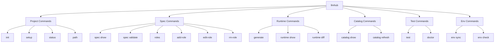
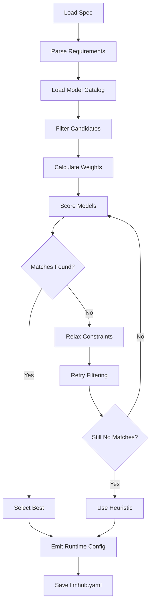
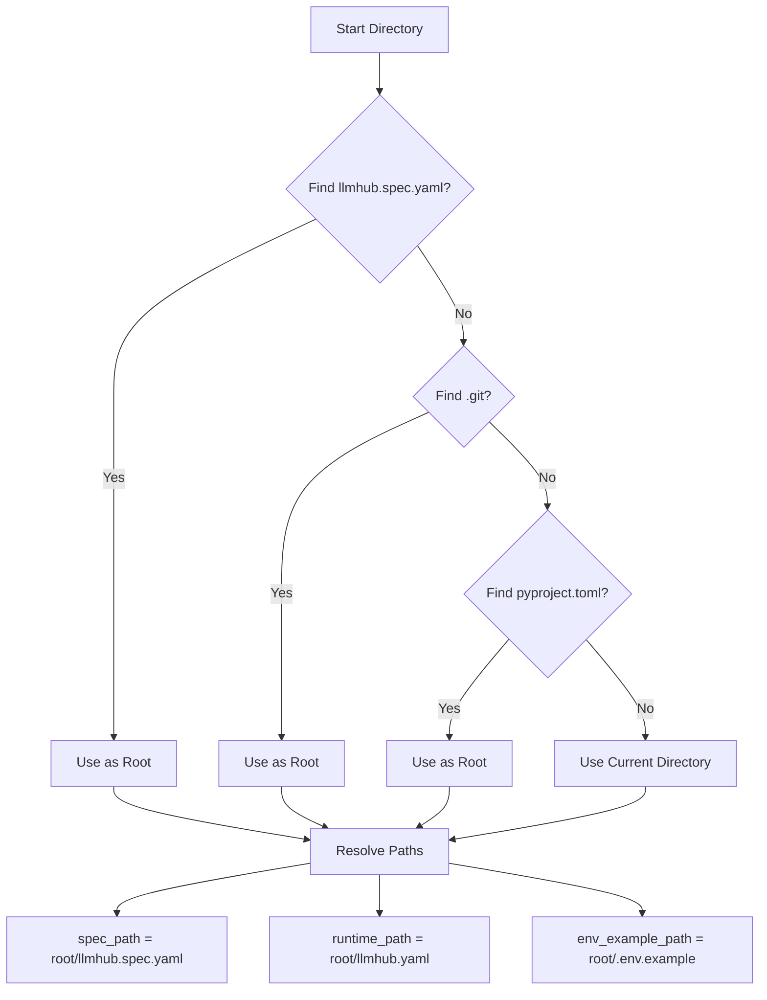

# CLI Reference

<cite>
**Referenced Files in This Document**
- [cli.py](file://packages/cli/src/llmhub_cli/cli.py) - *Updated in recent commit*
- [setup.py](file://packages/cli/src/llmhub_cli/commands/setup.py) - *Updated in recent commit*
- [spec.py](file://packages/cli/src/llmhub_cli/commands/spec.py) - *Updated in recent commit*
- [runtime.py](file://packages/cli/src/llmhub_cli/commands/runtime.py) - *Updated in recent commit*
- [catalog.py](file://packages/cli/src/llmhub_cli/commands/catalog.py) - *Updated in recent commit*
- [test.py](file://packages/cli/src/llmhub_cli/commands/test.py) - *Updated in recent commit*
- [env.py](file://packages/cli/src/llmhub_cli/commands/env.py) - *Updated in recent commit*
- [context.py](file://packages/cli/src/llmhub_cli/context.py) - *Updated in recent commit*
- [ux.py](file://packages/cli/src/llmhub_cli/ux.py) - *Updated in recent commit*
- [generator_hook.py](file://packages/cli/src/llmhub_cli/generator_hook.py) - *Updated in recent commit*
- [README.md](file://packages/cli/src/llmhub_cli/generator/README.md) - *Updated in recent commit*
</cite>

## Update Summary
**Changes Made**
- Updated all file references to reflect the new `llmhub_cli` namespace in the `packages/cli` directory
- Modified command architecture section to reflect separation of CLI and runtime components
- Updated section sources to point to new file locations in the `llmhub_cli` package
- Adjusted diagram sources to reference updated implementation files
- Maintained all existing documentation content while updating file paths and namespace references

## Table of Contents
1. [Introduction](#introduction)
2. [Command Overview](#command-overview)
3. [Project Bootstrapping Commands](#project-bootstrapping-commands)
4. [Specification Management](#specification-management)
5. [Runtime Generation](#runtime-generation)
6. [Model Catalog Management](#model-catalog-management)
7. [Testing and Diagnostics](#testing-and-diagnostics)
8. [Environment Management](#environment-management)
9. [Command Architecture](#command-architecture)
10. [Error Handling and Troubleshooting](#error-handling-and-troubleshooting)

## Introduction

The LLMHub CLI tool provides a comprehensive command-line interface for managing Large Language Model (LLM) specifications and runtime configurations. It serves as the primary interface for the LLMHub ecosystem, enabling developers to bootstrap projects, define LLM requirements, generate runtime configurations, and test model integrations.

The CLI follows a structured workflow: **init/setup** → **spec management** → **generate** → **test** → **production**. Each command is designed to work seamlessly with the underlying generator pipeline and catalog system.

## Command Overview

The LLMHub CLI is organized into several command groups, each serving specific aspects of LLM configuration management:



**Diagram sources**
- [cli.py](file://packages/cli/src/llmhub_cli/cli.py#L4-L45)

**Section sources**
- [cli.py](file://packages/cli/src/llmhub_cli/cli.py#L1-L67)

## Project Bootstrapping Commands

### `init` - Quick Project Initialization

Creates a minimal LLMHub specification with essential configuration for immediate use.

**Syntax:**
```bash
llmhub init
```

**Purpose:** Provides a streamlined way to create a basic LLMHub project with default settings, ideal for quick prototyping or simple use cases.

**Behavior:**
- Creates `llmhub.spec.yaml` with OpenAI as the default provider
- Sets up a single `llm.inference` role with medium cost, latency, and high quality preferences
- Generates `.env.example` with OpenAI API key configuration
- Preserves existing spec files when prompted

**Example Output:**
```
✓ Minimal spec created at ./llmhub.spec.yaml
✓ Environment example created at ./.env.example

Next steps:
  1. Edit llmhub.spec.yaml to add more roles
  2. Set OPENAI_API_KEY environment variable
  3. Run: llmhub generate
```

**Section sources**
- [setup.py](file://packages/cli/src/llmhub_cli/commands/setup.py#L121-L161)

### `setup` - Interactive Project Setup

Guided interactive setup process for comprehensive LLMHub project configuration.

**Syntax:**
```bash
llmhub setup
```

**Purpose:** Enables users to create fully customized LLMHub specifications through an interactive wizard, selecting providers, configuring roles, and setting preferences.

**Workflow:**
1. **Project Configuration:** Enter project name and environment
2. **Provider Selection:** Choose from supported providers (OpenAI, Anthropic, Gemini, Mistral, Cohere)
3. **Role Scaffolding:** Select standard roles to create (preprocess, inference, embedding, tools)
4. **Preference Configuration:** Set cost, latency, and quality preferences for each role
5. **File Generation:** Creates spec file and environment example

**Available Standard Roles:**
- `llm.preprocess`: Fast, cost-effective model for input normalization
- `llm.inference`: Main reasoning model for answers and complex tasks
- `llm.embedding`: Vector embeddings for retrieval and similarity operations
- `llm.tools`: Model specialized for tool/function calling

**Example Session:**
```bash
LLMHub Setup

Project name [my-project]: demo-app
Environment [dev]: staging

Select providers to enable:
  1. openai
  2. anthropic
  3. gemini
Enter numbers separated by commas (e.g., 1,3,4) or 'all':

Select standard roles to create:
  1. llm.preprocess
  2. llm.inference
  3. llm.embedding
  4. llm.tools
Enter numbers separated by commas (e.g., 1,3,4) or 'all': 1,2,4

Configuring llm.inference
  Description: Main reasoning model for answers.
  Cost preference? [low/medium/high]: high
  Latency preference? [low/medium/high]: medium
  Quality preference? [low/medium/high]: high
```

**Section sources**
- [setup.py](file://packages/cli/src/llmhub_cli/commands/setup.py#L16-L118)

### `status` - Project Health Check

Displays current project status and validates configuration files.

**Syntax:**
```bash
llmhub status
```

**Purpose:** Provides a comprehensive overview of project health, validating spec and runtime files while identifying potential issues.

**Validation Checks:**
- Spec file existence and validity
- Runtime file existence and validity
- Environment variable configuration
- Provider availability

**Output Format:**
```
LLMHub Project Status
Root: /path/to/project
Spec: /path/to/project/llmhub.spec.yaml ✓
Runtime: /path/to/project/llmhub.yaml ✓
Env example: /path/to/project/.env.example ✓

Project: my-app
Environment: dev
Providers: 1 enabled, 0 disabled
Roles: 3 total
```

**Section sources**
- [setup.py](file://packages/cli/src/llmhub_cli/commands/setup.py#L164-L215)

### `path` - Path Resolution

Shows resolved file paths for LLMHub configuration files.

**Syntax:**
```bash
llmhub path
```

**Purpose:** Helps users understand where LLMHub expects to find configuration files and where it will create them.

**Output Example:**
```
Resolved Paths:
Root: /path/to/project
Spec: /path/to/project/llmhub.spec.yaml
Runtime: /path/to/project/llmhub.yaml
Env example: /path/to/project/.env.example
```

**Section sources**
- [setup.py](file://packages/cli/src/llmhub_cli/commands/setup.py#L198-L207)

## Specification Management

### `spec show` - Display Specification

Shows the complete LLMHub specification in a formatted table layout.

**Syntax:**
```bash
llmhub spec show
```

**Purpose:** Provides a readable overview of the current specification, including providers and all defined roles.

**Output Format:**
```
Project: my-application
Environment: development

Providers
┌─────────────┬─────────┬─────────────┐
│ Provider    │ Enabled │ Env Key     │
├─────────────┼─────────┼─────────────┤
│ openai      │ ✓       │ OPENAI_API_KEY │
│ anthropic   │ ✓       │ ANTHROPIC_API_KEY │
└─────────────┴─────────┴─────────────┘

Roles in my-application
┌─────────────────┬─────────┬─────────────────────────────┬─────────────────┐
│ Role Name       │ Kind    │ Description                 │ Preferences     │
├─────────────────┼─────────┼─────────────────────────────┼─────────────────┤
│ llm.inference   │ chat    │ Main reasoning model        │ cost:medium,   │
│                 │         │ for complex tasks           │ latency:medium, │
│                 │         │                             │ quality:high    │
└─────────────────┴─────────┴─────────────────────────────┴─────────────────┘
```

**Section sources**
- [spec.py](file://packages/cli/src/llmhub_cli/commands/spec.py#L13-L34)

### `spec validate` - Specification Validation

Validates the specification file for syntax and semantic correctness.

**Syntax:**
```bash
llmhub spec validate
```

**Purpose:** Ensures the specification file is properly formatted and contains valid configuration data.

**Validation Features:**
- YAML syntax validation
- Required field presence
- Type checking for all values
- Cross-reference validation between roles and providers

**Success Output:**
```
✓ Spec is valid
  Project: my-project
  Roles: 3
  Providers: 2
```

**Error Output:**
```
✗ Spec validation failed:
  Required field 'description' missing in role 'llm.inference'
```

**Section sources**
- [spec.py](file://packages/cli/src/llmhub_cli/commands/spec.py#L36-L53)

### `roles` - List All Roles

Displays all roles defined in the specification.

**Syntax:**
```bash
llmhub roles
```

**Purpose:** Provides a quick overview of all roles currently defined in the specification.

**Output Format:**
Same as `spec show` but focused solely on role information.

**Section sources**
- [spec.py](file://packages/cli/src/llmhub_cli/commands/spec.py#L56-L69)

### `add-role` - Add New Role

Interactively adds a new role to the specification.

**Syntax:**
```bash
llmhub add-role <role-name>
```

**Purpose:** Enables dynamic addition of new roles to the specification during development.

**Interactive Workflow:**
1. Role kind selection (chat, embedding, image, audio, tool, other)
2. Description input
3. Preference configuration (cost, latency, quality)
4. Provider selection from enabled providers

**Example Session:**
```bash
Adding role: llm.analyzer

Select role kind:
  1. chat
  2. embedding
  3. image
  4. audio
  5. tool
  6. other
Enter number: 1

Description: Analyzes user input and extracts insights

Preferences:
Cost preference: [low/medium/high]: medium
Latency preference: [low/medium/high]: low
Quality preference: [low/medium/high]: high

Providers:
  1. openai
  2. anthropic
Select preferred providers: 1,2
```

**Section sources**
- [spec.py](file://packages/cli/src/llmhub_cli/commands/spec.py#L72-L139)

### `edit-role` - Modify Existing Role

Modifies an existing role's configuration.

**Syntax:**
```bash
llmhub edit-role <role-name>
```

**Purpose:** Allows modification of role attributes without recreating the entire role definition.

**Editable Attributes:**
- Description
- Preferences (cost, latency, quality)
- Provider preferences

**Section sources**
- [spec.py](file://packages/cli/src/llmhub_cli/commands/spec.py#L145-L189)

### `rm-role` - Remove Role

Removes a role from the specification.

**Syntax:**
```bash
llmhub rm-role <role-name>
```

**Purpose:** Safely removes roles that are no longer needed, maintaining specification integrity.

**Safety Features:**
- Confirmation prompt before deletion
- Validation that role exists
- Clear messaging about subsequent generation requirements

**Section sources**
- [spec.py](file://packages/cli/src/llmhub_cli/commands/spec.py#L195-L223)

## Runtime Generation

### `generate` - Convert Spec to Runtime Config

Generates the final runtime configuration from the specification using the sophisticated model selection pipeline.

**Syntax:**
```bash
llmhub generate [--dry-run] [--no-llm] [--force] [--explain]
```

**Purpose:** Transforms human-readable specifications into machine-executable runtime configurations through intelligent model selection.

**Options:**
- `--dry-run`: Show what would be generated without saving
- `--no-llm`: Use heuristic-only mode (no LLM calls)
- `--force`: Overwrite existing runtime without confirmation
- `--explain`: Show detailed rationale for model selections

**Underlying Pipeline:**

The generation process follows a sophisticated multi-stage pipeline:



**Diagram sources**
- [README.md](file://packages/cli/src/llmhub_cli/generator/README.md#L59-L73)

**Dry Run Example:**
```bash
llmhub generate --dry-run

Loaded spec: my-project
Generating runtime configuration...

Generated Runtime (dry-run):

Project: my-project
Environment: dev

Providers
┌─────────────┬─────────┬─────────────┐
│ Provider    │ Enabled │ Env Key     │
├─────────────┼─────────┼─────────────┤
│ openai      │ ✓       │ OPENAI_API_KEY │
└─────────────┴─────────┴─────────────┘

Roles
┌─────────────────┬─────────┬─────────────┬─────────┐
│ Role Name       │ Provider│ Model       │ Mode    │
├─────────────────┼─────────┼─────────────┼─────────┤
│ llm.inference   │ openai  │ gpt-4o      │ chat    │
│ llm.preprocess  │ openai  │ gpt-4o-mini │ chat    │
└─────────────────┴─────────┴─────────────┴─────────┘
```

**Explanation Mode Example:**
```bash
llmhub generate --explain

Generated Runtime:

Project: my-project
Environment: dev

Model Selections:
llm.inference: Selected gpt-4o (cost: 4/5, quality: 1/5) based on high quality preference
llm.preprocess: Selected gpt-4o-mini (cost: 1/5, quality: 3/5) for fast processing
```

**Section sources**
- [runtime.py](file://packages/cli/src/llmhub_cli/commands/runtime.py#L13-L69)

### `runtime show` - Display Runtime Configuration

Shows the current runtime configuration in a formatted table.

**Syntax:**
```bash
llmhub runtime show
```

**Purpose:** Provides a readable representation of the generated runtime configuration.

**Output Format:**
```
Project: my-application
Environment: production

Roles
┌─────────────────┬─────────┬─────────────┬─────────┐
│ Role Name       │ Provider│ Model       │ Mode    │
├─────────────────┼─────────┼─────────────┼─────────┤
│ llm.inference   │ openai  │ gpt-4o      │ chat    │
│ llm.embedding   │ openai  │ text-embedding-3-large │ embedding │
└─────────────────┴─────────┴─────────────┴─────────┘
```

**Section sources**
- [runtime.py](file://packages/cli/src/llmhub_cli/commands/runtime.py#L78-L96)

### `runtime diff` - Compare Spec vs Runtime

Shows differences between specification and runtime configurations.

**Syntax:**
```bash
llmhub runtime diff
```

**Purpose:** Helps track synchronization between spec and runtime, identifying roles that need generation.

**Output Scenarios:**

**All Roles Need Generation:**
```
Spec vs Runtime Diff:

Roles in spec but not in runtime (3):
  + llm.inference
  + llm.embedding
  + llm.tools

Run 'llmhub generate' to create runtime
```

**Partial Synchronization:**
```
Spec vs Runtime Diff:

Roles in spec but not in runtime (1):
  + llm.new-role

Roles in runtime but not in spec (1):
  - llm.obsolete-role

Roles in both (2):
  = llm.inference → openai:gpt-4o
  = llm.embedding → openai:text-embedding-3-large
```

**Fully Synchronized:**
```
Spec vs Runtime Diff:

Roles in both (3):
  = llm.inference → openai:gpt-4o
  = llm.embedding → openai:text-embedding-3-large
  = llm.tools → openai:gpt-4o-mini

✓ Spec and runtime are in sync
```

**Section sources**
- [runtime.py](file://packages/cli/src/llmhub_cli/commands/runtime.py#L99-L155)

## Model Catalog Management

### `catalog show` - Display Available Models

Shows the current model catalog with filtering and detailed information.

**Syntax:**
```bash
llmhub catalog show [--provider PROVIDER] [--details]
```

**Purpose:** Provides visibility into available models from all configured providers, helping with specification decisions.

**Options:**
- `--provider`: Filter models by specific provider
- `--details`: Show additional model information (Arena scores, tags)

**Output Format:**
```
Catalog Summary
  Total models: 156
  Providers: 5
  Built: 2024-01-15 10:30:00

OpenAI (45 models)
┌─────────────────────────────┬─────────┬───────────┐
│ Model                       │ Cost    │ Quality   │
├─────────────────────────────┼─────────┼───────────┤
│ gpt-4o                      │ 4       │ 1         │
│ gpt-4o-mini                 │ 1       │ 3         │
│ text-embedding-3-large      │ 2       │ 2         │
└─────────────────────────────┴─────────┴───────────┘

Anthropic (23 models)
┌─────────────────────────────┬─────────┬───────────┐
│ Model                       │ Cost    │ Quality   │
├─────────────────────────────┼─────────┼───────────┤
│ claude-3-5-sonnet-20241022  │ 3       │ 1         │
└─────────────────────────────┴─────────┴───────────┘
```

**Detailed View:**
```
Claude 3.5 Sonnet
┌─────────────────────────────┬─────────┬───────────┬─────────────┬─────────────────────┐
│ Model                       │ Cost    │ Quality   │ Arena Score │ Tags                │
├─────────────────────────────┼─────────┼───────────┼─────────────┼─────────────────────┤
│ claude-3-5-sonnet-20241022 │ 3       │ 1         │ 987         │ multimodal,reasoning │
└─────────────────────────────┴─────────┴───────────┴─────────────┴─────────────────────┘
```

**Section sources**
- [catalog.py](file://packages/cli/src/llmhub_cli/commands/catalog.py#L51-L127)

### `catalog refresh` - Update Model Catalog

Forces rebuilding of the model catalog from provider APIs.

**Syntax:**
```bash
llmhub catalog refresh [--ttl TTL_HOURS]
```

**Purpose:** Updates the local model catalog with fresh data from provider APIs, ensuring access to the latest models and pricing information.

**Options:**
- `--ttl`: Cache time-to-live in hours (default: 24)

**Benefits:**
- Access to newly released models
- Updated pricing information
- Current performance metrics
- Fresh capability information

**Output Example:**
```
Refreshing catalog...

✓ Catalog built successfully
  Models: 156
  Built at: 2024-01-15 10:30:00
  Version: 1.2.3

Models by provider:
  openai: 45
  anthropic: 23
  google: 18
  mistral: 12
  cohere: 8
```

**Section sources**
- [catalog.py](file://packages/cli/src/llmhub_cli/commands/catalog.py#L16-L48)

## Testing and Diagnostics

### `test` - Interactive Role Testing

Tests individual roles with custom prompts to validate model configurations.

**Syntax:**
```bash
llmhub test [--role ROLE] [--prompt PROMPT] [--env-file FILE] [--json]
```

**Purpose:** Enables interactive testing of role configurations to ensure proper model selection and API connectivity.

**Options:**
- `--role`: Specific role to test (otherwise interactive selection)
- `--prompt`: Custom prompt to send (otherwise interactive prompt)
- `--env-file`: Path to .env file for environment variables
- `--json`: Output raw JSON response instead of formatted text

**Testing Workflow:**
1. Load runtime configuration
2. Select role (interactive if not specified)
3. Configure prompt (interactive if not specified)
4. Initialize LLMHub with runtime config
5. Execute appropriate API call based on role mode
6. Display results with timing information

**Success Output:**
```
Testing role: llm.inference
Provider: openai
Model: gpt-4o
Mode: chat

✓ Call successful
Duration: 1.23s

Response:
Hello! How can I assist you today? I'm here to help with any questions or tasks you have.
```

**JSON Output:**
```bash
llmhub test --role llm.inference --prompt "Hello" --json

{
  "choices": [
    {
      "message": {
        "content": "Hello! How can I assist you today?"
      }
    }
  ],
  "usage": {
    "prompt_tokens": 5,
    "completion_tokens": 10,
    "total_tokens": 15
  }
}
```

**Error Scenarios:**
- Missing API keys
- Network connectivity issues
- Invalid model names
- Rate limiting

**Section sources**
- [test.py](file://packages/cli/src/llmhub_cli/commands/test.py#L18-L118)

### `doctor` - Comprehensive Health Check

Runs a comprehensive diagnostic check of the entire LLMHub setup.

**Syntax:**
```bash
llmhub doctor [--no-network]
```

**Purpose:** Performs automated health checks across all aspects of the LLMHub configuration to identify and report issues.

**Checks Performed:**
1. **Spec Validation**: Verifies specification file syntax and completeness
2. **Runtime Validation**: Ensures runtime configuration is valid
3. **Environment Check**: Validates required environment variables
4. **Network Test**: Tests connectivity to configured providers (optional)

**Options:**
- `--no-network`: Skip network connectivity tests

**Diagnostic Output:**
```
LLMHub Doctor

1. Checking spec...
   ✓ Spec valid (3 roles)

2. Checking runtime...
   ✓ Runtime valid (3 roles)

3. Checking environment...
   ✓ All environment variables set

4. Testing network call...
   ✓ Test call successful (llm.inference)

Summary:
✓ All checks passed!

Your LLMHub setup is ready to use.
```

**Warning Scenarios:**
```
✗ 1 issue(s) found:
  • Test call failed: Rate limit exceeded

⚠ 2 warning(s):
  • No runtime file found
  • Missing 2 environment variable(s)
```

**Section sources**
- [test.py](file://packages/cli/src/llmhub_cli/commands/test.py#L125-L232)

## Environment Management

### `env sync` - Synchronize Environment Variables

Updates the `.env.example` file with current provider requirements.

**Syntax:**
```bash
llmhub env sync
```

**Purpose:** Keeps environment examples synchronized with current provider configurations, especially useful after adding new providers or roles.

**Features:**
- Updates existing `.env.example` files
- Adds new environment variables for enabled providers
- Maintains comments and formatting
- Overwrites existing variables with current requirements

**Section sources**
- [env.py](file://packages/cli/src/llmhub_cli/commands/env.py#L13-L43)

### `env check` - Environment Variable Validation

Checks for missing environment variables required by the specification.

**Syntax:**
```bash
llmhub env check [--env-file FILE]
```

**Purpose:** Identifies missing environment variables before attempting to use the LLMHub configuration.

**Options:**
- `--env-file`: Path to specific .env file to load and check

**Validation Process:**
1. Load specification file
2. Check for enabled providers
3. Verify environment variables are set
4. Report missing variables with provider context

**Output Examples:**

**All Variables Present:**
```
✓ All required environment variables are set
```

**Missing Variables:**
```
✗ Missing 2 environment variable(s):

  • OPENAI_API_KEY (for openai)
  • ANTHROPIC_API_KEY (for anthropic)

Set missing variables in .env or export them
```

**Section sources**
- [env.py](file://packages/cli/src/llmhub_cli/commands/env.py#L44-L80)

## Command Architecture

### Context Resolution System

All LLMHub commands use a unified context resolution system that determines file locations and project boundaries.



**Diagram sources**
- [context.py](file://packages/cli/src/llmhub_cli/context.py#L27-L46)

**Path Resolution Priority:**
1. `llmhub.spec.yaml` file in directory or parents
2. `.git` directory in directory or parents
3. `pyproject.toml` file in directory or parents
4. Current directory as fallback

**Section sources**
- [context.py](file://packages/cli/src/llmhub_cli/context.py#L49-L90)

### Command Registration and Typing

The CLI uses Typer for robust command registration with automatic help generation and type safety.

**Command Structure:**
```python
# Main app
app = typer.Typer(help="LLMHub CLI — manage LLM specs and runtime configs")

# Subcommand groups
spec_app = typer.Typer(help="Spec management commands")
runtime_app = typer.Typer(help="Runtime management commands")
catalog_app = typer.Typer(help="Model catalog management")
```

**Section sources**
- [cli.py](file://packages/cli/src/llmhub_cli/cli.py#L4-L45)

## Error Handling and Troubleshooting

### Common Error Scenarios

#### Missing Specification Files
**Problem:** Commands fail with "No spec file found" messages.
**Solution:** Run `llmhub init` or `llmhub setup` to create a specification.

#### Runtime Generation Failures
**Problem:** `llmhub generate` fails or produces unexpected results.
**Solutions:**
- Run `llmhub spec validate` to check specification syntax
- Use `llmhub generate --dry-run` to preview changes
- Enable `--explain` mode for detailed rationale
- Check environment variables with `llmhub env check`

#### API Connectivity Issues
**Problem:** `llmhub test` or `llmhub doctor` reports connection failures.
**Solutions:**
- Verify API keys are set in environment variables
- Check network connectivity
- Review provider status pages
- Use `--no-llm` flag for offline testing

#### Model Selection Problems
**Problem:** Generated runtime uses unexpected models.
**Solutions:**
- Review role preferences in specification
- Check model catalog with `llmhub catalog show`
- Use `--explain` flag during generation
- Adjust provider priorities in specification

### Diagnostic Workflow

1. **Basic Health Check:**
   ```bash
   llmhub doctor
   ```

2. **Specification Validation:**
   ```bash
   llmhub spec validate
   llmhub spec show
   ```

3. **Environment Verification:**
   ```bash
   llmhub env check
   ```

4. **Runtime Comparison:**
   ```bash
   llmhub runtime diff
   ```

5. **Interactive Testing:**
   ```bash
   llmhub test --role llm.inference
   ```

### Troubleshooting Tips

#### Environment Issues
- Use `llmhub env sync` to regenerate environment examples
- Check `.env` file loading with `--env-file` option
- Verify environment variable names match provider requirements

#### Model Availability
- Refresh catalog with `llmhub catalog refresh`
- Check provider status and quotas
- Review model capabilities with `llmhub catalog show --details`

#### Permission Problems
- Ensure write permissions for project directory
- Check file ownership and access rights
- Verify Python environment has necessary packages

#### Network Connectivity
- Test internet access
- Check firewall settings
- Verify DNS resolution
- Review proxy configuration if applicable

**Section sources**
- [test.py](file://packages/cli/src/llmhub_cli/commands/test.py#L125-L232)
- [env.py](file://packages/cli/src/llmhub_cli/commands/env.py#L44-L80)