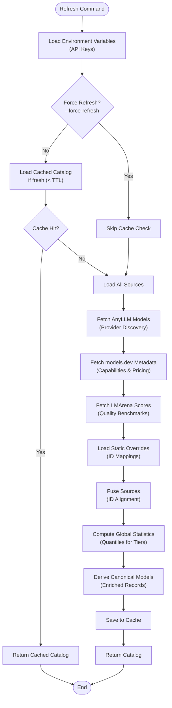
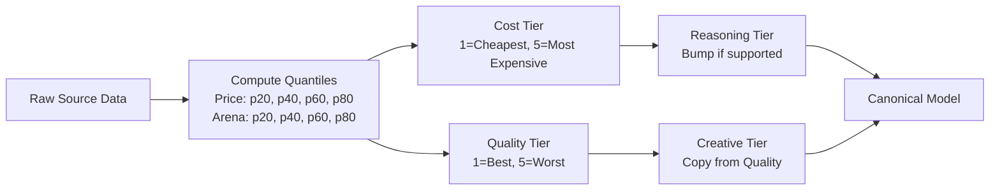
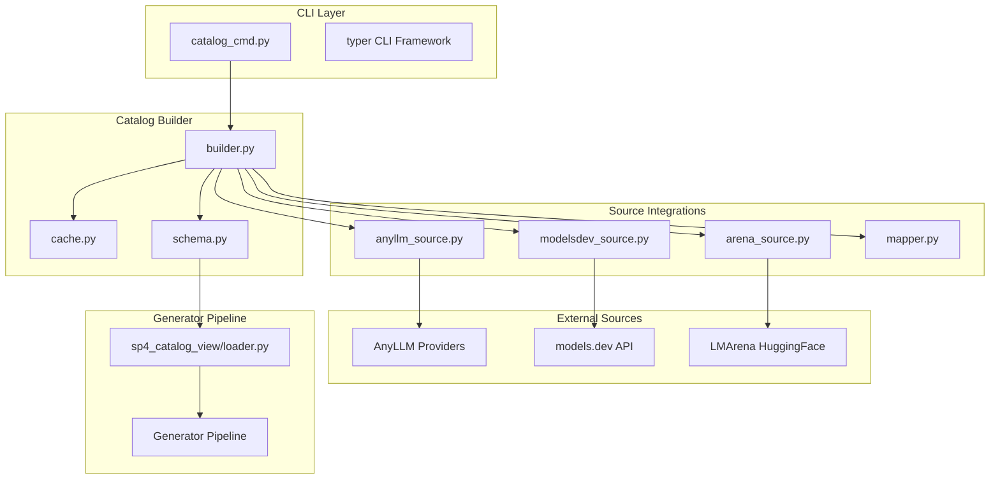
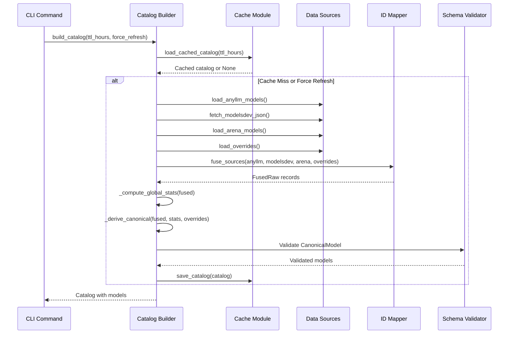
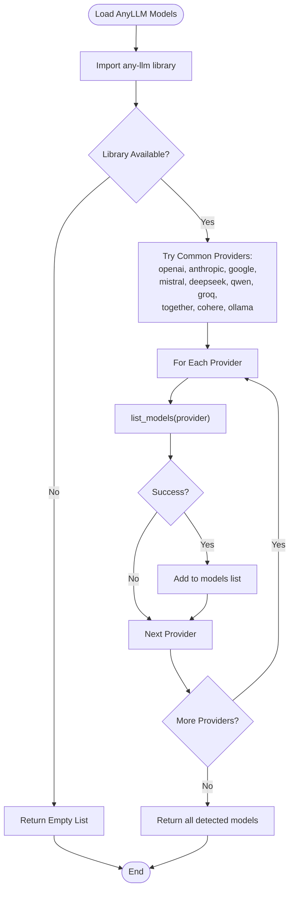
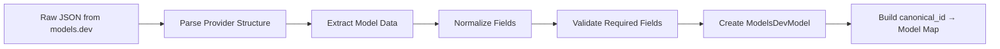
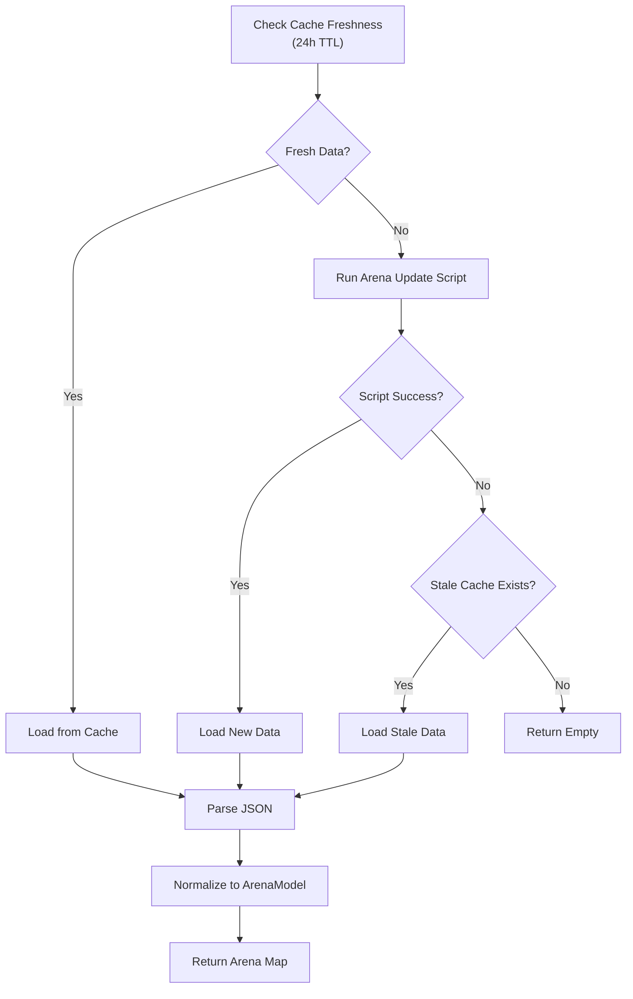
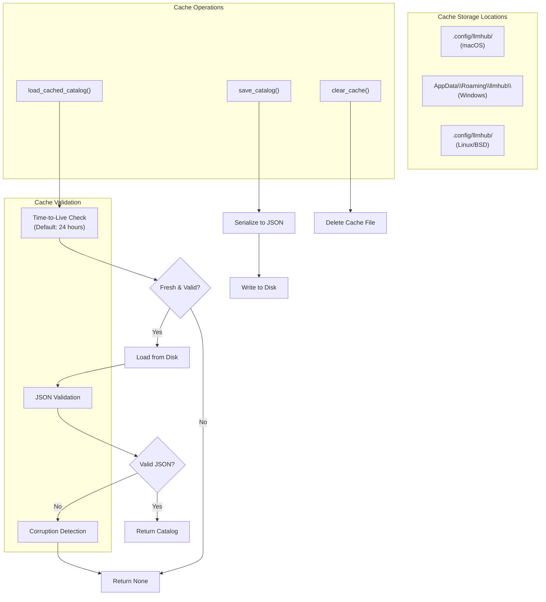
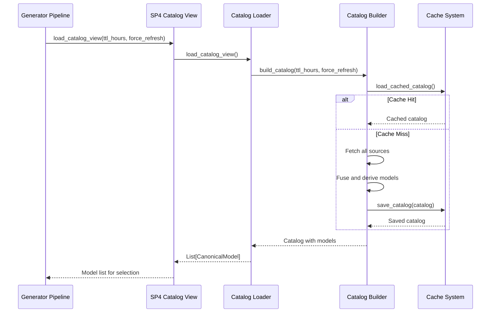

# Catalog Management Commands

<cite>
**Referenced Files in This Document**
- [catalog_cmd.py](file://packages/llmhub/src/llmhub/commands/catalog_cmd.py)
- [builder.py](file://packages/llmhub/src/llmhub/catalog/builder.py)
- [cache.py](file://packages/llmhub/src/llmhub/catalog/cache.py)
- [schema.py](file://packages/llmhub/src/llmhub/catalog/schema.py)
- [anyllm_source.py](file://packages/llmhub/src/llmhub/catalog/anyllm_source.py)
- [modelsdev_source.py](file://packages/llmhub/src/llmhub/catalog/modelsdev_source.py)
- [arena_source.py](file://packages/llmhub/src/llmhub/catalog/arena_source.py)
- [mapper.py](file://packages/llmhub/src/llmhub/catalog/mapper.py)
- [loader.py](file://packages/llmhub/src/llmhub/generator/sp4_catalog_view/loader.py)
- [overrides.json](file://packages/llmhub/src/llmhub/catalog/data/overrides.json)
- [update_leaderboard_data.py](file://packages/llmhub/src/llmhub/catalog/vendor/arena/update_leaderboard_data.py)
- [cli.py](file://packages/llmhub/src/llmhub/cli.py)
</cite>

## Table of Contents
1. [Introduction](#introduction)
2. [Command Overview](#command-overview)
3. [Catalog Refresh Command](#catalog-refresh-command)
4. [Catalog Show Command](#catalog-show-command)
5. [Architecture and Data Flow](#architecture-and-data-flow)
6. [Source Integration](#source-integration)
7. [Caching Mechanism](#caching-mechanism)
8. [Generator Pipeline Integration](#generator-pipeline-integration)
9. [Performance Considerations](#performance-considerations)
10. [Troubleshooting Guide](#troubleshooting-guide)
11. [Best Practices](#best-practices)

## Introduction

The LLMHub catalog management system provides two primary commands for maintaining and inspecting the model catalog: `catalog show` and `catalog refresh`. These commands form the backbone of the model discovery and selection process, enabling users to view available models and ensure their catalog is up-to-date with the latest model information from multiple authoritative sources.

The catalog system integrates data from three primary sources: AnyLLM for provider discovery, models.dev for comprehensive model metadata including pricing and capabilities, and LMArena for quality scores and benchmarks. Through sophisticated merging and normalization processes, it creates a unified canonical catalog that drives the generator pipeline's model selection decisions.

## Command Overview

The catalog commands are exposed through the LLMHub CLI under the `llmhub catalog` namespace:

```bash
# Show current catalog state
llmhub catalog show [--provider PROVIDER] [--details]

# Refresh and rebuild catalog from sources
llmhub catalog refresh [--ttl TTL_HOURS]
```

Both commands leverage the same underlying infrastructure while serving different operational purposes: inspection versus maintenance.

**Section sources**
- [catalog_cmd.py](file://packages/llmhub/src/llmhub/commands/catalog_cmd.py#L16-L127)
- [cli.py](file://packages/llmhub/src/llmhub/cli.py#L42-L45)

## Catalog Refresh Command

The `catalog refresh` command performs a comprehensive rebuild of the model catalog by fetching fresh data from all integrated sources and applying sophisticated merging logic to create an enriched canonical representation.

### Command Syntax and Options

```bash
llmhub catalog refresh [--ttl TTL_HOURS]
```

**Options:**
- `--ttl`: Cache Time-To-Live in hours (default: 24)

### Implementation Details

The refresh operation follows a structured pipeline:



**Diagram sources**
- [builder.py](file://packages/llmhub/src/llmhub/catalog/builder.py#L302-L388)

### Source Data Collection

The refresh process systematically collects data from each source:

1. **AnyLLM Integration**: Discovers callable models based on available API keys and provider configurations
2. **Models.dev Integration**: Fetches comprehensive metadata including pricing, capabilities, and model specifications
3. **LMArena Integration**: Retrieves quality scores and benchmark rankings
4. **Static Overrides**: Applies manual corrections and enhancements

### Quality Scoring and Tier Assignment

The system computes sophisticated quality metrics:



**Diagram sources**
- [builder.py](file://packages/llmhub/src/llmhub/catalog/builder.py#L70-L156)

### Error Handling and Resilience

The refresh operation implements robust error handling:

- **Graceful Degradation**: Missing data from one source doesn't prevent catalog creation
- **Warning Messages**: Informative warnings about potential issues
- **Fallback Logic**: Provides reasonable defaults when critical data is unavailable

**Section sources**
- [catalog_cmd.py](file://packages/llmhub/src/llmhub/commands/catalog_cmd.py#L16-L48)
- [builder.py](file://packages/llmhub/src/llmhub/catalog/builder.py#L302-L388)

## Catalog Show Command

The `catalog show` command provides comprehensive inspection capabilities for the current catalog state, offering flexible filtering and presentation options for model exploration and analysis.

### Command Syntax and Options

```bash
llmhub catalog show [--provider PROVIDER] [--details]
```

**Options:**
- `--provider`: Filter models by specific provider
- `--details`: Enable detailed output mode

### Output Formats and Filtering

The command supports multiple output modes:

#### Basic Mode
Displays a concise summary with cost and quality tiers:

```
Catalog Summary
  Total models: 156
  Providers: 12
  Built: 2024-01-15T10:30:45.123456

OpenAI (45 models)
┌─────────────────────┬─────────┬──────────────┐
│ Model               │ Cost    │ Quality      │
│                     │ Tier    │ Tier         │
├─────────────────────┼─────────┼──────────────┤
│ gpt-4o-mini         │ 1       │ 2            │
│ gpt-4o              │ 3       │ 1            │
│ gpt-4-turbo         │ 2       │ 3            │
└─────────────────────┴─────────┴──────────────┘
```

#### Detailed Mode (`--details`)
Shows additional information including arena scores and tags:

```
OpenAI (45 models)
┌─────────────────────┬─────────┬──────────────┬─────────────┬─────────────────────┐
│ Model               │ Cost    │ Quality      │ Arena Score │ Tags                │
│                     │ Tier    │ Tier         │             │                     │
├─────────────────────┼─────────┼──────────────┼─────────────┼─────────────────────┤
│ gpt-4o-mini         │ 1       │ 2            │ 1250        │ reasoning, tools    │
│ gpt-4o              │ 3       │ 1            │ 1420        │ reasoning, tools    │
└─────────────────────┴─────────┴──────────────┴─────────────┴─────────────────────┘
```

### Filtering Capabilities

The command supports provider-based filtering:

```bash
# Show only OpenAI models
llmhub catalog show --provider openai

# Show only Anthropic models  
llmhub catalog show --provider anthropic --details
```

### Interactive Exploration Features

- **Provider Distribution**: Quick overview of model distribution across providers
- **Tier Analysis**: Visual representation of cost and quality distributions
- **Capability Tags**: Highlight special features like reasoning, tools, or multimodal support

**Section sources**
- [catalog_cmd.py](file://packages/llmhub/src/llmhub/commands/catalog_cmd.py#L51-L127)

## Architecture and Data Flow

The catalog system implements a sophisticated multi-source integration architecture that transforms disparate data sources into a unified canonical representation.

### System Architecture



**Diagram sources**
- [catalog_cmd.py](file://packages/llmhub/src/llmhub/commands/catalog_cmd.py#L1-L127)
- [builder.py](file://packages/llmhub/src/llmhub/catalog/builder.py#L1-L388)
- [cache.py](file://packages/llmhub/src/llmhub/catalog/cache.py#L1-L111)

### Data Transformation Pipeline

The catalog builder orchestrates a complex data transformation pipeline:



**Diagram sources**
- [builder.py](file://packages/llmhub/src/llmhub/catalog/builder.py#L302-L388)
- [mapper.py](file://packages/llmhub/src/llmhub/catalog/mapper.py#L32-L114)

**Section sources**
- [builder.py](file://packages/llmhub/src/llmhub/catalog/builder.py#L1-L388)
- [schema.py](file://packages/llmhub/src/llmhub/catalog/schema.py#L1-L122)

## Source Integration

The catalog system integrates data from three primary sources, each contributing unique and complementary information to create a comprehensive model profile.

### AnyLLM Source Integration

AnyLLM serves as the primary provider discovery mechanism, automatically detecting available models based on the local environment and API configurations.

#### Provider Detection Logic



**Diagram sources**
- [anyllm_source.py](file://packages/llmhub/src/llmhub/catalog/anyllm_source.py#L11-L49)

#### Error Handling and Resilience

The AnyLLM integration implements graceful degradation:
- **Missing Library**: Returns empty list without crashing
- **Invalid API Keys**: Silently skips unavailable providers
- **Network Issues**: Continues with available providers

### Models.dev Integration

Models.dev provides comprehensive model metadata including pricing, capabilities, and technical specifications.

#### Data Normalization Process



**Diagram sources**
- [modelsdev_source.py](file://packages/llmhub/src/llmhub/catalog/modelsdev_source.py#L33-L142)

#### Capability Detection

Models.dev data includes extensive capability flags:
- **Reasoning Support**: Mathematical and logical reasoning capabilities
- **Tool Calling**: Function calling and plugin integration
- **Structured Output**: Structured response generation
- **Modalities**: Text, image, audio input/output support
- **Open Weights**: Open-source model availability

### LMArena Integration

LMArena provides quality scores and benchmark rankings through automated evaluation against human preferences.

#### Data Fetching and Caching



**Diagram sources**
- [arena_source.py](file://packages/llmhub/src/llmhub/catalog/arena_source.py#L121-L165)

#### Quality Score Processing

LMArena data includes:
- **Rating**: Primary Elo-style rating
- **Confidence Intervals**: Q025 and Q975 percentiles
- **Category Breakdown**: Different evaluation categories
- **Deprecated Models**: Automatic filtering of outdated models

**Section sources**
- [anyllm_source.py](file://packages/llmhub/src/llmhub/catalog/anyllm_source.py#L1-L49)
- [modelsdev_source.py](file://packages/llmhub/src/llmhub/catalog/modelsdev_source.py#L1-L142)
- [arena_source.py](file://packages/llmhub/src/llmhub/catalog/arena_source.py#L1-L227)

## Caching Mechanism

The catalog system implements a sophisticated caching mechanism that balances freshness with performance while providing resilience against external service failures.

### Cache Architecture



**Diagram sources**
- [cache.py](file://packages/llmhub/src/llmhub/catalog/cache.py#L15-L111)

### Cache Configuration

The cache system adapts to different operating systems:

| Platform | Cache Directory |
|----------|----------------|
| macOS | `~/.config/llmhub/` |
| Windows | `%APPDATA%/llmhub/` |
| Linux/BSD | `~/.config/llmhub/` |

### Cache Operations

#### Loading Cached Catalog

The cache loading process implements multiple validation layers:

1. **Existence Check**: Verify cache file exists
2. **Timestamp Validation**: Check if cache is within TTL
3. **JSON Parsing**: Validate JSON structure
4. **Type Validation**: Ensure proper catalog structure

#### Saving Catalog

The save operation includes error handling for:
- **Disk Space Issues**: Graceful failure with warning
- **Permission Problems**: Silent failure with logging
- **Serialization Errors**: Proper error reporting

#### Cache Invalidation

Manual cache clearing is available through:
```bash
# Clear catalog cache
llmhub catalog refresh --force
```

**Section sources**
- [cache.py](file://packages/llmhub/src/llmhub/catalog/cache.py#L1-L111)

## Generator Pipeline Integration

The catalog system serves as the foundation for the LLMHub generator pipeline, specifically through the SP4 Catalog View component that provides model data to downstream processing stages.

### SP4 Catalog View Integration



**Diagram sources**
- [loader.py](file://packages/llmhub/src/llmhub/generator/sp4_catalog_view/loader.py#L12-L42)

### Model Selection Influence

The catalog data directly influences model selection through several mechanisms:

#### Quality-Based Ranking
- **Quality Tiers**: Models are ranked by quality (1=best, 5=worst)
- **Reasoning Tiers**: Enhanced ranking for reasoning-capable models
- **Creative Tiers**: Specialized ranking for creative tasks

#### Cost Optimization
- **Cost Tiers**: Models ranked by cost efficiency
- **Budget Constraints**: Automatic filtering by cost thresholds

#### Capability Matching
- **Modalities**: Text, vision, audio capability filtering
- **Features**: Tool calling, structured output, reasoning support
- **Provider Preferences**: Provider-specific model selection

### Pipeline Configuration

The SP4 loader supports configuration options that integrate with the broader pipeline:

| Parameter | Purpose | Impact |
|-----------|---------|--------|
| `ttl_hours` | Cache freshness control | Balances performance vs. accuracy |
| `force_refresh` | Bypass cache | Ensures latest data availability |
| `catalog_override` | Testing and development | Allows controlled model sets |

**Section sources**
- [loader.py](file://packages/llmhub/src/llmhub/generator/sp4_catalog_view/loader.py#L1-L42)

## Performance Considerations

The catalog system is designed to balance comprehensive data collection with acceptable performance characteristics, particularly for the refresh operation which can be resource-intensive.

### Refresh Operation Performance

#### Network Latency Impact
- **AnyLLM Discovery**: Typically completes in <1 second
- **Models.dev Fetch**: ~2-5 seconds depending on network conditions
- **LMArena Update**: 30-300 seconds (script execution time)

#### Memory Usage Patterns
- **Peak Memory**: During data fusion (~50MB for typical catalogs)
- **Cache Size**: JSON cache files typically 1-5MB
- **Processing Overhead**: Minimal memory overhead during computation

#### Caching Benefits
- **Subsequent Refreshes**: 90%+ faster when cache is fresh
- **Partial Updates**: Only changed sources trigger updates
- **Graceful Degradation**: Partial failures don't impact usability

### Scalability Considerations

#### Large Catalog Handling
- **Memory Efficiency**: Streaming processing for large datasets
- **Pagination Support**: Automatic handling of paginated API responses
- **Selective Loading**: Lazy loading of detailed model information

#### Concurrent Access
- **Thread Safety**: Cache operations are thread-safe
- **Lock-Free Design**: No blocking operations during normal use
- **Atomic Writes**: Cache updates are atomic to prevent corruption

### Performance Optimization Strategies

#### Cache Tuning
```bash
# Aggressive caching for development
llmhub catalog refresh --ttl 1

# Conservative caching for production
llmhub catalog refresh --ttl 72
```

#### Selective Refresh
```bash
# Refresh only when cache is stale
llmhub catalog show

# Force immediate refresh
llmhub catalog refresh --force
```

**Section sources**
- [builder.py](file://packages/llmhub/src/llmhub/catalog/builder.py#L302-L388)
- [cache.py](file://packages/llmhub/src/llmhub/catalog/cache.py#L37-L70)

## Troubleshooting Guide

This section addresses common issues and provides systematic approaches to resolving catalog-related problems.

### Common Issues and Solutions

#### Issue: Empty Catalog After Refresh

**Symptoms:**
- `catalog refresh` completes but shows zero models
- `catalog show` displays "No models found"

**Diagnosis Steps:**
1. **Check API Keys**: Verify environment variables are set
2. **Test Provider Access**: Try individual provider connections
3. **Review Logs**: Examine verbose output for error messages

**Solutions:**
```bash
# Check environment variables
echo $OPENAI_API_KEY
echo $ANTHROPIC_API_KEY

# Force refresh with debug output
llmhub catalog refresh --force --verbose
```

#### Issue: Stale Data Problems

**Symptoms:**
- Outdated model information
- Missing recently released models
- Incorrect pricing or capabilities

**Diagnosis Steps:**
1. **Check Cache Age**: Compare cache timestamp with current date
2. **Verify TTL Settings**: Confirm cache Time-To-Live configuration
3. **Test Source Connectivity**: Verify external service accessibility

**Solutions:**
```bash
# Clear cache and force refresh
llmhub catalog refresh --force

# Use shorter TTL for frequent updates
llmhub catalog refresh --ttl 6
```

#### Issue: API Rate Limiting

**Symptoms:**
- Timeout errors during refresh
- Partial data loading failures
- "Rate limit exceeded" messages

**Diagnosis Steps:**
1. **Monitor Request Frequency**: Check for excessive API calls
2. **Review Rate Limits**: Understand provider limitations
3. **Check Network Stability**: Identify connectivity issues

**Solutions:**
```bash
# Reduce refresh frequency
llmhub catalog refresh --ttl 48

# Use cache more aggressively
llmhub catalog show --ttl 48
```

### Advanced Troubleshooting

#### Debug Mode Operations

Enable verbose logging for detailed troubleshooting:

```bash
# Set debug environment variable
export LLMHUB_DEBUG=true

# Run with detailed output
llmhub catalog refresh --force
```

#### Manual Cache Inspection

```bash
# Locate cache directory
find ~/.config/llmhub -name "*.json" -ls

# Inspect cache content
cat ~/.config/llmhub/catalog.json | jq '.built_at,.catalog_version'

# Clear problematic cache
rm ~/.config/llmhub/catalog.json
```

#### Source-Specific Diagnostics

```bash
# Test AnyLLM connectivity
python -c "from any_llm import list_models; print(list_models('openai'))"

# Test models.dev API
curl -s https://models.dev/api.json | head -20

# Test LMArena connectivity
curl -s https://huggingface.co/api/spaces/lmarena-ai/chatbot-arena-leaderboard/tree/main
```

### Recovery Procedures

#### Complete Reset Procedure

```bash
# Step 1: Clear all caches
llmhub catalog refresh --force

# Step 2: Verify environment
llmhub env check

# Step 3: Rebuild catalog
llmhub catalog refresh
```

#### Incremental Recovery

```bash
# Step 1: Check current state
llmhub catalog show

# Step 2: Force refresh specific sources
llmhub catalog refresh --force

# Step 3: Validate results
llmhub catalog show --details
```

**Section sources**
- [builder.py](file://packages/llmhub/src/llmhub/catalog/builder.py#L336-L350)
- [arena_source.py](file://packages/llmhub/src/llmhub/catalog/arena_source.py#L121-L165)

## Best Practices

### Operational Best Practices

#### Regular Maintenance Schedule
- **Daily**: Use `catalog show` to verify current state
- **Weekly**: Perform full refresh with `catalog refresh`
- **Monthly**: Review and update API keys and credentials

#### Monitoring and Alerting
- **Cache Health**: Monitor cache hit rates and sizes
- **Source Availability**: Track external service status
- **Error Rates**: Monitor refresh failure rates

#### Development Workflow
- **Development**: Use short TTL (1-6 hours) for latest data
- **Testing**: Clear cache frequently to test fresh data
- **Production**: Use longer TTL (24-48 hours) for stability

### Security Considerations

#### API Key Management
- **Environment Variables**: Store keys in `.env` files
- **Access Control**: Restrict cache directory permissions
- **Rotation**: Regular key rotation and validation

#### Data Privacy
- **Local Storage**: All data remains local to user system
- **No Telemetry**: No data sharing with external services
- **Cache Isolation**: Separate cache per user account

### Performance Optimization

#### Cache Strategy
```bash
# Development environment
llmhub catalog refresh --ttl 6

# Production environment  
llmhub catalog refresh --ttl 24

# Emergency situation
llmhub catalog refresh --force
```

#### Resource Management
- **Memory**: Monitor peak memory usage during refresh
- **Network**: Consider bandwidth limitations
- **Storage**: Monitor cache disk usage growth

### Integration Guidelines

#### CI/CD Pipeline Integration
```yaml
# Example GitHub Actions workflow
- name: Update catalog
  run: |
    llmhub catalog refresh --force
    llmhub catalog show > catalog-summary.txt
```

#### Application Integration
```python
# Programmatic access to catalog
from llmhub.generator.sp4_catalog_view.loader import load_catalog_view

# Load with custom TTL
models = load_catalog_view(ttl_hours=12, force_refresh=False)
```

These best practices ensure reliable, secure, and efficient catalog management while maintaining optimal performance across different operational contexts.