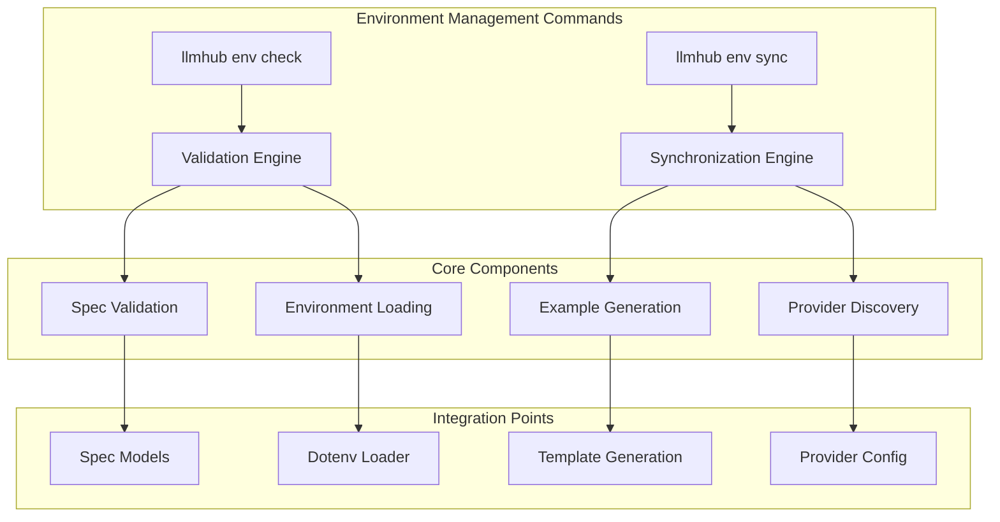
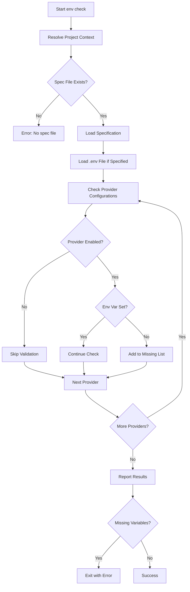
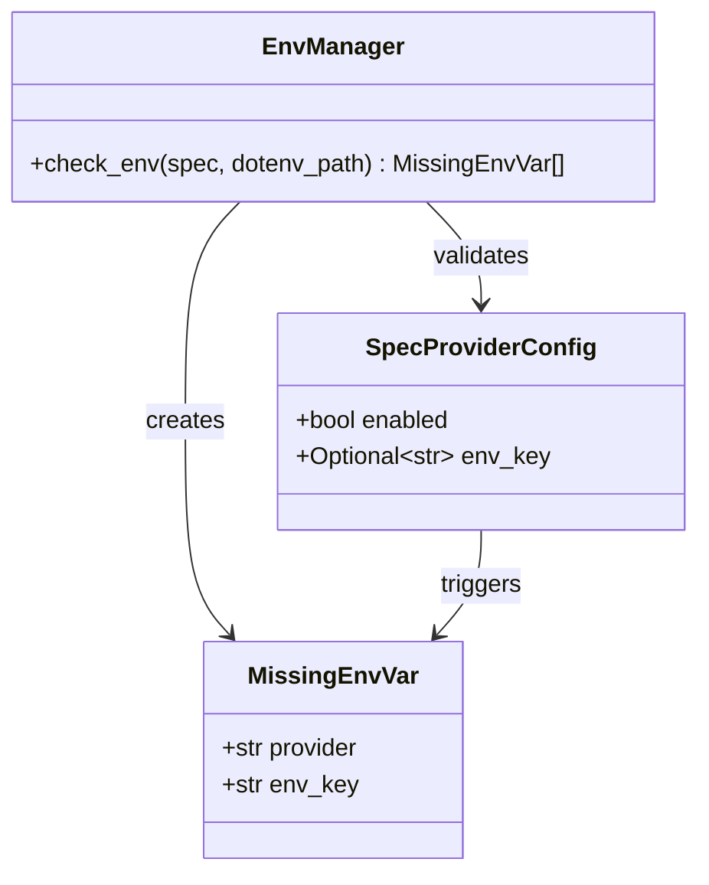
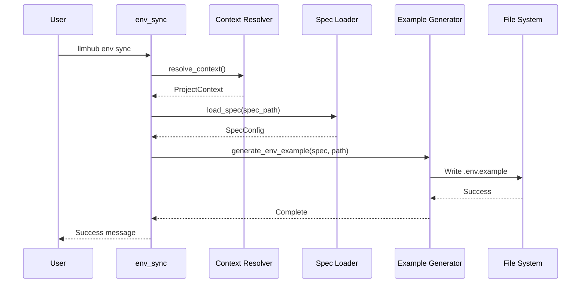
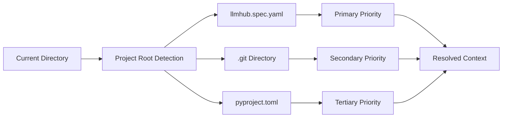
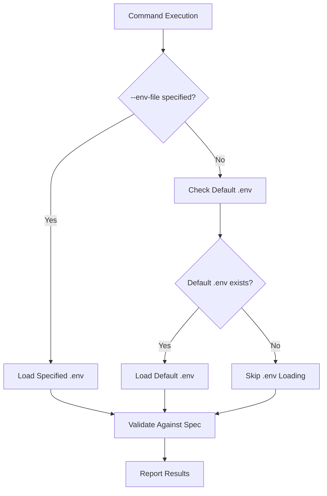
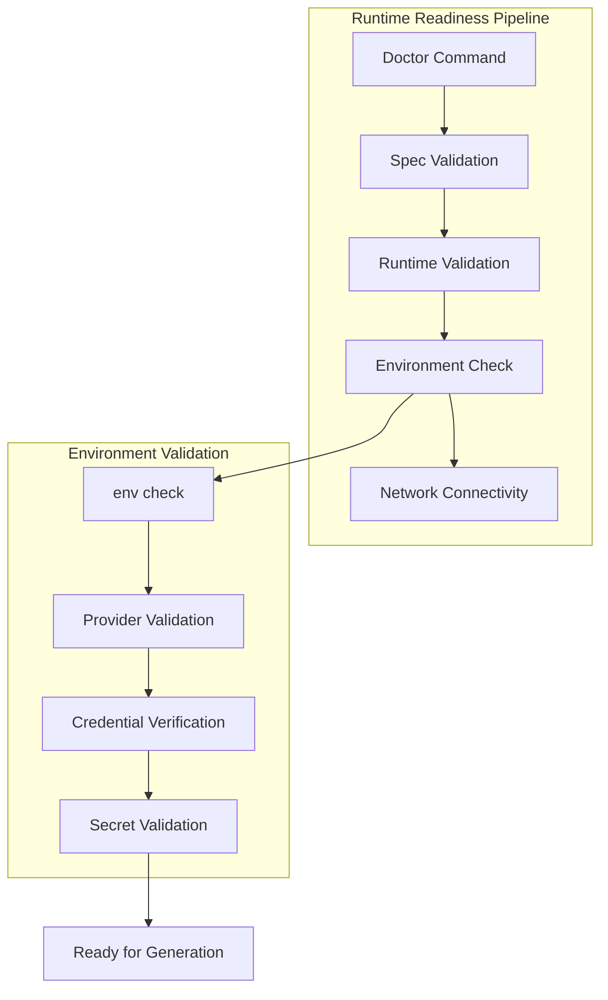
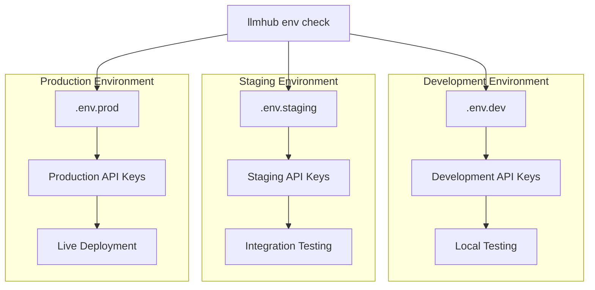
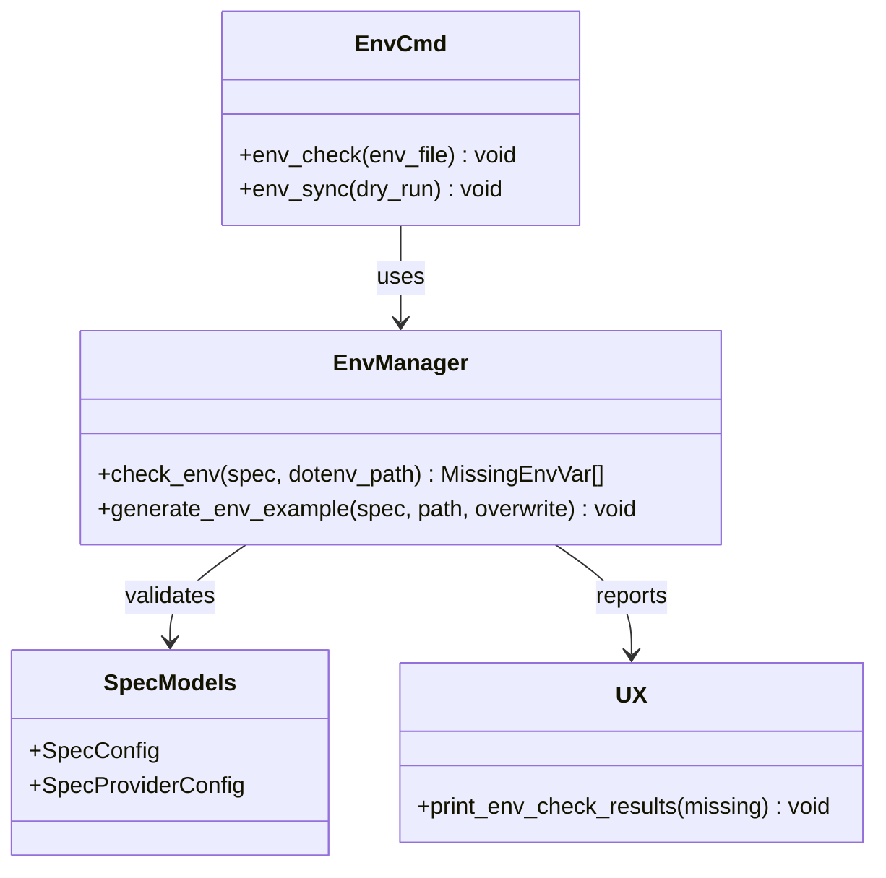
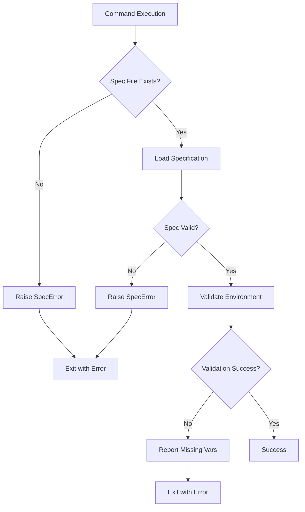

# Environment Management Commands

<cite>
**Referenced Files in This Document**
- [env_cmd.py](file://packages/llmhub/src/llmhub/commands/env_cmd.py)
- [env_manager.py](file://packages/llmhub/src/llmhub/env_manager.py)
- [ux.py](file://packages/llmhub/src/llmhub/ux.py)
- [spec_models.py](file://packages/llmhub/src/llmhub/spec_models.py)
- [cli.py](file://packages/llmhub/src/llmhub/cli.py)
- [context.py](file://packages/llmhub/src/llmhub/context.py)
- [test_env_manager.py](file://packages/llmhub/tests/test_env_manager.py)
- [test_cmd.py](file://packages/llmhub/src/llmhub/commands/test_cmd.py)
</cite>

## Table of Contents
1. [Introduction](#introduction)
2. [Command Overview](#command-overview)
3. [Environment Validation (`env check`)](#environment-validation-env-check)
4. [Environment Synchronization (`env sync`)](#environment-synchronization-env-sync)
5. [Integration with Environment-Specific Configuration](#integration-with-environment-specific-configuration)
6. [Security and Runtime Readiness](#security-and-runtime-readiness)
7. [Common Misconfigurations and Resolution](#common-misconfigurations-and-resolution)
8. [Multi-Environment Workflows](#multi-environment-workflows)
9. [Implementation Details](#implementation-details)
10. [Best Practices](#best-practices)

## Introduction

The LLMHub environment management commands provide essential functionality for maintaining secure, validated, and synchronized configuration across different development contexts. These commands ensure runtime readiness by validating required environment variables against the current specification and assisting in the synchronization of environment configurations across various environments.

The environment management system consists of two primary commands: `env check` for validation and `env sync` for synchronization. Both commands integrate deeply with the LLMHub specification system to provide comprehensive environment configuration management.

## Command Overview

The environment management commands are organized under the `llmhub env` namespace and provide complementary functionality for environment configuration management:



**Diagram sources**
- [env_cmd.py](file://packages/llmhub/src/llmhub/commands/env_cmd.py#L12-L81)
- [env_manager.py](file://packages/llmhub/src/llmhub/env_manager.py#L46-L72)

**Section sources**
- [cli.py](file://packages/llmhub/src/llmhub/cli.py#L31-L35)
- [env_cmd.py](file://packages/llmhub/src/llmhub/commands/env_cmd.py#L1-L81)

## Environment Validation (`env check`)

The `env check` command performs comprehensive validation of required environment variables against the current specification, ensuring runtime readiness before generation or execution.

### Command Syntax and Options

```bash
llmhub env check [OPTIONS]
```

**Options:**
- `--env-file TEXT`: Path to specific .env file to load (optional)

### Validation Process

The validation process follows a systematic approach to ensure all required environment variables are properly configured:



**Diagram sources**
- [env_cmd.py](file://packages/llmhub/src/llmhub/commands/env_cmd.py#L44-L80)
- [env_manager.py](file://packages/llmhub/src/llmhub/env_manager.py#L46-L71)

### Output Interpretation

The `env check` command provides structured output indicating the status of environment variable validation:

**Successful Validation:**
```
✓ All required environment variables are set
```

**Missing Variables:**
```
✗ Missing 2 environment variable(s):

  • OPENAI_API_KEY (for openai)
  • ANTHROPIC_API_KEY (for anthropic)
```

**With Loaded Environment:**
```
Loaded environment from /path/to/.env
✓ All required environment variables are set
```

### Integration with Provider Configuration

The validation system integrates with the provider configuration model to ensure only enabled providers are checked:



**Diagram sources**
- [env_manager.py](file://packages/llmhub/src/llmhub/env_manager.py#L9-L13)
- [spec_models.py](file://packages/llmhub/src/llmhub/spec_models.py#L30-L34)

**Section sources**
- [env_cmd.py](file://packages/llmhub/src/llmhub/commands/env_cmd.py#L44-L80)
- [env_manager.py](file://packages/llmhub/src/llmhub/env_manager.py#L46-L71)
- [ux.py](file://packages/llmhub/src/llmhub/ux.py#L97-L106)

## Environment Synchronization (`env sync`)

The `env sync` command assists in synchronizing environment variables across different contexts by generating or updating `.env.example` files based on the current specification.

### Command Syntax and Options

```bash
llmhub env sync [OPTIONS]
```

**Options:**
- `--dry-run`: Show what would be written without writing to file

### Synchronization Process

The synchronization process generates `.env.example` files that serve as templates for environment configuration:



**Diagram sources**
- [env_cmd.py](file://packages/llmhub/src/llmhub/commands/env_cmd.py#L12-L42)
- [env_manager.py](file://packages/llmhub/src/llmhub/env_manager.py#L15-L44)

### Dry Run Mode

The dry run mode allows previewing the generated content without modification:

**Dry Run Output:**
```
.env.example content (dry-run):

# LLMHub generated .env.example for project: my-project (env: dev)

# OpenAI API key
OPENAI_API_KEY=

# Anthropic API key
ANTHROPIC_API_KEY=
```

### Template Generation

The synchronization system generates structured templates with comments and placeholders:

**Generated .env.example Content:**
```
# LLMHub generated .env.example for project: my-project (env: dev)

# OpenAI API key
OPENAI_API_KEY=

# Anthropic API key
ANTHROPIC_API_KEY=

# Custom provider API key
CUSTOM_PROVIDER_API_KEY=
```

**Section sources**
- [env_cmd.py](file://packages/llmhub/src/llmhub/commands/env_cmd.py#L12-L42)
- [env_manager.py](file://packages/llmhub/src/llmhub/env_manager.py#L15-L44)

## Integration with Environment-Specific Configuration

The environment management commands integrate seamlessly with LLMHub's environment-specific configuration system, providing context-aware validation and synchronization.

### Context Resolution

The system resolves project context to determine appropriate paths and configurations:



**Diagram sources**
- [context.py](file://packages/llmhub/src/llmhub/context.py#L27-L46)

### Path Resolution

The context system automatically determines appropriate paths for configuration files:

| Configuration Type | Default Path | Override Option |
|-------------------|--------------|-----------------|
| Spec File | `llmhub.spec.yaml` | `--spec-path` |
| Runtime Config | `llmhub.yaml` | `--runtime-path` |
| Env Example | `.env.example` | `--env-example-path` |

### Environment Loading

Both commands support loading environment variables from `.env` files:



**Diagram sources**
- [env_cmd.py](file://packages/llmhub/src/llmhub/commands/env_cmd.py#L57-L66)

**Section sources**
- [context.py](file://packages/llmhub/src/llmhub/context.py#L49-L90)
- [env_cmd.py](file://packages/llmhub/src/llmhub/commands/env_cmd.py#L57-L66)

## Security and Runtime Readiness

The environment management commands ensure runtime readiness by verifying secrets and provider credentials before generation or execution.

### Security Validation

The validation system ensures security by:

1. **Provider Verification**: Only enabled providers are checked
2. **Credential Validation**: Environment variables are verified against specification
3. **Access Control**: Disabled providers are excluded from validation
4. **Error Reporting**: Clear indication of missing or invalid credentials

### Runtime Readiness Checks

The commands integrate with broader runtime readiness validation:



**Diagram sources**
- [test_cmd.py](file://packages/llmhub/src/llmhub/commands/test_cmd.py#L125-L197)

### Error Handling and Exit Codes

The commands provide structured error handling with appropriate exit codes:

| Scenario | Exit Code | Message |
|----------|-----------|---------|
| Missing spec file | 1 | "No spec file found" |
| Spec validation error | 1 | "Spec error: ..." |
| Missing environment variables | 1 | "Set missing variables" |
| Successful validation | 0 | "All variables set" |

**Section sources**
- [env_cmd.py](file://packages/llmhub/src/llmhub/commands/env_cmd.py#L50-L80)
- [test_cmd.py](file://packages/llmhub/src/llmhub/commands/test_cmd.py#L165-L182)

## Common Misconfigurations and Resolution

Understanding common environment misconfigurations helps developers quickly resolve issues and maintain proper setup.

### Typical Environment Issues

**Missing API Keys:**
```
✗ Missing 2 environment variable(s):

  • OPENAI_API_KEY (for openai)
  • ANTHROPIC_API_KEY (for anthropic)
```

**Disabled Provider Still Required:**
```
✗ Missing 1 environment variable(s):

  • DISABLED_PROVIDER_KEY (for disabled-provider)
```

**Environment File Not Loaded:**
```
✗ Missing 1 environment variable(s):

  • CUSTOM_ENV_VAR (for custom)
```

### Resolution Strategies

**Using .env File:**
1. Create `.env` file in project root
2. Add required environment variables
3. Run `llmhub env check` to verify

**Setting Environment Variables:**
1. Export variables in shell:
   ```bash
   export OPENAI_API_KEY="your-api-key"
   ```
2. Run validation command

**Using Specific .env File:**
```bash
llmhub env check --env-file ./config/dev.env
```

### Automated Resolution with `env sync`

The `env sync` command provides automated resolution by generating template files:

```bash
# Generate .env.example template
llmhub env sync

# Preview changes without applying
llmhub env sync --dry-run
```

**Section sources**
- [test_env_manager.py](file://packages/llmhub/tests/test_env_manager.py#L53-L139)
- [env_cmd.py](file://packages/llmhub/src/llmhub/commands/env_cmd.py#L74-L76)

## Multi-Environment Workflows

The environment management commands support sophisticated multi-environment workflows for development, staging, and production deployments.

### Environment Separation

Different environments can be managed through separate configuration approaches:



### Workflow Integration

The commands integrate with CI/CD pipelines and deployment workflows:

**CI/CD Pipeline Example:**
```yaml
stages:
  - validate
  - build
  - deploy

validate_environment:
  script:
    - llmhub env check --env-file .env.$ENVIRONMENT
    - llmhub spec validate
    - llmhub doctor
```

### Environment-Specific Validation

Different validation strategies can be applied based on environment:

**Development Validation:**
```bash
# Allow missing optional providers
llmhub env check --env-file .env.dev
```

**Production Validation:**
```bash
# Strict validation for production
llmhub env check --env-file .env.prod
```

**Section sources**
- [env_cmd.py](file://packages/llmhub/src/llmhub/commands/env_cmd.py#L44-L80)
- [test_cmd.py](file://packages/llmhub/src/llmhub/commands/test_cmd.py#L125-L197)

## Implementation Details

The environment management system is built on robust implementation patterns that ensure reliability and extensibility.

### Core Architecture



**Diagram sources**
- [env_cmd.py](file://packages/llmhub/src/llmhub/commands/env_cmd.py#L1-L81)
- [env_manager.py](file://packages/llmhub/src/llmhub/env_manager.py#L1-L72)
- [ux.py](file://packages/llmhub/src/llmhub/ux.py#L97-L106)

### Validation Logic

The validation logic implements comprehensive checks against role requirements and provider configurations:

**Key Validation Features:**
- **Provider Filtering**: Only enabled providers are validated
- **Environment Variable Checking**: Direct OS environment variable verification
- **Dotenv Integration**: Optional loading of environment files
- **Structured Reporting**: Detailed missing variable reporting

### Error Handling Patterns

The system implements consistent error handling patterns:



**Diagram sources**
- [env_cmd.py](file://packages/llmhub/src/llmhub/commands/env_cmd.py#L50-L80)

**Section sources**
- [env_manager.py](file://packages/llmhub/src/llmhub/env_manager.py#L46-L71)
- [spec_models.py](file://packages/llmhub/src/llmhub/spec_models.py#L30-L34)

## Best Practices

Effective use of environment management commands requires adherence to established best practices.

### Configuration Management

**1. Use .env.example Templates:**
```bash
# Generate fresh template
llmhub env sync

# Review before committing
git diff .env.example
```

**2. Environment-Specific Files:**
```bash
# Development
llmhub env check --env-file .env.dev

# Production
llmhub env check --env-file .env.prod
```

**3. Continuous Validation:**
```bash
# Add to pre-commit hooks
echo "llmhub env check" >> .git/hooks/pre-commit
```

### Security Considerations

**1. Never Commit Secrets:**
- Add `.env*` files to `.gitignore`
- Use environment variables in production
- Validate environment loading in CI/CD

**2. Least Privilege Access:**
- Enable only required providers
- Use environment-specific keys
- Regular credential rotation

**3. Validation Integration:**
```bash
# Comprehensive health check
llmhub doctor

# Individual validation
llmhub env check && llmhub spec validate
```

### Development Workflow

**1. Initial Setup:**
```bash
# Initialize project
llmhub init

# Generate environment template
llmhub env sync

# Configure environment
cp .env.example .env
# Edit .env with actual values
```

**2. Team Collaboration:**
```bash
# Share template, not secrets
git add .env.example
git commit -m "Update environment template"

# Document required environment variables
# in README.md
```

**3. Deployment Preparation:**
```bash
# Validate before deployment
llmhub env check --env-file .env.production

# Generate deployment artifacts
llmhub generate
```

These best practices ensure secure, reliable, and maintainable environment configuration management throughout the development lifecycle.