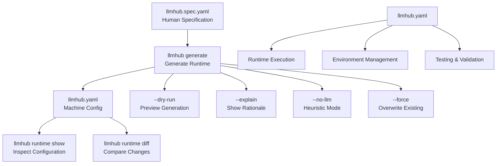
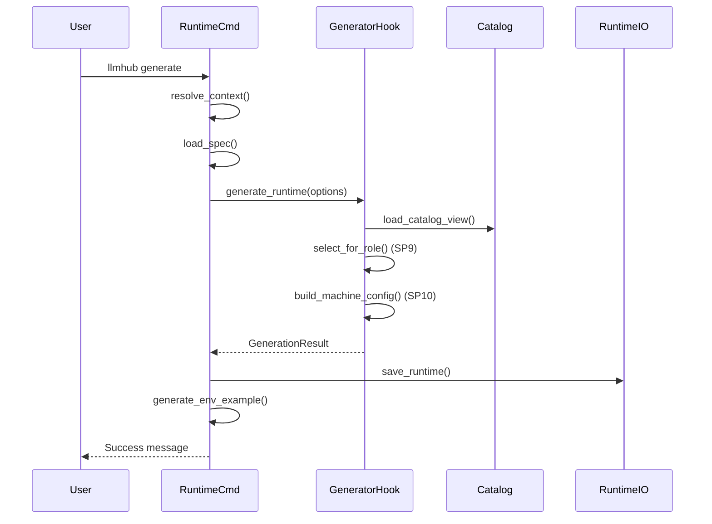
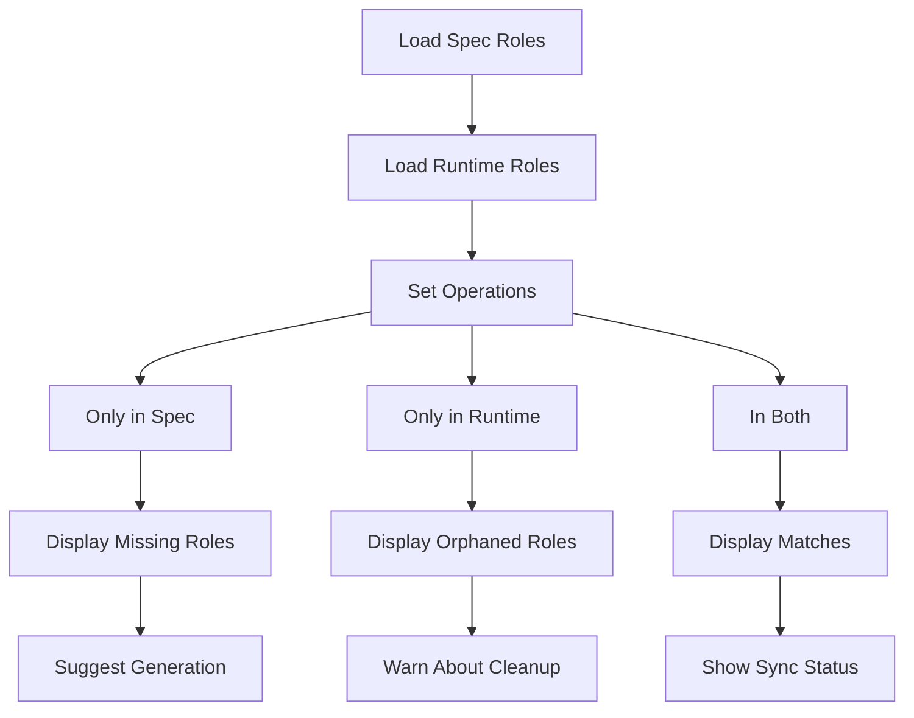
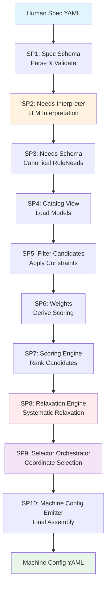
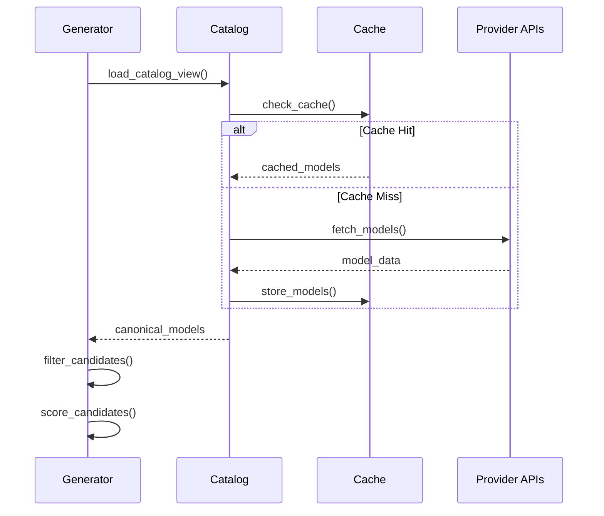

# Runtime Generation Commands

<cite>
**Referenced Files in This Document**
- [runtime_cmd.py](file://packages/llmhub/src/llmhub/commands/runtime_cmd.py)
- [generator_hook.py](file://packages/llmhub/src/llmhub/generator_hook.py)
- [generator/__init__.py](file://packages/llmhub/src/llmhub/generator/__init__.py)
- [spec.md](file://packages/llmhub/src/llmhub/generator/spec.md)
- [cli.py](file://packages/llmhub/src/llmhub/cli.py)
- [context.py](file://packages/llmhub/src/llmhub/context.py)
- [runtime_io.py](file://packages/llmhub/src/llmhub/runtime_io.py)
- [test_generate_e2e.py](file://packages/llmhub/tests/generator/test_generate_e2e.py)
</cite>

## Table of Contents
1. [Introduction](#introduction)
2. [Command Overview](#command-overview)
3. [Generate Command](#generate-command)
4. [Runtime Show Command](#runtime-show-command)
5. [Runtime Diff Command](#runtime-diff-command)
6. [Generator Pipeline Architecture](#generator-pipeline-architecture)
7. [Special Flags and Options](#special-flags-and-options)
8. [Usage Examples](#usage-examples)
9. [Common Issues and Debugging](#common-issues-and-debugging)
10. [Integration with Catalog System](#integration-with-catalog-system)

## Introduction

The LLMHub runtime configuration commands provide a powerful workflow for converting human-written specifications into machine-readable runtime configurations. These commands form the core of the LLMHub CLI, enabling developers to transform `llmhub.spec.yaml` specifications into optimized `llmhub.yaml` configurations that the runtime can execute.

The three primary commands are:
- `llmhub generate`: The main command that executes the 10-step generator pipeline
- `llmhub runtime show`: Inspects and displays generated runtime configurations
- `llmhub runtime diff`: Compares differences between spec and runtime configurations

These commands work together to provide a complete development workflow from specification authoring to runtime deployment, with built-in debugging capabilities and validation features.

## Command Overview



**Diagram sources**
- [runtime_cmd.py](file://packages/llmhub/src/llmhub/commands/runtime_cmd.py#L13-L156)
- [cli.py](file://packages/llmhub/src/llmhub/cli.py#L25-L29)

**Section sources**
- [runtime_cmd.py](file://packages/llmhub/src/llmhub/commands/runtime_cmd.py#L1-L156)
- [cli.py](file://packages/llmhub/src/llmhub/cli.py#L1-L67)

## Generate Command

The `generate` command is the core of the runtime configuration workflow, executing a sophisticated 10-step generator pipeline to produce `llmhub.yaml` from `llmhub.spec.yaml`.

### Command Signature and Options

```bash
llmhub generate [OPTIONS]
```

**Available Options:**
- `--dry-run`: Preview generation without writing to disk
- `--no-llm`: Use heuristic-only mode without LLM assistance
- `--force`: Overwrite existing runtime without confirmation
- `--explain`: Show detailed rationale for model selections

### Core Functionality

The generate command orchestrates the complete transformation process:



**Diagram sources**
- [runtime_cmd.py](file://packages/llmhub/src/llmhub/commands/runtime_cmd.py#L13-L75)
- [generator_hook.py](file://packages/llmhub/src/llmhub/generator_hook.py#L132-L204)

### Pipeline Execution

The generate command triggers the full generator pipeline (SP1-SP10):

1. **SP1 - Spec Schema**: Parse and validate human spec YAML
2. **SP2 - Needs Interpreter**: Convert spec to canonical RoleNeeds using LLM
3. **SP3 - Needs Schema**: Define RoleNeed data model
4. **SP4 - Catalog View**: Load available models from catalog
5. **SP5 - Filter Candidates**: Apply hard constraints
6. **SP6 - Weights**: Derive scoring weights from preferences
7. **SP7 - Scoring Engine**: Score and rank filtered candidates
8. **SP8 - Relaxation Engine**: Systematically relax constraints if needed
9. **SP9 - Selector Orchestrator**: Coordinate model selection for each role
10. **SP10 - Machine Config Emitter**: Assemble final machine config

**Section sources**
- [runtime_cmd.py](file://packages/llmhub/src/llmhub/commands/runtime_cmd.py#L13-L75)
- [generator/__init__.py](file://packages/llmhub/src/llmhub/generator/__init__.py#L52-L117)
- [spec.md](file://packages/llmhub/src/llmhub/generator/spec.md#L28-L56)

## Runtime Show Command

The `runtime show` command provides a human-readable inspection of generated runtime configurations, displaying project metadata, providers, and role assignments.

### Command Signature

```bash
llmhub runtime show
```

### Output Format

The command displays:
- Project name and environment
- Enabled providers with their environment variables
- Role configurations with provider, model, and mode information
- Parameter settings for each role

### Usage Pattern

```bash
# Basic inspection
llmhub runtime show

# Combined with other commands
llmhub runtime show && echo "Review configuration above"
```

**Section sources**
- [runtime_cmd.py](file://packages/llmhub/src/llmhub/commands/runtime_cmd.py#L78-L97)

## Runtime Diff Command

The `runtime diff` command provides a high-level comparison between spec roles and runtime roles, helping users understand what has been generated and what remains to be processed.

### Command Signature

```bash
llmhub runtime diff
```

### Comparison Logic

The diff command performs role-level comparison:



**Diagram sources**
- [runtime_cmd.py](file://packages/llmhub/src/llmhub/commands/runtime_cmd.py#L99-L156)

### Output Categories

The diff command categorizes role differences:

- **Roles in spec but not in runtime**: Roles that need to be generated
- **Roles in runtime but not in spec**: Orphaned roles that may need cleanup
- **Roles in both**: Successfully synchronized roles with provider/model information

### Usage Examples

```bash
# Check synchronization status
llmhub runtime diff

# Use in CI/CD pipelines
llmhub runtime diff || echo "Please run 'llmhub generate'"
```

**Section sources**
- [runtime_cmd.py](file://packages/llmhub/src/llmhub/commands/runtime_cmd.py#L99-L156)

## Generator Pipeline Architecture

The generator pipeline follows a modular, step-by-step approach with clear boundaries between subproblems (SP1-SP10).

### Pipeline Stages



**Diagram sources**
- [spec.md](file://packages/llmhub/src/llmhub/generator/spec.md#L28-L56)
- [generator/__init__.py](file://packages/llmhub/src/llmhub/generator/__init__.py#L52-L117)

### Key Pipeline Features

- **Deterministic**: Same spec + catalog → same machine config
- **Pure functions**: No side effects except file I/O in SP1 and SP10
- **Forward compatible**: New fields must not break existing code
- **Modular design**: Each step handles specific concerns

**Section sources**
- [spec.md](file://packages/llmhub/src/llmhub/generator/spec.md#L28-L63)
- [generator/__init__.py](file://packages/llmhub/src/llmhub/generator/__init__.py#L52-L117)

## Special Flags and Options

### Dry Run Mode (`--dry-run`)

Dry run mode allows previewing generation without modifying files:

```bash
llmhub generate --dry-run
```

**Behavior:**
- Loads spec and generates runtime configuration
- Displays proposed runtime in human-readable format
- Shows model selection explanations if `--explain` is used
- Does not write to disk or update `.env.example`

### Explain Mode (`--explain`)

Explain mode provides detailed rationale for model selections:

```bash
llmhub generate --explain
```

**Output includes:**
- Role-specific selection criteria
- Quality/cost/latency trade-offs
- Provider/model combinations chosen
- Relaxation steps applied (if any)

### No-LLM Mode (`--no-llm`)

No-LLM mode uses heuristic-only selection without LLM assistance:

```bash
llmhub generate --no-llm
```

**Use cases:**
- Offline development
- Testing without API calls
- Faster iteration during development
- Avoiding LLM costs

### Force Mode (`--force`)

Force mode bypasses confirmation prompts:

```bash
llmhub generate --force
```

**Behavior:**
- Overwrites existing `llmhub.yaml` without confirmation
- Useful for automated environments
- May lose manual customizations

**Section sources**
- [runtime_cmd.py](file://packages/llmhub/src/llmhub/commands/runtime_cmd.py#L13-L75)
- [generator_hook.py](file://packages/llmhub/src/llmhub/generator_hook.py#L132-L204)

## Usage Examples

### Basic Generation Workflow

```bash
# Initialize project (if needed)
llmhub init

# Generate initial runtime
llmhub generate

# Review generated configuration
llmhub runtime show

# Test the configuration
llmhub test --role llm.inference --prompt "Hello, world!"

# Check for updates
llmhub runtime diff
```

### Advanced Generation Scenarios

```bash
# Preview changes without committing
llmhub generate --dry-run --explain

# Generate with heuristic-only mode
llmhub generate --no-llm --force

# Force regeneration after changes
llmhub generate --force

# Interactive generation with explanations
llmhub generate --explain
```

### Integration Patterns

```bash
# CI/CD pipeline integration
llmhub runtime diff || exit 1
llmhub generate --force
llmhub test --role llm.inference --prompt "Test"

# Development workflow
llmhub generate --dry-run && echo "Review changes" || echo "Fix spec first"
llmhub generate --explain
```

**Section sources**
- [test_generate_e2e.py](file://packages/llmhub/tests/generator/test_generate_e2e.py#L16-L150)

## Common Issues and Debugging

### Generation Failures

**Problem**: Generation fails with unclear error messages

**Debugging Steps:**
1. Check spec validity: `llmhub spec validate`
2. Verify environment variables: `llmhub env check`
3. Use explain mode: `llmhub generate --explain`
4. Try heuristic mode: `llmhub generate --no-llm`

**Common Causes:**
- Invalid YAML syntax in spec file
- Missing required environment variables
- Network connectivity issues with LLM providers
- Insufficient model availability in catalog

### Unexpected Model Selections

**Problem**: Generated configuration selects unexpected models

**Debugging Strategies:**
```bash
# Enable explain mode to understand decisions
llmhub generate --explain

# Use dry-run to preview without changes
llmhub generate --dry-run

# Check provider availability
llmhub catalog show

# Review role preferences in spec
llmhub spec show
```

### Environment Issues

**Problem**: Runtime configuration works locally but fails in production

**Solution Approach:**
```bash
# Compare environments
llmhub env check

# Generate fresh .env.example
llmhub env sync

# Verify all required variables are set
export $(cat .env.example | xargs) && llmhub test
```

### Performance Issues

**Problem**: Generation takes too long or times out

**Optimization Strategies:**
```bash
# Use heuristic mode for faster generation
llmhub generate --no-llm

# Limit provider scope in spec
# Reduce role count temporarily
# Check network connectivity
```

**Section sources**
- [runtime_cmd.py](file://packages/llmhub/src/llmhub/commands/runtime_cmd.py#L70-L75)
- [runtime_io.py](file://packages/llmhub/src/llmhub/runtime_io.py#L11-L34)

## Integration with Catalog System

The runtime commands integrate deeply with the catalog system to provide up-to-date model information and selection capabilities.

### Catalog Loading Process



**Diagram sources**
- [generator_hook.py](file://packages/llmhub/src/llmhub/generator_hook.py#L132-L204)

### Provider Configuration

The runtime commands automatically update environment examples when providers change:

```bash
# Automatic .env.example updates
llmhub generate
llmhub env sync  # Explicit refresh
```

### Model Availability

The commands respect provider enable/disable settings and handle unavailable models gracefully:

- Disabled providers are excluded from selection
- Fallback mechanisms for unavailable models
- Clear error messages for missing providers

**Section sources**
- [runtime_cmd.py](file://packages/llmhub/src/llmhub/commands/runtime_cmd.py#L56-L58)
- [context.py](file://packages/llmhub/src/llmhub/context.py#L27-L46)