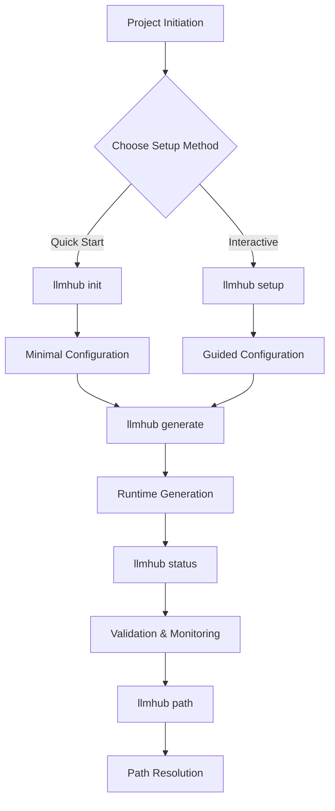
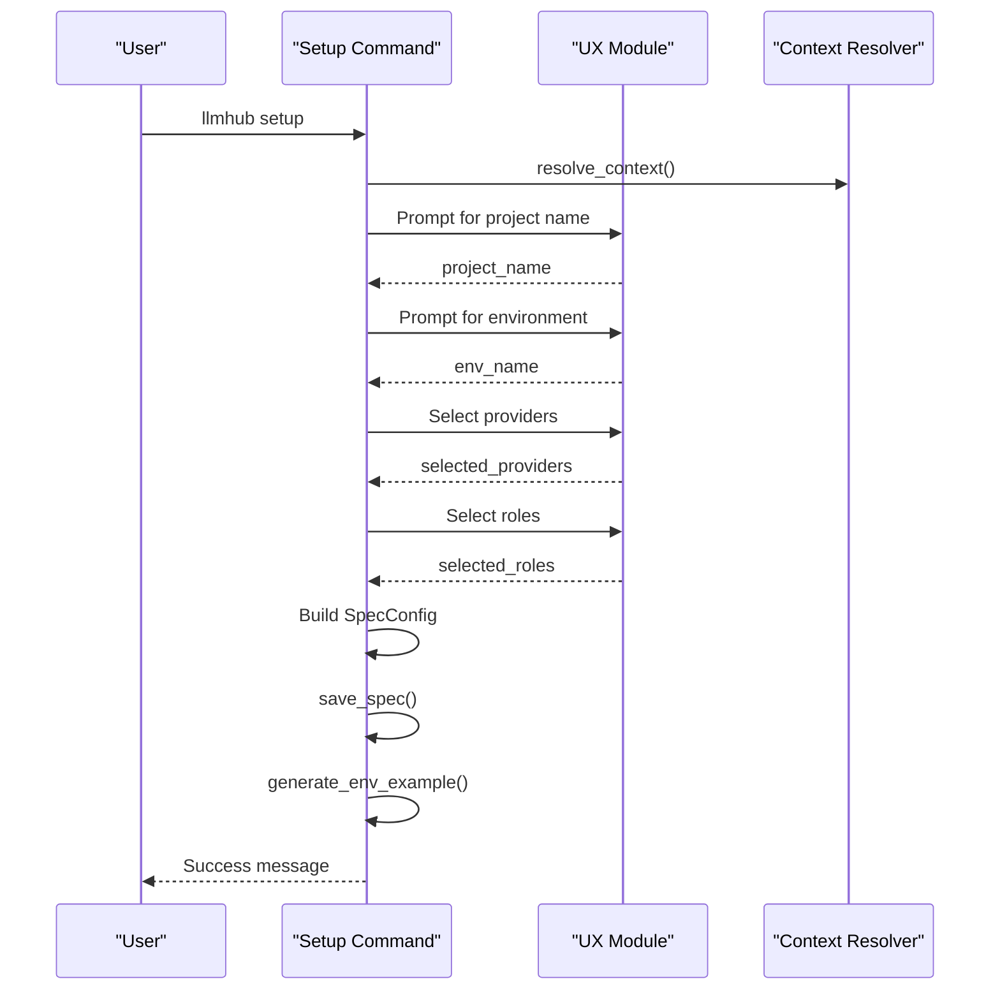
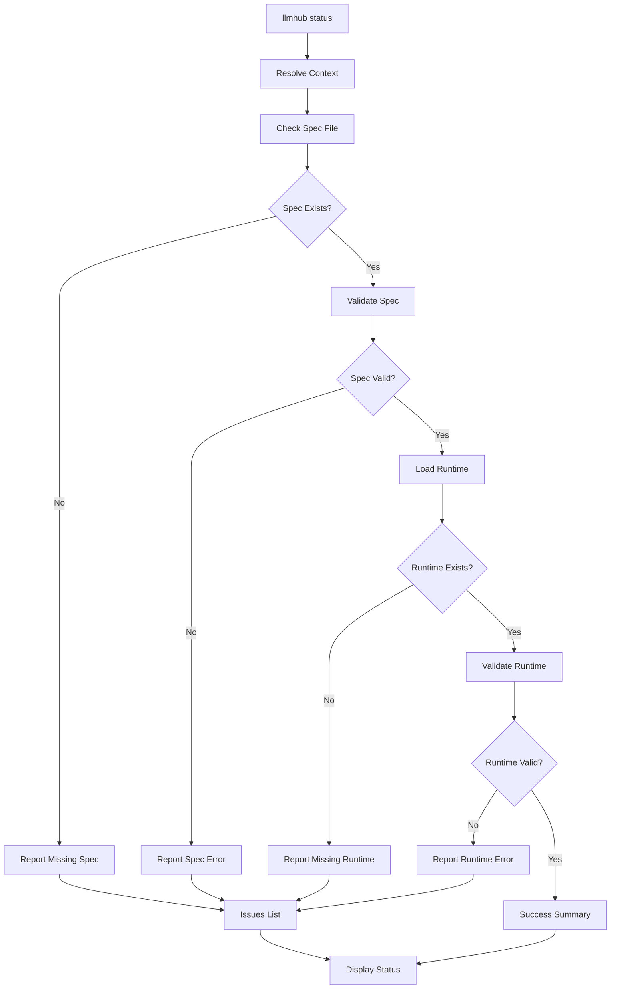
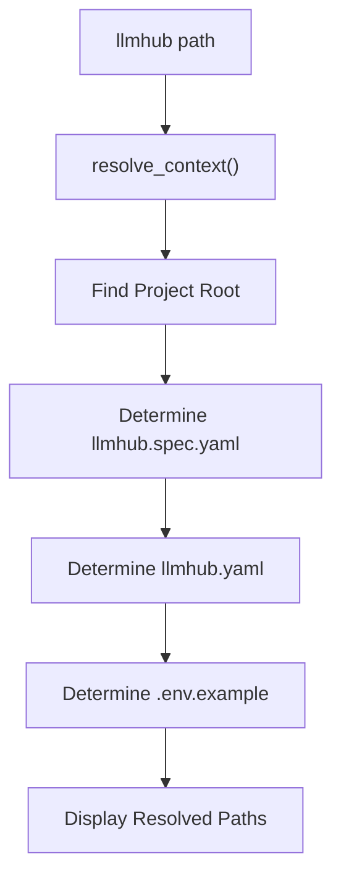
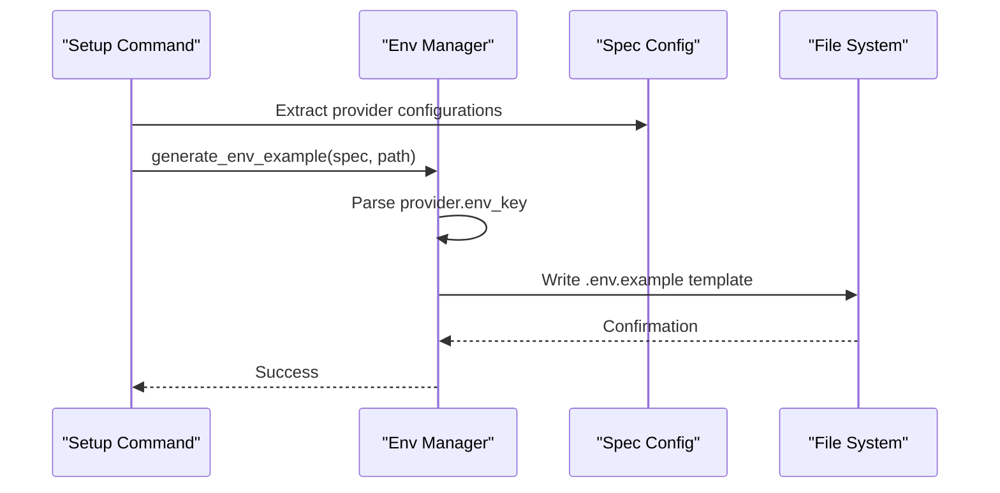
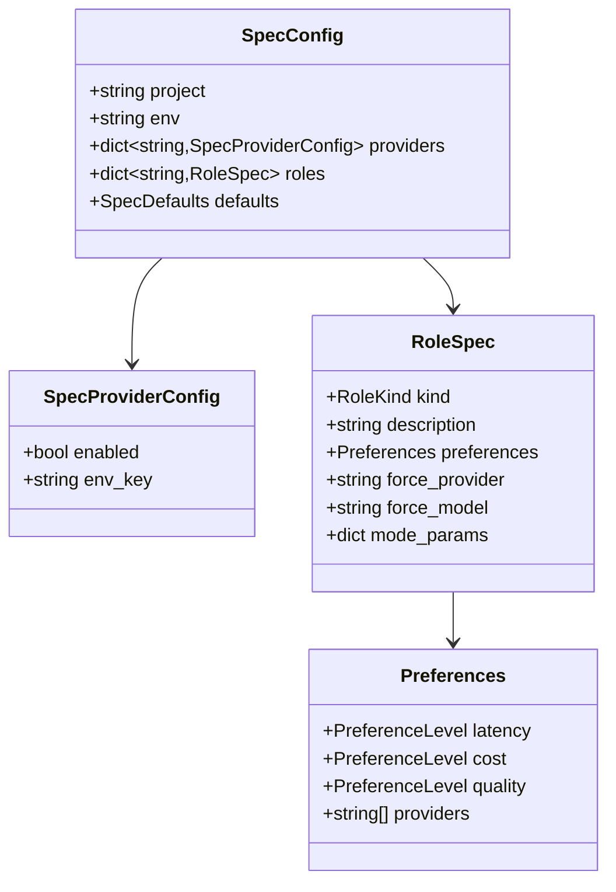
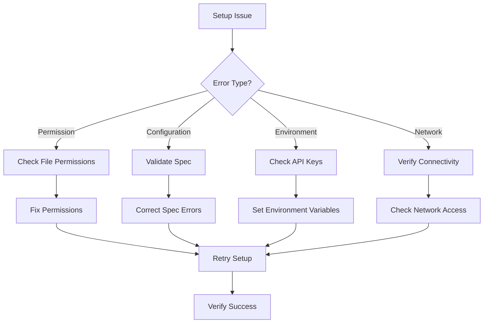

# Setup Commands

<cite>
**Referenced Files in This Document**
- [setup_cmd.py](file://packages/llmhub/src/llmhub/commands/setup_cmd.py)
- [cli.py](file://packages/llmhub/src/llmhub/cli.py)
- [context.py](file://packages/llmhub/src/llmhub/context.py)
- [spec_models.py](file://packages/llmhub/src/llmhub/spec_models.py)
- [ux.py](file://packages/llmhub/src/llmhub/ux.py)
- [env_manager.py](file://packages/llmhub/src/llmhub/env_manager.py)
- [runtime_io.py](file://packages/llmhub/src/llmhub/runtime_io.py)
- [README.md](file://packages/llmhub/README.md)
</cite>

## Table of Contents
1. [Introduction](#introduction)
2. [Command Overview](#command-overview)
3. [Init Command](#init-command)
4. [Setup Command](#setup-command)
5. [Status Command](#status-command)
6. [Path Command](#path-command)
7. [Integration with Environment Manager](#integration-with-environment-manager)
8. [Configuration System Interaction](#configuration-system-interaction)
9. [Common Issues and Troubleshooting](#common-issues-and-troubleshooting)
10. [Best Practices](#best-practices)

## Introduction

The LLMHub CLI provides four essential setup commands that form the foundation of project bootstrapping and environment initialization. These commands work together to establish the initial configuration structure, validate project state, and provide path resolution for the LLMHub ecosystem. Each command serves a specific purpose in the workflow from project initialization to ongoing maintenance.

The setup commands integrate deeply with the broader generator pipeline and runtime configuration process, ensuring that projects are properly configured from the ground up and maintained consistently throughout their lifecycle.

## Command Overview

The setup commands consist of four primary functions, each designed for specific scenarios in project initialization and maintenance:



**Diagram sources**
- [setup_cmd.py](file://packages/llmhub/src/llmhub/commands/setup_cmd.py#L16-L215)
- [cli.py](file://packages/llmhub/src/llmhub/cli.py#L6-L10)

## Init Command

The `init` command provides a non-interactive, quick-start solution for creating minimal LLMHub configurations. It's designed for developers who want immediate setup without guided questioning.

### Purpose and Use Cases

The `init` command serves as the fastest way to bootstrap an LLMHub project with sensible defaults. It's ideal for:

- Rapid prototyping and experimentation
- CI/CD pipeline automation
- Automated deployment scenarios
- Quick project initialization where interactive guidance isn't needed

### Usage Syntax

```bash
llmhub init
```

### Implementation Details

The `init` command creates a minimal `SpecConfig` with the following characteristics:

| Component | Value | Description |
|-----------|-------|-------------|
| Project Name | Current directory name | Derived from filesystem |
| Environment | `dev` | Default development environment |
| Provider | OpenAI only | Enabled with `OPENAI_API_KEY` |
| Role | `llm.inference` | Main reasoning model role |
| Preferences | Medium cost, medium latency, high quality | Balanced configuration |

### Generated Files

Upon successful execution, `init` produces two key files:

1. **`llmhub.spec.yaml`** - Minimal specification file with basic configuration
2. **`.env.example`** - Template for environment variable configuration

### Real-World Example

```bash
# Initialize a new LLM project
$ cd my-llm-project
$ llmhub init
✓ Minimal spec created at llmhub.spec.yaml
✓ Environment example created at .env.example

Next steps:
  1. Edit llmhub.spec.yaml to add more roles
  2. Set OPENAI_API_KEY environment variable
  3. Run: llmhub generate
```

### Validation and Error Handling

The `init` command includes robust validation to prevent accidental overwrites:

- Checks if `llmhub.spec.yaml` already exists
- Prompts for confirmation before overwriting existing configurations
- Validates context resolution before proceeding
- Provides clear error messages for permission issues

**Section sources**
- [setup_cmd.py](file://packages/llmhub/src/llmhub/commands/setup_cmd.py#L121-L161)
- [context.py](file://packages/llmhub/src/llmhub/context.py#L49-L89)

## Setup Command

The `setup` command provides an interactive configuration wizard that guides users through creating comprehensive LLMHub specifications. It's designed for users who want detailed control over their project configuration.

### Purpose and Use Cases

The `setup` command is ideal for:

- New project development with specific requirements
- Teams requiring standardized configuration approaches
- Projects needing multiple providers and roles
- Educational scenarios where learning the configuration process is valuable

### Usage Syntax

```bash
llmhub setup
```

### Interactive Workflow

The setup wizard follows a structured interview process:



**Diagram sources**
- [setup_cmd.py](file://packages/llmhub/src/llmhub/commands/setup_cmd.py#L16-L118)
- [ux.py](file://packages/llmhub/src/llmhub/ux.py#L113-L159)

### Available Providers

The setup wizard offers selection from five major LLM providers:

| Provider | Environment Variable | Description |
|----------|---------------------|-------------|
| OpenAI | `OPENAI_API_KEY` | Primary provider with broad model support |
| Anthropic | `ANTHROPIC_API_KEY` | Claude models with strong reasoning capabilities |
| Gemini | `GEMINI_API_KEY` | Google's AI models with multimodal capabilities |
| Mistral | `MISTRAL_API_KEY` | Open-source focused with competitive pricing |
| Cohere | `COHERE_API_KEY` | Specialized for text generation tasks |

### Standard Roles Selection

Users can choose from four standard role categories:

| Role | Purpose | Typical Use Case |
|------|---------|------------------|
| `llm.preprocess` | Input normalization | Text cleaning, query rewriting |
| `llm.inference` | Main reasoning | Final answer generation |
| `llm.embedding` | Vector generation | Semantic search, similarity |
| `llm.tools` | Function calling | Tool integration, API calls |

### Role Configuration Process

For each selected role, the wizard collects:

1. **Description**: Purpose and intended use
2. **Cost Preference**: Low, medium, or high priority
3. **Latency Preference**: Response time requirements
4. **Quality Preference**: Accuracy and capability expectations

### Generated Configuration Structure

The resulting `llmhub.spec.yaml` includes:

```yaml
project: project-name
env: dev

providers:
  openai:
    enabled: true
    env_key: OPENAI_API_KEY
  anthropic:
    enabled: true
    env_key: ANTHROPIC_API_KEY

roles:
  llm.inference:
    kind: chat
    description: Main reasoning model for answers.
    preferences:
      cost: medium
      latency: medium
      quality: high
      providers: [openai, anthropic]

defaults:
  providers: [openai, anthropic]
```

### Next Steps Guidance

After completion, the setup wizard provides clear next steps:

1. Set environment variables in `.env` or export them
2. Run `llmhub generate` to create runtime configuration
3. Run `llmhub test` to validate the setup

**Section sources**
- [setup_cmd.py](file://packages/llmhub/src/llmhub/commands/setup_cmd.py#L16-L118)
- [ux.py](file://packages/llmhub/src/llmhub/ux.py#L113-L159)

## Status Command

The `status` command provides comprehensive project health monitoring and validation. It assesses the current state of the LLMHub project and identifies potential issues.

### Purpose and Use Cases

The `status` command serves multiple validation purposes:

- **Health Monitoring**: Continuous project health assessment
- **Troubleshooting**: Identifying configuration issues
- **Development Validation**: Ensuring proper setup during development
- **CI/CD Integration**: Automated validation in build pipelines

### Usage Syntax

```bash
llmhub status
```

### Validation Process

The status command performs multi-layered validation:



**Diagram sources**
- [setup_cmd.py](file://packages/llmhub/src/llmhub/commands/setup_cmd.py#L164-L195)

### Validation Results

The status command provides detailed feedback on:

| Component | Validation | Expected State |
|-----------|------------|----------------|
| Spec File | Existence and validity | Present and parseable |
| Runtime File | Existence and validity | Present after `generate` |
| Environment | Required variables | All keys set or documented |
| Roles | Count and configuration | Defined in spec |
| Providers | Availability | Configured and enabled |

### Error Reporting

The status command categorizes issues into meaningful groups:

1. **File System Issues**: Missing or inaccessible files
2. **Schema Validation**: Invalid YAML or model mismatches
3. **Configuration Issues**: Missing providers or roles
4. **Runtime Problems**: Generated configuration errors

### Output Format

Successful status displays include:

- Project context information
- File existence indicators (✓/✗)
- Role and provider counts
- Validation success indicators

Failed status displays include:

- Specific error messages
- Suggested corrective actions
- Links to relevant documentation

### Integration with CI/CD

The status command exits with appropriate codes for CI/CD integration:

- **Success (0)**: All validations pass
- **Failure (1)**: Configuration issues detected
- **Help (0)**: Help output shown

**Section sources**
- [setup_cmd.py](file://packages/llmhub/src/llmhub/commands/setup_cmd.py#L164-L195)
- [ux.py](file://packages/llmhub/src/llmhub/ux.py#L14-L32)

## Path Command

The `path` command reveals the resolved file paths used by LLMHub, providing transparency into the project's configuration structure.

### Purpose and Use Cases

The `path` command serves several informational purposes:

- **Debugging**: Understanding file locations
- **Scripting**: Automating file operations
- **Documentation**: Verifying configuration setup
- **Troubleshooting**: Locating configuration files

### Usage Syntax

```bash
llmhub path
```

### Path Resolution Process

The path command resolves project context using the same mechanism as other commands:



**Diagram sources**
- [context.py](file://packages/llmhub/src/llmhub/context.py#L49-L89)

### Resolved Path Types

The path command displays four key file locations:

| Path Type | Default Location | Purpose |
|-----------|------------------|---------|
| Root | Current directory | Project base directory |
| Spec | `llmhub.spec.yaml` | Human-friendly specification |
| Runtime | `llmhub.yaml` | Machine-optimized configuration |
| Env Example | `.env.example` | Environment variable template |

### Context Resolution Logic

The context resolver follows a priority-based approach:

1. **Primary**: Directory containing `llmhub.spec.yaml`
2. **Secondary**: Directory containing `.git` directory
3. **Fallback**: Directory containing `pyproject.toml`
4. **Last Resort**: Current working directory

### Output Format

The path command presents information in a clear, tabular format:

```
Resolved Paths:

Root:        /path/to/project
Spec:        /path/to/project/llmhub.spec.yaml
Runtime:     /path/to/project/llmhub.yaml
Env example: /path/to/project/.env.example
```

### Use Cases

Common scenarios for using the path command:

- **Verification**: Confirming correct file locations
- **Automation**: Scripting file operations
- **Debugging**: Tracing configuration issues
- **Documentation**: Recording project structure

**Section sources**
- [setup_cmd.py](file://packages/llmhub/src/llmhub/commands/setup_cmd.py#L198-L207)
- [context.py](file://packages/llmhub/src/llmhub/context.py#L49-L89)

## Integration with Environment Manager

The setup commands work closely with the environment manager to ensure proper configuration of API keys and environment variables.

### Environment File Generation

Both `init` and `setup` commands utilize the environment manager to create `.env.example` files:



**Diagram sources**
- [setup_cmd.py](file://packages/llmhub/src/llmhub/commands/setup_cmd.py#L111-L113)
- [env_manager.py](file://packages/llmhub/src/llmhub/env_manager.py#L14-L42)

### Template Generation Logic

The environment manager creates templates with:

- Project identification comments
- Provider-specific API key placeholders
- Clear documentation for each variable
- Consistent formatting and spacing

### Integration Points

The setup commands integrate with the environment manager at multiple points:

1. **Post-Setup**: Automatic `.env.example` generation
2. **Validation**: Environment variable checking
3. **Updates**: Syncing templates with spec changes

**Section sources**
- [env_manager.py](file://packages/llmhub/src/llmhub/env_manager.py#L14-L42)
- [setup_cmd.py](file://packages/llmhub/src/llmhub/commands/setup_cmd.py#L111-L113)

## Configuration System Interaction

The setup commands interact deeply with LLMHub's configuration system, working with the complete pipeline from specification to runtime generation.

### Specification Model Integration

All setup commands work with the `SpecConfig` model:



**Diagram sources**
- [spec_models.py](file://packages/llmhub/src/llmhub/spec_models.py#L59-L66)
- [spec_models.py](file://packages/llmhub/src/llmhub/spec_models.py#L30-L51)

### Runtime Generation Pipeline

The setup commands prepare the foundation for the runtime generation pipeline:

1. **Specification Creation**: Initial `llmhub.spec.yaml` creation
2. **Environment Setup**: API key configuration templates
3. **Validation Preparation**: Schema validation readiness
4. **Generation Readiness**: Complete configuration for `generate` command

### Context Resolution

All setup commands rely on the context resolution system:

- **Project Discovery**: Automatic root detection
- **Path Resolution**: Consistent file location
- **Override Support**: CLI flag flexibility
- **Error Handling**: Clear failure modes

**Section sources**
- [spec_models.py](file://packages/llmhub/src/llmhub/spec_models.py#L59-L66)
- [context.py](file://packages/llmhub/src/llmhub/context.py#L49-L89)

## Common Issues and Troubleshooting

Understanding common issues helps users effectively use the setup commands and resolve problems quickly.

### Permission and Access Issues

| Issue | Symptoms | Solution |
|-------|----------|----------|
| Write Permission Denied | Cannot create configuration files | Check directory permissions, run with elevated privileges |
| Read Permission Denied | Cannot access existing files | Verify file permissions, check ownership |
| Environment Variable Access | Cannot read API keys | Check environment variable visibility, shell configuration |

### File System Problems

| Issue | Cause | Resolution |
|-------|-------|------------|
| Spec File Already Exists | Running setup/init on existing project | Use `--force` flag or manually backup/replace |
| Missing Dependencies | Required libraries not installed | Install `rethink-llmhub` and dependencies |
| Invalid YAML | Corrupted configuration files | Validate with `llmhub spec validate` |

### Configuration Errors

| Issue | Description | Fix |
|-------|-------------|-----|
| Invalid Provider | Unsupported provider name | Use supported providers (openai, anthropic, etc.) |
| Missing Role Preferences | Insufficient preference information | Complete role configuration wizard |
| Invalid Role Names | Non-standard role naming | Use dot-notation (e.g., `llm.inference`) |

### Environment Issues

| Issue | Symptoms | Solution |
|-------|----------|----------|
| API Keys Missing | Runtime generation failures | Set environment variables or configure `.env` |
| Provider Not Enabled | Spec validation warnings | Enable providers in spec configuration |
| Conflicting Settings | Runtime generation errors | Check for conflicting role preferences |

### Troubleshooting Workflow



### Diagnostic Commands

Effective troubleshooting combines multiple commands:

1. **Path Verification**: `llmhub path` - Confirm file locations
2. **Status Check**: `llmhub status` - Identify specific issues
3. **Spec Validation**: `llmhub spec validate` - Check schema compliance
4. **Environment Check**: `llmhub env check` - Verify API keys

**Section sources**
- [setup_cmd.py](file://packages/llmhub/src/llmhub/commands/setup_cmd.py#L164-L195)
- [README.md](file://packages/llmhub/README.md#L560-L594)

## Best Practices

Following established best practices ensures optimal use of the setup commands and maintains project health.

### Project Initialization

1. **Choose Appropriate Command**: Use `init` for quick setups, `setup` for detailed configurations
2. **Plan Role Structure**: Think through your project's LLM needs before configuration
3. **Document Preferences**: Clearly define cost, latency, and quality requirements
4. **Version Control**: Include `llmhub.spec.yaml` in version control, exclude `.env`

### Configuration Management

1. **Environment Separation**: Use different environments for development, staging, production
2. **API Key Security**: Never commit `.env` files, use `.env.example` for documentation
3. **Regular Validation**: Periodically run `llmhub status` to monitor project health
4. **Incremental Changes**: Make configuration changes gradually and test thoroughly

### Team Collaboration

1. **Standard Templates**: Share `.env.example` files across teams
2. **Documentation**: Document custom role purposes and preferences
3. **Review Process**: Establish review procedures for spec changes
4. **Testing Protocol**: Implement testing for critical roles before deployment

### Automation and CI/CD

1. **Automated Setup**: Use `llmhub init` in automated deployment scripts
2. **Validation Hooks**: Add `llmhub spec validate` to pre-commit hooks
3. **Health Checks**: Include `llmhub doctor` in deployment verification
4. **Environment Sync**: Use `llmhub env sync` to maintain template consistency

### Maintenance Guidelines

1. **Regular Updates**: Keep configuration aligned with evolving project needs
2. **Performance Monitoring**: Track role performance and adjust preferences
3. **Provider Evaluation**: Regularly assess provider performance and costs
4. **Documentation Updates**: Keep `.env.example` documentation current

These best practices ensure that the setup commands serve their intended purpose effectively while maintaining project quality and team productivity.