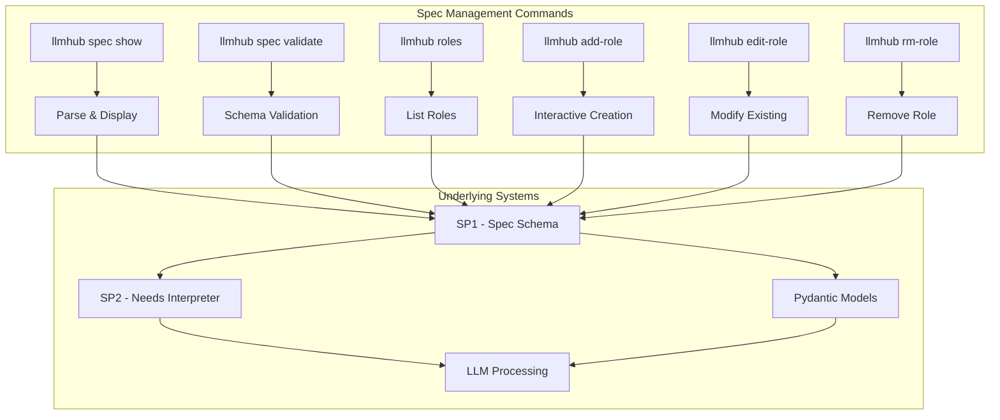
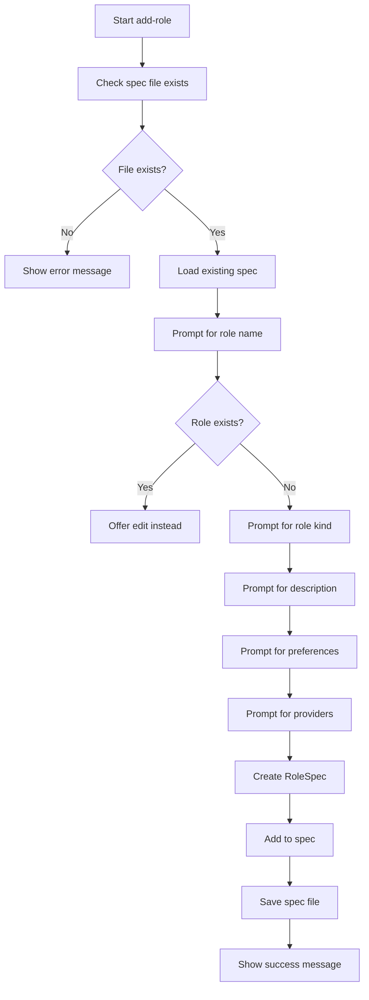
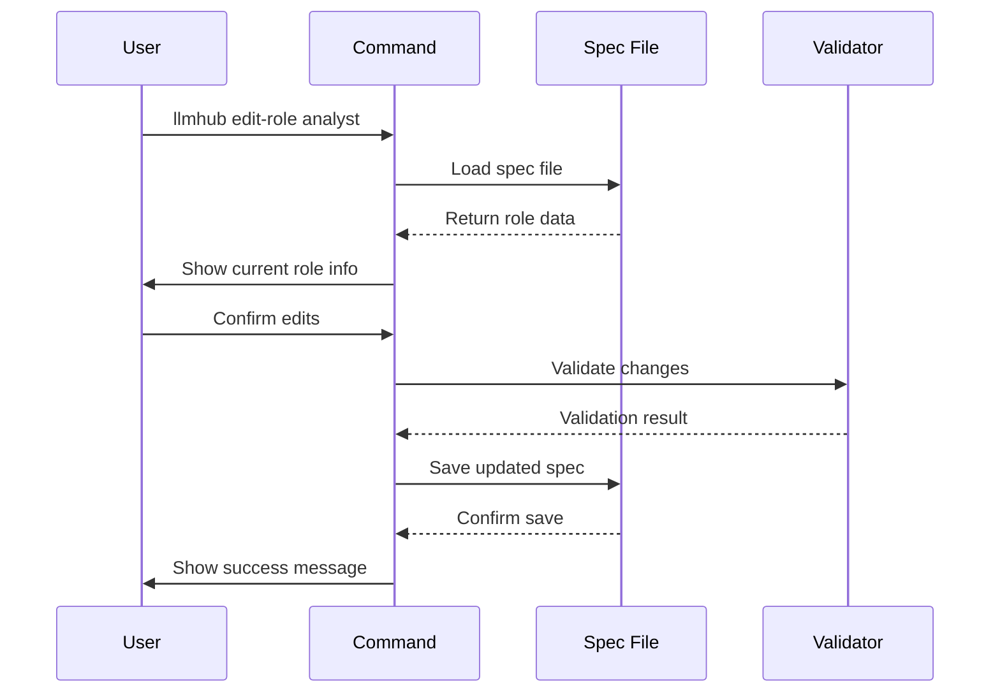
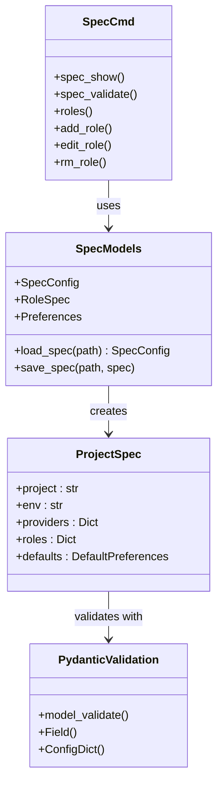

# Spec Management Commands

<cite>
**Referenced Files in This Document**
- [spec_cmd.py](file://packages/llmhub/src/llmhub/commands/spec_cmd.py)
- [spec_models.py](file://packages/llmhub/src/llmhub/spec_models.py)
- [cli.py](file://packages/llmhub/src/llmhub/cli.py)
- [ux.py](file://packages/llmhub/src/llmhub/ux.py)
- [parser.py](file://packages/llmhub/src/llmhub/generator/sp1_spec_schema/parser.py)
- [models.py](file://packages/llmhub/src/llmhub/generator/sp1_spec_schema/models.py)
- [interpreter.py](file://packages/llmhub/src/llmhub/generator/sp2_needs_interpreter/interpreter.py)
- [test_spec_models.py](file://packages/llmhub/tests/test_spec_models.py)
- [test_sp1_spec_schema.py](file://packages/llmhub/tests/generator/test_sp1_spec_schema.py)
</cite>

## Table of Contents
1. [Introduction](#introduction)
2. [Command Overview](#command-overview)
3. [Core Commands](#core-commands)
4. [Role Management Commands](#role-management-commands)
5. [Architecture Integration](#architecture-integration)
6. [Error Handling](#error-handling)
7. [Practical Examples](#practical-examples)
8. [Best Practices](#best-practices)
9. [Troubleshooting](#troubleshooting)

## Introduction

The LLMHub spec management commands provide a comprehensive toolkit for inspecting, validating, and modifying the `llmhub.spec.yaml` specification file. These commands serve as the primary interface for managing LLM role specifications before they are processed through the generator's SP1 (Spec Schema) and SP2 (Needs Interpreter) stages.

The spec file acts as the human-facing configuration layer that defines project metadata, provider configurations, and role specifications with their preferences for quality, cost, and latency. These commands ensure specification integrity and provide convenient workflows for specification maintenance.

## Command Overview

The spec management commands are organized into two main categories:

### Core Commands
- `llmhub spec show` - Display parsed specification details
- `llmhub spec validate` - Validate schema and logic compliance

### Convenience Role Commands
- `llmhub roles` - List all roles in the specification
- `llmhub add-role` - Add new roles interactively
- `llmhub edit-role` - Modify existing roles
- `llmhub rm-role` - Remove roles from specification



**Diagram sources**
- [spec_cmd.py](file://packages/llmhub/src/llmhub/commands/spec_cmd.py#L13-L223)
- [cli.py](file://packages/llmhub/src/llmhub/cli.py#L12-L23)

## Core Commands

### `llmhub spec show`

Displays the parsed specification in a human-readable format, showing project metadata, provider configurations, and role details.

#### Syntax
```bash
llmhub spec show
```

#### Functionality
- Loads and validates the `llmhub.spec.yaml` file
- Displays project and environment information
- Shows provider configurations with status and environment keys
- Lists all roles with their kinds, descriptions, and preferences
- Provides formatted tabular output for easy reading

#### Output Format
The command presents information in several sections:
- **Project Information**: Project name and environment
- **Provider Table**: Enabled/disabled status and environment variables
- **Roles Table**: Role names, kinds, descriptions, and preference summaries

#### Error Conditions
- **File Not Found**: When `llmhub.spec.yaml` doesn't exist
- **Invalid YAML**: Malformed YAML syntax
- **Schema Violations**: Missing required fields or invalid data types

**Section sources**
- [spec_cmd.py](file://packages/llmhub/src/llmhub/commands/spec_cmd.py#L13-L34)

### `llmhub spec validate`

Performs comprehensive validation of the specification file against the defined schema and business logic rules.

#### Syntax
```bash
llmhub spec validate
```

#### Validation Process
The validation command performs multiple validation layers:

1. **File Existence Check**: Verifies `llmhub.spec.yaml` exists
2. **YAML Parsing**: Validates YAML syntax
3. **Schema Validation**: Uses Pydantic models to validate data structure
4. **Business Logic**: Ensures role preferences are consistent

#### Output
Successful validation displays:
```
✓ Spec is valid
  Project: my-app
  Roles: 3
  Providers: 2
```

Failed validation provides detailed error messages with field paths and expected formats.

#### Error Resolution Strategies
- **Missing Fields**: Add required fields with appropriate values
- **Invalid Types**: Correct data types (strings, lists, booleans)
- **Constraint Violations**: Adjust values to meet defined constraints
- **Circular References**: Review role dependencies and provider configurations

**Section sources**
- [spec_cmd.py](file://packages/llmhub/src/llmhub/commands/spec_cmd.py#L36-L54)

## Role Management Commands

### `llmhub roles`

Lists all roles defined in the specification with their basic attributes.

#### Syntax
```bash
llmhub roles
```

#### Features
- Displays role names and descriptions
- Shows role kinds (chat, embedding, image, audio, tool, other)
- Presents preference summaries (cost, latency, quality levels)
- Formats output as sortable tables for easy navigation

#### Use Cases
- Quick overview of all defined roles
- Identifying roles for modification or removal
- Verifying role naming conventions
- Auditing role distribution across the specification

**Section sources**
- [spec_cmd.py](file://packages/llmhub/src/llmhub/commands/spec_cmd.py#L56-L69)

### `llmhub add-role`

Interactively adds new roles to the specification with guided configuration.

#### Syntax
```bash
llmhub add-role [ROLE_NAME]
```

#### Interactive Workflow
The command guides users through a series of prompts:

1. **Role Kind Selection**: Choose from predefined types (chat, embedding, image, audio, tool, other)
2. **Description Input**: Enter a meaningful description of the role's purpose
3. **Preference Configuration**: Set cost, latency, and quality preferences
4. **Provider Selection**: Choose preferred providers from enabled providers
5. **Confirmation**: Review and confirm the new role definition

#### Role Creation Process


**Diagram sources**
- [spec_cmd.py](file://packages/llmhub/src/llmhub/commands/spec_cmd.py#L72-L139)

#### Error Handling
- **Duplicate Roles**: Offers to edit existing role instead
- **Invalid Input**: Validates user responses during interactive prompts
- **File Write Errors**: Handles permission and disk space issues

**Section sources**
- [spec_cmd.py](file://packages/llmhub/src/llmhub/commands/spec_cmd.py#L72-L139)

### `llmhub edit-role`

Modifies existing roles with selective updates to specific attributes.

#### Syntax
```bash
llmhub edit-role [ROLE_NAME]
```

#### Editable Attributes
- **Description**: Update the role's purpose description
- **Preferences**: Modify cost, latency, and quality preferences
- **Provider Selection**: Update allowed providers for the role

#### Interactive Editing Process


**Diagram sources**
- [spec_cmd.py](file://packages/llmhub/src/llmhub/commands/spec_cmd.py#L145-L189)

#### Safety Features
- **Backup Before Changes**: Creates temporary backup of spec file
- **Selective Updates**: Allows editing individual attributes
- **Validation**: Ensures changes remain within schema constraints
- **Undo Capability**: Spec file remains unchanged until successful validation

**Section sources**
- [spec_cmd.py](file://packages/llmhub/src/llmhub/commands/spec_cmd.py#L145-L189)

### `llmhub rm-role`

Removes roles from the specification after confirmation.

#### Syntax
```bash
llmhub rm-role [ROLE_NAME]
```

#### Removal Process
1. **Validation**: Checks if role exists in specification
2. **Confirmation**: Prompts user for deletion confirmation
3. **Removal**: Removes role from specification dictionary
4. **Persistence**: Saves updated specification to file

#### Safety Measures
- **Existence Check**: Verifies role exists before attempting removal
- **User Confirmation**: Requires explicit confirmation for destructive actions
- **Graceful Exit**: Aborts operation if user declines confirmation

**Section sources**
- [spec_cmd.py](file://packages/llmhub/src/llmhub/commands/spec_cmd.py#L195-L223)

## Architecture Integration

### SP1 (Spec Schema) Stage Integration

The spec management commands interface directly with the SP1 stage, which handles YAML parsing and schema validation.



**Diagram sources**
- [spec_cmd.py](file://packages/llmhub/src/llmhub/commands/spec_cmd.py#L4-L8)
- [spec_models.py](file://packages/llmhub/src/llmhub/spec_models.py#L68-L131)
- [models.py](file://packages/llmhub/src/llmhub/generator/sp1_spec_schema/models.py#L52-L65)

### SP2 (Needs Interpreter) Stage Integration

While the spec management commands operate independently of SP2, they ensure the specification is in a valid state before it reaches the LLM-based interpretation phase.

#### Pre-SP2 Validation
The commands perform validation that aligns with SP2 requirements:
- **Schema Compliance**: Ensures data structure matches expected models
- **Type Consistency**: Validates data types for LLM processing
- **Required Fields**: Confirms essential fields are present
- **Logical Consistency**: Checks for reasonable preference combinations

#### Impact on SP2 Processing
Well-formed specifications from the spec management commands improve SP2 performance:
- **Reduced Interpretation Errors**: Clear, valid specifications minimize LLM confusion
- **Faster Processing**: Structured data enables efficient LLM parsing
- **Better Results**: Consistent formatting improves interpretation accuracy

**Section sources**
- [interpreter.py](file://packages/llmhub/src/llmhub/generator/sp2_needs_interpreter/interpreter.py#L15-L92)

## Error Handling

### Common Error Scenarios

#### File System Errors
- **Missing Spec File**: When `llmhub.spec.yaml` doesn't exist
- **Permission Denied**: Insufficient permissions to read/write spec file
- **Disk Space**: Out of disk space during file operations

#### YAML and Schema Errors
- **Invalid YAML Syntax**: Malformed YAML structure
- **Schema Violations**: Data doesn't match expected structure
- **Type Mismatches**: Incorrect data types for fields
- **Missing Required Fields**: Essential fields not present

#### Runtime Errors
- **Provider Configuration Issues**: Invalid provider settings
- **Role Definition Problems**: Invalid role specifications
- **Circular Dependencies**: Role references causing infinite loops

### Error Resolution Strategies

#### File System Issues
1. **Verify File Location**: Ensure `llmhub.spec.yaml` exists in expected directory
2. **Check Permissions**: Verify read/write access to spec file
3. **Free Disk Space**: Ensure adequate storage space
4. **File Corruption**: Restore from backup if file is corrupted

#### YAML and Schema Issues
1. **Syntax Validation**: Use YAML validator to check syntax
2. **Schema Reference**: Compare against documented schema
3. **Incremental Fixes**: Fix one error at a time
4. **Template Usage**: Use working templates as reference

#### Provider and Role Issues
1. **Provider Verification**: Check provider configurations
2. **Role Naming**: Ensure consistent role naming conventions
3. **Preference Logic**: Verify preference combinations make sense
4. **Dependency Review**: Check role interdependencies

**Section sources**
- [spec_models.py](file://packages/llmhub/src/llmhub/spec_models.py#L81-L91)
- [parser.py](file://packages/llmhub/src/llmhub/generator/sp1_spec_schema/parser.py#L50-L66)

## Practical Examples

### Basic Specification Inspection

```bash
# Show complete specification
llmhub spec show

# Validate specification integrity
llmhub spec validate

# List all roles
llmhub roles
```

### Role Management Workflows

#### Adding a New Analysis Role
```bash
# Interactive role creation
llmhub add-role llm.analyzer

# Follow prompts:
# - Select role kind: chat
# - Description: "Advanced data analysis and insights"
# - Cost preference: medium
# - Latency preference: medium  
# - Quality preference: high
# - Select providers: openai, anthropic
```

#### Updating an Existing Role
```bash
# Edit role preferences
llmhub edit-role llm.inference

# Options:
# - Edit description: "Enhanced reasoning with improved accuracy"
# - Update preferences: cost=low, latency=medium, quality=high
# - Change providers: keep openai, add anthropic
```

#### Removing Unused Roles
```bash
# Remove outdated role
llmhub rm-role llm.old_analyzer

# Confirm: Are you sure you want to remove role 'llm.old_analyzer'? (y/n)
```

### Integration with Generation Pipeline

```bash
# Step 1: Validate specification before generation
llmhub spec validate

# Step 2: Make role modifications
llmhub add-role llm.new_feature
llmhub edit-role llm.inference

# Step 3: Generate runtime configuration
llmhub generate

# Step 4: Verify runtime matches expectations
llmhub runtime show
```

### Batch Role Operations

```bash
# Export current roles for documentation
llmhub roles > role_documentation.txt

# Validate multiple specifications
for spec in *.spec.yaml; do
    echo "Validating $spec..."
    python -m llmhub.spec_models "$spec"
done
```

## Best Practices

### Specification Maintenance
- **Regular Validation**: Run `llmhub spec validate` before major changes
- **Version Control**: Track specification changes in version control
- **Documentation**: Maintain role descriptions that explain purpose
- **Consistent Naming**: Use consistent naming conventions for roles

### Role Design Principles
- **Single Responsibility**: Each role should have a clear, focused purpose
- **Reasonable Preferences**: Set realistic cost/quality/latency expectations
- **Provider Diversity**: Include multiple providers for critical roles
- **Clear Descriptions**: Write descriptive role descriptions for team understanding

### Workflow Recommendations
- **Incremental Changes**: Make small, incremental specification changes
- **Testing**: Validate changes before committing to production
- **Backup**: Create backups before major specification modifications
- **Review**: Have team members review significant specification changes

### Error Prevention
- **Schema Awareness**: Understand the specification schema before editing
- **Validation First**: Always validate after making changes
- **Testing**: Test generated runtime configurations
- **Monitoring**: Monitor generation results for unexpected changes

## Troubleshooting

### Common Issues and Solutions

#### Command Not Found
**Problem**: `llmhub spec show` returns "command not found"
**Solution**: 
- Verify LLMHub is installed and in PATH
- Check Python environment activation
- Ensure package dependencies are installed

#### Permission Errors
**Problem**: Cannot read/write `llmhub.spec.yaml`
**Solution**:
- Check file permissions: `ls -la llmhub.spec.yaml`
- Fix permissions: `chmod 644 llmhub.spec.yaml`
- Run with appropriate privileges

#### YAML Syntax Errors
**Problem**: Invalid YAML syntax in specification
**Solution**:
- Use online YAML validator
- Check indentation (spaces vs tabs)
- Verify quote usage
- Validate nested structures

#### Schema Validation Failures
**Problem**: Specification fails validation
**Solution**:
- Review error messages carefully
- Check required fields
- Verify data types
- Compare with working examples

#### Role Modification Issues
**Problem**: Role changes not persisting
**Solution**:
- Verify file write permissions
- Check for concurrent modifications
- Ensure specification is valid after changes
- Review command output for error messages

### Debugging Strategies

#### Verbose Validation
```bash
# Enable debug output
export DEBUG=1
llmhub spec validate
```

#### Manual Validation
```bash
# Load spec manually to debug
python -c "
from llmhub.spec_models import load_spec
spec = load_spec('llmhub.spec.yaml')
print(f'Project: {spec.project}')
print(f'Roles: {list(spec.roles.keys())}')
"
```

#### Comparison Tools
```bash
# Compare specifications
diff <(llmhub spec show | sort) <(cat llmhub.spec.yaml | sort)
```

### Recovery Procedures

#### Specification Recovery
1. **Backup Restoration**: Restore from version control backup
2. **Template Recreation**: Recreate from known-good template
3. **Incremental Repair**: Fix one section at a time
4. **Validation Testing**: Test after each repair step

#### Generated Runtime Recovery
1. **Runtime Backup**: Maintain backup of `llmhub.yaml`
2. **Generation Rollback**: Use previous working specification
3. **Manual Adjustment**: Manually adjust runtime configuration
4. **Pipeline Restart**: Regenerate complete runtime configuration

**Section sources**
- [test_spec_models.py](file://packages/llmhub/tests/test_spec_models.py#L89-L95)
- [test_sp1_spec_schema.py](file://packages/llmhub/tests/generator/test_sp1_spec_schema.py#L83-L98)