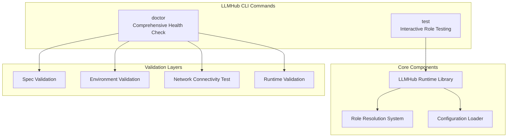
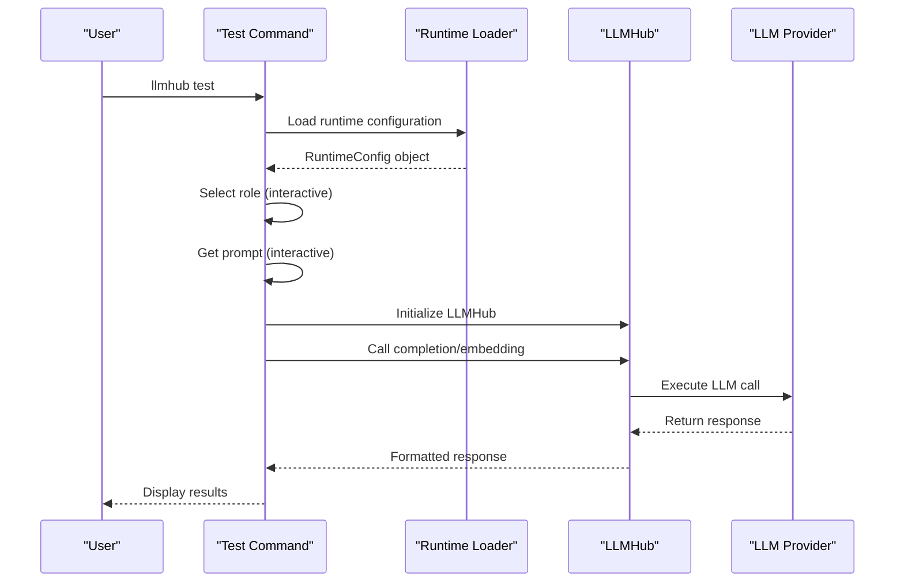
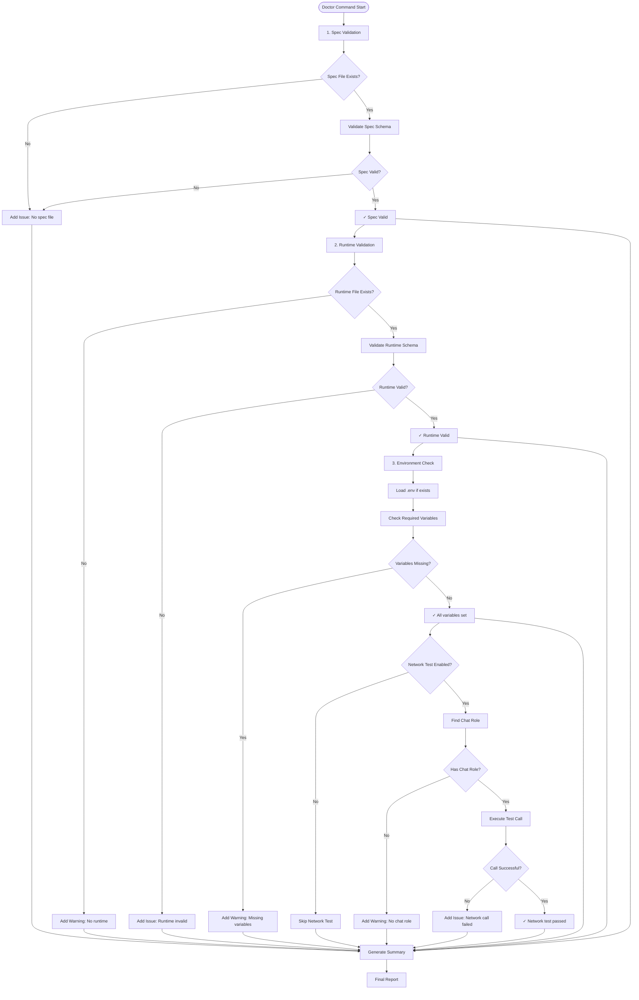
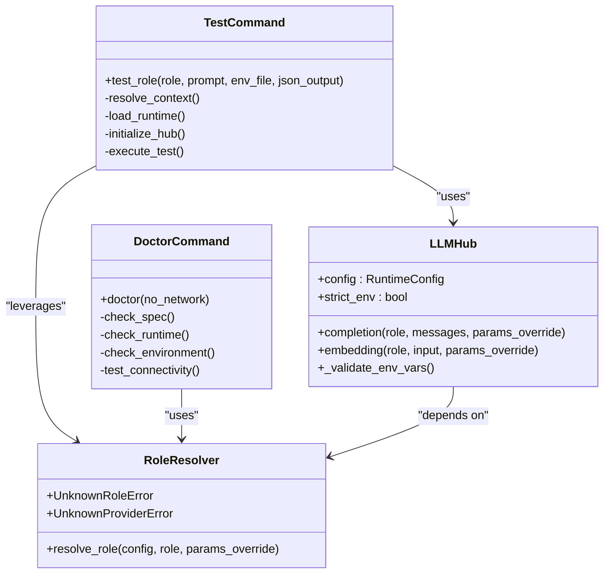
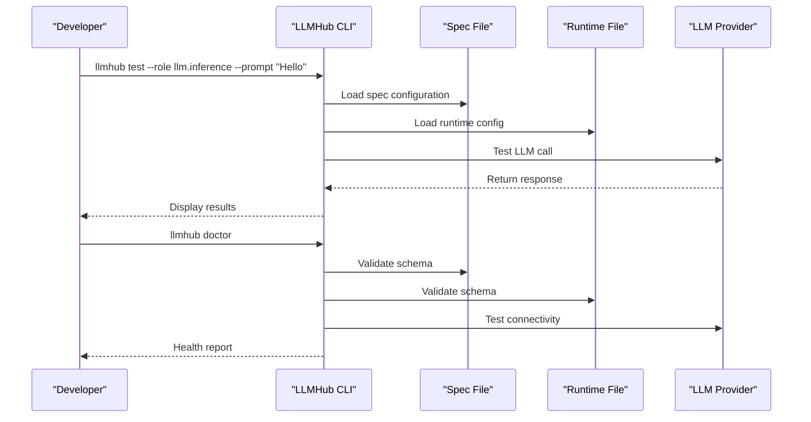

# Testing and Diagnostics Commands

<cite>
**Referenced Files in This Document**
- [test_cmd.py](file://packages/llmhub/src/llmhub/commands/test_cmd.py)
- [cli.py](file://packages/llmhub/src/llmhub/cli.py)
- [context.py](file://packages/llmhub/src/llmhub/context.py)
- [spec_models.py](file://packages/llmhub/src/llmhub/spec_models.py)
- [runtime_io.py](file://packages/llmhub/src/llmhub/runtime_io.py)
- [ux.py](file://packages/llmhub/src/llmhub/ux.py)
- [hub.py](file://packages/llmhub_runtime/src/llmhub_runtime/hub.py)
- [resolver.py](file://packages/llmhub_runtime/src/llmhub_runtime/resolver.py)
- [generator_hook.py](file://packages/llmhub/src/llmhub/generator_hook.py)
- [PLAN-2.md](file://PLAN-2.md)
</cite>

## Table of Contents
1. [Introduction](#introduction)
2. [Command Overview](#command-overview)
3. [Test Command](#test-command)
4. [Doctor Command](#doctor-command)
5. [Integration Architecture](#integration-architecture)
6. [Diagnostic Workflows](#diagnostic-workflows)
7. [Common Failure Modes](#common-failure-modes)
8. [Practical Examples](#practical-examples)
9. [Troubleshooting Guide](#troubleshooting-guide)
10. [Best Practices](#best-practices)

## Introduction

The LLMHub CLI provides two essential diagnostic tools for validating and testing your LLM configuration: `test` and `doctor`. These commands serve complementary purposes in maintaining system health and ensuring proper operation of your LLM infrastructure.

The **test** command enables interactive evaluation of specific roles against your current configuration, providing immediate feedback on model selection rationale and execution results. It's designed for developers who need to quickly verify that their LLM roles are configured correctly and functioning as expected.

The **doctor** command performs comprehensive health checks across your entire LLMHub setup, validating dependencies, configuration integrity, environment variables, and connectivity. It serves as a systematic diagnostic tool for identifying and resolving setup issues before they impact production usage.

Both commands integrate deeply with the LLMHub runtime library and leverage the role resolution system to provide accurate and actionable diagnostics.

## Command Overview



**Diagram sources**
- [test_cmd.py](file://packages/llmhub/src/llmhub/commands/test_cmd.py#L18-L232)
- [cli.py](file://packages/llmhub/src/llmhub/cli.py#L37-L40)

### Command Syntax Comparison

| Command | Purpose | Interactive | Output Format |
|---------|---------|-------------|---------------|
| `llmhub test` | Evaluate specific role | Yes | Rich terminal output |
| `llmhub doctor` | Comprehensive health check | No | Structured diagnostic report |

## Test Command

The `test` command provides interactive evaluation capabilities for validating individual LLM roles in your configuration. It offers real-time feedback on model selection, execution results, and system integration.

### Command Syntax

```bash
llmhub test [OPTIONS]
```

### Available Options

| Option | Type | Description | Default |
|--------|------|-------------|---------|
| `--role TEXT` | String | Specific role to test | None (interactive selection) |
| `--prompt TEXT` | String | Custom prompt for testing | None (interactive prompt) |
| `--env-file PATH` | Path | Path to .env file for environment variables | Auto-detected |
| `--json` | Boolean | Output raw JSON response instead of formatted text | False |

### Interactive Testing Workflow



**Diagram sources**
- [test_cmd.py](file://packages/llmhub/src/llmhub/commands/test_cmd.py#L18-L118)

### Test Execution Loop

The test command implements a robust execution loop that handles various scenarios and provides comprehensive feedback:

1. **Context Resolution**: Validates project context and runtime availability
2. **Environment Loading**: Loads appropriate environment variables
3. **Role Selection**: Provides interactive role selection when not specified
4. **Prompt Input**: Accepts custom prompts or uses default interactive prompt
5. **Hub Initialization**: Creates LLMHub instance with resolved configuration
6. **Execution**: Calls appropriate LLM method based on role mode
7. **Response Processing**: Formats and displays results with timing information

### Model Selection Rationale

When testing a role, the command displays detailed information about the resolved configuration:

- **Selected Role**: Name of the role being tested
- **Provider**: LLM provider being used
- **Model**: Specific model chosen for the role
- **Mode**: Operation mode (chat, embedding, etc.)
- **Parameters**: Any additional parameters applied

### Sample Test Output Interpretation

Successful test execution produces structured output showing:
- Role and configuration details
- Execution duration
- Response content (formatted or raw JSON)
- Success indicators and timing metrics

**Section sources**
- [test_cmd.py](file://packages/llmhub/src/llmhub/commands/test_cmd.py#L18-L118)

## Doctor Command

The `doctor` command performs comprehensive health checks across all aspects of your LLMHub setup, providing a systematic assessment of system readiness and configuration integrity.

### Command Syntax

```bash
llmhub doctor [OPTIONS]
```

### Available Options

| Option | Type | Description | Default |
|--------|------|-------------|---------|
| `--no-network` | Boolean | Skip network connectivity tests | False |

### Diagnostic Check Sequence



**Diagram sources**
- [test_cmd.py](file://packages/llmhub/src/llmhub/commands/test_cmd.py#L125-L232)

### Health Check Categories

The doctor command evaluates four critical areas:

#### 1. Spec Validation
- **File Existence**: Verifies presence of `llmhub.spec.yaml`
- **Schema Validation**: Ensures proper YAML structure and field types
- **Content Validation**: Checks for required fields and logical consistency

#### 2. Runtime Validation
- **File Existence**: Confirms presence of `llmhub.yaml`
- **Schema Compliance**: Validates runtime configuration format
- **Role Consistency**: Ensures runtime roles match spec roles

#### 3. Environment Validation
- **Variable Detection**: Identifies required environment variables
- **Variable Availability**: Checks if variables are set in environment
- **Provider Configuration**: Validates provider-specific requirements

#### 4. Network Connectivity
- **Provider Reachability**: Tests connection to LLM providers
- **API Authentication**: Validates API key functionality
- **Rate Limiting**: Checks for potential throttling issues

### Diagnostic Output Interpretation

The doctor command produces structured output with clear categorization:

#### Success Indicators
- **Green Checkmarks**: ✓ All checks passed in category
- **Summary Messages**: Clear indication of successful validation

#### Warning Indicators
- **Yellow Exclamation**: ⚠ Issues detected but system may still function
- **Warning Descriptions**: Detailed explanations of non-critical issues

#### Error Indicators
- **Red Crosses**: ✗ Critical issues requiring attention
- **Error Descriptions**: Specific problem identification and resolution steps

### Network Test Behavior

When the `--no-network` flag is used, the doctor command skips connectivity tests, focusing only on local configuration validation. This is useful for offline environments or when network connectivity is not required for initial setup verification.

**Section sources**
- [test_cmd.py](file://packages/llmhub/src/llmhub/commands/test_cmd.py#L125-L232)

## Integration Architecture

The testing and diagnostics commands integrate seamlessly with the LLMHub runtime library and configuration management system, leveraging established patterns for reliability and maintainability.

### Runtime Library Integration



**Diagram sources**
- [test_cmd.py](file://packages/llmhub/src/llmhub/commands/test_cmd.py#L1-L232)
- [hub.py](file://packages/llmhub_runtime/src/llmhub_runtime/hub.py#L17-L189)
- [resolver.py](file://packages/llmhub_runtime/src/llmhub_runtime/resolver.py#L5-L43)

### Configuration Loading Pipeline

Both commands utilize the same configuration loading mechanisms:

1. **Context Resolution**: Establishes project root and file paths
2. **Spec Loading**: Parses and validates specification file
3. **Runtime Loading**: Loads and validates runtime configuration
4. **Environment Setup**: Configures environment variables
5. **Role Resolution**: Maps logical roles to concrete implementations

### Error Handling Integration

The commands inherit robust error handling from the runtime library:

- **Spec Errors**: Invalid specification schema
- **Runtime Errors**: Malformed runtime configuration
- **Environment Errors**: Missing or invalid environment variables
- **Network Errors**: Provider connectivity issues
- **Authentication Errors**: API key or credential problems

**Section sources**
- [test_cmd.py](file://packages/llmhub/src/llmhub/commands/test_cmd.py#L1-L232)
- [hub.py](file://packages/llmhub_runtime/src/llmhub_runtime/hub.py#L17-L189)

## Diagnostic Workflows

Understanding the diagnostic workflows helps users effectively utilize the testing and doctor commands for different scenarios and troubleshooting needs.

### Development Workflow



### Production Validation Workflow

For production deployments, the doctor command provides comprehensive pre-deployment validation:

1. **Pre-deployment Check**: Run `llmhub doctor` before deployment
2. **Environment Verification**: Confirm all required variables are set
3. **Configuration Validation**: Verify spec and runtime consistency
4. **Connectivity Testing**: Test provider access and authentication
5. **Rollback Preparation**: Document current state for rollback scenarios

### Continuous Integration Workflow

Integrate doctor command into CI/CD pipelines for automated validation:

```yaml
# Example GitHub Actions workflow
- name: LLMHub Health Check
  run: |
    llmhub doctor --no-network
    llmhub test --role llm.inference --prompt "Hello" --json > test-results.json
```

### Debugging Workflow

When encountering issues, follow this systematic debugging approach:

1. **Initial Diagnosis**: Run `llmhub doctor` to identify major issues
2. **Specific Testing**: Use `llmhub test` with targeted role and prompt
3. **Environment Review**: Check environment variables and provider setup
4. **Configuration Validation**: Compare spec and runtime files
5. **Network Troubleshooting**: Test provider connectivity separately

## Common Failure Modes

Understanding common failure modes helps users quickly identify and resolve issues when using the testing and diagnostics commands.

### Test Command Failures

#### Missing Runtime Configuration
**Symptoms**: "No runtime file found" error
**Cause**: `llmhub.yaml` does not exist or is improperly configured
**Resolution**: Run `llmhub generate` to create runtime configuration

#### Role Not Found
**Symptoms**: "Role '{role}' not found in runtime" error
**Cause**: Specified role does not exist in runtime configuration
**Resolution**: Verify role name matches spec and regenerate runtime

#### Environment Variable Issues
**Symptoms**: "Failed to initialize LLMHub" with environment-related error
**Cause**: Required API keys or environment variables are missing
**Resolution**: Run `llmhub env check` and set missing variables

#### Network Connectivity Problems
**Symptoms**: "Call failed" with network-related error
**Cause**: Provider API is unreachable or credentials are invalid
**Resolution**: Check internet connectivity and API key validity

### Doctor Command Failures

#### Spec Validation Failures
**Symptoms**: "Spec validation failed" with specific error message
**Cause**: YAML syntax errors or invalid field values
**Resolution**: Fix YAML syntax and validate field types

#### Runtime Validation Failures
**Symptoms**: "Runtime validation failed" with schema error
**Cause**: Runtime configuration does not match expected schema
**Resolution**: Regenerate runtime with `llmhub generate`

#### Environment Variable Warnings
**Symptoms**: "Missing environment variable(s)" warnings
**Cause**: Required variables are not set in environment
**Resolution**: Set variables in `.env` file or environment

#### Network Test Failures
**Symptoms**: "Test call failed" during connectivity test
**Cause**: Provider API is down or credentials are expired
**Resolution**: Verify provider status and refresh API keys

### Integration Issues

#### Version Compatibility
**Symptoms**: Unexpected errors with new features
**Cause**: Runtime library version mismatch
**Resolution**: Update both `llmhub` and `llmhub-runtime` packages

#### Provider Configuration
**Symptoms**: Provider-specific errors
**Cause**: Incorrect provider setup in spec
**Resolution**: Verify provider configuration and API access

**Section sources**
- [test_cmd.py](file://packages/llmhub/src/llmhub/commands/test_cmd.py#L112-L118)
- [test_cmd.py](file://packages/llmhub/src/llmhub/commands/test_cmd.py#L125-L232)

## Practical Examples

This section provides concrete examples of using the test and doctor commands in various scenarios.

### Basic Testing Examples

#### Interactive Role Testing
```bash
# Start interactive testing session
llmhub test

# Select role and prompt interactively
# Output includes role details, response, and timing
```

#### Specific Role Testing
```bash
# Test specific role with custom prompt
llmhub test --role llm.inference --prompt "What is the capital of France?"

# Test with JSON output for programmatic consumption
llmhub test --role llm.inference --prompt "Hello" --json
```

#### Environment-Specific Testing
```bash
# Test with custom environment file
llmhub test --role llm.inference --prompt "Hello" --env-file ./custom.env
```

### Comprehensive Health Check Examples

#### Standard Doctor Check
```bash
# Run full health check
llmhub doctor

# Expected output: Summary of all checks with green/yellow/red indicators
```

#### Offline Doctor Check
```bash
# Run health check without network tests
llmhub doctor --no-network

# Useful for CI/CD environments or offline development
```

### Integration Examples

#### CI/CD Pipeline Integration
```yaml
# GitHub Actions example
name: LLMHub Validation
on: [push, pull_request]

jobs:
  validate:
    runs-on: ubuntu-latest
    steps:
      - uses: actions/checkout@v2
      - name: Install dependencies
        run: pip install llmhub llmhub-runtime any-llm
      - name: Run health check
        run: llmhub doctor --no-network
      - name: Test inference role
        run: |
          llmhub test --role llm.inference --prompt "Hello" --json > test-output.json
```

#### Development Workflow Example
```bash
# Development cycle
cd my-llm-project

# Initial setup
llmhub setup  # or llmhub init
llmhub generate

# Test specific role
llmhub test --role llm.inference --prompt "What is AI?"

# Check overall health
llmhub doctor

# Make configuration changes
llmhub edit-role llm.inference
llmhub generate

# Re-test and re-validate
llmhub test --role llm.inference --prompt "What is AI?"
llmhub doctor
```

### Troubleshooting Examples

#### Environment Issue Resolution
```bash
# Identify environment issues
llmhub doctor

# Check specific environment variables
llmhub env check

# Set missing variables
export OPENAI_API_KEY="your-key-here"
export ANTHROPIC_API_KEY="your-key-here"

# Re-test
llmhub test --role llm.inference --prompt "Hello"
```

#### Configuration Problem Diagnosis
```bash
# Validate spec file
llmhub spec validate

# Check runtime consistency
llmhub diff

# Re-generate runtime
llmhub generate

# Test again
llmhub test --role llm.inference --prompt "Hello"
```

## Troubleshooting Guide

This comprehensive troubleshooting guide addresses common issues and provides step-by-step resolution procedures.

### Diagnostic Command Issues

#### Command Not Found
**Problem**: `llmhub` command not recognized
**Solution**:
1. Verify installation: `pip show llmhub`
2. Check PATH: `echo $PATH` (Linux/macOS) or `echo %PATH%` (Windows)
3. Reinstall: `pip install --upgrade llmhub`

#### Permission Issues
**Problem**: Permission denied when running commands
**Solution**:
1. Check file permissions: `ls -la $(which llmhub)`
2. Fix permissions: `chmod +x $(which llmhub)`
3. Or reinstall with proper permissions

### Configuration Issues

#### Spec File Problems
**Problem**: Spec validation failures
**Solution**:
1. Check YAML syntax: `llmhub spec validate`
2. Validate field types and required fields
3. Compare with example spec files
4. Fix syntax errors and re-validate

#### Runtime Configuration Issues
**Problem**: Runtime validation failures
**Solution**:
1. Regenerate runtime: `llmhub generate`
2. Check for conflicting changes
3. Restore from backup if available
4. Verify provider configuration

### Environment Variable Issues

#### Missing Variables
**Problem**: Environment variable warnings
**Solution**:
1. Check required variables: `llmhub env check`
2. Create `.env` file in project root
3. Add required variables with proper values
4. Verify variable names match spec configuration

#### Variable Format Issues
**Problem**: Environment variable format errors
**Solution**:
1. Check variable syntax in `.env` file
2. Ensure no extra spaces or quotes
3. Verify API keys are complete and correct
4. Test variables in shell: `echo $VARIABLE_NAME`

### Network and Connectivity Issues

#### Provider Access Problems
**Problem**: Network connectivity failures
**Solution**:
1. Check internet connection
2. Verify firewall settings
3. Test provider website accessibility
4. Check for rate limiting or quota issues

#### API Key Issues
**Problem**: Authentication failures
**Solution**:
1. Verify API key format and validity
2. Check provider account status
3. Refresh expired or revoked keys
4. Test key with provider's API directly

### Runtime Library Issues

#### Version Compatibility
**Problem**: Runtime library version conflicts
**Solution**:
1. Check installed versions: `pip list | grep llmhub`
2. Update packages: `pip install --upgrade llmhub llmhub-runtime`
3. Verify compatibility matrix
4. Reinstall if necessary

#### Dependency Conflicts
**Problem**: Package dependency issues
**Solution**:
1. Check dependency tree: `pipdeptree`
2. Resolve conflicts manually
3. Use virtual environment
4. Reinstall with clean environment

### Performance Issues

#### Slow Response Times
**Problem**: Long execution times during testing
**Solution**:
1. Check network latency
2. Verify provider response times
3. Test with simpler prompts
4. Consider switching to faster models

#### Memory Issues
**Problem**: Out of memory errors
**Solution**:
1. Reduce prompt length
2. Check system memory usage
3. Close unnecessary applications
4. Increase system resources if possible

**Section sources**
- [test_cmd.py](file://packages/llmhub/src/llmhub/commands/test_cmd.py#L112-L118)
- [test_cmd.py](file://packages/llmhub/src/llmhub/commands/test_cmd.py#L125-L232)

## Best Practices

Following these best practices ensures optimal use of the testing and diagnostics commands and maintains system reliability.

### Development Workflow Best Practices

#### Regular Health Monitoring
- **Daily Checks**: Run `llmhub doctor` daily during development
- **Pre-commit Validation**: Include health checks in pre-commit hooks
- **CI Integration**: Add doctor command to continuous integration pipelines
- **Deployment Validation**: Always run health checks before production deployments

#### Testing Strategy
- **Role Coverage**: Test all configured roles regularly
- **Prompt Diversity**: Use varied prompts to test different scenarios
- **Environment Testing**: Test with different environment configurations
- **Error Simulation**: Intentionally introduce errors to verify diagnostics

#### Configuration Management
- **Version Control**: Track spec and runtime files in version control
- **Backup Strategy**: Maintain backups of working configurations
- **Change Documentation**: Document significant configuration changes
- **Review Process**: Implement review process for configuration changes

### Security Best Practices

#### Environment Variable Management
- **Secret Storage**: Never commit API keys to version control
- **Environment Separation**: Use different environments for development/staging/production
- **Access Control**: Restrict access to sensitive configuration files
- **Rotation Schedule**: Implement regular API key rotation

#### Network Security
- **Firewall Configuration**: Ensure proper firewall rules for LLM provider access
- **VPN Usage**: Use VPN when accessing restricted providers
- **Monitoring**: Monitor network access patterns for anomalies
- **Rate Limiting**: Respect provider rate limits and quotas

### Performance Optimization

#### Efficient Testing
- **Selective Testing**: Use specific role and prompt options to minimize execution time
- **Batch Operations**: Group related tests for efficiency
- **Resource Management**: Close unused applications during testing
- **Timing Analysis**: Monitor execution times for performance trends

#### Resource Utilization
- **Memory Management**: Monitor system memory during long-running tests
- **Network Bandwidth**: Consider bandwidth limitations for multiple simultaneous tests
- **Provider Limits**: Respect provider API limits and quotas
- **Caching Strategy**: Implement caching for repeated test scenarios

### Maintenance Procedures

#### Regular Updates
- **Package Updates**: Keep LLMHub packages updated
- **Provider Changes**: Monitor provider API changes
- **Security Patches**: Apply security updates promptly
- **Feature Adoption**: Stay current with new features and improvements

#### Documentation and Training
- **Procedure Documentation**: Maintain up-to-date operational procedures
- **Team Training**: Ensure team members understand diagnostic tools
- **Knowledge Sharing**: Share troubleshooting experiences and solutions
- **Process Improvement**: Continuously improve diagnostic workflows

### Monitoring and Alerting

#### Automated Monitoring
- **Health Check Automation**: Implement automated health monitoring
- **Alert Configuration**: Set up alerts for critical failures
- **Performance Metrics**: Track key performance indicators
- **Log Analysis**: Implement log analysis for trend detection

#### Incident Response
- **Response Procedures**: Develop incident response procedures
- **Escalation Paths**: Establish clear escalation paths
- **Recovery Plans**: Maintain disaster recovery plans
- **Post-Incident Review**: Conduct post-incident reviews and improvements

These best practices ensure reliable operation of your LLMHub setup and enable efficient troubleshooting when issues arise.