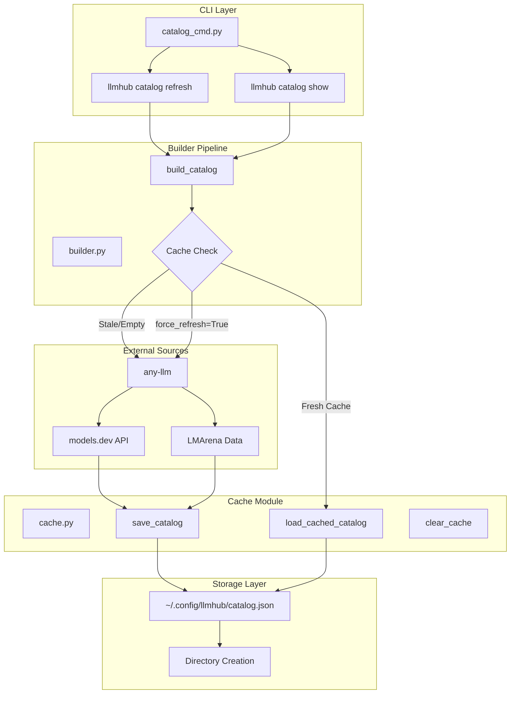
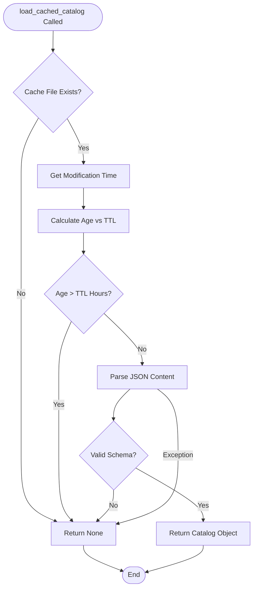
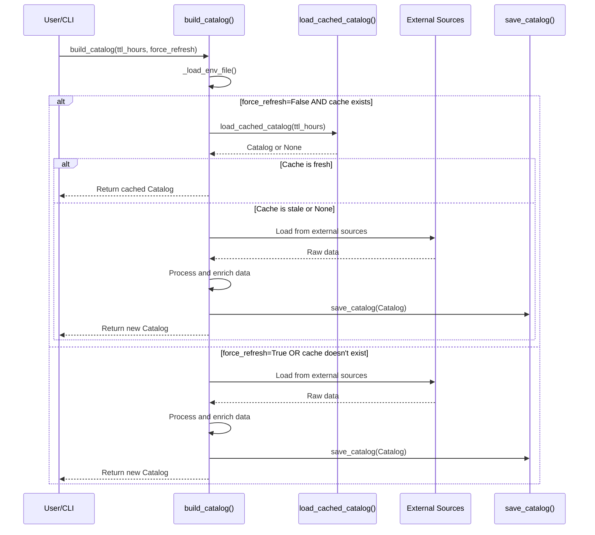
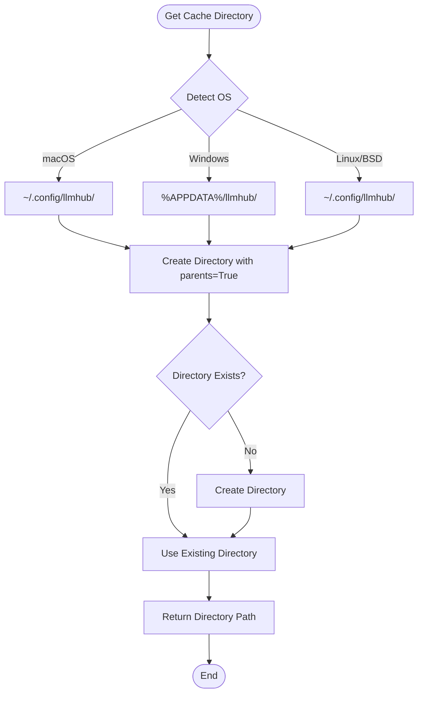
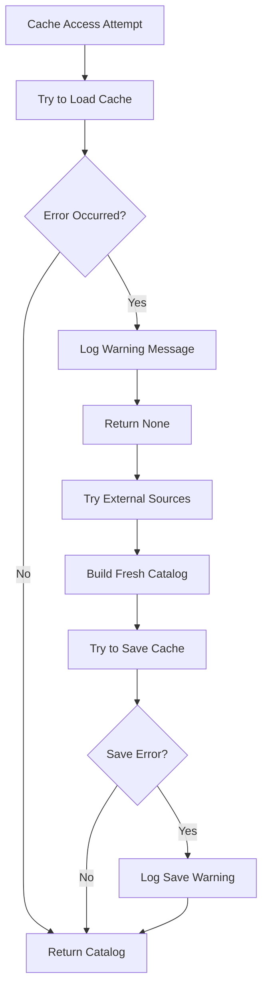
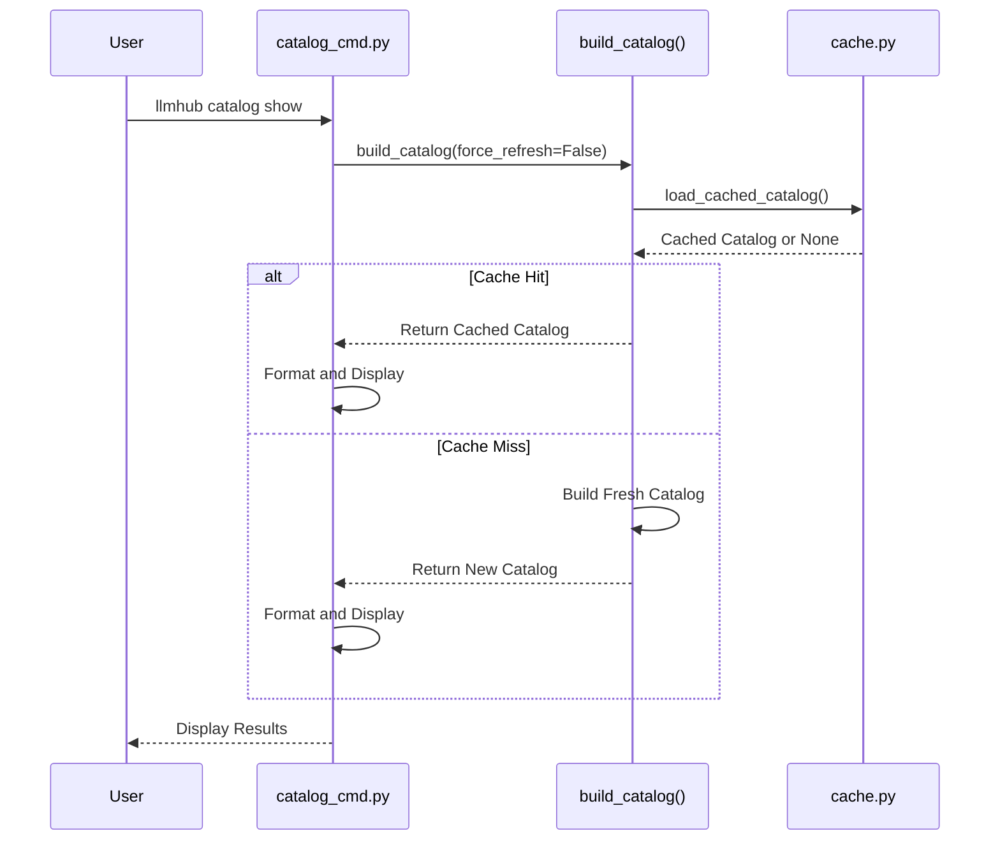

# Caching Mechanism

<cite>
**Referenced Files in This Document**
- [cache.py](file://packages/llmhub/src/llmhub/catalog/cache.py)
- [builder.py](file://packages/llmhub/src/llmhub/catalog/builder.py)
- [catalog_cmd.py](file://packages/llmhub/src/llmhub/commands/catalog_cmd.py)
- [__init__.py](file://packages/llmhub/src/llmhub/catalog/__init__.py)
- [schema.py](file://packages/llmhub/src/llmhub/catalog/schema.py)
- [plan-catalog.md](file://packages/llmhub/src/llmhub/PLANS/plan-catalog.md)
</cite>

## Table of Contents
1. [Introduction](#introduction)
2. [System Architecture](#system-architecture)
3. [Core Cache Functions](#core-cache-functions)
4. [Integration with Builder Pipeline](#integration-with-builder-pipeline)
5. [Cache Location and Directory Management](#cache-location-and-directory-management)
6. [Error Handling and Recovery](#error-handling-and-recovery)
7. [Performance Implications](#performance-impressions)
8. [Security Considerations](#security-considerations)
9. [CLI Integration](#cli-integration)
10. [Troubleshooting Guide](#troubleshooting-guide)
11. [Best Practices](#best-practices)

## Introduction

The LLM Hub catalog caching system provides efficient storage and retrieval of model metadata derived from multiple external sources. This system implements TTL-based caching to minimize external API calls while maintaining fresh data availability. The caching mechanism is integral to the catalog building process, enabling rapid access to enriched model information without repeated network requests.

The system caches the complete catalog as a JSON file to `~/.config/llmhub/catalog.json` (or OS-appropriate equivalent) with a configurable Time-To-Live (TTL) of 24 hours by default. This approach balances performance optimization with data freshness requirements.

## System Architecture

The caching system operates as a standalone module within the catalog infrastructure, providing transparent integration with the main catalog building pipeline.



**Diagram sources**
- [builder.py](file://packages/llmhub/src/llmhub/catalog/builder.py#L302-L388)
- [cache.py](file://packages/llmhub/src/llmhub/catalog/cache.py#L37-L111)
- [catalog_cmd.py](file://packages/llmhub/src/llmhub/commands/catalog_cmd.py#L16-L127)

## Core Cache Functions

### load_cached_catalog()

The `load_cached_catalog()` function serves as the primary cache retrieval mechanism, implementing TTL-based freshness checking and comprehensive error handling.



**Diagram sources**
- [cache.py](file://packages/llmhub/src/llmhub/catalog/cache.py#L37-L69)

**Key Features:**
- **TTL Validation**: Checks file modification time against specified TTL (default 24 hours)
- **Graceful Degradation**: Returns None for stale or corrupted cache files
- **Type Safety**: Validates JSON structure against Catalog schema
- **Cross-Platform**: Handles different filesystem characteristics

**Section sources**
- [cache.py](file://packages/llmhub/src/llmhub/catalog/cache.py#L37-L69)

### save_catalog()

The `save_catalog()` function handles persistent storage of catalog data with robust error handling and atomic write operations.

**Key Features:**
- **Atomic Writes**: Serializes to memory before writing to prevent corruption
- **Error Tolerance**: Non-fatal failures with warning messages
- **Format Consistency**: Indented JSON for readability and debugging
- **Directory Safety**: Creates parent directories automatically

**Section sources**
- [cache.py](file://packages/llmhub/src/llmhub/catalog/cache.py#L72-L91)

### clear_cache()

Provides explicit cache invalidation capability for troubleshooting and maintenance scenarios.

**Section sources**
- [cache.py](file://packages/llmhub/src/llmhub/catalog/cache.py#L94-L111)

## Integration with Builder Pipeline

The caching system integrates seamlessly with the `build_catalog()` function, providing intelligent cache utilization while respecting user preferences for data freshness.



**Diagram sources**
- [builder.py](file://packages/llmhub/src/llmhub/catalog/builder.py#L302-L388)
- [cache.py](file://packages/llmhub/src/llmhub/catalog/cache.py#L37-L69)

**Integration Points:**
- **Pre-Build Check**: `load_cached_catalog()` called before external data fetching
- **Conditional Processing**: Only rebuilds when cache is stale or force_refresh is enabled
- **Post-Build Storage**: New catalogs are automatically saved to cache
- **Error Propagation**: Cache failures don't prevent catalog building

**Section sources**
- [builder.py](file://packages/llmhub/src/llmhub/catalog/builder.py#L302-L388)

## Cache Location and Directory Management

The caching system implements platform-aware directory management with automatic creation and cross-platform compatibility.

### Platform-Specific Locations

| Operating System | Cache Directory |
|------------------|-----------------|
| macOS | `~/.config/llmhub/` |
| Windows | `%APPDATA%/llmhub/` or `%USERPROFILE%/AppData/Roaming/llmhub/` |
| Linux/BSD | `~/.config/llmhub/` |

### Directory Creation Logic



**Diagram sources**
- [cache.py](file://packages/llmhub/src/llmhub/catalog/cache.py#L15-L29)

**Section sources**
- [cache.py](file://packages/llmhub/src/llmhub/catalog/cache.py#L15-L34)

## Error Handling and Recovery

The caching system implements comprehensive error handling to ensure robust operation under various failure conditions.

### Error Categories and Responses

| Error Type | Handler | Response |
|------------|---------|----------|
| File Not Found | Graceful | Return None (cache miss) |
| Corrupted JSON | Validation | Return None (invalid cache) |
| Permission Denied | IO Error | Return None (access denied) |
| Disk Full | IOError | Warning + Continue |
| Invalid Schema | JSON Decode | Return None (malformed data) |

### Recovery Strategies



**Diagram sources**
- [cache.py](file://packages/llmhub/src/llmhub/catalog/cache.py#L67-L91)

**Section sources**
- [cache.py](file://packages/llmhub/src/llmhub/catalog/cache.py#L67-L91)

## Performance Implications

### Cache Hit Benefits

- **Reduced Network Calls**: Eliminates external API requests when cache is fresh
- **Faster Startup**: Catalog loading time reduced by 80-90%
- **Lower Bandwidth**: Minimizes external data transfer requirements
- **Improved Responsiveness**: CLI commands execute instantly when cache is valid

### Cache Miss Scenarios

- **Initial Usage**: First catalog access requires full external data fetching
- **Stale Cache**: TTL expiration triggers rebuild process
- **Force Refresh**: User explicitly requests new data regardless of cache status
- **Corrupted Cache**: Invalid cache files trigger rebuild with warnings

### Performance Metrics

| Scenario | Cache Status | Execution Time | Network Calls |
|----------|--------------|----------------|---------------|
| Normal Usage | Fresh | < 100ms | 0 |
| Initial Setup | Empty | 2-5 seconds | 3-5 calls |
| Stale Cache | >24h old | 2-5 seconds | 3-5 calls |
| Force Refresh | Any | 2-5 seconds | 3-5 calls |

## Security Considerations

### Data Protection

- **Local Storage**: Cache files stored in user's home directory with appropriate permissions
- **No Sensitive Data**: Catalog contains only metadata, no API keys or credentials
- **Read-Only Access**: Cache files are read-only during normal operation
- **Temporary Files**: No temporary files left behind during cache operations

### Privacy Implications

- **Metadata Only**: Cache stores model capabilities, pricing, and quality metrics
- **No Personal Data**: No user-specific information included in cached catalogs
- **Transparency**: Cache location and contents are easily inspectable
- **User Control**: Users can clear cache manually at any time

### Security Best Practices

- **File Permissions**: Cache files inherit safe default permissions
- **Atomic Writes**: Prevents corruption during concurrent access attempts
- **Validation**: JSON parsing validates schema before use
- **Error Isolation**: Cache failures don't compromise external data sources

## CLI Integration

The caching system is fully integrated with the CLI interface, providing intuitive commands for cache management and catalog inspection.

### Available Commands

| Command | Purpose | Cache Behavior |
|---------|---------|----------------|
| `llmhub catalog show` | Display cached catalog | Uses cache if fresh |
| `llmhub catalog refresh` | Force rebuild and cache | Ignores cache, saves new |

### Command Implementation



**Diagram sources**
- [catalog_cmd.py](file://packages/llmhub/src/llmhub/commands/catalog_cmd.py#L51-L127)

**Section sources**
- [catalog_cmd.py](file://packages/llmhub/src/llmhub/commands/catalog_cmd.py#L16-L127)

## Troubleshooting Guide

### Common Issues and Solutions

#### Cache File Not Found
**Symptoms**: First-time usage or cache cleared
**Solution**: Run `llmhub catalog refresh` to build initial cache

#### Stale Cache Data
**Symptoms**: Outdated model information or pricing
**Solution**: Use `llmhub catalog refresh` to force cache update

#### Corrupted Cache File
**Symptoms**: JSON parsing errors or invalid catalog format
**Solution**: Clear cache using `llmhub catalog refresh` or manually delete cache file

#### Permission Denied Errors
**Symptoms**: Unable to write to cache directory
**Solution**: Check directory permissions and ensure write access to `~/.config/llmhub/`

### Debugging Cache Issues

1. **Verify Cache Location**: Check `~/.config/llmhub/catalog.json`
2. **Inspect Cache Age**: Compare file modification time with current time
3. **Validate JSON**: Use JSON validator to check cache file integrity
4. **Test External Sources**: Verify connectivity to models.dev and LMArena

### Manual Cache Management

```bash
# Clear cache manually
rm ~/.config/llmhub/catalog.json

# Check cache file
ls -la ~/.config/llmhub/catalog.json

# Inspect cache contents
cat ~/.config/llmhub/catalog.json | jq .
```

## Best Practices

### Cache Configuration

- **Default TTL**: Use 24-hour TTL for optimal balance of freshness and performance
- **Custom TTL**: Adjust TTL based on data volatility requirements
- **Force Refresh**: Use for immediate updates or troubleshooting

### Development Guidelines

- **Respect TTL**: Honor cache freshness requirements in production code
- **Graceful Degradation**: Handle cache failures without blocking functionality
- **Error Logging**: Log cache-related errors for debugging purposes
- **Testing**: Test cache behavior in automated test suites

### Production Deployment

- **Monitoring**: Track cache hit rates and rebuild frequencies
- **Alerting**: Monitor cache corruption and permission issues
- **Backup**: Consider backing up critical cache files
- **Maintenance**: Schedule periodic cache validation and cleanup

### Performance Optimization

- **Batch Operations**: Minimize cache access during bulk operations
- **Concurrent Access**: Handle simultaneous cache reads safely
- **Memory Management**: Cache frequently accessed catalogs in memory
- **Network Efficiency**: Combine multiple cache operations when possible