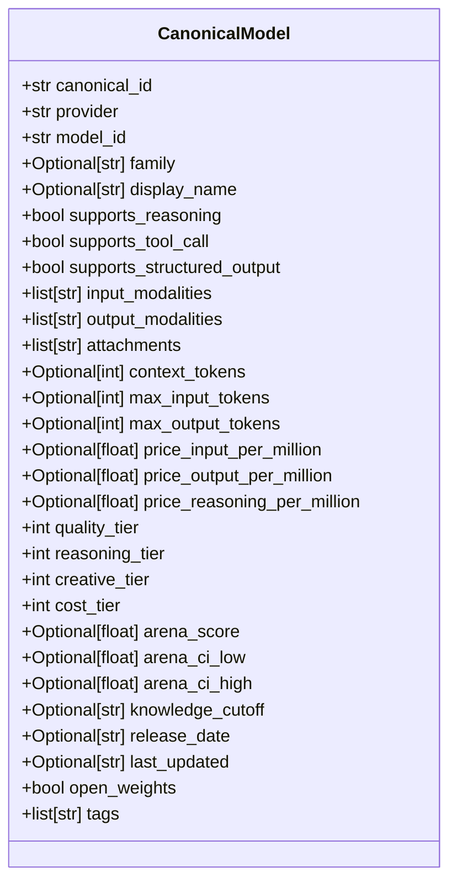
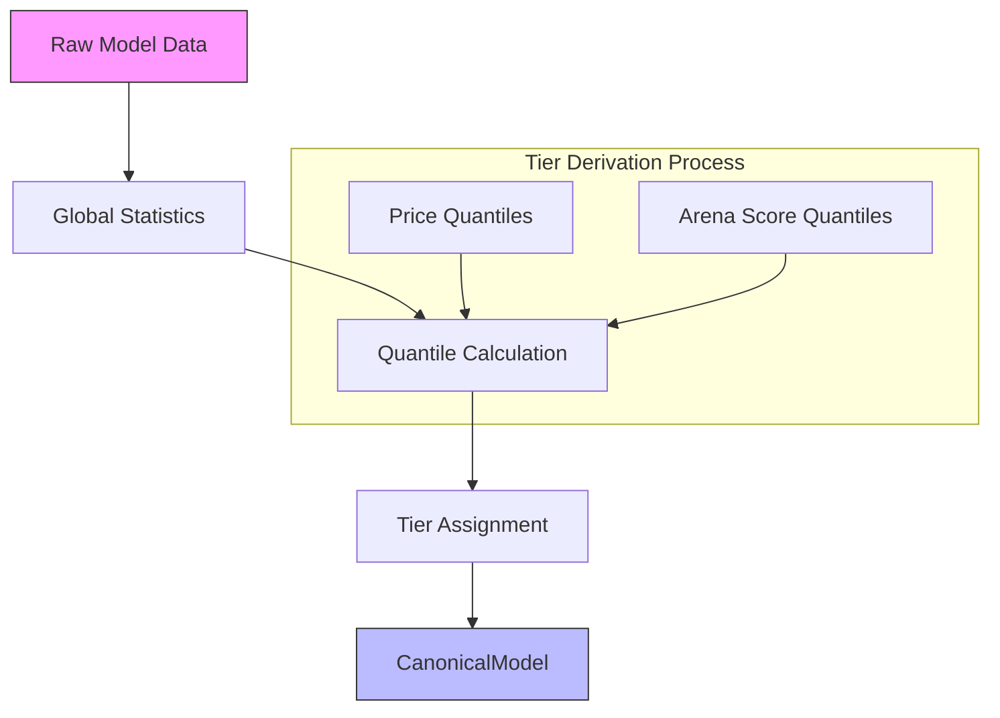
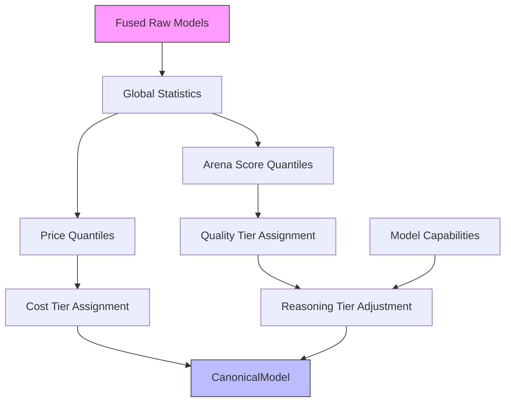

# Canonical Model Schema

<cite>
**Referenced Files in This Document**   
- [schema.py](file://packages/llmhub/src/llmhub/catalog/schema.py)
- [builder.py](file://packages/llmhub/src/llmhub/catalog/builder.py)
- [mapper.py](file://packages/llmhub/src/llmhub/catalog/mapper.py)
- [plan-catalog.md](file://packages/llmhub/src/llmhub/PLANS/plan-catalog.md)
- [sp4_catalog_view/spec.md](file://packages/llmhub/src/llmhub/generator/sp4_catalog_view/spec.md)
- [README.md](file://README.md)
- [overrides.json](file://packages/llmhub/src/llmhub/catalog/data/overrides.json)
</cite>

## Table of Contents
1. [Introduction](#introduction)
2. [Core Fields](#core-fields)
3. [Identity Fields](#identity-fields)
4. [Capabilities](#capabilities)
5. [Limits](#limits)
6. [Pricing](#pricing)
7. [Derived Tiers](#derived-tiers)
8. [Quality Scores](#quality-scores)
9. [Metadata](#metadata)
10. [Tags](#tags)
11. [Default Values and Optional Fields](#default-values-and-optional-fields)
12. [Tier Derivation Logic](#tier-derivation-logic)
13. [Tag Generation](#tag-generation)
14. [Usage by Downstream Components](#usage-by-downstream-components)
15. [Example JSON Output](#example-json-output)

## Introduction

The CanonicalModel schema represents the unified view of each Large Language Model (LLM) in the catalog, serving as the core business object used by the generator and user interface. It consolidates data from multiple sources—any-llm for discoverability, models.dev for metadata, and LMArena for quality scores—into a single, enriched representation. This schema enables intelligent model selection based on cost, quality, capabilities, and other attributes, allowing the system to make configuration-driven decisions rather than hardcoding model choices in application code.

The CanonicalModel is part of a larger catalog system that discovers callable models on the current machine, enriches them with external metadata, fuses the data using ID mapping, computes global statistics, derives normalized tiers, and caches the result for fast access. The schema is designed to support both human-readable information and machine-processable data for automated decision-making.

**Section sources**
- [schema.py](file://packages/llmhub/src/llmhub/catalog/schema.py#L68-L122)
- [README.md](file://README.md#L322-L347)
- [plan-catalog.md](file://packages/llmhub/src/llmhub/PLANS/plan-catalog.md#L131-L151)

## Core Fields

The CanonicalModel schema contains several categories of fields that provide a comprehensive view of each LLM. These fields are organized into logical groups: identity, capabilities, limits, pricing, derived tiers, quality scores, metadata, and tags. The schema is implemented as a Pydantic model, ensuring data validation and type safety.

The core structure includes basic identity information such as canonical_id, provider, and model_id, which uniquely identify each model in the catalog. It also includes human-friendly fields like family and display_name that provide context about the model's lineage and presentation. The schema is designed to be extensible while maintaining backward compatibility through careful versioning of the catalog.



**Diagram sources**
- [schema.py](file://packages/llmhub/src/llmhub/catalog/schema.py#L68-L122)

**Section sources**
- [schema.py](file://packages/llmhub/src/llmhub/catalog/schema.py#L68-L122)

## Identity Fields

The identity fields in the CanonicalModel schema provide unique identification and basic information about each LLM. These fields form the foundation of the model representation and are used for matching, filtering, and display purposes.

The `canonical_id` field is a unique identifier constructed as "provider/model_id" (e.g., "openai/gpt-4o") that serves as the primary key for model records across different data sources. The `provider` field indicates the organization or service offering the model (e.g., "openai", "anthropic"), while the `model_id` specifies the particular model variant within that provider's ecosystem.

Additional identity fields include `family`, which groups related models (e.g., "GPT-4o", "Claude 3.5 Sonnet"), and `display_name`, which provides a human-friendly name for presentation in user interfaces. When family information is not available from source data, it can be inferred from the model_id using override mappings defined in the system configuration.

**Section sources**
- [schema.py](file://packages/llmhub/src/llmhub/catalog/schema.py#L73-L78)
- [mapper.py](file://packages/llmhub/src/llmhub/catalog/mapper.py#L20-L30)
- [overrides.json](file://packages/llmhub/src/llmhub/catalog/data/overrides.json#L20-L30)

## Capabilities

The capabilities fields in the CanonicalModel schema describe the functional features and modalities supported by each LLM. These fields enable the system to filter and select models based on their technical abilities for specific use cases.

Key capability fields include:
- `supports_reasoning`: Indicates whether the model supports extended reasoning capabilities (default: False)
- `supports_tool_call`: Indicates whether the model can call functions or tools (default: False)
- `supports_structured_output`: Indicates whether the model can produce structured output like JSON (default: False)

The schema also includes modality information through `input_modalities` and `output_modalities` fields, which are lists of strings indicating supported input and output types (default: ["text"] for both). Common modalities include "text", "image", and "audio". The `attachments` field lists additional file types the model can process.

These capabilities are primarily sourced from the models.dev metadata API and are used by downstream components to ensure models are only selected for tasks they can perform. For example, a model without `supports_tool_call` would not be selected for applications requiring function calling.

**Section sources**
- [schema.py](file://packages/llmhub/src/llmhub/catalog/schema.py#L80-L87)
- [builder.py](file://packages/llmhub/src/llmhub/catalog/builder.py#L220-L227)

## Limits

The limits fields in the CanonicalModel schema define the technical constraints of each LLM, particularly regarding token processing capacity. These limits are crucial for determining whether a model can handle specific workloads and for preventing errors during inference.

The primary limit fields are:
- `context_tokens`: The maximum context window size in tokens (optional)
- `max_input_tokens`: The maximum number of input tokens the model can accept (optional)
- `max_output_tokens`: The maximum number of output tokens the model can generate (optional)

These values are sourced from the models.dev metadata API and represent the hard limits imposed by each model. They are used by the system to validate that input prompts will fit within a model's capacity and to set appropriate parameters for API calls. When these values are not available from the source data, they remain as optional fields with None values, allowing the system to handle models with unknown limits.

**Section sources**
- [schema.py](file://packages/llmhub/src/llmhub/catalog/schema.py#L88-L92)
- [builder.py](file://packages/llmhub/src/llmhub/catalog/builder.py#L228-L232)

## Pricing

The pricing fields in the CanonicalModel schema provide cost information for using each LLM, expressed in price per million tokens. This pricing data enables cost-aware model selection and budget optimization.

The pricing fields include:
- `price_input_per_million`: Cost per million input tokens (optional)
- `price_output_per_million`: Cost per million output tokens (optional)
- `price_reasoning_per_million`: Cost per million tokens for reasoning operations (optional)

These values are sourced from the models.dev metadata API and represent the current pricing structure for each model. The pricing information is used to calculate average costs and derive the `cost_tier` field, which normalizes cost across models on a 1-5 scale. When pricing data is unavailable, the fields remain optional with None values, and the model receives a default medium cost tier.

**Section sources**
- [schema.py](file://packages/llmhub/src/llmhub/catalog/schema.py#L93-L97)
- [builder.py](file://packages/llmhub/src/llmhub/catalog/builder.py#L233-L237)

## Derived Tiers

The derived tiers in the CanonicalModel schema provide normalized, comparable ratings for each model across key dimensions: quality, reasoning, creativity, and cost. These tiers use a 1-5 scale where 1 represents the best/lowest value and 5 represents the worst/highest value, enabling straightforward comparison and filtering.

The tier fields are:
- `quality_tier`: Based on LMArena scores or provider reputation (default: 3)
- `reasoning_tier`: Quality tier adjusted for reasoning capability (default: 3)
- `creative_tier`: Currently based on quality tier (default: 3)
- `cost_tier`: Based on price quantiles (default: 3)

These tiers are derived during catalog building by comparing each model's metrics against global quantiles calculated from all available models. The tier system abstracts away absolute values and provides a standardized way to express preferences (e.g., "low cost", "high quality") in model selection logic.



**Diagram sources**
- [builder.py](file://packages/llmhub/src/llmhub/catalog/builder.py#L114-L157)
- [schema.py](file://packages/llmhub/src/llmhub/catalog/schema.py#L98-L103)

**Section sources**
- [schema.py](file://packages/llmhub/src/llmhub/catalog/schema.py#L98-L103)
- [builder.py](file://packages/llmhub/src/llmhub/catalog/builder.py#L114-L157)

## Quality Scores

The quality scores fields in the CanonicalModel schema provide objective, crowdsourced evaluations of model performance, primarily sourced from LMArena's arena-catalog. These scores enable quality-aware model selection based on empirical human evaluations rather than marketing claims.

The quality fields include:
- `arena_score`: The primary LMArena rating (optional)
- `arena_ci_low`: Lower bound of the confidence interval (optional)
- `arena_ci_high`: Upper bound of the confidence interval (optional)

The arena_score is an ELO-style rating derived from human preference comparisons in the LMArena platform. Higher scores indicate better performance. When arena scores are unavailable, the system falls back to provider-based reputation to assign a quality tier. The confidence intervals provide information about the reliability of the score based on the number of evaluations.

These quality metrics are particularly valuable for distinguishing between models with similar specifications but different performance characteristics, allowing the system to select models that truly perform better for specific tasks.

**Section sources**
- [schema.py](file://packages/llmhub/src/llmhub/catalog/schema.py#L104-L108)
- [builder.py](file://packages/llmhub/src/llmhub/catalog/builder.py#L256-L258)

## Metadata

The metadata fields in the CanonicalModel schema provide contextual information about each LLM, including temporal data and licensing characteristics. This metadata helps users understand the model's recency, update frequency, and openness.

Key metadata fields include:
- `knowledge_cutoff`: Date when the model's training data was last updated (optional)
- `release_date`: When the model was initially released (optional)
- `last_updated`: When the model information was last updated (optional)
- `open_weights`: Whether the model has open weights (default: False)

The knowledge cutoff is particularly important for applications requiring up-to-date information, as it indicates the latest events the model could have learned about during training. The open_weights flag identifies models that are more transparent and potentially suitable for on-premises deployment or fine-tuning.

This metadata is primarily sourced from the models.dev API and provides valuable context for model selection beyond pure performance metrics.

**Section sources**
- [schema.py](file://packages/llmhub/src/llmhub/catalog/schema.py#L109-L114)
- [builder.py](file://packages/llmhub/src/llmhub/catalog/builder.py#L260-L264)

## Tags

The tags field in the CanonicalModel schema contains a dynamically generated list of string identifiers that categorize each model based on its capabilities and characteristics. These tags provide a flexible, human-readable way to filter and search for models with specific features.

Tags are automatically generated during catalog building based on the model's attributes. Common tags include:
- "reasoning": For models with `supports_reasoning` = True
- "tools": For models with `supports_tool_call` = True
- "structured-output": For models with `supports_structured_output` = True
- "open-weights": For models with `open_weights` = True
- "vision": For models that accept image input
- "audio-input": For models that accept audio input
- "image-gen": For models that can generate images

The tag generation process examines the model's capabilities, modalities, and metadata to create a comprehensive set of descriptors. These tags are used by user interfaces and selection algorithms to quickly identify models with desired characteristics without needing to inspect individual boolean flags.

**Section sources**
- [schema.py](file://packages/llmhub/src/llmhub/catalog/schema.py#L114)
- [builder.py](file://packages/llmhub/src/llmhub/catalog/builder.py#L159-L181)

## Default Values and Optional Fields

The CanonicalModel schema carefully distinguishes between required and optional fields, with sensible defaults for boolean and list fields to ensure usability even when source data is incomplete.

Required fields (no default, must be provided):
- `canonical_id`, `provider`, `model_id`

Fields with defaults:
- Boolean fields default to False: `supports_reasoning`, `supports_tool_call`, `supports_structured_output`, `open_weights`
- List fields default to empty lists or predefined values: `input_modalities` and `output_modalities` default to ["text"], `attachments` and `tags` default to empty lists
- Tier fields default to 3 (medium): `quality_tier`, `reasoning_tier`, `creative_tier`, `cost_tier`

Optional fields (can be None):
- All limit fields: `context_tokens`, `max_input_tokens`, `max_output_tokens`
- All pricing fields: `price_input_per_million`, `price_output_per_million`, `price_reasoning_per_million`
- Quality score fields: `arena_score`, `arena_ci_low`, `arena_ci_high`
- Metadata date fields: `knowledge_cutoff`, `release_date`, `last_updated`
- Descriptive fields: `family`, `display_name`

This design ensures that the schema is robust to missing data from source systems while providing enough information for meaningful model comparison and selection.

**Section sources**
- [schema.py](file://packages/llmhub/src/llmhub/catalog/schema.py#L68-L122)

## Tier Derivation Logic

The tier derivation logic in the catalog system transforms raw metrics into normalized 1-5 scale ratings that enable consistent model comparison across different dimensions. This process occurs during catalog building and relies on global statistics calculated from all available models.

For cost tiers, the system calculates price quantiles (20th, 40th, 60th, 80th percentiles) based on the average of input and output pricing. Models are then assigned tiers:
- Tier 1: Price ≤ 20th percentile (cheapest)
- Tier 2: Price ≤ 40th percentile
- Tier 3: Price ≤ 60th percentile (medium)
- Tier 4: Price ≤ 80th percentile
- Tier 5: Price > 80th percentile (most expensive)

For quality tiers, the system uses arena score quantiles when available:
- Tier 1: Score ≥ 80th percentile (best quality)
- Tier 2: Score ≥ 60th percentile
- Tier 3: Score ≥ 40th percentile (medium quality)
- Tier 4: Score ≥ 20th percentile
- Tier 5: Score < 20th percentile (worst quality)

When arena scores are unavailable, the system falls back to provider-based reputation (e.g., Anthropic=1, OpenAI=2, others=3). The reasoning tier starts with the quality tier but is improved by one level (capped at 1) if the model supports reasoning capabilities.



**Diagram sources**
- [builder.py](file://packages/llmhub/src/llmhub/catalog/builder.py#L70-L157)

**Section sources**
- [builder.py](file://packages/llmhub/src/llmhub/catalog/builder.py#L70-L157)

## Tag Generation

The tag generation process dynamically creates descriptive labels for each model based on its capabilities and metadata. This occurs during the canonical model derivation phase and follows a systematic set of rules to ensure consistency.

The process examines several aspects of the model:
- Capabilities: Checks boolean flags for reasoning, tool calling, and structured output
- Modalities: Examines input and output modalities for vision, audio, and image generation capabilities
- Licensing: Checks the open_weights flag
- Metadata: Uses family and other descriptive information

The algorithm iterates through the model's attributes and adds appropriate tags:
- "reasoning" if supports_reasoning is True
- "tools" if supports_tool_call is True  
- "structured-output" if supports_structured_output is True
- "open-weights" if open_weights is True
- "vision" if "image" is in input_modalities
- "audio-input" if "audio" is in input_modalities
- "image-gen" if "image" is in output_modalities

This dynamic tagging system ensures that models are properly categorized even as new capabilities emerge, without requiring schema changes. The tags provide a flexible filtering mechanism for both user interfaces and automated selection algorithms.

**Section sources**
- [builder.py](file://packages/llmhub/src/llmhub/catalog/builder.py#L159-L181)

## Usage by Downstream Components

The CanonicalModel schema is consumed by several downstream components, most notably the generator's SP4 Catalog View, which adapts the catalog snapshot into a list of CanonicalModel objects for the selection process.

The SP4 Catalog View provides a clean interface between the catalog system and the generator's selection logic, with a simple API:
```python
def load_catalog_view(
    ttl_hours: int = 24,
    force_refresh: bool = False,
    catalog_override: Optional[list[CanonicalModel]] = None
) -> list[CanonicalModel]
```

This component wraps the catalog builder with error handling and supports test injection via the catalog_override parameter. It respects the catalog's TTL-based caching mechanism unless force_refresh is specified.

The derived tiers (cost_tier, quality_tier, etc.) are particularly valuable for the generator, as they enable preference-based model selection where roles can specify requirements like "low cost" or "high quality" without knowing specific model names. The tags field allows for capability-based filtering, ensuring that models are only selected for tasks they can perform.

The schema's design ensures that downstream components can make intelligent selection decisions based on rich metadata without needing to understand the complexities of the underlying data sources or fusion process.

**Section sources**
- [sp4_catalog_view/spec.md](file://packages/llmhub/src/llmhub/generator/sp4_catalog_view/spec.md)
- [loader.py](file://packages/llmhub/src/llmhub/generator/sp4_catalog_view/loader.py)

## Example JSON Output

The following example shows the serialized JSON representation of a CanonicalModel instance, demonstrating how the schema fields are populated in practice:

```json
{
  "canonical_id": "openai/gpt-4o",
  "provider": "openai",
  "model_id": "gpt-4o",
  "family": "GPT-4o",
  "display_name": "gpt-4o",
  "supports_reasoning": true,
  "supports_tool_call": true,
  "supports_structured_output": true,
  "input_modalities": ["text", "image"],
  "output_modalities": ["text"],
  "attachments": [],
  "context_tokens": 128000,
  "max_input_tokens": 128000,
  "max_output_tokens": 4096,
  "price_input_per_million": 5.0,
  "price_output_per_million": 15.0,
  "price_reasoning_per_million": null,
  "quality_tier": 1,
  "reasoning_tier": 1,
  "creative_tier": 1,
  "cost_tier": 3,
  "arena_score": 1348.0,
  "arena_ci_low": 1330.0,
  "arena_ci_high": 1366.0,
  "knowledge_cutoff": "2023-10",
  "release_date": "2024-05-13",
  "last_updated": "2024-10-22",
  "open_weights": false,
  "tags": ["reasoning", "tools", "structured-output", "vision"]
}
```

This example illustrates a high-performing model with strong reasoning capabilities, vision support, and excellent quality scores. The tier values reflect its top-tier quality (1) but medium cost (3), while the tags provide a quick overview of its key capabilities. The pricing shows a common pattern where output tokens are more expensive than input tokens.

**Section sources**
- [schema.py](file://packages/llmhub/src/llmhub/catalog/schema.py#L68-L122)
- [cache.py](file://packages/llmhub/src/llmhub/catalog/cache.py#L83-L87)