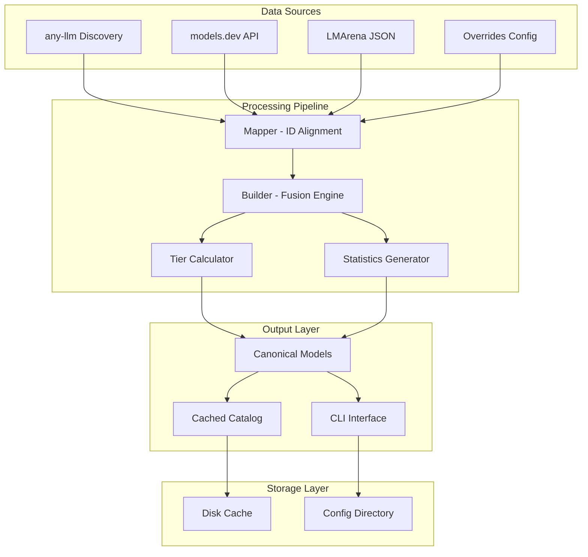
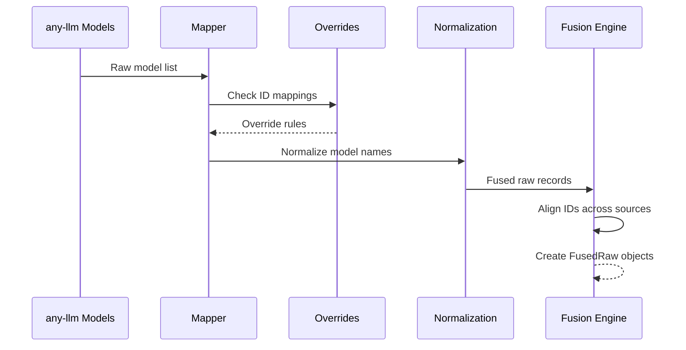
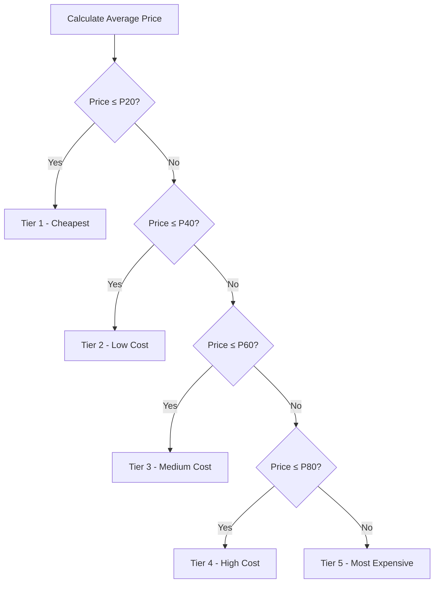
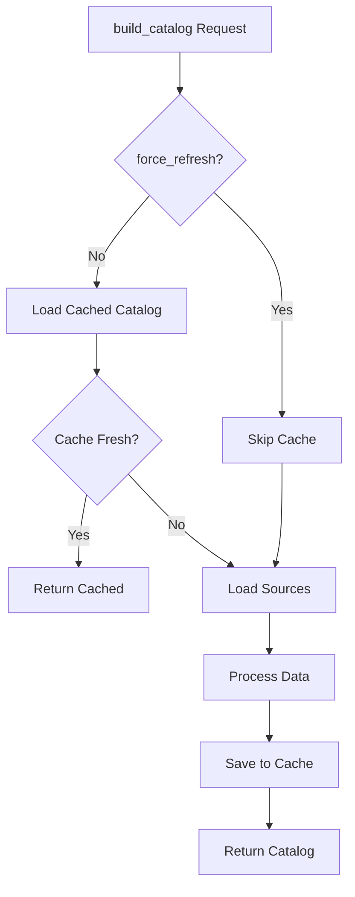

# Catalog System

<cite>
**Referenced Files in This Document**
- [builder.py](file://packages/llmhub/src/llmhub/catalog/builder.py)
- [mapper.py](file://packages/llmhub/src/llmhub/catalog/mapper.py)
- [cache.py](file://packages/llmhub/src/llmhub/catalog/cache.py)
- [schema.py](file://packages/llmhub/src/llmhub/catalog/schema.py)
- [anyllm_source.py](file://packages/llmhub/src/llmhub/catalog/anyllm_source.py)
- [modelsdev_source.py](file://packages/llmhub/src/llmhub/catalog/modelsdev_source.py)
- [arena_source.py](file://packages/llmhub/src/llmhub/catalog/arena_source.py)
- [overrides.json](file://packages/llmhub/src/llmhub/catalog/data/overrides.json)
- [catalog_cmd.py](file://packages/llmhub/src/llmhub/commands/catalog_cmd.py)
- [__init__.py](file://packages/llmhub/src/llmhub/catalog/__init__.py)
- [plan-catalog.md](file://packages/llmhub/src/llmhub/PLANS/plan-catalog.md)
</cite>

## Table of Contents
1. [Introduction](#introduction)
2. [System Architecture](#system-architecture)
3. [Data Sources](#data-sources)
4. [Fusion Process](#fusion-process)
5. [Tier Derivation](#tier-derivation)
6. [Caching Mechanism](#caching-mechanism)
7. [CanonicalModel Schema](#canonicalmodel-schema)
8. [Usage Patterns](#usage-patterns)
9. [Implementation Details](#implementation-details)
10. [Troubleshooting](#troubleshooting)

## Introduction

The Catalog System is a sophisticated aggregation and enrichment engine that combines metadata from multiple LLM data sources to create a unified, canonical model catalog. This system serves as the central intelligence hub for model discovery, comparison, and selection within the LLM Hub ecosystem.

The Catalog System aggregates three primary data sources:
- **any-llm**: Local discovery of callable models based on API keys and provider configurations
- **models.dev**: Comprehensive pricing, capabilities, and technical specifications
- **LMArena**: Quality scores and comparative performance metrics

Through intelligent fusion and statistical analysis, the system derives normalized tiers (1-5 scale) for cost, quality, reasoning, and creativity, enabling sophisticated model selection and filtering capabilities.

## System Architecture

The Catalog System follows a modular, pipeline-based architecture that separates concerns between data acquisition, fusion, computation, and presentation.



**Diagram sources**
- [builder.py](file://packages/llmhub/src/llmhub/catalog/builder.py#L302-L388)
- [mapper.py](file://packages/llmhub/src/llmhub/catalog/mapper.py#L32-L114)
- [cache.py](file://packages/llmhub/src/llmhub/catalog/cache.py#L37-L111)

**Section sources**
- [builder.py](file://packages/llmhub/src/llmhub/catalog/builder.py#L1-L388)
- [schema.py](file://packages/llmhub/src/llmhub/catalog/schema.py#L1-L122)

## Data Sources

### any-llm Source

The any-llm source discovers models that are actually callable in the current environment by introspecting the any-llm configuration and available API keys.

**Key Features:**
- Automatic provider detection (OpenAI, Anthropic, Google, Mistral, DeepSeek, Qwen, etc.)
- Environment-aware model availability
- Graceful handling of missing or invalid API keys
- Dynamic provider enumeration

**Implementation Details:**
The system attempts to connect to common providers and builds a list of callable models. If any-llm is not available, the system gracefully falls back to empty model lists while continuing to process other data sources.

**Section sources**
- [anyllm_source.py](file://packages/llmhub/src/llmhub/catalog/anyllm_source.py#L1-L49)

### models.dev Source

The models.dev source provides authoritative metadata including pricing, capabilities, limits, and technical specifications for LLM models.

**Key Features:**
- Comprehensive pricing information (per million tokens)
- Capability flags (reasoning, tools, structured output)
- Modalities support (text, image, audio)
- Context length and token limits
- Release dates and knowledge cutoffs
- Open weights and licensing information

**Data Processing:**
The system normalizes the models.dev JSON structure into a flattened dictionary keyed by canonical IDs, ensuring consistent access patterns across the system.

**Section sources**
- [modelsdev_source.py](file://packages/llmhub/src/llmhub/catalog/modelsdev_source.py#L1-L142)

### LMArena Source

The LMArena source provides quality scores and comparative performance metrics derived from community-driven benchmarking.

**Key Features:**
- Elo-based quality ratings
- Confidence intervals (Q025, Q975)
- Multi-category scoring
- 24-hour TTL caching
- Vendor script integration

**Integration Process:**
The system integrates with the LMArena update script to maintain fresh leaderboard data, falling back to cached data when updates fail.

**Section sources**
- [arena_source.py](file://packages/llmhub/src/llmhub/catalog/arena_source.py#L1-L227)

## Fusion Process

The fusion process aligns data from disparate sources using intelligent ID mapping and override mechanisms.



**Diagram sources**
- [mapper.py](file://packages/llmhub/src/llmhub/catalog/mapper.py#L32-L114)

### ID Mapping Strategy

The fusion process employs a hierarchical matching strategy:

1. **Direct Match**: Exact canonical ID alignment
2. **Override Mapping**: Static mappings from overrides.json
3. **Fuzzy Matching**: Normalized model name matching
4. **Fallback Resolution**: Provider-based resolution

**Mapping Rules:**
- Canonical ID format: `{provider}/{model_id}`
- Priority order: direct match → override → fuzzy match
- Fuzzy normalization removes hyphens, underscores, and spaces

**Section sources**
- [mapper.py](file://packages/llmhub/src/llmhub/catalog/mapper.py#L32-L114)

## Tier Derivation

The system computes four normalized tiers (1-5 scale) for each model, where 1 represents the best/worst value and 5 represents the worst/best value.

### Cost Tier Calculation

Cost tiers are derived from average pricing (input + output per million tokens):



**Diagram sources**
- [builder.py](file://packages/llmhub/src/llmhub/catalog/builder.py#L114-L129)

### Quality Tier Calculation

Quality tiers use arena scores with fallback provider reputation:

1. **Primary**: Arena score quantiles (higher score = better quality)
2. **Fallback**: Provider reputation tiers (OpenAI: 1, Anthropic: 2, Others: 3+)

### Reasoning and Creative Tiers

- **Reasoning Tier**: Starts as quality tier, improved by reasoning support
- **Creative Tier**: Initially matches quality tier, subject to refinement

**Section sources**
- [builder.py](file://packages/llmhub/src/llmhub/catalog/builder.py#L70-L300)

## Caching Mechanism

The caching system provides persistent storage with configurable Time-To-Live (TTL) behavior.

### Cache Location

**Platform-Specific Paths:**
- **macOS**: `~/.config/llmhub/catalog.json`
- **Windows**: `%APPDATA%\llmhub\catalog.json`
- **Linux**: `~/.config/llmhub/catalog.json`

### TTL Behavior

- **Default TTL**: 24 hours
- **Force Refresh**: Ignores cache, rebuilds from sources
- **Stale Data**: Used when refresh fails
- **Corruption Handling**: Automatic cleanup and regeneration

### Cache Operations



**Diagram sources**
- [cache.py](file://packages/llmhub/src/llmhub/catalog/cache.py#L37-L111)

**Section sources**
- [cache.py](file://packages/llmhub/src/llmhub/catalog/cache.py#L1-L111)

## CanonicalModel Schema

The CanonicalModel represents the unified, enriched model record containing all available metadata and derived attributes.

### Core Identity Fields

| Field | Type | Description |
|-------|------|-------------|
| `canonical_id` | `str` | Unique identifier: `{provider}/{model_id}` |
| `provider` | `str` | Model provider name |
| `model_id` | `str` | Original model identifier |
| `family` | `Optional[str]` | Model family/grouping |
| `display_name` | `Optional[str]` | Human-readable name |

### Capability Flags

| Field | Type | Description |
|-------|------|-------------|
| `supports_reasoning` | `bool` | Reasoning capabilities enabled |
| `supports_tool_call` | `bool` | Tool/function calling support |
| `supports_structured_output` | `bool` | Structured response format |
| `input_modalities` | `list[str]` | Supported input types (text, image, audio) |
| `output_modalities` | `list[str]` | Supported output types |
| `attachments` | `list[str]` | Attachment handling support |

### Limitations and Pricing

| Field | Type | Description |
|-------|------|-------------|
| `context_tokens` | `Optional[int]` | Maximum context length |
| `max_input_tokens` | `Optional[int]` | Maximum input token limit |
| `max_output_tokens` | `Optional[int]` | Maximum output token limit |
| `price_input_per_million` | `Optional[float]` | Input pricing per million tokens |
| `price_output_per_million` | `Optional[float]` | Output pricing per million tokens |
| `price_reasoning_per_million` | `Optional[float]` | Reasoning pricing per million tokens |

### Derived Attributes

| Field | Type | Description |
|-------|------|-------------|
| `quality_tier` | `int` | Quality ranking (1-5) |
| `reasoning_tier` | `int` | Reasoning capability ranking |
| `creative_tier` | `int` | Creative capability ranking |
| `cost_tier` | `int` | Cost efficiency ranking |
| `arena_score` | `Optional[float]` | LMArena quality rating |
| `arena_ci_low` | `Optional[float]` | Lower confidence interval |
| `arena_ci_high` | `Optional[float]` | Upper confidence interval |

### Metadata Fields

| Field | Type | Description |
|-------|------|-------------|
| `knowledge_cutoff` | `Optional[str]` | Knowledge cutoff date |
| `release_date` | `Optional[str]` | Model release date |
| `last_updated` | `Optional[str]` | Last metadata update |
| `open_weights` | `bool` | Open weights availability |
| `tags` | `list[str]` | Computed feature tags |

**Section sources**
- [schema.py](file://packages/llmhub/src/llmhub/catalog/schema.py#L68-L122)

## Usage Patterns

### CLI Commands

The Catalog System exposes two primary CLI commands for interaction:

#### `llmhub catalog show`

Displays the current catalog with filtering and detailed views:

```bash
# Show all models
llmhub catalog show

# Show specific provider
llmhub catalog show --provider openai

# Show detailed information
llmhub catalog show --details
```

#### `llmhub catalog refresh`

Forces a complete rebuild of the catalog from all data sources:

```bash
# Refresh with default 24-hour TTL
llmhub catalog refresh

# Refresh with custom TTL
llmhub catalog refresh --ttl-hours 12
```

### Programmatic Access

The system provides a clean Python API for programmatic access:

```python
from llmhub.catalog import build_catalog, load_cached_catalog

# Build fresh catalog
catalog = build_catalog(ttl_hours=24, force_refresh=True)

# Load cached catalog (if fresh)
cached_catalog = load_cached_catalog(ttl_hours=24)

# Access models
for model in catalog.models:
    print(f"{model.provider}/{model.model_id}: {model.quality_tier}")
```

**Section sources**
- [catalog_cmd.py](file://packages/llmhub/src/llmhub/commands/catalog_cmd.py#L1-L127)
- [__init__.py](file://packages/llmhub/src/llmhub/catalog/__init__.py#L1-L17)

## Implementation Details

### Builder Pipeline

The main build pipeline coordinates all components in a sequential fashion:

1. **Environment Setup**: Load `.env` files for API keys
2. **Cache Check**: Attempt to load from disk cache
3. **Source Loading**: Fetch data from all three sources
4. **Fusion**: Align and combine data records
5. **Statistics**: Compute global quantiles for tier derivation
6. **Canonicalization**: Transform fused records to CanonicalModels
7. **Caching**: Persist results to disk
8. **Return**: Provide Catalog object

### Override System

The override system resolves naming inconsistencies between data sources:

**Overrides Configuration:**
- **ID Mappings**: Direct canonical ID to alternate identifiers
- **Model Families**: Pattern-based family inference
- **Priority Order**: Specific mappings take precedence over fuzzy matching

**Section sources**
- [builder.py](file://packages/llmhub/src/llmhub/catalog/builder.py#L302-L388)
- [overrides.json](file://packages/llmhub/src/llmhub/catalog/data/overrides.json#L1-L32)

### Error Handling and Resilience

The system implements comprehensive error handling:

- **Graceful Degradation**: Missing sources don't prevent catalog creation
- **Retry Logic**: HTTP requests include basic retry mechanisms
- **Fallback Strategies**: Stale cache data when fresh data unavailable
- **Validation**: Pydantic models ensure data integrity
- **Logging**: Comprehensive logging for debugging and monitoring

## Troubleshooting

### Common Issues

#### No Models Found from any-llm

**Symptoms:** Empty catalog with warnings about API keys
**Causes:**
- Missing or invalid API keys
- No providers configured
- Network connectivity issues

**Solutions:**
1. Verify API keys in `.env` file
2. Check provider configuration
3. Test network connectivity
4. Review any-llm installation

#### Stale Arena Data

**Symptoms:** Outdated quality scores
**Causes:**
- Arena update script failures
- Network timeouts during updates
- Corrupted cache files

**Solutions:**
1. Force refresh: `llmhub catalog refresh`
2. Check internet connectivity
3. Clear cache manually
4. Verify LMArena service status

#### Cache Corruption

**Symptoms:** JSON parsing errors, malformed catalogs
**Causes:**
- Interrupted cache writes
- Disk space issues
- Concurrent access conflicts

**Solutions:**
1. Clear cache: `llmhub catalog refresh`
2. Check disk space
3. Verify file permissions
4. Monitor system resources

### Debugging Tools

#### Verbose Logging

Enable detailed logging by setting environment variables:
```bash
export LLMHUB_DEBUG=true
llmhub catalog show
```

#### Manual Cache Inspection

Inspect cached catalogs directly:
```bash
cat ~/.config/llmhub/catalog.json
```

#### Source Validation

Test individual data sources:
```python
from llmhub.catalog import build_catalog

# Test any-llm source
from llmhub.catalog.anyllm_source import load_anyllm_models
print(load_anyllm_models())

# Test models.dev source
from llmhub.catalog.modelsdev_source import fetch_modelsdev_json, normalize_modelsdev
data = fetch_modelsdev_json()
print(normalize_modelsdev(data))

# Test arena source
from llmhub.catalog.arena_source import load_arena_models
print(load_arena_models())
```

**Section sources**
- [builder.py](file://packages/llmhub/src/llmhub/catalog/builder.py#L337-L350)
- [cache.py](file://packages/llmhub/src/llmhub/catalog/cache.py#L94-L111)