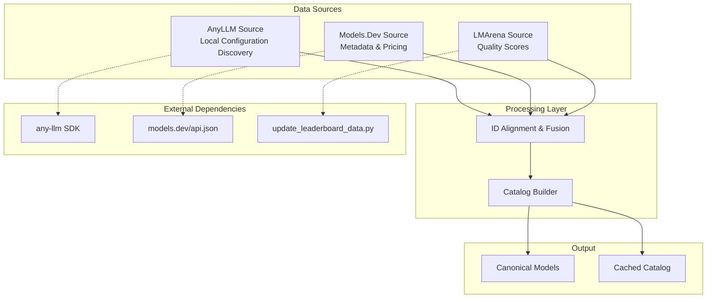
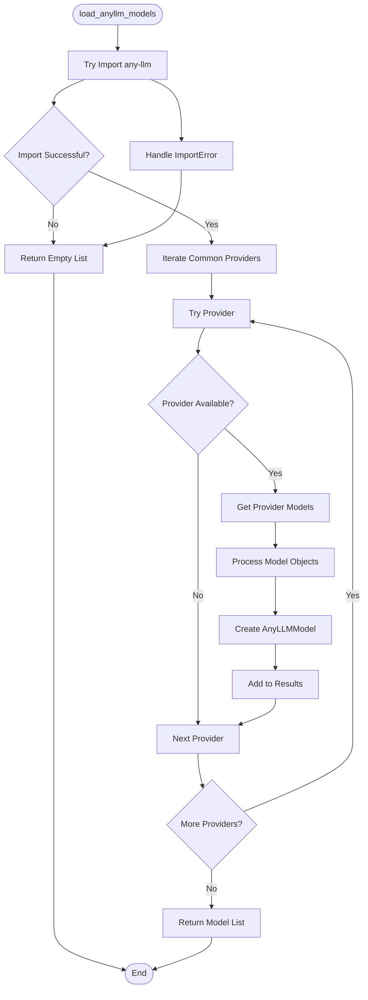
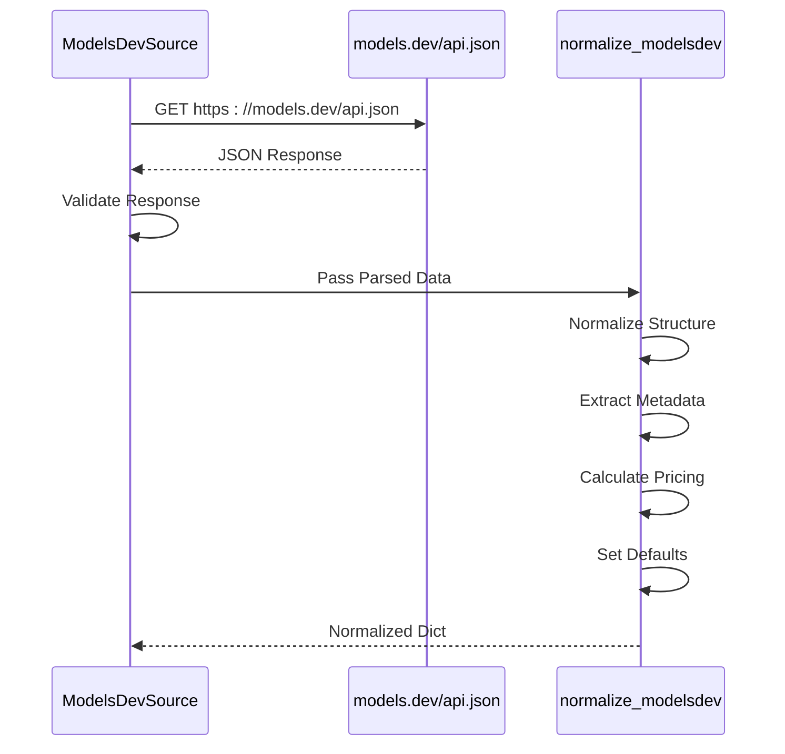
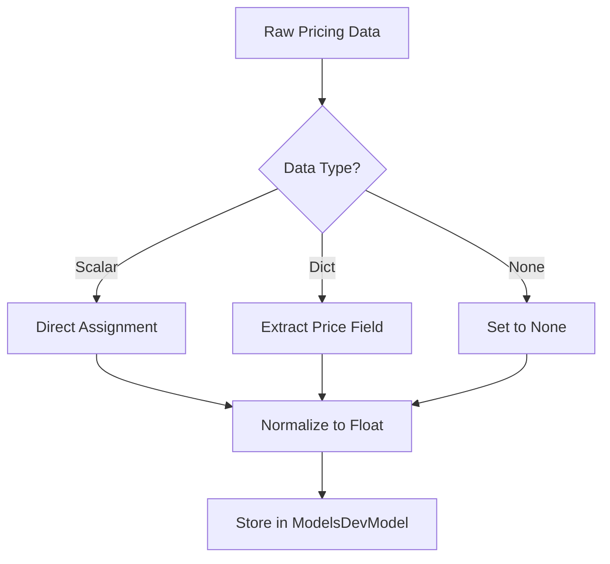
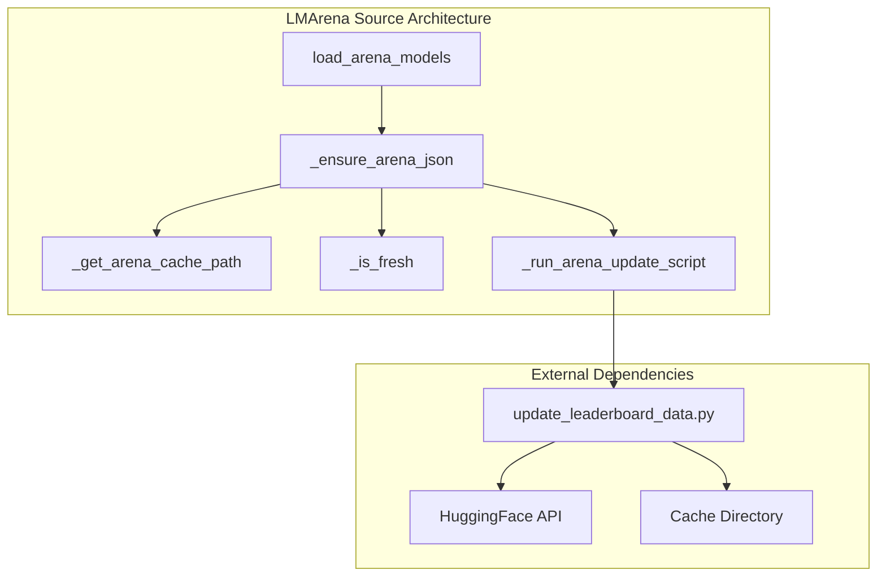
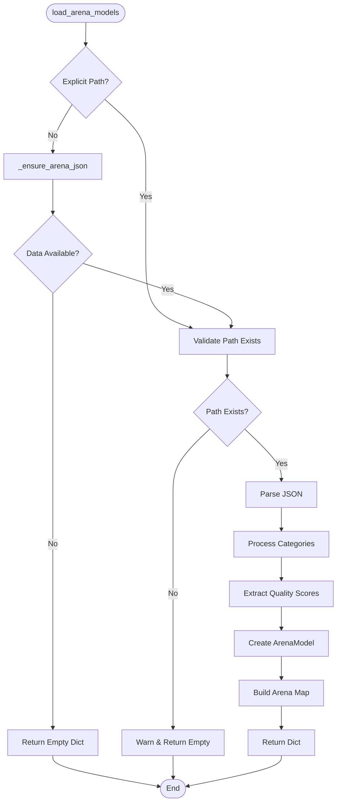
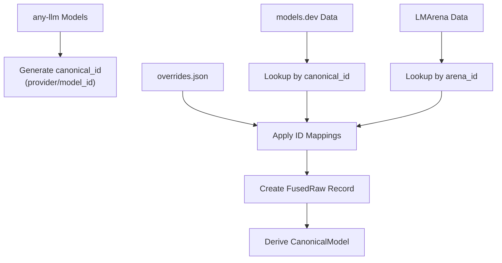
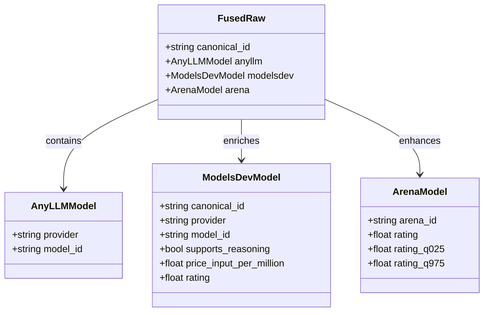
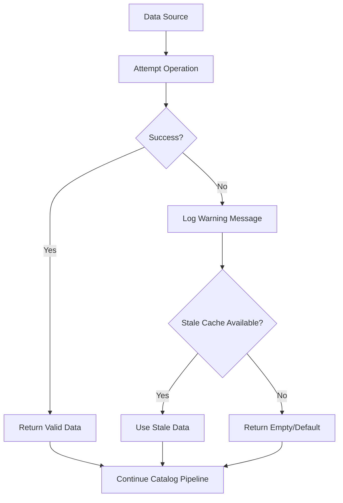

# Data Sources

<cite>
**Referenced Files in This Document**
- [anyllm_source.py](file://packages/llmhub/src/llmhub/catalog/anyllm_source.py)
- [modelsdev_source.py](file://packages/llmhub/src/llmhub/catalog/modelsdev_source.py)
- [arena_source.py](file://packages/llmhub/src/llmhub/catalog/arena_source.py)
- [schema.py](file://packages/llmhub/src/llmhub/catalog/schema.py)
- [overrides.json](file://packages/llmhub/src/llmhub/catalog/data/overrides.json)
- [update_leaderboard_data.py](file://packages/llmhub/src/llmhub/catalog/vendor/arena/update_leaderboard_data.py)
- [plan-catalog.md](file://packages/llmhub/src/llmhub/PLANS/plan-catalog.md)
- [PLAN-catalog-v1-arena-integration.md](file://packages/llmhub/src/llmhub/PLANS/# PLAN-catalog-v1-arena-integration.md)
</cite>

## Table of Contents
1. [Introduction](#introduction)
2. [System Architecture Overview](#system-architecture-overview)
3. [AnyLLM Source](#anyllm-source)
4. [Models.Dev Source](#modelsdev-source)
5. [LMArena Source](#lmaarena-source)
6. [Data Source Integration](#data-source-integration)
7. [Error Handling and Graceful Degradation](#error-handling-and-graceful-degradation)
8. [Performance Considerations](#performance-considerations)
9. [Troubleshooting Guide](#troubleshooting-guide)
10. [Conclusion](#conclusion)

## Introduction

The Catalog System integrates three distinct data sources to create a comprehensive, unified model catalog that powers the LLM Hub ecosystem. These sources provide essential information about available models, their capabilities, pricing, and quality metrics, enabling intelligent model selection and ranking within the system.

The three primary data sources are:
- **AnyLLM Source**: Discovers models available through the local any-llm configuration and API keys
- **Models.Dev Source**: Fetches authoritative metadata including pricing, limits, and capabilities from models.dev
- **LMArena Source**: Loads quality scores and Elo ratings from LMArena's leaderboard data

This documentation provides detailed coverage of each source's implementation, data structures, error handling mechanisms, and integration patterns within the broader Catalog System architecture.

## System Architecture Overview

The Catalog System follows a modular architecture where each data source operates independently while contributing to a unified canonical model representation.



**Diagram sources**
- [anyllm_source.py](file://packages/llmhub/src/llmhub/catalog/anyllm_source.py#L11-L49)
- [modelsdev_source.py](file://packages/llmhub/src/llmhub/catalog/modelsdev_source.py#L11-L142)
- [arena_source.py](file://packages/llmhub/src/llmhub/catalog/arena_source.py#L165-L227)

**Section sources**
- [plan-catalog.md](file://packages/llmhub/src/llmhub/PLANS/plan-catalog.md#L1-L50)
- [schema.py](file://packages/llmhub/src/llmhub/catalog/schema.py#L12-L122)

## AnyLLM Source

The AnyLLM source serves as the foundation for model availability discovery, introspecting the local any-llm configuration to determine which models are actually callable given the current environment and API keys.

### Core Functionality

The [`load_anyllm_models()`](file://packages/llmhub/src/llmhub/catalog/anyllm_source.py#L11-L49) function implements the primary discovery mechanism:



**Diagram sources**
- [anyllm_source.py](file://packages/llmhub/src/llmhub/catalog/anyllm_source.py#L11-L49)

### Supported Providers

The system attempts to discover models from the following common providers:

| Provider | Description |
|----------|-------------|
| openai | OpenAI GPT models |
| anthropic | Anthropic Claude models |
| google | Google Gemini models |
| mistral | Mistral AI models |
| deepseek | DeepSeek models |
| qwen | Alibaba Qwen models |
| groq | Groq inference platform |
| together | Together AI platform |
| cohere | Cohere AI models |
| ollama | Local Ollama deployments |

### Data Structure

The AnyLLM source produces [`AnyLLMModel`](file://packages/llmhub/src/llmhub/catalog/schema.py#L12-L16) instances containing:

- **provider**: String identifier (e.g., "openai", "anthropic")
- **model_id**: Specific model identifier (e.g., "gpt-4o-mini")

### Error Handling

The AnyLLM source implements robust error handling for various failure scenarios:

1. **Missing any-llm Package**: Returns empty list without crashing
2. **Invalid API Keys**: Silently skips unavailable providers
3. **Provider-Specific Errors**: Continues with remaining providers
4. **Model Object Parsing**: Gracefully handles malformed model objects

**Section sources**
- [anyllm_source.py](file://packages/llmhub/src/llmhub/catalog/anyllm_source.py#L1-L49)
- [schema.py](file://packages/llmhub/src/llmhub/catalog/schema.py#L12-L16)

## Models.Dev Source

The Models.Dev source fetches authoritative metadata from the models.dev API, providing comprehensive information about model capabilities, pricing, limits, and metadata.

### Data Acquisition Process

The [`fetch_modelsdev_json()`](file://packages/llmhub/src/llmhub/catalog/modelsdev_source.py#L11-L31) function handles HTTP communication with the models.dev API:



**Diagram sources**
- [modelsdev_source.py](file://packages/llmhub/src/llmhub/catalog/modelsdev_source.py#L11-L31)

### Data Normalization

The [`normalize_modelsdev()`](file://packages/llmhub/src/llmhub/catalog/modelsdev_source.py#L33-L142) function transforms the raw JSON structure into standardized [`ModelsDevModel`](file://packages/llmhub/src/llmhub/catalog/schema.py#L18-L49) instances:

#### Key Data Fields

| Category | Fields | Description |
|----------|--------|-------------|
| **Identity** | canonical_id, provider, model_id, family, display_name | Model identification and categorization |
| **Capabilities** | supports_reasoning, supports_tool_call, supports_structured_output, input_modalities, output_modalities, attachments | Functional capabilities |
| **Limits** | context_tokens, max_input_tokens, max_output_tokens | Token and context limitations |
| **Pricing** | price_input_per_million, price_output_per_million, price_reasoning_per_million | Cost per million tokens |
| **Metadata** | knowledge_cutoff, release_date, last_updated, open_weights | Lifecycle and licensing information |

### Pricing Normalization

The system handles various pricing formats and normalizes them to a consistent per-million-tokens basis:



**Diagram sources**
- [modelsdev_source.py](file://packages/llmhub/src/llmhub/catalog/modelsdev_source.py#L66-L91)

### Error Handling and Resilience

The Models.Dev source implements graceful degradation:

1. **Network Failures**: Returns empty dictionary with warning message
2. **Malformed JSON**: Logs error and continues with partial data
3. **Missing Fields**: Applies sensible defaults for missing capabilities
4. **API Changes**: Maintains backward compatibility through flexible parsing

**Section sources**
- [modelsdev_source.py](file://packages/llmhub/src/llmhub/catalog/modelsdev_source.py#L1-L142)
- [schema.py](file://packages/llmhub/src/llmhub/catalog/schema.py#L18-L49)

## LMArena Source

The LMArena source manages quality scores and Elo ratings from LMArena's leaderboard data, integrating with the official update script to maintain fresh quality information.

### Architecture and Integration

The LMArena source follows a sophisticated caching and refresh strategy:



**Diagram sources**
- [arena_source.py](file://packages/llmhub/src/llmhub/catalog/arena_source.py#L121-L162)

### Cache Management

The [`_ensure_arena_json()`](file://packages/llmhub/src/llmhub/catalog/arena_source.py#L121-L162) function implements a sophisticated TTL-based cache management system:

#### Cache Resolution Logic

1. **Path Resolution**: Determines cache location via environment variable or default path
2. **Freshness Check**: Validates file modification time against TTL threshold
3. **Refresh Decision**: Triggers script execution when cache is stale
4. **Fallback Strategy**: Provides graceful degradation when updates fail

### Data Processing Pipeline

The [`load_arena_models()`](file://packages/llmhub/src/llmhub/catalog/arena_source.py#L165-L227) function processes LMArena leaderboard data:



**Diagram sources**
- [arena_source.py](file://packages/llmhub/src/llmhub/catalog/arena_source.py#L165-L227)

### Quality Score Structure

The LMArena source produces [`ArenaModel`](file://packages/llmhub/src/llmhub/catalog/schema.py#L51-L58) instances containing:

| Field | Type | Description |
|-------|------|-------------|
| arena_id | str | Model identifier used by LMArena |
| rating | float | Elo-based quality score |
| rating_q025 | float \| None | Lower confidence interval |
| rating_q975 | float \| None | Upper confidence interval |
| category | str | Leaderboard category (e.g., "overall_text") |

### Update Script Integration

The system integrates with the official [`update_leaderboard_data.py`](file://packages/llmhub/src/llmhub/catalog/vendor/arena/update_leaderboard_data.py) script:

#### Script Execution Features

1. **Automatic Refresh**: Runs script when cache is stale
2. **Timeout Protection**: Implements 5-minute timeout
3. **Output Validation**: Verifies expected JSON files are created
4. **Error Reporting**: Provides detailed error messages for failures

#### Environment Configuration

| Variable | Purpose | Default |
|----------|---------|---------|
| LLMHUB_ARENA_CACHE_DIR | Custom cache directory | ~/.config/llmhub/arena |

**Section sources**
- [arena_source.py](file://packages/llmhub/src/llmhub/catalog/arena_source.py#L1-L227)
- [update_leaderboard_data.py](file://packages/llmhub/src/llmhub/catalog/vendor/arena/update_leaderboard_data.py#L1-L200)
- [schema.py](file://packages/llmhub/src/llmhub/catalog/schema.py#L51-L58)

## Data Source Integration

The three data sources integrate through a sophisticated mapping and fusion system that aligns model identifiers and combines metadata from multiple origins.

### ID Alignment Strategy

The system uses a multi-tier ID alignment strategy:



**Diagram sources**
- [overrides.json](file://packages/llmhub/src/llmhub/catalog/data/overrides.json#L1-L32)

### Override Mappings

The [`overrides.json`](file://packages/llmhub/src/llmhub/catalog/data/overrides.json) file provides static mappings for ID discrepancies:

#### Example Mappings

| Canonical ID | Models.Dev ID | Arena ID |
|--------------|---------------|----------|
| openai/gpt-4o | openai/gpt-4o | gpt-4o-2024-05-13 |
| openai/gpt-4o-mini | openai/gpt-4o-mini | gpt-4o-mini-2024-07-18 |
| anthropic/claude-3-5-sonnet-20241022 | anthropic/claude-3-5-sonnet-20241022 | claude-3-5-sonnet-20241022 |

### Fusion Process

The fusion process creates [`FusedRaw`](file://packages/llmhub/src/llmhub/catalog/schema.py#L60-L66) records combining data from all sources:



**Diagram sources**
- [schema.py](file://packages/llmhub/src/llmhub/catalog/schema.py#L60-L66)

**Section sources**
- [overrides.json](file://packages/llmhub/src/llmhub/catalog/data/overrides.json#L1-L32)
- [schema.py](file://packages/llmhub/src/llmhub/catalog/schema.py#L60-L66)

## Error Handling and Graceful Degradation

The Catalog System implements comprehensive error handling that ensures robust operation even when individual data sources fail or provide incomplete information.

### Failure Modes and Responses

| Source | Failure Mode | Response | Impact |
|--------|-------------|----------|---------|
| AnyLLM | Missing package | Empty model list | Limited availability discovery |
| Models.Dev | Network timeout | Empty metadata dict | Reduced capability information |
| Models.Dev | Malformed JSON | Partial data with warnings | Incomplete pricing/capabilities |
| LMArena | Script failure | Stale cache fallback | Quality scores unavailable |
| LMArena | Missing cache | Empty arena dict | Tier computation falls back to heuristics |

### Graceful Degradation Patterns



### Missing Data Handling

When data is missing from any source, the system applies sensible defaults:

#### Models.Dev Missing Fields
- **Capabilities**: False defaults for boolean flags
- **Pricing**: None values for cost information
- **Limits**: None values for token limits
- **Metadata**: Empty strings for textual fields

#### LMArena Missing Ratings
- **Quality Tiers**: Fall back to provider/family heuristics
- **Confidence Intervals**: None values for missing bounds
- **Category Selection**: Prefer "overall_text" when available

**Section sources**
- [anyllm_source.py](file://packages/llmhub/src/llmhub/catalog/anyllm_source.py#L43-L46)
- [modelsdev_source.py](file://packages/llmhub/src/llmhub/catalog/modelsdev_source.py#L28-L30)
- [arena_source.py](file://packages/llmhub/src/llmhub/catalog/arena_source.py#L155-L158)

## Performance Considerations

The Catalog System implements several performance optimization strategies to minimize latency and resource consumption.

### Caching Strategies

#### AnyLLM Source
- **Runtime Discovery**: Models are discovered at runtime based on current environment
- **No Persistent Cache**: Relies on any-llm's dynamic configuration introspection

#### Models.Dev Source
- **HTTP Caching**: No client-side caching (reliant on CDN)
- **Minimal Requests**: Single API call per catalog build
- **Timeout Protection**: 10-second timeout prevents hanging requests

#### LMArena Source
- **24-Hour TTL**: Prevents frequent script execution
- **Subprocess Isolation**: Script runs in separate process to prevent blocking
- **Selective Refresh**: Only refreshes when cache is stale

### Memory Optimization

The system minimizes memory usage through:

1. **Lazy Loading**: Data sources are loaded only when needed
2. **Streaming Processing**: Large datasets processed in chunks
3. **Object Reuse**: Shared instances for common data structures
4. **Garbage Collection**: Explicit cleanup of temporary objects

### Network Efficiency

Network requests are optimized through:

1. **Connection Pooling**: Reuses HTTP connections where possible
2. **Compression**: Supports gzip compression for API responses
3. **Retry Logic**: Implements exponential backoff for transient failures
4. **Timeout Management**: Prevents indefinite waits for slow responses

## Troubleshooting Guide

### Common Issues and Solutions

#### AnyLLM Source Problems

**Issue**: No models discovered despite valid API keys
- **Cause**: any-llm package not installed or misconfigured
- **Solution**: Install any-llm and verify API key configuration
- **Verification**: Check any-llm's own model listing functionality

**Issue**: Partial model discovery
- **Cause**: Some providers require specific API keys or configurations
- **Solution**: Verify credentials for each provider individually
- **Debugging**: Check any-llm logs for provider-specific errors

#### Models.Dev Source Problems

**Issue**: Network timeouts or connection failures
- **Cause**: Network connectivity or API rate limiting
- **Solution**: Retry with exponential backoff
- **Workaround**: Use cached data when available

**Issue**: Malformed JSON responses
- **Cause**: API endpoint changes or server errors
- **Solution**: Update to latest models.dev API version
- **Monitoring**: Log API response structure for debugging

#### LMArena Source Problems

**Issue**: Update script fails to execute
- **Cause**: Missing dependencies or permission issues
- **Solution**: Install required Python packages and verify permissions
- **Alternative**: Manually run update script and copy results

**Issue**: Stale leaderboard data
- **Cause**: Cache TTL exceeded or script failures
- **Solution**: Force refresh or manually trigger update
- **Monitoring**: Check cache modification timestamps

### Diagnostic Commands

#### Environment Verification
```bash
# Check any-llm installation
python -c "import any_llm; print(any_llm.__version__)"

# Test API connectivity
curl -I https://models.dev/api.json

# Verify cache directory
ls -la ~/.config/llmhub/arena/
```

#### Catalog Diagnostics
```bash
# Force refresh catalog
llmhub catalog refresh --force

# Check cache status
llmhub catalog show --verbose

# Debug mode (if available)
llmhub catalog debug
```

### Logging and Monitoring

The system provides comprehensive logging for troubleshooting:

1. **Warning Messages**: Non-fatal issues with suggested solutions
2. **Error Reports**: Fatal failures with stack traces
3. **Performance Metrics**: Timing information for optimization
4. **Debug Information**: Detailed operation logs for development

**Section sources**
- [anyllm_source.py](file://packages/llmhub/src/llmhub/catalog/anyllm_source.py#L38-L46)
- [modelsdev_source.py](file://packages/llmhub/src/llmhub/catalog/modelsdev_source.py#L28-L30)
- [arena_source.py](file://packages/llmhub/src/llmhub/catalog/arena_source.py#L155-L162)

## Conclusion

The three data sources—AnyLLM, Models.Dev, and LMArena—provide a comprehensive foundation for the Catalog System, each contributing unique and complementary information about available models. The system's robust architecture ensures reliable operation through sophisticated error handling, graceful degradation, and performance optimizations.

Key strengths of the implementation include:

- **Modular Design**: Each source operates independently while contributing to a unified catalog
- **Resilient Architecture**: Graceful handling of failures ensures continuous operation
- **Performance Optimization**: Intelligent caching and lazy loading minimize resource usage
- **Extensible Structure**: Easy addition of new data sources or enhancement of existing ones
- **Backward Compatibility**: Maintains compatibility with evolving external APIs and data formats

The integration of these diverse data sources enables the Catalog System to provide users with accurate, up-to-date information about available models, empowering intelligent model selection and ranking within the LLM Hub ecosystem. Future enhancements can build upon this solid foundation while maintaining the system's reliability and performance characteristics.