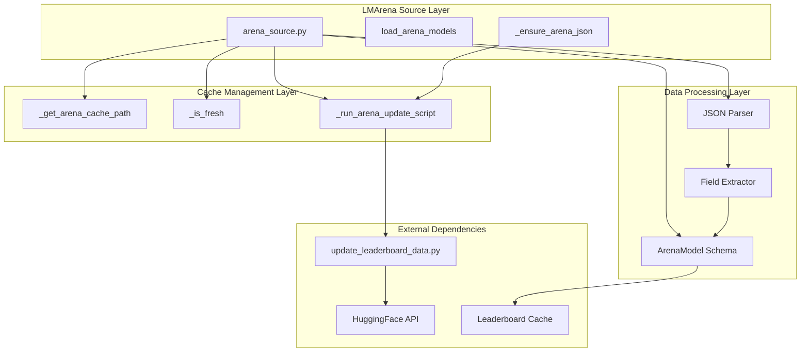
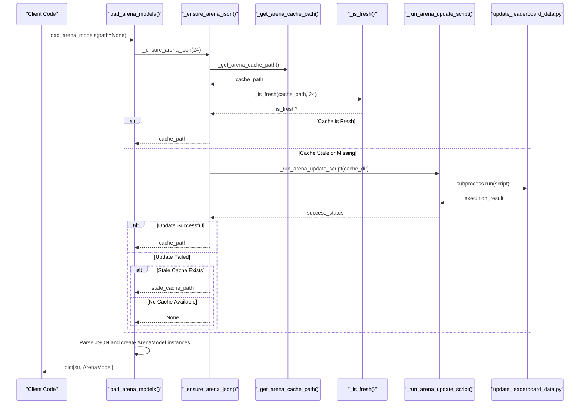
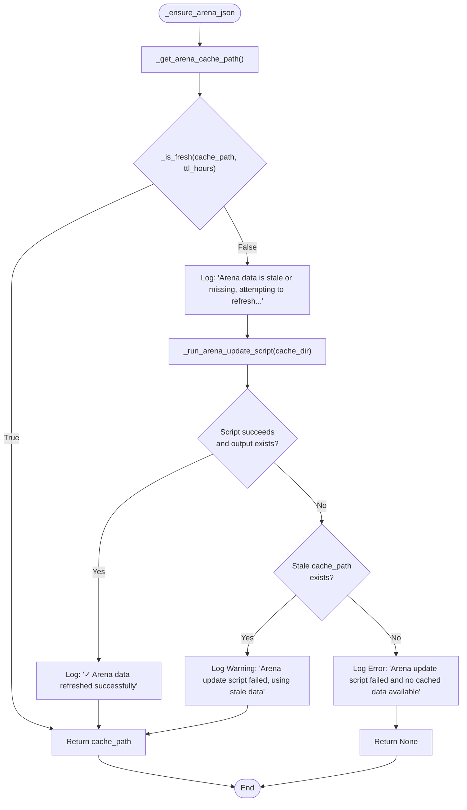
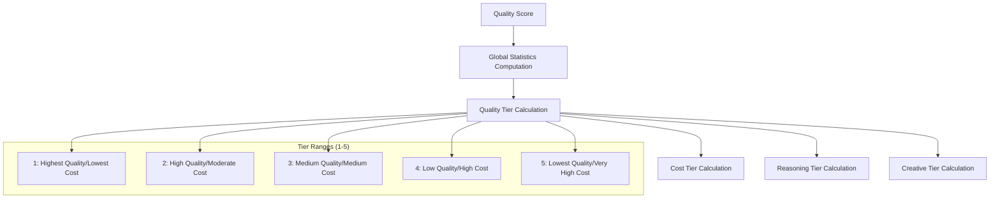
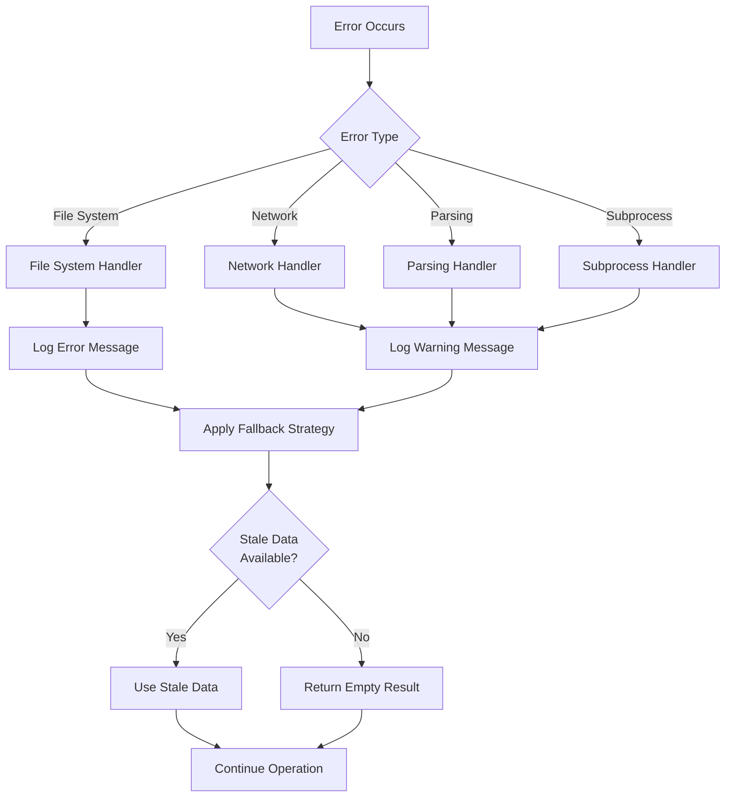

# LMArena Source Module Documentation

<cite>
**Referenced Files in This Document**
- [arena_source.py](file://packages/llmhub/src/llmhub/catalog/arena_source.py)
- [schema.py](file://packages/llmhub/src/llmhub/catalog/schema.py)
- [update_leaderboard_data.py](file://packages/llmhub/src/llmhub/catalog/vendor/arena/update_leaderboard_data.py)
- [leaderboard-text.json](file://packages/llmhub/src/llmhub/PLANS/data/leaderboard-text.json)
- [overrides.json](file://packages/llmhub/src/llmhub/catalog/data/overrides.json)
- [plan-catalog.md](file://packages/llmhub/src/llmhub/PLANS/plan-catalog.md)
</cite>

## Table of Contents
1. [Introduction](#introduction)
2. [Module Architecture](#module-architecture)
3. [Core Functions Overview](#core-functions-overview)
4. [Cache Management System](#cache-management-system)
5. [Data Loading and Processing](#data-loading-and-processing)
6. [Quality Scoring Integration](#quality-scoring-integration)
7. [Error Handling and Resilience](#error-handling-and-resilience)
8. [Integration with Canonical Model](#integration-with-canonical-model)
9. [Performance Considerations](#performance-considerations)
10. [Troubleshooting Guide](#troubleshooting-guide)

## Introduction

The LMArena source module (`arena_source.py`) serves as the primary interface for loading and processing leaderboard data from LMArena's `arena-catalog`. This module integrates with the vendored `update_leaderboard_data.py` script to maintain a 24-hour Time-To-Live (TTL) cache of quality scores, ensuring fresh data while maintaining system resilience through fallback mechanisms.

The module provides Elo-based quality scores that are essential for deriving business-friendly tiers in the canonical model representation. These scores represent competitive performance metrics from LMArena's chatbot arena leaderboard, enabling sophisticated model ranking and filtering capabilities within the LLM Hub ecosystem.

## Module Architecture

The LMArena source module follows a layered architecture pattern with clear separation of concerns:



**Diagram sources**
- [arena_source.py](file://packages/llmhub/src/llmhub/catalog/arena_source.py#L16-L227)
- [update_leaderboard_data.py](file://packages/llmhub/src/llmhub/catalog/vendor/arena/update_leaderboard_data.py#L1-L216)

**Section sources**
- [arena_source.py](file://packages/llmhub/src/llmhub/catalog/arena_source.py#L1-L227)

## Core Functions Overview

The module exposes four primary functions that handle different aspects of LMArena data management:

### Primary Interface Function

The [`load_arena_models()`](file://packages/llmhub/src/llmhub/catalog/arena_source.py#L165-L227) function serves as the main entry point, providing intelligent cache management and data loading capabilities.

### Internal Helper Functions

1. **Path Resolution**: [`_get_arena_cache_path()`](file://packages/llmhub/src/llmhub/catalog/arena_source.py#L17-L35) determines the cache file location with environment variable support
2. **Freshness Checking**: [`_is_fresh()`](file://packages/llmhub/src/llmhub/catalog/arena_source.py#L38-L57) validates cache validity based on modification timestamps
3. **Script Execution**: [`_run_arena_update_script()`](file://packages/llmhub/src/llmhub/catalog/arena_source.py#L60-L118) manages subprocess execution of the vendor update script
4. **Cache Orchestration**: [`_ensure_arena_json()`](file://packages/llmhub/src/llmhub/catalog/arena_source.py#L121-L162) coordinates cache validation and refresh cycles



**Diagram sources**
- [arena_source.py](file://packages/llmhub/src/llmhub/catalog/arena_source.py#L165-L227)
- [arena_source.py](file://packages/llmhub/src/llmhub/catalog/arena_source.py#L121-L162)

**Section sources**
- [arena_source.py](file://packages/llmhub/src/llmhub/catalog/arena_source.py#L165-L227)

## Cache Management System

The cache management system implements a sophisticated TTL-based approach to balance data freshness with system reliability:

### Cache Path Resolution

The [`_get_arena_cache_path()`](file://packages/llmhub/src/llmhub/catalog/arena_source.py#L17-L35) function provides flexible cache location determination:

- **Environment Variable Override**: Supports `LLMHUB_ARENA_CACHE_DIR` for custom cache locations
- **Default Location**: Falls back to `~/.config/llmhub/arena/leaderboard-text.json`
- **Directory Creation**: Automatically creates parent directories as needed

### Freshness Validation

The [`_is_fresh()`](file://packages/llmhub/src/llmhub/catalog/arena_source.py#L38-L57) function implements robust timestamp validation:

- **Existence Check**: Verifies file existence before timestamp evaluation
- **Modification Time**: Uses filesystem modification timestamp for age calculation
- **Exception Handling**: Gracefully handles OS-level errors during timestamp access

### Automatic Refresh Mechanism

The [`_ensure_arena_json()`](file://packages/llmhub/src/llmhub/catalog/arena_source.py#L121-L162) function orchestrates cache refresh cycles:

1. **Initial Validation**: Checks cache freshness using TTL threshold
2. **Script Execution**: Triggers update script when cache is stale or missing
3. **Fallback Strategy**: Provides stale data fallback when updates fail
4. **Error Reporting**: Comprehensive logging for debugging and monitoring



**Diagram sources**
- [arena_source.py](file://packages/llmhub/src/llmhub/catalog/arena_source.py#L121-L162)

**Section sources**
- [arena_source.py](file://packages/llmhub/src/llmhub/catalog/arena_source.py#L17-L162)

## Data Loading and Processing

The data loading and processing pipeline transforms raw leaderboard JSON into structured `ArenaModel` instances:

### JSON Structure Processing

The [`load_arena_models()`](file://packages/llmhub/src/llmhub/catalog/arena_source.py#L165-L227) function handles the complex JSON structure from LMArena:

```json
{
  "category": {
    "model_name": {
      "rating": 1287.0,
      "rating_q975": 1295.0,
      "rating_q025": 1279.0
    }
  }
}
```

### Model Extraction Process

The function implements a sophisticated extraction process:

1. **Category Selection**: Prefers `"overall_text"` category when available
2. **Duplicate Handling**: Maintains canonical model entries, prioritizing `"overall_text"`
3. **Field Validation**: Validates presence of required fields (`rating`)
4. **Type Safety**: Ensures numeric conversion for confidence interval fields

### ArenaModel Schema

The [`ArenaModel`](file://packages/llmhub/src/llmhub/catalog/schema.py#L51-L57) schema defines the structured representation:

| Field | Type | Description | Required |
|-------|------|-------------|----------|
| `arena_id` | `str` | Unique model identifier | Yes |
| `rating` | `float` | Elo-based quality score | Yes |
| `rating_q025` | `Optional[float]` | Lower 95% confidence interval | No |
| `rating_q975` | `Optional[float]` | Upper 95% confidence interval | No |
| `category` | `str` | Category classification | Yes |

### Data Transformation Pipeline

```mermaid
flowchart LR
JSON[Raw JSON Data] --> Parser[JSON Parser]
Parser --> Validator[Field Validator]
Validator --> Extractor[Field Extractor]
Extractor --> Converter[Type Converter]
Converter --> Builder[ArenaModel Builder]
Builder --> Output[Dict[str, ArenaModel]]
subgraph "Validation Rules"
VR1[Required: rating field]
VR2[Optional: confidence intervals]
VR3[Category selection priority]
VR4[Duplicate handling]
end
Validator --> VR1
Validator --> VR2
Validator --> VR3
Validator --> VR4
```

**Diagram sources**
- [arena_source.py](file://packages/llmhub/src/llmhub/catalog/arena_source.py#L192-L226)
- [schema.py](file://packages/llmhub/src/llmhub/catalog/schema.py#L51-L57)

**Section sources**
- [arena_source.py](file://packages/llmhub/src/llmhub/catalog/arena_source.py#L165-L227)
- [schema.py](file://packages/llmhub/src/llmhub/catalog/schema.py#L51-L57)

## Quality Scoring Integration

The LMArena quality scoring system integrates seamlessly with the broader LLM Hub ecosystem through the canonical model representation:

### Score Interpretation

Quality scores from LMArena represent Elo-based competitive performance metrics:

- **Range**: Typically 1000-1500 for leading models
- **Interpretation**: Higher scores indicate superior performance
- **Confidence Intervals**: Provide uncertainty bounds for score reliability

### Tier Derivation Process

Quality scores serve as the foundation for deriving business-friendly tiers:



**Diagram sources**
- [plan-catalog.md](file://packages/llmhub/src/llmhub/PLANS/plan-catalog.md#L347-L352)

### Integration with Canonical Model

The quality score data flows into the [`CanonicalModel`](file://packages/llmhub/src/llmhub/catalog/schema.py#L104-L107) through the fusion process:

| Canonical Field | Arena Source | Purpose |
|----------------|--------------|---------|
| `arena_score` | `rating` | Primary quality indicator |
| `arena_ci_low` | `rating_q025` | Lower confidence bound |
| `arena_ci_high` | `rating_q975` | Upper confidence bound |

**Section sources**
- [plan-catalog.md](file://packages/llmhub/src/llmhub/PLANS/plan-catalog.md#L347-L352)
- [schema.py](file://packages/llmhub/src/llmhub/catalog/schema.py#L104-L107)

## Error Handling and Resilience

The module implements comprehensive error handling to ensure system stability:

### File System Errors

- **Missing Files**: Graceful degradation when cache files are absent
- **Permission Issues**: Appropriate error messages for filesystem access problems
- **Corruption Handling**: JSON parsing failures trigger fallback mechanisms

### Network and External Dependencies

- **Script Timeout**: 5-minute timeout for update script execution
- **Network Failures**: Graceful handling of HuggingFace API unavailability
- **Subprocess Errors**: Comprehensive logging for script execution failures

### Fallback Strategies

The module implements multiple fallback layers:

1. **Stale Data Fallback**: Uses cached data when updates fail
2. **Empty Result Handling**: Returns empty dictionaries for missing data
3. **Graceful Degradation**: Continues operation with reduced functionality



**Diagram sources**
- [arena_source.py](file://packages/llmhub/src/llmhub/catalog/arena_source.py#L113-L118)
- [arena_source.py](file://packages/llmhub/src/llmhub/catalog/arena_source.py#L224-L226)

**Section sources**
- [arena_source.py](file://packages/llmhub/src/llmhub/catalog/arena_source.py#L113-L118)
- [arena_source.py](file://packages/llmhub/src/llmhub/catalog/arena_source.py#L224-L226)

## Integration with Canonical Model

The LMArena source module integrates with the broader canonical model system through the mapping and fusion processes:

### ID Mapping System

The [`overrides.json`](file://packages/llmhub/src/llmhub/catalog/data/overrides.json#L2-L31) file provides essential ID mappings:

```json
{
  "id_mappings": {
    "openai/gpt-4o": {
      "modelsdev_id": "openai/gpt-4o",
      "arena_id": "gpt-4o-2024-05-13"
    }
  }
}
```

### Fusion Process

During the fusion phase, LMArena data integrates with other sources:

1. **Canonical ID Alignment**: Matches arena IDs with canonical identifiers
2. **Priority Resolution**: Handles conflicts between multiple data sources
3. **Field Enhancement**: Adds quality scores to existing model metadata

### Quality Score Utilization

Quality scores influence multiple aspects of the canonical model:

- **Tier Derivation**: Primary factor in quality tier calculation
- **Ranking Logic**: Influences model ordering in various contexts
- **Filtering**: Enables quality-based model filtering

**Section sources**
- [overrides.json](file://packages/llmhub/src/llmhub/catalog/data/overrides.json#L2-L31)
- [plan-catalog.md](file://packages/llmhub/src/llmhub/PLANS/plan-catalog.md#L347-L352)

## Performance Considerations

The LMArena source module implements several performance optimization strategies:

### Caching Strategy

- **24-Hour TTL**: Balances data freshness with reduced network calls
- **Lazy Loading**: Defers expensive operations until actually needed
- **Memory Efficiency**: Minimal memory footprint for cache validation

### Subprocess Optimization

- **Timeout Control**: 5-minute timeout prevents hanging operations
- **Resource Management**: Proper cleanup of subprocess resources
- **Output Validation**: Ensures script produces expected output files

### Data Processing Efficiency

- **Streaming Parsing**: Processes JSON data efficiently
- **Selective Loading**: Loads only required categories when possible
- **Minimal Transformations**: Direct field mapping reduces processing overhead

## Troubleshooting Guide

Common issues and their resolutions:

### Cache-Related Issues

**Problem**: Stale or corrupted cache files
**Solution**: Delete `~/.config/llmhub/arena/leaderboard-text.json` to force refresh

**Problem**: Permission denied accessing cache directory
**Solution**: Set appropriate permissions on `~/.config/llmhub/arena/`

### Network Connectivity Issues

**Problem**: HuggingFace API unavailable
**Solution**: Verify internet connectivity and try manual cache refresh

**Problem**: Update script timeout
**Solution**: Check system resources and consider increasing timeout value

### Data Integrity Issues

**Problem**: JSON parsing failures
**Solution**: Verify cache file integrity and regenerate if corrupted

**Problem**: Missing quality scores
**Solution**: Check if update script executed successfully and produced output

**Section sources**
- [arena_source.py](file://packages/llmhub/src/llmhub/catalog/arena_source.py#L113-L118)
- [arena_source.py](file://packages/llmhub/src/llmhub/catalog/arena_source.py#L224-L226)