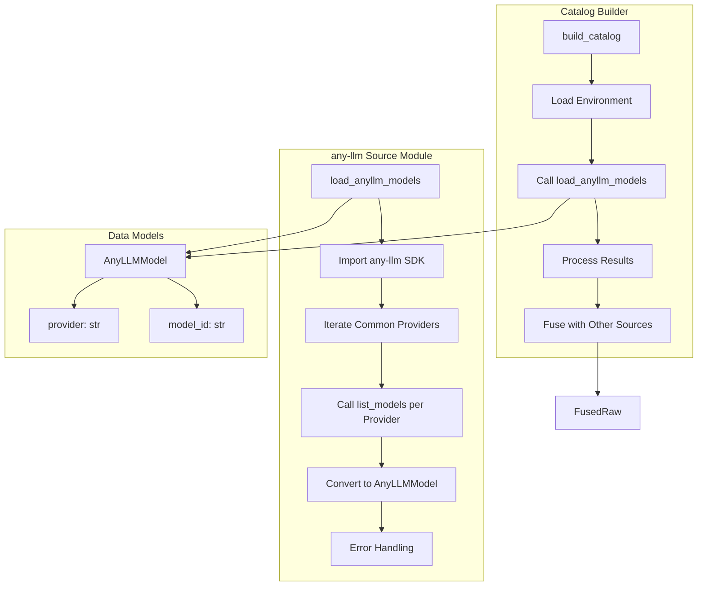
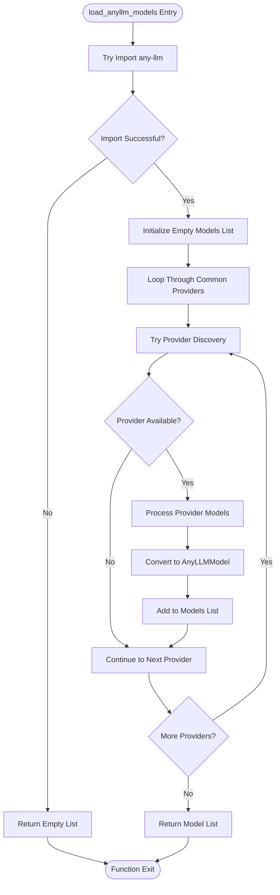
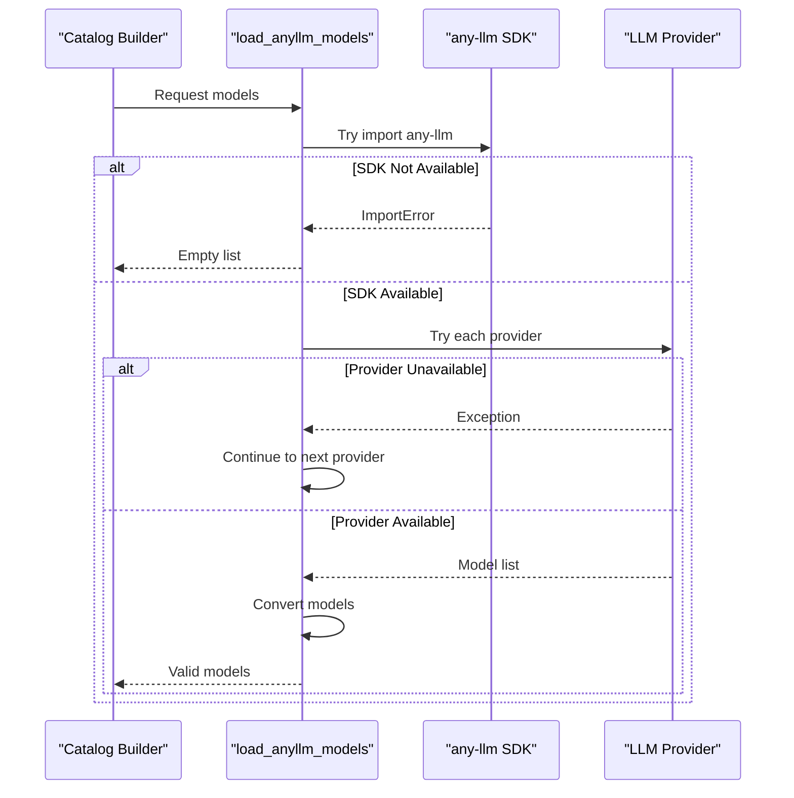
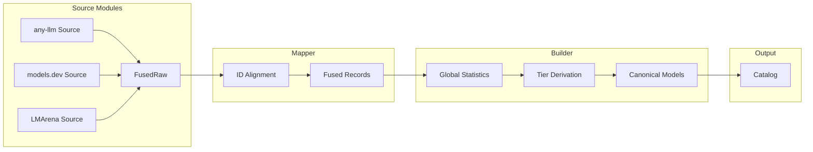
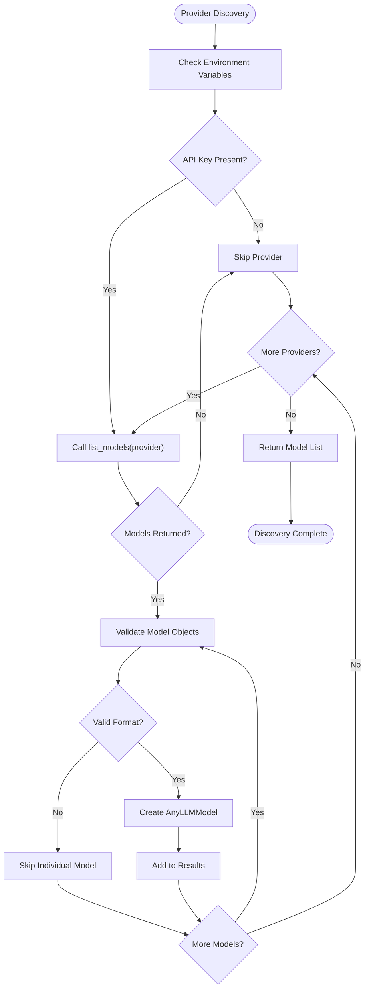
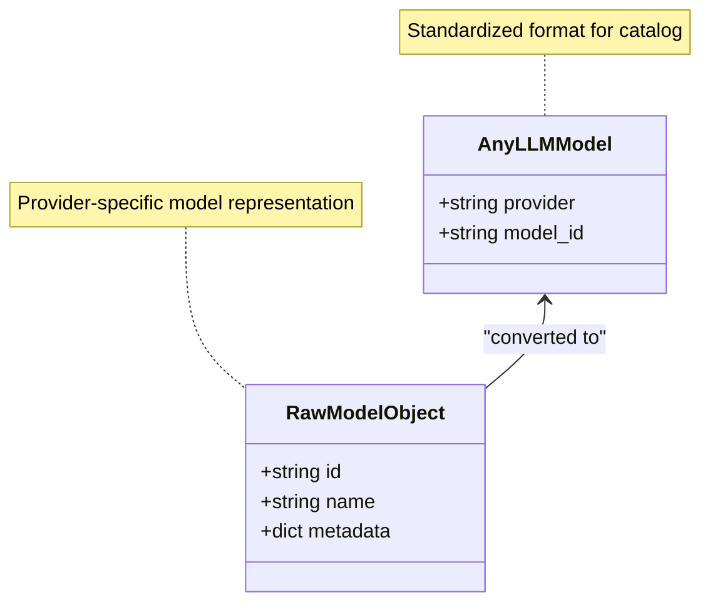

# any-llm Source Module Documentation

<cite>
**Referenced Files in This Document**
- [anyllm_source.py](file://packages/llmhub/src/llmhub/catalog/anyllm_source.py)
- [schema.py](file://packages/llmhub/src/llmhub/catalog/schema.py)
- [builder.py](file://packages/llmhub/src/llmhub/catalog/builder.py)
- [plan-catalog.md](file://packages/llmhub/src/llmhub/PLANS/plan-catalog.md)
- [modelsdev_source.py](file://packages/llmhub/src/llmhub/catalog/modelsdev_source.py)
- [arena_source.py](file://packages/llmhub/src/llmhub/catalog/arena_source.py)
- [cache.py](file://packages/llmhub/src/llmhub/catalog/cache.py)
- [mapper.py](file://packages/llmhub/src/llmhub/catalog/mapper.py)
</cite>

## Table of Contents
1. [Introduction](#introduction)
2. [Module Architecture](#module-architecture)
3. [Core Functionality](#core-functionality)
4. [Error Handling and Graceful Degradation](#error-handling-and-graceful-degradation)
5. [Integration with Catalog Pipeline](#integration-with-catalog-pipeline)
6. [Provider Discovery Process](#provider-discovery-process)
7. [Model Conversion and Validation](#model-conversion-and-validation)
8. [Performance Considerations](#performance-considerations)
9. [Troubleshooting Guide](#troubleshooting-guide)
10. [Best Practices](#best-practices)

## Introduction

The any-llm source module serves as the primary interface for discovering and validating LLM models that are actually callable within the current environment. This module acts as a bridge between the local any-llm SDK configuration and the broader catalog fusion pipeline, ensuring that only models with valid API keys and proper configuration are included in the canonical model catalog.

The module implements a sophisticated discovery mechanism that introspects the any-llm configuration to determine which models are available given the current environment and API keys. It gracefully handles various failure scenarios, including missing API keys, uninstalled providers, and network connectivity issues, while maintaining the integrity of the overall catalog-building process.

## Module Architecture

The any-llm source module follows a clean separation of concerns design pattern, focusing specifically on model discovery and validation. The module integrates seamlessly with the broader catalog system through well-defined interfaces and data structures.

**Diagram sources**
- [anyllm_source.py](file://packages/llmhub/src/llmhub/catalog/anyllm_source.py#L11-L49)
- [builder.py](file://packages/llmhub/src/llmhub/catalog/builder.py#L337-L342)

**Section sources**
- [anyllm_source.py](file://packages/llmhub/src/llmhub/catalog/anyllm_source.py#L1-L49)
- [schema.py](file://packages/llmhub/src/llmhub/catalog/schema.py#L12-L16)

## Core Functionality

### The `load_anyllm_models()` Function

The heart of the any-llm source module is the `load_anyllm_models()` function, which implements a comprehensive model discovery and validation process. This function serves as the primary entry point for discovering callable models in the current environment.

**Diagram sources**
- [anyllm_source.py](file://packages/llmhub/src/llmhub/catalog/anyllm_source.py#L11-L49)

The function implements a systematic approach to provider discovery:

1. **SDK Availability Check**: Attempts to import the any-llm SDK to ensure it's available in the environment
2. **Provider Enumeration**: Iterates through a predefined list of common LLM providers
3. **Model Listing**: Calls the any-llm `list_models()` API for each provider
4. **Model Conversion**: Converts raw model objects into standardized `AnyLLMModel` instances
5. **Error Isolation**: Gracefully handles failures for individual providers without affecting others

**Section sources**
- [anyllm_source.py](file://packages/llmhub/src/llmhub/catalog/anyllm_source.py#L11-L49)

## Error Handling and Graceful Degradation

The any-llm source module implements comprehensive error handling to ensure robust operation in diverse environments. The error handling strategy follows a principle of graceful degradation, allowing the catalog to build successfully even when some providers are unavailable.

### Error Handling Strategy

**Diagram sources**
- [anyllm_source.py](file://packages/llmhub/src/llmhub/catalog/anyllm_source.py#L20-L46)

### Error Categories and Handling

The module handles several distinct error categories:

| Error Type | Cause | Handling Strategy | Impact |
|------------|-------|-------------------|---------|
| ImportError | any-llm SDK not installed | Return empty list | Catalog builds without any-llm models |
| Provider Error | API key missing or invalid | Skip provider, continue | Other providers unaffected |
| Network Error | Provider API unavailable | Skip provider, continue | Other providers unaffected |
| Model Parsing Error | Unexpected model format | Skip individual model | Other models processed |

**Section sources**
- [anyllm_source.py](file://packages/llmhub/src/llmhub/catalog/anyllm_source.py#L38-L46)

## Integration with Catalog Pipeline

The any-llm source module integrates seamlessly with the broader catalog fusion pipeline, serving as one of three primary data sources alongside models.dev and LMArena. The integration follows a coordinated approach that ensures data consistency and completeness.

### Pipeline Integration Points

**Diagram sources**
- [builder.py](file://packages/llmhub/src/llmhub/catalog/builder.py#L337-L367)
- [mapper.py](file://packages/llmhub/src/llmhub/catalog/mapper.py#L32-L114)

### Environment Loading Integration

The any-llm source module coordinates with the environment loading system to ensure API keys are available before model discovery begins. This coordination is crucial for providers that require authentication.

**Section sources**
- [builder.py](file://packages/llmhub/src/llmhub/catalog/builder.py#L326-L328)
- [builder.py](file://packages/llmhub/src/llmhub/catalog/builder.py#L337-L342)

## Provider Discovery Process

The provider discovery process implements a systematic approach to identifying and validating LLM providers in the current environment. The process prioritizes commonly used providers while maintaining flexibility for custom configurations.

### Supported Providers

The module targets a comprehensive set of popular LLM providers:

| Provider Category | Specific Providers | Discovery Method |
|------------------|-------------------|------------------|
| Major Cloud Providers | OpenAI, Anthropic, Google | API key validation |
| Emerging Providers | Mistral, DeepSeek, Qwen | API key validation |
| Specialized Services | Groq, Together AI, Cohere | API key validation |
| Local Deployment | Ollama | Local availability detection |

### Discovery Algorithm

**Diagram sources**
- [anyllm_source.py](file://packages/llmhub/src/llmhub/catalog/anyllm_source.py#L25-L41)

**Section sources**
- [anyllm_source.py](file://packages/llmhub/src/llmhub/catalog/anyllm_source.py#L25-L41)

## Model Conversion and Validation

The model conversion process transforms raw provider-specific model objects into standardized `AnyLLMModel` instances. This process includes validation, normalization, and error handling to ensure data consistency.

### Conversion Process

The conversion process handles various model object formats and extracts essential information:

**Diagram sources**
- [anyllm_source.py](file://packages/llmhub/src/llmhub/catalog/anyllm_source.py#L32-L36)
- [schema.py](file://packages/llmhub/src/llmhub/catalog/schema.py#L12-L16)

### Validation Rules

The conversion process applies several validation rules:

1. **Provider Identification**: Ensures the provider field contains a valid string identifier
2. **Model ID Extraction**: Attempts to extract model identifiers from various object formats
3. **Fallback Mechanisms**: Provides fallback values when primary extraction fails
4. **Type Consistency**: Maintains string type for both provider and model_id fields

**Section sources**
- [anyllm_source.py](file://packages/llmhub/src/llmhub/catalog/anyllm_source.py#L32-L36)

## Performance Considerations

The any-llm source module is designed with performance in mind, implementing several optimization strategies to minimize impact on the overall catalog building process.

### Optimization Strategies

| Strategy | Implementation | Benefit |
|----------|---------------|---------|
| Lazy Loading | Import any-llm only when needed | Reduced startup overhead |
| Early Termination | Stop on ImportError | Faster failure detection |
| Parallel Processing | Independent provider discovery | Better resource utilization |
| Error Isolation | Try-except blocks per provider | Single failure doesn't halt process |

### Memory Management

The module implements efficient memory management by:

- Creating models only when validated and converted
- Using generators where appropriate for large model lists
- Cleaning up temporary variables after processing
- Returning shallow copies of model data

### Network Optimization

For providers requiring network calls:

- Minimal API calls per provider
- No retries or timeouts (let higher layers handle)
- Fast-fail on connection issues
- No caching within the module (delegate to higher layers)

## Troubleshooting Guide

### Common Issues and Solutions

#### Issue: No models discovered despite valid API keys

**Symptoms**: Empty model list returned, warnings printed during catalog build

**Causes**:
- API keys not loaded into environment
- Provider not in common providers list
- Network connectivity issues
- Rate limiting or quota exceeded

**Solutions**:
1. Verify API keys in `.env` file
2. Check environment variable loading
3. Review provider availability in any-llm configuration
4. Test network connectivity to provider APIs

#### Issue: ImportError for any-llm SDK

**Symptoms**: Empty model list, no warnings about missing providers

**Causes**:
- any-llm not installed in environment
- Python path issues
- Version compatibility problems

**Solutions**:
1. Install any-llm: `pip install any-llm`
2. Verify installation: `python -c "import any_llm"`
3. Check Python environment consistency

#### Issue: Partial provider discovery

**Symptoms**: Some providers work, others fail silently

**Causes**:
- Mixed API key validity
- Provider-specific rate limits
- Network connectivity variations

**Solutions**:
1. Check individual provider API keys
2. Review provider-specific documentation
3. Monitor network connectivity patterns

**Section sources**
- [builder.py](file://packages/llmhub/src/llmhub/catalog/builder.py#L340-L350)

## Best Practices

### Development Guidelines

1. **Environment Configuration**: Always load environment variables before calling `load_anyllm_models()`
2. **Error Handling**: Trust the module's error handling; don't wrap calls in additional try-except blocks
3. **Provider Updates**: Keep the common providers list current with emerging LLM platforms
4. **Testing**: Test with various combinations of API key availability

### Production Considerations

1. **Monitoring**: Monitor the number of discovered models as an indicator of provider health
2. **Fallback Strategies**: Design applications to handle zero models gracefully
3. **Resource Management**: Consider the performance impact of provider discovery in high-frequency scenarios
4. **Security**: Ensure API keys are properly secured and rotated

### Integration Patterns

The any-llm source module follows established patterns for data source integration:

- **Idempotent Operations**: Safe to call multiple times without side effects
- **Pure Functions**: No internal state, predictable outputs for given inputs
- **Error Propagation**: Clear error boundaries that don't obscure underlying issues
- **Extensibility**: Easy to add new providers or modify discovery logic

**Section sources**
- [plan-catalog.md](file://packages/llmhub/src/llmhub/PLANS/plan-catalog.md#L155-L178)