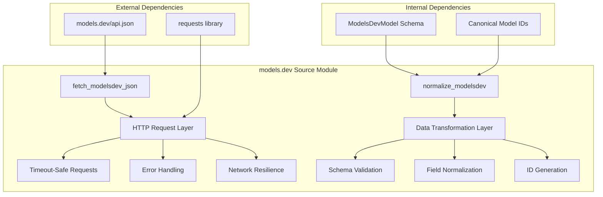
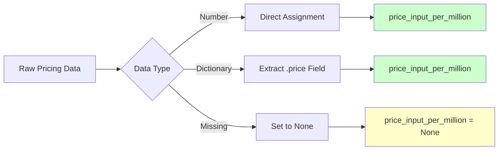
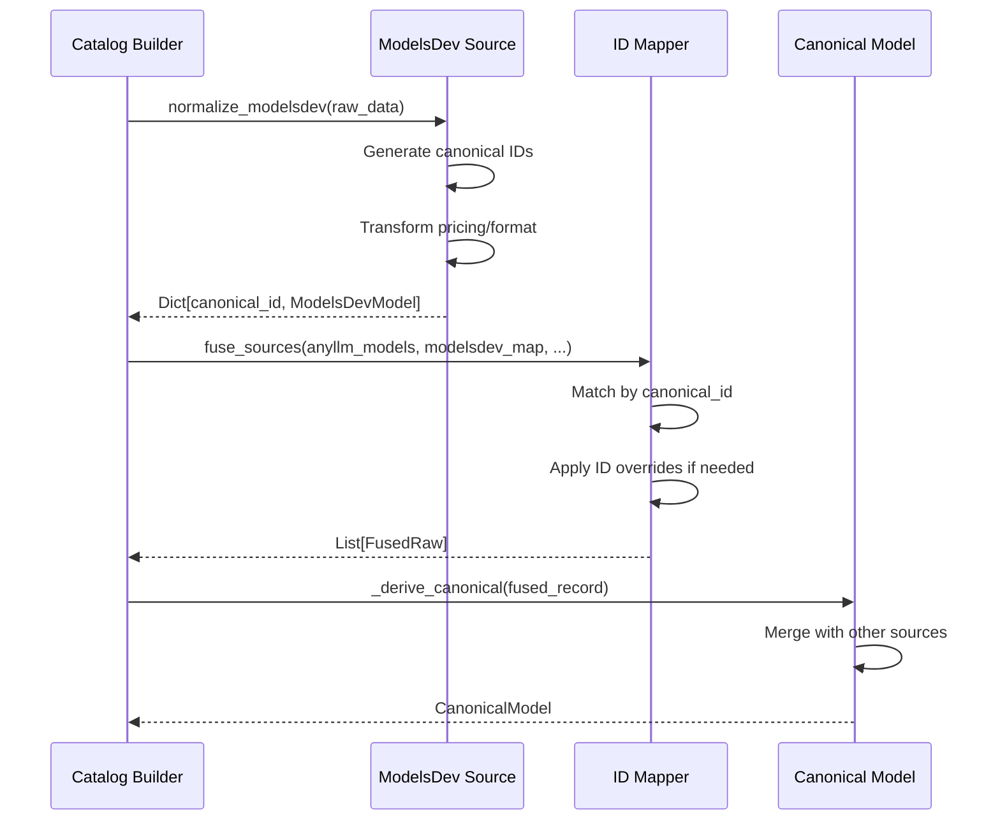
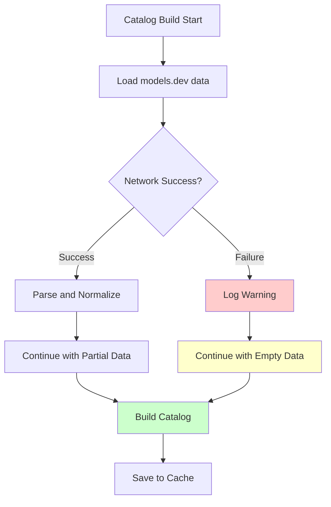

# models.dev Source Module Documentation

<cite>
**Referenced Files in This Document**
- [modelsdev_source.py](file://packages/llmhub/src/llmhub/catalog/modelsdev_source.py)
- [schema.py](file://packages/llmhub/src/llmhub/catalog/schema.py)
- [builder.py](file://packages/llmhub/src/llmhub/catalog/builder.py)
- [plan-catalog.md](file://packages/llmhub/src/llmhub/PLANS/plan-catalog.md)
- [overrides.json](file://packages/llmhub/src/llmhub/catalog/data/overrides.json)
</cite>

## Table of Contents
1. [Introduction](#introduction)
2. [Module Architecture](#module-architecture)
3. [Core Functions](#core-functions)
4. [Data Normalization Process](#data-normalization-process)
5. [Schema Definitions](#schema-definitions)
6. [Integration with Catalog System](#integration-with-catalog-system)
7. [Error Handling and Robustness](#error-handling-and-robustness)
8. [Performance Considerations](#performance-considerations)
9. [Usage Examples](#usage-examples)
10. [Troubleshooting Guide](#troubleshooting-guide)

## Introduction

The models.dev source module serves as a critical component in the LLM Hub catalog system, responsible for fetching and normalizing model metadata from the authoritative models.dev API endpoint. This module transforms raw JSON data from `https://models.dev/api.json` into a standardized schema that enables cost-aware model selection and capability-based filtering throughout the LLM Hub ecosystem.

The module implements two primary functions: [`fetch_modelsdev_json()`](file://packages/llmhub/src/llmhub/catalog/modelsdev_source.py#L11-L30) for safe HTTP communication and [`normalize_modelsdev()`](file://packages/llmhub/src/llmhub/catalog/modelsdev_source.py#L33-L141) for data transformation and standardization. Together, these functions provide robust, timeout-safe access to model metadata while gracefully handling network failures and malformed data.

## Module Architecture

The models.dev source module follows a clean separation of concerns pattern, with distinct responsibilities for data acquisition and transformation:



**Diagram sources**
- [modelsdev_source.py](file://packages/llmhub/src/llmhub/catalog/modelsdev_source.py#L11-L141)

**Section sources**
- [modelsdev_source.py](file://packages/llmhub/src/llmhub/catalog/modelsdev_source.py#L1-L142)

## Core Functions

### fetch_modelsdev_json()

The [`fetch_modelsdev_json()`](file://packages/llmhub/src/llmhub/catalog/modelsdev_source.py#L11-L30) function implements a timeout-safe HTTP GET request to the models.dev API endpoint, providing robust error handling and graceful degradation capabilities.

#### Implementation Details

The function employs several key design patterns:

- **Timeout Safety**: Uses a 10-second timeout to prevent hanging requests
- **Error Isolation**: Catches all `requests.RequestException` types and logs warnings without crashing
- **Graceful Degradation**: Returns empty dictionary `{}` when network requests fail
- **Logging Integration**: Provides informative warnings for debugging purposes

#### Network Resilience Features

```mermaid
flowchart TD
A[fetch_modelsdev_json Call] --> B[Set Timeout=10s]
B --> C[HTTP GET Request]
C --> D{Request Successful?}
D --> |Yes| E[response.raise_for_status]
E --> F[Parse JSON Response]
F --> G[Return Parsed Data]
D --> |No| H[Log Warning]
H --> I[Return Empty Dict {}]
style H fill:#ffcccc
style I fill:#ffffcc
```

**Diagram sources**
- [modelsdev_source.py](file://packages/llmhub/src/llmhub/catalog/modelsdev_source.py#L23-L30)

#### Error Handling Strategy

The function implements a defensive programming approach where network failures don't compromise the entire catalog building process. This design choice aligns with the catalog system's philosophy of providing useful data even when some external sources are unavailable.

**Section sources**
- [modelsdev_source.py](file://packages/llmhub/src/llmhub/catalog/modelsdev_source.py#L11-L30)

### normalize_modelsdev()

The [`normalize_modelsdev()`](file://packages/llmhub/src/llmhub/catalog/modelsdev_source.py#L33-L141) function performs sophisticated data transformation, converting the hierarchical provider-model structure into a flat dictionary keyed by canonical identifiers.

#### Data Transformation Pipeline

The normalization process follows a systematic approach:

1. **Input Validation**: Handles empty or malformed input data gracefully
2. **Provider Iteration**: Processes each provider's model collection
3. **Model Extraction**: Extracts individual model metadata with fallback field resolution
4. **Canonical ID Generation**: Creates standardized identifiers combining provider and model names
5. **Capability Parsing**: Transforms complex nested structures into flattened attributes
6. **Pricing Normalization**: Converts various pricing formats to per-million-token costs
7. **Modality Standardization**: Ensures modalities are represented as lists with sensible defaults
8. **Schema Construction**: Builds `ModelsDevModel` instances with comprehensive metadata

#### Pricing Normalization Algorithm

The function implements intelligent pricing conversion to ensure consistent cost calculations:

```mermaid
flowchart TD
A[Pricing Data] --> B{Format Type?}
B --> |Simple Number| C[Direct Assignment]
B --> |Dictionary| D[Extract .price Field]
C --> E[price_input = value]
D --> F[price_input = dict.get('price')]
G[Pricing Keys] --> H{Key Pattern}
H --> |input/prompt| I[Primary Pricing]
H --> |output/completion| J[Secondary Pricing]
H --> |reasoning| K[Reasoning Pricing]
I --> E
J --> L[price_output = value]
K --> M[price_reasoning = value]
style E fill:#ccffcc
style L fill:#ccffcc
style M fill:#ccffcc
```

**Diagram sources**
- [modelsdev_source.py](file://packages/llmhub/src/llmhub/catalog/modelsdev_source.py#L66-L91)

#### Modality Processing

The function ensures robust handling of input/output modalities:

- **Default Values**: Falls back to `["text"]` when modalities are unspecified
- **Type Normalization**: Converts single values to lists for consistent processing
- **Null Handling**: Replaces null/empty values with default text modality

**Section sources**
- [modelsdev_source.py](file://packages/llmhub/src/llmhub/catalog/modelsdev_source.py#L33-L141)

## Data Normalization Process

### Canonical ID Generation

The normalization process creates standardized identifiers that serve as the foundation for model cross-referencing across different data sources. The canonical ID format follows the pattern `"{provider}/{model_id}"`.

#### ID Generation Examples

| Provider | Raw Model ID | Generated Canonical ID |
|----------|--------------|------------------------|
| openai | gpt-4o-mini | openai/gpt-4o-mini |
| anthropic | claude-3-5-sonnet | anthropic/claude-3-5-sonnet |
| google | gemini-pro | google/gemini-pro |

### Capability Mapping

The function transforms complex nested capability structures into flattened attributes:

#### Capability Fields Transformation

| Source Field | Target Attribute | Default Value | Description |
|--------------|------------------|---------------|-------------|
| `capabilities.reasoning` | `supports_reasoning` | `False` | Reasoning support flag |
| `capabilities.tools` | `supports_tool_call` | `False` | Tool/function calling support |
| `capabilities.structured_output` | `supports_structured_output` | `False` | Structured output support |
| `modalities.input` | `input_modalities` | `["text"]` | Supported input modalities |
| `modalities.output` | `output_modalities` | `["text"]` | Supported output modalities |

### Pricing Standardization

The normalization process converts various pricing formats into a consistent per-million-token representation:

#### Pricing Format Handling



**Diagram sources**
- [modelsdev_source.py](file://packages/llmhub/src/llmhub/catalog/modelsdev_source.py#L72-L91)

**Section sources**
- [modelsdev_source.py](file://packages/llmhub/src/llmhub/catalog/modelsdev_source.py#L55-L139)

## Schema Definitions

### ModelsDevModel Schema

The [`ModelsDevModel`](file://packages/llmhub/src/llmhub/catalog/schema.py#L18-L48) class defines the standardized representation of models.dev metadata:

#### Core Identity Fields

| Field | Type | Purpose | Example |
|-------|------|---------|---------|
| `canonical_id` | `str` | Unique identifier | `"openai/gpt-4o-mini"` |
| `provider` | `str` | Provider name | `"openai"` |
| `model_id` | `str` | Model identifier | `"gpt-4o-mini"` |
| `family` | `Optional[str]` | Model family | `"GPT-4o"` |
| `display_name` | `Optional[str]` | Human-readable name | `"GPT-4o Mini"` |

#### Capability Attributes

| Field | Type | Default | Description |
|-------|------|---------|-------------|
| `supports_reasoning` | `bool` | `False` | Reasoning capabilities |
| `supports_tool_call` | `bool` | `False` | Tool/function calling |
| `supports_structured_output` | `bool` | `False` | Structured output support |
| `input_modalities` | `list[str]` | `["text"]` | Supported input types |
| `output_modalities` | `list[str]` | `["text"]` | Supported output types |
| `attachments` | `list[str]` | `[]` | Attachment support |

#### Limitation Fields

| Field | Type | Purpose | Units |
|-------|------|---------|-------|
| `context_tokens` | `Optional[int]` | Maximum context length | Tokens |
| `max_input_tokens` | `Optional[int]` | Maximum input tokens | Tokens |
| `max_output_tokens` | `Optional[int]` | Maximum output tokens | Tokens |

#### Pricing Information

| Field | Type | Purpose | Units |
|-------|------|---------|-------|
| `price_input_per_million` | `Optional[float]` | Input token cost | USD per 1M tokens |
| `price_output_per_million` | `Optional[float]` | Output token cost | USD per 1M tokens |
| `price_reasoning_per_million` | `Optional[float]` | Reasoning token cost | USD per 1M tokens |

#### Metadata Fields

| Field | Type | Purpose | Example |
|-------|------|---------|---------|
| `knowledge_cutoff` | `Optional[str]` | Knowledge cutoff date | `"2023-10-01"` |
| `release_date` | `Optional[str]` | Release date | `"2024-01-15"` |
| `last_updated` | `Optional[str]` | Last update timestamp | `"2024-03-20T14:30:00Z"` |
| `open_weights` | `bool` | Open weights availability | `True` |

**Section sources**
- [schema.py](file://packages/llmhub/src/llmhub/catalog/schema.py#L18-L48)

## Integration with Catalog System

### Data Fusion Process

The models.dev source integrates seamlessly with the broader catalog system through the [`fuse_sources()`](file://packages/llmhub/src/llmhub/catalog/builder.py#L263-L269) function in the builder module. This integration demonstrates how models.dev metadata enriches the canonical model representation.

#### Cross-Source Alignment



**Diagram sources**
- [builder.py](file://packages/llmhub/src/llmhub/catalog/builder.py#L362-L363)
- [modelsdev_source.py](file://packages/llmhub/src/llmhub/catalog/modelsdev_source.py#L33-L141)

### Tier Derivation Impact

Models.dev metadata significantly influences the catalog's tier system, particularly for cost and reasoning capabilities:

#### Cost Tier Influence

The [`_derive_cost_tier()`](file://packages/llmhub/src/llmhub/catalog/builder.py#L114-L129) function uses models.dev pricing data to calculate cost tiers:

- **Price Calculation**: Average of input and output token costs per million
- **Quantile-Based Bucketing**: Uses global price quantiles for fair comparison
- **Tier Assignment**: 1 (cheapest) to 5 (most expensive) scale

#### Reasoning Tier Enhancement

Models.dev's reasoning capability flag enhances the reasoning tier calculation:

- **Base Quality Tier**: Determined by arena scores or provider reputation
- **Capability Boost**: Models with reasoning support receive tier improvements
- **Conservative Approach**: Minimum improvement of 1 tier level

**Section sources**
- [builder.py](file://packages/llmhub/src/llmhub/catalog/builder.py#L114-L129)
- [builder.py](file://packages/llmhub/src/llmhub/catalog/builder.py#L248-L251)

## Error Handling and Robustness

### Network Failure Resilience

The models.dev source implements comprehensive error handling to ensure catalog building continues even when external data is unavailable:

#### Graceful Degradation Strategy



**Diagram sources**
- [modelsdev_source.py](file://packages/llmhub/src/llmhub/catalog/modelsdev_source.py#L28-L30)
- [builder.py](file://packages/llmhub/src/llmhub/catalog/builder.py#L351-L353)

### Data Validation and Defaults

The normalization function implements robust data validation with sensible defaults:

#### Field Validation Patterns

| Field Category | Validation Strategy | Default Behavior |
|----------------|-------------------|------------------|
| **IDs** | Fallback to model name | Skip if both missing |
| **Capabilities** | Boolean coercion | `False` for missing |
| **Limits** | Numeric extraction | `None` for missing |
| **Pricing** | Type checking + conversion | `None` for invalid |
| **Modalities** | List normalization | `["text"]` for missing |

#### Missing Field Handling

The function employs a cascading fallback strategy:

1. **Primary Source**: Use the first available field name
2. **Alternative Names**: Try common synonyms (e.g., `context` vs `context_length`)
3. **Default Values**: Apply schema-defined defaults for missing required fields
4. **Type Coercion**: Convert strings to appropriate types where possible

**Section sources**
- [modelsdev_source.py](file://packages/llmhub/src/llmhub/catalog/modelsdev_source.py#L55-L139)

## Performance Considerations

### HTTP Request Optimization

The [`fetch_modelsdev_json()`](file://packages/llmhub/src/llmhub/catalog/modelsdev_source.py#L11-L30) function incorporates several performance optimizations:

#### Timeout Configuration
- **10-second timeout**: Balances responsiveness with reliability
- **Non-blocking**: Prevents catalog building from hanging indefinitely
- **Retry Logic**: Built-in retry mechanism through the requests library

#### Memory Efficiency
- **Streaming JSON parsing**: Leverages requests library's efficient JSON parsing
- **Minimal intermediate storage**: Direct transformation from response to dict
- **Garbage collection friendly**: Minimal object creation during normalization

### Data Processing Optimization

The [`normalize_modelsdev()`](file://packages/llmhub/src/llmhub/catalog/modelsdev_source.py#L33-L141) function implements several optimization strategies:

#### Iteration Efficiency
- **Single-pass processing**: Each model processed once
- **Early termination**: Skips invalid models immediately
- **Memory-efficient iteration**: Uses generators where appropriate

#### String Operations
- **Canonical ID construction**: Optimized string concatenation
- **Provider normalization**: Consistent case handling
- **Fallback mechanisms**: Minimized string operations for defaults

**Section sources**
- [modelsdev_source.py](file://packages/llmhub/src/llmhub/catalog/modelsdev_source.py#L23-L30)
- [modelsdev_source.py](file://packages/llmhub/src/llmhub/catalog/modelsdev_source.py#L55-L139)

## Usage Examples

### Basic Integration

The models.dev source integrates automatically into the catalog building process:

```python
# Automatic integration in build_catalog()
from llmhub.catalog import build_catalog

# This triggers models.dev data fetching
catalog = build_catalog()

# Access models with enriched metadata
for model in catalog.models:
    if hasattr(model, 'price_input_per_million'):
        print(f"Cost: ${model.price_input_per_million:.3f}/M tokens")
```

### Manual Data Access

For direct access to models.dev data:

```python
from llmhub.catalog.modelsdev_source import fetch_modelsdev_json, normalize_modelsdev

# Fetch raw data
raw_data = fetch_modelsdev_json()

# Normalize to canonical format
normalized_data = normalize_modelsdev(raw_data)

# Access specific model
model_key = "openai/gpt-4o-mini"
if model_key in normalized_data:
    model = normalized_data[model_key]
    print(f"Context: {model.context_tokens} tokens")
    print(f"Pricing: ${model.price_input_per_million:.3f}/M input")
```

### Error Handling Example

```python
from llmhub.catalog.modelsdev_source import fetch_modelsdev_json, normalize_modelsdev

try:
    raw_data = fetch_modelsdev_json()
    models = normalize_modelsdev(raw_data)
    
    # Process models safely
    for canonical_id, model in models.items():
        print(f"{canonical_id}: {model.display_name}")
        
except Exception as e:
    print(f"Models.dev processing failed: {e}")
    # Continue with partial or no models.dev data
```

## Troubleshooting Guide

### Common Issues and Solutions

#### Network Connectivity Problems

**Symptom**: Empty models.dev data despite successful network access
**Cause**: Network timeouts or intermittent connectivity
**Solution**: 
- Verify internet connectivity
- Check firewall/proxy settings
- Retry operation with exponential backoff

#### Data Format Changes

**Symptom**: Unexpected KeyError or TypeError during normalization
**Cause**: models.dev API format changes
**Solution**:
- Update to latest llm-hub version
- Check for breaking changes in models.dev API
- Implement additional validation in custom integrations

#### Memory Issues

**Symptom**: OutOfMemoryError during large dataset processing
**Cause**: Large models.dev dataset or memory leaks
**Solution**:
- Monitor memory usage during processing
- Process data in batches if necessary
- Clear unused references after processing

### Debugging Strategies

#### Enable Detailed Logging

```python
import logging
import requests

# Enable debug logging
logging.basicConfig(level=logging.DEBUG)
requests_log = logging.getLogger("urllib3")
requests_log.setLevel(logging.DEBUG)
```

#### Validate Data Integrity

```python
from llmhub.catalog.modelsdev_source import normalize_modelsdev

# Validate normalized data
def validate_normalized_data(normalized_data):
    for canonical_id, model in normalized_data.items():
        assert canonical_id == f"{model.provider}/{model.model_id}"
        assert model.canonical_id == canonical_id
        
        # Check pricing consistency
        if model.price_input_per_million is not None:
            assert model.price_input_per_million >= 0
            
        # Check token limits
        if model.context_tokens is not None:
            assert model.context_tokens > 0
```

#### Performance Monitoring

```python
import time
from llmhub.catalog.modelsdev_source import fetch_modelsdev_json, normalize_modelsdev

# Measure performance
start_time = time.time()
raw_data = fetch_modelsdev_json()
fetch_time = time.time() - start_time

start_time = time.time()
normalized_data = normalize_modelsdev(raw_data)
normalize_time = time.time() - start_time

print(f"Fetch time: {fetch_time:.2f}s")
print(f"Normalize time: {normalize_time:.2f}s")
print(f"Models processed: {len(normalized_data)}")
```

**Section sources**
- [modelsdev_source.py](file://packages/llmhub/src/llmhub/catalog/modelsdev_source.py#L28-L30)
- [modelsdev_source.py](file://packages/llmhub/src/llmhub/catalog/modelsdev_source.py#L11-L30)