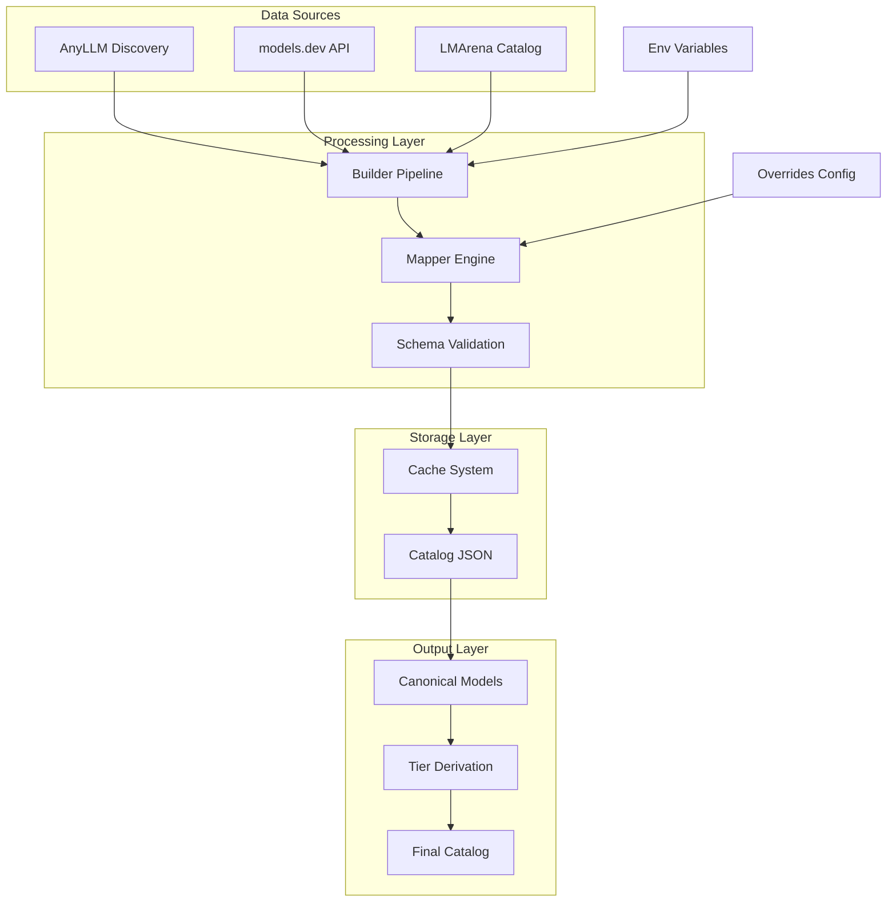
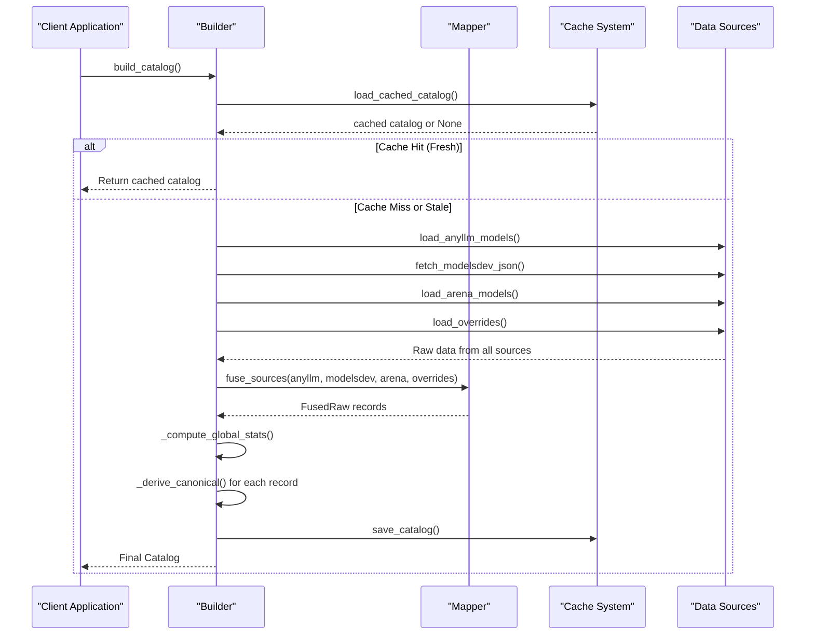
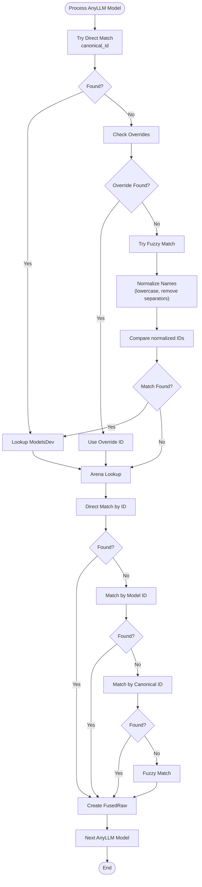
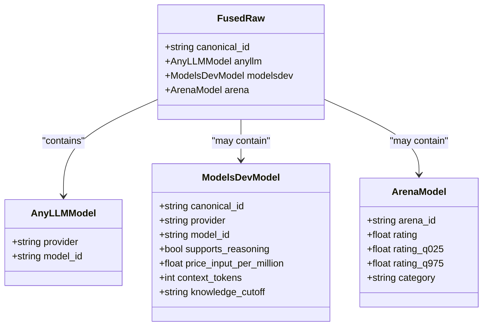
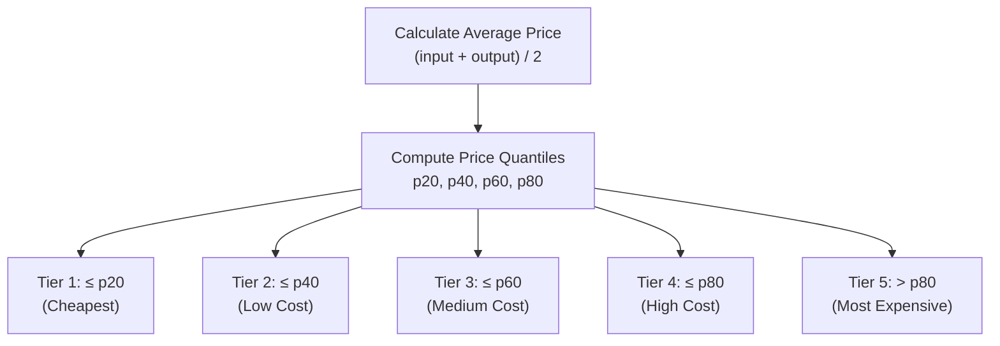

# Fusion Logic

<cite>
**Referenced Files in This Document**
- [builder.py](file://packages/llmhub/src/llmhub/catalog/builder.py)
- [mapper.py](file://packages/llmhub/src/llmhub/catalog/mapper.py)
- [schema.py](file://packages/llmhub/src/llmhub/catalog/schema.py)
- [overrides.json](file://packages/llmhub/src/llmhub/catalog/data/overrides.json)
- [plan-catalog.md](file://packages/llmhub/src/llmhub/PLANS/plan-catalog.md)
- [anyllm_source.py](file://packages/llmhub/src/llmhub/catalog/anyllm_source.py)
- [modelsdev_source.py](file://packages/llmhub/src/llmhub/catalog/modelsdev_source.py)
- [arena_source.py](file://packages/llmhub/src/llmhub/catalog/arena_source.py)
- [cache.py](file://packages/llmhub/src/llmhub/catalog/cache.py)
- [__init__.py](file://packages/llmhub/src/llmhub/catalog/__init__.py)
- [update_leaderboard_data.py](file://packages/llmhub/src/llmhub/catalog/vendor/arena/update_leaderboard_data.py)
</cite>

## Table of Contents
1. [Introduction](#introduction)
2. [System Architecture](#system-architecture)
3. [Core Components](#core-components)
4. [Fusion Pipeline](#fusion-pipeline)
5. [ID Mapping and Alignment](#id-mapping-and-alignment)
6. [Override System](#override-system)
7. [Intermediate Models](#intermediate-models)
8. [Tier Derivation](#tier-derivation)
9. [Edge Cases and Error Handling](#edge-cases-and-error-handling)
10. [Performance Considerations](#performance-considerations)
11. [Troubleshooting Guide](#troubleshooting-guide)
12. [Conclusion](#conclusion)

## Introduction

The catalog fusion process is the core mechanism that aligns and combines data from multiple heterogeneous sources to create a unified, canonical representation of available Large Language Models (LLMs). This system integrates data from three primary sources: any-llm (discovered models), models.dev (metadata and pricing), and LMArena (quality scores) to produce a comprehensive catalog with cost, quality, and capability information.

The fusion logic addresses the fundamental challenge of reconciling ID mismatches and naming variations across different data sources while maintaining data integrity and providing fallback mechanisms for partial data availability.

## System Architecture

The catalog fusion system follows a modular architecture with clear separation of concerns:



**Diagram sources**
- [builder.py](file://packages/llmhub/src/llmhub/catalog/builder.py#L302-L388)
- [mapper.py](file://packages/llmhub/src/llmhub/catalog/mapper.py#L32-L114)
- [schema.py](file://packages/llmhub/src/llmhub/catalog/schema.py#L1-L122)

## Core Components

### Builder Module

The [`builder.py`](file://packages/llmhub/src/llmhub/catalog/builder.py) serves as the orchestration engine for the entire fusion pipeline. It coordinates the loading of data from all sources, invokes the mapper for ID alignment, computes global statistics, and derives the final canonical models.

Key responsibilities include:
- Environment configuration and API key loading
- Cache management with TTL-based persistence
- Source data loading and validation
- Global statistics computation for tier derivation
- Canonical model derivation with capability inference
- Catalog assembly and serialization

### Mapper Module

The [`mapper.py`](file://packages/llmhub/src/llmhub/catalog/mapper.py) implements the core ID alignment logic that resolves discrepancies between different naming conventions and identifier schemes across sources.

The mapper employs a sophisticated matching strategy with multiple fallback mechanisms:
1. **Direct Matching**: Exact ID correspondence between sources
2. **Override Mapping**: Static configuration-driven mappings
3. **Fuzzy Matching**: Normalized string comparison for similar identifiers
4. **Provider-based Matching**: Cross-reference within the same provider

### Schema Definitions

The [`schema.py`](file://packages/llmhub/src/llmhub/catalog/schema.py) defines the data models that represent different stages of the fusion process:

- **AnyLLMModel**: Raw model discovery from any-llm
- **ModelsDevModel**: Structured metadata from models.dev
- **ArenaModel**: Quality scores from LMArena
- **FusedRaw**: Intermediate combined records
- **CanonicalModel**: Final enriched model representation
- **Catalog**: Complete catalog container

**Section sources**
- [builder.py](file://packages/llmhub/src/llmhub/catalog/builder.py#L1-L388)
- [mapper.py](file://packages/llmhub/src/llmhub/catalog/mapper.py#L1-L114)
- [schema.py](file://packages/llmhub/src/llmhub/catalog/schema.py#L1-L122)

## Fusion Pipeline

The fusion pipeline operates through a series of well-defined stages, each with specific responsibilities and error handling mechanisms:



**Diagram sources**
- [builder.py](file://packages/llmhub/src/llmhub/catalog/builder.py#L302-L388)
- [mapper.py](file://packages/llmhub/src/llmhub/catalog/mapper.py#L32-L114)

### Pipeline Stages

1. **Cache Check**: Verify freshness of cached catalog
2. **Source Loading**: Parallel loading of all data sources
3. **ID Fusion**: Align models across sources using mapper
4. **Statistics Computation**: Calculate global quantiles for tiering
5. **Canonical Derivation**: Transform fused records to canonical models
6. **Catalog Assembly**: Package final catalog with metadata
7. **Persistence**: Cache catalog for future use

**Section sources**
- [builder.py](file://packages/llmhub/src/llmhub/catalog/builder.py#L302-L388)

## ID Mapping and Alignment

The [`fuse_sources()`](file://packages/llmhub/src/llmhub/catalog/mapper.py#L32-L114) function implements the core ID alignment logic that handles the fundamental challenge of reconciling different naming conventions and identifier schemes.

### Canonical ID Convention

The system establishes a canonical ID convention using the pattern `"{provider}/{model_id}"` derived from any-llm models. This forms the basis for cross-source identification.

### Matching Strategy

The mapper employs a hierarchical matching strategy:



**Diagram sources**
- [mapper.py](file://packages/llmhub/src/llmhub/catalog/mapper.py#L32-L114)

### Provider-Specific Naming Variations

The system handles numerous provider-specific naming inconsistencies:

- **OpenAI**: `gpt-4o` vs `gpt-4o-2024-05-13`
- **Anthropic**: `claude-3-5-sonnet-20241022` vs `claude-3-5-sonnet`
- **Google**: `gemini-2.0-flash-exp` vs `gemini-2.0`
- **DeepSeek**: Various experimental and production variants

**Section sources**
- [mapper.py](file://packages/llmhub/src/llmhub/catalog/mapper.py#L32-L114)

## Override System

The override system provides static configuration-driven mappings to handle persistent ID mismatches that cannot be resolved through automated matching.

### Configuration Structure

The [`overrides.json`](file://packages/llmhub/src/llmhub/catalog/data/overrides.json) file contains two primary sections:

#### ID Mappings
```json
{
  "id_mappings": {
    "openai/gpt-4o": {
      "modelsdev_id": "openai/gpt-4o",
      "arena_id": "gpt-4o-2024-05-13"
    }
  }
}
```

#### Model Families
```json
{
  "model_families": {
    "gpt-4o": "GPT-4o",
    "claude-3-5-sonnet": "Claude 3.5 Sonnet"
  }
}
```

### Override Resolution Process

The override system operates during the ID matching phase:

1. **Initial Attempt**: Check if the canonical ID exists in the overrides
2. **ModelsDev Override**: Use the mapped models.dev ID if available
3. **Arena Override**: Use the mapped arena ID if available
4. **Fallback**: Proceed with standard matching if no override exists

### Example Override Scenarios

| Source Combination | Problem | Solution |
|-------------------|---------|----------|
| any-llm → models.dev | Version suffix mismatch | Override mapping |
| any-llm → arena | Different naming schemes | Arena ID override |
| Provider inconsistency | Model naming variation | Family mapping |

**Section sources**
- [overrides.json](file://packages/llmhub/src/llmhub/catalog/data/overrides.json#L1-L32)
- [mapper.py](file://packages/llmhub/src/llmhub/catalog/mapper.py#L13-L25)

## Intermediate Models

### FusedRaw Model

The [`FusedRaw`](file://packages/llmhub/src/llmhub/catalog/schema.py#L60-L66) model serves as the intermediate representation that combines data from all sources for a single model:



**Diagram sources**
- [schema.py](file://packages/llmhub/src/llmhub/catalog/schema.py#L60-L66)
- [schema.py](file://packages/llmhub/src/llmhub/catalog/schema.py#L12-L17)
- [schema.py](file://packages/llmhub/src/llmhub/catalog/schema.py#L18-L49)
- [schema.py](file://packages/llmhub/src/llmhub/catalog/schema.py#L51-L58)

### Data Availability Patterns

The FusedRaw model accommodates partial data availability:

- **Complete Record**: All three sources contribute data
- **Partial Record**: Some sources provide data, others are None
- **Missing Record**: No data from one or more sources

This flexibility ensures the fusion process remains robust even when external data sources are unavailable or incomplete.

**Section sources**
- [schema.py](file://packages/llmhub/src/llmhub/catalog/schema.py#L60-L66)

## Tier Derivation

The builder module implements sophisticated tier derivation logic that transforms raw data into meaningful quality and cost classifications.

### Cost Tiers

Cost tiers are derived from price quantiles computed across all available models:



**Diagram sources**
- [builder.py](file://packages/llmhub/src/llmhub/catalog/builder.py#L70-L111)

### Quality Tiers

Quality tiers utilize arena scores when available, falling back to provider reputation:

| Provider | Base Tier | Reasoning Bonus |
|----------|-----------|-----------------|
| Anthropic | 1 | +1 tier for reasoning |
| OpenAI | 2 | +1 tier for reasoning |
| Google | 2 | +1 tier for reasoning |
| DeepSeek | 3 | +1 tier for reasoning |
| Mistral | 3 | +1 tier for reasoning |
| Qwen | 3 | +1 tier for reasoning |

### Reasoning Tiers

Reasoning tiers are derived from quality tiers with special consideration for models that explicitly support reasoning capabilities:

- **Base Calculation**: Start with quality tier
- **Bonus Application**: Reduce tier by 1 if reasoning is supported
- **Minimum Bound**: Cannot go below tier 1

### Creative Tiers

Creative tiers are currently derived from quality tiers with potential for refinement based on model capabilities.

**Section sources**
- [builder.py](file://packages/llmhub/src/llmhub/catalog/builder.py#L114-L157)
- [builder.py](file://packages/llmhub/src/llmhub/catalog/builder.py#L184-L300)

## Edge Cases and Error Handling

### Partial Data Availability

The fusion process gracefully handles scenarios where data is missing from one or more sources:

1. **Missing ModelsDev Data**: Uses defaults for capabilities, limits, and pricing
2. **Missing Arena Data**: Sets quality tiers based on provider reputation
3. **Missing any-llm Models**: Excludes models from catalog entirely

### Network Failures

Each source implements appropriate error handling:

- **models.dev**: Graceful degradation with warning messages
- **LMArena**: Automatic fallback to stale data or cached results
- **any-llm**: Handles missing API keys and provider unavailability

### Data Quality Issues

The system includes safeguards against malformed or inconsistent data:

- **Type Validation**: Pydantic models enforce data types
- **Range Checking**: Prices and scores are validated for reasonable ranges
- **Normalization**: String fields are normalized for consistent comparison

### Provider-Specific Challenges

Different providers present unique challenges:

- **Version Variants**: Multiple model versions with slight naming differences
- **Experimental Models**: Temporary models with unstable APIs
- **Regional Availability**: Models available in specific geographic regions
- **Rate Limiting**: API rate limits affecting data fetching

**Section sources**
- [builder.py](file://packages/llmhub/src/llmhub/catalog/builder.py#L336-L350)
- [modelsdev_source.py](file://packages/llmhub/src/llmhub/catalog/modelsdev_source.py#L11-L31)
- [arena_source.py](file://packages/llmhub/src/llmhub/catalog/arena_source.py#L120-L162)

## Performance Considerations

### Caching Strategy

The system implements multi-level caching to optimize performance:

- **Memory Cache**: In-memory catalog storage for fast access
- **Disk Cache**: Persistent storage with TTL-based expiration
- **Source Caching**: Individual source data caching

### Lazy Loading

Data sources are loaded lazily to minimize startup time:

- **On-demand Arena Updates**: Arena data is refreshed only when stale
- **Conditional any-llm Loading**: Only attempts to load if any-llm is available
- **Graceful Degradation**: Missing sources don't prevent catalog creation

### Memory Management

Efficient memory usage through:

- **Streaming Processing**: Processes models individually rather than loading all at once
- **Object Reuse**: Reuses common objects where possible
- **Garbage Collection**: Proper cleanup of temporary objects

### Concurrent Operations

Parallel execution of independent operations:

- **Source Loading**: Models.dev, Arena, and any-llm data loading occurs concurrently
- **Fusion Processing**: Individual model fusion operations can be parallelized
- **Tier Computation**: Statistical calculations are vectorized where possible

**Section sources**
- [cache.py](file://packages/llmhub/src/llmhub/catalog/cache.py#L37-L70)
- [builder.py](file://packages/llmhub/src/llmhub/catalog/builder.py#L336-L367)

## Troubleshooting Guide

### Common Issues and Solutions

#### No Models Discovered
**Symptoms**: Empty catalog despite having API keys
**Causes**: 
- Invalid API keys in environment
- Missing any-llm installation
- Network connectivity issues

**Solutions**:
1. Verify API keys in `.env` file
2. Check any-llm installation: `pip install any-llm`
3. Test network connectivity to provider APIs

#### Missing Quality Scores
**Symptoms**: Models appear in catalog but lack arena scores
**Causes**:
- LMArena data unavailable or stale
- Model not included in arena leaderboard
- Cache corruption

**Solutions**:
1. Run `llmhub catalog refresh` to update arena data
2. Check arena cache directory: `~/.config/llmhub/arena/`
3. Verify internet connectivity for arena updates

#### Price Information Missing
**Symptoms**: Models lack cost information
**Causes**:
- models.dev API unavailable
- Model not listed in models.dev
- Rate limiting on models.dev

**Solutions**:
1. Wait for cache to expire (24 hours default)
2. Check models.dev website for model availability
3. Verify network connectivity

#### ID Mismatch Errors
**Symptoms**: Models appear duplicated or missing
**Causes**:
- Provider naming inconsistencies
- Version-specific model variants
- Missing override mappings

**Solutions**:
1. Review [`overrides.json`](file://packages/llmhub/src/llmhub/catalog/data/overrides.json) for missing mappings
2. Check model names across all sources for consistency
3. Add custom overrides for persistent mismatches

### Debugging Tools

#### Verbose Output
Enable detailed logging by running with debug flags:
```bash
DEBUG=1 llmhub catalog show
```

#### Cache Inspection
Clear and rebuild cache to diagnose issues:
```bash
llmhub catalog refresh --force
```

#### Source Validation
Verify individual source data integrity:
```python
from llmhub.catalog import build_catalog
catalog = build_catalog(ttl_hours=0)  # Force refresh
print(f"Models from any-llm: {len(catalog.models)}")
```

**Section sources**
- [builder.py](file://packages/llmhub/src/llmhub/catalog/builder.py#L336-L350)
- [cache.py](file://packages/llmhub/src/llmhub/catalog/cache.py#L94-L111)

## Conclusion

The catalog fusion process represents a sophisticated solution to the challenge of integrating disparate data sources into a unified, actionable model catalog. Through careful design of the mapper module, robust error handling, and flexible override mechanisms, the system achieves reliable data alignment while maintaining performance and usability.

Key strengths of the fusion logic include:

- **Robust ID Matching**: Multi-tier matching strategy handles diverse naming conventions
- **Graceful Degradation**: Partial data availability doesn't compromise the overall system
- **Extensible Design**: Override system allows for easy adaptation to new providers or naming schemes
- **Performance Optimization**: Intelligent caching and lazy loading minimize resource usage
- **Comprehensive Coverage**: Handles edge cases and error conditions appropriately

The system successfully addresses the acceptance criteria outlined in the original plan, providing a stable foundation for downstream applications while maintaining the flexibility needed to adapt to evolving data sources and requirements.

Future enhancements could include expanded provider support, enhanced fuzzy matching algorithms, and additional tier categories based on emerging model capabilities and use cases.