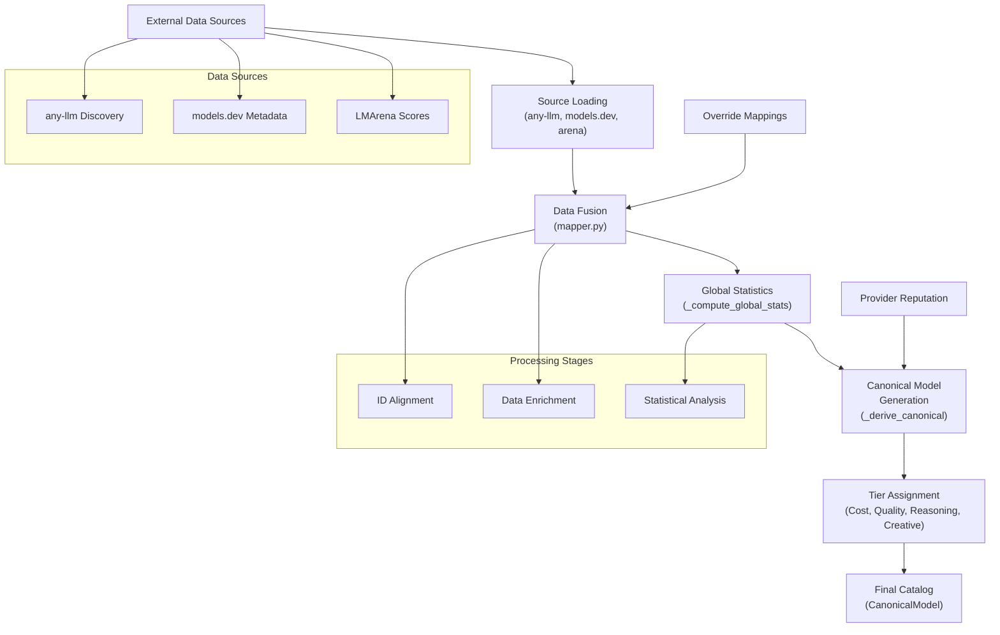
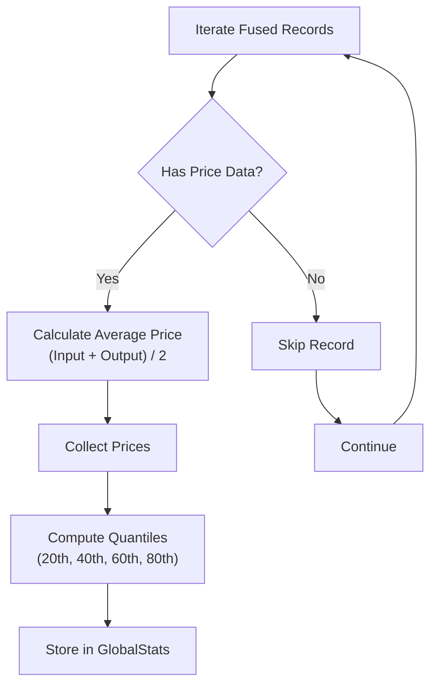
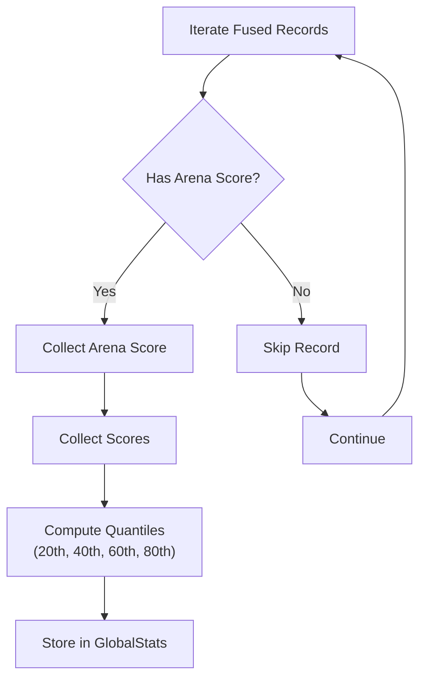
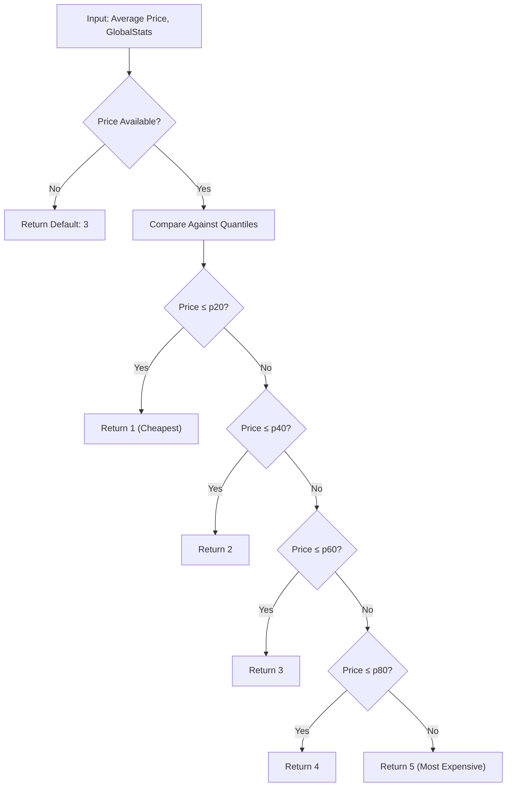
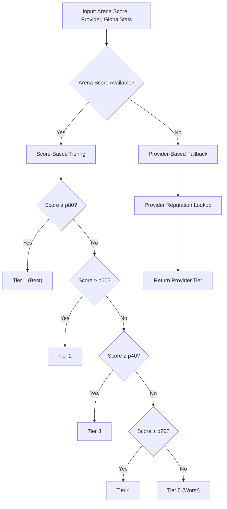
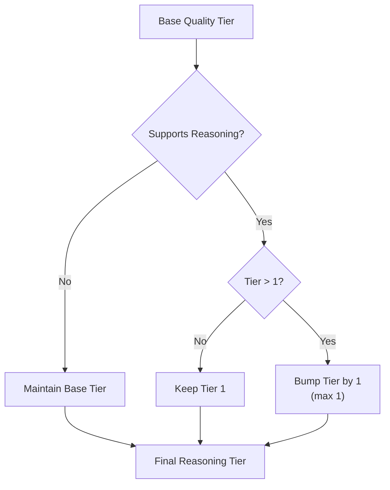
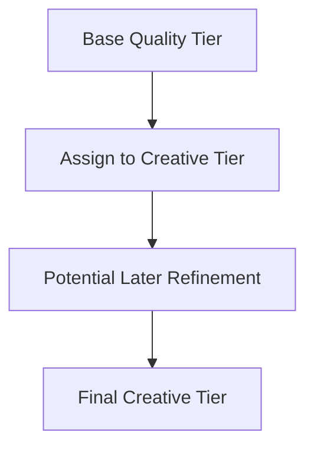
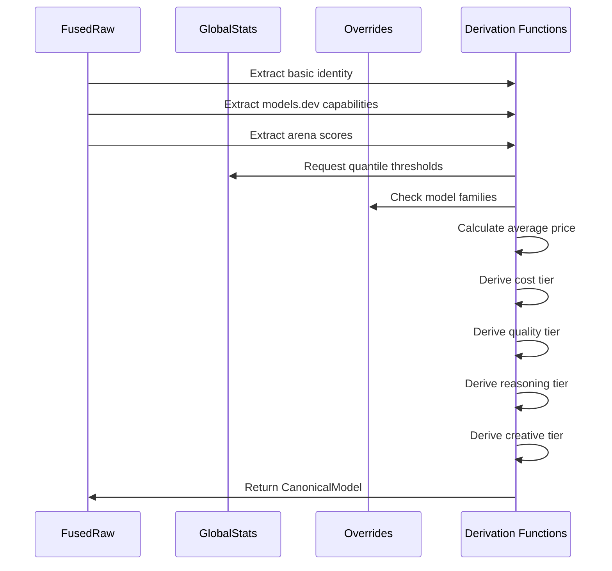
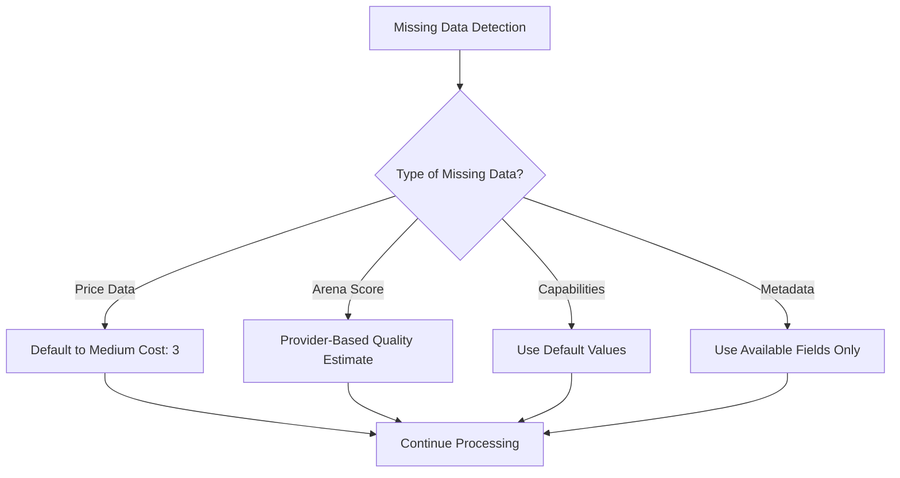
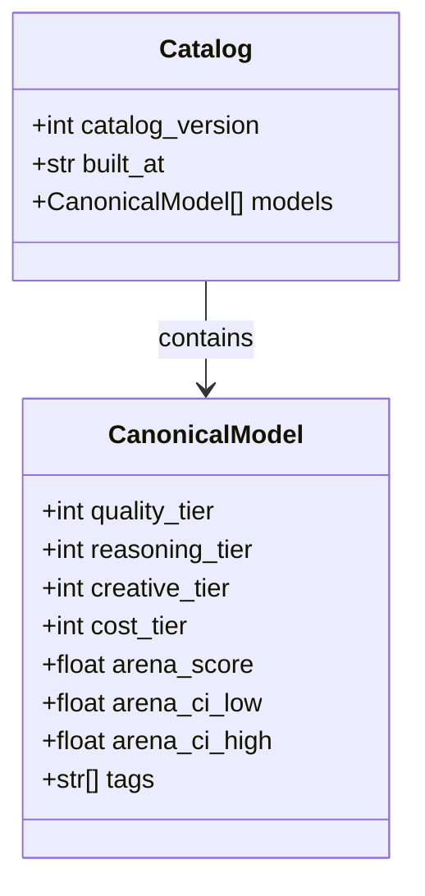

# Tier Derivation Mechanism Documentation

<cite>
**Referenced Files in This Document**
- [builder.py](file://packages/llmhub/src/llmhub/catalog/builder.py)
- [schema.py](file://packages/llmhub/src/llmhub/catalog/schema.py)
- [plan-catalog.md](file://packages/llmhub/src/llmhub/PLANS/plan-catalog.md)
- [leaderboard-text.json](file://packages/llmhub/src/llmhub/PLANS/data/leaderboard-text.json)
- [overrides.json](file://packages/llmhub/src/llmhub/catalog/data/overrides.json)
- [mapper.py](file://packages/llmhub/src/llmhub/catalog/mapper.py)
- [arena_source.py](file://packages/llmhub/src/llmhub/catalog/arena_source.py)
- [modelsdev_source.py](file://packages/llmhub/src/llmhub/catalog/modelsdev_source.py)
- [anyllm_source.py](file://packages/llmhub/src/llmhub/catalog/anyllm_source.py)
</cite>

## Table of Contents
1. [Introduction](#introduction)
2. [System Architecture Overview](#system-architecture-overview)
3. [Global Statistics Computation](#global-statistics-computation)
4. [Tier Derivation Functions](#tier-derivation-functions)
5. [Canonical Model Generation](#canonical-model-generation)
6. [Fallback Logic and Provider-Based Estimates](#fallback-logic-and-provider-based-estimates)
7. [Tier Threshold Examples](#tier-threshold-examples)
8. [Integration with Generator Pipeline](#integration-with-generator-pipeline)
9. [Performance Considerations](#performance-considerations)
10. [Troubleshooting Guide](#troubleshooting-guide)

## Introduction

The tier derivation mechanism in `builder.py` is a sophisticated system that computes normalized 1-5 scale ratings for cost, quality, reasoning, and creativity based on global statistics. This mechanism serves as the core business logic for model ranking and selection in the LLM Hub ecosystem, enabling intelligent model filtering and recommendation capabilities.

The system operates by analyzing pricing data and arena scores across all available models to establish quantile-based thresholds that determine tier assignments. These tiers are then used throughout the generator pipeline to facilitate model selection based on cost-effectiveness, quality, reasoning capabilities, and creative potential.

## System Architecture Overview

The tier derivation system follows a multi-stage pipeline architecture that coordinates data collection, statistical analysis, and business logic computation:

**Diagram sources**
- [builder.py](file://packages/llmhub/src/llmhub/catalog/builder.py#L302-L388)
- [mapper.py](file://packages/llmhub/src/llmhub/catalog/mapper.py#L32-L114)

**Section sources**
- [builder.py](file://packages/llmhub/src/llmhub/catalog/builder.py#L1-L388)
- [plan-catalog.md](file://packages/llmhub/src/llmhub/PLANS/plan-catalog.md#L291-L363)

## Global Statistics Computation

The `_compute_global_stats()` function serves as the foundation for tier derivation by calculating quantile-based thresholds from aggregated model data. This function processes two primary data streams: pricing information and arena quality scores.

### Price Quantile Calculation

The system collects pricing data by averaging input and output token costs for each model:

**Diagram sources**
- [builder.py](file://packages/llmhub/src/llmhub/catalog/builder.py#L70-L111)

The price quantiles are computed using NumPy's percentile function, establishing four threshold points that divide the price distribution into five equal-cost segments. These thresholds enable cost-effective model categorization across the 1-5 tier scale.

### Arena Score Quantile Calculation

Quality tier derivation relies on arena Elo-based scores, which represent comparative performance metrics:

**Diagram sources**
- [builder.py](file://packages/llmhub/src/llmhub/catalog/builder.py#L87-L109)

The arena score quantiles establish quality thresholds that reflect relative model performance within the competitive landscape, enabling objective quality assessment across diverse model families.

**Section sources**
- [builder.py](file://packages/llmhub/src/llmhub/catalog/builder.py#L70-L111)

## Tier Derivation Functions

The tier derivation system employs four specialized functions, each targeting specific aspects of model evaluation:

### Cost Tier Derivation

The `_derive_cost_tier()` function implements a straightforward pricing-based categorization:

**Diagram sources**
- [builder.py](file://packages/llmhub/src/llmhub/catalog/builder.py#L114-L129)

### Quality Tier Derivation

Quality tier assignment incorporates both quantitative arena scores and qualitative provider reputation:

**Diagram sources**
- [builder.py](file://packages/llmhub/src/llmhub/catalog/builder.py#L132-L156)

### Reasoning Tier Derivation

Reasoning capability enhances quality tiers for models that demonstrate advanced cognitive abilities:

**Diagram sources**
- [builder.py](file://packages/llmhub/src/llmhub/catalog/builder.py#L248-L251)

### Creative Tier Derivation

Creative capability inherits from quality tiers with potential refinement opportunities:

**Diagram sources**
- [builder.py](file://packages/llmhub/src/llmhub/catalog/builder.py#L253-L254)

**Section sources**
- [builder.py](file://packages/llmhub/src/llmhub/catalog/builder.py#L114-L254)

## Canonical Model Generation

The `_derive_canonical()` function orchestrates the transformation of fused raw records into enriched canonical models with derived tiers:

### Data Extraction and Validation

The function systematically extracts and validates data from multiple sources:

**Diagram sources**
- [builder.py](file://packages/llmhub/src/llmhub/catalog/builder.py#L184-L299)

### Capability Inference

The system infers model capabilities from multiple data sources, prioritizing models.dev availability while maintaining sensible defaults:

| Capability | Priority Source | Default Value |
|------------|----------------|---------------|
| Reasoning Support | models.dev | False |
| Tool Calling | models.dev | False |
| Structured Output | models.dev | False |
| Input Modalities | models.dev | ["text"] |
| Output Modalities | models.dev | ["text"] |

### Pricing Calculations

Average pricing is computed as the arithmetic mean of input and output token costs, enabling consistent cost comparisons across different pricing models.

**Section sources**
- [builder.py](file://packages/llmhub/src/llmhub/catalog/builder.py#L184-L299)

## Fallback Logic and Provider-Based Estimates

The tier derivation system implements comprehensive fallback mechanisms to ensure robust operation even when external data sources are incomplete or unavailable.

### Provider-Based Quality Estimates

When arena scores are unavailable, the system leverages established provider reputations:

| Provider | Default Quality Tier |
|----------|---------------------|
| anthropic | 1 |
| openai | 2 |
| google | 2 |
| deepseek | 3 |
| mistral | 3 |
| qwen | 3 |

This provider-based fallback ensures that models receive appropriate quality assessments even during periods of data unavailability or when dealing with emerging providers.

### Missing Data Handling

The system gracefully handles missing data across all dimensions:

**Diagram sources**
- [builder.py](file://packages/llmhub/src/llmhub/catalog/builder.py#L116-L156)

**Section sources**
- [builder.py](file://packages/llmhub/src/llmhub/catalog/builder.py#L116-L156)

## Tier Threshold Examples

The following examples illustrate how tier thresholds are applied in practice:

### Cost Tier Thresholds Example

Assuming the following price distribution among models:
- p20: $0.01 per million tokens
- p40: $0.05 per million tokens  
- p60: $0.10 per million tokens
- p80: $0.25 per million tokens

Tier assignments would be:
- **Tier 1**: Models priced at $0.01 or less per million tokens
- **Tier 2**: Models priced between $0.01 and $0.05 per million tokens
- **Tier 3**: Models priced between $0.05 and $0.10 per million tokens
- **Tier 4**: Models priced between $0.10 and $0.25 per million tokens
- **Tier 5**: Models priced above $0.25 per million tokens

### Quality Tier Thresholds Example

Using the arena leaderboard data from `leaderboard-text.json`:
- Sample arena scores: 1287.0, 1245.0, 1322.0, 1260.0, 1275.0, 1265.0, 1270.0, 1268.0

The system would compute quantiles and assign tiers based on relative performance within this dataset.

**Section sources**
- [leaderboard-text.json](file://packages/llmhub/src/llmhub/PLANS/data/leaderboard-text.json#L1-L45)

## Integration with Generator Pipeline

The tier derivation system integrates seamlessly with the generator pipeline through the CanonicalModel schema, providing essential metadata for intelligent model selection.

### Schema Integration

The CanonicalModel schema includes dedicated fields for all derived tiers:

**Diagram sources**
- [schema.py](file://packages/llmhub/src/llmhub/catalog/schema.py#L68-L122)

### Selection Criteria

The generator pipeline utilizes tier information for:
- **Cost-Effectiveness Filtering**: Selecting models within budget constraints
- **Quality-Based Ranking**: Prioritizing high-quality models for demanding tasks
- **Capability Matching**: Aligning model capabilities with task requirements
- **Diversity Balancing**: Ensuring varied model selection across different tiers

**Section sources**
- [schema.py](file://packages/llmhub/src/llmhub/catalog/schema.py#L68-L122)

## Performance Considerations

The tier derivation system is designed for efficient batch processing and minimal computational overhead:

### Computational Efficiency

- **Quantile Calculation**: Uses NumPy's optimized percentile functions
- **Linear Scanning**: Single-pass iteration through fused records
- **Early Termination**: Immediate return for default cases
- **Memory Efficiency**: Minimal intermediate data structures

### Caching Strategy

The system leverages TTL-based caching to minimize redundant computations:
- **Catalog-Level Caching**: Complete catalog serialization with timestamp validation
- **Source-Level Caching**: Individual source data caching with configurable TTL
- **Statistical Caching**: Global statistics persistence across sessions

### Scalability Factors

- **Linear Complexity**: O(n) scaling with number of models
- **Memory Proportional**: Memory usage scales linearly with data volume
- **Network Efficiency**: Intelligent retry logic and timeout handling
- **Graceful Degradation**: Partial functionality during network issues

## Troubleshooting Guide

Common issues and resolution strategies for the tier derivation system:

### Missing Arena Data

**Symptoms**: Models receive provider-based quality estimates instead of arena scores
**Causes**: 
- Network connectivity issues
- Arena update script failures
- Missing cached data

**Resolution**:
1. Verify internet connectivity
2. Check arena cache directory permissions
3. Force refresh using `build_catalog(force_refresh=True)`
4. Review arena update script logs

### Inconsistent Tier Assignments

**Symptoms**: Unexpected tier values for known models
**Causes**:
- Outdated global statistics
- Missing override mappings
- Data source inconsistencies

**Resolution**:
1. Clear cache and rebuild catalog
2. Verify override mappings in `overrides.json`
3. Check data source integrity
4. Review quantile calculations

### Performance Issues

**Symptoms**: Slow catalog building times
**Causes**:
- Large number of models
- Network timeouts
- Insufficient system resources

**Resolution**:
1. Increase timeout values
2. Reduce concurrent connections
3. Optimize memory allocation
4. Use force refresh sparingly

**Section sources**
- [arena_source.py](file://packages/llmhub/src/llmhub/catalog/arena_source.py#L121-L162)
- [builder.py](file://packages/llmhub/src/llmhub/catalog/builder.py#L302-L388)