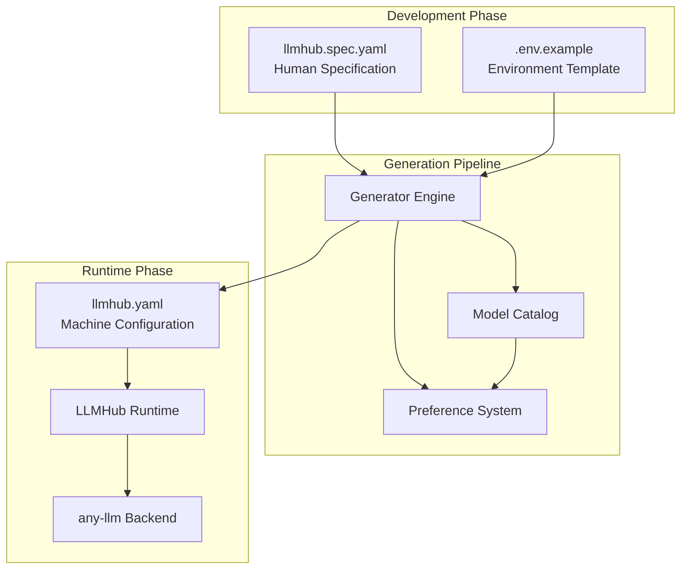
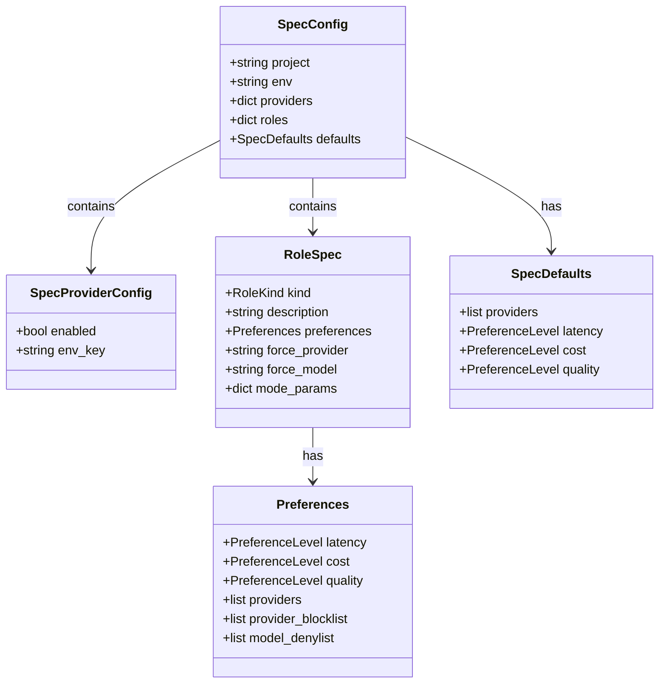
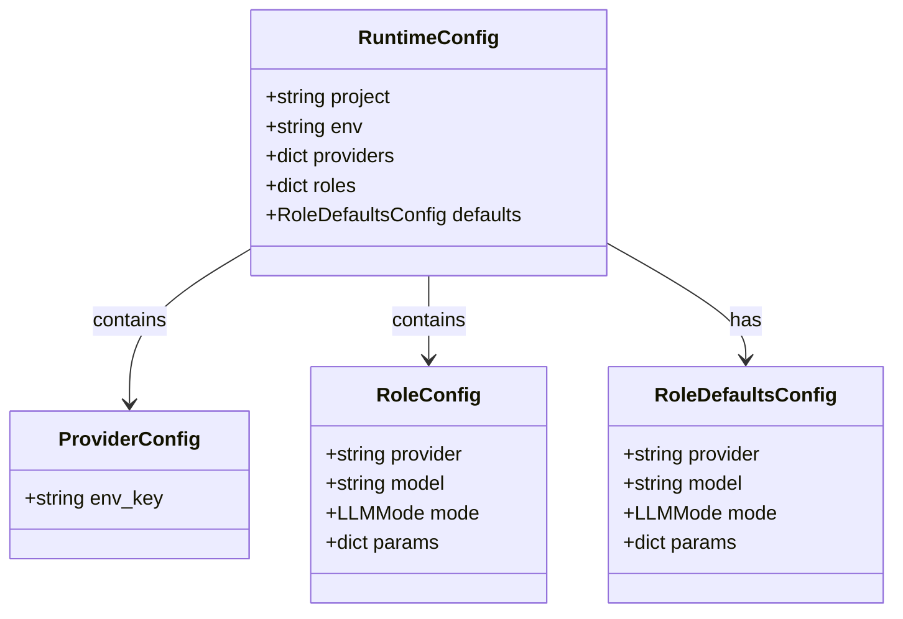
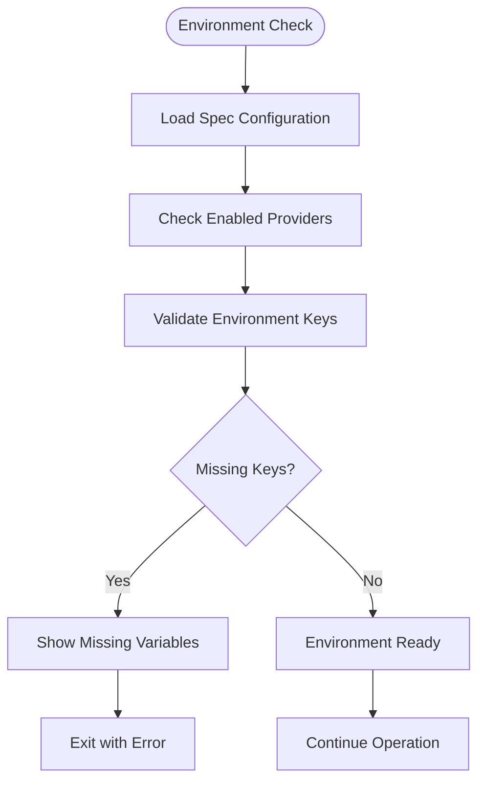
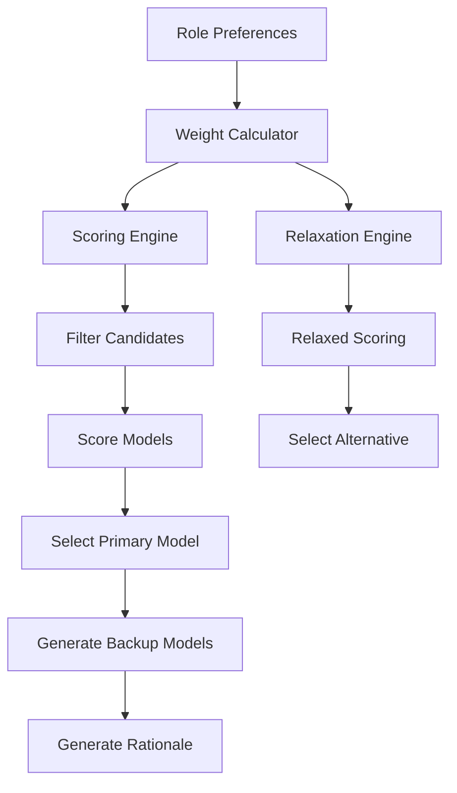
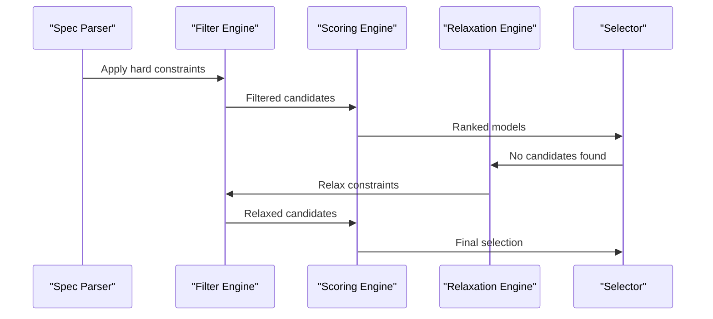
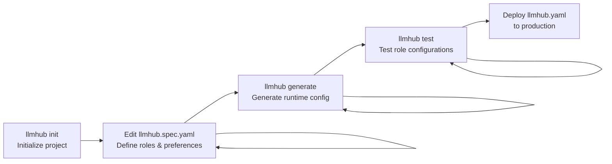
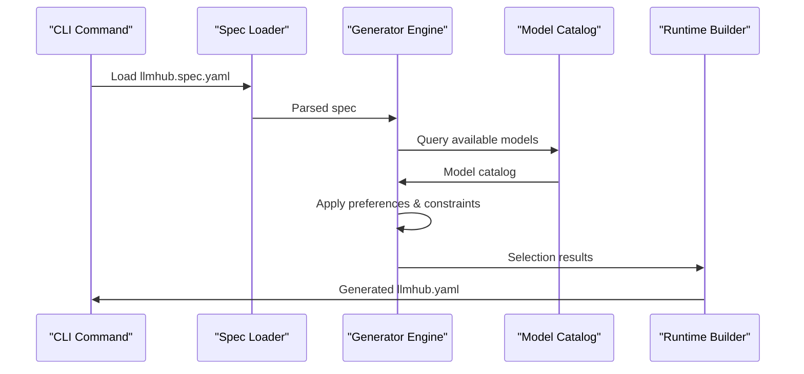

# Configuration

<cite>
**Referenced Files in This Document**
- [README.md](file://README.md)
- [packages/llmhub/README.md](file://packages/llmhub/README.md)
- [packages/llmhub/src/llmhub/spec_models.py](file://packages/llmhub/src/llmhub/spec_models.py)
- [packages/llmhub/src/llmhub/generator/sp1_spec_schema/models.py](file://packages/llmhub/src/llmhub/generator/sp1_spec_schema/models.py)
- [packages/llmhub_runtime/tests/fixtures/llmhub.yaml](file://packages/llmhub_runtime/tests/fixtures/llmhub.yaml)
- [packages/llmhub_runtime/src/llmhub_runtime/models.py](file://packages/llmhub_runtime/src/llmhub_runtime/models.py)
- [packages/llmhub_runtime/src/llmhub_runtime/config_loader.py](file://packages/llmhub_runtime/src/llmhub_runtime/config_loader.py)
- [packages/llmhub/src/llmhub/generator/sp10_machine_config_emitter/builder.py](file://packages/llmhub/src/llmhub/generator/sp10_machine_config_emitter/builder.py)
- [packages/llmhub/src/llmhub/generator/sp6_weights/calculator.py](file://packages/llmhub/src/llmhub/generator/sp6_weights/calculator.py)
- [packages/llmhub/src/llmhub/generator/sp7_scoring_engine/scorer.py](file://packages/llmhub/src/llmhub/generator/sp7_scoring_engine/scorer.py)
- [packages/llmhub/src/llmhub/generator/sp9_selector_orchestrator/orchestrator.py](file://packages/llmhub/src/llmhub/generator/sp9_selector_orchestrator/orchestrator.py)
- [packages/llmhub/src/llmhub/env_manager.py](file://packages/llmhub/src/llmhub/env_manager.py)
- [packages/llmhub/src/llmhub/commands/env_cmd.py](file://packages/llmhub/src/llmhub/commands/env_cmd.py)
</cite>

## Table of Contents
1. [Introduction](#introduction)
2. [Configuration Architecture](#configuration-architecture)
3. [Human-Facing Spec Configuration](#human-facing-spec-configuration)
4. [Machine-Facing Runtime Configuration](#machine-facing-runtime-configuration)
5. [Environment Variable Management](#environment-variable-management)
6. [Model Selection and Preferences](#model-selection-and-preferences)
7. [Configuration Workflow](#configuration-workflow)
8. [Best Practices](#best-practices)
9. [Troubleshooting](#troubleshooting)

## Introduction

LLM Hub employs a dual-configuration approach that separates **what you want** from **how it runs**. This design enables declarative LLM configuration management while maintaining flexibility and automation capabilities.

The system operates through two distinct configuration files:
- **Human-facing spec (`llmhub.spec.yaml`)**: Defines project requirements, preferences, and logical roles
- **Machine-facing runtime (`llmhub.yaml`)**: Contains concrete provider/model assignments and parameters

This separation allows for:
- **Configuration-driven model selection**: Change models by editing YAML, not code
- **Environment-specific configurations**: Different setups for dev, staging, and production
- **Intelligent automation**: The generator pipeline selects optimal models based on preferences
- **Version control**: All LLM decisions become part of your codebase

## Configuration Architecture



**Diagram sources**
- [packages/llmhub/src/llmhub/generator/spec.md](file://packages/llmhub/src/llmhub/generator/spec.md#L1-L93)
- [packages/llmhub/src/llmhub/generator/sp10_machine_config_emitter/builder.py](file://packages/llmhub/src/llmhub/generator/sp10_machine_config_emitter/builder.py#L1-L113)

## Human-Facing Spec Configuration

### Schema Overview

The `llmhub.spec.yaml` file serves as the authoritative specification of your project's LLM needs. It uses a structured YAML format with validation through Pydantic models.



**Diagram sources**
- [packages/llmhub/src/llmhub/spec_models.py](file://packages/llmhub/src/llmhub/spec_models.py#L59-L66)
- [packages/llmhub/src/llmhub/generator/sp1_spec_schema/models.py](file://packages/llmhub/src/llmhub/generator/sp1_spec_schema/models.py#L58-L64)

### Project and Environment Settings

```yaml
project: my-application
env: development
```

- **project**: Logical name for your application (used for logging and identification)
- **env**: Environment designation (dev, staging, production) for environment-specific configurations

### Provider Configuration

```yaml
providers:
  openai:
    enabled: true
    env_key: OPENAI_API_KEY
  anthropic:
    enabled: true
    env_key: ANTHROPIC_API_KEY
  google:
    enabled: false
    env_key: GOOGLE_API_KEY
```

Each provider entry defines:
- **enabled**: Whether this provider is considered during model selection
- **env_key**: Environment variable name containing the API key

### Role Specifications

Roles represent logical LLM functions with associated preferences:

```yaml
roles:
  llm.preprocess:
    kind: chat
    description: Fast preprocessing model to normalize input
    preferences:
      cost: low
      latency: low
      quality: medium
      providers:
        - openai
        - anthropic
  
  llm.inference:
    kind: chat
    description: Main reasoning model for answering questions
    preferences:
      cost: medium
      latency: medium
      quality: high
      providers:
        - openai
        - anthropic
        - google
```

#### Role Properties

| Property | Type | Description | Required |
|----------|------|-------------|----------|
| `kind` | enum | `chat`, `embedding`, `image`, `audio`, `tool`, `other` | Yes |
| `description` | string | Human-readable role description | Yes |
| `preferences` | object | Model selection preferences | No |
| `force_provider` | string | Override automatic provider selection | No |
| `force_model` | string | Override automatic model selection | No |
| `mode_params` | object | Default parameters for this role | No |

### Preferences System

The preferences system guides model selection through quantitative criteria:

```yaml
preferences:
  cost: low        # low | medium | high
  latency: medium  # low | medium | high
  quality: high    # low | medium | high
  providers: [openai, anthropic]  # Allowlist
  provider_blocklist: [google]    # Denylist
  model_denylist: [gpt-4-turbo]   # Model-specific denylist
```

#### Preference Levels

- **low**: Prioritizes cost-effectiveness and speed
- **medium**: Balanced approach to all factors
- **high**: Prioritizes quality and capabilities

**Section sources**
- [packages/llmhub/src/llmhub/spec_models.py](file://packages/llmhub/src/llmhub/spec_models.py#L13-L56)
- [packages/llmhub/src/llmhub/generator/sp1_spec_schema/models.py](file://packages/llmhub/src/llmhub/generator/sp1_spec_schema/models.py#L18-L37)

## Machine-Facing Runtime Configuration

### Schema Overview

The `llmhub.yaml` file contains concrete provider/model assignments generated from the spec. It follows the runtime schema defined by `llmhub_runtime`.



**Diagram sources**
- [packages/llmhub_runtime/src/llmhub_runtime/models.py](file://packages/llmhub_runtime/src/llmhub_runtime/models.py#L28-L41)

### Generated Configuration Structure

```yaml
project: my-application
env: development

providers:
  openai:
    env_key: OPENAI_API_KEY
  anthropic:
    env_key: ANTHROPIC_API_KEY

roles:
  llm.preprocess:
    provider: openai
    model: gpt-4o-mini
    mode: chat
    params:
      temperature: 0.2
      max_tokens: 512
  
  llm.inference:
    provider: anthropic
    model: claude-3-5-sonnet-20241022
    mode: chat
    params:
      temperature: 0.7
      max_tokens: 2048
  
  llm.embedding:
    provider: openai
    model: text-embedding-3-small
    mode: embedding
    params:
      embedding_dim: 1536

defaults:
  provider: openai
  model: gpt-4o-mini
  mode: chat
  params:
    temperature: 0.3
    max_tokens: 1024
```

### Provider Configuration

```yaml
providers:
  openai:
    env_key: OPENAI_API_KEY
  anthropic:
    env_key: ANTHROPIC_API_KEY
```

Each provider entry specifies:
- **env_key**: Environment variable name for API authentication

### Role Configuration

```yaml
roles:
  llm.inference:
    provider: anthropic
    model: claude-3-5-sonnet-20241022
    mode: chat
    params:
      temperature: 0.7
      max_tokens: 2048
```

#### Role Properties

| Property | Type | Description |
|----------|------|-------------|
| `provider` | string | Concrete provider name |
| `model` | string | Specific model identifier |
| `mode` | enum | LLM operation mode |
| `params` | object | Model-specific parameters |

### Mode Parameters

Different LLM modes support various parameters:

```yaml
mode_params:
  # Chat models
  temperature: 0.7
  max_tokens: 2048
  top_p: 0.95
  frequency_penalty: 0.1
  presence_penalty: 0.1
  
  # Embedding models
  embedding_dim: 1536
  
  # Tool models
  tools: []
```

**Section sources**
- [packages/llmhub_runtime/src/llmhub_runtime/models.py](file://packages/llmhub_runtime/src/llmhub_runtime/models.py#L13-L41)
- [packages/llmhub/src/llmhub/generator/sp10_machine_config_emitter/builder.py](file://packages/llmhub/src/llmhub/generator/sp10_machine_config_emitter/builder.py#L19-L88)

## Environment Variable Management

### Environment Variable Integration

LLM Hub integrates seamlessly with environment variables for secure credential management:

```yaml
# llmhub.spec.yaml
providers:
  openai:
    enabled: true
    env_key: OPENAI_API_KEY
  anthropic:
    enabled: true
    env_key: ANTHROPIC_API_KEY
```

### Automatic Environment Example Generation

The CLI automatically generates `.env.example` files:

```bash
# .env.example
# LLMHub generated .env.example for project: my-application (env: development)

# OpenAI API key
OPENAI_API_KEY=

# Anthropic API key
ANTHROPIC_API_KEY=
```

### Environment Validation



**Diagram sources**
- [packages/llmhub/src/llmhub/env_manager.py](file://packages/llmhub/src/llmhub/env_manager.py#L46-L71)

### Strict Environment Validation

For production deployments, enable strict validation:

```bash
# Enable strict environment validation
llmhub doctor --strict-env
```

This ensures all required API keys are present before runtime execution.

**Section sources**
- [packages/llmhub/src/llmhub/env_manager.py](file://packages/llmhub/src/llmhub/env_manager.py#L46-L71)
- [packages/llmhub/src/llmhub/commands/env_cmd.py](file://packages/llmhub/src/llmhub/commands/env_cmd.py#L44-L80)

## Model Selection and Preferences

### Preference-Based Model Selection

The generator pipeline transforms preferences into concrete model selections using a sophisticated scoring system:



**Diagram sources**
- [packages/llmhub/src/llmhub/generator/sp9_selector_orchestrator/orchestrator.py](file://packages/llmhub/src/llmhub/generator/sp9_selector_orchestrator/orchestrator.py#L16-L108)

### Weight Calculation

The system derives numerical weights from preference levels:

```python
# Example weight calculation logic
raw_weights = {
    "w_quality": 0.4,    # Quality preference
    "w_cost": 0.3,       # Cost preference  
    "w_reasoning": 0.2,  # Reasoning capability
    "w_creative": 0.1,   # Creative tasks
    "w_context": 0.1,    # Context window
    "w_freshness": 0.1   # Model recency
}
```

### Scoring Criteria

Models are scored across multiple dimensions:

| Factor | Weight Range | Description |
|--------|--------------|-------------|
| Quality | 0.2-0.4 | Arena score, provider reputation |
| Cost | 0.1-0.3 | Price per million tokens |
| Latency | 0.1-0.2 | Response time characteristics |
| Reasoning | 0.1-0.3 | Extended reasoning capabilities |
| Creativity | 0.05-0.2 | Creative task performance |
| Context | 0.1-0.2 | Maximum context window |

### Model Selection Process



**Diagram sources**
- [packages/llmhub/src/llmhub/generator/sp7_scoring_engine/scorer.py](file://packages/llmhub/src/llmhub/generator/sp7_scoring_engine/scorer.py#L123-L165)

### Override Mechanisms

For critical roles, you can enforce specific providers and models:

```yaml
roles:
  llm.critical:
    kind: chat
    description: Critical production workload
    force_provider: anthropic
    force_model: claude-3-5-sonnet-20241022
    preferences:
      quality: high
```

**Section sources**
- [packages/llmhub/src/llmhub/generator/sp6_weights/calculator.py](file://packages/llmhub/src/llmhub/generator/sp6_weights/calculator.py#L51-L72)
- [packages/llmhub/src/llmhub/generator/sp7_scoring_engine/scorer.py](file://packages/llmhub/src/llmhub/generator/sp7_scoring_engine/scorer.py#L123-L165)

## Configuration Workflow

### Development Workflow



### CLI Commands Overview

| Command | Purpose | Usage |
|---------|---------|-------|
| `llmhub init` | Quick project initialization | Creates minimal spec and env example |
| `llmhub setup` | Interactive setup | Guided specification creation |
| `llmhub generate` | Generate runtime config | Converts spec to runtime |
| `llmhub test` | Test role configurations | Validates role functionality |
| `llmhub doctor` | Health check | Comprehensive validation |

### Generation Process

The generation process transforms human specifications into machine configurations:



**Diagram sources**
- [packages/llmhub/src/llmhub/generator/spec.md](file://packages/llmhub/src/llmhub/generator/spec.md#L1-L93)

### Environment-Specific Configurations

Create different configurations for various environments:

```bash
# Development configuration
llmhub generate --dry-run > llmhub.dev.yaml

# Production configuration  
llmhub generate --force > llmhub.prod.yaml

# Staging configuration
llmhub generate --dry-run > llmhub.staging.yaml
```

**Section sources**
- [packages/llmhub/src/llmhub/commands/runtime_cmd.py](file://packages/llmhub/src/llmhub/commands/runtime_cmd.py#L13-L43)

## Best Practices

### Role Organization

Structure roles logically for maintainability:

```yaml
# Good: Hierarchical, descriptive naming
roles:
  llm.user.interaction:
    kind: chat
    description: User-facing conversation handling
  
  llm.admin.analytics:
    kind: chat  
    description: Administrative analytics and reporting
  
  llm.system.processing:
    kind: chat
    description: Internal system processing tasks
```

### Preference Setting Guidelines

Set realistic preferences based on use case requirements:

```yaml
# For cost-sensitive applications
roles:
  llm.summary:
    kind: chat
    preferences:
      cost: high      # Prioritize cost over quality
      latency: medium # Acceptable response time
      quality: medium # Good enough for summarization

# For quality-critical applications  
roles:
  llm.analysis:
    kind: chat
    preferences:
      cost: medium    # Balance cost and quality
      latency: low    # Fast response required
      quality: high   # Must be accurate
```

### Provider Management

Configure providers systematically:

```yaml
# Enable only necessary providers
providers:
  openai:
    enabled: true
    env_key: OPENAI_API_KEY
  anthropic:
    enabled: true
    env_key: ANTHROPIC_API_KEY
  # Disable unused providers
  google:
    enabled: false
    env_key: GOOGLE_API_KEY
```

### Parameter Defaults

Establish sensible defaults for common parameters:

```yaml
defaults:
  params:
    temperature: 0.3      # Conservative default
    max_tokens: 1024      # Reasonable default limit
    top_p: 0.9           # Good diversity control

roles:
  llm.conversational:
    kind: chat
    description: Interactive conversations
    mode_params:
      temperature: 0.7    # More creative for chat
      max_tokens: 512     # Shorter responses
```

### Version Control Strategy

```bash
# Track configuration files
git add llmhub.spec.yaml
git add llmhub.yaml
git add .env.example

# Exclude sensitive files
echo ".env" >> .gitignore
echo ".env.local" >> .gitignore
```

## Troubleshooting

### Common Configuration Issues

#### Missing Environment Variables

```bash
# Check for missing environment variables
llmhub env check

# Expected output:
# Missing environment variables:
# - OPENAI_API_KEY (provider: openai)
# - ANTHROPIC_API_KEY (provider: anthropic)
```

#### Invalid Spec Configuration

```bash
# Validate spec file
llmhub spec validate

# Fix validation errors in llmhub.spec.yaml
```

#### Model Selection Problems

```bash
# Generate with explanations to understand model choices
llmhub generate --explain

# Review the rationale for model selections
```

### Debugging Configuration

#### Dry Run Mode

```bash
# Preview generation without writing files
llmhub generate --dry-run --explain
```

#### Environment Validation

```bash
# Comprehensive health check
llmhub doctor

# Skip network-dependent checks
llmhub doctor --no-network
```

### Configuration Migration

When upgrading LLM Hub:

```bash
# Backup existing configurations
cp llmhub.yaml llmhub.yaml.backup
cp llmhub.spec.yaml llmhub.spec.yaml.backup

# Regenerate with fresh configuration
llmhub generate --force
```

**Section sources**
- [packages/llmhub/src/llmhub/commands/env_cmd.py](file://packages/llmhub/src/llmhub/commands/env_cmd.py#L44-L80)