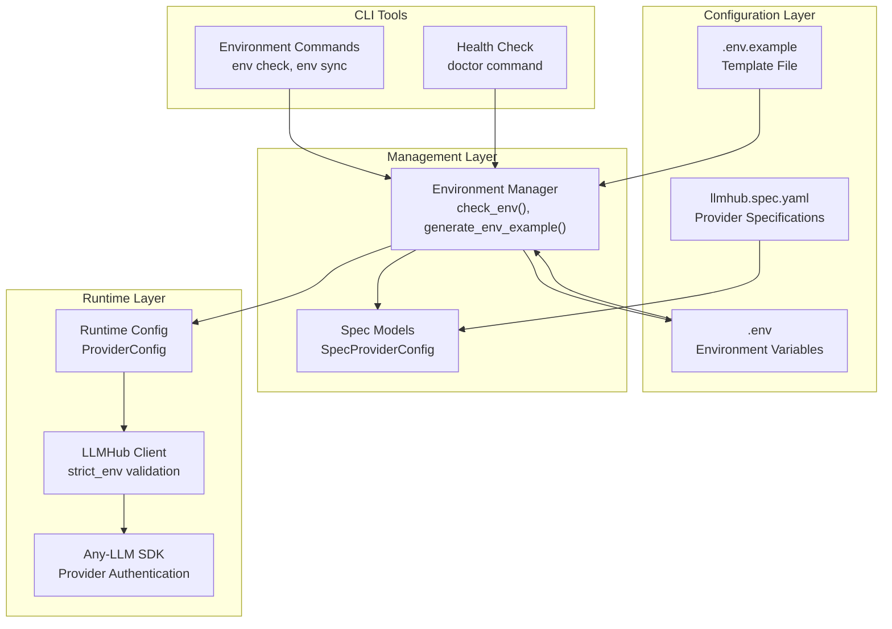
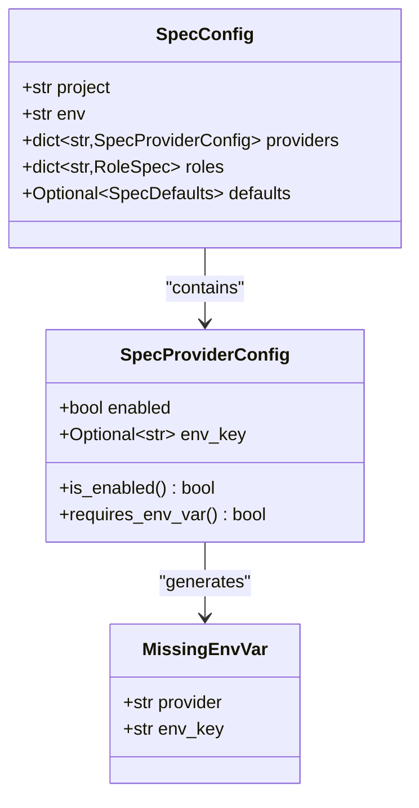
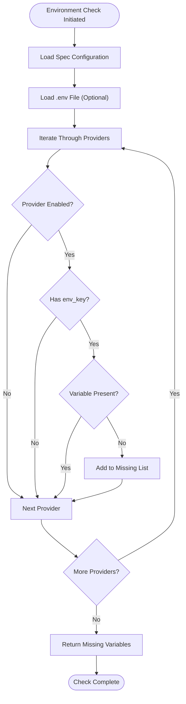
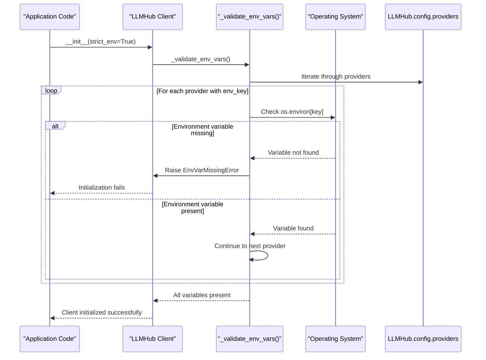
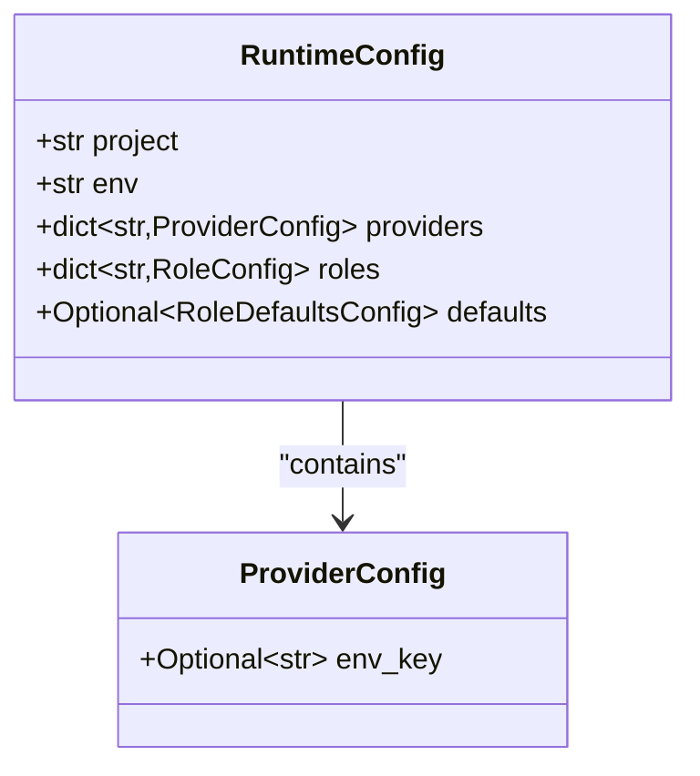

# Environment Variables

<cite>
**Referenced Files in This Document**
- [env_manager.py](file://packages/llmhub/src/llmhub/env_manager.py)
- [spec_models.py](file://packages/llmhub/src/llmhub/spec_models.py)
- [context.py](file://packages/llmhub/src/llmhub/context.py)
- [env_cmd.py](file://packages/llmhub/src/llmhub/commands/env_cmd.py)
- [ux.py](file://packages/llmhub/src/llmhub/ux.py)
- [test_env_manager.py](file://packages/llmhub/tests/test_env_manager.py)
- [hub.py](file://packages/llmhub_runtime/src/llmhub_runtime/hub.py)
- [models.py](file://packages/llmhub_runtime/src/llmhub_runtime/models.py)
- [errors.py](file://packages/llmhub_runtime/src/llmhub_runtime/errors.py)
- [README.md](file://packages/llmhub/README.md)
</cite>

## Table of Contents
1. [Introduction](#introduction)
2. [Environment Variable Architecture](#environment-variable-architecture)
3. [Spec Configuration Model](#spec-configuration-model)
4. [Environment Manager Implementation](#environment-manager-implementation)
5. [Runtime Validation System](#runtime-validation-system)
6. [CLI Commands for Environment Management](#cli-commands-for-environment-management)
7. [Best Practices and Security](#best-practices-and-security)
8. [Environment-Specific Workflows](#environment-specific-workflows)
9. [Troubleshooting Environment Issues](#troubleshooting-environment-issues)
10. [Integration Examples](#integration-examples)

## Introduction

The LLM Hub configuration system provides a sophisticated environment variable management solution that enables secure, flexible, and scalable handling of API keys and sensitive configuration data. This system separates the specification of what LLM services are needed from how they are accessed, using environment variables as the bridge between configuration and execution.

The environment variable integration serves several critical purposes:
- **Security**: Keeps sensitive API keys out of source code and configuration files
- **Flexibility**: Enables easy switching between different environments (development, staging, production)
- **Scalability**: Supports multiple providers and configurations without code changes
- **Validation**: Provides comprehensive checks for missing or incorrect environment variables

## Environment Variable Architecture

The LLM Hub environment variable system follows a layered architecture that separates concerns between specification, validation, and runtime execution.



**Diagram sources**
- [env_manager.py](file://packages/llmhub/src/llmhub/env_manager.py#L46-L71)
- [spec_models.py](file://packages/llmhub/src/llmhub/spec_models.py#L30-L34)
- [hub.py](file://packages/llmhub_runtime/src/llmhub_runtime/hub.py#L17-L60)

### Core Components

The environment variable system consists of several interconnected components:

1. **SpecProviderConfig**: Defines provider configuration with optional environment key references
2. **Environment Manager**: Handles loading, validation, and generation of environment-related files
3. **Runtime Validation**: Ensures required environment variables are present during initialization
4. **CLI Commands**: Provides user-friendly tools for environment management

**Section sources**
- [spec_models.py](file://packages/llmhub/src/llmhub/spec_models.py#L30-L34)
- [env_manager.py](file://packages/llmhub/src/llmhub/env_manager.py#L9-L71)

## Spec Configuration Model

The specification system defines how providers are configured with environment variable references through the `SpecProviderConfig` model.

### SpecProviderConfig Structure



**Diagram sources**
- [spec_models.py](file://packages/llmhub/src/llmhub/spec_models.py#L30-L34)
- [env_manager.py](file://packages/llmhub/src/llmhub/env_manager.py#L9-L13)

### Provider Configuration Patterns

The spec system supports various patterns for environment variable integration:

| Pattern | Description | Use Case |
|---------|-------------|----------|
| `enabled: true, env_key: "OPENAI_API_KEY"` | Standard API key | Production OpenAI integration |
| `enabled: false, env_key: null` | Disabled provider | Staging environment exclusion |
| `enabled: true, env_key: null` | No authentication | Local/mock provider |
| `enabled: true, env_key: "CUSTOM_VAR"` | Custom environment variable | Specialized API integrations |

**Section sources**
- [spec_models.py](file://packages/llmhub/src/llmhub/spec_models.py#L30-L34)
- [README.md](file://packages/llmhub/README.md#L244-L286)

## Environment Manager Implementation

The environment manager provides core functionality for loading, validating, and generating environment-related files using the `python-dotenv` library.

### Environment Validation Process



**Diagram sources**
- [env_manager.py](file://packages/llmhub/src/llmhub/env_manager.py#L46-L71)

### Key Functions

The environment manager provides two primary functions:

#### `check_env()` Function
Validates that all required environment variables are present for enabled providers:

```python
def check_env(spec: SpecConfig, load_dotenv_path: Optional[Path] = None) -> list[MissingEnvVar]:
    """
    Check for missing environment variables required by spec.
    
    Args:
        spec: SpecConfig with provider definitions.
        load_dotenv_path: Optional path to .env file to load before checking.
    
    Returns:
        List of missing environment variables.
    """
```

#### `generate_env_example()` Function
Creates a template `.env.example` file based on the specification:

```python
def generate_env_example(spec: SpecConfig, path: Path, overwrite: bool = True) -> None:
    """
    Generate .env.example file from spec providers.
    
    Args:
        spec: SpecConfig with provider definitions.
        path: Path to write .env.example.
        overwrite: Whether to overwrite existing file.
    """
```

**Section sources**
- [env_manager.py](file://packages/llmhub/src/llmhub/env_manager.py#L46-L71)

## Runtime Validation System

The runtime system provides strict environment validation through the `strict_env` parameter in the LLMHub client initialization.

### Strict Environment Validation



**Diagram sources**
- [hub.py](file://packages/llmhub_runtime/src/llmhub_runtime/hub.py#L52-L59)

### Runtime Configuration Model

The runtime configuration mirrors the spec model but focuses on operational settings:



**Diagram sources**
- [models.py](file://packages/llmhub_runtime/src/llmhub_runtime/models.py#L13-L15)

### Error Handling

The runtime system raises `EnvVarMissingError` when environment variables are required but missing:

```python
class EnvVarMissingError(LLMHubRuntimeError):
    """If runtime chooses to validate env_key and the required env var is missing."""
```

**Section sources**
- [hub.py](file://packages/llmhub_runtime/src/llmhub_runtime/hub.py#L52-L59)
- [errors.py](file://packages/llmhub_runtime/src/llmhub_runtime/errors.py#L17-L19)

## CLI Commands for Environment Management

The LLM Hub CLI provides comprehensive tools for environment variable management through dedicated commands.

### Environment Sync Command

The `env sync` command generates or updates the `.env.example` file:

```bash
# Generate .env.example from current spec
llmhub env sync

# Dry-run to preview changes without writing
llmhub env sync --dry-run
```

**Implementation Details:**
- Creates a template file with comments for each provider requiring API keys
- Includes project name and environment information for clarity
- Supports both creation and updating of existing files

### Environment Check Command

The `env check` command validates that all required environment variables are present:

```bash
# Check environment using default .env file
llmhub env check

# Check with custom .env file
llmhub env check --env-file .env.production

# Check without loading any .env file
llmhub env check --env-file none
```

**Validation Process:**
1. Loads the specification file
2. Optionally loads a specified `.env` file
3. Validates all enabled providers with environment keys
4. Reports missing variables with provider context

### Health Check Integration

The `doctor` command integrates environment validation as part of comprehensive system checks:

```bash
# Full health check including environment validation
llmhub doctor

# Health check without network connectivity tests
llmhub doctor --no-network
```

**Section sources**
- [env_cmd.py](file://packages/llmhub/src/llmhub/commands/env_cmd.py#L12-L80)
- [README.md](file://packages/llmhub/README.md#L388-L400)

## Best Practices and Security

### Environment Variable Management Guidelines

#### 1. Template Creation and Maintenance
Always maintain `.env.example` files to document required environment variables:

```yaml
# llmhub.spec.yaml
providers:
  openai:
    enabled: true
    env_key: OPENAI_API_KEY
  anthropic:
    enabled: true
    env_key: ANTHROPIC_API_KEY
```

The system automatically generates:
```bash
# .env.example
# LLMHub generated .env.example for project: my-app (env: production)

# Openai API key
OPENAI_API_KEY=

# Anthropic API key
ANTHROPIC_API_KEY=
```

#### 2. Secret Storage and Access Control
- **Never commit `.env` files** to version control
- Use `.gitignore` to exclude environment files
- Implement proper access controls for production secrets
- Consider using secret management systems for sensitive deployments

#### 3. Environment-Specific Configuration
Maintain separate environment files for different deployment stages:

```bash
# Development
.env.development
.env.production
.env.staging
```

#### 4. Validation Strategies
Implement multiple layers of validation:

```python
# Runtime validation (strict mode)
hub = LLMHub(config_path="llmhub.yaml", strict_env=True)

# CLI validation
llmhub env check

# Spec validation
llmhub spec validate
```

### Security Considerations

#### API Key Protection
- Store API keys as environment variables, not in configuration files
- Use different keys for development and production environments
- Rotate keys regularly and monitor usage
- Implement rate limiting and monitoring for API calls

#### Access Control
- Limit access to environment variables to authorized personnel
- Use role-based access control for CI/CD systems
- Audit environment variable usage and changes
- Implement logging for environment variable access

**Section sources**
- [README.md](file://packages/llmhub/README.md#L610-L653)
- [test_env_manager.py](file://packages/llmhub/tests/test_env_manager.py#L8-L30)

## Environment-Specific Workflows

### Development Environment Setup

```bash
# 1. Initialize project
llmhub init

# 2. Copy and edit environment template
cp .env.example .env
echo "OPENAI_API_KEY=sk-dev-your-key" >> .env
echo "ANTHROPIC_API_KEY=sk-dev-anthropic-key" >> .env

# 3. Validate environment
llmhub env check

# 4. Generate runtime configuration
llmhub generate
```

### Production Deployment

```bash
# 1. Use environment-specific configuration
llmhub generate --force > llmhub.prod.yaml

# 2. Deploy with production environment variables
export OPENAI_API_KEY=$PROD_OPENAI_KEY
export ANTHROPIC_API_KEY=$PROD_ANTHROPIC_KEY

# 3. Initialize with strict validation
hub = LLMHub(config_path="llmhub.prod.yaml", strict_env=True)
```

### Staging Environment

```bash
# 1. Separate staging configuration
llmhub generate --dry-run > llmhub.staging.yaml

# 2. Use staging-specific keys
llmhub env check --env-file .env.staging

# 3. Validate before deployment
llmhub doctor --no-network
```

### CI/CD Integration

```yaml
# GitHub Actions example
name: Validate LLM Configuration
on: [push, pull_request]
jobs:
  validate:
    runs-on: ubuntu-latest
    steps:
      - uses: actions/checkout@v2
      - uses: actions/setup-python@v2
      - run: pip install rethink-llmhub
      - run: llmhub spec validate
      - run: llmhub env check --env-file .env.example
```

**Section sources**
- [README.md](file://packages/llmhub/README.md#L422-L440)
- [README.md](file://packages/llmhub/README.md#L472-L491)

## Troubleshooting Environment Issues

### Common Environment Problems

#### Missing Environment Variables
**Symptoms:**
- `EnvVarMissingError` during LLMHub initialization
- `llmhub env check` reports missing variables

**Resolution Steps:**
1. Run `llmhub env check` to identify missing variables
2. Create or update `.env` file with required keys
3. Verify environment variable names match spec definitions
4. Restart applications to reload environment

#### Incorrect Environment Variable Names
**Symptoms:**
- Environment variables appear set but validation still fails
- Confusion between spec and runtime configurations

**Resolution:**
- Verify `env_key` values in `llmhub.spec.yaml`
- Check that environment variable names match exactly
- Use `llmhub env sync` to regenerate templates

#### Multiple Environment Files
**Symptoms:**
- Unexpected environment variable values
- Conflicting configurations across files

**Resolution:**
- Specify explicit `.env` file with `--env-file` flag
- Understand precedence: CLI-specified > default `.env` > no loading
- Use environment-specific files for different contexts

### Diagnostic Commands

#### Environment Validation
```bash
# Comprehensive environment check
llmhub env check

# Check with custom .env file
llmhub env check --env-file .env.production

# Dry-run environment sync
llmhub env sync --dry-run
```

#### Specification Validation
```bash
# Validate spec file syntax
llmhub spec validate

# Show current spec providers
llmhub providers

# Check provider status
llmhub providers --status
```

#### Runtime Diagnostics
```bash
# Full system health check
llmhub doctor

# Health check without network calls
llmhub doctor --no-network

# Show resolved configuration
llmhub runtime show
```

**Section sources**
- [README.md](file://packages/llmhub/README.md#L560-L594)
- [env_cmd.py](file://packages/llmhub/src/llmhub/commands/env_cmd.py#L44-L80)

## Integration Examples

### Basic Environment Setup

```python
# Simple initialization with environment validation
from llmhub_runtime import LLMHub

# This will fail if required environment variables are missing
hub = LLMHub(config_path="llmhub.yaml", strict_env=True)

# Usage remains unchanged
response = hub.completion(
    role="llm.inference",
    messages=[{"role": "user", "content": "Hello!"}]
)
```

### Advanced Environment Management

```python
# Programmatic environment validation
from llmhub.env_manager import check_env, generate_env_example
from llmhub.spec_models import load_spec
from pathlib import Path

# Load specification
spec = load_spec(Path("llmhub.spec.yaml"))

# Check environment
missing = check_env(spec, Path(".env"))
if missing:
    print(f"Missing {len(missing)} environment variables:")
    for var in missing:
        print(f"  - {var.env_key} (for {var.provider})")

# Generate updated template
generate_env_example(spec, Path(".env.example"), overwrite=True)
```

### Multi-Environment Application

```python
import os
from llmhub_runtime import LLMHub

def create_hub_for_environment():
    """Create LLMHub instance based on environment."""
    env = os.getenv("APP_ENV", "development")
    
    # Choose appropriate configuration
    if env == "production":
        config_path = "llmhub.prod.yaml"
        strict_mode = True
    elif env == "staging":
        config_path = "llmhub.staging.yaml"
        strict_mode = True
    else:
        config_path = "llmhub.dev.yaml"
        strict_mode = False  # Allow missing in development
    
    return LLMHub(
        config_path=config_path,
        strict_env=strict_mode
    )

# Usage
hub = create_hub_for_environment()
```

### Testing with Environment Isolation

```python
import os
from unittest.mock import patch
from llmhub_runtime import LLMHub

def test_llmhub_with_mock_env():
    """Test LLMHub with mocked environment variables."""
    with patch.dict(os.environ, {
        "OPENAI_API_KEY": "mock-key",
        "ANTHROPIC_API_KEY": "mock-anthropic-key"
    }):
        # This should succeed with mocked environment
        hub = LLMHub(config_path="test-config.yaml", strict_env=True)
        
        # Test functionality
        response = hub.completion(
            role="test.role",
            messages=[{"role": "user", "content": "Test"}]
        )
        return response
```

**Section sources**
- [hub.py](file://packages/llmhub_runtime/src/llmhub_runtime/hub.py#L17-L60)
- [test_env_manager.py](file://packages/llmhub/tests/test_env_manager.py#L53-L138)