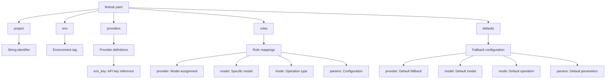
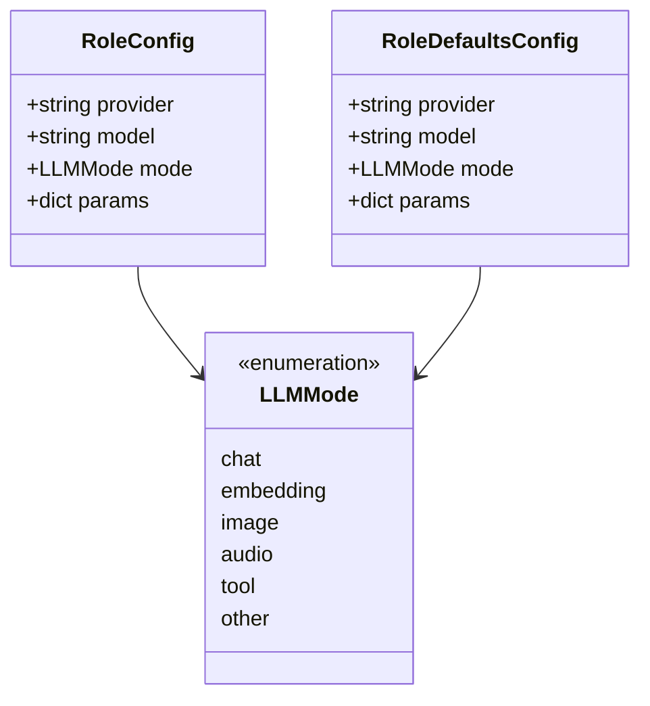
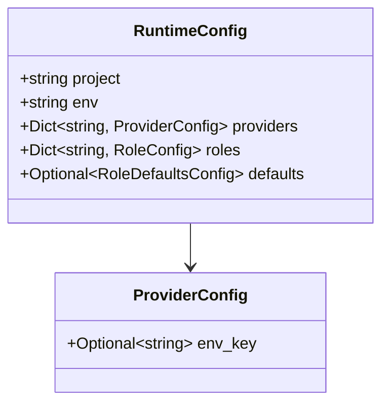
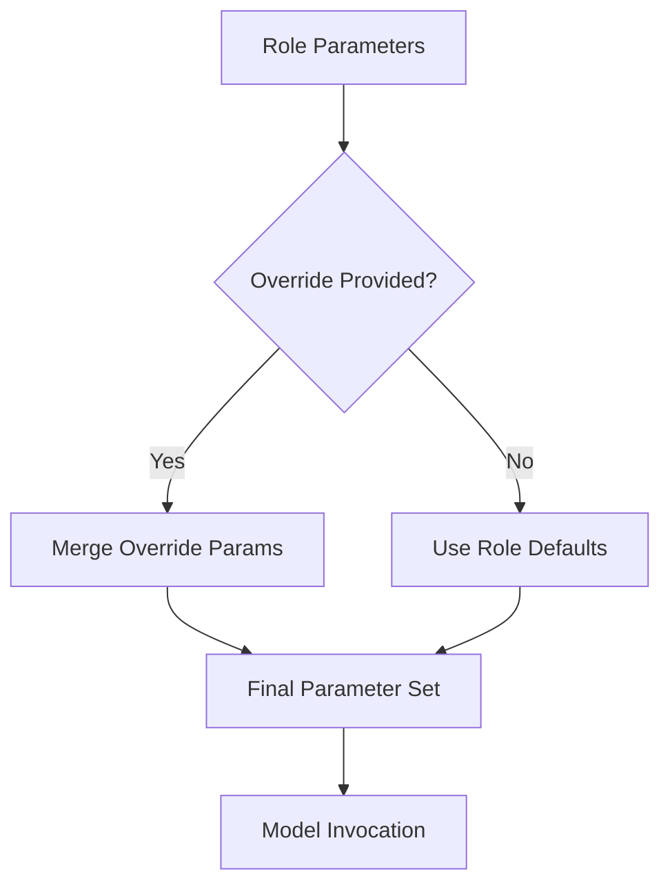
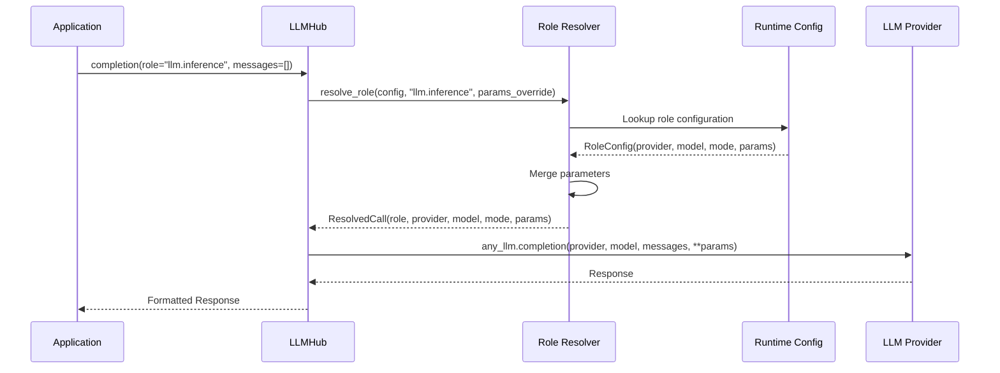

# Runtime Config (llmhub.yaml)

<cite>
**Referenced Files in This Document**
- [config_loader.py](file://packages/llmhub_runtime/src/llmhub_runtime/config_loader.py)
- [models.py](file://packages/llmhub_runtime/src/llmhub_runtime/models.py)
- [resolver.py](file://packages/llmhub_runtime/src/llmhub_runtime/resolver.py)
- [hub.py](file://packages/llmhub_runtime/src/llmhub_runtime/hub.py)
- [runtime_io.py](file://packages/llmhub/src/llmhub/runtime_io.py)
- [generator_hook.py](file://packages/llmhub/src/llmhub/generator_hook.py)
- [runtime_cmd.py](file://packages/llmhub/src/llmhub/commands/runtime_cmd.py)
- [llmhub.yaml](file://packages/llmhub_runtime/tests/fixtures/llmhub.yaml)
- [README.md](file://packages/llmhub/README.md)
- [PLAN.md](file://packages/llmhub_runtime/PLAN.md)
</cite>

## Table of Contents
1. [Introduction](#introduction)
2. [File Structure Overview](#file-structure-overview)
3. [Core Configuration Components](#core-configuration-components)
4. [Role-Based Architecture](#role-based-architecture)
5. [Provider Configuration](#provider-configuration)
6. [Model Parameters and Settings](#model-parameters-and-settings)
7. [Default Configuration](#default-configuration)
8. [Runtime Resolution Process](#runtime-resolution-process)
9. [Version Control and Deployment](#version-control-and-deployment)
10. [Practical Examples](#practical-examples)
11. [Best Practices](#best-practices)
12. [Troubleshooting](#troubleshooting)

## Introduction

The `llmhub.yaml` file serves as the machine-optimized runtime configuration for the LLMHub system. It represents the output of the generator pipeline and acts as the input to the runtime system, establishing a strict separation between logical roles in code and physical models in configuration.

This configuration file embodies the principle of "what you want from your LLMs" versus "how they execute," providing a centralized, version-controlled approach to LLM management that eliminates hardcoded model references and enables seamless provider switching without code modifications.

## File Structure Overview

The `llmhub.yaml` follows a structured YAML format with four primary sections that define the complete runtime configuration:



**Diagram sources**
- [models.py](file://packages/llmhub_runtime/src/llmhub_runtime/models.py#L28-L41)
- [llmhub.yaml](file://packages/llmhub_runtime/tests/fixtures/llmhub.yaml#L1-L51)

**Section sources**
- [models.py](file://packages/llmhub_runtime/src/llmhub_runtime/models.py#L28-L41)
- [llmhub.yaml](file://packages/llmhub_runtime/tests/fixtures/llmhub.yaml#L1-L51)

## Core Configuration Components

### Project and Environment Metadata

The top-level metadata establishes the project context and environment identification:

| Field | Type | Description | Example |
|-------|------|-------------|---------|
| `project` | String | Unique project identifier | `"memory"` |
| `env` | String | Environment tag (dev/staging/prod) | `"dev"` |

These fields serve as informational metadata used primarily for logging and environment-specific deployments.

### Provider Configuration

Providers define the LLM service endpoints and their associated authentication mechanisms:

```yaml
providers:
  openai:
    env_key: OPENAI_API_KEY
  anthropic:
    env_key: ANTHROPIC_API_KEY
  mistral:
    env_key: MISTRAL_API_KEY
```

Each provider entry contains:
- **env_key**: Reference to the environment variable containing the API key
- **enabled**: Implicitly determined by presence (disabled providers are excluded)

**Section sources**
- [models.py](file://packages/llmhub_runtime/src/llmhub_runtime/models.py#L13-L15)
- [llmhub.yaml](file://packages/llmhub_runtime/tests/fixtures/llmhub.yaml#L4-L10)

## Role-Based Architecture

Roles represent logical LLM capabilities mapped to specific providers and models. Each role encapsulates the complete configuration needed for a particular use case:

```yaml
roles:
  llm.preprocess:
    provider: openai
    model: gpt-4o-mini
    mode: chat
    params:
      temperature: 0.2
      max_tokens: 512
```

### Role Configuration Structure



**Diagram sources**
- [models.py](file://packages/llmhub_runtime/src/llmhub_runtime/models.py#L16-L20)
- [models.py](file://packages/llmhub_runtime/src/llmhub_runtime/models.py#L22-L26)

### Role Mapping Process

The role resolution process follows a deterministic path:

1. **Direct Match**: Look for exact role name in `roles` section
2. **Fallback**: Use `defaults` configuration if role not found
3. **Validation**: Verify provider exists in `providers` section
4. **Parameter Merging**: Combine role-specific params with defaults

**Section sources**
- [resolver.py](file://packages/llmhub_runtime/src/llmhub_runtime/resolver.py#L5-L44)
- [models.py](file://packages/llmhub_runtime/src/llmhub_runtime/models.py#L16-L26)

## Provider Configuration

Providers establish the connection to LLM services through environment-based authentication:

### Provider Model Structure



**Diagram sources**
- [models.py](file://packages/llmhub_runtime/src/llmhub_runtime/models.py#L13-L15)
- [models.py](file://packages/llmhub_runtime/src/llmhub_runtime/models.py#L28-L33)

### Environment Variable Management

The runtime system validates that all required environment variables are present during initialization when `strict_env` mode is enabled. This ensures reliable operation across different deployment environments.

**Section sources**
- [models.py](file://packages/llmhub_runtime/src/llmhub_runtime/models.py#L13-L15)
- [hub.py](file://packages/llmhub_runtime/src/llmhub_runtime/hub.py#L52-L59)

## Model Parameters and Settings

Parameters define model-specific configuration options that control behavior and performance characteristics:

### Parameter Categories

| Category | Purpose | Examples |
|----------|---------|----------|
| **Behavioral** | Control model responses | `temperature`, `top_p`, `presence_penalty` |
| **Token Limits** | Manage output size | `max_tokens`, `max_completion_tokens` |
| **Embedding** | Vector generation settings | `embedding_dim`, `encoding_format` |
| **Custom** | Provider-specific options | `frequency_penalty`, `seed` |

### Parameter Resolution

The parameter system implements a two-tier approach:
1. **Role Defaults**: Base parameters defined per role
2. **Override Parameters**: Dynamic parameters passed during runtime calls



**Diagram sources**
- [resolver.py](file://packages/llmhub_runtime/src/llmhub_runtime/resolver.py#L35-L36)

**Section sources**
- [models.py](file://packages/llmhub_runtime/src/llmhub_runtime/models.py#L19-L20)
- [resolver.py](file://packages/llmhub_runtime/src/llmhub_runtime/resolver.py#L35-L36)

## Default Configuration

Defaults provide fallback configuration when specific roles are not defined:

```yaml
defaults:
  provider: openai
  model: gpt-4o-mini
  mode: chat
  params:
    temperature: 0.3
    max_tokens: 1024
```

### Default Resolution Logic

The runtime system follows this precedence order:
1. Exact role definition takes highest priority
2. Global defaults apply when role is missing
3. Missing defaults result in `UnknownRoleError`

### Use Cases for Defaults

- **Development**: Provide sensible defaults for unconfigured roles
- **Backward Compatibility**: Maintain functionality when roles are added incrementally
- **Consistency**: Ensure uniform behavior across similar roles

**Section sources**
- [models.py](file://packages/llmhub_runtime/src/llmhub_runtime/models.py#L22-L26)
- [resolver.py](file://packages/llmhub_runtime/src/llmhub_runtime/resolver.py#L22-L25)

## Runtime Resolution Process

The runtime resolution process transforms logical role names into concrete provider/model combinations:



**Diagram sources**
- [hub.py](file://packages/llmhub_runtime/src/llmhub_runtime/hub.py#L61-L110)
- [resolver.py](file://packages/llmhub_runtime/src/llmhub_runtime/resolver.py#L5-L44)

### Resolution Steps

1. **Role Lookup**: Find role in configuration or use defaults
2. **Provider Validation**: Ensure provider is defined
3. **Parameter Merging**: Combine role params with overrides
4. **Call Construction**: Build final invocation parameters

**Section sources**
- [resolver.py](file://packages/llmhub_runtime/src/llmhub_runtime/resolver.py#L5-L44)
- [hub.py](file://packages/llmhub_runtime/src/llmhub_runtime/hub.py#L78-L89)

## Version Control and Deployment

### Version Control Best Practices

The `llmhub.yaml` file should be included in version control to maintain configuration history and enable reproducible deployments:

```bash
# Recommended gitignore entries
.gitignore
# Exclude sensitive environment files
.env
.env.local
# Include runtime configuration
llmhub.yaml
```

### Environment-Specific Deployments

Different environments can use the same configuration file with environment-specific API keys:

```yaml
# llmhub.yaml (version controlled)
project: my-app
env: production

providers:
  openai:
    env_key: OPENAI_API_KEY
  anthropic:
    env_key: ANTHROPIC_API_KEY

roles:
  llm.inference:
    provider: openai
    model: gpt-4o-mini
    mode: chat
    params:
      temperature: 0.7
```

```bash
# .env.production (environment-specific)
OPENAI_API_KEY=prod_sk_xxxxxxxxxxxx
ANTHROPIC_API_KEY=prod_sk_yyyyyyyyyyyy
```

### Deployment Strategies

1. **Staged Rollouts**: Use different configurations for staging/production
2. **Feature Flags**: Enable/disable roles based on environment
3. **Gradual Migration**: Phase in new models across environments

**Section sources**
- [README.md](file://packages/llmhub/README.md#L611-L626)
- [runtime_io.py](file://packages/llmhub/src/llmhub/runtime_io.py#L36-L74)

## Practical Examples

### Example 1: Memory System Configuration

```yaml
project: memory
env: dev

providers:
  openai:
    env_key: OPENAI_API_KEY
  anthropic:
    env_key: ANTHROPIC_API_KEY

roles:
  llm.preprocess:
    provider: openai
    model: gpt-4o-mini
    mode: chat
    params:
      temperature: 0.2
      max_tokens: 512
  
  llm.memwrite:
    provider: anthropic
    model: claude-3-5-sonnet-20241022
    mode: chat
    params:
      temperature: 0.3
      max_tokens: 1024
  
  llm.memread:
    provider: anthropic
    model: claude-3-5-sonnet-20241022
    mode: chat
    params:
      temperature: 0.5
      max_tokens: 2048
  
  llm.inference:
    provider: openai
    model: gpt-4
    mode: chat
    params:
      temperature: 0.7
      max_tokens: 2048
  
  llm.embedding:
    provider: openai
    model: text-embedding-3-small
    mode: embedding
    params:
      embedding_dim: 1536
```

### Example 2: Cost-Optimized Configuration

```yaml
project: cost-optimizer
env: production

providers:
  openai:
    env_key: OPENAI_API_KEY
  anthropic:
    env_key: ANTHROPIC_API_KEY

roles:
  llm.fast-response:
    provider: openai
    model: gpt-4o-mini
    mode: chat
    params:
      temperature: 0.3
      max_tokens: 256
  
  llm.analytical:
    provider: anthropic
    model: claude-3-haiku-20240307
    mode: chat
    params:
      temperature: 0.7
      max_tokens: 1024
  
  llm.embedding:
    provider: openai
    model: text-embedding-3-small
    mode: embedding
    params: {}
```

**Section sources**
- [llmhub.yaml](file://packages/llmhub_runtime/tests/fixtures/llmhub.yaml#L1-L51)

## Best Practices

### Configuration Organization

1. **Logical Grouping**: Organize roles by functional areas
2. **Consistent Naming**: Use hierarchical naming conventions (e.g., `llm.user.query`, `llm.admin.analysis`)
3. **Parameter Standardization**: Establish consistent parameter patterns across roles

### Security Considerations

1. **Environment Separation**: Never commit API keys to version control
2. **Access Control**: Limit who can modify the configuration file
3. **Audit Logging**: Monitor changes to the configuration

### Maintenance Guidelines

1. **Regular Reviews**: Periodically assess role configurations
2. **Cost Monitoring**: Track API usage and costs per role
3. **Performance Testing**: Validate role configurations under load

### Integration Patterns

1. **CI/CD Pipeline**: Validate configuration changes in automated builds
2. **Testing Strategy**: Include configuration validation in test suites
3. **Rollback Procedures**: Maintain ability to revert configuration changes

**Section sources**
- [README.md](file://packages/llmhub/README.md#L640-L653)

## Troubleshooting

### Common Issues and Solutions

#### Unknown Role Error
**Problem**: Application attempts to use undefined role
**Solution**: 
- Verify role exists in `roles` section
- Check for typos in role names
- Consider adding role to `defaults`

#### Provider Not Found Error
**Problem**: Role references undefined provider
**Solution**:
- Ensure provider is defined in `providers` section
- Verify provider is enabled (not commented out)
- Check environment variable configuration

#### Missing Environment Variables
**Problem**: Runtime fails to initialize due to missing API keys
**Solution**:
- Use `strict_env=True` for early detection
- Verify `.env` file contains required keys
- Check environment variable names match `env_key` values

#### Parameter Conflicts
**Problem**: Unexpected model behavior due to parameter conflicts
**Solution**:
- Review parameter merging logic
- Use `params_override` for dynamic parameter adjustment
- Validate parameter compatibility with selected model

### Diagnostic Commands

```bash
# Check runtime configuration
llmhub runtime show

# Compare spec vs runtime
llmhub runtime diff

# Validate configuration
llmhub doctor

# Test individual roles
llmhub test --role llm.inference --prompt "Hello"
```

**Section sources**
- [runtime_cmd.py](file://packages/llmhub/src/llmhub/commands/runtime_cmd.py#L78-L156)
- [hub.py](file://packages/llmhub_runtime/src/llmhub_runtime/hub.py#L52-L59)