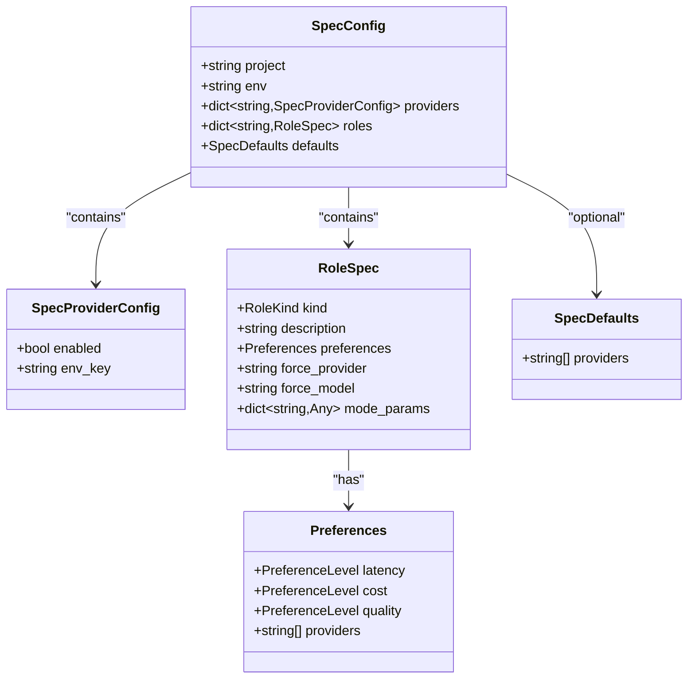
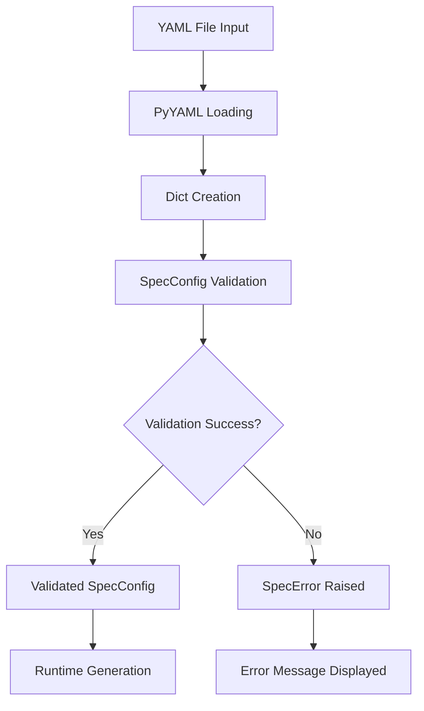
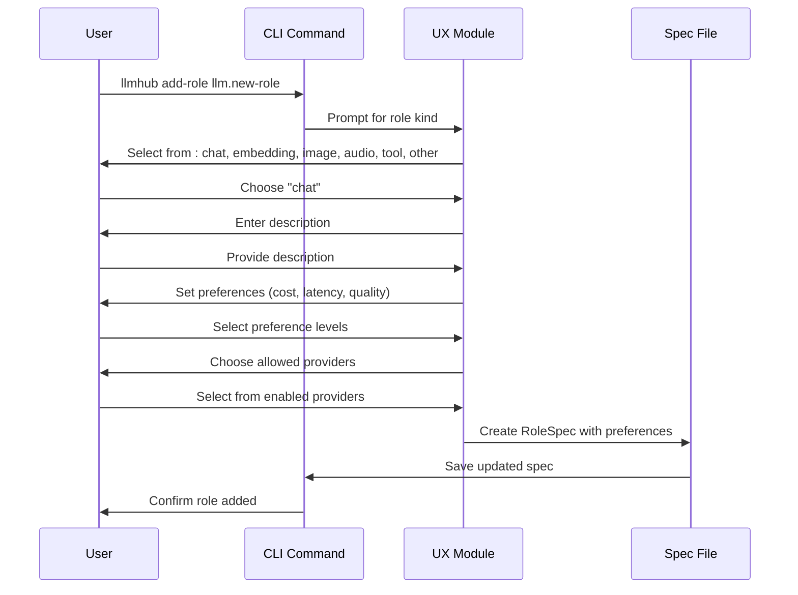

# Spec File (llmhub.spec.yaml)

<cite>
**Referenced Files in This Document**
- [spec_models.py](file://packages/llmhub/src/llmhub/spec_models.py)
- [README.md](file://packages/llmhub/README.md)
- [spec_cmd.py](file://packages/llmhub/src/llmhub/commands/spec_cmd.py)
- [test_spec_models.py](file://packages/llmhub/tests/test_spec_models.py)
- [ux.py](file://packages/llmhub/src/llmhub/ux.py)
- [context.py](file://packages/llmhub/src/llmhub/context.py)
</cite>

## Table of Contents
1. [Introduction](#introduction)
2. [Schema Overview](#schema-overview)
3. [Core Sections](#core-sections)
4. [Data Models](#data-models)
5. [Validation and Error Handling](#validation-and-error-handling)
6. [Examples and Best Practices](#examples-and-best-practices)
7. [CLI Integration](#cli-integration)
8. [Advanced Configuration](#advanced-configuration)
9. [Troubleshooting](#troubleshooting)
10. [Conclusion](#conclusion)

## Introduction

The `llmhub.spec.yaml` file serves as the human-facing specification for your LLM configuration system. It defines what you want from your language models (preferences, constraints, and requirements) separately from how they execute (specific models, parameters, and providers). This separation enables flexible model selection, easy provider switching, and environment-specific configurations.

The spec file follows a structured YAML format with validation through Pydantic models, ensuring type safety and providing clear error messages when configurations are invalid.

## Schema Overview

The spec file consists of five main sections that define your LLM configuration:

```mermaid
graph TD
A[llmhub.spec.yaml] --> B[project]
A --> C[env]
A --> D[providers]
A --> E[roles]
A --> F[defaults]
D --> D1[Provider Name]
D1 --> D2[enabled: bool]
D1 --> D3[env_key: string]
E --> E1[Role Name]
E1 --> E2[kind: RoleKind]
E1 --> E3[description: string]
E1 --> E4[preferences: Preferences]
E1 --> E5[force_provider: string]
E1 --> E6[force_model: string]
E1 --> E7[mode_params: dict]
E4 --> E8[latency: PreferenceLevel]
E4 --> E9[cost: PreferenceLevel]
E4 --> E10[quality: PreferenceLevel]
E4 --> E11[providers: list[string]]
```

**Diagram sources**
- [spec_models.py](file://packages/llmhub/src/llmhub/spec_models.py#L60-L66)

## Core Sections

### Project Section

The `project` and `env` sections define basic project metadata:

| Field | Type | Description | Required |
|-------|------|-------------|----------|
| `project` | string | Human-readable project name | Yes |
| `env` | string | Environment identifier (dev, staging, prod) | Yes |

**Purpose**: Establishes the project context and environment for configuration management.

**Example**:
```yaml
project: my-application
env: production
```

### Providers Section

The `providers` section configures LLM service providers with their API keys:

| Field | Type | Description | Required |
|-------|------|-------------|----------|
| `[provider_name]` | object | Provider configuration | Yes |
| `enabled` | boolean | Whether provider is active | No (default: true) |
| `env_key` | string | Environment variable name for API key | Yes |

**Purpose**: Centralizes provider configuration and API key management.

**Example**:
```yaml
providers:
  openai:
    enabled: true
    env_key: OPENAI_API_KEY
  anthropic:
    enabled: true
    env_key: ANTHROPIC_API_KEY
  google:
    enabled: false  # Temporarily disabled
    env_key: GOOGLE_API_KEY
```

### Roles Section

The `roles` section defines logical roles your application needs, each with specific preferences:

| Field | Type | Description | Required |
|-------|------|-------------|----------|
| `[role_name]` | object | Role specification | Yes |
| `kind` | RoleKind | Role type (chat, embedding, image, audio, tool, other) | Yes |
| `description` | string | Human-readable role description | Yes |
| `preferences` | Preferences | Model selection preferences | No |
| `force_provider` | string | Override automatic provider selection | No |
| `force_model` | string | Override automatic model selection | No |
| `mode_params` | dict | Default parameters for this role | No |

**Purpose**: Defines logical roles and their requirements for model selection.

**Example**:
```yaml
roles:
  llm.preprocess:
    kind: chat
    description: Fast preprocessing model to normalize input
    preferences:
      cost: low
      latency: low
      quality: medium
      providers:
        - openai
        - anthropic
  
  llm.inference:
    kind: chat
    description: Main reasoning model for answering questions
    preferences:
      cost: medium
      latency: medium
      quality: high
      providers:
        - openai
        - anthropic
        - google
  
  llm.embedding:
    kind: embedding
    description: Vector embeddings for retrieval
    preferences:
      cost: low
      latency: low
      quality: medium
      providers:
        - openai
```

### Defaults Section

The `defaults` section provides fallback provider preferences:

| Field | Type | Description | Required |
|-------|------|-------------|----------|
| `providers` | list[string] | Default provider order | No |

**Purpose**: Sets default provider preferences when not specified in individual roles.

**Example**:
```yaml
defaults:
  providers:
    - openai
    - anthropic
    - google
```

## Data Models

The spec file is validated using Pydantic models that define the complete schema structure.

### SpecConfig Model

The main configuration model that validates the entire spec file:



**Diagram sources**
- [spec_models.py](file://packages/llmhub/src/llmhub/spec_models.py#L60-L66)
- [spec_models.py](file://packages/llmhub/src/llmhub/spec_models.py#L30-L52)
- [spec_models.py](file://packages/llmhub/src/llmhub/spec_models.py#L36-L42)
- [spec_models.py](file://packages/llmhub/src/llmhub/spec_models.py#L54-L57)

### PreferenceLevel Enumeration

Defines preference levels for cost, latency, and quality:

| Level | Value | Description |
|-------|-------|-------------|
| `low` | "low" | Prioritize lowest value (cost, latency, quality) |
| `medium` | "medium" | Balanced value |
| `high` | "high" | Prioritize highest value (cost, latency, quality) |

**Purpose**: Guides the generator in selecting appropriate models based on your priorities.

### RoleKind Enumeration

Defines the type of role:

| Kind | Description |
|------|-------------|
| `chat` | Conversational/chat models |
| `embedding` | Text embedding models |
| `image` | Image generation models |
| `audio` | Audio processing models |
| `tool` | Tool-use models |
| `other` | Other specialized models |

**Purpose**: Determines the appropriate model capabilities and parameters.

## Validation and Error Handling

### Validation Process

The spec file undergoes validation through Pydantic models with the following process:



**Diagram sources**
- [spec_models.py](file://packages/llmhub/src/llmhub/spec_models.py#L68-L91)

### Error Types

The system defines specific error types for different failure scenarios:

| Error Type | Description | Common Causes |
|------------|-------------|---------------|
| `SpecError` | General spec validation failure | Invalid YAML, missing required fields, type mismatches |

### Validation Features

- **Type Safety**: Automatic type conversion and validation
- **Field Validation**: Required field checking and type enforcement
- **Enum Validation**: Automatic validation of enumeration values
- **Nested Validation**: Deep validation of complex structures
- **Error Messages**: Clear, actionable error messages with field paths

**Section sources**
- [spec_models.py](file://packages/llmhub/src/llmhub/spec_models.py#L8-L131)

## Examples and Best Practices

### Realistic Configuration Examples

#### Basic Application Setup
```yaml
project: customer-support-bot
env: production

providers:
  openai:
    enabled: true
    env_key: OPENAI_API_KEY
  anthropic:
    enabled: true
    env_key: ANTHROPIC_API_KEY

roles:
  llm.conversation:
    kind: chat
    description: Handles general customer conversations
    preferences:
      cost: medium
      latency: medium
      quality: high
      providers:
        - openai
        - anthropic
  
  llm.sentiment:
    kind: chat
    description: Analyzes customer sentiment
    preferences:
      cost: low
      latency: low
      quality: medium
      providers:
        - openai

defaults:
  providers:
    - openai
    - anthropic
```

#### Development and Production Setup
```yaml
project: ai-content-platform
env: dev

providers:
  openai:
    enabled: true
    env_key: OPENAI_DEV_API_KEY
  anthropic:
    enabled: true
    env_key: ANTHROPIC_DEV_API_KEY
  local:
    enabled: true
    env_key: LOCAL_MODEL_KEY  # For development testing

roles:
  llm.content_analysis:
    kind: chat
    description: Analyzes article content for quality
    preferences:
      cost: low
      latency: medium
      quality: high
      providers:
        - openai
        - local  # Use local model for development
  
  llm.summarization:
    kind: chat
    description: Creates article summaries
    preferences:
      cost: low
      latency: low
      quality: medium
      providers:
        - openai

defaults:
  providers:
    - local
    - openai
    - anthropic
```

### Role Naming Best Practices

#### Good Role Names
- `llm.user.query` - Descriptive and hierarchical
- `llm.admin.analytics` - Indicates role scope
- `llm.public.search` - Clear purpose and audience
- `llm.internal.processing` - Internal system role

#### Bad Role Names
- `model1` - Vague and unclear
- `gpt` - Provider-specific naming
- `summarizer` - Too generic
- `assistant` - Overly broad

### Preference Tuning Guidelines

#### Cost-Optimized Roles
```yaml
roles:
  llm.quick_response:
    kind: chat
    description: Fast responses for user queries
    preferences:
      cost: high      # Prioritize cost efficiency
      latency: low    # Fast response required
      quality: medium # Acceptable quality loss
```

#### Quality-Critical Roles
```yaml
roles:
  llm.critical_analysis:
    kind: chat
    description: Important analytical tasks
    preferences:
      cost: low       # Cost not primary concern
      latency: medium # Reasonable response time
      quality: high   # Highest quality required
```

#### Balanced Roles
```yaml
roles:
  llm.conversational:
    kind: chat
    description: General conversation handling
    preferences:
      cost: medium    # Balanced approach
      latency: medium # Moderate speed
      quality: medium # Balanced quality
```

**Section sources**
- [README.md](file://packages/llmhub/README.md#L288-L484)
- [test_spec_models.py](file://packages/llmhub/tests/test_spec_models.py#L30-L49)

## CLI Integration

The spec file integrates seamlessly with LLMHub CLI commands for management and validation.

### Spec Management Commands

| Command | Purpose | Example |
|---------|---------|---------|
| `llmhub spec show` | Display current spec | Shows project, providers, and roles |
| `llmhub spec validate` | Validate spec file | Checks for syntax and semantic errors |
| `llmhub roles` | List all roles | Displays role names and preferences |
| `llmhub add-role [name]` | Add new role | Interactive role creation |
| `llmhub edit-role [name]` | Edit existing role | Modify role preferences |
| `llmhub rm-role [name]` | Remove role | Delete role from spec |

### Interactive Role Creation

The CLI provides an interactive interface for adding and editing roles:



**Diagram sources**
- [spec_cmd.py](file://packages/llmhub/src/llmhub/commands/spec_cmd.py#L72-L139)
- [ux.py](file://packages/llmhub/src/llmhub/ux.py#L122-L159)

### Environment-Specific Setup

The CLI helps manage environment-specific configurations:

```bash
# Development setup
llmhub init  # Creates dev spec with local providers

# Production setup  
llmhub generate --force  # Generates production config
```

**Section sources**
- [spec_cmd.py](file://packages/llmhub/src/llmhub/commands/spec_cmd.py#L13-L69)

## Advanced Configuration

### Forced Provider and Model Selection

For critical roles, you can force specific providers and models:

```yaml
roles:
  llm.critical_inference:
    kind: chat
    description: Critical production workload
    force_provider: anthropic
    force_model: claude-3-5-sonnet-20241022
    preferences:
      quality: high
      cost: medium
```

### Custom Mode Parameters

Specify role-specific parameters:

```yaml
roles:
  llm.creative_writing:
    kind: chat
    description: Creative writing assistant
    mode_params:
      temperature: 0.9
      top_p: 0.95
      presence_penalty: 0.6
      frequency_penalty: 0.3
      max_tokens: 1500
```

### Multi-Environment Configuration

Support different configurations per environment:

```yaml
# llmhub.spec.yaml (shared base)
project: my-app
env: ${ENV:-development}

providers:
  openai:
    enabled: true
    env_key: OPENAI_API_KEY_${ENV}
  anthropic:
    enabled: true
    env_key: ANTHROPIC_API_KEY_${ENV}

roles:
  llm.analysis:
    kind: chat
    description: Data analysis and insights
    preferences:
      cost: ${ANALYSIS_COST_PREFERENCE:-medium}
      latency: ${ANALYSIS_LATENCY_PREFERENCE:-medium}
      quality: ${ANALYSIS_QUALITY_PREFERENCE:-high}
```

### Provider-Specific Configuration

Configure providers with custom settings:

```yaml
providers:
  openai:
    enabled: true
    env_key: OPENAI_API_KEY
    # Additional provider-specific settings
    api_version: "2024-02-15"
    timeout: 30
  
  anthropic:
    enabled: true
    env_key: ANTHROPIC_API_KEY
    # Provider-specific settings
    max_retries: 3
    base_url: "https://api.anthropic.com/v1"
```

## Troubleshooting

### Common Issues and Solutions

#### Spec File Not Found
**Problem**: `Spec file not found: llmhub.spec.yaml`
**Solution**: 
- Run `llmhub init` to create a default spec
- Check file location and permissions
- Verify project context resolution

#### Invalid YAML Syntax
**Problem**: `Invalid YAML in spec file: ...`
**Solution**:
- Validate YAML syntax using online validators
- Check indentation and special characters
- Ensure proper quoting for strings

#### Missing Environment Variables
**Problem**: Provider configuration without API keys
**Solution**:
- Set environment variables in `.env` file
- Use `llmhub env check` to identify missing variables
- Update `.env.example` with required keys

#### Validation Errors
**Problem**: `Spec validation failed: ...`
**Solution**:
- Check field types and required values
- Verify enumeration values (low/medium/high)
- Ensure role names follow naming conventions

### Debugging Tips

#### Enable Verbose Output
```bash
# Check file paths and context
llmhub path

# Validate spec with detailed output
llmhub spec validate

# Show current spec configuration
llmhub spec show
```

#### Test Role Configuration
```bash
# Test individual roles
llmhub test --role llm.role_name --prompt "Test message"

# Generate with explanations
llmhub generate --explain
```

### Error Recovery

#### Recover from Invalid Spec
```bash
# Create backup of current spec
cp llmhub.spec.yaml llmhub.spec.yaml.backup

# Reset to default
llmhub init --force

# Restore from backup manually
# Edit llmhub.spec.yaml.backup and copy to llmhub.spec.yaml
```

**Section sources**
- [spec_models.py](file://packages/llmhub/src/llmhub/spec_models.py#L86-L91)
- [context.py](file://packages/llmhub/src/llmhub/context.py#L22-L24)

## Conclusion

The `llmhub.spec.yaml` file provides a powerful and flexible way to manage LLM configurations through declarative specifications. Its structured approach separates concerns between what you want (specifications) and how it runs (runtime configuration), enabling:

- **Flexible Model Selection**: Preference-based model selection with automatic optimization
- **Easy Provider Switching**: Seamless migration between different LLM providers
- **Environment Management**: Separate configurations for development, staging, and production
- **Version Control Friendly**: Human-readable YAML with clear structure
- **Validation and Error Handling**: Robust validation with clear error messages
- **CLI Integration**: Comprehensive command-line tools for spec management

By following the guidelines and best practices outlined in this documentation, you can create maintainable, scalable LLM configurations that adapt to changing requirements and environments while maintaining consistency and reliability across your applications.

The spec file serves as the single source of truth for your LLM needs, enabling teams to collaborate effectively while ensuring consistent behavior across different environments and use cases.