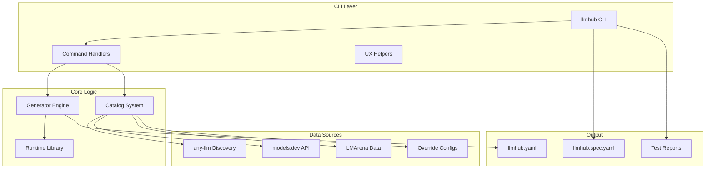
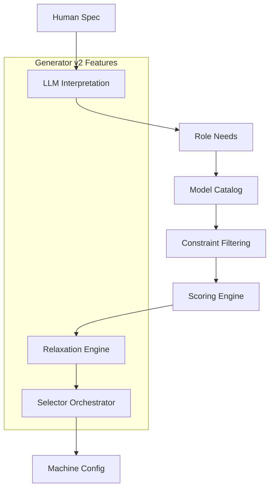
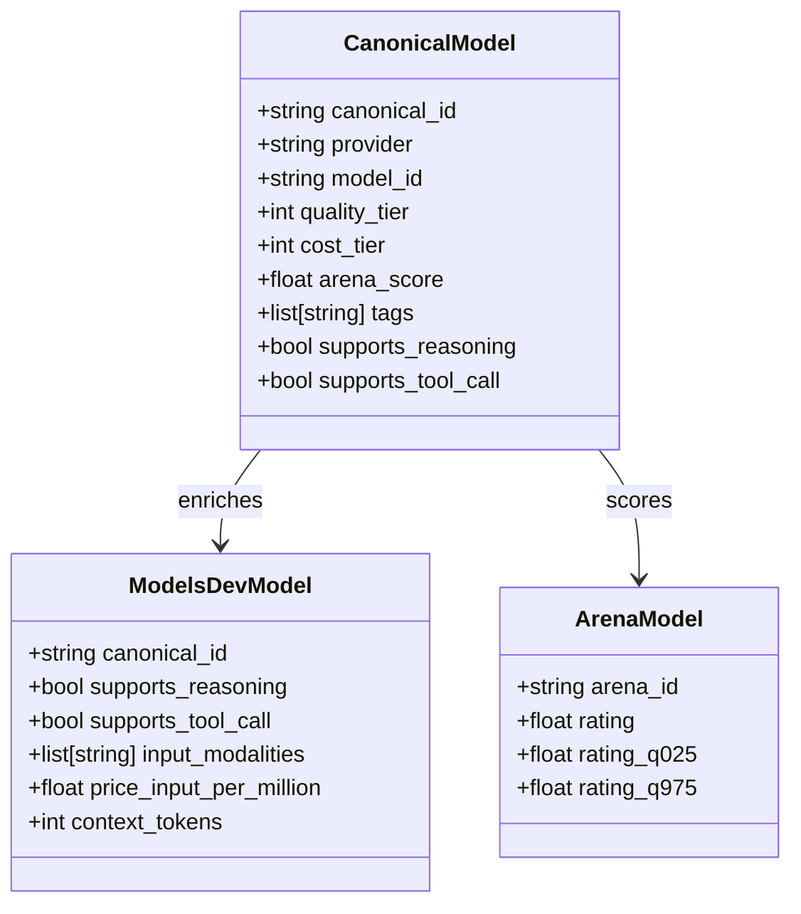
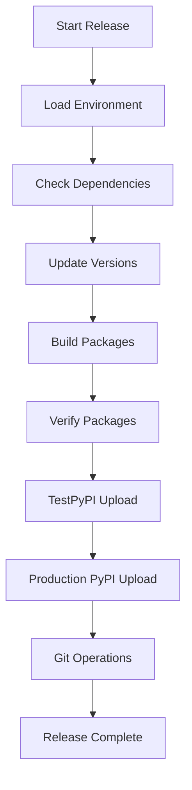

# Contributing

<cite>
**Referenced Files in This Document**
- [README.md](file://README.md)
- [PLAN-2.md](file://PLAN-2.md)
- [packages/llmhub/README.md](file://packages/llmhub/README.md)
- [packages/llmhub/pyproject.toml](file://packages/llmhub/pyproject.toml)
- [packages/llmhub_runtime/PLAN.md](file://packages/llmhub_runtime/PLAN.md)
- [packages/llmhub/src/llmhub/generator/README.md](file://packages/llmhub/src/llmhub/generator/README.md)
- [packages/llmhub/src/llmhub/catalog/schema.py](file://packages/llmhub/src/llmhub/catalog/schema.py)
- [packages/llmhub/src/llmhub/catalog/builder.py](file://packages/llmhub/src/llmhub/catalog/builder.py)
- [packages/llmhub/src/llmhub/generator/spec.md](file://packages/llmhub/src/llmhub/generator/spec.md)
- [scripts/release.py](file://scripts/release.py)
- [Makefile](file://Makefile)
- [packages/llmhub/tests/test_cli_smoke.py](file://packages/llmhub/tests/test_cli_smoke.py)
- [packages/llmhub/tests/generator/test_generate_e2e.py](file://packages/llmhub/tests/generator/test_generate_e2e.py)
</cite>

## Table of Contents
1. [Introduction](#introduction)
2. [Development Setup](#development-setup)
3. [Project Architecture](#project-architecture)
4. [Roadmap and Planned Features](#roadmap-and-planned-features)
5. [Contribution Areas](#contribution-areas)
6. [Code Contribution Process](#code-contribution-process)
7. [Testing Guidelines](#testing-guidelines)
8. [Release Process](#release-process)
9. [Community Guidelines](#community-guidelines)

## Introduction

Welcome to LLM Hub! This project aims to revolutionize how developers manage Large Language Models by providing a config-driven approach that decouples business logic from model implementation details. Whether you're interested in improving the catalog system, enhancing the generator algorithms, or expanding provider support, there are numerous ways to contribute to making LLM Hub the premier solution for LLM configuration management.

LLM Hub consists of two main packages:
- **llmhub_runtime**: A lightweight Python library for runtime LLM calls
- **llmhub**: A powerful CLI tool for managing LLM specifications and configurations

## Development Setup

### Prerequisites

Before contributing to LLM Hub, ensure you have the following prerequisites installed:

- **Python 3.10 or higher**
- **Git** for version control
- **pip** or **poetry** for package management
- **make** (for convenience commands)

### Repository Cloning and Installation

1. **Clone the repository**:
```bash
git clone https://github.com/rethink-paradigms/llm-hub.git
cd llm-hub
```

2. **Install dependencies in editable mode**:
```bash
# Method 1: Using make (recommended)
make install

# Method 2: Manual installation
pip install -e packages/llmhub_runtime
pip install -e packages/llmhub
```

3. **Verify installation**:
```bash
llmhub --version
llmhub --help
```

### Environment Configuration

LLM Hub requires API keys for various providers. Set up your environment:

1. **Copy the example environment file**:
```bash
cp .env.example .env
```

2. **Add your API keys**:
```bash
# OpenAI API key
OPENAI_API_KEY=sk-...

# Anthropic API key
ANTHROPIC_API_KEY=sk-ant-...

# Additional providers
GEMINI_API_KEY=...
DEEPSEEK_API_KEY=...
QWEN_API_KEY=...
MISTRAL_API_KEY=...
COHERE_API_KEY=...
```

3. **Alternative: Use python-dotenv**:
```bash
pip install python-dotenv
# The CLI will automatically load .env files
```

### Development Workflow

The project uses a Makefile for common development tasks:

```bash
# Install dependencies
make install

# Run tests
make test

# Generate test reports
make test-report

# Clean build artifacts
make clean
```

**Section sources**
- [README.md](file://README.md#L108-L121)
- [packages/llmhub/README.md](file://packages/llmhub/README.md#L71-L106)
- [Makefile](file://Makefile#L1-L40)

## Project Architecture

LLM Hub follows a modular architecture with clear separation of concerns:



**Diagram sources**
- [packages/llmhub/README.md](file://packages/llmhub/README.md#L656-L674)
- [packages/llmhub_runtime/PLAN.md](file://packages/llmhub_runtime/PLAN.md#L486-L496)

### Package Structure

The project is organized into two main packages:

#### llmhub_runtime
- **Purpose**: Lightweight runtime library for LLM calls
- **Location**: `packages/llmhub_runtime/`
- **Key Components**:
  - `hub.py`: Main LLMHub class
  - `resolver.py`: Role resolution logic
  - `config_loader.py`: Configuration loading
  - `models.py`: Data models and validation

#### llmhub (CLI)
- **Purpose**: Command-line interface for spec management
- **Location**: `packages/llmhub/`
- **Key Components**:
  - `cli.py`: Main CLI entry point
  - `commands/`: Individual command implementations
  - `generator/`: Model selection engine
  - `catalog/`: Model catalog system

**Section sources**
- [packages/llmhub_runtime/PLAN.md](file://packages/llmhub_runtime/PLAN.md#L1-L50)
- [packages/llmhub/README.md](file://packages/llmhub/README.md#L1-L50)

## Roadmap and Planned Features

LLM Hub has an ambitious roadmap with several exciting features planned for the future:

### Current Phase: Generator v2 and Web UI

The project is currently focused on developing Generator v2, which will provide LLM-assisted model selection based on catalog data and user preferences.



**Diagram sources**
- [packages/llmhub/src/llmhub/generator/spec.md](file://packages/llmhub/src/llmhub/generator/spec.md#L42-L56)

### Future Roadmap

#### Phase 1: Core Infrastructure (Completed)
- **Generator v2**: LLM-assisted model selection
- **Enhanced Catalog**: Rich model metadata and capabilities
- **Improved CLI**: Better UX and workflow management

#### Phase 2: User Experience Enhancement
- **Web UI**: Interactive catalog browser and config editor
- **SaaS Offering**: Hosted catalog with live updates
- **Observability**: Built-in support for monitoring tools

#### Phase 3: Advanced Features
- **Cost Tracking**: Automatic cost estimation and budget alerts
- **A/B Testing**: Multi-variant runtime configs
- **Framework Integration**: Seamless integration with popular frameworks

### Generator Architecture Details

The Generator is split into 10 subproblems (SP1-SP10):

1. **SP1**: Parse human spec YAML
2. **SP2**: Use LLM to interpret needs
3. **SP3**: Define canonical RoleNeed schema
4. **SP4**: Load model catalog
5. **SP5**: Filter candidates by constraints
6. **SP6**: Calculate scoring weights
7. **SP7**: Score and rank models
8. **SP8**: Relax constraints if needed
9. **SP9**: Orchestrate per-role selection
10. **SP10**: Emit final machine config

**Section sources**
- [packages/llmhub/src/llmhub/generator/spec.md](file://packages/llmhub/src/llmhub/generator/spec.md#L27-L40)
- [packages/llmhub/src/llmhub/generator/README.md](file://packages/llmhub/src/llmhub/generator/README.md#L60-L75)

## Contribution Areas

There are numerous areas where you can contribute to LLM Hub's development:

### 1. Catalog System Improvements

The catalog system is the foundation of LLM Hub's model discovery and selection capabilities.

#### Key Areas for Contribution:
- **Adding New Data Sources**: Integrate additional model databases like HuggingFace, Replicate, or custom enterprise catalogs
- **Tier Derivation Algorithms**: Improve the mathematical models for calculating cost and quality tiers
- **Capability Detection**: Enhance automatic detection of model capabilities (reasoning, tool calling, structured output)
- **Metadata Enrichment**: Add support for new model attributes and capabilities

#### Catalog Schema Evolution:


**Diagram sources**
- [packages/llmhub/src/llmhub/catalog/schema.py](file://packages/llmhub/src/llmhub/catalog/schema.py#L68-L115)

### 2. Generator Engine Enhancement

The Generator is responsible for converting human specifications into optimal model configurations.

#### Key Areas for Contribution:
- **LLM Interpretation**: Improve the natural language understanding for role descriptions
- **Scoring Algorithms**: Develop more sophisticated weighting and ranking systems
- **Constraint Relaxation**: Create smarter fallback mechanisms when no perfect match exists
- **Multi-objective Optimization**: Handle conflicting preferences more effectively

### 3. Provider Support Expansion

Expand support for additional LLM providers through the any-llm ecosystem.

#### Key Areas for Contribution:
- **New Provider Integration**: Add support for emerging LLM providers
- **Feature Parity**: Ensure consistent feature support across all providers
- **Rate Limiting**: Implement intelligent rate limiting and retry logic
- **Error Handling**: Improve robustness for provider-specific errors

### 4. CLI and User Experience

Enhance the developer experience with improved CLI functionality.

#### Key Areas for Contribution:
- **Interactive Prompts**: Better guided workflows for spec creation
- **Validation Feedback**: More informative error messages and suggestions
- **Template System**: Pre-built templates for common use cases
- **Integration Tools**: Scripts for migrating from other LLM management solutions

### 5. Documentation and Examples

Help make LLM Hub more accessible to new users.

#### Key Areas for Contribution:
- **Tutorials**: Step-by-step guides for common scenarios
- **Best Practices**: Community-contributed patterns and anti-patterns
- **Use Cases**: Real-world examples from different domains
- **API Documentation**: Comprehensive reference documentation

**Section sources**
- [README.md](file://README.md#L567-L582)
- [packages/llmhub/src/llmhub/catalog/schema.py](file://packages/llmhub/src/llmhub/catalog/schema.py#L1-L122)

## Code Contribution Process

### Branching Strategy

LLM Hub follows a feature-branch workflow:

1. **Fork the repository** to your personal GitHub account
2. **Create a feature branch** from the main branch:
```bash
git checkout -b feature/add-new-provider
```
3. **Make your changes** following the project's coding standards
4. **Commit your changes** with clear, descriptive messages
5. **Push your branch** to your fork:
```bash
git push origin feature/add-new-provider
```

### Pull Request Guidelines

1. **Create a Pull Request** against the main repository
2. **Provide a clear description** of your changes
3. **Link related issues** if applicable
4. **Ensure all tests pass** locally before submitting
5. **Update documentation** if your changes affect user-facing functionality

### Code Review Expectations

The LLM Hub team follows these principles for code reviews:

- **Constructive Feedback**: Focus on improving code quality and maintainability
- **Clear Communication**: Provide specific suggestions and alternatives
- **Knowledge Sharing**: Help contributors learn from the review process
- **Timely Reviews**: Aim to review submissions within 3-5 business days

### Commit Message Standards

Follow conventional commit message format:
```
<type>(<scope>): <description>

[optional body]

[optional footer]
```

Examples:
- `feat(generator): add constraint relaxation engine`
- `fix(catalog): handle null price values in tier calculation`
- `docs(readme): update installation instructions`

**Section sources**
- [README.md](file://README.md#L567-L582)

## Testing Guidelines

LLM Hub maintains high code quality through comprehensive testing:

### Test Structure

The project uses pytest for testing with the following structure:

```
tests/
├── generator/          # Generator module tests
├── test_cli_smoke.py   # CLI smoke tests
├── test_context.py     # Context resolution tests
├── test_env_manager.py # Environment management tests
└── test_spec_models.py # Spec model validation tests
```

### Running Tests

```bash
# Run all tests
make test

# Run specific test suite
pytest tests/generator/

# Run with verbose output
pytest -v tests/

# Generate test reports
make test-report
```

### Test Execution Reports (TER)

LLM Hub includes a Test Execution Report system that generates structured JSON reports:

```bash
# Generate reports with detailed execution information
python -m llmhub.tools.run_tests_with_report
```

### Writing Effective Tests

1. **Unit Tests**: Test individual functions and classes in isolation
2. **Integration Tests**: Test component interactions
3. **End-to-End Tests**: Test complete workflows
4. **Mock External Dependencies**: Use mocking for external APIs and services

### Test Coverage Requirements

- **New Features**: Achieve at least 80% test coverage
- **Critical Paths**: 100% test coverage for core functionality
- **Regression Tests**: Add tests for bug fixes

**Section sources**
- [README.md](file://README.md#L502-L556)
- [packages/llmhub/tests/test_cli_smoke.py](file://packages/llmhub/tests/test_cli_smoke.py#L1-L165)
- [packages/llmhub/tests/generator/test_generate_e2e.py](file://packages/llmhub/tests/generator/test_generate_e2e.py#L1-L150)

## Release Process

LLM Hub uses an automated release process managed by the release script:

### Versioning Strategy

The project follows Semantic Versioning (SemVer):
- **Major**: Breaking changes
- **Minor**: New features
- **Patch**: Bug fixes and improvements

### Release Commands

```bash
# Patch release (0.1.0 → 0.1.1)
python scripts/release.py patch

# Minor release (0.1.0 → 0.2.0)
python scripts/release.py minor

# Major release (0.1.0 → 1.0.0)
python scripts/release.py major

# Specific version
python scripts/release.py --version 0.2.0
```

### Release Pipeline

The release process follows these steps:



**Diagram sources**
- [scripts/release.py](file://scripts/release.py#L335-L522)

### Release Script Features

- **Automatic Version Bumping**: Handles patch, minor, and major version increments
- **Dependency Management**: Updates version references across all files
- **Package Building**: Creates distribution packages using setuptools
- **Verification**: Validates packages with twine before upload
- **PyPI Integration**: Supports both TestPyPI and production PyPI
- **Git Integration**: Provides commands for committing changes and creating tags

### Release Checklist

Before releasing:
1. ✅ All tests pass
2. ✅ Documentation is updated
3. ✅ Changelog is maintained
4. ✅ Version numbers are consistent
5. ✅ Dependencies are compatible

**Section sources**
- [README.md](file://README.md#L582-L627)
- [scripts/release.py](file://scripts/release.py#L1-L522)

## Community Guidelines

### Getting Help

- **GitHub Issues**: Report bugs and request features
- **GitHub Discussions**: Ask questions and share ideas
- **Documentation**: Check the README and inline documentation
- **Community**: Join discussions and contribute to the community

### Code of Conduct

LLM Hub is committed to providing a welcoming and inclusive environment for all contributors. We expect all participants to:

- **Be respectful**: Treat all community members with respect
- **Be inclusive**: Welcome newcomers and help them feel included
- **Be collaborative**: Work together to achieve common goals
- **Be constructive**: Provide helpful feedback and suggestions

### Recognition

Contributors are recognized through:
- **Pull Request Authors**: Listed in release notes
- **Documentation Contributors**: Featured in contributor acknowledgments
- **Community Leaders**: Invited to special contributor events

### Long-term Vision

LLM Hub aims to become the de facto standard for LLM configuration management, enabling developers to:
- **Focus on Business Logic**: Decouple model selection from application code
- **Optimize Costs**: Automatically select cost-effective models
- **Improve Quality**: Leverage crowdsourced quality metrics
- **Scale Efficiently**: Manage LLM configurations across teams and environments

Join us in building the future of LLM management!