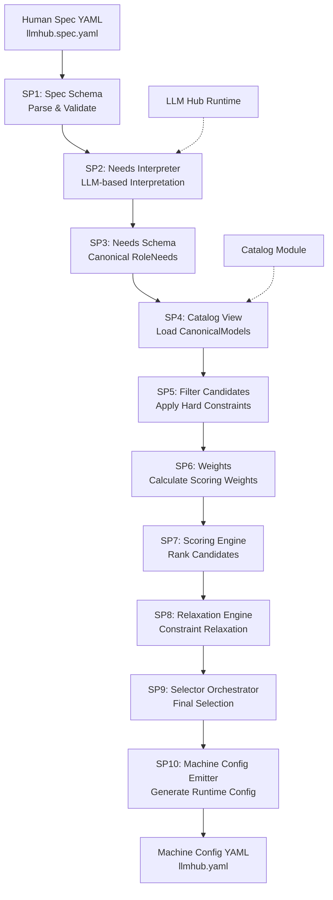
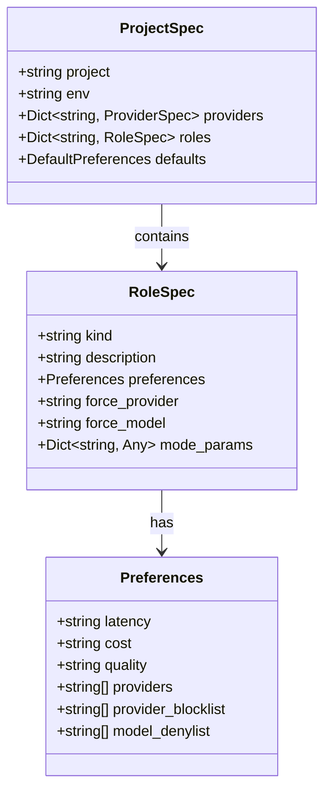
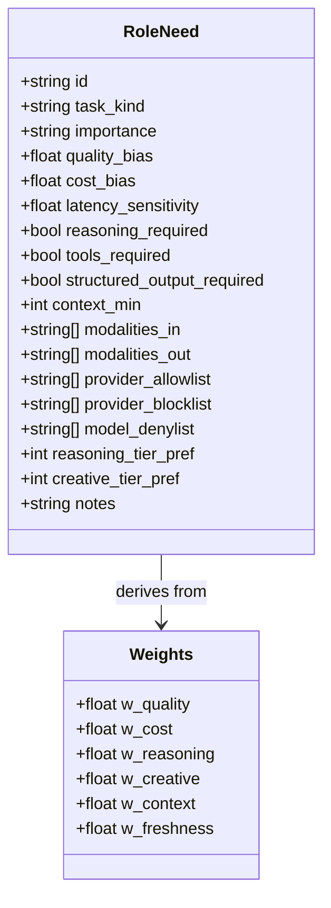
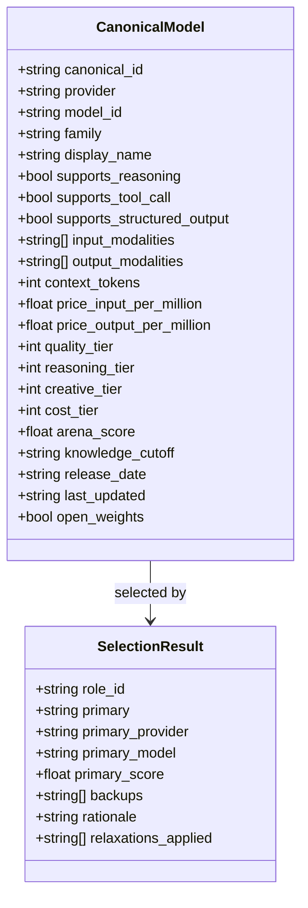
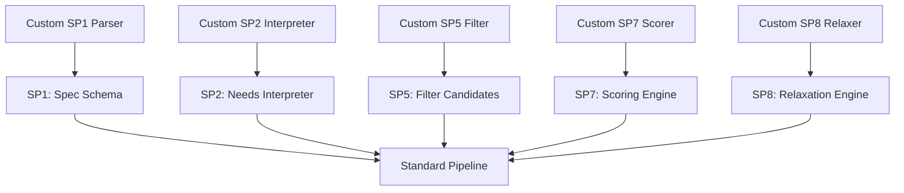
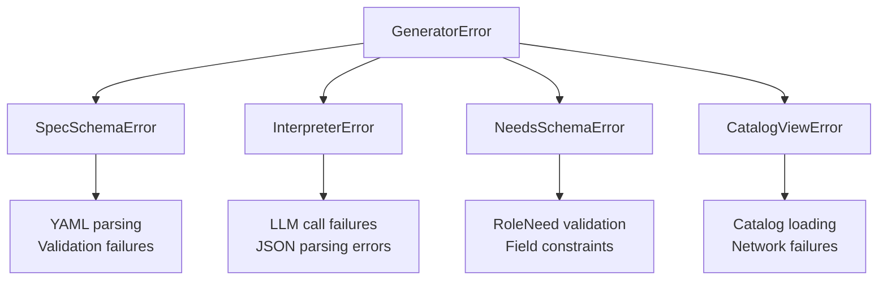
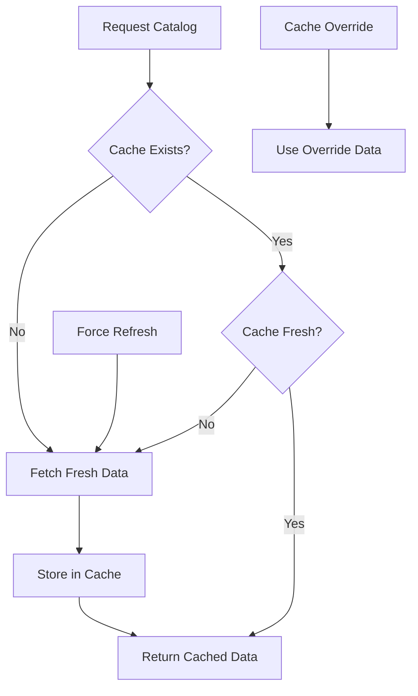
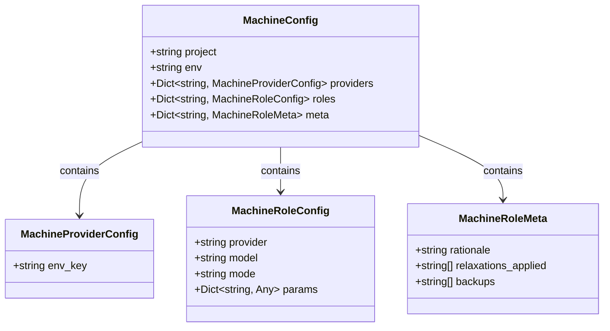

# Generator Pipeline Architecture Documentation

<cite>
**Referenced Files in This Document**
- [packages/llmhub/src/llmhub/generator/__init__.py](file://packages/llmhub/src/llmhub/generator/__init__.py)
- [packages/llmhub/src/llmhub/generator/spec.md](file://packages/llmhub/src/llmhub/generator/spec.md)
- [packages/llmhub/src/llmhub/spec_models.py](file://packages/llmhub/src/llmhub/spec_models.py)
- [packages/llmhub/src/llmhub/generator/sp1_spec_schema/models.py](file://packages/llmhub/src/llmhub/generator/sp1_spec_schema/models.py)
- [packages/llmhub/src/llmhub/generator/sp2_needs_interpreter/interpreter.py](file://packages/llmhub/src/llmhub/generator/sp2_needs_interpreter/interpreter.py)
- [packages/llmhub/src/llmhub/generator/sp3_needs_schema/models.py](file://packages/llmhub/src/llmhub/generator/sp3_needs_schema/models.py)
- [packages/llmhub/src/llmhub/generator/sp4_catalog_view/loader.py](file://packages/llmhub/src/llmhub/generator/sp4_catalog_view/loader.py)
- [packages/llmhub/src/llmhub/generator/sp5_filter_candidates/filter.py](file://packages/llmhub/src/llmhub/generator/sp5_filter_candidates/filter.py)
- [packages/llmhub/src/llmhub/generator/sp6_weights/calculator.py](file://packages/llmhub/src/llmhub/generator/sp6_weights/calculator.py)
- [packages/llmhub/src/llmhub/generator/sp7_scoring_engine/scorer.py](file://packages/llmhub/src/llmhub/generator/sp7_scoring_engine/scorer.py)
- [packages/llmhub/src/llmhub/generator/sp8_relaxation_engine/relaxer.py](file://packages/llmhub/src/llmhub/generator/sp8_relaxation_engine/relaxer.py)
- [packages/llmhub/src/llmhub/generator/sp9_selector_orchestrator/orchestrator.py](file://packages/llmhub/src/llmhub/generator/sp9_selector_orchestrator/orchestrator.py)
- [packages/llmhub/src/llmhub/generator/sp10_machine_config_emitter/builder.py](file://packages/llmhub/src/llmhub/generator/sp10_machine_config_emitter/builder.py)
- [packages/llmhub/src/llmhub/catalog/schema.py](file://packages/llmhub/src/llmhub/catalog/schema.py)
- [packages/llmhub/src/llmhub/generator/sp9_selector_orchestrator/models.py](file://packages/llmhub/src/llmhub/generator/sp9_selector_orchestrator/models.py)
- [packages/llmhub/src/llmhub/generator/sp10_machine_config_emitter/models.py](file://packages/llmhub/src/llmhub/generator/sp10_machine_config_emitter/models.py)
- [packages/llmhub/src/llmhub/catalog/cache.py](file://packages/llmhub/src/llmhub/catalog/cache.py)
</cite>

## Table of Contents
1. [Introduction](#introduction)
2. [Pipeline Overview](#pipeline-overview)
3. [Core Data Models](#core-data-models)
4. [Step-by-Step Pipeline Analysis](#step-by-step-pipeline-analysis)
5. [Extensibility and Customization](#extensibility-and-customization)
6. [Error Handling and Resilience](#error-handling-and-resilience)
7. [Caching and Performance](#caching-and-performance)
8. [Integration with Runtime](#integration-with-runtime)
9. [Testing and Validation](#testing-and-validation)
10. [Conclusion](#conclusion)

## Introduction

The Generator Pipeline is a sophisticated 10-step transformation system that converts high-level human specifications into executable runtime configurations for the LLM Hub Runtime. This pipeline serves as the bridge between human-readable requirements and machine-executable configurations, providing a structured, deterministic approach to model selection and configuration generation.

The pipeline follows a modular architecture where each step (SP1-SP10) handles specific aspects of the transformation process, from spec parsing to final config emission. Each step maintains clear input/output contracts and can be independently tested and validated.

## Pipeline Overview

The Generator Pipeline transforms a human-written `llmhub.spec.yaml` file through ten distinct stages, each with specialized responsibilities:

**Diagram sources**
- [packages/llmhub/src/llmhub/generator/__init__.py](file://packages/llmhub/src/llmhub/generator/__init__.py#L52-L118)
- [packages/llmhub/src/llmhub/generator/spec.md](file://packages/llmhub/src/llmhub/generator/spec.md#L43-L56)

**Section sources**
- [packages/llmhub/src/llmhub/generator/spec.md](file://packages/llmhub/src/llmhub/generator/spec.md#L1-L93)
- [packages/llmhub/src/llmhub/generator/__init__.py](file://packages/llmhub/src/llmhub/generator/__init__.py#L1-L146)

## Core Data Models

The pipeline operates on several key data models that represent different stages of the transformation process:

### ProjectSpec Model (SP1)
The `ProjectSpec` model represents the parsed human specification from the `llmhub.spec.yaml` file. It contains project metadata, provider configurations, and role specifications.

**Diagram sources**
- [packages/llmhub/src/llmhub/generator/sp1_spec_schema/models.py](file://packages/llmhub/src/llmhub/generator/sp1_spec_schema/models.py#L40-L65)
- [packages/llmhub/src/llmhub/spec_models.py](file://packages/llmhub/src/llmhub/spec_models.py#L44-L52)

### RoleNeed Model (SP3)
The `RoleNeed` model represents canonical role requirements after LLM interpretation. It contains all selection criteria needed for model matching.

**Diagram sources**
- [packages/llmhub/src/llmhub/generator/sp3_needs_schema/models.py](file://packages/llmhub/src/llmhub/generator/sp3_needs_schema/models.py#L10-L131)
- [packages/llmhub/src/llmhub/generator/sp6_weights/models.py](file://packages/llmhub/src/llmhub/generator/sp6_weights/models.py)

### CanonicalModel Schema (SP4)
The `CanonicalModel` represents the standardized view of available models from the catalog system.

**Diagram sources**
- [packages/llmhub/src/llmhub/catalog/schema.py](file://packages/llmhub/src/llmhub/catalog/schema.py#L68-L122)
- [packages/llmhub/src/llmhub/generator/sp9_selector_orchestrator/models.py](file://packages/llmhub/src/llmhub/generator/sp9_selector_orchestrator/models.py#L12-L22)

**Section sources**
- [packages/llmhub/src/llmhub/generator/sp1_spec_schema/models.py](file://packages/llmhub/src/llmhub/generator/sp1_spec_schema/models.py#L1-L65)
- [packages/llmhub/src/llmhub/generator/sp3_needs_schema/models.py](file://packages/llmhub/src/llmhub/generator/sp3_needs_schema/models.py#L1-L131)
- [packages/llmhub/src/llmhub/catalog/schema.py](file://packages/llmhub/src/llmhub/catalog/schema.py#L1-L122)

## Step-by-Step Pipeline Analysis

### SP1: Spec Schema - Human Spec to Typed Model

**Responsibility**: Parse and validate the human-written `llmhub.spec.yaml` file into a structured `ProjectSpec` model.

**Input Contract**: Raw YAML content from `llmhub.spec.yaml` file
**Output Contract**: Validated `ProjectSpec` object with project metadata, roles, and preferences

**Implementation Details**:
- Uses Pydantic models for strict validation
- Provides sensible defaults for optional fields
- Supports forward compatibility through extra field handling
- Validates provider configurations and role specifications

**Key Features**:
- Comprehensive error reporting with clear failure messages
- Automatic type conversion and normalization
- Support for custom provider configurations

**Section sources**
- [packages/llmhub/src/llmhub/generator/sp1_spec_schema/models.py](file://packages/llmhub/src/llmhub/generator/sp1_spec_schema/models.py#L1-L65)

### SP2: Needs Interpreter - LLM-Based Interpretation

**Responsibility**: Convert `ProjectSpec` into canonical `RoleNeed` objects using LLM capabilities.

**Input Contract**: `ProjectSpec` object and `LLMHub` instance
**Output Contract**: List of `RoleNeed` objects with structured requirements

**Implementation Details**:
- Single LLM call per project with structured JSON output
- Uses predefined prompts for consistent interpretation
- Handles various natural language patterns in role descriptions
- Maintains consistency across environments

**Key Features**:
- Structured output validation against `RoleNeed` schema
- Temperature control for deterministic output
- Error handling for LLM failures and parsing issues

**Section sources**
- [packages/llmhub/src/llmhub/generator/sp2_needs_interpreter/interpreter.py](file://packages/llmhub/src/llmhub/generator/sp2_needs_interpreter/interpreter.py#L1-L92)

### SP3: Needs Schema - Canonical RoleNeed Model

**Responsibility**: Define and validate the canonical `RoleNeed` data model.

**Input Contract**: Raw JSON data from LLM output
**Output Contract**: Validated `RoleNeed` objects with normalized fields

**Implementation Details**:
- Pydantic-based validation with field validators
- Automatic normalization of importance levels
- Flexible schema supporting future extensions
- Comprehensive field validation and defaults

**Key Features**:
- Forward compatibility with new fields
- Built-in validation and error reporting
- Field-level constraints and defaults
- Type safety and data integrity

**Section sources**
- [packages/llmhub/src/llmhub/generator/sp3_needs_schema/models.py](file://packages/llmhub/src/llmhub/generator/sp3_needs_schema/models.py#L1-L131)

### SP4: Catalog View - Load Canonical Models

**Responsibility**: Load and transform catalog data into `CanonicalModel` objects.

**Input Contract**: Catalog TTL settings, refresh options, and optional overrides
**Output Contract**: List of `CanonicalModel` objects

**Implementation Details**:
- Supports caching with configurable TTL
- Test-friendly catalog override mechanism
- Integration with catalog module infrastructure
- Graceful fallback for loading failures

**Key Features**:
- Configurable cache TTL (default 24 hours)
- Force refresh capability for development
- Test isolation through catalog overrides
- Error handling with meaningful failure messages

**Section sources**
- [packages/llmhub/src/llmhub/generator/sp4_catalog_view/loader.py](file://packages/llmhub/src/llmhub/generator/sp4_catalog_view/loader.py#L1-L42)

### SP5: Filter Candidates - Hard Constraint Application

**Responsibility**: Apply hard constraints from `RoleNeed` to filter catalog models.

**Input Contract**: `RoleNeed` object and list of `CanonicalModel` objects
**Output Contract**: Filtered list of candidate models meeting all hard constraints

**Implementation Details**:
- Multi-dimensional constraint checking
- Provider allowlist/blocklist enforcement
- Capability-based filtering (reasoning, tools, structured output)
- Modalities and context requirements validation

**Key Features**:
- Comprehensive constraint validation
- Efficient filtering algorithm
- Clear error reporting for constraint violations
- Support for complex multi-modal requirements

**Section sources**
- [packages/llmhub/src/llmhub/generator/sp5_filter_candidates/filter.py](file://packages/llmhub/src/llmhub/generator/sp5_filter_candidates/filter.py#L1-L73)

### SP6: Weights - Scoring Weight Calculation

**Responsibility**: Derive scoring weights from `RoleNeed` preferences and biases.

**Input Contract**: `RoleNeed` object
**Output Contract**: `Weights` object with normalized scoring coefficients

**Implementation Details**:
- Bias-based weight derivation from role preferences
- Task-kind specific adjustments
- Importance level scaling
- Tier preference boosting
- Context requirement weighting

**Key Features**:
- Dynamic weight calculation based on role characteristics
- Normalization to ensure weights sum to 1.0
- Task-specific weight adjustments
- Importance level influence on quality weighting

**Section sources**
- [packages/llmhub/src/llmhub/generator/sp6_weights/calculator.py](file://packages/llmhub/src/llmhub/generator/sp6_weights/calculator.py#L1-L73)

### SP7: Scoring Engine - Model Ranking

**Responsibility**: Compute weighted scores for models and rank candidates.

**Input Contract**: `RoleNeed`, `Weights`, and filtered `CanonicalModel` list
**Output Contract**: Sorted list of `(model, score)` tuples

**Implementation Details**:
- Multi-factor scoring with six scoring components
- Normalization of individual factor scores
- Weighted combination of all factors
- Sophisticated tie-breaking mechanisms
- Freshness scoring based on model age

**Scoring Factors**:
- Quality (tier + Arena score)
- Cost (cost tier)
- Reasoning capability
- Creative capability
- Context window size
- Model freshness

**Key Features**:
- Comprehensive multi-dimensional scoring
- Sophisticated tie-breaking logic
- Normalized scoring across different metrics
- Performance optimization for large catalogs

**Section sources**
- [packages/llmhub/src/llmhub/generator/sp7_scoring_engine/scorer.py](file://packages/llmhub/src/llmhub/generator/sp7_scoring_engine/scorer.py#L1-L166)

### SP8: Relaxation Engine - Constraint Relaxation

**Responsibility**: Systematically relax constraints when no candidates meet all requirements.

**Input Contract**: `RoleNeed`, full catalog, and `Weights`
**Output Contract**: Tuple of `(scored_candidates, relaxations_applied)`

**Implementation Details**:
- Hierarchical relaxation strategy
- Preserved constraint order for predictability
- Gradual relaxation with informative logging
- Multiple relaxation strategies

**Relaxation Strategy**:
1. Remove provider allowlist
2. Reduce context requirements by 25%
3. Make structured output optional
4. Make reasoning optional
5. Make tools optional

**Key Features**:
- Predictable relaxation order
- Informative relaxation tracking
- Fallback mechanisms for critical roles
- Balanced trade-offs between requirements

**Section sources**
- [packages/llmhub/src/llmhub/generator/sp8_relaxation_engine/relaxer.py](file://packages/llmhub/src/llmhub/generator/sp8_relaxation_engine/relaxer.py#L1-L87)

### SP9: Selector Orchestrator - Final Selection Coordination

**Responsibility**: Coordinate all selection subproblems to produce final model selections.

**Input Contract**: `RoleNeed`, `CanonicalModel` list, and `SelectorOptions`
**Output Contract**: `SelectionResult` with primary model, backups, and rationale

**Implementation Details**:
- Orchestration of filtering, scoring, and relaxation
- Primary and backup model selection
- Rationale generation for transparency
- Configurable backup selection

**Key Features**:
- Primary and backup model selection
- Comprehensive rationale generation
- Configurable selection behavior
- Error handling for critical role failures

**Section sources**
- [packages/llmhub/src/llmhub/generator/sp9_selector_orchestrator/orchestrator.py](file://packages/llmhub/src/llmhub/generator/sp9_selector_orchestrator/orchestrator.py#L1-L109)

### SP10: Machine Config Emitter - Runtime Configuration Generation

**Responsibility**: Build final machine-readable configuration from selections.

**Input Contract**: `ProjectSpec` and list of `SelectionResult` objects
**Output Contract**: `MachineConfig` object ready for runtime consumption

**Implementation Details**:
- Provider configuration inference
- Role configuration assembly
- Metadata preservation
- YAML generation with proper formatting

**Key Features**:
- Automatic provider key inference
- Role parameter preservation
- Metadata inclusion for transparency
- Configurable output formatting

**Section sources**
- [packages/llmhub/src/llmhub/generator/sp10_machine_config_emitter/builder.py](file://packages/llmhub/src/llmhub/generator/sp10_machine_config_emitter/builder.py#L1-L113)

## Extensibility and Customization

The Generator Pipeline is designed with extensibility in mind, allowing customization at multiple levels:

### Step-Level Extensibility

Each pipeline step can be customized independently:

**Customization Points**:
- **SP1**: Custom spec parsers for different input formats
- **SP2**: Alternative LLM interpreters or different prompting strategies
- **SP5**: Specialized filtering logic for domain-specific requirements
- **SP7**: Alternative scoring algorithms or additional scoring factors
- **SP8**: Different relaxation strategies or constraint prioritization
- **SP9**: Custom selection logic for specific use cases
- **SP10**: Alternative config formats or additional metadata

### Extension Mechanisms

**Interface-Based Design**: Each step defines clear interfaces that can be implemented differently while maintaining compatibility.

**Plugin Architecture**: The main `generate_machine_config` function accepts optional parameters for customizing behavior.

**Configuration-Driven Behavior**: Many steps support configuration options that alter their behavior without changing implementation.

**Section sources**
- [packages/llmhub/src/llmhub/generator/__init__.py](file://packages/llmhub/src/llmhub/generator/__init__.py#L52-L118)

## Error Handling and Resilience

The pipeline implements comprehensive error handling across all steps:

### Error Classification

### Resilience Strategies

**Graceful Degradation**: When components fail, the pipeline attempts to continue with fallback mechanisms.

**Informative Error Messages**: Each step provides clear, actionable error messages for debugging.

**Partial Failure Recovery**: Some steps can recover from partial failures while others require complete failure.

**Logging and Monitoring**: Comprehensive logging at each step for debugging and monitoring.

### Error Handling Patterns

**Try-Catch Blocks**: Each step wraps its logic in appropriate error handling.

**Exception Propagation**: Specific exceptions are raised for different failure modes.

**Fallback Values**: Default values are provided for optional components.

**Section sources**
- [packages/llmhub/src/llmhub/generator/__init__.py](file://packages/llmhub/src/llmhub/generator/__init__.py#L47-L118)

## Caching and Performance

The pipeline incorporates several performance optimization strategies:

### Catalog Caching

The catalog system implements intelligent caching with configurable TTL:

**Cache Implementation**:
- File-based caching with JSON serialization
- Configurable TTL (default 24 hours)
- Automatic cache invalidation
- Stale cache fallback for reliability

### Performance Optimizations

**Lazy Loading**: Components load data only when needed.

**Efficient Filtering**: Early termination in filtering algorithms.

**Batch Operations**: Group operations where possible.

**Memory Management**: Careful memory usage for large catalogs.

**Section sources**
- [packages/llmhub/src/llmhub/catalog/cache.py](file://packages/llmhub/src/llmhub/catalog/cache.py#L37-L69)

## Integration with Runtime

The Generator Pipeline produces configurations that integrate seamlessly with the LLM Hub Runtime:

### Configuration Format

The final `MachineConfig` follows a standardized format:

**Diagram sources**
- [packages/llmhub/src/llmhub/generator/sp10_machine_config_emitter/models.py](file://packages/llmhub/src/llmhub/generator/sp10_machine_config_emitter/models.py#L6-L37)

### Runtime Compatibility

**Forward Compatibility**: New fields in configurations are handled gracefully by the runtime.

**Validation**: Runtime validates configurations against schema requirements.

**Error Handling**: Runtime provides clear error messages for configuration issues.

**Section sources**
- [packages/llmhub/src/llmhub/generator/sp10_machine_config_emitter/models.py](file://packages/llmhub/src/llmhub/generator/sp10_machine_config_emitter/models.py#L1-L37)

## Testing and Validation

The pipeline includes comprehensive testing strategies:

### Unit Testing Approach

Each step has dedicated unit tests covering:
- Happy path scenarios
- Error conditions
- Boundary cases
- Edge cases

### Integration Testing

End-to-end testing with:
- Mock LLM responses
- Test catalog data
- Configuration validation

### Validation Strategies

**Schema Validation**: All data models use Pydantic for automatic validation.

**Behavioral Testing**: Tests verify pipeline behavior across different scenarios.

**Performance Testing**: Benchmarks ensure acceptable performance thresholds.

**Section sources**
- [packages/llmhub/src/llmhub/generator/spec.md](file://packages/llmhub/src/llmhub/generator/spec.md#L88-L93)

## Conclusion

The Generator Pipeline represents a sophisticated, modular approach to transforming human specifications into executable runtime configurations. Its 10-step architecture provides clear separation of concerns while maintaining strong data flow and error handling.

**Key Strengths**:
- **Modularity**: Each step has focused responsibilities with clear interfaces
- **Extensibility**: Easy to customize individual steps or entire pipeline behavior
- **Resilience**: Comprehensive error handling and graceful degradation
- **Performance**: Intelligent caching and optimization strategies
- **Transparency**: Clear rationale generation and logging
- **Compatibility**: Seamless integration with runtime systems

**Design Principles**:
- **Determinism**: Same inputs produce identical outputs
- **Forward Compatibility**: New features don't break existing functionality
- **Error Clarity**: Meaningful error messages for debugging
- **Performance Awareness**: Optimized for production use cases

The pipeline successfully bridges the gap between human requirements and machine execution, providing a reliable foundation for automated model selection and configuration generation in LLM Hub environments.