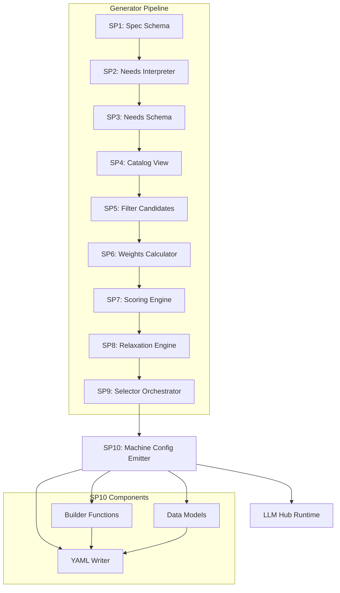
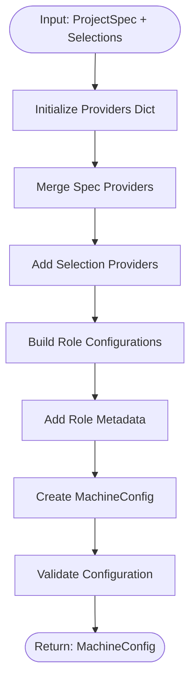
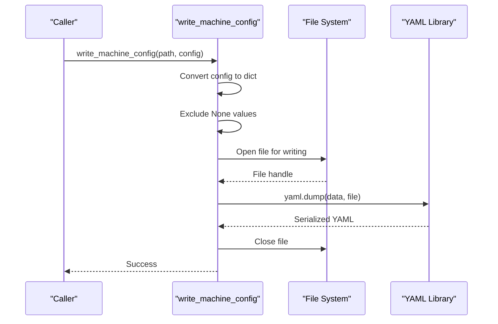
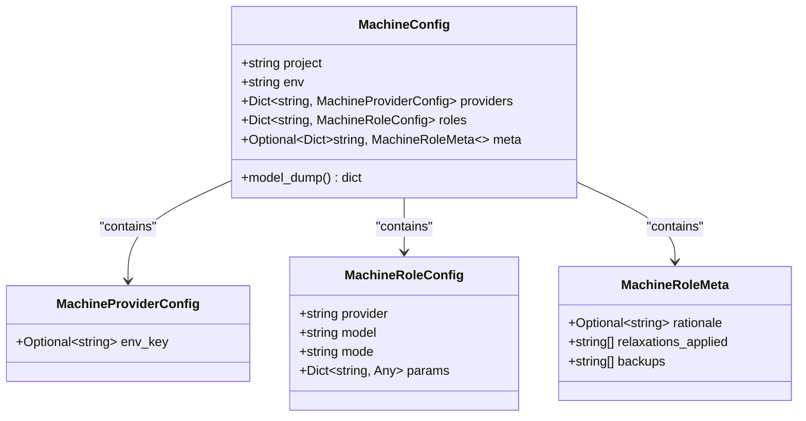
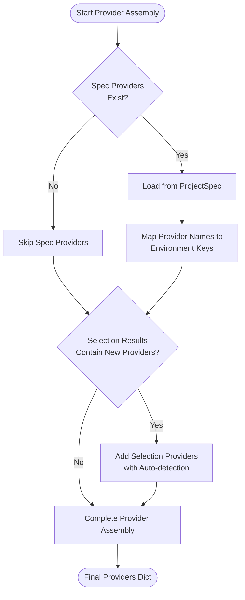
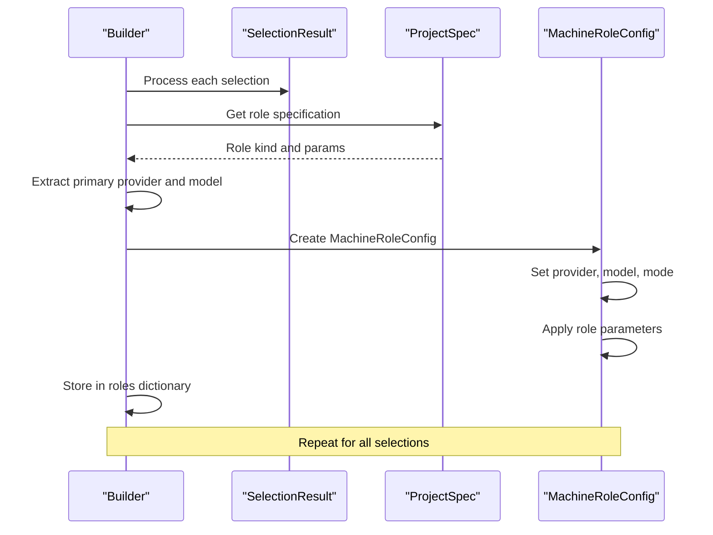
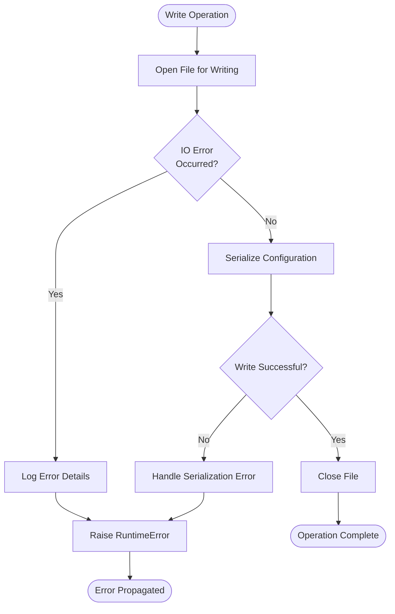
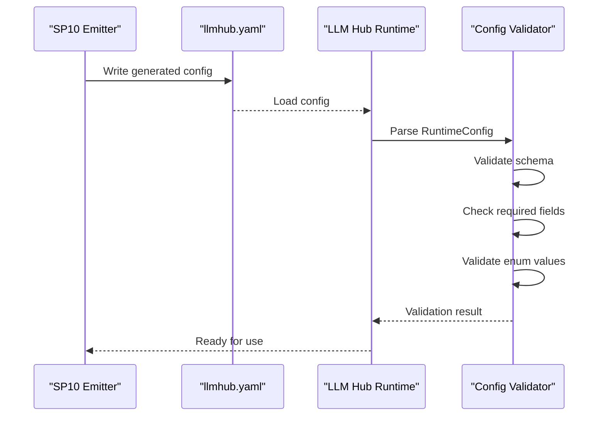
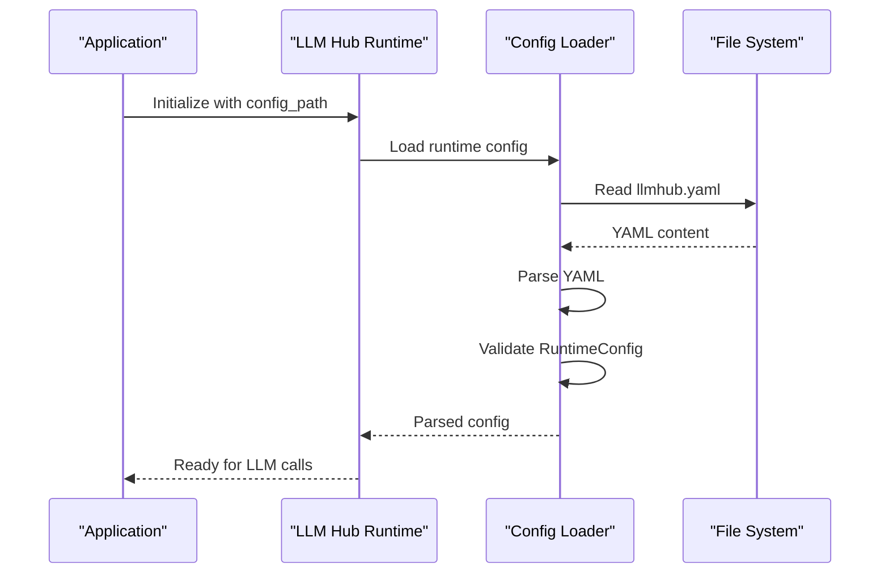

# SP10: Machine Config Emitter

<cite>
**Referenced Files in This Document**
- [builder.py](file://packages/llmhub/src/llmhub/generator/sp10_machine_config_emitter/builder.py)
- [models.py](file://packages/llmhub/src/llmhub/generator/sp10_machine_config_emitter/models.py)
- [spec.md](file://packages/llmhub/src/llmhub/generator/sp10_machine_config_emitter/spec.md)
- [schema.py](file://packages/llmhub/src/llmhub/catalog/schema.py)
- [models.py](file://packages/llmhub_runtime/src/llmhub_runtime/models.py)
- [runtime_io.py](file://packages/llmhub/src/llmhub/runtime_io.py)
- [llmhub.yaml](file://packages/llmhub_runtime/tests/fixtures/llmhub.yaml)
- [__init__.py](file://packages/llmhub/src/llmhub/generator/__init__.py)
- [runtime_cmd.py](file://packages/llmhub/src/llmhub/commands/runtime_cmd.py)
</cite>

## Table of Contents
1. [Introduction](#introduction)
2. [System Architecture](#system-architecture)
3. [Core Components](#core-components)
4. [Data Models and Schema](#data-models-and-schema)
5. [Configuration Building Process](#configuration-building-process)
6. [YAML Output and Formatting](#yaml-output-and-formatting)
7. [Error Handling and Validation](#error-handling-and-validation)
8. [Integration with Runtime](#integration-with-runtime)
9. [Examples and Use Cases](#examples-and-use-cases)
10. [Best Practices and Guidelines](#best-practices-and-guidelines)
11. [Troubleshooting](#troubleshooting)

## Introduction

SP10: Machine Config Emitter serves as the final stage in LLM Hub's configuration generation pipeline, transforming selection results from the model selection orchestrator into a runtime-ready `llmhub.yaml` configuration file. This component bridges the gap between human-readable specifications and machine-executable configurations, ensuring optimal model assignments, backup configurations, and comprehensive metadata for each role.

The emitter performs several critical functions:
- Assembling provider configurations with environment variable mappings
- Constructing role-specific configurations with optimal model assignments
- Embedding rationale and relaxation information for transparency
- Validating compatibility with the LLM Hub Runtime schema
- Generating human-readable, well-formatted YAML output

## System Architecture

The Machine Config Emitter operates as part of LLM Hub's modular generator architecture, receiving inputs from previous stages and producing outputs for runtime consumption.



**Diagram sources**
- [__init__.py](file://packages/llmhub/src/llmhub/generator/__init__.py#L52-L118)
- [builder.py](file://packages/llmhub/src/llmhub/generator/sp10_machine_config_emitter/builder.py#L19-L113)

**Section sources**
- [__init__.py](file://packages/llmhub/src/llmhub/generator/__init__.py#L52-L118)
- [spec.md](file://packages/llmhub/src/llmhub/generator/sp10_machine_config_emitter/spec.md#L1-L40)

## Core Components

### Build Machine Config Function

The `build_machine_config` function serves as the primary orchestration point, taking ProjectSpec and SelectionResults to construct a complete MachineConfig.



**Diagram sources**
- [builder.py](file://packages/llmhub/src/llmhub/generator/sp10_machine_config_emitter/builder.py#L19-L88)

### Write Machine Config Function

The `write_machine_config` function handles the serialization of MachineConfig to YAML format with proper formatting and encoding.



**Diagram sources**
- [builder.py](file://packages/llmhub/src/llmhub/generator/sp10_machine_config_emitter/builder.py#L91-L113)

**Section sources**
- [builder.py](file://packages/llmhub/src/llmhub/generator/sp10_machine_config_emitter/builder.py#L19-L113)

## Data Models and Schema

### MachineConfig Structure

The MachineConfig represents the final output schema compatible with LLM Hub Runtime, containing all necessary information for runtime execution.



**Diagram sources**
- [models.py](file://packages/llmhub/src/llmhub/generator/sp10_machine_config_emitter/models.py#L6-L37)

### Schema Compatibility with Runtime

The MachineConfig schema maintains strict compatibility with LLM Hub Runtime's expectations:

| Field | Type | Required | Description |
|-------|------|----------|-------------|
| project | string | Yes | Project identifier for logging and organization |
| env | string | Yes | Environment designation (dev, staging, production) |
| providers | Dict[string, MachineProviderConfig] | Yes | Provider configurations with API keys |
| roles | Dict[string, MachineRoleConfig] | Yes | Role-specific model assignments |
| meta | Optional[Dict[string, MachineRoleMeta]] | No | Selection rationale and metadata |

**Section sources**
- [models.py](file://packages/llmhub/src/llmhub/generator/sp10_machine_config_emitter/models.py#L6-L37)
- [models.py](file://packages/llmhub_runtime/src/llmhub_runtime/models.py#L28-L41)

## Configuration Building Process

### Provider Configuration Assembly

The emitter intelligently merges provider configurations from multiple sources:



**Diagram sources**
- [builder.py](file://packages/llmhub/src/llmhub/generator/sp10_machine_config_emitter/builder.py#L34-L56)

### Role Configuration Construction

Each role receives a carefully constructed configuration based on selection results:



**Diagram sources**
- [builder.py](file://packages/llmhub/src/llmhub/generator/sp10_machine_config_emitter/builder.py#L58-L80)

### Metadata and Rationale Embedding

The emitter captures comprehensive metadata about each selection decision:

| Metadata Field | Type | Purpose |
|----------------|------|---------|
| rationale | string | Natural language explanation of selection |
| relaxations_applied | List[string] | List of constraints relaxed during selection |
| backups | List[string] | Alternative model candidates considered |

**Section sources**
- [builder.py](file://packages/llmhub/src/llmhub/generator/sp10_machine_config_emitter/builder.py#L58-L88)

## YAML Output and Formatting

### Formatting Standards

The emitter produces highly readable YAML with consistent formatting:

```yaml
project: my-application
env: development

providers:
  openai:
    env_key: OPENAI_API_KEY
  anthropic:
    env_key: ANTHROPIC_API_KEY

roles:
  llm.inference:
    provider: openai
    model: gpt-4o-mini
    mode: chat
    params:
      temperature: 0.7
      max_tokens: 2048
  
  llm.embedding:
    provider: openai
    model: text-embedding-3-small
    mode: embedding
    params: {}

meta:
  llm.inference:
    rationale: "Selected openai/gpt-4o-mini (score: 0.875) for high quality at reasonable cost. Applied 2 relaxations: latency medium, reasoning required."
    relaxations_applied:
      - "latency sensitivity reduced from high to medium"
      - "reasoning requirement relaxed from required to optional"
    backups:
      - "openai/gpt-4"
      - "anthropic/claude-3-5-sonnet-20241022"
```

### Extensibility Features

The YAML output supports extensibility while maintaining backward compatibility:

- **Stable Key Ordering**: Maintains consistent field ordering for diffs and reviews
- **Unicode Support**: Handles international characters in descriptions and rationale
- **Comment Preservation**: Future-proof for comment-based documentation
- **Flexible Parameter Schema**: Supports arbitrary parameters per role

**Section sources**
- [builder.py](file://packages/llmhub/src/llmhub/generator/sp10_machine_config_emitter/builder.py#L91-L113)

## Error Handling and Validation

### File Writing Error Handling

The emitter implements robust error handling for file operations:



**Diagram sources**
- [builder.py](file://packages/llmhub/src/llmhub/generator/sp10_machine_config_emitter/builder.py#L91-L113)

### Runtime Compatibility Validation

The emitter ensures generated configurations meet runtime requirements:

| Validation Type | Check | Failure Action |
|-----------------|-------|----------------|
| Schema Compliance | Pydantic model validation | Raise GeneratorError |
| Provider Existence | Required env_key present | Warn and continue |
| Role Completeness | Provider and model specified | Skip incomplete roles |
| Parameter Validity | JSON-serializable params | Filter invalid parameters |

### Post-Generation Validation

After generation, the runtime performs additional validation:



**Diagram sources**
- [runtime_io.py](file://packages/llmhub/src/llmhub/runtime_io.py#L11-L73)

**Section sources**
- [builder.py](file://packages/llmhub/src/llmhub/generator/sp10_machine_config_emitter/builder.py#L91-L113)
- [runtime_io.py](file://packages/llmhub/src/llmhub/runtime_io.py#L11-L73)

## Integration with Runtime

### Compatibility Matrix

The Machine Config Emitter maintains strict compatibility with LLM Hub Runtime:

| SP10 Feature | Runtime Support | Notes |
|--------------|-----------------|-------|
| Project/Env Fields | ✓ Full | Used for logging and environment switching |
| Provider Configs | ✓ Full | Supports env_key and future extensions |
| Role Configs | ✓ Full | Provider, model, mode, and params |
| Metadata Section | Partial | Runtime ignores meta but preserves for review |
| Backup Models | Not Used | Runtime focuses on primary assignment |

### Runtime Loading Process



**Diagram sources**
- [runtime_io.py](file://packages/llmhub/src/llmhub/runtime_io.py#L11-L73)

**Section sources**
- [models.py](file://packages/llmhub_runtime/src/llmhub_runtime/models.py#L28-L41)
- [runtime_io.py](file://packages/llmhub/src/llmhub/runtime_io.py#L11-L73)

## Examples and Use Cases

### Example 1: Simple Chat Application

For a basic chat application requiring inference and preprocessing:

**Generated Configuration:**
```yaml
project: chat-app
env: production

providers:
  openai:
    env_key: OPENAI_API_KEY
  anthropic:
    env_key: ANTHROPIC_API_KEY

roles:
  llm.preprocess:
    provider: openai
    model: gpt-4o-mini
    mode: chat
    params:
      temperature: 0.2
      max_tokens: 512
      
  llm.inference:
    provider: anthropic
    model: claude-3-5-sonnet-20241022
    mode: chat
    params:
      temperature: 0.7
      max_tokens: 2048

meta:
  llm.preprocess:
    rationale: "Selected GPT-4o-mini for fast, cost-effective preprocessing. High quality tier with moderate cost."
    relaxations_applied: []
    backups:
      - "openai/gpt-4o"
      - "anthropic/claude-3-opus"
      
  llm.inference:
    rationale: "Selected Claude 3.5 Sonnet for superior reasoning capabilities. Balanced quality and cost."
    relaxations_applied: []
    backups:
      - "anthropic/claude-3-5-haiku"
      - "openai/gpt-4"
```

### Example 2: Multi-Modal Application

For applications requiring text, image, and embedding capabilities:

```yaml
project: multimodal-app
env: staging

providers:
  openai:
    env_key: OPENAI_API_KEY
  anthropic:
    env_key: ANTHROPIC_API_KEY
  google:
    env_key: GOOGLE_API_KEY

roles:
  llm.text:
    provider: openai
    model: gpt-4o
    mode: chat
    params:
      temperature: 0.3
      max_tokens: 1024
      
  llm.image:
    provider: openai
    model: gpt-4o
    mode: image
    params:
      size: 1024x1024
      quality: hd
      
  llm.embedding:
    provider: openai
    model: text-embedding-3-large
    mode: embedding
    params: {}

meta:
  llm.text:
    rationale: "GPT-4o selected for comprehensive text processing with excellent multimodal capabilities."
    relaxations_applied: []
    backups:
      - "anthropic/claude-4"
      
  llm.image:
    rationale: "GPT-4o chosen for superior image generation quality and safety features."
    relaxations_applied: []
    backups:
      - "openai/dall-e-3"
```

### Example 3: Cost-Optimized Production

For production deployments prioritizing cost efficiency:

```yaml
project: cost-optimized-service
env: production

providers:
  openai:
    env_key: OPENAI_API_KEY
  deepseek:
    env_key: DEEPSEEK_API_KEY

roles:
  llm.processing:
    provider: deepseek
    model: deepseek-chat
    mode: chat
    params:
      temperature: 0.5
      max_tokens: 1024
      
  llm.analysis:
    provider: openai
    model: gpt-4o-mini
    mode: chat
    params:
      temperature: 0.3
      max_tokens: 512

meta:
  llm.processing:
    rationale: "DeepSeek selected for exceptional cost efficiency (0.0008/MT) while maintaining good quality."
    relaxations_applied:
      - "quality threshold relaxed from high to medium"
    backups:
      - "openai/gpt-3.5-turbo"
      
  llm.analysis:
    rationale: "GPT-4o-mini chosen for cost-effective analysis with adequate quality for production."
    relaxations_applied: []
    backups:
      - "anthropic/claude-3-haiku"
```

**Section sources**
- [llmhub.yaml](file://packages/llmhub_runtime/tests/fixtures/llmhub.yaml#L1-L51)

## Best Practices and Guidelines

### Pre-Generation Review Checklist

Before deploying generated configurations:

1. **Provider Verification**
   - Confirm all required API keys are available
   - Verify provider availability and rate limits
   - Check for regional restrictions

2. **Role Assignment Review**
   - Validate model capabilities match role requirements
   - Ensure parameter combinations are supported
   - Review backup model selections

3. **Parameter Optimization**
   - Adjust temperature for desired creativity vs consistency
   - Set appropriate token limits for context windows
   - Configure timeout and retry policies

4. **Cost Analysis**
   - Estimate monthly costs based on usage patterns
   - Identify cost-saving opportunities
   - Plan for budget alerts and monitoring

### Manual Override Guidelines

While the emitter provides optimal defaults, manual overrides may be necessary:

```yaml
# Safe overrides (recommended)
roles:
  llm.inference:
    params:
      # Increase timeout for complex tasks
      timeout: 30
      # Enable streaming for better UX
      stream: true

# Risky overrides (use cautiously)
roles:
  llm.inference:
    params:
      # May increase costs significantly
      max_tokens: 4096
      # May reduce quality
      temperature: 0.9
```

### Version Control Best Practices

1. **Track Changes**: Commit `llmhub.yaml` with meaningful messages
2. **Review Diffs**: Use git diff to understand configuration changes
3. **Branch Strategies**: Create branches for configuration experiments
4. **Automated Testing**: Validate configurations in CI/CD pipelines

**Section sources**
- [runtime_cmd.py](file://packages/llmhub/src/llmhub/commands/runtime_cmd.py#L13-L75)

## Troubleshooting

### Common Issues and Solutions

#### Issue: Missing Environment Variables

**Symptoms**: Runtime fails to initialize with provider authentication errors

**Solution**: 
1. Check `.env.example` for required variables
2. Set environment variables in your shell or `.env` file
3. Run `llmhub env check` to verify setup

#### Issue: Invalid YAML Format

**Symptoms**: Runtime loader reports YAML parsing errors

**Solution**:
1. Validate YAML syntax using online validators
2. Check for indentation issues
3. Ensure proper quoting for special characters

#### Issue: Provider Not Found

**Symptoms**: Runtime complains about unknown provider

**Solution**:
1. Verify provider name matches exactly
2. Check if provider is included in spec
3. Ensure environment key is properly configured

#### Issue: Role Configuration Missing

**Symptoms**: Specific roles fail to resolve

**Solution**:
1. Run `llmhub generate` to regenerate config
2. Check role names for typos
3. Verify role specifications in `llmhub.spec.yaml`

### Debugging Tools

The CLI provides several debugging commands:

```bash
# Preview generated config without writing
llmhub generate --dry-run

# Show detailed explanations for selections
llmhub generate --explain

# Compare spec vs runtime
llmhub runtime diff

# Validate runtime configuration
llmhub doctor
```

### Performance Optimization

For large-scale deployments:

1. **Caching**: Use appropriate TTL for catalog refresh
2. **Batch Processing**: Group related role calls
3. **Monitoring**: Track token usage and costs
4. **Fallbacks**: Implement graceful degradation

**Section sources**
- [runtime_cmd.py](file://packages/llmhub/src/llmhub/commands/runtime_cmd.py#L13-L75)