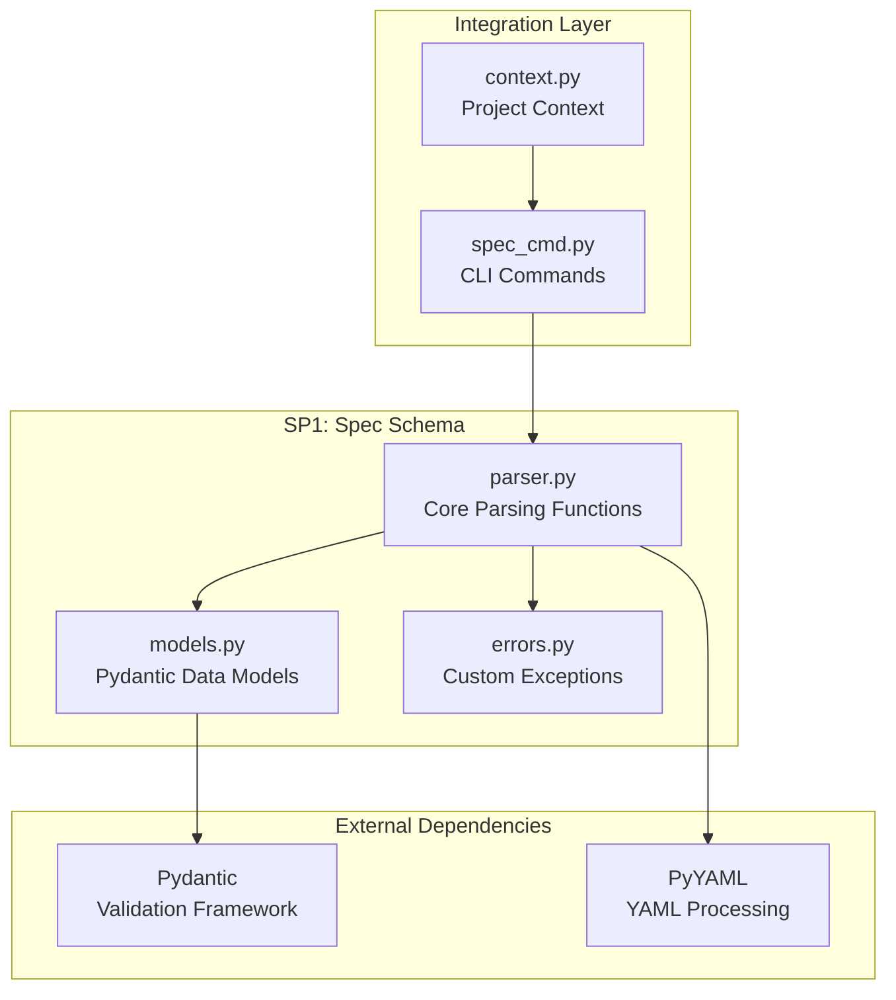
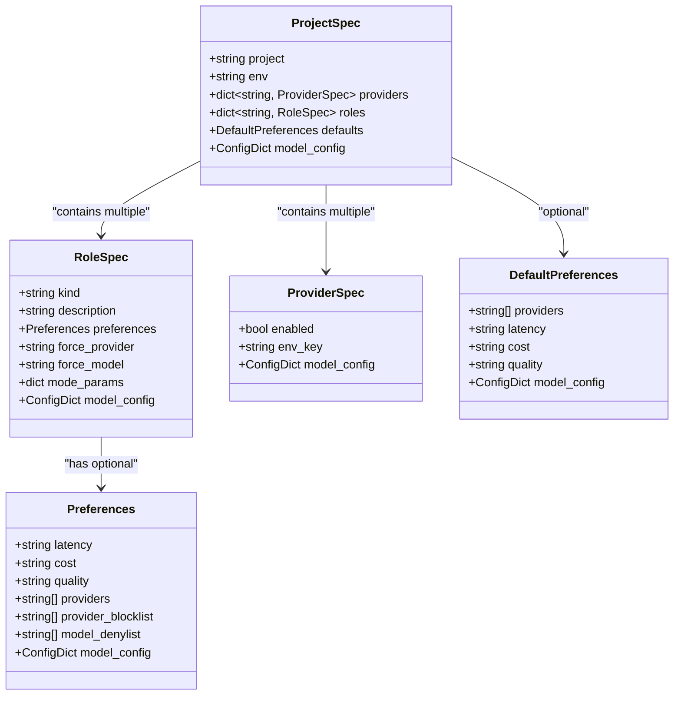
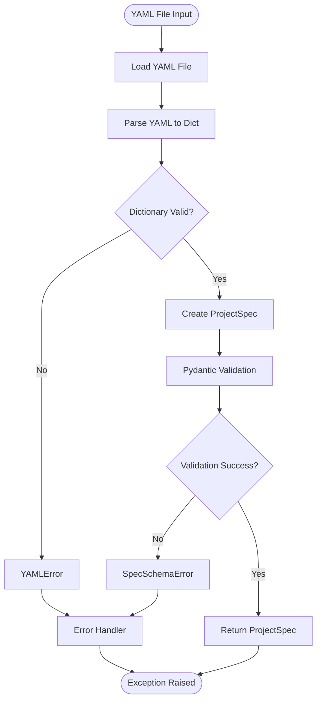
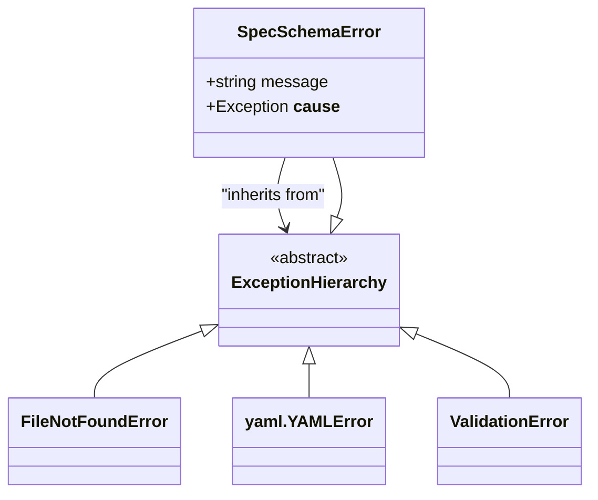
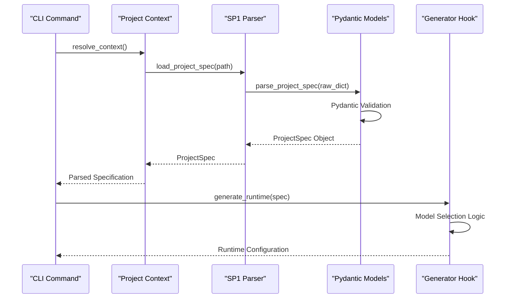

# SP1: Spec Schema

<cite>
**Referenced Files in This Document**
- [parser.py](file://packages/llmhub/src/llmhub/generator/sp1_spec_schema/parser.py)
- [models.py](file://packages/llmhub/src/llmhub/generator/sp1_spec_schema/models.py)
- [errors.py](file://packages/llmhub/src/llmhub/generator/sp1_spec_schema/errors.py)
- [spec.md](file://packages/llmhub/src/llmhub/generator/sp1_spec_schema/spec.md)
- [test_sp1_spec_schema.py](file://packages/llmhub/tests/generator/test_sp1_spec_schema.py)
- [llmhub.yaml](file://packages/llmhub_runtime/tests/fixtures/llmhub.yaml)
- [spec_models.py](file://packages/llmhub/src/llmhub/spec_models.py)
- [cli.py](file://packages/llmhub/src/llmhub/cli.py)
- [spec_cmd.py](file://packages/llmhub/src/llmhub/commands/spec_cmd.py)
- [generator_hook.py](file://packages/llmhub/src/llmhub/generator_hook.py)
- [context.py](file://packages/llmhub/src/llmhub/context.py)
</cite>

## Table of Contents
1. [Introduction](#introduction)
2. [Module Architecture](#module-architecture)
3. [Core Data Models](#core-data-models)
4. [Parsing Workflow](#parsing-workflow)
5. [Error Handling](#error-handling)
6. [Integration with Pipeline](#integration-with-pipeline)
7. [Validation Examples](#validation-examples)
8. [Common Issues and Troubleshooting](#common-issues-and-troubleshooting)
9. [Forward Compatibility](#forward-compatibility)
10. [Best Practices](#best-practices)

## Introduction

SP1: Spec Schema is the foundational component of the LLMHub generator pipeline, responsible for parsing and validating the `llmhub.spec.yaml` file. This module serves as the first gatekeeper in the system, ensuring that user-provided specifications meet structural requirements before proceeding to subsequent pipeline stages.

The module leverages Pydantic models to enforce schema correctness, providing strong typing, automatic validation, and clear error reporting. It transforms raw YAML input into a structured `ProjectSpec` object while maintaining determinism and forward compatibility.

## Module Architecture

The SP1 module follows a clean separation of concerns with three primary components:



**Diagram sources**
- [parser.py](file://packages/llmhub/src/llmhub/generator/sp1_spec_schema/parser.py#L1-L66)
- [models.py](file://packages/llmhub/src/llmhub/generator/sp1_spec_schema/models.py#L1-L65)
- [errors.py](file://packages/llmhub/src/llmhub/generator/sp1_spec_schema/errors.py#L1-L7)

**Section sources**
- [parser.py](file://packages/llmhub/src/llmhub/generator/sp1_spec_schema/parser.py#L1-L66)
- [models.py](file://packages/llmhub/src/llmhub/generator/sp1_spec_schema/models.py#L1-L65)
- [errors.py](file://packages/llmhub/src/llmhub/generator/sp1_spec_schema/errors.py#L1-L7)

## Core Data Models

The module defines several interconnected Pydantic models that represent the complete structure of an LLMHub specification:

### ProjectSpec Model

The `ProjectSpec` model serves as the root container for all specification data:



**Diagram sources**
- [models.py](file://packages/llmhub/src/llmhub/generator/sp1_spec_schema/models.py#L52-L65)
- [models.py](file://packages/llmhub/src/llmhub/generator/sp1_spec_schema/models.py#L40-L51)
- [models.py](file://packages/llmhub/src/llmhub/generator/sp1_spec_schema/models.py#L10-L17)
- [models.py](file://packages/llmhub/src/llmhub/generator/sp1_spec_schema/models.py#L18-L28)
- [models.py](file://packages/llmhub/src/llmhub/generator/sp1_spec_schema/models.py#L30-L38)

### Key Model Features

Each model incorporates several important design patterns:

- **Flexible Configuration**: All models use `ConfigDict(extra="allow")` to support future extensions
- **Optional Fields**: Many fields are optional with sensible defaults
- **Type Safety**: Strong typing ensures compile-time and runtime validation
- **Serialization Support**: Models can be easily converted to/from JSON/YAML

**Section sources**
- [models.py](file://packages/llmhub/src/llmhub/generator/sp1_spec_schema/models.py#L1-L65)

## Parsing Workflow

The parsing process follows a two-stage approach that ensures robustness and clear error reporting:



**Diagram sources**
- [parser.py](file://packages/llmhub/src/llmhub/generator/sp1_spec_schema/parser.py#L32-L66)

### Core Parsing Functions

The module provides two primary functions for parsing:

#### `load_project_spec(path: str) -> ProjectSpec`

This function handles the complete file-to-spec pipeline:

1. **File Validation**: Checks if the spec file exists
2. **YAML Loading**: Uses `yaml.safe_load()` for secure parsing
3. **Empty File Check**: Validates that the file contains content
4. **Delegation**: Passes the parsed dictionary to `parse_project_spec()`

#### `parse_project_spec(raw: Dict[str, Any]) -> ProjectSpec`

This function performs the core validation using Pydantic:

1. **Model Validation**: Calls `ProjectSpec.model_validate()` on the raw dictionary
2. **Automatic Type Conversion**: Pydantic automatically converts types where possible
3. **Schema Enforcement**: Validates against the defined model structure
4. **Error Translation**: Converts Pydantic validation errors to `SpecSchemaError`

**Section sources**
- [parser.py](file://packages/llmhub/src/llmhub/generator/sp1_spec_schema/parser.py#L13-L66)

## Error Handling

The module implements comprehensive error handling with clear, actionable error messages:

### Error Types



**Diagram sources**
- [errors.py](file://packages/llmhub/src/llmhub/generator/sp1_spec_schema/errors.py#L4-L7)

### Error Scenarios

The module handles several distinct error categories:

| Error Type | Cause | Example Message |
|------------|-------|----------------|
| `SpecSchemaError` | Schema validation failure | `"Failed to parse project spec: field required"` |
| `FileNotFoundError` | Spec file not found | `"Spec file not found: ./llmhub.spec.yaml"` |
| `YAMLError` | Invalid YAML syntax | `"Invalid YAML in spec file: ..."` |
| `ValueError` | Type conversion failure | `"Invalid value for field 'cost': ..."` |

### Error Recovery Strategies

The error handling follows a hierarchical approach:

1. **File-Level Errors**: Handled at the `load_project_spec()` level
2. **Parsing Errors**: Caught and re-raised as `SpecSchemaError`
3. **Validation Errors**: Automatically generated by Pydantic with field paths
4. **Generic Errors**: Wrapped with context information

**Section sources**
- [parser.py](file://packages/llmhub/src/llmhub/generator/sp1_spec_schema/parser.py#L26-L66)
- [errors.py](file://packages/llmhub/src/llmhub/generator/sp1_spec_schema/errors.py#L1-L7)

## Integration with Pipeline

SP1 serves as the entry point for the LLMHub generator pipeline, integrating seamlessly with other components:



**Diagram sources**
- [cli.py](file://packages/llmhub/src/llmhub/cli.py#L1-L67)
- [context.py](file://packages/llmhub/src/llmhub/context.py#L49-L90)
- [parser.py](file://packages/llmhub/src/llmhub/generator/sp1_spec_schema/parser.py#L32-L66)
- [generator_hook.py](file://packages/llmhub/src/llmhub/generator_hook.py#L132-L204)

### CLI Integration

The module integrates with the CLI through several commands:

- **`llmhub spec validate`**: Validates the spec without generating runtime
- **`llmhub spec show`**: Displays parsed spec information
- **`llmhub generate`**: Triggers the complete pipeline (after SP1)

### Context Resolution

The module participates in project context resolution, which determines the spec file location and provides paths for other pipeline components.

**Section sources**
- [cli.py](file://packages/llmhub/src/llmhub/cli.py#L1-L67)
- [context.py](file://packages/llmhub/src/llmhub/context.py#L1-L90)
- [spec_cmd.py](file://packages/llmhub/src/llmhub/commands/spec_cmd.py#L1-L223)

## Validation Examples

### Valid Specifications

#### Minimal Specification
```yaml
project: my-app
env: dev
roles:
  analyst:
    kind: chat
    description: Analyze data
```

#### Full-Featured Specification
```yaml
project: enterprise-app
env: production
providers:
  openai:
    enabled: true
    env_key: OPENAI_API_KEY
  anthropic:
    enabled: false
    env_key: ANTHROPIC_API_KEY
defaults:
  providers: ["openai"]
  quality: medium
roles:
  writer:
    kind: chat
    description: Write content
    preferences:
      quality: high
      cost: medium
      providers: ["openai", "anthropic"]
    force_provider: openai
    force_model: gpt-4
    mode_params:
      temperature: 0.7
      max_tokens: 2048
```

### Invalid Specifications

#### Missing Required Fields
```yaml
# ❌ Invalid - missing 'env'
project: my-app
roles:
  analyst:
    kind: chat
    description: Analyze data
```

#### Invalid Type Values
```yaml
# ❌ Invalid - cost must be "low"/"medium"/"high"
project: my-app
env: dev
roles:
  analyst:
    kind: chat
    description: Analyze data
    preferences:
      cost: expensive  # Invalid value
```

#### Invalid Role Kind
```yaml
# ❌ Invalid - kind must be a valid role type
project: my-app
env: dev
roles:
  analyst:
    kind: unknown  # Invalid role kind
    description: Analyze data
```

**Section sources**
- [test_sp1_spec_schema.py](file://packages/llmhub/tests/generator/test_sp1_spec_schema.py#L12-L139)
- [llmhub.yaml](file://packages/llmhub_runtime/tests/fixtures/llmhub.yaml#L1-L51)

## Common Issues and Troubleshooting

### YAML Syntax Problems

#### Indentation Errors
```yaml
# ❌ Incorrect indentation
project: my-app
  env: dev  # Extra indentation
```

#### Missing Colons
```yaml
# ❌ Missing colon
project: my-app
env dev  # Missing colon
```

### Schema Violations

#### Required Field Missing
**Error Message**: `"field required ('env')"`

**Solution**: Ensure all required fields are present:
```yaml
project: my-app
env: dev  # Required field
roles:
  analyst:
    kind: chat
    description: Analyze data
```

#### Invalid Enum Values
**Error Message**: `"unexpected value; permitted: 'chat', 'embedding', 'image'"`

**Solution**: Use valid enum values:
```yaml
roles:
  analyst:
    kind: chat  # Valid: 'chat', 'embedding', 'image', etc.
    description: Analyze data
```

### File System Issues

#### Spec File Not Found
**Error Message**: `"Spec file not found: ./llmhub.spec.yaml"`

**Solution**: Verify file exists in expected location or use absolute path.

#### Empty Spec File
**Error Message**: `"Spec file is empty: ./llmhub.spec.yaml"`

**Solution**: Ensure the file contains valid YAML content.

### Debugging Tips

1. **Enable Verbose Output**: Use `llmhub spec validate --verbose` for detailed error messages
2. **Check YAML Syntax**: Validate YAML syntax using online validators
3. **Field Path Information**: Pydantic errors include field paths for precise location identification
4. **Schema Documentation**: Refer to the spec.md documentation for field requirements

**Section sources**
- [parser.py](file://packages/llmhub/src/llmhub/generator/sp1_spec_schema/parser.py#L47-L66)
- [test_sp1_spec_schema.py](file://packages/llmhub/tests/generator/test_sp1_spec_schema.py#L83-L139)

## Forward Compatibility

SP1 implements several mechanisms to ensure forward compatibility:

### Flexible Model Design

All models use `ConfigDict(extra="allow")` to accept unknown fields:

```python
class ProjectSpec(BaseModel):
    model_config = ConfigDict(extra="allow")
    # Unknown fields are preserved and ignored
```

### Gradual Schema Evolution

The module supports schema evolution through:

- **Optional Fields**: New fields can be added without breaking existing specs
- **Flexible Validation**: Unknown fields don't cause validation failures
- **Default Values**: Missing optional fields receive sensible defaults

### Version Resilience

Future schema versions can be supported through:

1. **Field Deprecation**: Old fields can be marked as deprecated
2. **New Field Addition**: New required fields can be introduced gradually
3. **Backward Compatibility**: Existing specs continue to work unchanged

**Section sources**
- [models.py](file://packages/llmhub/src/llmhub/generator/sp1_spec_schema/models.py#L12-L17)
- [spec.md](file://packages/llmhub/src/llmhub/generator/sp1_spec_schema/spec.md#L96-L96)

## Best Practices

### Specification Design

1. **Use Descriptive Names**: Choose clear, meaningful role names
2. **Document Thoroughly**: Provide detailed descriptions for each role
3. **Balance Flexibility**: Use preferences judiciously to avoid overly complex specs
4. **Plan for Growth**: Design specs with future expansion in mind

### Error Prevention

1. **Validate Early**: Use `llmhub spec validate` frequently during development
2. **Test Incrementally**: Add roles incrementally and validate after each addition
3. **Use Defaults Wisely**: Leverage default preferences to reduce repetition
4. **Maintain Consistency**: Follow consistent naming patterns across roles

### Performance Considerations

1. **Minimize Complexity**: Avoid overly complex preference combinations
2. **Use Force Options Sparingly**: Reserve force_provider and force_model for exceptional cases
3. **Optimize Provider Lists**: Keep provider lists focused and relevant

### Maintenance Guidelines

1. **Version Control**: Track spec changes in version control systems
2. **Documentation**: Maintain separate documentation for complex specifications
3. **Testing**: Regularly test specs with different environments
4. **Monitoring**: Monitor spec usage patterns for optimization opportunities

**Section sources**
- [spec.md](file://packages/llmhub/src/llmhub/generator/sp1_spec_schema/spec.md#L91-L109)
- [test_sp1_spec_schema.py](file://packages/llmhub/tests/generator/test_sp1_spec_schema.py#L1-L139)