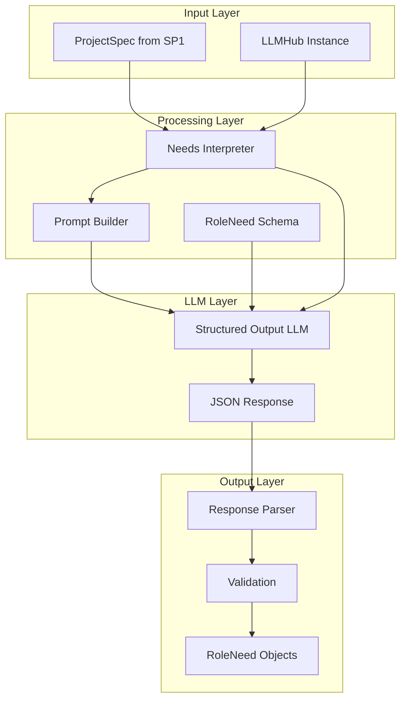
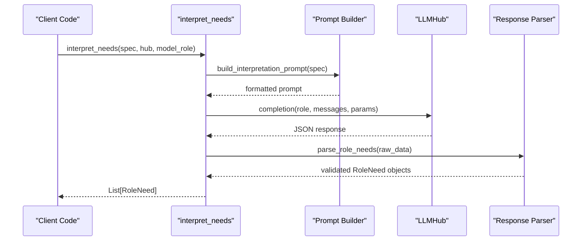
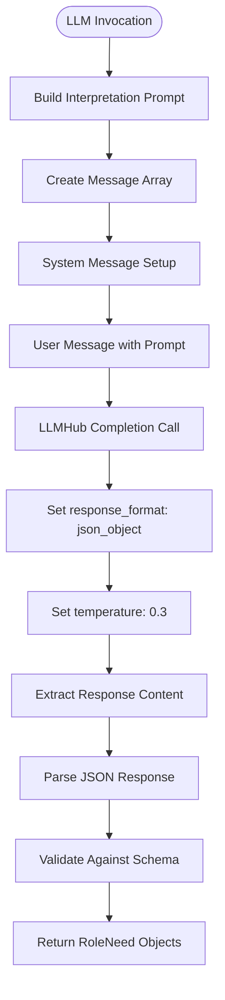
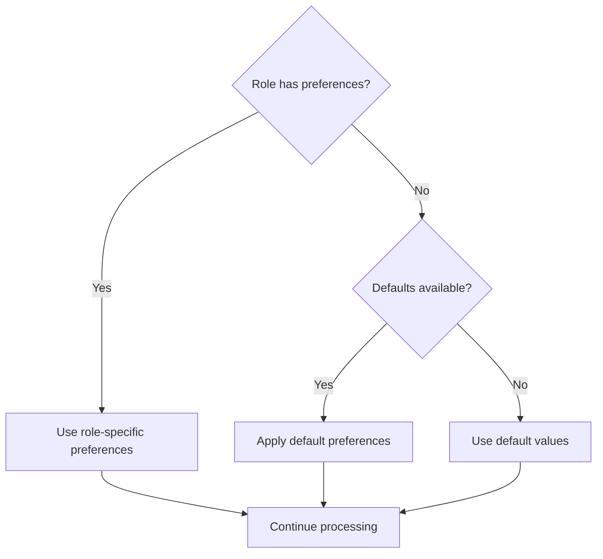
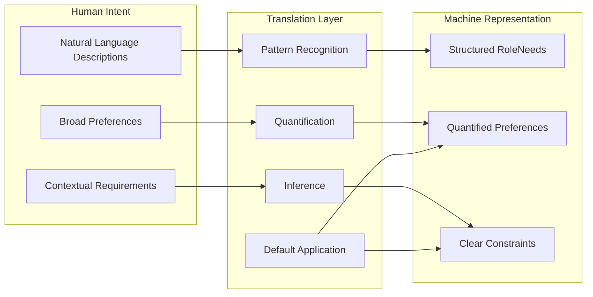

# SP2: Needs Interpreter

<cite>
**Referenced Files in This Document**
- [spec.md](file://packages/llmhub/src/llmhub/generator/sp2_needs_interpreter/spec.md)
- [prompt.py](file://packages/llmhub/src/llmhub/generator/sp2_needs_interpreter/prompt.py)
- [interpreter.py](file://packages/llmhub/src/llmhub/generator/sp2_needs_interpreter/interpreter.py)
- [errors.py](file://packages/llmhub/src/llmhub/generator/sp2_needs_interpreter/errors.py)
- [models.py](file://packages/llmhub/src/llmhub/generator/sp1_spec_schema/models.py)
- [models.py](file://packages/llmhub/src/llmhub/generator/sp3_needs_schema/models.py)
- [parser.py](file://packages/llmhub/src/llmhub/generator/sp3_needs_schema/parser.py)
- [__init__.py](file://packages/llmhub/src/llmhub/generator/__init__.py)
- [hub.py](file://packages/llmhub_runtime/src/llmhub_runtime/hub.py)
</cite>

## Table of Contents
1. [Introduction](#introduction)
2. [System Architecture](#system-architecture)
3. [Core Components](#core-components)
4. [Prompt Engineering Strategy](#prompt-engineering-strategy)
5. [LLM Invocation Pattern](#llm-invocation-pattern)
6. [Response Parsing and Validation](#response-parsing-and-validation)
7. [Domain-Specific Language Expectations](#domain-specific-language-expectations)
8. [Ambiguity Handling](#ambiguity-handling)
9. [Input-Output Examples](#input-output-examples)
10. [Reliability Considerations](#reliability-considerations)
11. [Performance Implications](#performance-implications)
12. [Human-Machine Bridge](#human-machine-bridge)
13. [Debugging and Troubleshooting](#debugging-and-troubleshooting)
14. [Conclusion](#conclusion)

## Introduction

SP2: Needs Interpreter serves as the critical bridge between human-readable project specifications and machine-processable role requirements. This component leverages Large Language Models (LLMs) to convert natural language role descriptions into structured `RoleNeed` objects, effectively translating human intent into computational form.

The interpreter operates as a single, focused step in the LLM Hub pipeline, making exactly one LLM call per project specification to produce canonical role needs. It transforms the unstructured, potentially ambiguous descriptions from SP1's ProjectSpec into well-defined, structured requirements that downstream components can reliably process.

## System Architecture

The SP2 system follows a clean separation of concerns pattern, integrating seamlessly with the broader LLM Hub ecosystem:



**Diagram sources**
- [interpreter.py](file://packages/llmhub/src/llmhub/generator/sp2_needs_interpreter/interpreter.py#L15-L92)
- [prompt.py](file://packages/llmhub/src/llmhub/generator/sp2_needs_interpreter/prompt.py#L37-L119)

**Section sources**
- [spec.md](file://packages/llmhub/src/llmhub/generator/sp2_needs_interpreter/spec.md#L1-L42)
- [__init__.py](file://packages/llmhub/src/llmhub/generator/__init__.py#L86-L87)

## Core Components

### Interpretation Engine

The core interpretation engine is implemented in [`interpret_needs`](file://packages/llmhub/src/llmhub/generator/sp2_needs_interpreter/interpreter.py#L15-L92) function, which orchestrates the entire conversion process:



**Diagram sources**
- [interpreter.py](file://packages/llmhub/src/llmhub/generator/sp2_needs_interpreter/interpreter.py#L15-L92)

### Error Management

The system implements robust error handling through the [`InterpreterError`](file://packages/llmhub/src/llmhub/generator/sp2_needs_interpreter/errors.py#L4-L6) exception class, ensuring graceful failure handling throughout the interpretation process.

**Section sources**
- [interpreter.py](file://packages/llmhub/src/llmhub/generator/sp2_needs_interpreter/interpreter.py#L1-L92)
- [errors.py](file://packages/llmhub/src/llmhub/generator/sp2_needs_interpreter/errors.py#L1-L7)

## Prompt Engineering Strategy

### Schema Definition

The prompt engineering strategy centers around a comprehensive JSON schema that defines the structure of `RoleNeed` objects. The [`ROLE_NEED_SCHEMA`](file://packages/llmhub/src/llmhub/generator/sp2_needs_interpreter/prompt.py#L9-L34) serves as the foundation for structured output:

Key schema elements include:
- **Task Characteristics**: `task_kind` classification (reasoning, creative, factual, chat, general)
- **Importance Levels**: `importance` quantification (low, medium, high, critical)
- **Selection Weights**: Numerical biases (0.0-1.0) for quality, cost, and latency
- **Capability Requirements**: Boolean flags for reasoning, tools, and structured output
- **Context Requirements**: Minimum context window estimates
- **Modalities**: Input/output modality support (text, image, audio)
- **Provider Constraints**: Allowlists, blocklists, and model restrictions

### Instruction Design

The prompt includes detailed instructions for LLM interpretation:

1. **Role Analysis**: For each role, determine task characteristics and requirements
2. **Preference Quantification**: Convert qualitative preferences to numeric biases
3. **Boolean Inference**: Infer capability requirements from descriptions
4. **Context Estimation**: Estimate minimum context windows for large inputs
5. **Default Application**: Apply default preferences where role-specific preferences are missing
6. **Importance Assignment**: Set importance based on role description context

### Template Construction

The [`build_interpretation_prompt`](file://packages/llmhub/src/llmhub/generator/sp2_needs_interpreter/prompt.py#L37-L119) function constructs comprehensive prompts by:

- Extracting role-specific details from ProjectSpec
- Incorporating default preferences when available
- Formatting structured instructions for LLM consumption
- Maintaining clear separation between different specification sections

**Section sources**
- [prompt.py](file://packages/llmhub/src/llmhub/generator/sp2_needs_interpreter/prompt.py#L1-L119)

## LLM Invocation Pattern

### Structured Output Configuration

The LLM invocation follows a standardized pattern optimized for structured JSON output:



**Diagram sources**
- [interpreter.py](file://packages/llmhub/src/llmhub/generator/sp2_needs_interpreter/interpreter.py#L35-L68)

### Parameter Configuration

The system uses specific parameters optimized for reliability:

- **Temperature**: 0.3 for deterministic, focused responses
- **Response Format**: JSON object to ensure structured output
- **System Role**: Expert interpreter persona for consistent behavior

### Message Structure

The message array follows a standard format:
- **System Message**: Establishes expert interpreter persona
- **User Message**: Contains the constructed interpretation prompt

**Section sources**
- [interpreter.py](file://packages/llmhub/src/llmhub/generator/sp2_needs_interpreter/interpreter.py#L35-L68)

## Response Parsing and Validation

### JSON Extraction Strategy

The response parsing implements robust extraction logic to handle various response formats:

```mermaid
flowchart TD
RECEIVE_RESPONSE[Receive LLM Response] --> CHECK_CHOICES{Has choices?}
CHECK_CHOICES --> |Yes| EXTRACT_CONTENT[Extract content from choices[0]]
CHECK_CHOICES --> |No| CHECK_DICT{Is dictionary?}
CHECK_DICT --> |Yes| EXTRACT_DICT[Extract from dict structure]
CHECK_DICT --> |No| CONVERT_STRING[Convert to string]
EXTRACT_CONTENT --> PARSE_JSON[Parse JSON]
EXTRACT_DICT --> PARSE_JSON
CONVERT_STRING --> PARSE_JSON
PARSE_JSON --> HANDLE_ERROR{JSON Parse Error?}
HANDLE_ERROR --> |Yes| RAISE_INTERPRETER_ERROR[Raise InterpreterError]
HANDLE_ERROR --> |No| EXTRACT_ROLES[Extract roles array]
EXTRACT_ROLES --> VALIDATE_FORMAT{Valid format?}
VALIDATE_FORMAT --> |Yes| PARSE_ROLE_NEEDS[Parse RoleNeed objects]
VALIDATE_FORMAT --> |No| RAISE_FORMAT_ERROR[Raise InterpreterError]
PARSE_ROLE_NEEDS --> SUCCESS[Return RoleNeeds]
```

**Diagram sources**
- [interpreter.py](file://packages/llmhub/src/llmhub/generator/sp2_needs_interpreter/interpreter.py#L61-L84)

### Schema Validation

The [`parse_role_needs`](file://packages/llmhub/src/llmhub/generator/sp3_needs_schema/parser.py#L11-L42) function provides comprehensive validation:

- **Type Checking**: Ensures input is a list of dictionaries
- **Individual Validation**: Validates each RoleNeed against the schema
- **Error Aggregation**: Collects all validation errors for comprehensive feedback
- **Graceful Degradation**: Continues processing despite individual failures

**Section sources**
- [interpreter.py](file://packages/llmhub/src/llmhub/generator/sp2_needs_interpreter/interpreter.py#L61-L84)
- [parser.py](file://packages/llmhub/src/llmhub/generator/sp3_needs_schema/parser.py#L1-L42)

## Domain-Specific Language Expectations

### Natural Language Patterns

The interpreter expects users to provide role descriptions using specific linguistic patterns:

#### Task Type Indicators
- **Reasoning Tasks**: "analyze", "evaluate", "reason", "think critically", "solve problems"
- **Creative Tasks**: "generate", "create", "design", "compose", "imagine"
- **Factual Tasks**: "answer", "provide", "summarize", "extract", "lookup"
- **Conversational Tasks**: "chat", "respond", "dialogue", "conversation"

#### Preference Expressions
- **Quality**: "high-quality", "accurate", "precise", "detailed", "professional"
- **Cost**: "budget-friendly", "efficient", "cost-effective", "minimal resources"
- **Latency**: "fast response", "quick", "real-time", "immediate", "responsive"

#### Capability Requirements
- **Reasoning**: "step-by-step", "chain of thought", "analytical", "logical"
- **Tools**: "use external APIs", "call functions", "access databases", "interact with systems"
- **Structured Output**: "JSON format", "structured response", "formatted output"

### Specification Structure

Users are expected to structure their specifications with clear role definitions:

```yaml
project: "Example Project"
env: "production"
roles:
  analyst:
    kind: "chat"
    description: "Provide analytical insights with step-by-step reasoning"
    preferences:
      quality: "high"
      latency: "medium"
  creator:
    kind: "creative"
    description: "Generate creative content using various media types"
    preferences:
      quality: "medium"
      cost: "low"
```

**Section sources**
- [prompt.py](file://packages/llmhub/src/llmhub/generator/sp2_needs_interpreter/prompt.py#L102-L115)

## Ambiguity Handling

### Preference Quantification

The system handles preference ambiguity through explicit quantification rules:

| Qualitative Level | Numeric Range | Description |
|-------------------|---------------|-------------|
| Low | 0.2-0.4 | Minimal emphasis on the attribute |
| Medium | 0.4-0.6 | Balanced consideration of the attribute |
| High | 0.6-0.8 | Strong emphasis on the attribute |

### Default Application Strategy

When role-specific preferences are absent, the system applies default preferences:



**Diagram sources**
- [prompt.py](file://packages/llmhub/src/llmhub/generator/sp2_needs_interpreter/prompt.py#L80-L91)

### Importance Assignment Heuristics

The system assigns importance based on contextual cues:

- **Critical**: Production environments, financial applications, safety-critical systems
- **High**: Important business functions, customer-facing services
- **Medium**: Standard operational tasks, internal tools
- **Low**: Testing, development, auxiliary functions

**Section sources**
- [prompt.py](file://packages/llmhub/src/llmhub/generator/sp2_needs_interpreter/prompt.py#L102-L115)

## Input-Output Examples

### Example 1: Basic Chat Role

**Input Spec:**
```yaml
project: "Customer Support Bot"
env: "production"
roles:
  support_agent:
    kind: "chat"
    description: "Provide customer support with empathy and accuracy"
    preferences:
      quality: "high"
      latency: "medium"
```

**Canonical Output:**
```json
{
  "roles": [
    {
      "id": "support_agent",
      "task_kind": "chat",
      "importance": "high",
      "quality_bias": 0.8,
      "cost_bias": 0.5,
      "latency_sensitivity": 0.6,
      "reasoning_required": false,
      "tools_required": false,
      "structured_output_required": false,
      "context_min": null,
      "modalities_in": ["text"],
      "modalities_out": ["text"],
      "provider_allowlist": null,
      "provider_blocklist": null,
      "model_denylist": null,
      "reasoning_tier_pref": null,
      "creative_tier_pref": null,
      "notes": "Support agent requires high quality for customer satisfaction"
    }
  ]
}
```

### Example 2: Reasoning Task with Tools

**Input Spec:**
```yaml
project: "Financial Analysis Platform"
env: "production"
roles:
  analyst:
    kind: "reasoning"
    description: "Perform complex financial analysis using external data sources"
    preferences:
      quality: "high"
      cost: "medium"
```

**Canonical Output:**
```json
{
  "roles": [
    {
      "id": "analyst",
      "task_kind": "reasoning",
      "importance": "critical",
      "quality_bias": 0.8,
      "cost_bias": 0.5,
      "latency_sensitivity": 0.4,
      "reasoning_required": true,
      "tools_required": true,
      "structured_output_required": true,
      "context_min": 4096,
      "modalities_in": ["text"],
      "modalities_out": ["text"],
      "provider_allowlist": null,
      "provider_blocklist": null,
      "model_denylist": null,
      "reasoning_tier_pref": 1,
      "creative_tier_pref": null,
      "notes": "Requires reasoning capabilities and external data access"
    }
  ]
}
```

### Example 3: Creative Content Generation

**Input Spec:**
```yaml
project: "Content Creation Platform"
env: "development"
roles:
  writer:
    kind: "creative"
    description: "Generate engaging blog posts and marketing content"
    preferences:
      quality: "medium"
      cost: "low"
```

**Canonical Output:**
```json
{
  "roles": [
    {
      "id": "writer",
      "task_kind": "creative",
      "importance": "high",
      "quality_bias": 0.6,
      "cost_bias": 0.3,
      "latency_sensitivity": 0.5,
      "reasoning_required": false,
      "tools_required": false,
      "structured_output_required": false,
      "context_min": null,
      "modalities_in": ["text"],
      "modalities_out": ["text"],
      "provider_allowlist": null,
      "provider_blocklist": null,
      "model_denylist": null,
      "reasoning_tier_pref": null,
      "creative_tier_pref": 1,
      "notes": "Creative writing with moderate quality requirements"
    }
  ]
}
```

## Reliability Considerations

### Single LLM Call Guarantee

The system maintains reliability through the invariant of exactly one LLM call per project, ensuring predictable resource usage and consistent interpretation patterns.

### Error Recovery Strategies

The interpreter implements multiple layers of error recovery:

1. **JSON Parsing Recovery**: Graceful handling of malformed JSON responses
2. **Schema Validation**: Comprehensive validation with detailed error reporting
3. **Fallback Values**: Default values for missing or invalid fields
4. **Exception Propagation**: Clear error reporting for debugging

### Trust Model

The system operates under a trust model where LLM output is trusted for schema compliance, focusing validation efforts on downstream processing rather than interpretation correctness.

**Section sources**
- [spec.md](file://packages/llmhub/src/llmhub/generator/sp2_needs_interpreter/spec.md#L33-L42)

## Performance Implications

### LLM Call Optimization

The performance characteristics of SP2 include:

- **Single Call Efficiency**: Minimizes LLM costs and latency
- **Structured Output Benefits**: Reduces parsing overhead and improves reliability
- **Parameter Tuning**: Temperature set to 0.3 for optimal balance of creativity and consistency

### Memory and Processing Considerations

- **Prompt Size Management**: Efficient prompt construction avoids unnecessary token waste
- **Response Processing**: Streaming or batch processing capabilities depend on LLMHub implementation
- **Validation Overhead**: Minimal validation overhead due to Pydantic schema enforcement

### Scalability Factors

- **Concurrent Processing**: Independent interpretation of different projects
- **Caching Opportunities**: Potential for caching interpretation patterns
- **Batch Processing**: Future enhancements could support batch interpretation

**Section sources**
- [interpreter.py](file://packages/llmhub/src/llmhub/generator/sp2_needs_interpreter/interpreter.py#L56-L58)

## Human-Machine Bridge

### Translation Mechanism

SP2 serves as the primary translation mechanism between human intent and machine processing:



**Diagram sources**
- [prompt.py](file://packages/llmhub/src/llmhub/generator/sp2_needs_interpreter/prompt.py#L102-L115)

### Consistency Guarantees

The system ensures consistency through:

- **Standardized Prompts**: Reproducible interpretation patterns
- **Schema Enforcement**: Uniform data structure across all interpretations
- **Validation Rules**: Consistent validation across all role needs

### Adaptability Features

The interpreter adapts to varying user sophistication:

- **Simple Specifications**: Basic descriptions yield reasonable defaults
- **Advanced Specifications**: Detailed preferences are accurately captured
- **Iterative Refinement**: Subsequent runs improve interpretation quality

**Section sources**
- [spec.md](file://packages/llmhub/src/llmhub/generator/sp2_needs_interpreter/spec.md#L5-L6)

## Debugging and Troubleshooting

### Common Issues and Solutions

#### Issue: Invalid JSON Response
**Symptoms**: `InterpreterError` with JSON decode error
**Causes**: 
- LLM produced malformed JSON
- Response format not properly structured
- Network or API issues

**Solutions**:
- Increase LLM temperature slightly for more conservative output
- Verify LLM model supports structured output
- Check network connectivity and API limits

#### Issue: Missing Role Information
**Symptoms**: Empty or incomplete role arrays
**Causes**:
- Insufficient role descriptions in input
- Ambiguous role specifications
- LLM misunderstanding requirements

**Solutions**:
- Provide more detailed role descriptions
- Include specific preference statements
- Review prompt template for clarity

#### Issue: Incorrect Preference Quantification
**Symptoms**: Unexpected bias values or importance levels
**Causes**:
- Ambiguous preference language
- Lack of contextual cues
- Inconsistent user expectations

**Solutions**:
- Use explicit preference language
- Provide examples of desired quantifications
- Review default application logic

### Debugging Strategies

#### Enable Logging
Monitor LLM calls and responses for pattern identification:

```python
# Example debugging setup
hub = LLMHub(config_path="llmhub.yaml")

def debug_callback(context):
    print(f"LLM Call: {context['role']}")
    print(f"Messages: {len(context['messages'])}")
    print(f"Parameters: {context['params']}")

hub.on_before_call = debug_callback
```

#### Validate Intermediate Results
Check prompt construction and response parsing:

```python
# Debug prompt construction
prompt = build_interpretation_prompt(spec)
print("Generated Prompt:")
print(prompt)

# Debug response parsing
response = hub.completion(role="llm.generator", messages=[{"role": "user", "content": prompt}])
print("Raw Response:", response)
```

#### Test with Known Examples
Validate interpretation with well-understood scenarios:

```python
# Test basic role types
test_specs = [
    {"description": "Simple chat assistant", "expected_task": "chat"},
    {"description": "Complex problem solver", "expected_task": "reasoning"},
    {"description": "Creative content generator", "expected_task": "creative"}
]
```

### Monitoring and Observability

Implement monitoring for:
- **Success Rates**: Track interpretation success across different spec types
- **Response Quality**: Monitor JSON validity and schema compliance
- **Performance Metrics**: Measure LLM call latency and throughput
- **Error Patterns**: Identify common failure modes and improvement areas

**Section sources**
- [interpreter.py](file://packages/llmhub/src/llmhub/generator/sp2_needs_interpreter/interpreter.py#L88-L92)
- [hub.py](file://packages/llmhub_runtime/src/llmhub_runtime/hub.py#L114-L125)

## Conclusion

SP2: Needs Interpreter represents a sophisticated approach to bridging human intent with machine processing in the LLM Hub ecosystem. Through carefully engineered prompt strategies, robust error handling, and comprehensive validation, it transforms natural language role descriptions into structured, actionable requirements.

The system's strength lies in its balance of flexibility and reliability—providing users with the freedom to express requirements naturally while delivering consistent, machine-processable outputs. The single LLM call guarantee ensures predictability, while the structured output approach maximizes reliability and minimizes processing overhead.

Future enhancements could include iterative refinement capabilities, pattern recognition for improved consistency, and expanded support for multimodal specifications. The modular design ensures that such improvements can be integrated without disrupting the core interpretation functionality.

Through careful attention to prompt engineering, response parsing, and error handling, SP2 establishes a solid foundation for the LLM Hub pipeline, enabling reliable translation of complex human requirements into computational form.