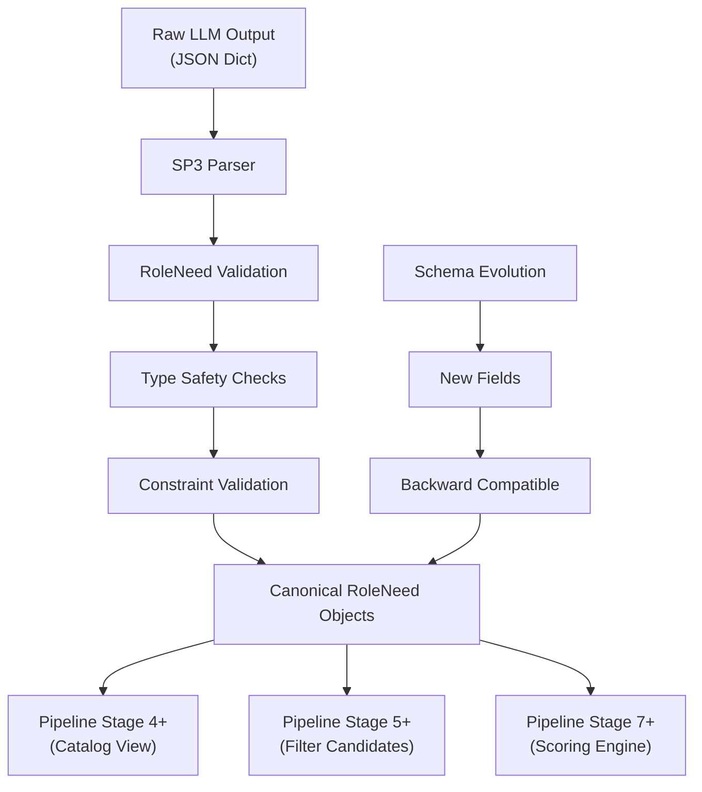
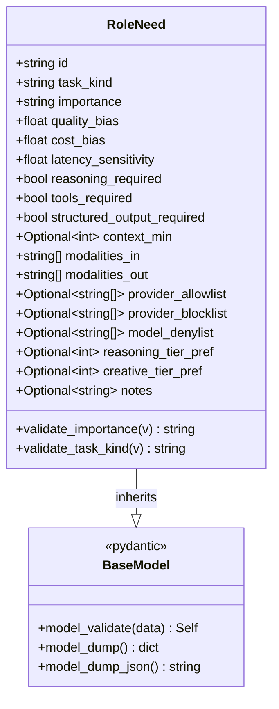
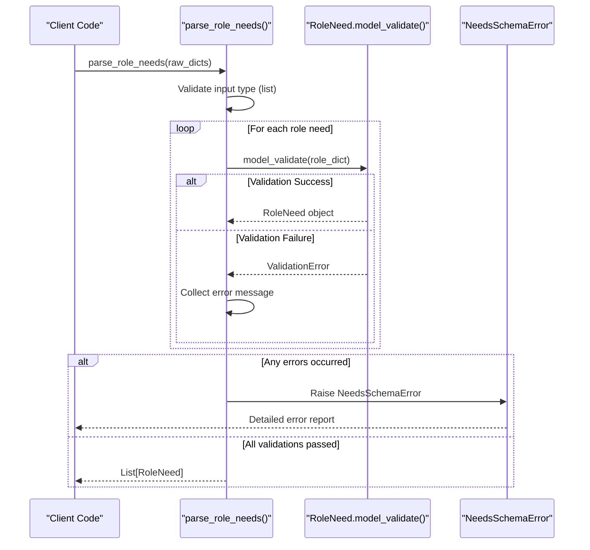
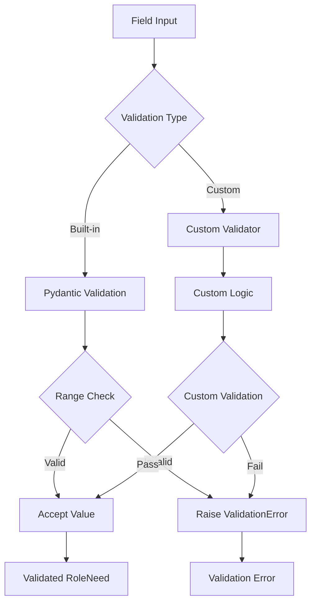
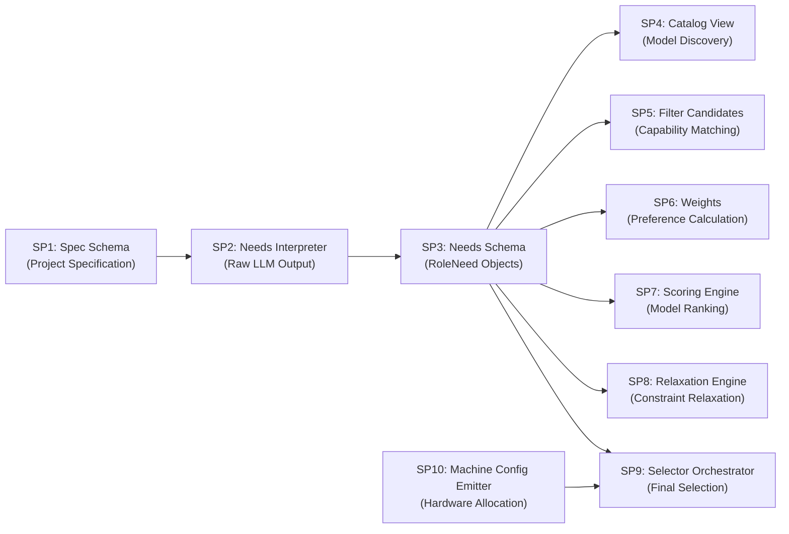

# SP3: Needs Schema

<cite>
**Referenced Files in This Document**
- [models.py](file://packages/llmhub/src/llmhub/generator/sp3_needs_schema/models.py)
- [spec.md](file://packages/llmhub/src/llmhub/generator/sp3_needs_schema/spec.md)
- [parser.py](file://packages/llmhub/src/llmhub/generator/sp3_needs_schema/parser.py)
- [errors.py](file://packages/llmhub/src/llmhub/generator/sp3_needs_schema/errors.py)
- [__init__.py](file://packages/llmhub/src/llmhub/generator/sp3_needs_schema/__init__.py)
- [test_sp3_needs_schema.py](file://packages/llmhub/tests/generator/test_sp3_needs_schema.py)
- [interpreter.py](file://packages/llmhub/src/llmhub/generator/sp2_needs_interpreter/interpreter.py)
- [test_generate_e2e.py](file://packages/llmhub/tests/generator/test_generate_e2e.py)
</cite>

## Table of Contents
1. [Introduction](#introduction)
2. [Schema Design Philosophy](#schema-design-philosophy)
3. [Core Data Model](#core-data-model)
4. [Field Categories and Validation](#field-categories-and-validation)
5. [Parser Implementation](#parser-implementation)
6. [Type Safety and Validation](#type-safety-and-validation)
7. [Extensibility Patterns](#extensibility-patterns)
8. [Usage Examples](#usage-examples)
9. [Integration with Pipeline](#integration-with-pipeline)
10. [Best Practices](#best-practices)
11. [Troubleshooting](#troubleshooting)

## Introduction

SP3: Needs Schema defines the canonical `RoleNeed` data model that serves as the standardized representation of role requirements throughout the LLM Hub selector pipeline. This schema transforms raw LLM interpretations into structured, validated role specifications that enable consistent processing across subsequent pipeline stages.

The `RoleNeed` model acts as a bridge between natural language role descriptions processed by SP2 (Needs Interpreter) and the structured requirements needed for model selection, filtering, and scoring in later stages. It provides a comprehensive specification of role capabilities, preferences, and constraints in a format that ensures type safety, validation, and forward compatibility.

## Schema Design Philosophy

The SP3 Needs Schema follows several key design principles that ensure robustness and flexibility:

### Canonical Representation
The schema establishes a single, authoritative format for expressing role requirements, eliminating ambiguity and ensuring consistent interpretation across the pipeline.

### Forward Compatibility
New fields can be added to the schema without breaking existing code, allowing the system to evolve while maintaining backward compatibility.

### Comprehensive Coverage
The schema captures all essential aspects of role requirements, from basic identification to sophisticated capability constraints and preferences.

### Validation-First Approach
All data undergoes strict validation during parsing, preventing invalid configurations from propagating through the pipeline.



**Diagram sources**
- [parser.py](file://packages/llmhub/src/llmhub/generator/sp3_needs_schema/parser.py#L11-L41)
- [models.py](file://packages/llmhub/src/llmhub/generator/sp3_needs_schema/models.py#L10-L131)

## Core Data Model

The `RoleNeed` class serves as the central data structure, inheriting from Pydantic's `BaseModel` to provide automatic validation and serialization capabilities.

### Class Structure



**Diagram sources**
- [models.py](file://packages/llmhub/src/llmhub/generator/sp3_needs_schema/models.py#L10-L131)

### Identity and Classification Fields

The schema begins with fundamental identity and classification information:

- **id**: Unique identifier for the role requirement
- **task_kind**: Type of computational task (reasoning, creative, factual, chat, etc.)
- **importance**: Importance level of the role (low, medium, high, critical)

**Section sources**
- [models.py](file://packages/llmhub/src/llmhub/generator/sp3_needs_schema/models.py#L20-L30)

## Field Categories and Validation

The `RoleNeed` schema organizes fields into logical categories, each serving specific purposes in the role specification process.

### Selection Weights (0.0-1.0 Range)

Selection weights determine the relative importance of different quality factors:

| Field | Description | Default | Validation |
|-------|-------------|---------|------------|
| `quality_bias` | Bias towards quality (0.0=ignore, 1.0=maximize) | 0.5 | Must be in [0.0, 1.0] |
| `cost_bias` | Bias towards cost (0.0=ignore, 1.0=minimize cost) | 0.5 | Must be in [0.0, 1.0] |
| `latency_sensitivity` | Sensitivity to latency (0.0=ignore, 1.0=minimize latency) | 0.5 | Must be in [0.0, 1.0] |

### Capability Constraints

Hard constraints that define essential capabilities required for the role:

| Field | Description | Default |
|-------|-------------|---------|
| `reasoning_required` | Whether chain-of-thought reasoning is required | False |
| `tools_required` | Whether tool/function calling is required | False |
| `structured_output_required` | Whether structured JSON output is required | False |

### Context and Modalities

Fields specifying context requirements and supported input/output modalities:

| Field | Description | Default |
|-------|-------------|---------|
| `context_min` | Minimum context window size in tokens | None |
| `modalities_in` | Required input modalities (text, image, audio, etc.) | ["text"] |
| `modalities_out` | Required output modalities (text, image, audio, etc.) | ["text"] |

### Provider Constraints

Flexible filtering mechanisms for controlling model availability:

| Field | Description | Default |
|-------|-------------|---------|
| `provider_allowlist` | Allowed providers (None = all allowed) | None |
| `provider_blocklist` | Blocked providers | None |
| `model_denylist` | Specific models to exclude | None |

### Tier Preferences (1-5 Range)

Quality tier preferences for different capability domains:

| Field | Description | Default | Validation |
|-------|-------------|---------|------------|
| `reasoning_tier_pref` | Preferred reasoning tier (1=best, 5=worst) | None | Must be in [1, 5] |
| `creative_tier_pref` | Preferred creative tier (1=best, 5=worst) | None | Must be in [1, 5] |

**Section sources**
- [models.py](file://packages/llmhub/src/llmhub/generator/sp3_needs_schema/models.py#L33-L108)

## Parser Implementation

The parser provides a robust interface for converting raw dictionary data into validated `RoleNeed` objects.

### Parsing Workflow



**Diagram sources**
- [parser.py](file://packages/llmhub/src/llmhub/generator/sp3_needs_schema/parser.py#L11-L41)

### Error Handling Strategy

The parser implements comprehensive error handling that provides detailed feedback about validation failures:

- **Type Validation**: Ensures input is a list of dictionaries
- **Individual Item Validation**: Validates each role need independently
- **Error Aggregation**: Collects all validation errors before reporting
- **Descriptive Messages**: Provides clear error messages for each failed role

**Section sources**
- [parser.py](file://packages/llmhub/src/llmhub/generator/sp3_needs_schema/parser.py#L11-L41)

## Type Safety and Validation

The schema leverages Pydantic's powerful validation system to ensure data integrity and type safety.

### Automatic Type Conversion

Pydantic automatically handles type conversion for primitive types:

- **Strings**: Automatic validation and normalization
- **Numbers**: Type checking with range validation
- **Booleans**: Strict boolean validation
- **Lists**: Type checking for list contents
- **Optional Fields**: Proper handling of nullable values

### Custom Validation Logic

The schema includes custom validators for complex validation scenarios:



**Diagram sources**
- [models.py](file://packages/llmhub/src/llmhub/generator/sp3_needs_schema/models.py#L116-L130)

### Validation Rules

The schema implements several validation rules:

1. **Importance Level Validation**: Restricts to predefined levels (low, medium, high, critical)
2. **Task Kind Normalization**: Converts to lowercase for consistency
3. **Range Validation**: Ensures numeric fields fall within acceptable ranges
4. **Type Validation**: Verifies field types match expectations

**Section sources**
- [models.py](file://packages/llmhub/src/llmhub/generator/sp3_needs_schema/models.py#L116-L130)

## Extensibility Patterns

The schema is designed with extensibility in mind, allowing for future enhancements while maintaining backward compatibility.

### Forward Compatibility Mechanisms

1. **Extra Fields Support**: The `model_config = ConfigDict(extra="allow")` setting allows unknown fields to be preserved
2. **Optional Fields**: All additional fields are marked as Optional, enabling gradual adoption
3. **Default Values**: New fields receive sensible defaults to prevent breaking existing code

### Extension Guidelines

When extending the schema:

1. **Add Optional Fields**: New fields should be optional to maintain backward compatibility
2. **Provide Defaults**: Include reasonable default values for new optional fields
3. **Document Changes**: Update documentation to reflect new capabilities
4. **Maintain Validation**: Implement appropriate validation for new fields

### Versioning Strategy

The schema follows semantic versioning principles:

- **Major Changes**: Breaking changes that require migration
- **Minor Changes**: New optional fields that don't break existing code
- **Patch Changes**: Bug fixes and internal improvements

**Section sources**
- [models.py](file://packages/llmhub/src/llmhub/generator/sp3_needs_schema/models.py#L17)

## Usage Examples

The following examples demonstrate various ways to use the `RoleNeed` schema in practice.

### Minimal Role Specification

```python
# Basic role with essential fields only
minimal_need = RoleNeed(id="researcher")
```

### Full-Featured Role Specification

```python
# Comprehensive role with all capabilities and preferences
full_need = RoleNeed(
    id="analyst",
    task_kind="reasoning",
    importance="high",
    quality_bias=0.8,
    cost_bias=0.3,
    latency_sensitivity=0.6,
    reasoning_required=True,
    tools_required=False,
    structured_output_required=True,
    context_min=100000,
    modalities_in=["text"],
    modalities_out=["text"],
    provider_allowlist=["openai", "anthropic"],
    provider_blocklist=["google"],
    model_denylist=["gpt-3.5"],
    reasoning_tier_pref=1,
    creative_tier_pref=3,
    notes="High quality reasoning required for financial analysis"
)
```

### Parsing Raw Data

```python
# Convert raw JSON data to validated RoleNeed objects
raw_data = [
    {
        "id": "writer",
        "task_kind": "creative",
        "importance": "medium"
    },
    {
        "id": "coder",
        "task_kind": "reasoning",
        "importance": "high",
        "quality_bias": 0.9
    }
]

needs = parse_role_needs(raw_data)
```

### Serialization and Deserialization

```python
# Convert RoleNeed to JSON
need_json = need.model_dump_json()

# Parse JSON back to RoleNeed
need_from_json = RoleNeed.model_validate_json(need_json)
```

**Section sources**
- [test_sp3_needs_schema.py](file://packages/llmhub/tests/generator/test_sp3_needs_schema.py#L10-L50)

## Integration with Pipeline

The SP3 Needs Schema integrates seamlessly with the broader LLM Hub pipeline, serving as a critical intermediate stage.

### Pipeline Flow



**Diagram sources**
- [interpreter.py](file://packages/llmhub/src/llmhub/generator/sp2_needs_interpreter/interpreter.py#L83-L85)

### Inter-Stage Communication

Each pipeline stage receives `RoleNeed` objects as input, ensuring consistent data format and reducing integration complexity:

- **SP4 (Catalog View)**: Uses role specifications to discover available models
- **SP5 (Filter Candidates)**: Applies capability constraints to filter candidates
- **SP6 (Weights)**: Calculates preference weights based on role requirements
- **SP7 (Scoring Engine)**: Scores models against role specifications
- **SP8 (Relaxation Engine)**: Relaxes constraints when necessary
- **SP9 (Selector Orchestrator)**: Makes final model selection decisions

**Section sources**
- [interpreter.py](file://packages/llmhub/src/llmhub/generator/sp2_needs_interpreter/interpreter.py#L83-L85)

## Best Practices

### Schema Usage Guidelines

1. **Always Validate Input**: Use the parser function to ensure data integrity
2. **Provide Meaningful IDs**: Use descriptive, unique identifiers for roles
3. **Set Appropriate Defaults**: Configure bias values based on use case requirements
4. **Document Role Specifications**: Include notes for complex requirements
5. **Test with Edge Cases**: Validate behavior with boundary conditions

### Performance Considerations

1. **Batch Processing**: Process multiple role needs together for better performance
2. **Lazy Loading**: Load role specifications only when needed
3. **Caching**: Cache frequently accessed role definitions
4. **Memory Management**: Monitor memory usage with large role datasets

### Error Handling

1. **Graceful Degradation**: Handle validation failures gracefully
2. **Detailed Logging**: Log validation errors for debugging
3. **User-Friendly Messages**: Provide clear error messages to users
4. **Retry Logic**: Implement retry mechanisms for transient failures

## Troubleshooting

### Common Issues and Solutions

#### Validation Failures

**Problem**: Role needs fail validation with cryptic error messages
**Solution**: Check field types and ranges, ensure required fields are present

#### Missing Dependencies

**Problem**: Import errors when using RoleNeed
**Solution**: Verify installation of required dependencies (pydantic)

#### Performance Issues

**Problem**: Slow parsing with large datasets
**Solution**: Consider batch processing or parallel validation

#### Serialization Problems

**Problem**: JSON serialization/deserialization issues
**Solution**: Use the built-in model_dump() and model_validate() methods

### Debugging Strategies

1. **Enable Detailed Logging**: Add logging around validation calls
2. **Test with Minimal Examples**: Isolate issues with simple role specifications
3. **Validate Individual Fields**: Test field validation separately
4. **Check Type Annotations**: Ensure proper type hints are used

**Section sources**
- [errors.py](file://packages/llmhub/src/llmhub/generator/sp3_needs_schema/errors.py#L4-L6)
- [parser.py](file://packages/llmhub/src/llmhub/generator/sp3_needs_schema/parser.py#L35-L40)