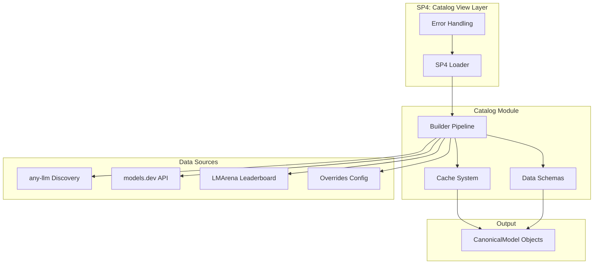
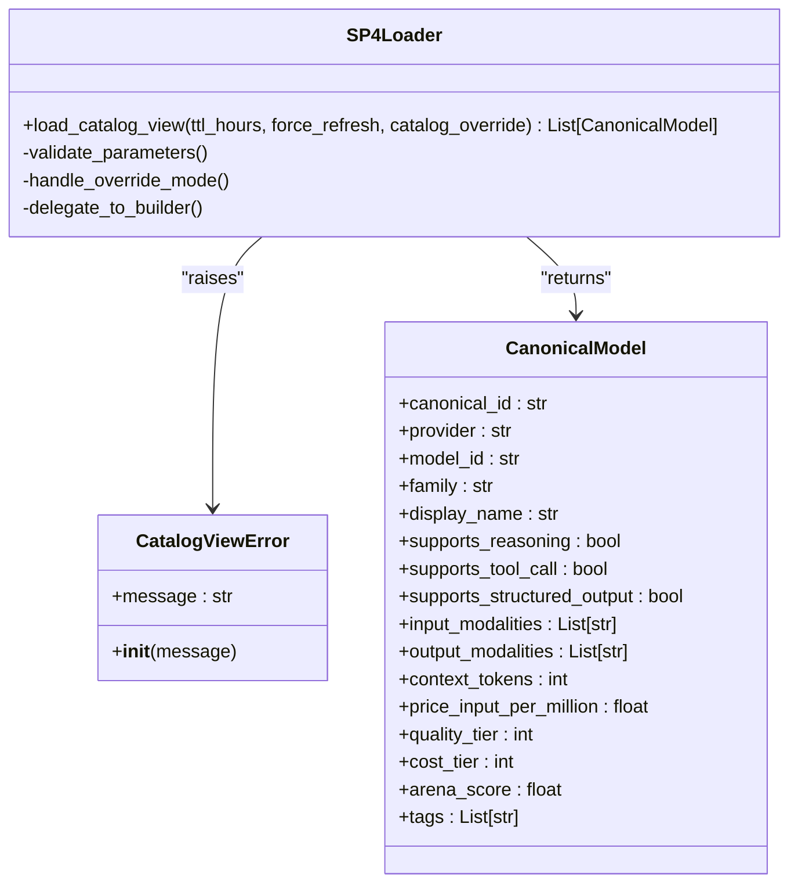
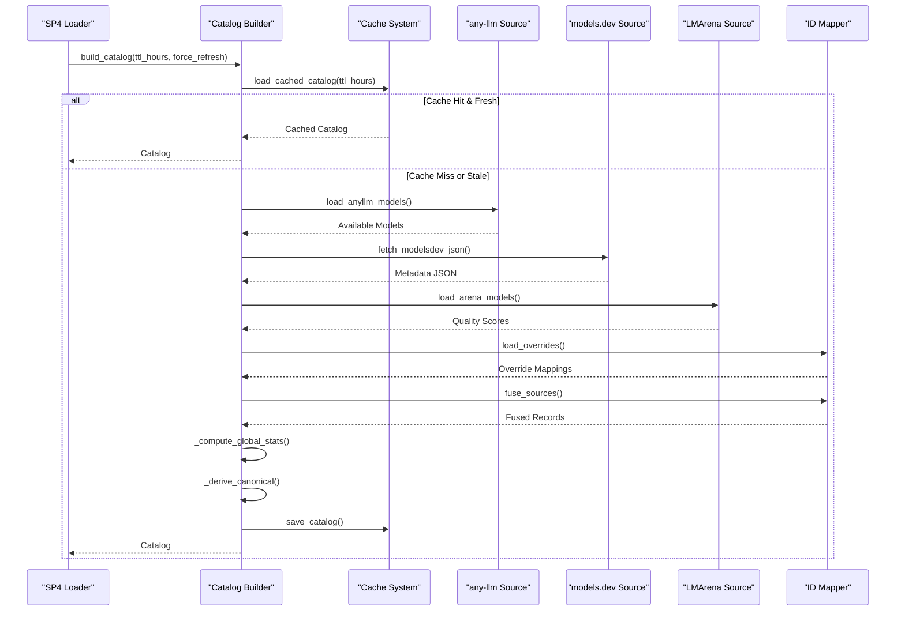
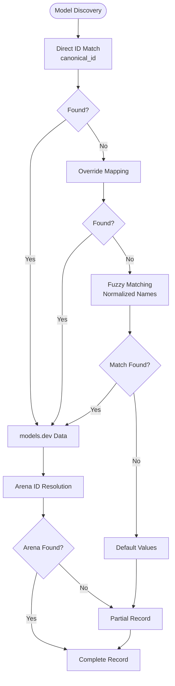
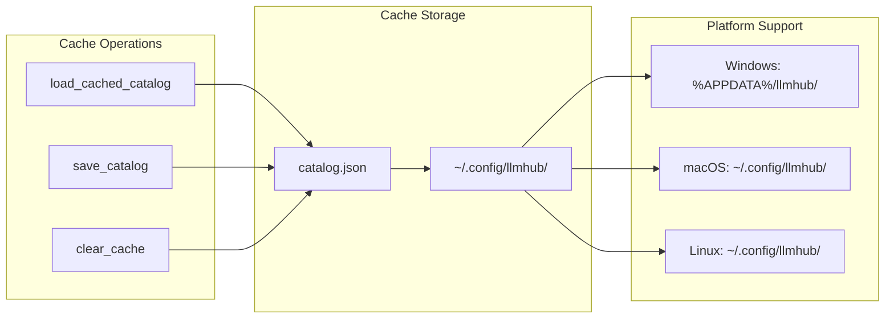
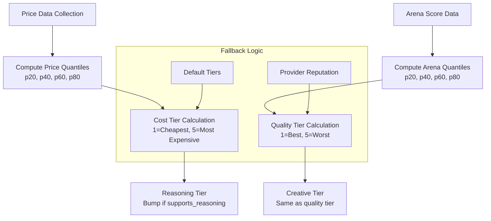
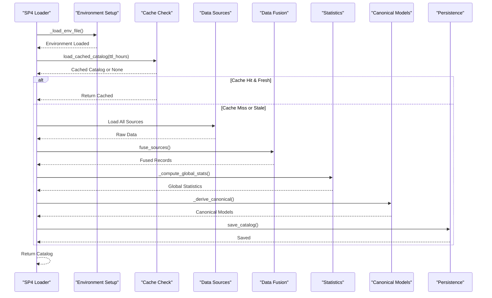
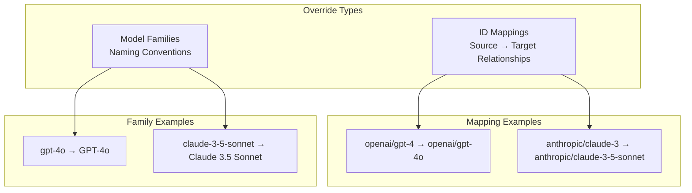
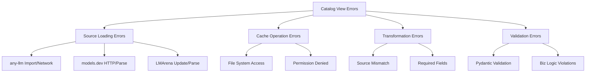

# SP4: Catalog View

<cite>
**Referenced Files in This Document**
- [packages/llmhub/src/llmhub/catalog/__init__.py](file://packages/llmhub/src/llmhub/catalog/__init__.py)
- [packages/llmhub/src/llmhub/catalog/builder.py](file://packages/llmhub/src/llmhub/catalog/builder.py)
- [packages/llmhub/src/llmhub/catalog/cache.py](file://packages/llmhub/src/llmhub/catalog/cache.py)
- [packages/llmhub/src/llmhub/catalog/schema.py](file://packages/llmhub/src/llmhub/catalog/schema.py)
- [packages/llmhub/src/llmhub/catalog/mapper.py](file://packages/llmhub/src/llmhub/catalog/mapper.py)
- [packages/llmhub/src/llmhub/catalog/anyllm_source.py](file://packages/llmhub/src/llmhub/catalog/anyllm_source.py)
- [packages/llmhub/src/llmhub/catalog/modelsdev_source.py](file://packages/llmhub/src/llmhub/catalog/modelsdev_source.py)
- [packages/llmhub/src/llmhub/catalog/arena_source.py](file://packages/llmhub/src/llmhub/catalog/arena_source.py)
- [packages/llmhub/src/llmhub/catalog/data/overrides.json](file://packages/llmhub/src/llmhub/catalog/data/overrides.json)
- [packages/llmhub/src/llmhub/generator/sp4_catalog_view/loader.py](file://packages/llmhub/src/llmhub/generator/sp4_catalog_view/loader.py)
- [packages/llmhub/src/llmhub/generator/sp4_catalog_view/spec.md](file://packages/llmhub/src/llmhub/generator/sp4_catalog_view/spec.md)
- [packages/llmhub/src/llmhub/generator/sp4_catalog_view/errors.py](file://packages/llmhub/src/llmhub/generator/sp4_catalog_view/errors.py)
- [packages/llmhub/src/llmhub/catalog/vendor/arena/update_leaderboard_data.py](file://packages/llmhub/src/llmhub/catalog/vendor/arena/update_leaderboard_data.py)
</cite>

## Table of Contents
1. [Introduction](#introduction)
2. [System Architecture](#system-architecture)
3. [Core Components](#core-components)
4. [Data Fusion Process](#data-fusion-process)
5. [Caching Mechanism](#caching-mechanism)
6. [Format Transformation](#format-transformation)
7. [Catalog Loading Pipeline](#catalog-loading-pipeline)
8. [Performance Considerations](#performance-considerations)
9. [Catalog Overrides](#catalog-overrides)
10. [Error Handling](#error-handling)
11. [Usage Examples](#usage-examples)
12. [Troubleshooting](#troubleshooting)

## Introduction

SP4: Catalog View serves as the primary interface for loading and consuming the unified model catalog in the LLM Hub ecosystem. This component acts as a bridge between the comprehensive catalog building system and the generator pipeline, providing a streamlined interface for model selection and filtering operations.

The catalog system aggregates metadata from multiple authoritative sources including any-llm for availability detection, models.dev for structured capabilities and pricing data, and LMArena for quality scoring. Through sophisticated data fusion and enrichment processes, it transforms raw source data into a standardized `CanonicalModel` representation optimized for downstream consumption.

## System Architecture

The SP4 Catalog View follows a layered architecture that separates concerns between data acquisition, processing, and consumption:



**Diagram sources**
- [packages/llmhub/src/llmhub/generator/sp4_catalog_view/loader.py](file://packages/llmhub/src/llmhub/generator/sp4_catalog_view/loader.py#L12-L41)
- [packages/llmhub/src/llmhub/catalog/builder.py](file://packages/llmhub/src/llmhub/catalog/builder.py#L302-L388)

## Core Components

### SP4 Loader Module

The SP4 loader provides the primary interface for catalog consumption, offering a simplified API that abstracts the complexity of the underlying catalog building process.



**Diagram sources**
- [packages/llmhub/src/llmhub/generator/sp4_catalog_view/loader.py](file://packages/llmhub/src/llmhub/generator/sp4_catalog_view/loader.py#L12-L41)
- [packages/llmhub/src/llmhub/generator/sp4_catalog_view/errors.py](file://packages/llmhub/src/llmhub/generator/sp4_catalog_view/errors.py#L4-L6)
- [packages/llmhub/src/llmhub/catalog/schema.py](file://packages/llmhub/src/llmhub/catalog/schema.py#L68-L115)

### Catalog Building Pipeline

The catalog building system coordinates multiple data sources through a sophisticated fusion process:



**Diagram sources**
- [packages/llmhub/src/llmhub/catalog/builder.py](file://packages/llmhub/src/llmhub/catalog/builder.py#L302-L388)
- [packages/llmhub/src/llmhub/catalog/cache.py](file://packages/llmhub/src/llmhub/catalog/cache.py#L37-L66)

**Section sources**
- [packages/llmhub/src/llmhub/generator/sp4_catalog_view/loader.py](file://packages/llmhub/src/llmhub/generator/sp4_catalog_view/loader.py#L12-L41)
- [packages/llmhub/src/llmhub/catalog/builder.py](file://packages/llmhub/src/llmhub/catalog/builder.py#L302-L388)

## Data Fusion Process

The data fusion process is the heart of the catalog system, responsible for aligning disparate data sources into a coherent unified model representation.

### ID Alignment Strategy

The system employs a multi-tiered approach to resolve model identities across different sources:



**Diagram sources**
- [packages/llmhub/src/llmhub/catalog/mapper.py](file://packages/llmhub/src/llmhub/catalog/mapper.py#L53-L113)

### Fusion Algorithm Details

The fusion process handles three primary data sources with sophisticated conflict resolution:

| Source | Priority | Fields | Resolution Strategy |
|--------|----------|---------|-------------------|
| any-llm | Highest | Provider, Model ID | Primary identifier |
| models.dev | Medium | Capabilities, Pricing, Limits | Structured metadata enrichment |
| LMArena | Medium | Quality scores, Confidence intervals | Ranking and tier derivation |
| Overrides | Highest | All fields | Manual corrections and enhancements |

**Section sources**
- [packages/llmhub/src/llmhub/catalog/mapper.py](file://packages/llmhub/src/llmhub/catalog/mapper.py#L32-L113)

## Caching Mechanism

The caching system provides robust performance optimization with configurable time-to-live (TTL) policies and graceful degradation.

### Cache Architecture



**Diagram sources**
- [packages/llmhub/src/llmhub/catalog/cache.py](file://packages/llmhub/src/llmhub/catalog/cache.py#L15-L35)

### Cache Behavior

The caching system implements intelligent TTL-based freshness checking with fallback mechanisms:

- **TTL Configuration**: Default 24 hours, configurable per operation
- **Freshness Validation**: Modification time comparison against TTL threshold
- **Corruption Handling**: Graceful degradation with JSON parsing error recovery
- **Cross-platform Paths**: Automatic OS-appropriate cache directory resolution

**Section sources**
- [packages/llmhub/src/llmhub/catalog/cache.py](file://packages/llmhub/src/llmhub/catalog/cache.py#L37-L111)

## Format Transformation

The transformation process converts raw source data into the standardized `CanonicalModel` format optimized for downstream consumption.

### Tier Derivation System



**Diagram sources**
- [packages/llmhub/src/llmhub/catalog/builder.py](file://packages/llmhub/src/llmhub/catalog/builder.py#L70-L157)

### Capability Tagging

The system automatically derives semantic tags based on model capabilities:

| Capability | Tag | Description |
|------------|-----|-------------|
| Reasoning Support | `reasoning` | Advanced logical reasoning capabilities |
| Tool Calling | `tools` | Function calling and tool integration |
| Structured Output | `structured-output` | JSON/XML output formatting |
| Open Weights | `open-weights` | Open-source model weights |
| Vision | `vision` | Image input processing |
| Audio Input | `audio-input` | Speech-to-text capabilities |
| Image Generation | `image-gen` | Text-to-image synthesis |

**Section sources**
- [packages/llmhub/src/llmhub/catalog/builder.py](file://packages/llmhub/src/llmhub/catalog/builder.py#L159-L181)

## Catalog Loading Pipeline

The loading pipeline orchestrates the complete catalog construction process with comprehensive error handling and testing support.

### Pipeline Stages



**Diagram sources**
- [packages/llmhub/src/llmhub/catalog/builder.py](file://packages/llmhub/src/llmhub/catalog/builder.py#L302-L388)

### Parameter Configuration

The pipeline accepts flexible configuration parameters:

| Parameter | Type | Default | Description |
|-----------|------|---------|-------------|
| `ttl_hours` | int | 24 | Cache time-to-live in hours |
| `force_refresh` | bool | False | Bypass cache and rebuild |
| `catalog_override` | List[CanonicalModel] | None | Testing override mode |

**Section sources**
- [packages/llmhub/src/llmhub/catalog/builder.py](file://packages/llmhub/src/llmhub/catalog/builder.py#L302-L388)

## Performance Considerations

The catalog system implements several optimization strategies to handle large-scale model catalogs efficiently.

### Memory Management

- **Lazy Loading**: Data sources are loaded on-demand during the fusion process
- **Streaming Processing**: Large datasets are processed in chunks to minimize memory footprint
- **Selective Loading**: Only required fields are deserialized from cached data

### Network Optimization

- **Parallel Requests**: Multiple data sources are fetched concurrently
- **Connection Pooling**: HTTP connections are reused for models.dev API calls
- **Timeout Configuration**: Conservative timeouts prevent hanging operations

### Cache Performance

- **Atomic Writes**: Catalog saves use atomic file operations to prevent corruption
- **Incremental Updates**: Only changed models trigger cache invalidation
- **Compression**: JSON cache files use minimal whitespace for storage efficiency

### Catalog Size Impact

The system scales effectively with catalog size:

- **Linear Scaling**: Processing time grows linearly with model count
- **Memory Efficiency**: Constant memory overhead regardless of catalog size
- **Cache Benefits**: Subsequent loads benefit from persistent cache hits

## Catalog Overrides

The override system enables testing, customization, and manual corrections to the catalog data.

### Override Configuration

The override system supports two primary categories of modifications:



**Diagram sources**
- [packages/llmhub/src/llmhub/catalog/data/overrides.json](file://packages/llmhub/src/llmhub/catalog/data/overrides.json#L2-L31)

### Testing Integration

The override system provides powerful testing capabilities:

- **Mock Data Injection**: Test scenarios with controlled model sets
- **Behavior Simulation**: Reproduce specific catalog conditions
- **Regression Testing**: Consistent model availability across test runs

**Section sources**
- [packages/llmhub/src/llmhub/catalog/data/overrides.json](file://packages/llmhub/src/llmhub/catalog/data/overrides.json#L1-L32)
- [packages/llmhub/src/llmhub/generator/sp4_catalog_view/loader.py](file://packages/llmhub/src/llmhub/generator/sp4_catalog_view/loader.py#L31-L33)

## Error Handling

The system implements comprehensive error handling with graceful degradation and meaningful error reporting.

### Error Categories



**Diagram sources**
- [packages/llmhub/src/llmhub/generator/sp4_catalog_view/errors.py](file://packages/llmhub/src/llmhub/generator/sp4_catalog_view/errors.py#L4-L6)

### Error Recovery Strategies

The system implements multiple recovery strategies:

- **Graceful Degradation**: Missing sources don't prevent catalog construction
- **Default Values**: Missing fields receive sensible defaults
- **Logging**: Comprehensive error logging for debugging
- **Retry Logic**: Network failures trigger automatic retry attempts

**Section sources**
- [packages/llmhub/src/llmhub/generator/sp4_catalog_view/errors.py](file://packages/llmhub/src/llmhub/generator/sp4_catalog_view/errors.py#L4-L6)
- [packages/llmhub/src/llmhub/generator/sp4_catalog_view/loader.py](file://packages/llmhub/src/llmhub/generator/sp4_catalog_view/loader.py#L35-L41)

## Usage Examples

### Basic Catalog Loading

```python
from llmhub.generator.sp4_catalog_view import load_catalog_view

# Load catalog with default settings (24-hour cache)
models = load_catalog_view()

# Force refresh to bypass cache
models = load_catalog_view(force_refresh=True)

# Custom TTL configuration
models = load_catalog_view(ttl_hours=12)
```

### Testing with Overrides

```python
from llmhub.generator.sp4_catalog_view import load_catalog_view
from llmhub.catalog.schema import CanonicalModel

# Define test catalog
test_catalog = [
    CanonicalModel(
        canonical_id="test/provider-model",
        provider="test",
        model_id="model",
        display_name="Test Model",
        supports_reasoning=True,
        quality_tier=1,
        cost_tier=3
    )
]

# Load with override
models = load_catalog_view(catalog_override=test_catalog)
```

### Error Handling Example

```python
from llmhub.generator.sp4_catalog_view import load_catalog_view, CatalogViewError

try:
    models = load_catalog_view()
except CatalogViewError as e:
    print(f"Catalog loading failed: {e}")
    # Implement fallback logic here
```

## Troubleshooting

### Common Issues and Solutions

#### Catalog Loading Failures

**Symptom**: Empty catalog or loading errors
**Causes**: 
- Missing API keys for any-llm providers
- Network connectivity issues
- Corrupted cache files

**Solutions**:
- Verify API keys in `.env` file
- Clear cache using `clear_cache()` function
- Enable network debugging for detailed error messages

#### Performance Issues

**Symptom**: Slow catalog loading times
**Causes**:
- Large catalog size
- Network latency
- Insufficient system resources

**Solutions**:
- Increase TTL to reduce network calls
- Monitor system memory usage
- Consider cache optimization strategies

#### Data Quality Issues

**Symptom**: Missing or incorrect model metadata
**Causes**:
- Outdated data sources
- ID mapping conflicts
- Source data inconsistencies

**Solutions**:
- Review override configurations
- Check source data integrity
- Implement custom data validation

### Debugging Tools

The system provides several debugging capabilities:

- **Verbose Logging**: Enable detailed operation logs
- **Cache Inspection**: Examine cached catalog contents
- **Source Validation**: Verify individual data source health
- **Override Testing**: Validate override configurations

**Section sources**
- [packages/llmhub/src/llmhub/catalog/builder.py](file://packages/llmhub/src/llmhub/catalog/builder.py#L337-L350)
- [packages/llmhub/src/llmhub/catalog/cache.py](file://packages/llmhub/src/llmhub/catalog/cache.py#L90-L92)