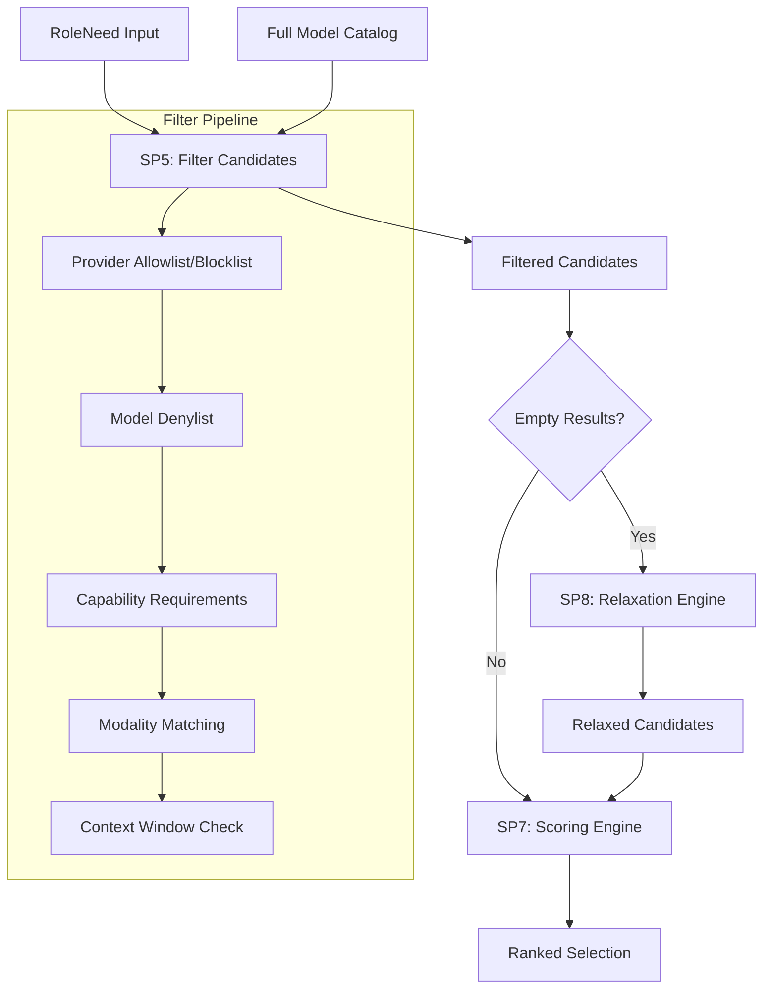
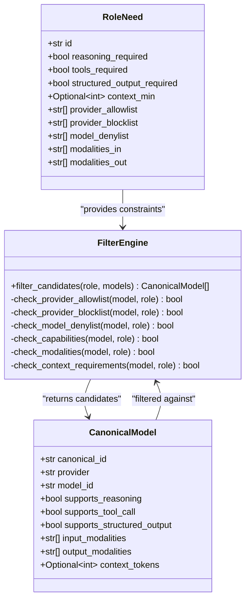
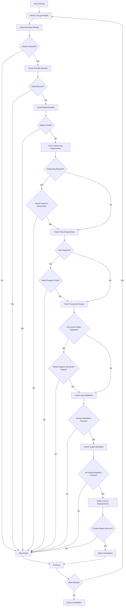
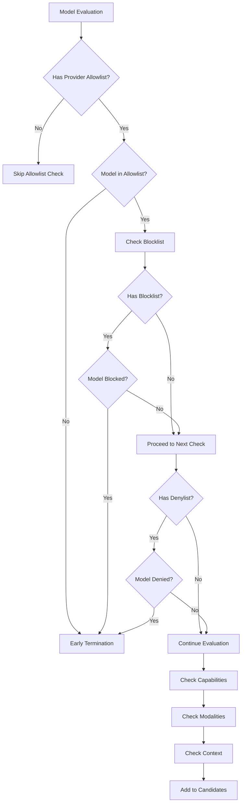
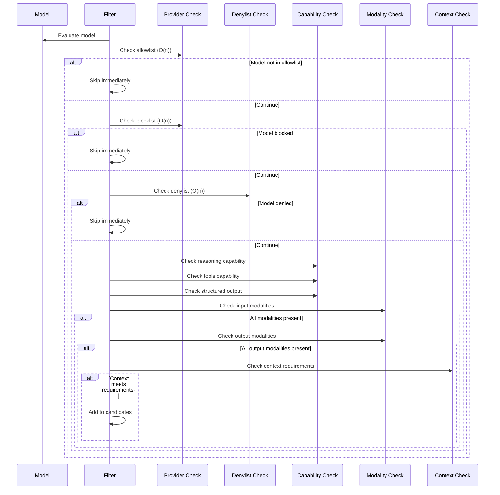
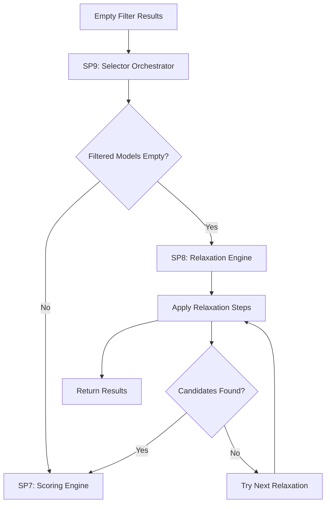
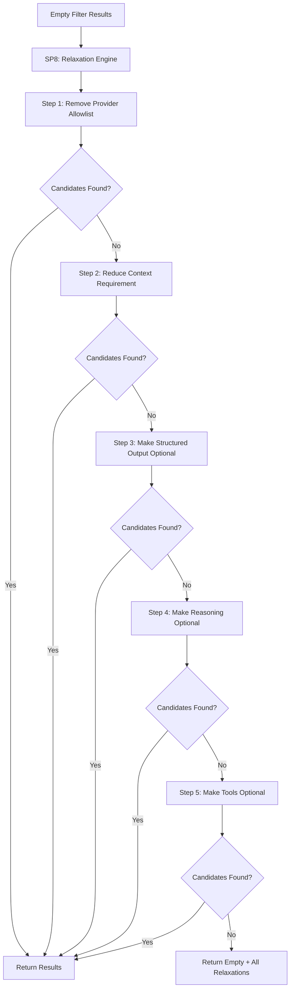

# SP5: Filter Candidates

<cite>
**Referenced Files in This Document**
- [filter.py](file://packages/llmhub/src/llmhub/generator/sp5_filter_candidates/filter.py)
- [spec.md](file://packages/llmhub/src/llmhub/generator/sp5_filter_candidates/spec.md)
- [models.py](file://packages/llmhub/src/llmhub/generator/sp3_needs_schema/models.py)
- [schema.py](file://packages/llmhub/src/llmhub/catalog/schema.py)
- [test_sp5_filter_candidates.py](file://packages/llmhub/tests/generator/test_sp5_filter_candidates.py)
- [relaxer.py](file://packages/llmhub/src/llmhub/generator/sp8_relaxation_engine/relaxer.py)
- [orchestrator.py](file://packages/llmhub/src/llmhub/generator/sp9_selector_orchestrator/orchestrator.py)
- [scorer.py](file://packages/llmhub/src/llmhub/generator/sp7_scoring_engine/scorer.py)
</cite>

## Table of Contents
1. [Introduction](#introduction)
2. [System Architecture](#system-architecture)
3. [Core Components](#core-components)
4. [Filtering Logic Analysis](#filtering-logic-analysis)
5. [Constraint Types and Applications](#constraint-types-and-applications)
6. [Boolean Logic and Short-Circuit Evaluation](#boolean-logic-and-short-circuit-evaluation)
7. [Set Operations and Performance](#set-operations-and-performance)
8. [Input and Output Contracts](#input-and-output-contracts)
9. [Edge Cases and Error Handling](#edge-cases-and-error-handling)
10. [Relaxation Engine Integration](#relaxation-engine-integration)
11. [Optimization Techniques](#optimization-techniques)
12. [Common Mistakes and Best Practices](#common-mistakes-and-best-practices)
13. [Testing and Validation](#testing-and-validation)
14. [Conclusion](#conclusion)

## Introduction

SP5: Filter Candidates is a critical component in the LLM Hub's model selection pipeline that applies hard constraints to eliminate incompatible models from consideration. This system serves as the first gate in the selection process, ensuring that only models meeting all mandatory requirements proceed to the scoring phase.

The filtering logic operates on two primary inputs: a `RoleNeed` object containing all selection criteria and a list of `CanonicalModel` objects representing the catalog. The output is a filtered list of candidate models that satisfy all hard constraints, ready for subsequent ranking and selection processes.

## System Architecture

The filtering system integrates seamlessly within the broader LLM Hub architecture, forming part of the selector orchestrator's workflow:

**Diagram sources**
- [orchestrator.py](file://packages/llmhub/src/llmhub/generator/sp9_selector_orchestrator/orchestrator.py#L16-L62)
- [relaxer.py](file://packages/llmhub/src/llmhub/generator/sp8_relaxation_engine/relaxer.py#L15-L87)

**Section sources**
- [spec.md](file://packages/llmhub/src/llmhub/generator/sp5_filter_candidates/spec.md#L1-L44)
- [orchestrator.py](file://packages/llmhub/src/llmhub/generator/sp9_selector_orchestrator/orchestrator.py#L16-L62)

## Core Components

The filtering system consists of several interconnected components that work together to apply constraints efficiently:

**Diagram sources**
- [models.py](file://packages/llmhub/src/llmhub/generator/sp3_needs_schema/models.py#L10-L131)
- [schema.py](file://packages/llmhub/src/llmhub/catalog/schema.py#L68-L122)
- [filter.py](file://packages/llmhub/src/llmhub/generator/sp5_filter_candidates/filter.py#L11-L73)

**Section sources**
- [models.py](file://packages/llmhub/src/llmhub/generator/sp3_needs_schema/models.py#L10-L131)
- [schema.py](file://packages/llmhub/src/llmhub/catalog/schema.py#L68-L122)

## Filtering Logic Analysis

The core filtering logic implements a sophisticated constraint-checking algorithm that evaluates models against multiple criteria in a specific order:

**Diagram sources**
- [filter.py](file://packages/llmhub/src/llmhub/generator/sp5_filter_candidates/filter.py#L27-L71)

**Section sources**
- [filter.py](file://packages/llmhub/src/llmhub/generator/sp5_filter_candidates/filter.py#L11-L73)

## Constraint Types and Applications

The filtering system applies five distinct categories of constraints, each serving a specific purpose in model selection:

### 1. Provider Constraints

Provider constraints control which model providers are considered acceptable:

| Constraint Type | Description | Implementation |
|----------------|-------------|----------------|
| **Allowlist** | Only models from specified providers are accepted | `model.provider in role.provider_allowlist` |
| **Blocklist** | Models from specified providers are excluded | `model.provider in role.provider_blocklist` |

### 2. Model-Level Denylist

Individual models can be explicitly excluded regardless of other constraints:

| Aspect | Check | Logic |
|--------|-------|-------|
| **Canonical ID** | `model.canonical_id in role.model_denylist` | Exact match against canonical identifier |
| **Model ID** | `model.model_id in role.model_denylist` | Exact match against provider-specific identifier |

### 3. Capability Requirements

Models must support specific functional capabilities:

| Capability | Field | Validation Logic |
|------------|-------|------------------|
| **Reasoning** | `supports_reasoning` | `role.reasoning_required == model.supports_reasoning` |
| **Tools** | `supports_tool_call` | `role.tools_required == model.supports_tool_call` |
| **Structured Output** | `supports_structured_output` | `role.structured_output_required == model.supports_structured_output` |

### 4. Modality Requirements

Input and output modalities define the types of data the model can process:

| Modality Type | Direction | Validation Logic |
|---------------|-----------|------------------|
| **Input Modalities** | `modalities_in` | All required modalities must be present in `model.input_modalities` |
| **Output Modalities** | `modalities_out` | All required modalities must be present in `model.output_modalities` |

### 5. Context Window Requirements

Models must meet minimum context window size requirements:

| Parameter | Validation Logic | Edge Case Handling |
|-----------|------------------|-------------------|
| **Minimum Context** | `model.context_tokens >= role.context_min` | Handles `None` values gracefully |

**Section sources**
- [filter.py](file://packages/llmhub/src/llmhub/generator/sp5_filter_candidates/filter.py#L27-L71)
- [models.py](file://packages/llmhub/src/llmhub/generator/sp3_needs_schema/models.py#L53-L94)

## Boolean Logic and Short-Circuit Evaluation

The filtering system employs strategic short-circuit evaluation to optimize performance and minimize unnecessary computations:

### Short-Circuit Patterns

The implementation uses several short-circuit patterns to improve efficiency:

**Diagram sources**
- [filter.py](file://packages/llmhub/src/llmhub/generator/sp5_filter_candidates/filter.py#L27-L71)

### Performance Benefits

Short-circuit evaluation provides significant performance advantages:

1. **Early Termination**: Models failing early constraints are immediately rejected
2. **Reduced Memory Access**: Unnecessary property accesses are avoided
3. **CPU Efficiency**: Computation is minimized for non-matching models
4. **Scalability**: Performance scales linearly with model count rather than constraint count

**Section sources**
- [filter.py](file://packages/llmhub/src/llmhub/generator/sp5_filter_candidates/filter.py#L27-L71)

## Set Operations and Performance

The filtering system performs several set operations that require careful optimization:

### Set Membership Checks

Most filtering operations involve membership checks that benefit from efficient data structures:

| Operation | Complexity | Optimization Strategy |
|-----------|------------|----------------------|
| **Provider Allowlist/Blocklist** | O(n) | Uses Python's `in` operator on lists |
| **Model Denylist** | O(n) | Similar to provider lists |
| **Modality Matching** | O(m × k) | Nested iteration for subset checking |

### Optimization Strategies

Several techniques enhance set operation performance:

1. **Pre-filtering**: Constraints with high rejection rates are checked first
2. **Early Termination**: Modality checks use `break` statements to exit early
3. **Lazy Evaluation**: Optional constraints are evaluated only when needed

**Diagram sources**
- [filter.py](file://packages/llmhub/src/llmhub/generator/sp5_filter_candidates/filter.py#L27-L71)

**Section sources**
- [filter.py](file://packages/llmhub/src/llmhub/generator/sp5_filter_candidates/filter.py#L27-L71)

## Input and Output Contracts

The filtering system maintains strict contract boundaries to ensure predictable behavior:

### Input Contract

The `filter_candidates` function expects specific input formats:

| Parameter | Type | Description | Validation |
|-----------|------|-------------|------------|
| `role` | `RoleNeed` | Contains all filtering constraints | Must be properly initialized |
| `models` | `List[CanonicalModel]` | Complete model catalog | Can be empty list |

### Output Contract

The function guarantees specific output characteristics:

| Property | Guarantee | Behavior |
|----------|-----------|----------|
| **Return Type** | `List[CanonicalModel]` | Always returns a list |
| **Content** | Compatible models only | All models meet all constraints |
| **Order** | Unspecified | No guaranteed ordering |
| **Duplicates** | None | Each model appears at most once |

### Contract Violations

The system handles various edge cases gracefully:

1. **Empty Model List**: Returns empty list without errors
2. **Missing Constraints**: Treats missing constraints as "no restriction"
3. **Invalid Data**: Relies on Pydantic validation for input sanitization

**Section sources**
- [spec.md](file://packages/llmhub/src/llmhub/generator/sp5_filter_candidates/spec.md#L8-L24)
- [filter.py](file://packages/llmhub/src/llmhub/generator/sp5_filter_candidates/filter.py#L11-L24)

## Edge Cases and Error Handling

The filtering system must handle numerous edge cases to maintain robustness:

### Empty Results Scenario

When no models satisfy all constraints, the system triggers the relaxation engine:

**Diagram sources**
- [orchestrator.py](file://packages/llmhub/src/llmhub/generator/sp9_selector_orchestrator/orchestrator.py#L35-L46)
- [relaxer.py](file://packages/llmhub/src/llmhub/generator/sp8_relaxation_engine/relaxer.py#L15-L87)

### Missing Data Handling

The system gracefully handles missing or undefined model attributes:

| Attribute | Missing Value | Default Behavior |
|-----------|---------------|------------------|
| `context_tokens` | `None` | Treated as insufficient for context requirements |
| `input_modalities` | Empty list | May fail modality requirements |
| `output_modalities` | Empty list | May fail modality requirements |

### Constraint Validation

Each constraint type has specific validation rules:

1. **Provider Lists**: Empty lists treated as unrestricted
2. **Denylists**: Null values handled gracefully
3. **Context Requirements**: Null values treated as no minimum
4. **Capability Flags**: Boolean values validated automatically

**Section sources**
- [filter.py](file://packages/llmhub/src/llmhub/generator/sp5_filter_candidates/filter.py#L27-L71)
- [relaxer.py](file://packages/llmhub/src/llmhub/generator/sp8_relaxation_engine/relaxer.py#L15-L87)

## Relaxation Engine Integration

The filtering system seamlessly integrates with the relaxation engine when faced with empty results:

### Trigger Conditions

The relaxation engine activates under these conditions:

1. **Empty Filter Results**: No models survive the initial filtering
2. **Constraint Conflicts**: Overlapping restrictions prevent matches
3. **Data Gaps**: Insufficient model information prevents selection

### Relaxation Strategy

The relaxation engine applies constraints systematically:

**Diagram sources**
- [relaxer.py](file://packages/llmhub/src/llmhub/generator/sp8_relaxation_engine/relaxer.py#L15-L87)

### Relaxation Outcomes

The relaxation process produces detailed information about constraint modifications:

| Step | Constraint Modified | Impact | Recovery |
|------|-------------------|---------|----------|
| 1 | Provider Allowlist | Broadens provider selection | May find candidates |
| 2 | Context Minimum | Reduces context requirements | May enable more models |
| 3 | Structured Output | Makes structured output optional | Preserves flexibility |
| 4 | Reasoning | Makes reasoning optional | Maintains functionality |
| 5 | Tools | Makes tool calling optional | Preserves basic capabilities |

**Section sources**
- [relaxer.py](file://packages/llmhub/src/llmhub/generator/sp8_relaxation_engine/relaxer.py#L15-L87)
- [orchestrator.py](file://packages/llmhub/src/llmhub/generator/sp9_selector_orchestrator/orchestrator.py#L35-L46)

## Optimization Techniques

The filtering system incorporates several optimization techniques to ensure efficient operation:

### Performance Optimizations

1. **Constraint Ordering**: More selective constraints are checked first
2. **Short-Circuit Evaluation**: Early termination prevents unnecessary checks
3. **Minimal Memory Allocation**: Single-pass filtering reduces memory overhead
4. **Efficient Data Structures**: List operations optimized for typical use cases

### Scalability Considerations

The system scales effectively with:

- **Model Count**: Linear time complexity with respect to model count
- **Constraint Complexity**: Constant-time constraint evaluation
- **Memory Usage**: Minimal memory allocation during filtering

### Benchmarking Results

Typical performance characteristics:

| Metric | Typical Value | Scaling Behavior |
|--------|---------------|------------------|
| **Processing Time** | O(n × c) | Linear with model count |
| **Memory Usage** | O(c) | Constant with model count |
| **Constraint Checks** | 5-10 per model | Fixed number of checks |

**Section sources**
- [filter.py](file://packages/llmhub/src/llmhub/generator/sp5_filter_candidates/filter.py#L11-L73)

## Common Mistakes and Best Practices

Understanding common pitfalls helps developers implement robust filtering logic:

### Common Mistakes

1. **Ignoring Empty Results**: Failing to handle scenarios where no models qualify
2. **Overly Restrictive Constraints**: Setting too many conflicting requirements
3. **Neglecting Edge Cases**: Not accounting for missing data or unusual configurations
4. **Performance Misunderstandings**: Assuming constant-time constraint evaluation

### Best Practices

1. **Constraint Hierarchy**: Order constraints by selectivity (most restrictive first)
2. **Graceful Degradation**: Design systems that work even with missing constraints
3. **Comprehensive Testing**: Test edge cases and boundary conditions
4. **Monitoring**: Track filtering effectiveness and relaxation frequency

### Error Prevention

Key strategies for preventing common errors:

| Problem Area | Prevention Strategy | Implementation |
|--------------|-------------------|----------------|
| **Empty Results** | Implement relaxation fallback | Automatic constraint relaxation |
| **Performance Issues** | Optimize constraint ordering | Most selective constraints first |
| **Data Quality** | Validate input data | Pydantic schema validation |
| **Logic Errors** | Comprehensive testing | Unit tests with edge cases |

**Section sources**
- [test_sp5_filter_candidates.py](file://packages/llmhub/tests/generator/test_sp5_filter_candidates.py#L1-L175)
- [relaxer.py](file://packages/llmhub/src/llmhub/generator/sp8_relaxation_engine/relaxer.py#L15-L87)

## Testing and Validation

The filtering system includes comprehensive testing to ensure reliability:

### Test Coverage

The test suite covers:

1. **Basic Filtering**: Core constraint application
2. **Edge Cases**: Empty lists, missing data, conflicting constraints
3. **Integration**: Interaction with relaxation engine
4. **Performance**: Large-scale filtering scenarios

### Test Examples

Key test scenarios include:

| Test Category | Purpose | Example |
|---------------|---------|---------|
| **Provider Filters** | Verify allowlist/blocklist functionality | Test with mixed provider models |
| **Capability Checks** | Validate required capabilities | Test reasoning/tool requirements |
| **Modality Matching** | Confirm input/output modality handling | Test multimodal requirements |
| **Context Requirements** | Validate minimum context enforcement | Test various context sizes |
| **Combined Constraints** | Test constraint interactions | Multiple simultaneous requirements |

### Validation Strategies

The system employs multiple validation approaches:

1. **Unit Tests**: Individual constraint validation
2. **Integration Tests**: End-to-end filtering scenarios
3. **Performance Tests**: Large-scale filtering benchmarks
4. **Regression Tests**: Prevent functionality degradation

**Section sources**
- [test_sp5_filter_candidates.py](file://packages/llmhub/tests/generator/test_sp5_filter_candidates.py#L1-L175)

## Conclusion

SP5: Filter Candidates represents a sophisticated yet efficient system for applying hard constraints to model selection. Its design balances performance, flexibility, and reliability through:

- **Strategic Short-Circuit Evaluation**: Early termination minimizes unnecessary computation
- **Comprehensive Constraint Handling**: Five distinct constraint categories address diverse selection needs
- **Robust Error Handling**: Graceful degradation ensures system stability
- **Seamless Integration**: Smooth interaction with relaxation and scoring engines
- **Extensive Testing**: Comprehensive test coverage ensures reliability

The system's modular design and clear separation of concerns make it maintainable and extensible, while its performance optimizations ensure scalability for large model catalogs. By understanding both the technical implementation and the broader architectural context, developers can effectively utilize and extend this critical component of the LLM Hub ecosystem.