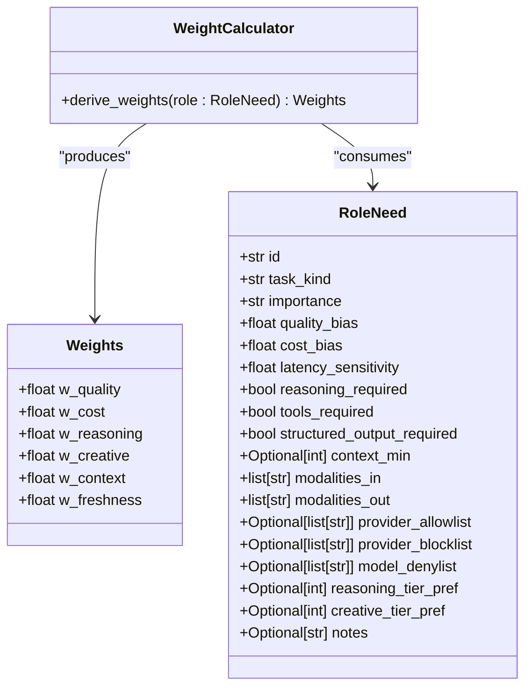
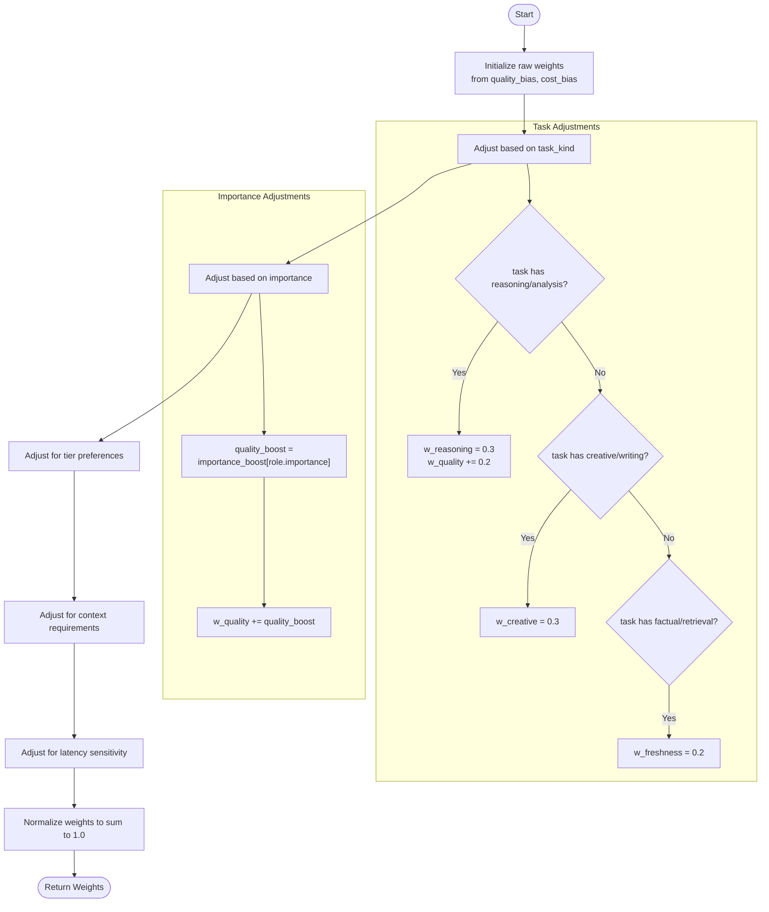
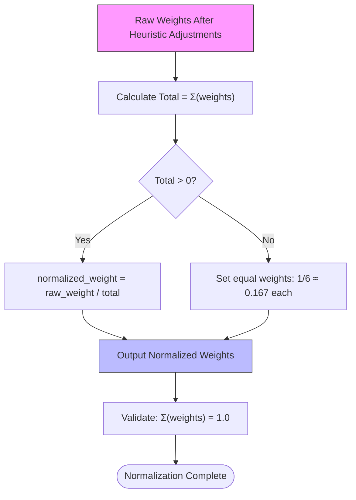
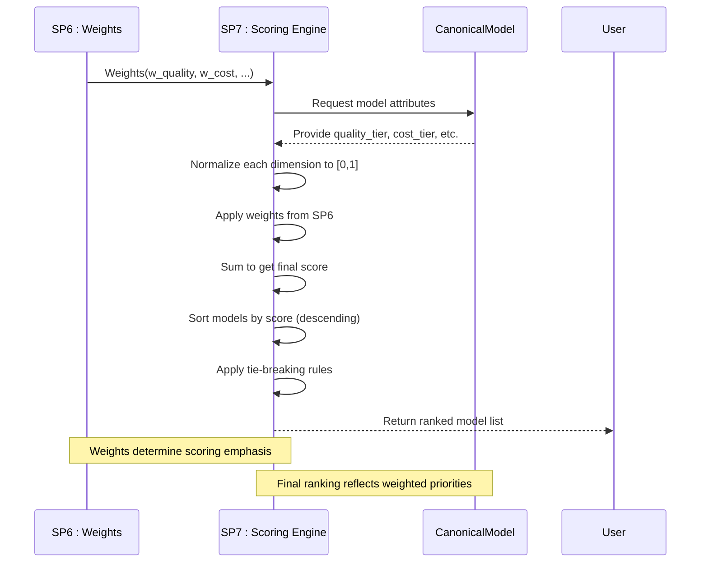

# SP6: Weights

<cite>
**Referenced Files in This Document**   
- [calculator.py](file://packages/llmhub/src/llmhub/generator/sp6_weights/calculator.py)
- [models.py](file://packages/llmhub/src/llmhub/generator/sp6_weights/models.py)
- [spec.md](file://packages/llmhub/src/llmhub/generator/sp6_weights/spec.md)
- [RoleNeed models.py](file://packages/llmhub/src/llmhub/generator/sp3_needs_schema/models.py)
- [scorer.py](file://packages/llmhub/src/llmhub/generator/sp7_scoring_engine/scorer.py)
- [sp7_scoring_engine spec.md](file://packages/llmhub/src/llmhub/generator/sp7_scoring_engine/spec.md)
</cite>

## Table of Contents
1. [Introduction](#introduction)
2. [Core Components](#core-components)
3. [Weight Calculation Process](#weight-calculation-process)
4. [Normalization and Trade-off Balancing](#normalization-and-trade-off-balancing)
5. [Preference Profiles and Examples](#preference-profiles-and-examples)
6. [Impact on SP7 Scoring and Ranking](#impact-on-sp7-scoring-and-ranking)
7. [Customization and Business Integration](#customization-and-business-integration)
8. [Conclusion](#conclusion)

## Introduction

The SP6: Weights component is responsible for transforming qualitative role preferences into quantitative scoring weights that guide model selection. This process bridges human-understandable requirements (like "high quality" or "low cost") with mathematical scoring in the model selection pipeline. The component takes a RoleNeed object containing qualitative preferences and converts it into a normalized Weights vector that determines how different model attributes are prioritized during scoring.

The weight calculation process considers multiple factors including task type, importance level, specific capability requirements, and business priorities to create a balanced weighting scheme that reflects the role's needs. These weights are then used in SP7 to compute final scores for candidate models, directly influencing which models are selected for specific roles.

**Section sources**
- [spec.md](file://packages/llmhub/src/llmhub/generator/sp6_weights/spec.md#L1-L44)

## Core Components

The SP6: Weights module consists of two primary components: the Weights data model and the derive_weights function. The Weights model defines the structure of the output, specifying six key dimensions that influence model selection: quality, cost, reasoning capability, creative capability, context length, and freshness. Each weight is constrained to the range [0,1] and all weights collectively sum to 1.0, ensuring proper normalization for subsequent scoring operations.

The derive_weights function implements the heuristic logic that transforms qualitative preferences from a RoleNeed into this quantitative weight vector. It processes various aspects of the role's requirements, applying configurable rules to determine appropriate weight distributions across the six dimensions.

**Diagram sources**
- [models.py](file://packages/llmhub/src/llmhub/generator/sp6_weights/models.py#L5-L18)
- [calculator.py](file://packages/llmhub/src/llmhub/generator/sp6_weights/calculator.py#L10-L72)
- [RoleNeed models.py](file://packages/llmhub/src/llmhub/generator/sp3_needs_schema/models.py#L10-L130)

**Section sources**
- [models.py](file://packages/llmhub/src/llmhub/generator/sp6_weights/models.py#L5-L18)
- [calculator.py](file://packages/llmhub/src/llmhub/generator/sp6_weights/calculator.py#L10-L72)

## Weight Calculation Process

The weight calculation process in SP6 follows a systematic approach to convert qualitative preferences into quantitative weights. The derive_weights function begins by initializing raw weights based on the role's explicit biases (quality_bias and cost_bias), while setting other dimension weights to zero. It then applies a series of heuristic rules to adjust these weights based on various aspects of the role's requirements.

The process starts with task-based adjustments: roles with "reasoning" or "analysis" in their task_kind receive a 0.3 weight for reasoning capability and an additional 0.2 boost to quality weight. Roles focused on "creative" or "writing" tasks receive a 0.3 weight for creative capability. Roles with "factual" or "retrieval" tasks receive a 0.2 weight for freshness, reflecting the importance of up-to-date information.

Next, the algorithm adjusts weights based on the role's importance level. Critical roles receive a 0.3 quality boost, high-importance roles receive 0.2, medium-importance roles receive 0.1, and low-importance roles receive no additional boost. This ensures that more important roles inherently prioritize quality.

The calculation also considers specific capability preferences. If a role specifies a reasoning_tier_pref or creative_tier_pref, the corresponding weight is set to at least 0.25, ensuring that explicitly requested capabilities receive meaningful consideration in the scoring process.

**Diagram sources**
- [calculator.py](file://packages/llmhub/src/llmhub/generator/sp6_weights/calculator.py#L20-L63)

**Section sources**
- [calculator.py](file://packages/llmhub/src/llmhub/generator/sp6_weights/calculator.py#L20-L63)

## Normalization and Trade-off Balancing

After applying all heuristic adjustments to the raw weights, SP6 performs a normalization process to ensure the final weights sum to exactly 1.0. This normalization is critical for maintaining consistency in the scoring process and enabling meaningful comparisons across different roles and scenarios.

The normalization process calculates the sum of all adjusted raw weights and then divides each individual weight by this total. This proportional scaling preserves the relative importance between different dimensions while ensuring mathematical consistency. In the rare case where all raw weights sum to zero (which could occur with minimal or invalid input), the system defaults to equal weights of approximately 0.167 for each of the six dimensions, providing a reasonable fallback.

The system also implements specific trade-off balancing mechanisms. For example, when a role has high latency sensitivity (greater than 0.7), the cost weight is reduced by 50%. This reflects the understanding that low-latency requirements often necessitate more expensive infrastructure, so a strict cost focus may conflict with performance needs. Similarly, roles with minimum context requirements (context_min specified) receive a fixed 0.15 weight for context length, ensuring that adequate context capacity is properly valued.

These trade-off mechanisms prevent conflicting priorities from creating unrealistic weight distributions and ensure that the final weights reflect balanced, practical considerations rather than isolated preferences.

**Diagram sources**
- [calculator.py](file://packages/llmhub/src/llmhub/generator/sp6_weights/calculator.py#L64-L71)

**Section sources**
- [calculator.py](file://packages/llmhub/src/llmhub/generator/sp6_weights/calculator.py#L64-L71)

## Preference Profiles and Examples

The SP6 weight calculation system handles various preference profiles through its heuristic rules. For example, a data analyst role with task_kind "reasoning" and importance "high" would receive significant weight allocations to quality (base bias + 0.2 from task + 0.2 from importance) and reasoning capability (0.3 from task), potentially making these the dominant factors in model selection.

A content writer role with task_kind "creative writing" would receive a 0.3 weight for creative capability, with additional quality weighting based on the role's importance level. If this role also specifies a creative_tier_pref, the creative weight would be guaranteed to be at least 0.25, reinforcing the emphasis on creative ability.

For cost-sensitive applications with high latency requirements, the system automatically balances these competing factors. The high latency sensitivity reduces the cost weight by 50%, acknowledging that achieving low latency often requires more expensive resources. This prevents the system from overly prioritizing cost at the expense of performance when both factors are important.

Roles with specific technical requirements also receive appropriate weight distributions. A role requiring extensive context (with context_min specified) automatically receives a 0.15 weight for context length, ensuring that models with adequate context windows are properly favored. Similarly, roles focused on factual accuracy and up-to-date information (with "factual" or "retrieval" in task_kind) receive dedicated weight for freshness, prioritizing recently updated models.

These examples demonstrate how SP6 translates diverse qualitative requirements into mathematically sound weight distributions that accurately reflect the intended priorities.

**Section sources**
- [calculator.py](file://packages/llmhub/src/llmhub/generator/sp6_weights/calculator.py#L30-L58)
- [RoleNeed models.py](file://packages/llmhub/src/llmhub/generator/sp3_needs_schema/models.py#L32-L44)

## Impact on SP7 Scoring and Ranking

The weights generated by SP6 directly determine the outcome of the SP7 scoring engine, which computes final scores for candidate models. In SP7, each model's attributes are normalized to a 0-1 scale across six dimensions (quality, cost, reasoning, creative, context, and freshness), and then multiplied by the corresponding weights from SP6 before being summed into a final score.

The weighted scoring formula in SP7 is: `final_score = w_quality×quality_score + w_cost×cost_score + w_reasoning×reasoning_score + w_creative×creative_score + w_context×context_score + w_freshness×freshness_score`. This means that dimensions with higher weights from SP6 have greater influence on the final ranking.

For example, if SP6 assigns a high weight to quality (w_quality close to 1.0), then models with superior quality metrics (higher arena scores and better quality tiers) will dominate the rankings regardless of their performance on other dimensions. Conversely, if cost is heavily weighted, then more economical models will rise to the top even if they have lower quality scores.

After weighted scoring, SP7 applies a tie-breaking hierarchy: first favoring models from providers in the allowlist, then prioritizing higher arena scores, followed by greater context capacity, and finally using lexicographic ordering of model IDs. This ensures deterministic results even when models have identical weighted scores.

The deterministic nature of SP6 (same input always produces the same weights) ensures consistent and reproducible model selection outcomes, which is critical for reliable system behavior.

**Diagram sources**
- [scorer.py](file://packages/llmhub/src/llmhub/generator/sp7_scoring_engine/scorer.py#L98-L120)
- [sp7_scoring_engine spec.md](file://packages/llmhub/src/llmhub/generator/sp7_scoring_engine/spec.md#L28-L40)

**Section sources**
- [scorer.py](file://packages/llmhub/src/llmhub/generator/sp7_scoring_engine/scorer.py#L98-L120)
- [sp7_scoring_engine spec.md](file://packages/llmhub/src/llmhub/generator/sp7_scoring_engine/spec.md#L28-L40)

## Customization and Business Integration

While the current implementation provides a robust set of heuristics for weight calculation, the system is designed to accommodate customization for specific business priorities. The derive_weights function could be extended to incorporate organization-specific weighting rules, industry-specific considerations, or strategic priorities.

For example, an organization might want to prioritize models from specific providers for compliance reasons, which could be reflected by adjusting the weight calculation to boost quality or other weights for models from approved providers. Alternatively, a company with particular cost constraints might implement more aggressive cost weighting rules or introduce additional factors like regional pricing differences.

The modular design of SP6, with its clear separation between the Weights data model and the derive_weights logic, facilitates such customizations. Organizations can modify the heuristic rules in the calculator.py module without affecting the rest of the system, as long as the output conforms to the Weights schema.

Future enhancements could include configurable weight templates for common role types, machine learning-based weight optimization based on historical performance data, or interactive weight tuning interfaces that allow stakeholders to visualize the impact of different weighting schemes on model selection outcomes.

The system's deterministic nature and clear input-output relationship make it well-suited for integration with business rule engines, policy management systems, or compliance frameworks that require auditable decision-making processes.

**Section sources**
- [calculator.py](file://packages/llmhub/src/llmhub/generator/sp6_weights/calculator.py#L10-L72)
- [models.py](file://packages/llmhub/src/llmhub/generator/sp6_weights/models.py#L5-L18)

## Conclusion

SP6: Weights plays a crucial role in the model selection pipeline by transforming qualitative role preferences into quantitative scoring weights. Through a systematic process of heuristic evaluation, trade-off balancing, and normalization, it creates weight vectors that accurately reflect the priorities implied by a role's requirements.

The component effectively bridges human-understandable concepts like "high quality" or "low latency" with mathematical scoring, enabling objective comparison of models based on subjective requirements. Its deterministic nature ensures consistent results, while its modular design allows for customization to meet specific business needs.

By carefully balancing competing priorities and applying sensible defaults, SP6 produces weight distributions that lead to meaningful model rankings in SP7. The transparency of its rules and the clear relationship between input preferences and output weights make it an interpretable and trustworthy component in the overall model selection system.