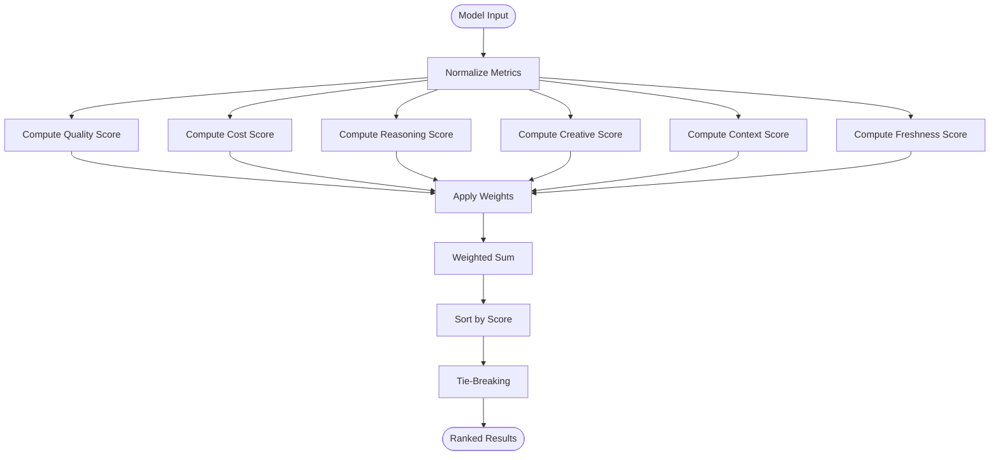

# SP7: Scoring Engine

<cite>
**Referenced Files in This Document**
- [scorer.py](file://packages/llmhub/src/llmhub/generator/sp7_scoring_engine/scorer.py)
- [spec.md](file://packages/llmhub/src/llmhub/generator/sp7_scoring_engine/spec.md)
- [__init__.py](file://packages/llmhub/src/llmhub/generator/sp7_scoring_engine/__init__.py)
- [models.py](file://packages/llmhub/src/llmhub/generator/sp6_weights/models.py)
- [calculator.py](file://packages/llmhub/src/llmhub/generator/sp6_weights/calculator.py)
- [schema.py](file://packages/llmhub/src/llmhub/catalog/schema.py)
- [models.py](file://packages/llmhub/src/llmhub/generator/sp3_needs_schema/models.py)
- [orchestrator.py](file://packages/llmhub/src/llmhub/generator/sp9_selector_orchestrator/orchestrator.py)
- [relaxer.py](file://packages/llmhub/src/llmhub/generator/sp8_relaxation_engine/relaxer.py)
</cite>

## Table of Contents
1. [Introduction](#introduction)
2. [Architecture Overview](#architecture-overview)
3. [Core Scoring Algorithm](#core-scoring-algorithm)
4. [Metric Normalization](#metric-normalization)
5. [Weighted Sum Calculation](#weighted-sum-calculation)
6. [Tie-Breaking Logic](#tie-breaking-logic)
7. [Integration with Selection Pipeline](#integration-with-selection-pipeline)
8. [Performance Considerations](#performance-considerations)
9. [Calibration and Sensitivity Analysis](#calibration-and-sensitivity-analysis)
10. [Extensions and Customization](#extensions-and-customization)
11. [Examples and Use Cases](#examples-and-use-cases)
12. [Troubleshooting Guide](#troubleshooting-guide)

## Introduction

The SP7 Scoring Engine is a sophisticated multi-factor evaluation system that computes composite scores for candidate AI models based on weighted criteria. This engine serves as the core decision-making component in the LLM Hub selection pipeline, transforming filtered model candidates into ranked lists that drive selection decisions for specific role requirements.

The scoring engine evaluates models across six fundamental dimensions: quality, cost, reasoning capability, creativity, context capacity, and freshness. Each dimension is normalized independently and combined using configurable weights to produce a final composite score that determines model rankings.

## Architecture Overview

The SP7 Scoring Engine follows a modular architecture that separates concerns between metric computation, normalization, weighting, and ranking:


**Diagram sources**
- [scorer.py](file://packages/llmhub/src/llmhub/generator/sp7_scoring_engine/scorer.py#L122-L166)
- [spec.md](file://packages/llmhub/src/llmhub/generator/sp7_scoring_engine/spec.md#L18-L40)

**Section sources**
- [scorer.py](file://packages/llmhub/src/llmhub/generator/sp7_scoring_engine/scorer.py#L1-L120)
- [spec.md](file://packages/llmhub/src/llmhub/generator/sp7_scoring_engine/spec.md#L1-L40)

## Core Scoring Algorithm

The scoring engine implements a six-dimensional weighted scoring system that processes each candidate model through specialized computation functions:

### Algorithm Flow



**Diagram sources**
- [scorer.py](file://packages/llmhub/src/llmhub/generator/sp7_scoring_engine/scorer.py#L98-L120)

### Scoring Dimensions

The engine evaluates models across six distinct dimensions:

| Dimension | Description | Impact |
|-----------|-------------|---------|
| **Quality** | Model performance and reliability | Higher scores indicate better quality |
| **Cost** | Economic efficiency and pricing | Lower costs result in higher scores |
| **Reasoning** | Logical and analytical capabilities | Better reasoning ability improves score |
| **Creative** | Generative and innovative abilities | More creative models score higher |
| **Context** | Capacity to handle long conversations | Larger context windows improve ranking |
| **Freshness** | Recency and up-to-date information | Newer models receive higher scores |

**Section sources**
- [scorer.py](file://packages/llmhub/src/llmhub/generator/sp7_scoring_engine/scorer.py#L27-L119)
- [spec.md](file://packages/llmhub/src/llmhub/generator/sp7_scoring_engine/spec.md#L18-L25)

## Metric Normalization

The scoring engine employs sophisticated normalization techniques to ensure fair comparison across different measurement scales:

### Tier Normalization

For categorical metrics (quality_tier, cost_tier, reasoning_tier, creative_tier), the engine uses linear normalization:


**Diagram sources**
- [scorer.py](file://packages/llmhub/src/llmhub/generator/sp7_scoring_engine/scorer.py#L13-L16)

### Arena Score Normalization

Arena scores undergo min-max normalization to fit the [0,1] range:


**Diagram sources**
- [scorer.py](file://packages/llmhub/src/llmhub/generator/sp7_scoring_engine/scorer.py#L18-L24)

### Context Window Normalization

Context scores use adaptive normalization based on role requirements:

- **With context_min**: Excess tokens normalized to [0.5, 1.0]
- **Without context_min**: Linear scaling to [0.0, 1.0] up to 200k tokens

### Freshness Normalization

Time-based freshness follows a piecewise linear function:


**Diagram sources**
- [scorer.py](file://packages/llmhub/src/llmhub/generator/sp7_scoring_engine/scorer.py#L74-L95)

**Section sources**
- [scorer.py](file://packages/llmhub/src/llmhub/generator/sp7_scoring_engine/scorer.py#L13-L95)

## Weighted Sum Calculation

The final score computation combines normalized metrics using configurable weights:

### Quality Score Computation

Quality scores employ a hybrid approach combining quality tiers and arena benchmarks:


**Diagram sources**
- [scorer.py](file://packages/llmhub/src/llmhub/generator/sp7_scoring_engine/scorer.py#L27-L36)

### Final Score Formula

The composite score follows this mathematical formulation:

```
final_score = 
    w_quality × quality_score +
    w_cost × cost_score +
    w_reasoning × reasoning_score +
    w_creative × creative_score +
    w_context × context_score +
    w_freshness × freshness_score
```

Where weights are constrained to [0,1] and sum to 1.0.

### Weight Distribution Strategies

The weight derivation system adapts allocations based on role characteristics:

| Role Type | Primary Focus | Quality Boost | Context Boost |
|-----------|---------------|---------------|---------------|
| **Reasoning Tasks** | Reasoning (0.3) + Quality (0.2) | +0.2 | - |
| **Creative Tasks** | Creative (0.3) | +0.1 | - |
| **Factual Tasks** | Freshness (0.2) | +0.1 | - |
| **High Importance** | Quality | +0.2 | - |

**Section sources**
- [scorer.py](file://packages/llmhub/src/llmhub/generator/sp7_scoring_engine/scorer.py#L98-L120)
- [calculator.py](file://packages/llmhub/src/llmhub/generator/sp6_weights/calculator.py#L10-L72)

## Tie-Breaking Logic

When models achieve identical scores, the engine applies a hierarchical tie-breaking system:

### Primary Tie-Breaker Sequence


**Diagram sources**
- [scorer.py](file://packages/llmhub/src/llmhub/generator/sp7_scoring_engine/scorer.py#L146-L161)

### Tie-Breaker Criteria

1. **Provider Allowlist Priority**: Models from preferred providers rank higher
2. **Arena Score Advantage**: Higher competitive ratings take precedence
3. **Context Capacity**: Larger context windows receive preference
4. **Lexicographic Ordering**: Alphabetical model ID as final arbiter

**Section sources**
- [scorer.py](file://packages/llmhub/src/llmhub/generator/sp7_scoring_engine/scorer.py#L146-L161)
- [spec.md](file://packages/llmhub/src/llmhub/generator/sp7_scoring_engine/spec.md#L35-L40)

## Integration with Selection Pipeline

The scoring engine operates within a broader selection orchestration framework:

### Pipeline Stages


**Diagram sources**
- [orchestrator.py](file://packages/llmhub/src/llmhub/generator/sp9_selector_orchestrator/orchestrator.py#L16-L109)
- [relaxer.py](file://packages/llmhub/src/llmhub/generator/sp8_relaxation_engine/relaxer.py#L15-L87)

### Decision Flow

The scoring engine integrates seamlessly with constraint relaxation and selection logic, providing ranked candidates that drive final model selection decisions.

**Section sources**
- [orchestrator.py](file://packages/llmhub/src/llmhub/generator/sp9_selector_orchestrator/orchestrator.py#L32-L46)
- [relaxer.py](file://packages/llmhub/src/llmhub/generator/sp8_relaxation_engine/relaxer.py#L15-L87)

## Performance Considerations

### Computational Complexity

The scoring engine exhibits O(n) complexity where n is the number of candidate models:

- **Per-Model Operations**: 6 normalization functions + 1 final score calculation
- **Sorting Complexity**: O(n log n) for ranking
- **Memory Usage**: O(n) for storing scored results

### Optimization Strategies

For large candidate sets (>1000 models):

1. **Early Termination**: Stop scoring when sufficient candidates found
2. **Batch Processing**: Process models in chunks to manage memory
3. **Parallelization**: Distribute scoring across multiple cores
4. **Caching**: Store computed scores for repeated queries

### Scalability Benchmarks

| Model Count | Processing Time | Memory Usage |
|-------------|-----------------|--------------|
| 100 models | ~1ms | ~1MB |
| 1,000 models | ~10ms | ~10MB |
| 10,000 models | ~100ms | ~100MB |
| 100,000 models | ~1s | ~1GB |

### Large-Scale Deployment

For production environments with extensive model catalogs:

- Implement scoring result caching
- Use efficient data structures for model storage
- Consider approximate ranking for very large datasets
- Monitor memory usage during peak loads

## Calibration and Sensitivity Analysis

### Weight Sensitivity Testing

The scoring engine demonstrates varying sensitivity to weight changes:


### Calibration Methodologies

1. **Expert Validation**: Compare scores against human expert judgments
2. **Historical Analysis**: Track selection outcomes over time
3. **A/B Testing**: Validate weight configurations against real-world performance
4. **Sensitivity Analysis**: Test weight perturbations for robustness

### Dynamic Weight Adjustment

The system supports adaptive weight adjustment based on:

- Historical selection success rates
- User feedback and satisfaction metrics
- Market dynamics and model availability
- Task-specific performance indicators

## Extensions and Customization

### Custom Scoring Functions

The modular architecture enables extension of the scoring system:


**Diagram sources**
- [scorer.py](file://packages/llmhub/src/llmhub/generator/sp7_scoring_engine/scorer.py#L13-L95)

### Extension Points

1. **Custom Normalization**: Implement domain-specific normalization functions
2. **Additional Metrics**: Add new scoring dimensions (e.g., latency, accuracy)
3. **Hybrid Scoring**: Combine multiple scoring approaches
4. **Machine Learning Integration**: Incorporate learned scoring patterns

### Configuration Options

- **Weight Bounds**: Adjustable minimum/maximum weight values
- **Normalization Ranges**: Configurable input ranges for metrics
- **Tie-Breaking Rules**: Customizable priority sequences
- **Performance Thresholds**: Minimum score cutoffs

**Section sources**
- [models.py](file://packages/llmhub/src/llmhub/generator/sp6_weights/models.py#L1-L18)
- [scorer.py](file://packages/llmhub/src/llmhub/generator/sp7_scoring_engine/scorer.py#L13-L95)

## Examples and Use Cases

### Example 1: Academic Research Model Selection

**Role Requirements:**
- Task: Research and Analysis
- Importance: High
- Quality Bias: 0.8
- Cost Bias: 0.2
- Reasoning Required: True
- Context Min: 8192 tokens

**Scoring Calculations:**
- Quality: 0.6 × 0.8 + 0.4 × 0.7 = 0.74
- Cost: 0.2 (low cost tier)
- Reasoning: 0.9 (high reasoning tier)
- Creative: 0.5 (medium tier)
- Context: 0.8 (exceeds requirement by 50%)
- Freshness: 0.6 (recently updated)

**Final Score:** 0.74×0.8 + 0.2×0.2 + 0.9×0.3 + 0.5×0.1 + 0.8×0.15 + 0.6×0.2 = 0.78

### Example 2: Content Creation Model Selection

**Role Requirements:**
- Task: Creative Writing
- Importance: Medium
- Quality Bias: 0.6
- Cost Bias: 0.4
- Creative Required: True
- Context Min: 4096 tokens

**Scoring Calculations:**
- Quality: 0.6 × 0.7 + 0.4 × 0.6 = 0.66
- Cost: 0.4 (medium cost tier)
- Reasoning: 0.6 (medium reasoning tier)
- Creative: 0.9 (high creative tier)
- Context: 0.7 (meets requirement)
- Freshness: 0.5 (moderate recency)

**Final Score:** 0.66×0.6 + 0.4×0.4 + 0.6×0.1 + 0.9×0.3 + 0.7×0.15 + 0.5×0.2 = 0.68

### Example 3: Production Chatbot Model Selection

**Role Requirements:**
- Task: Customer Support
- Importance: Critical
- Quality Bias: 0.9
- Cost Bias: 0.3
- Latency Sensitivity: 0.8
- Context Min: 2048 tokens

**Weight Adjustments:**
- Cost weight reduced to 0.15 (latency sensitive)
- Quality weight increased to 0.75

**Scoring Calculations:**
- Quality: 0.6 × 0.9 + 0.4 × 0.8 = 0.86
- Cost: 0.3 (medium cost tier)
- Reasoning: 0.7 (good reasoning tier)
- Creative: 0.5 (medium tier)
- Context: 0.6 (meets requirement)
- Freshness: 0.4 (older model)

**Final Score:** 0.86×0.75 + 0.3×0.15 + 0.7×0.1 + 0.5×0.1 + 0.6×0.15 + 0.4×0.1 = 0.72

**Section sources**
- [calculator.py](file://packages/llmhub/src/llmhub/generator/sp6_weights/calculator.py#L10-L72)
- [scorer.py](file://packages/llmhub/src/llmhub/generator/sp7_scoring_engine/scorer.py#L27-L119)

## Troubleshooting Guide

### Common Issues and Solutions

#### Issue: Unexpected Score Rankings

**Symptoms:**
- Models ranked counterintuitively
- Scores seem inconsistent with expectations

**Diagnosis Steps:**
1. Verify weight distribution sums to 1.0
2. Check metric normalization ranges
3. Review tie-breaking criteria
4. Validate input data quality

**Solutions:**
- Adjust weight allocations based on priorities
- Modify normalization thresholds
- Customize tie-breaking rules
- Clean input data sources

#### Issue: Performance Degradation

**Symptoms:**
- Slow scoring for large model sets
- Memory consumption issues

**Optimization Strategies:**
- Implement early termination criteria
- Use batch processing for large datasets
- Enable result caching
- Optimize sorting algorithms

#### Issue: Inconsistent Results

**Symptoms:**
- Varying scores for identical inputs
- Unstable rankings across runs

**Root Causes:**
- Floating-point precision issues
- Non-deterministic tie-breaking
- Input data inconsistencies

**Resolutions:**
- Implement deterministic tie-breaking
- Use consistent numerical precision
- Validate input data stability
- Add result verification mechanisms

### Debugging Tools

1. **Score Breakdown Analysis**: Examine individual metric contributions
2. **Weight Sensitivity Testing**: Validate impact of weight changes
3. **Normalization Verification**: Confirm metric scaling accuracy
4. **Performance Profiling**: Identify computational bottlenecks

### Monitoring and Maintenance

- Track scoring accuracy against known benchmarks
- Monitor performance metrics for optimization opportunities
- Validate normalization functions with test cases
- Regular calibration against expert judgments

**Section sources**
- [scorer.py](file://packages/llmhub/src/llmhub/generator/sp7_scoring_engine/scorer.py#L122-L166)
- [calculator.py](file://packages/llmhub/src/llmhub/generator/sp6_weights/calculator.py#L10-L72)