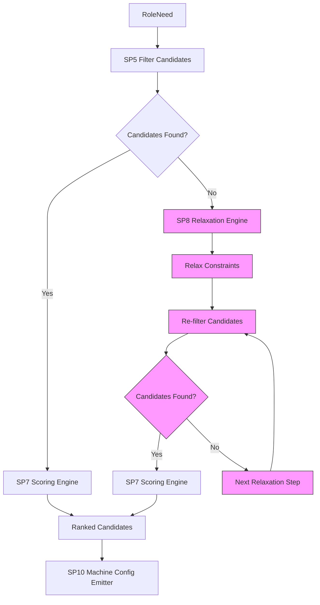

# SP8: Relaxation Engine

<cite>
**Referenced Files in This Document**   
- [relaxer.py](file://packages/llmhub/src/llmhub/generator/sp8_relaxation_engine/relaxer.py)
- [spec.md](file://packages/llmhub/src/llmhub/generator/sp8_relaxation_engine/spec.md)
- [filter.py](file://packages/llmhub/src/llmhub/generator/sp5_filter_candidates/filter.py)
- [scorer.py](file://packages/llmhub/src/llmhub/generator/sp7_scoring_engine/scorer.py)
- [models.py](file://packages/llmhub/src/llmhub/generator/sp3_needs_schema/models.py)
- [builder.py](file://packages/llmhub/src/llmhub/generator/sp10_machine_config_emitter/builder.py)
- [models.py](file://packages/llmhub/src/llmhub/generator/sp10_machine_config_emitter/models.py)
</cite>

## Table of Contents
1. [Introduction](#introduction)
2. [Relaxation Strategy](#relaxation-strategy)
3. [Relaxation Sequence and Outcomes](#relaxation-sequence-and-outcomes)
4. [Trade-offs Between Strictness and Availability](#trade-offs-between-strictness-and-availability)
5. [Configuration and Policy Guidance](#configuration-and-policy-guidance)
6. [Interpreting Relaxed Results](#interpreting-relaxed-results)
7. [Architecture Overview](#architecture-overview)

## Introduction

The SP8 Relaxation Engine is a systematic fallback mechanism designed to ensure model availability when initial selection criteria yield no valid candidates. It operates by progressively relaxing constraints in a predefined order, preserving the user's intent while enabling fallbacks. The engine is invoked when the filtering process (SP5) returns zero candidates, and it attempts to find suitable models by loosening constraints in a controlled manner.

The relaxation process is deterministic and follows a specific sequence of steps, each of which modifies the original constraints in the `RoleNeed` object. After each relaxation step, the system re-applies filtering and scoring to determine if viable candidates emerge. The process stops at the first successful result, ensuring minimal deviation from the original requirements.

**Section sources**
- [relaxer.py](file://packages/llmhub/src/llmhub/generator/sp8_relaxation_engine/relaxer.py#L1-L87)
- [spec.md](file://packages/llmhub/src/llmhub/generator/sp8_relaxation_engine/spec.md#L1-L34)

## Relaxation Strategy

The Relaxation Engine employs a hierarchical strategy to loosen constraints in a way that balances intent preservation with availability. The relaxation steps are applied in a fixed order, with each step designed to reduce selectivity while maintaining core functionality.

### Relaxation Step 1: Remove Provider Allowlist

The first relaxation step removes the `provider_allowlist` constraint, allowing models from any provider (except those explicitly blocked). This step preserves the `provider_blocklist`, ensuring unwanted providers remain excluded.

```python
if relaxed_role.provider_allowlist:
    relaxed_role.provider_allowlist = None
    relaxations.append("Removed provider allowlist")
```

This change significantly increases the candidate pool by removing provider restrictions while still honoring explicit blocklists.

### Relaxation Step 2: Lower Context Requirement

If no candidates are found after removing the provider allowlist, the engine reduces the `context_min` requirement by 25%. This adjustment allows models with smaller context windows to qualify, accommodating use cases where large context is preferred but not strictly necessary.

```python
if relaxed_role.context_min:
    original_context = relaxed_role.context_min
    relaxed_role.context_min = int(relaxed_role.context_min * 0.75)
    relaxations.append(f"Lowered context requirement from {original_context} to {relaxed_role.context_min}")
```

The reduction is proportional, maintaining relative context requirements while expanding eligibility.

### Relaxation Step 3: Make Structured Output Optional

When structured output is required but no candidates support it, the engine relaxes this constraint by setting `structured_output_required` to `False`. This allows models that cannot produce JSON output to be considered, with the understanding that post-processing may be needed.

```python
if relaxed_role.structured_output_required:
    relaxed_role.structured_output_required = False
    relaxations.append("Made structured output optional")
```

### Relaxation Step 4: Make Reasoning Optional

If reasoning capability is required but unavailable, the engine removes this constraint, allowing models without chain-of-thought capabilities to be selected.

```python
if relaxed_role.reasoning_required:
    relaxed_role.reasoning_required = False
    relaxations.append("Made reasoning optional")
```

### Relaxation Step 5: Make Tools Optional

Finally, if tool calling is required but unsupported, the engine relaxes this constraint, enabling models that cannot invoke functions.

```python
if relaxed_role.tools_required:
    relaxed_role.tools_required = False
    relaxations.append("Made tools optional")
```

If no candidates are found after all relaxation steps, the engine returns an empty result with a complete record of attempted relaxations.

**Section sources**
- [relaxer.py](file://packages/llmhub/src/llmhub/generator/sp8_relaxation_engine/relaxer.py#L34-L86)
- [models.py](file://packages/llmhub/src/llmhub/generator/sp3_needs_schema/models.py#L53-L64)

## Relaxation Sequence and Outcomes

The relaxation process follows a strict sequence, with each step building on the previous one. The engine applies each relaxation incrementally and re-evaluates candidates after every change.

### Example Relaxation Sequence

Consider a scenario where a role requires:
- Provider: OpenAI only
- Context: 128,000 tokens
- Structured output: Required
- Reasoning: Required

If no models satisfy these criteria, the relaxation sequence proceeds as follows:

1. **Remove provider allowlist**: Now considers all providers
2. **Lower context requirement**: Reduces from 128,000 to 96,000 tokens
3. **Make structured output optional**: Removes JSON output requirement
4. **Make reasoning optional**: Allows non-reasoning models

At each step, the system re-runs filtering and scoring. If candidates emerge at any point, the process stops and returns results.

### Outcome Recording

The engine maintains a log of all applied relaxations, which is returned as part of the result:

```python
return scored, relaxations
```

This log provides transparency into how constraints were modified to find candidates.

**Section sources**
- [relaxer.py](file://packages/llmhub/src/llmhub/generator/sp8_relaxation_engine/relaxer.py#L30-L87)
- [spec.md](file://packages/llmhub/src/llmhub/generator/sp8_relaxation_engine/spec.md#L20-L27)

## Trade-offs Between Strictness and Availability

The relaxation engine embodies a fundamental trade-off between strict adherence to requirements and practical availability of models.

### Preserving Intent vs. Ensuring Fallbacks

The relaxation order is designed to prioritize intent preservation:
1. **Provider constraints** are relaxed first because they are often preferences rather than hard requirements
2. **Context requirements** are adjusted proportionally to maintain relative sizing
3. **Capability requirements** (structured output, reasoning, tools) are relaxed last because they represent core functional needs

This hierarchy ensures that the most critical aspects of model capability are preserved as long as possible.

### Impact on Selection Rationale

Relaxation directly affects the selection rationale:
- Early relaxations (provider, context) have minimal impact on model quality
- Later relaxations (capabilities) may significantly alter the model's suitability
- The scoring engine (SP7) continues to rank models based on updated weights, ensuring the best available option is selected

The final selection rationale includes information about which relaxations were applied, providing context for the choice.

**Section sources**
- [relaxer.py](file://packages/llmhub/src/llmhub/generator/sp8_relaxation_engine/relaxer.py#L1-L87)
- [scorer.py](file://packages/llmhub/src/llmhub/generator/sp7_scoring_engine/scorer.py#L1-L166)

## Configuration and Policy Guidance

While the relaxation engine follows a fixed sequence, its behavior can be influenced through configuration and policy decisions.

### Configuring Relaxation Policies

The engine's behavior is determined by the order and nature of relaxation steps. Although the current implementation uses a fixed sequence, the design allows for policy-based configuration:

- **Relaxation thresholds**: The 25% reduction in context could be made configurable
- **Step ordering**: The sequence could be customized based on organizational priorities
- **Step inclusion**: Certain relaxation steps could be disabled for specific environments

### Best Practices for Policy Design

When configuring relaxation policies:
1. **Prioritize business impact**: Relax constraints that have minimal business impact first
2. **Maintain security boundaries**: Never relax provider blocklists or model denylists
3. **Document rationale**: Ensure each relaxation step has a clear justification
4. **Monitor frequency**: Track how often each relaxation step is triggered to identify systemic issues

The current implementation provides a balanced default policy that can be extended as needed.

**Section sources**
- [relaxer.py](file://packages/llmhub/src/llmhub/generator/sp8_relaxation_engine/relaxer.py#L1-L87)
- [spec.md](file://packages/llmhub/src/llmhub/generator/sp8_relaxation_engine/spec.md#L1-L34)

## Interpreting Relaxed Results

Relaxed results include metadata that explains how constraints were modified, enabling transparent decision-making.

### Result Structure

The relaxation engine returns a tuple containing:
- **Scored candidates**: List of (model, score) tuples, ranked by the scoring engine
- **Applied relaxations**: List of human-readable strings describing each relaxation step

```python
Tuple[List[Tuple[CanonicalModel, float]], List[str]]
```

### Integration with Machine Configuration

The relaxation results are consumed by the machine config emitter (SP10), which includes them in the final configuration:

```python
meta[selection.role_id] = MachineRoleMeta(
    rationale=selection.rationale,
    relaxations_applied=selection.relaxations_applied,
    backups=selection.backups
)
```

This ensures that operational teams can understand why specific models were selected and what constraints were relaxed.

### Troubleshooting Relaxed Selections

When analyzing relaxed results:
1. **Review the relaxations_applied list** to understand which constraints were modified
2. **Check the scoring rationale** to see how the final model was ranked
3. **Evaluate the business impact** of each relaxation
4. **Consider updating requirements** if certain relaxations are frequently triggered

The transparency provided by the relaxation log enables informed decision-making and continuous improvement of model selection policies.

**Section sources**
- [relaxer.py](file://packages/llmhub/src/llmhub/generator/sp8_relaxation_engine/relaxer.py#L19-L30)
- [builder.py](file://packages/llmhub/src/llmhub/generator/sp10_machine_config_emitter/builder.py#L76-L80)
- [models.py](file://packages/llmhub/src/llmhub/generator/sp10_machine_config_emitter/models.py#L21-L23)

## Architecture Overview

The Relaxation Engine is a critical component in the model selection pipeline, bridging the gap between strict requirements and practical availability.



**Diagram sources**
- [relaxer.py](file://packages/llmhub/src/llmhub/generator/sp8_relaxation_engine/relaxer.py#L1-L87)
- [filter.py](file://packages/llmhub/src/llmhub/generator/sp5_filter_candidates/filter.py#L1-L73)
- [scorer.py](file://packages/llmhub/src/llmhub/generator/sp7_scoring_engine/scorer.py#L1-L166)

The engine integrates tightly with other components:
- **SP5 Filter Candidates**: Provides the initial filtering that may trigger relaxation
- **SP7 Scoring Engine**: Re-runs scoring after each relaxation step
- **SP10 Machine Config Emitter**: Receives and records relaxation metadata

This architecture ensures that relaxation is a seamless part of the model selection process, providing fallbacks without compromising transparency or control.

**Section sources**
- [relaxer.py](file://packages/llmhub/src/llmhub/generator/sp8_relaxation_engine/relaxer.py#L1-L87)
- [spec.md](file://packages/llmhub/src/llmhub/generator/sp8_relaxation_engine/spec.md#L1-L34)
- [builder.py](file://packages/llmhub/src/llmhub/generator/sp10_machine_config_emitter/builder.py#L1-L113)