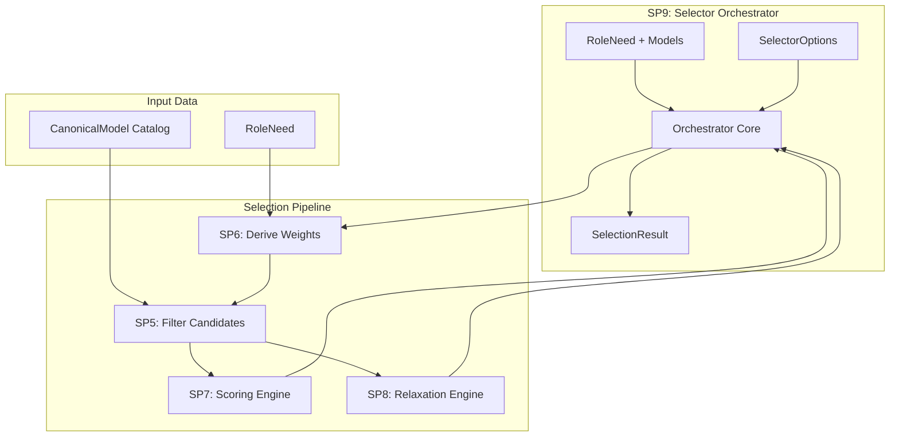
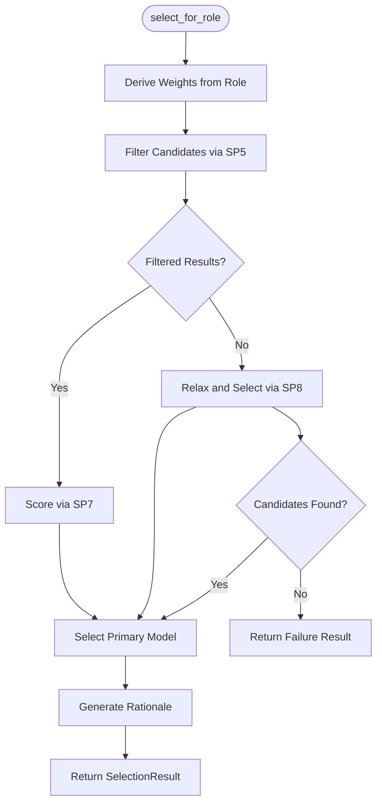
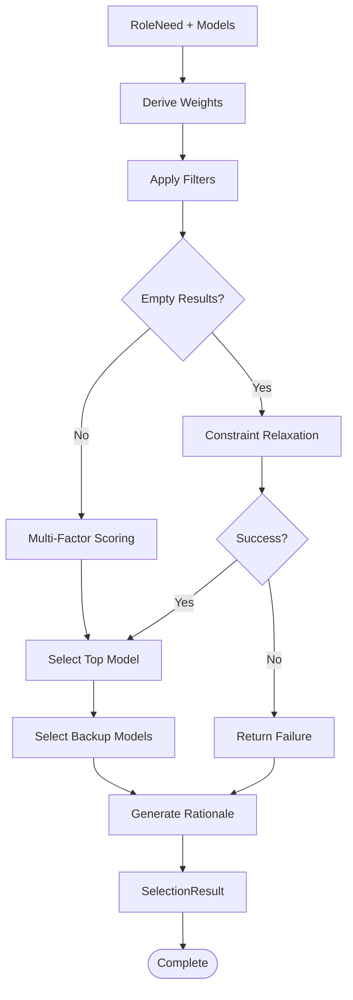
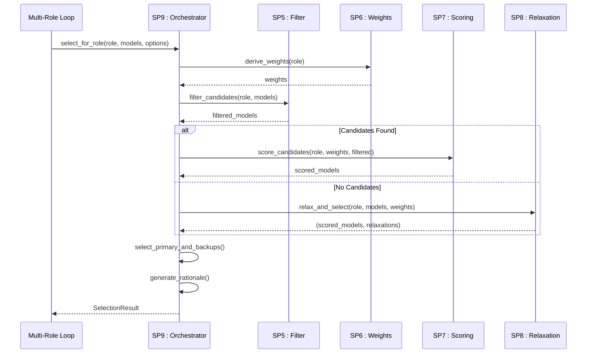
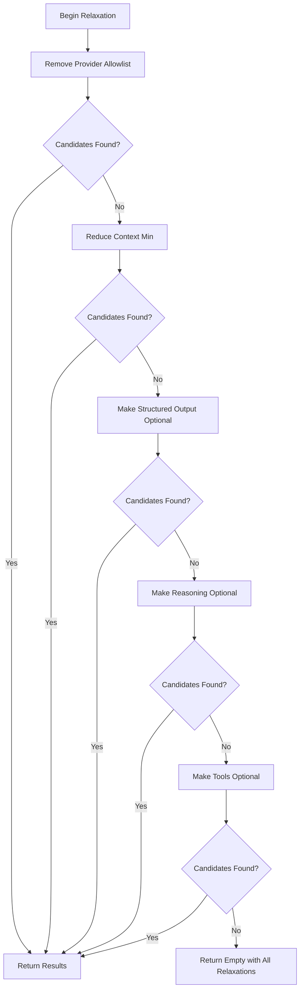

# SP9: Selector Orchestrator

<cite>
**Referenced Files in This Document**
- [orchestrator.py](file://packages/llmhub/src/llmhub/generator/sp9_selector_orchestrator/orchestrator.py)
- [models.py](file://packages/llmhub/src/llmhub/generator/sp9_selector_orchestrator/models.py)
- [spec.md](file://packages/llmhub/src/llmhub/generator/sp9_selector_orchestrator/spec.md)
- [relaxer.py](file://packages/llmhub/src/llmhub/generator/sp8_relaxation_engine/relaxer.py)
- [filter.py](file://packages/llmhub/src/llmhub/generator/sp5_filter_candidates/filter.py)
- [calculator.py](file://packages/llmhub/src/llmhub/generator/sp6_weights/calculator.py)
- [scorer.py](file://packages/llmhub/src/llmhub/generator/sp7_scoring_engine/scorer.py)
- [models.py](file://packages/llmhub/src/llmhub/generator/sp3_needs_schema/models.py)
- [__init__.py](file://packages/llmhub/src/llmhub/generator/sp9_selector_orchestrator/__init__.py)
</cite>

## Table of Contents
1. [Introduction](#introduction)
2. [Architecture Overview](#architecture-overview)
3. [Core Components](#core-components)
4. [Workflow Analysis](#workflow-analysis)
5. [Decision Logic and State Tracking](#decision-logic-and-state-tracking)
6. [Output Structure](#output-structure)
7. [Integration with Multi-Role Loop](#integration-with-multi-role-loop)
8. [Error Handling and Unresolvable Roles](#error-handling-and-unresolvable-roles)
9. [Debugging and Observability](#debugging-and-observability)
10. [Examples and Use Cases](#examples-and-use-cases)
11. [Performance Considerations](#performance-considerations)
12. [Troubleshooting Guide](#troubleshooting-guide)

## Introduction

SP9: Selector Orchestrator serves as the central coordination hub for model selection in the LLM Hub ecosystem. Acting as the main entrypoint for selecting models for individual roles, it orchestrates the complex workflow involving filtering, scoring, and optional relaxation mechanisms to ensure robust and complete model assignments.

The orchestrator coordinates four key selection subproblems: SP5 (filter candidates), SP6 (derive weights), SP7 (scoring engine), and SP8 (relaxation engine). Its primary responsibility is to manage the selection process for a single role while maintaining comprehensive observability through detailed rationale logging and state tracking.

## Architecture Overview

The SP9 Selector Orchestrator follows a pipeline architecture that seamlessly integrates with the broader LLM Hub selection framework:

**Diagram sources**
- [orchestrator.py](file://packages/llmhub/src/llmhub/generator/sp9_selector_orchestrator/orchestrator.py#L16-L109)
- [spec.md](file://packages/llmhub/src/llmhub/generator/sp9_selector_orchestrator/spec.md#L17-L26)

**Section sources**
- [orchestrator.py](file://packages/llmhub/src/llmhub/generator/sp9_selector_orchestrator/orchestrator.py#L1-L13)
- [spec.md](file://packages/llmhub/src/llmhub/generator/sp9_selector_orchestrator/spec.md#L1-L26)

## Core Components

### Orchestrator Function

The main `select_for_role()` function serves as the single entrypoint for model selection, implementing a sophisticated workflow that adapts to various constraint scenarios:

**Diagram sources**
- [orchestrator.py](file://packages/llmhub/src/llmhub/generator/sp9_selector_orchestrator/orchestrator.py#L16-L109)

### Data Models

The orchestrator utilizes two primary data models that define its interface and output structure:

#### SelectorOptions
Controls the behavior of the selection process with configurable parameters for backup selection and failure tolerance.

#### SelectionResult
Comprehensive output structure containing all selection information, rationale, and metadata for observability.

**Section sources**
- [models.py](file://packages/llmhub/src/llmhub/generator/sp9_selector_orchestrator/models.py#L1-L22)
- [orchestrator.py](file://packages/llmhub/src/llmhub/generator/sp9_selector_orchestrator/orchestrator.py#L16-L109)

## Workflow Analysis

### Stage 1: Weight Derivation (SP6 Integration)

The orchestrator begins by deriving scoring weights from the RoleNeed specification, establishing the relative importance of different model attributes:

- **Quality bias** influences the emphasis on model performance and reputation
- **Cost bias** balances economic considerations against capabilities
- **Task-specific adjustments** based on role characteristics (reasoning, creative, factual)
- **Importance scaling** that boosts quality weights for critical roles
- **Tier preference alignment** that prioritizes preferred model qualities
- **Context requirement influence** that emphasizes appropriate context windows
- **Latency sensitivity adjustment** that reduces cost weight for high-latency-sensitive tasks

### Stage 2: Candidate Filtering (SP5 Integration)

Models undergo comprehensive filtering against hard constraints defined in the RoleNeed:

- **Provider constraints** (allowlist/blocklist) controlling available providers
- **Model denials** preventing specific models from consideration
- **Capability requirements** ensuring models support required features
- **Modalities** verifying input/output capability alignment
- **Context requirements** ensuring adequate context window sizes

### Stage 3: Scoring and Ranking (SP7 Integration)

When candidates remain after filtering, they undergo multi-factor scoring:

- **Quality computation** combining tier ratings and arena performance
- **Cost evaluation** normalizing cost tiers to scoring scale
- **Reasoning assessment** evaluating chain-of-thought capabilities
- **Creative capability** measuring creative output potential
- **Context scoring** assessing context window adequacy
- **Freshness calculation** considering model recency and updates
- **Weighted aggregation** creating final composite scores
- **Tie-breaking** using provider allowlist membership, arena scores, and model identifiers

### Stage 4: Relaxation (SP8 Integration)

When filtering produces no candidates, the orchestrator systematically relaxes constraints:

1. **Provider allowlist removal** expanding provider availability
2. **Context minimum reduction** lowering context requirements by 25%
3. **Structured output conversion** turning strict requirements into preferences
4. **Reasoning requirement relaxation** making reasoning optional
5. **Tools requirement adjustment** converting tool requirements to preferences

Each relaxation step is recorded for transparency and enables comprehensive rationale generation.

**Section sources**
- [orchestrator.py](file://packages/llmhub/src/llmhub/generator/sp9_selector_orchestrator/orchestrator.py#L32-L46)
- [calculator.py](file://packages/llmhub/src/llmhub/generator/sp6_weights/calculator.py#L10-L73)
- [filter.py](file://packages/llmhub/src/llmhub/generator/sp5_filter_candidates/filter.py#L11-L73)
- [scorer.py](file://packages/llmhub/src/llmhub/generator/sp7_scoring_engine/scorer.py#L123-L166)
- [relaxer.py](file://packages/llmhub/src/llmhub/generator/sp8_relaxation_engine/relaxer.py#L15-L87)

## Decision Logic and State Tracking

### Primary Selection Logic

The orchestrator implements a sophisticated decision tree that adapts to different constraint scenarios:

**Diagram sources**
- [orchestrator.py](file://packages/llmhub/src/llmhub/generator/sp9_selector_orchestrator/orchestrator.py#L38-L71)

### State Management

The orchestrator maintains several key state variables throughout the selection process:

- **Primary model identification** tracking the highest-scoring candidate
- **Backup selection** managing up to N backup models based on configuration
- **Relaxation tracking** recording all constraint relaxation steps applied
- **Score normalization** maintaining floating-point precision for comparative analysis
- **Provider information** preserving canonical model identifiers and provider details

### Termination Conditions

The selection process implements multiple termination conditions:

1. **Successful primary selection** when candidates remain after filtering
2. **Relaxation completion** when all constraint relaxation steps have been attempted
3. **Failure condition** when no viable models exist even after full relaxation
4. **Configuration-driven requirements** enforcing primary model presence when required

**Section sources**
- [orchestrator.py](file://packages/llmhub/src/llmhub/generator/sp9_selector_orchestrator/orchestrator.py#L48-L71)

## Output Structure

### SelectionResult Schema

The orchestrator produces a comprehensive SelectionResult that encapsulates all selection information:

| Field | Type | Description |
|-------|------|-------------|
| `role_id` | `str` | Unique identifier of the target role |
| `primary` | `Optional[str]` | Canonical ID of selected primary model |
| `primary_provider` | `Optional[str]` | Provider of primary model |
| `primary_model` | `Optional[str]` | Model ID of primary model |
| `primary_score` | `Optional[float]` | Final composite score (0.0-1.0) |
| `backups` | `List[str]` | List of backup model canonical IDs |
| `rationale` | `Optional[str]` | Human-readable explanation of selection |
| `relaxations_applied` | `List[str]` | List of constraint relaxation steps |

### Rationale Generation

The orchestrator generates detailed rationales that provide transparency into the selection process:

- **Selection confirmation** stating the chosen model and its score
- **Relaxation acknowledgment** documenting any constraint relaxation applied
- **Factor analysis** highlighting the dominant scoring factors (>20% weight)
- **Backup information** indicating available backup options
- **Score interpretation** providing context for the selection decision

**Section sources**
- [models.py](file://packages/llmhub/src/llmhub/generator/sp9_selector_orchestrator/models.py#L12-L22)
- [orchestrator.py](file://packages/llmhub/src/llmhub/generator/sp9_selector_orchestrator/orchestrator.py#L73-L109)

## Integration with Multi-Role Loop

### Role Coordination

SP9 operates within a larger multi-role selection framework where multiple roles are processed sequentially:

**Diagram sources**
- [orchestrator.py](file://packages/llmhub/src/llmhub/generator/sp9_selector_orchestrator/orchestrator.py#L16-L109)

### State Propagation

The orchestrator maintains state consistency across role processing:

- **Shared model catalog** enabling efficient reuse across role selections
- **Configuration inheritance** allowing role-specific customization
- **Error isolation** ensuring failures in one role don't affect others
- **Resource optimization** minimizing redundant computations across roles

### Batch Processing Considerations

While SP9 handles individual role selection, the multi-role loop manages batch processing:

- **Parallel execution** enabling concurrent role processing when appropriate
- **Resource management** coordinating memory and computational resources
- **Consistency guarantees** ensuring reproducible results across runs
- **Progress tracking** monitoring selection progress across all roles

**Section sources**
- [spec.md](file://packages/llmhub/src/llmhub/generator/sp9_selector_orchestrator/spec.md#L284-L295)

## Error Handling and Unresolvable Roles

### Failure Modes

The orchestrator implements comprehensive error handling for various failure scenarios:

#### No Candidates After Filtering
When filtering eliminates all models, the orchestrator attempts systematic relaxation:

- **Provider expansion** removing restrictive provider constraints
- **Context reduction** lowering minimum context requirements
- **Capability relaxation** converting strict requirements to preferences
- **Complete relaxation** exhausting all relaxation possibilities

#### No Solutions After Relaxation
When all relaxation steps fail to produce candidates:

**Diagram sources**
- [relaxer.py](file://packages/llmhub/src/llmhub/generator/sp8_relaxation_engine/relaxer.py#L15-L87)

#### Configuration Errors
The orchestrator validates inputs and handles configuration issues:

- **Role validation** ensuring RoleNeed compliance with schema
- **Model catalog verification** confirming model availability and compatibility
- **Option validation** checking SelectorOptions for reasonable values
- **Fallback mechanisms** providing graceful degradation when possible

### Recovery Strategies

When roles cannot be resolved, the orchestrator implements several recovery approaches:

1. **Graceful degradation** returning partial results when possible
2. **Rationale provision** explaining why resolution failed
3. **Relaxation documentation** showing all attempted solutions
4. **Configuration suggestions** recommending adjustments for future runs

**Section sources**
- [orchestrator.py](file://packages/llmhub/src/llmhub/generator/sp9_selector_orchestrator/orchestrator.py#L64-L71)
- [relaxer.py](file://packages/llmhub/src/llmhub/generator/sp8_relaxation_engine/relaxer.py#L84-L87)

## Debugging and Observability

### Rationale Logging

The orchestrator provides comprehensive rationale logging that serves multiple purposes:

#### Selection Justification
Detailed explanations help developers understand and debug selection decisions:

- **Model identification** clearly stating which model was selected
- **Score breakdown** showing the composite score and contributing factors
- **Constraint analysis** documenting which constraints were most influential
- **Relaxation impact** explaining how relaxation affected the outcome

#### Performance Insights
Rationale logs provide insights into selection performance:

- **Filter effectiveness** showing how many models were eliminated at each stage
- **Scoring distribution** revealing score ranges and concentration patterns
- **Relaxation frequency** identifying commonly needed relaxations
- **Alternative analysis** showing why other models were not selected

### Debug Information Access

The orchestrator exposes debugging information through multiple channels:

#### Structured Output
All SelectionResult objects include comprehensive metadata:

- **Canonical identifiers** enabling precise model tracking
- **Score distributions** facilitating statistical analysis
- **Relaxation history** providing complete change log
- **Configuration context** showing input parameters

#### Runtime Monitoring
The orchestrator integrates with runtime monitoring systems:

- **Selection metrics** tracking success rates and performance
- **Constraint analysis** monitoring constraint tightness and relaxation frequency
- **Model popularity** tracking which models are selected most frequently
- **Error patterns** identifying common failure modes

### Observability Features

#### Real-time Feedback
The orchestrator provides immediate feedback during selection:

- **Progress indicators** showing selection stages completed
- **Candidate counts** displaying remaining candidates at each step
- **Score distributions** revealing scoring patterns
- **Relaxation tracking** documenting constraint modifications

#### Historical Analysis
Rationale logs enable retrospective analysis:

- **Pattern recognition** identifying recurring selection patterns
- **Performance trends** tracking improvement over time
- **Constraint effectiveness** measuring constraint impact on selection
- **Alternative exploration** understanding why different models might be selected

**Section sources**
- [orchestrator.py](file://packages/llmhub/src/llmhub/generator/sp9_selector_orchestrator/orchestrator.py#L73-L109)

## Examples and Use Cases

### Successful Selection Example

**Scenario**: A reasoning-heavy role requiring high-quality outputs with moderate cost sensitivity

**Input RoleNeed**:
- Quality bias: 0.7 (strong emphasis on quality)
- Cost bias: 0.3 (moderate cost consideration)
- Reasoning required: True
- Context minimum: 8000 tokens
- Provider allowlist: ["openai", "anthropic"]

**Selection Process**:
1. **Weight derivation**: Quality weight = 0.7, Cost weight = 0.3, Reasoning weight = 0.3
2. **Filtering**: 15 models pass initial constraints
3. **Scoring**: Models ranked by quality and reasoning capabilities
4. **Selection**: OpenAI GPT-4 selected as primary (score: 0.875)
5. **Backups**: GPT-4 Turbo, Claude-3 Sonnet selected as backups

**Rationale**: "Selected openai/gpt-4 (score: 0.875). Top factors: quality (70%), reasoning (30%). 2 backup(s) available."

### Relaxation-Triggered Path Example

**Scenario**: A creative role with strict provider preferences but limited model availability

**Input RoleNeed**:
- Quality bias: 0.5
- Cost bias: 0.5
- Creative required: True
- Provider allowlist: ["openai", "anthropic", "google"]
- Context minimum: 16000 tokens

**Selection Process**:
1. **Initial filtering**: No models meet all constraints
2. **Relaxation step 1**: Removed provider allowlist → 25 models remain
3. **Relaxation step 2**: Reduced context minimum → 42 models remain
4. **Relaxation step 3**: Made creative output optional → 67 models remain
5. **Final selection**: Gemini Pro selected as primary (score: 0.623)

**Rationale**: "Selected google/gemini-pro (score: 0.623). Applied 3 relaxation(s). Top factors: quality (50%), cost (50%)."

### Edge Case Handling Example

**Scenario**: A role with conflicting requirements that cannot be satisfied

**Input RoleNeed**:
- Quality bias: 0.9
- Cost bias: 0.9
- Reasoning required: True
- Tools required: True
- Context minimum: 100000 tokens
- Provider allowlist: ["openai"]

**Outcome**: No viable models found even after full relaxation, resulting in failure with comprehensive rationale.

**Section sources**
- [orchestrator.py](file://packages/llmhub/src/llmhub/generator/sp9_selector_orchestrator/orchestrator.py#L16-L109)

## Performance Considerations

### Computational Efficiency

The orchestrator implements several optimization strategies:

#### Early Termination
- **Candidate pruning** eliminating obviously suboptimal models early
- **Score thresholding** avoiding unnecessary calculations for low-scoring models
- **Lazy evaluation** computing scores only when necessary

#### Memory Management
- **Streaming processing** handling large model catalogs efficiently
- **Result caching** avoiding redundant computations across selections
- **Garbage collection** minimizing memory footprint during long-running processes

### Scalability Factors

#### Model Catalog Size
The orchestrator scales effectively with model catalog size:

- **Linear filtering** O(n) complexity for candidate elimination
- **Log-linear scoring** O(n log n) complexity for ranking
- **Constant relaxation** O(1) complexity for constraint relaxation

#### Role Complexity
Different role characteristics affect performance:

- **Simple roles** with few constraints process quickly
- **Complex roles** with many requirements benefit from early filtering
- **Relaxation-heavy roles** may require multiple passes through the catalog

### Resource Optimization

#### Parallel Processing Opportunities
While the current implementation is sequential, several operations could benefit from parallelization:

- **Filtering parallelization** distributing model evaluation across cores
- **Scoring parallelization** enabling concurrent score calculations
- **Relaxation parallelization** exploring multiple relaxation paths simultaneously

#### Caching Strategies
Intelligent caching can significantly improve performance:

- **Weight caching** storing computed weights for repeated roles
- **Filter cache** remembering filtered results for similar constraints
- **Score cache** preserving computed scores for unchanged models

## Troubleshooting Guide

### Common Issues and Solutions

#### Issue: No models selected despite available candidates
**Symptoms**: Empty primary field with rationale indicating no candidates found
**Causes**: 
- Overly restrictive constraints in RoleNeed
- Model catalog inconsistencies
- Scoring algorithm edge cases

**Solutions**:
1. Review RoleNeed constraints for合理性
2. Check model catalog for completeness
3. Enable relaxation options to explore alternatives
4. Examine rationale for constraint violation details

#### Issue: Poor selection quality despite high scores
**Symptoms**: Selected models don't match expectations despite good scores
**Causes**:
- Misaligned weight priorities
- Inadequate model representation in catalog
- Scoring algorithm limitations

**Solutions**:
1. Adjust RoleNeed bias values
2. Update model catalog with better representatives
3. Review scoring weights derivation
4. Consider custom scoring criteria

#### Issue: Excessive relaxation leading to suboptimal choices
**Symptoms**: Many relaxation steps applied with poor final results
**Causes**:
- Too restrictive initial constraints
- Insufficient model diversity in catalog
- Conflicting requirement priorities

**Solutions**:
1. Relax initial constraints gradually
2. Expand model catalog coverage
3. Rebalance requirement priorities
4. Implement constraint validation

### Diagnostic Tools

#### Rationale Analysis
Examine SelectionResult.rationale for:
- Constraint violation patterns
- Relaxation effectiveness
- Score distribution insights
- Alternative model comparisons

#### Performance Monitoring
Track:
- Selection duration across different scenarios
- Relaxation frequency by constraint type
- Candidate elimination rates
- Score variance across selections

#### Configuration Validation
Verify:
- RoleNeed schema compliance
- Model catalog completeness
- Weight derivation logic
- Relaxation step effectiveness

### Best Practices

#### Role Specification
- Use realistic constraints that reflect actual requirements
- Balance competing priorities appropriately
- Test with representative model catalogs
- Document rationale for constraint choices

#### Monitoring and Maintenance
- Regularly review selection patterns
- Monitor relaxation frequency trends
- Update model catalogs with new offerings
- Validate scoring weights periodically

#### Development Guidelines
- Enable comprehensive logging for debugging
- Use representative test datasets
- Validate edge cases thoroughly
- Document selection rationale patterns

**Section sources**
- [orchestrator.py](file://packages/llmhub/src/llmhub/generator/sp9_selector_orchestrator/orchestrator.py#L64-L71)
- [models.py](file://packages/llmhub/src/llmhub/generator/sp9_selector_orchestrator/models.py#L6-L10)