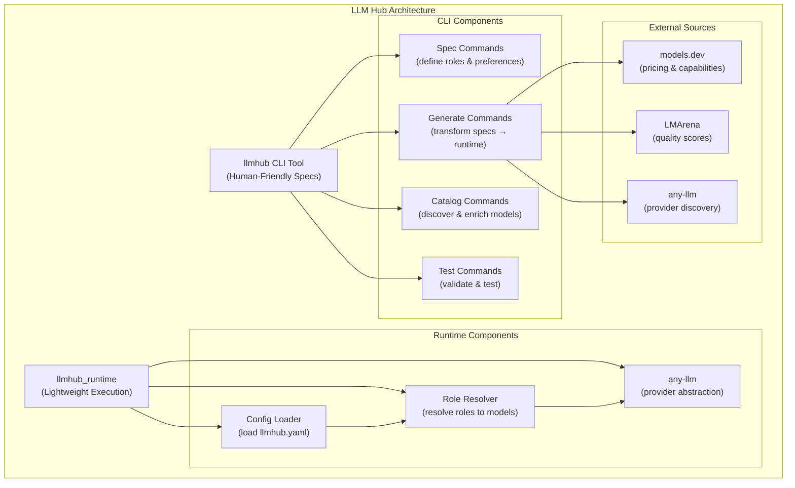
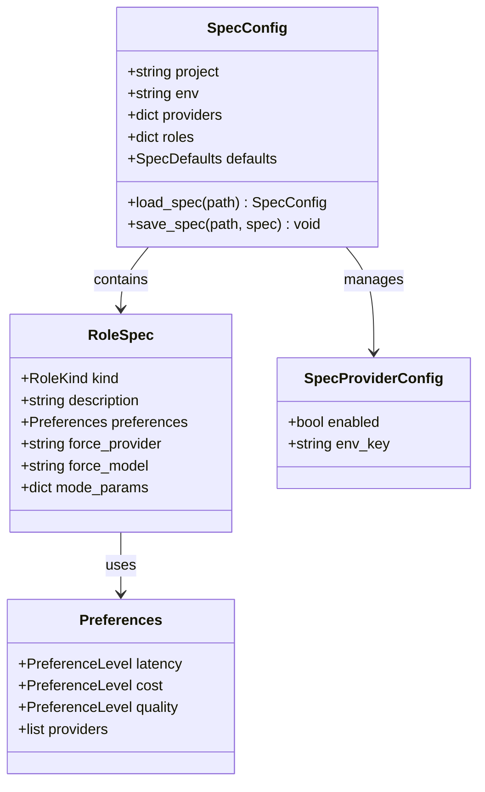
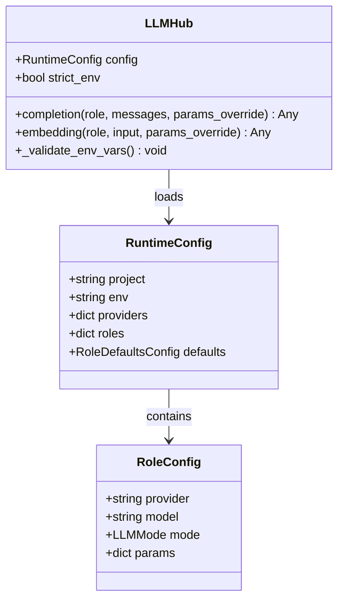
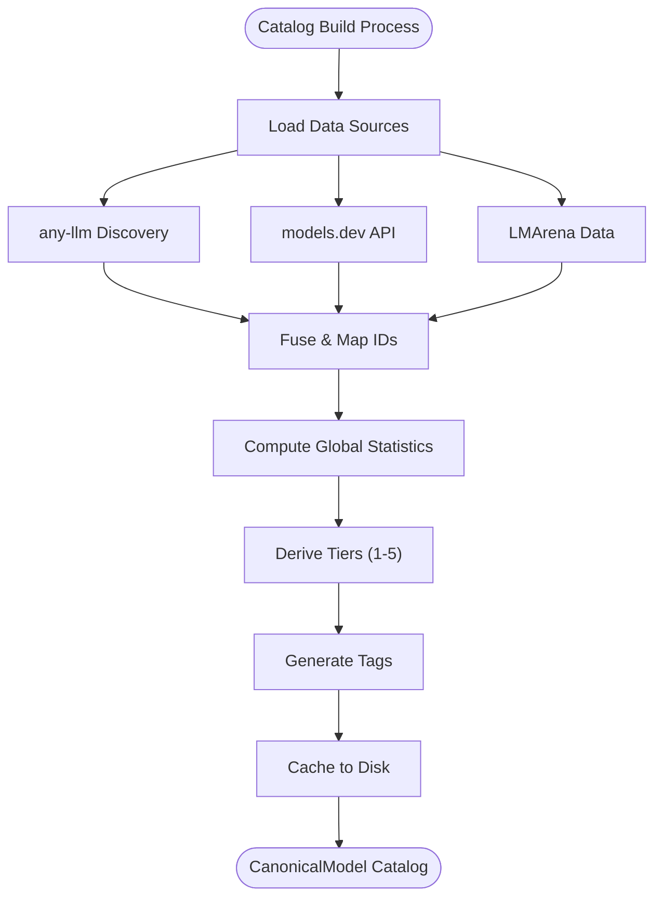
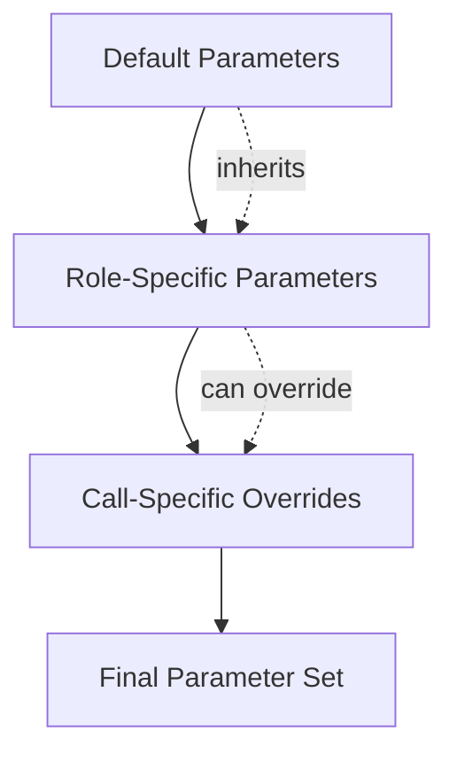
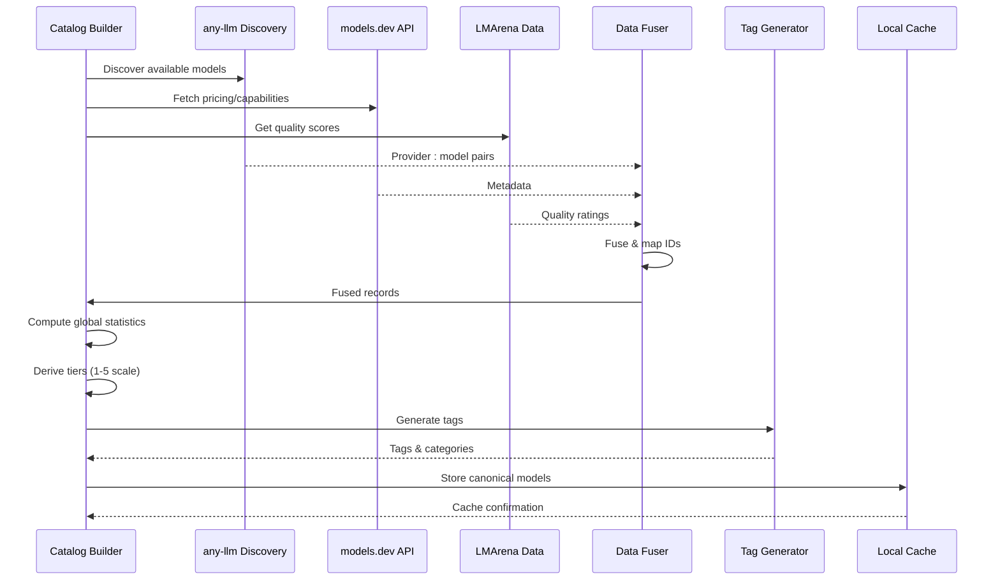

# Introduction

<cite>
**Referenced Files in This Document**
- [README.md](file://README.md)
- [packages/llmhub/README.md](file://packages/llmhub/README.md)
- [packages/llmhub_runtime/README.md](file://packages/llmhub_runtime/README.md)
- [packages/llmhub/src/llmhub/cli.py](file://packages/llmhub/src/llmhub/cli.py)
- [packages/llmhub_runtime/src/llmhub_runtime/hub.py](file://packages/llmhub_runtime/src/llmhub_runtime/hub.py)
- [packages/llmhub/src/llmhub/generator/spec.md](file://packages/llmhub/src/llmhub/generator/spec.md)
- [packages/llmhub/src/llmhub/catalog/schema.py](file://packages/llmhub/src/llmhub/catalog/schema.py)
- [packages/llmhub/src/llmhub/spec_models.py](file://packages/llmhub/src/llmhub/spec_models.py)
- [packages/llmhub_runtime/src/llmhub_runtime/models.py](file://packages/llmhub_runtime/src/llmhub_runtime/models.py)
- [packages/llmhub/src/llmhub/commands/setup_cmd.py](file://packages/llmhub/src/llmhub/commands/setup_cmd.py)
- [packages/llmhub/src/llmhub/commands/runtime_cmd.py](file://packages/llmhub/src/llmhub/commands/runtime_cmd.py)
- [packages/llmhub/src/llmhub/context.py](file://packages/llmhub/src/llmhub/context.py)
</cite>

## Table of Contents
1. [What is LLM Hub?](#what-is-llm-hub)
2. [Core Value Proposition](#core-value-proposition)
3. [Architecture Overview](#architecture-overview)
4. [Key Components](#key-components)
5. [Declarative Configuration System](#declarative-configuration-system)
6. [Role-Based LLM Access](#role-based-llm-access)
7. [Integration with External Sources](#integration-with-external-sources)
8. [Production-Ready Features](#production-ready-features)
9. [Getting Started](#getting-started)
10. [Benefits for Developers](#benefits-for-developers)

## What is LLM Hub?

LLM Hub is a production-grade system for managing large language models (LLMs) through declarative configuration rather than hardcoded provider/model names. It provides a unified runtime that resolves logical "roles" to actual LLM providers and models, plus a sophisticated catalog system that enriches models with cost, quality, and capability metadata.

### The Problem LLM Hub Solves

Before LLM Hub, developers faced significant challenges in LLM application development:

**Traditional Approach:**
```python
response = openai.chat.completions.create(
    model="gpt-4o",
    messages=[...]
)
```

**Problems with Traditional Approach:**
- ❌ Models hardcoded across multiple files
- ❌ Inconsistent parameters for same use case
- ❌ Hard to swap providers (OpenAI → Anthropic)
- ❌ Different configs for dev/staging/prod environments
- ❌ No central config management

**LLM Hub Solution:**
```python
response = hub.completion(
    role="llm.inference",
    messages=[...]
)
```

**Benefits of LLM Hub:**
- ✅ One config file, consistent behavior
- ✅ Swap models by editing YAML (no code changes)
- ✅ Environment-specific configs (dev/prod)
- ✅ Version controlled LLM decisions
- ✅ Easy testing and validation

**Section sources**
- [README.md](file://README.md#L11-L34)
- [packages/llmhub/README.md](file://packages/llmhub/README.md#L14-L42)

## Core Value Proposition

LLM Hub fundamentally addresses the challenge of making model selection a configuration concern, not a code concern. Instead of scattering hardcoded provider/model combinations throughout your codebase, you define logical roles in a declarative specification file, and LLM Hub handles the resolution and execution.

### Decoupling Business Logic from Model Implementation

LLM Hub enables you to write application code that references logical roles ("preprocess", "inference", "embedding") rather than vendor-specific model strings. This decoupling provides several strategic advantages:

- **Flexibility**: Swap models without touching application code
- **Consistency**: Ensure uniform behavior across your application
- **Maintainability**: Centralized configuration management
- **Testability**: Easy mocking and testing with different models

### Config-Driven Model Selection

The system operates on the principle that model selection should be driven by configuration rather than hardcoded values. This approach enables:

- **A/B Testing**: Easily compare different models side-by-side
- **Environment-Specific Selection**: Use different models for different environments
- **Cost Optimization**: Automatically select cost-effective models where appropriate
- **Quality Assurance**: Gradually roll out new models with fallback mechanisms

**Section sources**
- [README.md](file://README.md#L35-L41)

## Architecture Overview

LLM Hub follows a modular architecture with clear separation between concerns, consisting of two primary components: the CLI tool (`llmhub`) and the lightweight runtime library (`llmhub_runtime`).



**Diagram sources**
- [packages/llmhub/src/llmhub/cli.py](file://packages/llmhub/src/llmhub/cli.py#L1-L67)
- [packages/llmhub_runtime/src/llmhub_runtime/hub.py](file://packages/llmhub_runtime/src/llmhub_runtime/hub.py#L1-L189)

### Separation Between CLI Tool and Runtime Library

The architecture deliberately separates the human-facing CLI tool from the machine-executable runtime library:

**CLI Tool (`llmhub`)**:
- Human-friendly specification files (`llmhub.spec.yaml`)
- Sophisticated model selection algorithms
- Catalog enrichment and caching
- Comprehensive validation and testing
- Interactive setup and configuration

**Runtime Library (`llmhub_runtime`)**:
- Lightweight execution engine
- Minimal dependencies
- Provider-agnostic design
- Role-centric API
- Hooks for observability

This separation ensures that the runtime remains lean and focused on execution, while the CLI provides the sophisticated configuration and generation capabilities.

**Section sources**
- [packages/llmhub/README.md](file://packages/llmhub/README.md#L8-L11)
- [packages/llmhub_runtime/README.md](file://packages/llmhub_runtime/README.md#L1-L10)

## Key Components

### 1. Specification Layer (Human-Friendly)

The specification layer defines what you want from your LLMs through declarative YAML files. This layer operates independently of specific providers and focuses on logical requirements.



**Diagram sources**
- [packages/llmhub/src/llmhub/spec_models.py](file://packages/llmhub/src/llmhub/spec_models.py#L44-L66)

### 2. Runtime Layer (Machine-Executable)

The runtime layer executes the resolved configurations, handling provider-specific logic through the `any-llm` abstraction layer.



**Diagram sources**
- [packages/llmhub_runtime/src/llmhub_runtime/models.py](file://packages/llmhub_runtime/src/llmhub_runtime/models.py#L28-L41)
- [packages/llmhub_runtime/src/llmhub_runtime/hub.py](file://packages/llmhub_runtime/src/llmhub_runtime/hub.py#L17-L51)

### 3. Catalog System (Intelligence Layer)

The catalog system serves as the intelligence layer, combining multiple data sources to build a comprehensive model database.



**Diagram sources**
- [packages/llmhub/src/llmhub/catalog/schema.py](file://packages/llmhub/src/llmhub/catalog/schema.py#L68-L122)

**Section sources**
- [packages/llmhub/src/llmhub/spec_models.py](file://packages/llmhub/src/llmhub/spec_models.py#L1-L131)
- [packages/llmhub_runtime/src/llmhub_runtime/models.py](file://packages/llmhub_runtime/src/llmhub_runtime/models.py#L1-L41)
- [packages/llmhub/src/llmhub/catalog/schema.py](file://packages/llmhub/src/llmhub/catalog/schema.py#L1-L122)

## Declarative Configuration System

LLM Hub's declarative configuration system operates through two complementary files that serve different purposes in the development lifecycle.

### Spec File (`llmhub.spec.yaml`)

The spec file is the human-facing specification that declares your project's LLM needs. It contains:

- **Project Metadata**: Name, environment, and basic configuration
- **Provider Configuration**: Enabled providers and their API key variables
- **Role Definitions**: Logical roles with preferences and constraints
- **Default Settings**: Fallback configurations for roles

**Key Features:**
- Natural language role descriptions
- Preference-based model selection hints (cost, latency, quality)
- Provider allowlists and blocklists
- Environment-specific configurations
- Parameter overrides for specific roles

### Runtime Config (`llmhub.yaml`)

The runtime config is the machine-facing configuration generated from the spec. It contains:

- **Concrete Provider/Model Assignments**: Specific provider and model combinations
- **Optimized Parameters**: Tuned parameters for each role
- **Environment Variables**: Provider-specific API key references
- **Mode Specifications**: Chat, embedding, or other LLM modes

**Key Features:**
- Deterministic generation from specs
- Optimized for runtime performance
- Minimal dependencies and overhead
- Ready for production deployment

### Transition from Spec to Runtime

The transformation from spec to runtime involves sophisticated model selection algorithms that consider:

1. **Preference Matching**: Align models with cost, latency, and quality preferences
2. **Capability Filtering**: Ensure models support required features (tool calling, vision, etc.)
3. **Provider Constraints**: Respect provider allowlists and blocklists
4. **Fallback Mechanisms**: Provide backup models for reliability
5. **Tuning Parameters**: Optimize model parameters for specific use cases

**Section sources**
- [README.md](file://README.md#L363-L499)
- [packages/llmhub/src/llmhub/generator/spec.md](file://packages/llmhub/src/llmhub/generator/spec.md#L1-L93)

## Role-Based LLM Access

Role-based access is at the heart of LLM Hub's design philosophy, providing a clean abstraction layer between your application logic and LLM implementation details.

### The Role Abstraction

Instead of calling specific models directly, you call logical roles that represent the function your application needs:

```python
# ❌ Tightly coupled approach
response = openai.chat.completions.create(
    model="gpt-4",
    messages=[...],
    temperature=0.7,
    max_tokens=1000
)

# ✅ Loosely coupled approach
response = hub.completion(
    role="llm.inference",
    messages=[...]
)
```

### Benefits of Role-Based Access

**For Application Developers:**
- **Cleaner Code**: No provider/model strings in business logic
- **Consistent Behavior**: Uniform parameters across the application
- **Easier Testing**: Mock different models for unit tests
- **Environment Flexibility**: Different models per environment

**For Operations Teams:**
- **Zero-Downtime Updates**: Change models without redeployment
- **Cost Control**: Gradual rollout of expensive models
- **Performance Monitoring**: Track model performance centrally
- **Compliance**: Standardize model usage across teams

### Role Definition Structure

Each role in LLM Hub represents a specific function within your application:

| Component | Description | Example |
|-----------|-------------|---------|
| **Role Name** | Hierarchical identifier | `llm.preprocess`, `llm.inference`, `llm.embedding` |
| **Kind** | LLM mode/type | `chat`, `embedding`, `image`, `audio`, `tool` |
| **Description** | Natural language purpose | "Main reasoning model for answering questions" |
| **Preferences** | Selection criteria | Cost: low, Quality: high, Latency: medium |
| **Parameters** | Default configuration | Temperature: 0.7, Max tokens: 2048 |

### Parameter Resolution

LLM Hub implements a sophisticated parameter resolution system that allows for flexible configuration:



**Diagram sources**
- [packages/llmhub_runtime/src/llmhub_runtime/hub.py](file://packages/llmhub_runtime/src/llmhub_runtime/hub.py#L62-L112)

**Section sources**
- [packages/llmhub/README.md](file://packages/llmhub/README.md#L180-L241)
- [packages/llmhub/src/llmhub/spec_models.py](file://packages/llmhub/src/llmhub/spec_models.py#L44-L52)

## Integration with External Sources

LLM Hub's catalog system integrates with multiple external data sources to provide comprehensive model information and enable intelligent model selection.

### Data Sources

The catalog system combines three primary data sources:

**1. any-llm (Local Discovery)**
- Probes which models are actually callable on this machine
- Uses your configured API keys to detect available models
- Provides `provider:model_id` pairs for immediate use

**2. models.dev ([https://models.dev](https://models.dev))**
- Public API with rich metadata for popular LLMs
- Provides: pricing (per million tokens), context limits, capabilities (tool calling, structured output, reasoning), modalities (text, image, audio), release dates, knowledge cutoffs

**3. LMArena arena-catalog ([https://github.com/lmarena/arena-catalog](https://github.com/lmarena/arena-catalog))**
- Crowdsourced quality scores from human evaluations
- Provides: ELO-style ratings, confidence intervals, category-specific scores

### Fusion Process

The catalog builder implements a sophisticated fusion process:



**Diagram sources**
- [packages/llmhub/src/llmhub/catalog/schema.py](file://packages/llmhub/src/llmhub/catalog/schema.py#L60-L66)

### Canonical Model Schema

Each model in the catalog is represented as a `CanonicalModel` with comprehensive metadata:

| Category | Fields | Description |
|----------|--------|-------------|
| **Identity** | `canonical_id`, `provider`, `model_id`, `family`, `display_name` | Unique identification |
| **Capabilities** | `supports_reasoning`, `supports_tool_call`, `supports_structured_output`, `input_modalities`, `output_modalities` | Feature support |
| **Limits** | `context_tokens`, `max_input_tokens`, `max_output_tokens` | Capacity constraints |
| **Pricing** | `price_input_per_million`, `price_output_per_million`, `price_reasoning_per_million` | Cost information |
| **Quality** | `arena_score`, `arena_ci_low`, `arena_ci_high` | Performance metrics |
| **Metadata** | `knowledge_cutoff`, `release_date`, `last_updated`, `open_weights`, `tags` | Additional info |

### Caching Strategy

The catalog implements intelligent caching to balance freshness with performance:

- **Cache Location**: Platform-specific directories (`~/.config/llmhub/catalog.json`)
- **Default TTL**: 24 hours for optimal balance of freshness and performance
- **Force Refresh**: Manual refresh capability for immediate updates
- **Automatic Updates**: Background updates during generation process

**Section sources**
- [README.md](file://README.md#L284-L347)
- [packages/llmhub/src/llmhub/catalog/schema.py](file://packages/llmhub/src/llmhub/catalog/schema.py#L1-L122)

## Production-Ready Features

LLM Hub is designed with production deployments in mind, incorporating numerous enterprise-grade features that ensure reliability, observability, and maintainability.

### Environment-Specific Configurations

LLM Hub supports seamless environment-specific configurations:

```yaml
# llmhub.spec.yaml
project: my-app
env: dev

providers:
  openai:
    enabled: true
    env_key: OPENAI_API_KEY
  anthropic:
    enabled: true
    env_key: ANTHROPIC_API_KEY

roles:
  llm.inference:
    kind: chat
    description: Main reasoning model
    preferences:
      quality: high
      cost: medium
```

```yaml
# Generated llmhub.yaml (dev environment)
project: my-app
env: dev

providers:
  openai:
    env_key: OPENAI_API_KEY
  anthropic:
    env_key: ANTHROPIC_API_KEY

roles:
  llm.inference:
    provider: openai
    model: gpt-4o-mini
    mode: chat
    params:
      temperature: 0.7
      max_tokens: 2048
```

### Strict Environment Validation

Production deployments benefit from strict environment validation:

```python
# Enable strict validation for production
hub = LLMHub(config_path="llmhub.yaml", strict_env=True)
```

This feature ensures that all required API keys are present before runtime, preventing silent failures in production environments.

### Observability and Instrumentation

LLM Hub provides comprehensive observability through hook systems:

```python
def log_before(ctx):
    print(f"Calling {ctx['provider']}:{ctx['model']} for role {ctx['role']}")

def log_after(result):
    print(f"Call {'succeeded' if result['success'] else 'failed'}")

hub = LLMHub(
    config_path="llmhub.yaml",
    on_before_call=log_before,
    on_after_call=log_after
)
```

### Error Handling and Resilience

The runtime includes robust error handling:

- **Graceful Degradation**: Fallback to default models when preferred models fail
- **Retry Logic**: Built-in retry mechanisms for transient failures
- **Circuit Breakers**: Automatic disabling of failing providers
- **Detailed Logging**: Comprehensive error information for debugging

### Performance Optimization

LLM Hub incorporates numerous performance optimizations:

- **Lazy Loading**: Models loaded only when needed
- **Connection Pooling**: Efficient provider connection management
- **Response Caching**: Intelligent caching of common requests
- **Async Support**: Future async capabilities for high-throughput applications

**Section sources**
- [packages/llmhub_runtime/src/llmhub_runtime/hub.py](file://packages/llmhub_runtime/src/llmhub_runtime/hub.py#L52-L60)
- [packages/llmhub/src/llmhub/commands/runtime_cmd.py](file://packages/llmhub/src/llmhub/commands/runtime_cmd.py#L13-L70)

## Getting Started

LLM Hub provides multiple pathways for getting started, depending on your familiarity with the system and your specific needs.

### Quick Start for Beginners

For developers new to LLM Hub, the quickest path to productivity:

```bash
# 1. Initialize a project with minimal defaults
llmhub init

# 2. Set environment variables
export OPENAI_API_KEY="sk-..."

# 3. Generate runtime configuration
llmhub generate

# 4. Test your setup
llmhub test

# 5. Use in your application
from llmhub_runtime import LLMHub

hub = LLMHub(config_path="llmhub.yaml")
response = hub.completion(
    role="llm.inference",
    messages=[{"role": "user", "content": "Hello!"}]
)
```

### Interactive Setup for Exploration

For teams wanting to explore LLM Hub's capabilities:

```bash
# Interactive setup with guided questions
llmhub setup

# Follow the prompts to:
# - Choose providers (OpenAI, Anthropic, Gemini, etc.)
# - Define standard roles (preprocess, inference, embedding, tools)
# - Set preferences for each role
# - Configure environment variables
```

### Advanced Configuration

For production deployments and complex requirements:

```bash
# Generate with explanations
llmhub generate --explain

# Dry-run to preview changes
llmhub generate --dry-run

# Force regeneration with specific options
llmhub generate --force --no-llm
```

### Integration Patterns

LLM Hub supports various integration patterns:

**Single Application:**
```python
from llmhub_runtime import LLMHub

hub = LLMHub(config_path="llmhub.yaml")
# Use consistently across your application
```

**Multi-Service Architecture:**
```python
# Service 1
hub_service1 = LLMHub(config_path="service1.llmhub.yaml")

# Service 2  
hub_service2 = LLMHub(config_path="service2.llmhub.yaml")
```

**Environment-Specific Deployment:**
```python
import os
env = os.getenv("ENVIRONMENT", "development")
config_path = f"llmhub.{env}.yaml"
hub = LLMHub(config_path=config_path)
```

**Section sources**
- [README.md](file://README.md#L148-L282)
- [packages/llmhub/src/llmhub/commands/setup_cmd.py](file://packages/llmhub/src/llmhub/commands/setup_cmd.py#L16-L119)

## Benefits for Developers

LLM Hub delivers substantial benefits across different developer personas and use cases.

### For Application Developers

**Code Quality Improvements:**
- Elimination of hardcoded provider/model strings
- Consistent parameter usage across the application
- Cleaner separation of concerns between business logic and LLM implementation
- Reduced cognitive load for team members

**Development Efficiency:**
- Rapid prototyping with different models
- Easy experimentation with A/B testing
- Seamless switching between providers
- Centralized configuration management

**Testing and Debugging:**
- Easy mocking and stubbing for unit tests
- Consistent behavior across different environments
- Comprehensive logging and observability
- Automated validation and health checks

### For DevOps and Infrastructure Teams

**Operational Excellence:**
- Zero-downtime model switching
- Centralized monitoring and alerting
- Automated cost optimization
- Compliance and audit trails

**Scalability and Reliability:**
- Automatic fallback mechanisms
- Intelligent load balancing
- Circuit breaker patterns
- Graceful degradation under load

**Security and Governance:**
- Centralized API key management
- Provider-specific access controls
- Audit logging for all LLM calls
- Policy enforcement for model usage

### For Product Teams

**Business Agility:**
- Rapid model experimentation
- Cost-effective A/B testing
- Data-driven model selection
- Performance optimization based on real usage

**Competitive Advantage:**
- Faster time-to-market for new features
- Better user experiences through optimal model selection
- Cost savings through intelligent model routing
- Enhanced reliability and uptime

### For Organizations

**Strategic Benefits:**
- Standardization across teams and projects
- Reduced technical debt from LLM integration
- Improved collaboration between development and operations
- Better ROI on LLM investments

**Technical Benefits:**
- Reduced complexity in LLM management
- Improved maintainability of LLM-dependent applications
- Better resource utilization and cost control
- Enhanced security posture for AI applications

LLM Hub transforms LLM integration from a technical challenge into a strategic advantage, enabling organizations to harness the full potential of large language models while maintaining operational excellence and developer productivity.