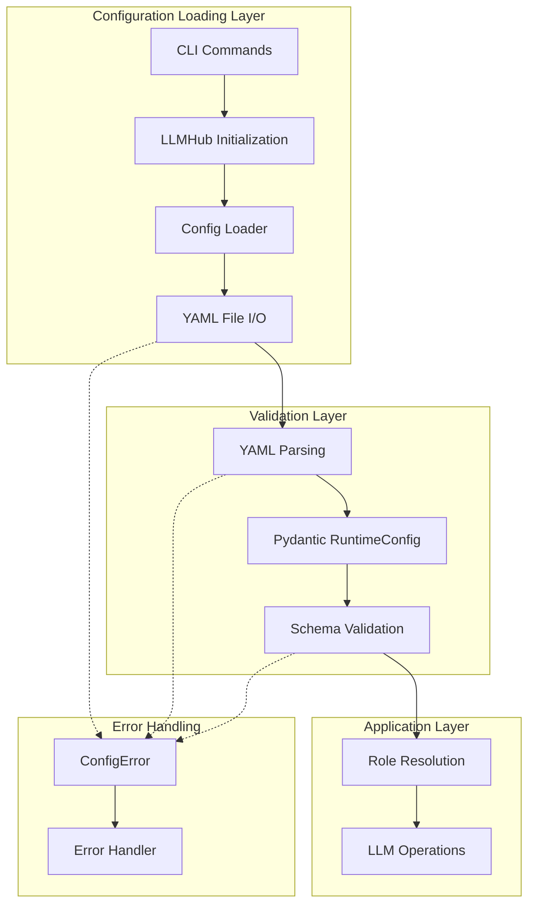
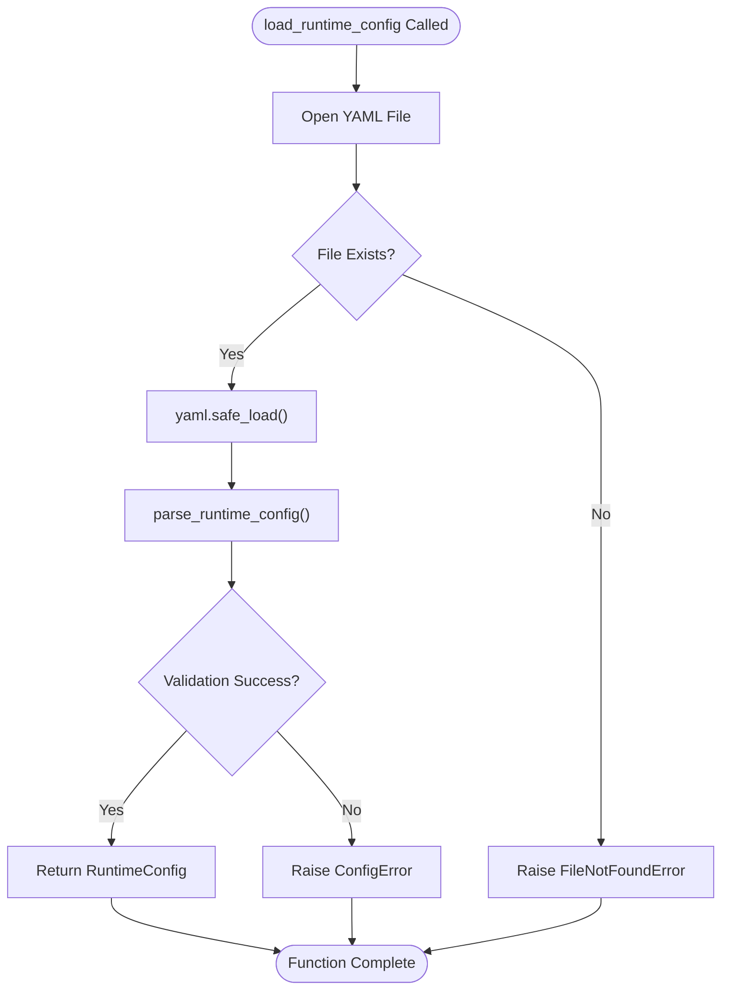
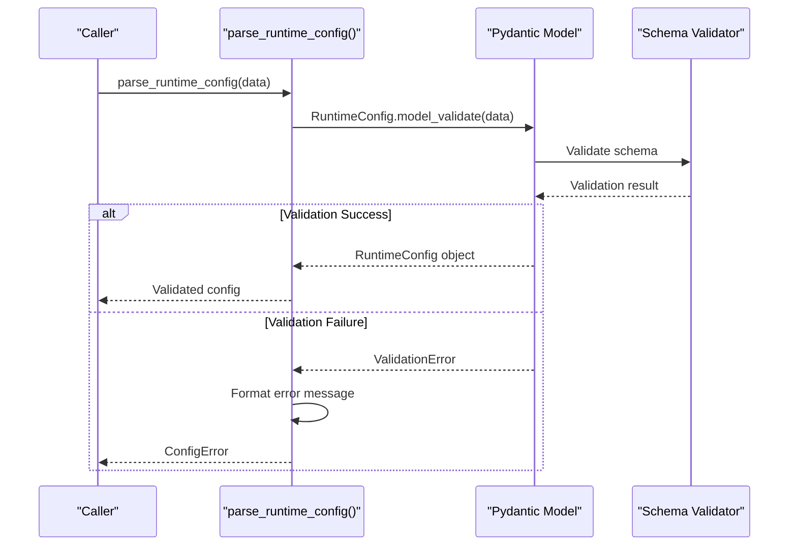
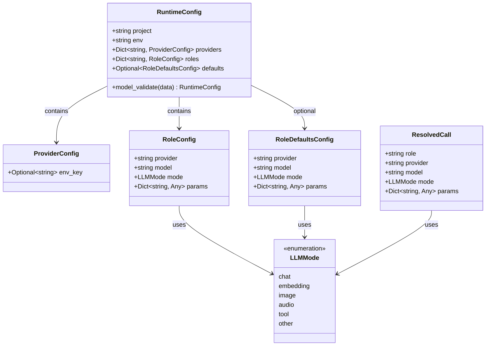
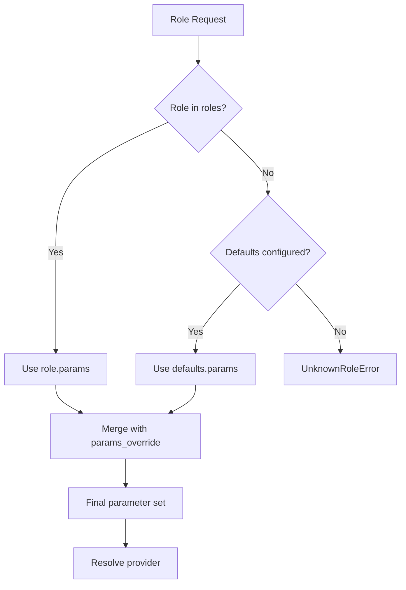
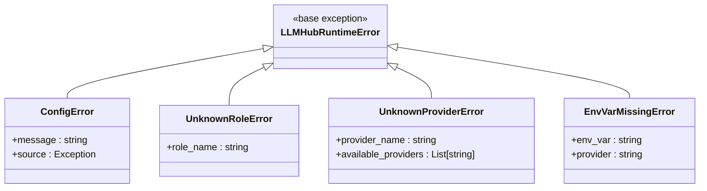
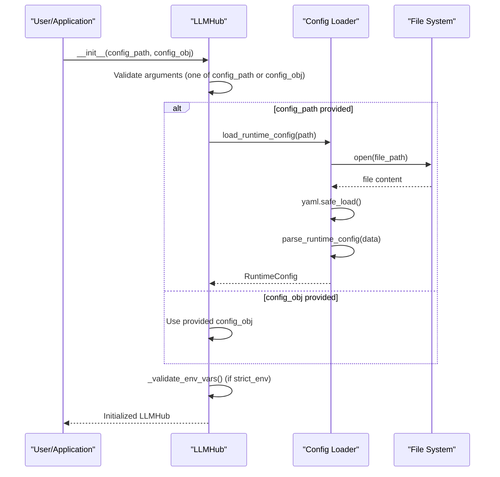
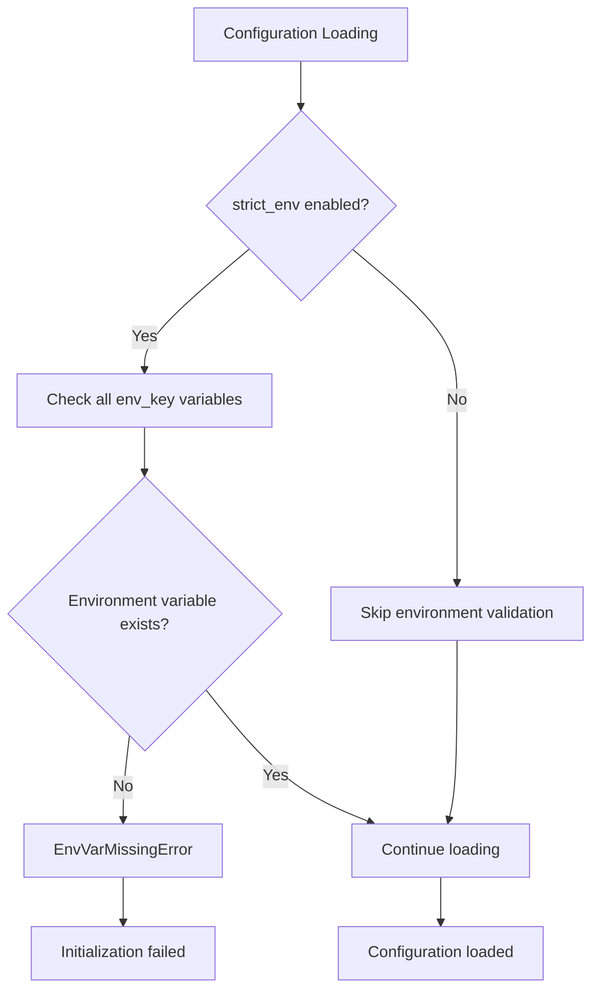
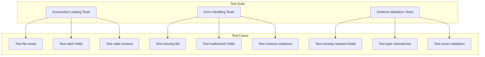

# Configuration Loading

<cite>
**Referenced Files in This Document**
- [config_loader.py](file://packages/llmhub_runtime/src/llmhub_runtime/config_loader.py)
- [models.py](file://packages/llmhub_runtime/src/llmhub_runtime/models.py)
- [hub.py](file://packages/llmhub_runtime/src/llmhub_runtime/hub.py)
- [errors.py](file://packages/llmhub_runtime/src/llmhub_runtime/errors.py)
- [resolver.py](file://packages/llmhub_runtime/src/llmhub_runtime/resolver.py)
- [runtime_io.py](file://packages/llmhub/src/llmhub/runtime_io.py)
- [llmhub.yaml](file://packages/llmhub_runtime/tests/fixtures/llmhub.yaml)
- [test_config_loader.py](file://packages/llmhub_runtime/tests/test_config_loader.py)
- [runtime_cmd.py](file://packages/llmhub/src/llmhub/commands/runtime_cmd.py)
</cite>

## Table of Contents
1. [Introduction](#introduction)
2. [Configuration Loading Architecture](#configuration-loading-architecture)
3. [Core Functions](#core-functions)
4. [RuntimeConfig Data Model](#runtimeconfig-data-model)
5. [Error Handling](#error-handling)
6. [Integration with LLMHub](#integration-with-llmhub)
7. [Security Considerations](#security-considerations)
8. [Configuration Examples](#configuration-examples)
9. [Testing and Validation](#testing-and-validation)
10. [Best Practices](#best-practices)

## Introduction

The configuration loading mechanism in `llmhub_runtime` provides a robust system for managing LLM provider configurations, role definitions, and runtime parameters. This system enables applications to dynamically configure AI model providers, manage role-based access patterns, and handle environment-specific settings through YAML-based configuration files validated against Pydantic models.

The configuration system serves as the foundation for the LLMHub runtime, enabling flexible deployment scenarios from development environments to production systems while maintaining type safety and validation guarantees.

## Configuration Loading Architecture

The configuration loading system follows a layered architecture that separates concerns between file I/O, data validation, and business logic:



**Diagram sources**
- [config_loader.py](file://packages/llmhub_runtime/src/llmhub_runtime/config_loader.py#L6-L43)
- [hub.py](file://packages/llmhub_runtime/src/llmhub_runtime/hub.py#L18-L60)
- [runtime_io.py](file://packages/llmhub/src/llmhub/runtime_io.py#L11-L33)

## Core Functions

### load_runtime_config()

The `load_runtime_config()` function serves as the primary entry point for loading configuration from YAML files. It handles file I/O operations and delegates validation to the parsing function.



**Diagram sources**
- [config_loader.py](file://packages/llmhub_runtime/src/llmhub_runtime/config_loader.py#L6-L24)

Key characteristics of `load_runtime_config()`:
- **File Access**: Opens YAML files securely using Python's built-in file handling
- **YAML Parsing**: Uses `yaml.safe_load()` to prevent arbitrary code execution
- **Error Propagation**: Wraps all exceptions in `ConfigError` with descriptive messages
- **Type Safety**: Returns validated `RuntimeConfig` objects

**Section sources**
- [config_loader.py](file://packages/llmhub_runtime/src/llmhub_runtime/config_loader.py#L6-L24)

### parse_runtime_config()

The `parse_runtime_config()` function validates configuration dictionaries against the Pydantic `RuntimeConfig` model, providing comprehensive schema validation and type checking.



**Diagram sources**
- [config_loader.py](file://packages/llmhub_runtime/src/llmhub_runtime/config_loader.py#L26-L43)

**Section sources**
- [config_loader.py](file://packages/llmhub_runtime/src/llmhub_runtime/config_loader.py#L26-L43)

## RuntimeConfig Data Model

The `RuntimeConfig` model defines the structure and validation rules for LLMHub configuration files. It supports a hierarchical configuration system with providers, roles, and inheritance patterns.



**Diagram sources**
- [models.py](file://packages/llmhub_runtime/src/llmhub_runtime/models.py#L13-L41)

### Configuration Structure

The RuntimeConfig supports the following hierarchical structure:

| Component | Type | Description | Required |
|-----------|------|-------------|----------|
| `project` | string | Project identifier for organization | Yes |
| `env` | string | Environment identifier (dev, prod, etc.) | Yes |
| `providers` | Dict[string, ProviderConfig] | Provider definitions with environment keys | Yes |
| `roles` | Dict[string, RoleConfig] | Role-to-provider mappings | Yes |
| `defaults` | Optional[RoleDefaultsConfig] | Default fallback configuration | No |

### Parameter Inheritance

The configuration system supports parameter inheritance through the defaults mechanism:



**Diagram sources**
- [resolver.py](file://packages/llmhub_runtime/src/llmhub_runtime/resolver.py#L5-L44)

**Section sources**
- [models.py](file://packages/llmhub_runtime/src/llmhub_runtime/models.py#L28-L34)
- [resolver.py](file://packages/llmhub_runtime/src/llmhub_runtime/resolver.py#L5-L44)

## Error Handling

The configuration loading system implements comprehensive error handling with specific exception types for different failure modes.

### Exception Hierarchy



**Diagram sources**
- [errors.py](file://packages/llmhub_runtime/src/llmhub_runtime/errors.py#L1-L20)

### Error Scenarios

| Error Type | Cause | Example Scenario | Recovery Action |
|------------|-------|------------------|-----------------|
| `ConfigError` | File I/O, YAML parsing, schema validation | Missing file, invalid YAML, missing required fields | Fix configuration file |
| `UnknownRoleError` | Role not found in configuration | Requesting undefined role | Add role definition |
| `UnknownProviderError` | Provider not defined | Role references undefined provider | Define provider or fix role |
| `EnvVarMissingError` | Required environment variable missing | API key not set | Set environment variable |

**Section sources**
- [errors.py](file://packages/llmhub_runtime/src/llmhub_runtime/errors.py#L1-L20)
- [config_loader.py](file://packages/llmhub_runtime/src/llmhub_runtime/config_loader.py#L23-L42)

## Integration with LLMHub

The configuration loading system integrates seamlessly with the LLMHub class initialization, supporting both file-based and object-based configuration input.

### LLMHub Initialization



**Diagram sources**
- [hub.py](file://packages/llmhub_runtime/src/llmhub_runtime/hub.py#L18-L60)

### Configuration Modes

The LLMHub supports two primary configuration modes:

1. **File-based Configuration**: Load from YAML file using `config_path`
2. **Object-based Configuration**: Pass pre-loaded `RuntimeConfig` using `config_obj`

Both approaches provide identical functionality while offering flexibility for different deployment scenarios.

**Section sources**
- [hub.py](file://packages/llmhub_runtime/src/llmhub_runtime/hub.py#L18-L60)

## Security Considerations

The configuration loading system implements several security measures to protect against common vulnerabilities and ensure safe operation.

### File Access Security

- **Safe YAML Parsing**: Uses `yaml.safe_load()` to prevent arbitrary code execution
- **Path Validation**: Relies on Python's built-in file handling with proper error reporting
- **No Symbolic Links**: Prevents directory traversal attacks through standard file operations

### Environment Variable Handling

The system provides controlled access to environment variables through the provider configuration:



**Diagram sources**
- [hub.py](file://packages/llmhub_runtime/src/llmhub_runtime/hub.py#L52-L60)

### Security Best Practices

1. **Environment Variable Isolation**: Each provider can specify its own environment variable
2. **Strict Mode**: Optional strict environment validation for production deployments
3. **Minimal Permissions**: Configuration files require minimal file system permissions
4. **No Dynamic Code Execution**: YAML parsing prevents malicious code injection

**Section sources**
- [hub.py](file://packages/llmhub_runtime/src/llmhub_runtime/hub.py#L52-L60)
- [config_loader.py](file://packages/llmhub_runtime/src/llmhub_runtime/config_loader.py#L19-L24)

## Configuration Examples

### Correct Configuration

A valid configuration demonstrates all required components with proper parameter inheritance:

```yaml
project: memory
env: dev

providers:
  openai:
    env_key: OPENAI_API_KEY
  anthropic:
    env_key: ANTHROPIC_API_KEY
  mistral:
    env_key: MISTRAL_API_KEY

roles:
  llm.preprocess:
    provider: openai
    model: gpt-4o-mini
    mode: chat
    params:
      temperature: 0.2
      max_tokens: 512

  llm.memwrite:
    provider: anthropic
    model: claude-3-5-sonnet-20241022
    mode: chat
    params:
      temperature: 0.3
      max_tokens: 1024

  llm.inference:
    provider: openai
    model: gpt-4
    mode: chat
    params:
      temperature: 0.7
      max_tokens: 2048

defaults:
  provider: openai
  model: gpt-4o-mini
  mode: chat
  params:
    temperature: 0.3
    max_tokens: 1024
```

**Section sources**
- [llmhub.yaml](file://packages/llmhub_runtime/tests/fixtures/llmhub.yaml#L1-L51)

### Incorrect Configuration Scenarios

#### Missing Required Fields
```yaml
# ❌ Invalid: Missing required 'env' field
project: memory
providers:
  openai:
    env_key: OPENAI_API_KEY
```

#### Invalid Provider Reference
```yaml
# ❌ Invalid: References undefined provider
roles:
  llm.inference:
    provider: nonexistent_provider  # Undefined provider
    model: gpt-4
    mode: chat
```

#### Invalid YAML Syntax
```yaml
# ❌ Invalid: Malformed YAML
project: memory
env: dev
providers:
  openai:
    env_key: OPENAI_API_KEY
  anthropic:
    env_key: ANTHROPIC_API_KEY
  # Missing closing brace
```

**Section sources**
- [test_config_loader.py](file://packages/llmhub_runtime/tests/test_config_loader.py#L21-L25)

## Testing and Validation

The configuration loading system includes comprehensive testing to ensure reliability and correctness across various scenarios.

### Test Coverage



**Diagram sources**
- [test_config_loader.py](file://packages/llmhub_runtime/tests/test_config_loader.py#L1-L26)

### Test Implementation

The test suite covers essential scenarios:

1. **Successful Loading**: Validates correct configuration loading
2. **File Not Found**: Tests error handling for missing files
3. **Invalid Data**: Tests schema validation failures

**Section sources**
- [test_config_loader.py](file://packages/llmhub_runtime/tests/test_config_loader.py#L1-L26)

## Best Practices

### Configuration Management

1. **Version Control**: Store configuration files in version control systems
2. **Environment Separation**: Use different configurations for different environments
3. **Secret Management**: Never commit sensitive credentials to repositories
4. **Documentation**: Document the purpose and usage of each configuration parameter

### Development Workflow

1. **Local Development**: Use local configuration files with development API keys
2. **CI/CD Integration**: Validate configuration files during build processes
3. **Environment Validation**: Enable strict environment validation in production
4. **Fallback Strategies**: Configure sensible defaults for role resolution

### Performance Considerations

1. **Lazy Loading**: Configuration is loaded once during LLMHub initialization
2. **Caching**: RuntimeConfig objects are cached and reused
3. **Validation Efficiency**: Pydantic provides fast schema validation
4. **Memory Usage**: Configuration objects are lightweight and efficient

### Maintenance Guidelines

1. **Regular Updates**: Keep configuration schemas aligned with application requirements
2. **Backward Compatibility**: Maintain compatibility with older configuration formats
3. **Monitoring**: Monitor configuration loading performance and errors
4. **Documentation**: Maintain up-to-date documentation for configuration parameters