# Execution Hub

<cite>
**Referenced Files in This Document**
- [hub.py](file://packages/llmhub_runtime/src/llmhub_runtime/hub.py)
- [models.py](file://packages/llmhub_runtime/src/llmhub_runtime/models.py)
- [config_loader.py](file://packages/llmhub_runtime/src/llmhub_runtime/config_loader.py)
- [resolver.py](file://packages/llmhub_runtime/src/llmhub_runtime/resolver.py)
- [errors.py](file://packages/llmhub_runtime/src/llmhub_runtime/errors.py)
- [test_hub_basic.py](file://packages/llmhub_runtime/tests/test_hub_basic.py)
- [llmhub.yaml](file://packages/llmhub_runtime/tests/fixtures/llmhub.yaml)
- [cli.py](file://packages/llmhub/src/llmhub/cli.py)
- [context.py](file://packages/llmhub/src/llmhub/context.py)
- [runtime_cmd.py](file://packages/llmhub/src/llmhub/commands/runtime_cmd.py)
- [setup_cmd.py](file://packages/llmhub/src/llmhub/commands/setup_cmd.py)
</cite>

## Table of Contents
1. [Introduction](#introduction)
2. [Architecture Overview](#architecture-overview)
3. [LLMHub Class Design](#llmhub-class-design)
4. [Initialization Process](#initialization-process)
5. [Core Methods](#core-methods)
6. [Hook System](#hook-system)
7. [Configuration Management](#configuration-management)
8. [Error Handling](#error-handling)
9. [Usage Examples](#usage-examples)
10. [Performance Considerations](#performance-considerations)
11. [Integration Patterns](#integration-patterns)
12. [Troubleshooting Guide](#troubleshooting-guide)

## Introduction

The LLMHub class serves as the primary execution interface for the runtime library, providing a unified API for Large Language Model interactions. It orchestrates configuration loading, role resolution, and integrates seamlessly with the any-llm-sdk to deliver consistent LLM capabilities across different providers and models.

This component acts as a sophisticated abstraction layer that handles the complexity of LLM provider management, environment validation, and execution orchestration while maintaining a clean and intuitive interface for developers.

## Architecture Overview

The LLMHub architecture follows a modular design pattern with clear separation of concerns:

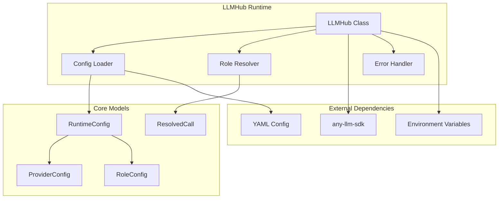

**Diagram sources**
- [hub.py](file://packages/llmhub_runtime/src/llmhub_runtime/hub.py#L17-L189)
- [config_loader.py](file://packages/llmhub_runtime/src/llmhub_runtime/config_loader.py#L6-L43)
- [resolver.py](file://packages/llmhub_runtime/src/llmhub_runtime/resolver.py#L5-L44)
- [models.py](file://packages/llmhub_runtime/src/llmhub_runtime/models.py#L13-L41)

## LLMHub Class Design

The LLMHub class is designed as a stateful execution context that manages LLM interactions through a clean interface:

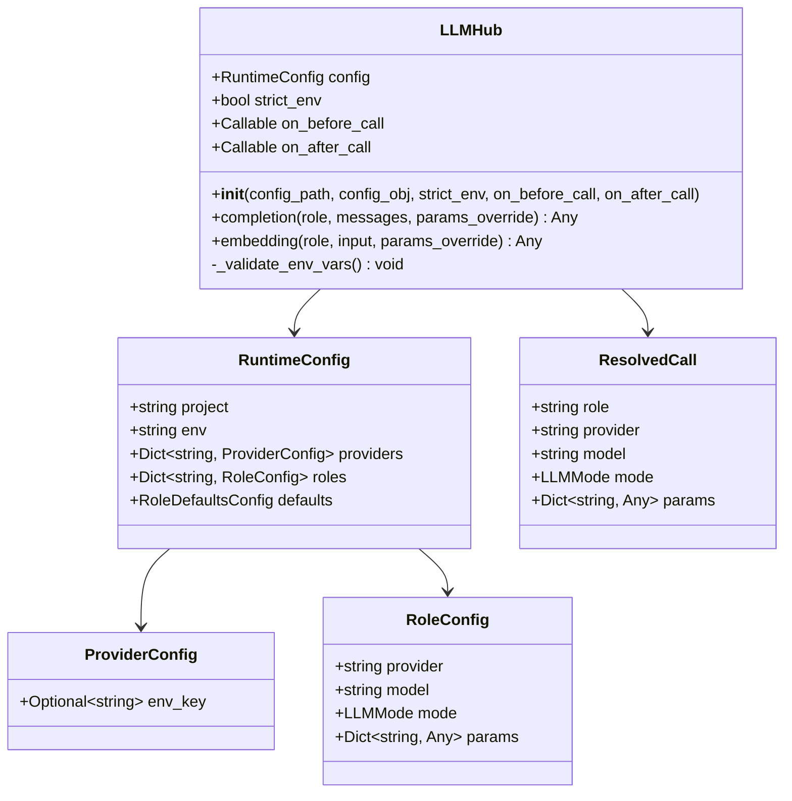

**Diagram sources**
- [hub.py](file://packages/llmhub_runtime/src/llmhub_runtime/hub.py#L17-L54)
- [models.py](file://packages/llmhub_runtime/src/llmhub_runtime/models.py#L13-L41)

**Section sources**
- [hub.py](file://packages/llmhub_runtime/src/llmhub_runtime/hub.py#L17-L54)
- [models.py](file://packages/llmhub_runtime/src/llmhub_runtime/models.py#L13-L41)

## Initialization Process

The LLMHub initialization process involves several critical steps that ensure proper configuration and environment validation:

### Configuration Loading Options

The constructor accepts two mutually exclusive configuration loading approaches:

1. **File-based Configuration**: Load from YAML file path
2. **Object-based Configuration**: Use pre-loaded RuntimeConfig object

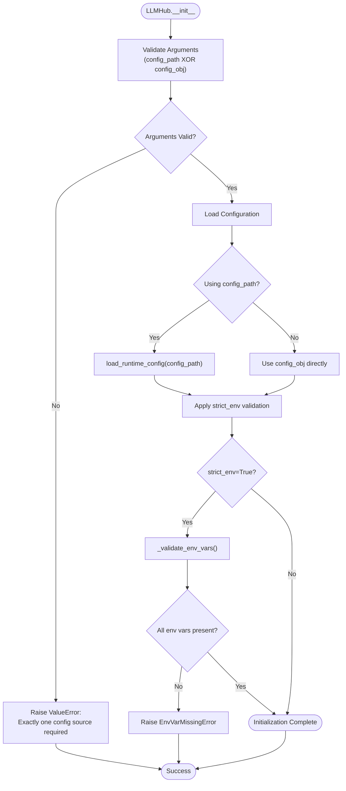

**Diagram sources**
- [hub.py](file://packages/llmhub_runtime/src/llmhub_runtime/hub.py#L39-L54)
- [config_loader.py](file://packages/llmhub_runtime/src/llmhub_runtime/config_loader.py#L6-L25)

### Strict Environment Validation

When `strict_env=True`, the initialization process performs comprehensive environment validation:

- Iterates through all providers in the configuration
- Checks for the presence of required environment variables
- Raises `EnvVarMissingError` if any required variable is missing

**Section sources**
- [hub.py](file://packages/llmhub_runtime/src/llmhub_runtime/hub.py#L39-L54)
- [config_loader.py](file://packages/llmhub_runtime/src/llmhub_runtime/config_loader.py#L6-L43)

## Core Methods

### Completion Method

The `completion()` method handles chat completion requests with comprehensive parameter management:

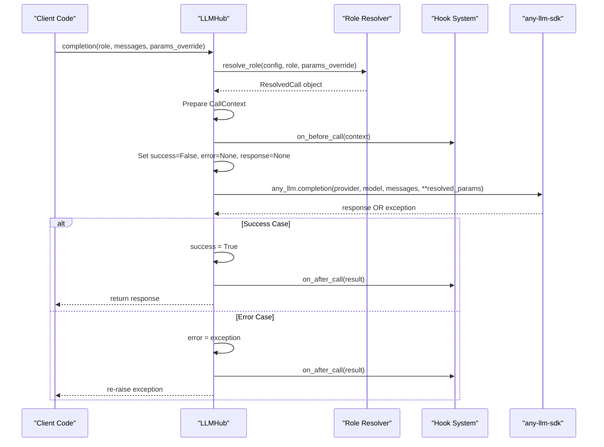

**Diagram sources**
- [hub.py](file://packages/llmhub_runtime/src/llmhub_runtime/hub.py#L61-L126)

#### Parameters and Execution Flow

The completion method accepts three primary parameters:

- **role**: Logical identifier for the LLM role to use
- **messages**: List of chat messages in standard format
- **params_override**: Optional parameter overrides for this specific call

The execution flow includes:
1. Role resolution through the resolver system
2. Context preparation for hooks
3. Pre-call hook execution
4. Dependency validation and SDK invocation
5. Post-call result processing
6. Error handling and cleanup

### Embedding Method

The `embedding()` method provides vector embedding generation with similar patterns:

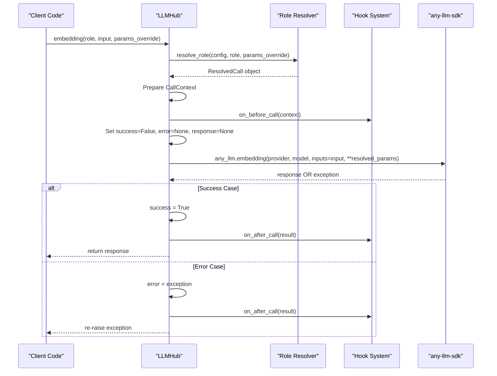

**Diagram sources**
- [hub.py](file://packages/llmhub_runtime/src/llmhub_runtime/hub.py#L127-L189)

**Section sources**
- [hub.py](file://packages/llmhub_runtime/src/llmhub_runtime/hub.py#L61-L189)

## Hook System

The LLMHub implements a sophisticated hook system for monitoring and extending LLM interactions:

### CallContext and CallResult Data Structures

The hook system uses typed dictionaries for structured data passing:

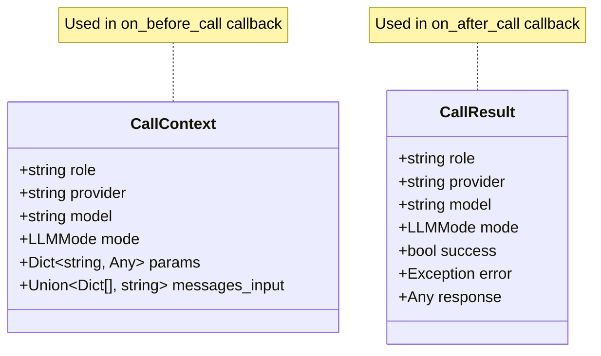

**Diagram sources**
- [hub.py](file://packages/llmhub_runtime/src/llmhub_runtime/hub.py#L14-L15)

### Hook Implementation Pattern

Both completion and embedding methods implement identical hook patterns:

1. **Pre-execution Hook**: Called before any-llm-sdk invocation
2. **Try-Finally Block**: Ensures hooks execute regardless of outcome
3. **Post-execution Hook**: Called after completion with result context

### Error Handling in Hooks

The try-finally implementation guarantees hook execution even when exceptions occur:

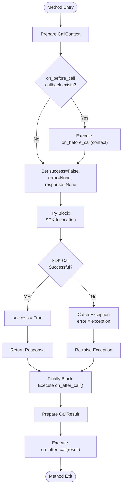

**Diagram sources**
- [hub.py](file://packages/llmhub_runtime/src/llmhub_runtime/hub.py#L98-L126)
- [hub.py](file://packages/llmhub_runtime/src/llmhub_runtime/hub.py#L162-L189)

**Section sources**
- [hub.py](file://packages/llmhub_runtime/src/llmhub_runtime/hub.py#L14-L15)
- [hub.py](file://packages/llmhub_runtime/src/llmhub_runtime/hub.py#L98-L189)

## Configuration Management

### Configuration Loading Pipeline

The configuration management system follows a robust pipeline:

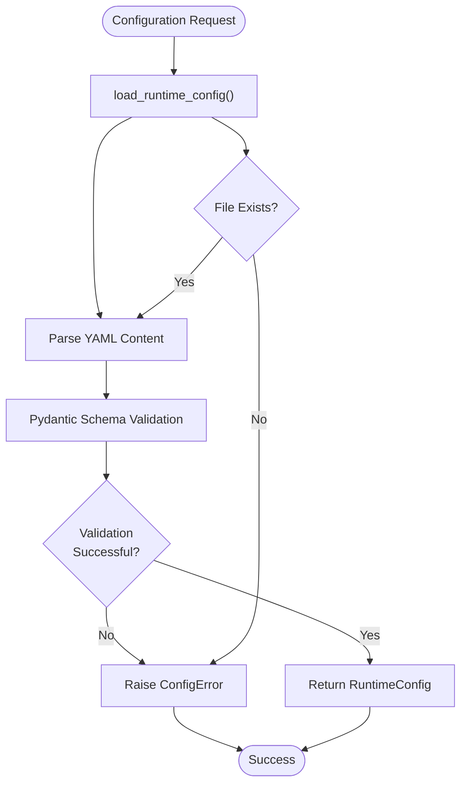

**Diagram sources**
- [config_loader.py](file://packages/llmhub_runtime/src/llmhub_runtime/config_loader.py#L6-L43)

### Role Resolution System

The resolver maps logical role names to concrete provider/model combinations:

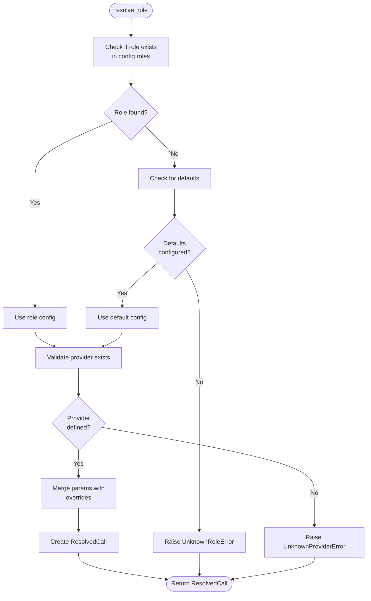

**Diagram sources**
- [resolver.py](file://packages/llmhub_runtime/src/llmhub_runtime/resolver.py#L5-L44)

**Section sources**
- [config_loader.py](file://packages/llmhub_runtime/src/llmhub_runtime/config_loader.py#L6-L43)
- [resolver.py](file://packages/llmhub_runtime/src/llmhub_runtime/resolver.py#L5-L44)

## Error Handling

The LLMHub implements comprehensive error handling across multiple layers:

### Error Classification

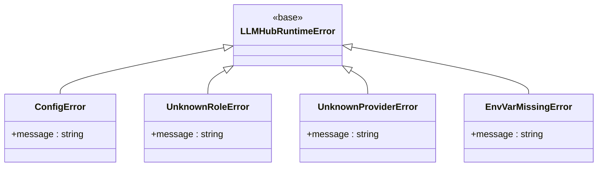

**Diagram sources**
- [errors.py](file://packages/llmhub_runtime/src/llmhub_runtime/errors.py#L1-L20)

### Error Propagation Patterns

The error handling follows consistent patterns across methods:

1. **Initialization Errors**: Raised immediately during construction
2. **Runtime Errors**: Caught and re-raised after cleanup
3. **Validation Errors**: Thrown with descriptive messages

**Section sources**
- [errors.py](file://packages/llmhub_runtime/src/llmhub_runtime/errors.py#L1-L20)
- [hub.py](file://packages/llmhub_runtime/src/llmhub_runtime/hub.py#L39-L54)

## Usage Examples

### Basic Synchronous Usage

```python
# Initialize with file-based configuration
hub = LLMHub(config_path="./llmhub.yaml")

# Perform chat completion
response = hub.completion(
    role="llm.inference",
    messages=[
        {"role": "system", "content": "You are a helpful assistant."},
        {"role": "user", "content": "Hello, world!"}
    ]
)

# Generate embeddings
embedding = hub.embedding(
    role="llm.embedding",
    input="This is a test sentence."
)
```

### Advanced Usage with Hooks

```python
def log_before_call(context):
    print(f"Calling {context['provider']}::{context['model']} for role {context['role']}")

def log_after_call(result):
    if result['success']:
        print(f"Success: {result['response']}")
    else:
        print(f"Error: {result['error']}")

hub = LLMHub(
    config_path="./llmhub.yaml",
    on_before_call=log_before_call,
    on_after_call=log_after_call
)

# Both completion and embedding calls will trigger hooks
response = hub.completion("llm.inference", [{"role": "user", "content": "Hi"}])
```

### Error Handling Scenarios

```python
try:
    hub = LLMHub(config_path="./nonexistent.yaml")
except FileNotFoundError:
    print("Configuration file not found")

try:
    response = hub.completion("unknown_role", [])
except UnknownRoleError as e:
    print(f"Role not found: {e}")

try:
    response = hub.completion("llm.inference", [])
except Exception as e:
    print(f"LLM call failed: {e}")
```

**Section sources**
- [test_hub_basic.py](file://packages/llmhub_runtime/tests/test_hub_basic.py#L40-L79)
- [llmhub.yaml](file://packages/llmhub_runtime/tests/fixtures/llmhub.yaml#L1-L51)

## Performance Considerations

### Dependency Loading Optimization

The LLMHub implements lazy loading for the any-llm-sdk dependency:

- **Import-time**: Module-level import with fallback
- **Runtime**: Import check at method execution
- **Error Handling**: Clear ImportError with installation instructions

### Memory Management

The class maintains efficient memory usage through:

- **Minimal State**: Only essential configuration stored
- **Context Isolation**: Separate contexts for each operation
- **Resource Cleanup**: Proper exception handling in try-finally blocks

### Caching Opportunities

Potential optimizations include:

- **Role Resolution Caching**: Cache resolved configurations
- **Provider Validation**: Cache provider availability checks
- **Environment Validation**: Cache environment variable checks

## Integration Patterns

### CLI Integration

The LLMHub integrates seamlessly with the CLI system:

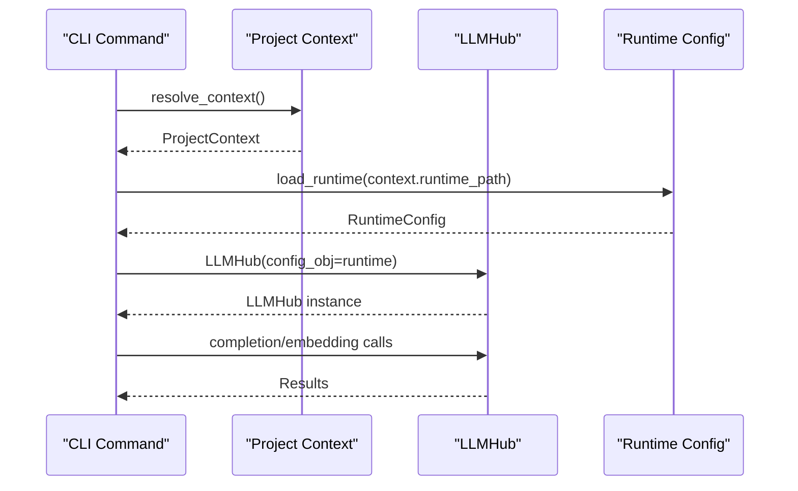

**Diagram sources**
- [cli.py](file://packages/llmhub/src/llmhub/cli.py#L1-L67)
- [context.py](file://packages/llmhub/src/llmhub/context.py#L49-L90)

### Workflow Orchestration

The LLMHub serves as the central orchestrator in the LLMHub ecosystem:

1. **Setup Phase**: CLI creates initial configuration
2. **Generation Phase**: CLI generates runtime from spec
3. **Execution Phase**: LLMHub executes LLM calls
4. **Monitoring Phase**: Hooks provide observability

**Section sources**
- [cli.py](file://packages/llmhub/src/llmhub/cli.py#L1-L67)
- [context.py](file://packages/llmhub/src/llmhub/context.py#L49-L90)
- [runtime_cmd.py](file://packages/llmhub/src/llmhub/commands/runtime_cmd.py#L1-L156)
- [setup_cmd.py](file://packages/llmhub/src/llmhub/commands/setup_cmd.py#L1-L215)

## Troubleshooting Guide

### Common Issues and Solutions

| Issue | Symptoms | Solution |
|-------|----------|----------|
| Missing Configuration | `ConfigError` during initialization | Run `llmhub generate` to create runtime config |
| Missing Environment Variables | `EnvVarMissingError` | Set required environment variables or disable strict validation |
| SDK Not Installed | `ImportError` during method calls | Install any-llm-sdk: `pip install any-llm-sdk` |
| Unknown Role | `UnknownRoleError` | Verify role exists in runtime configuration |
| Unknown Provider | `UnknownProviderError` | Add provider to configuration or use existing provider |

### Debugging Strategies

1. **Configuration Validation**: Use CLI commands to validate setup
2. **Hook Monitoring**: Implement logging hooks to track execution
3. **Error Context**: Examine CallResult objects for detailed error information
4. **Environment Inspection**: Verify environment variable availability

### Performance Tuning

- **Connection Pooling**: Configure provider-specific connection pooling
- **Async Operations**: Consider async alternatives for high-throughput scenarios
- **Caching Layers**: Implement application-level caching for repeated calls
- **Batch Processing**: Group multiple operations when possible

**Section sources**
- [test_hub_basic.py](file://packages/llmhub_runtime/tests/test_hub_basic.py#L27-L38)
- [hub.py](file://packages/llmhub_runtime/src/llmhub_runtime/hub.py#L99-L101)